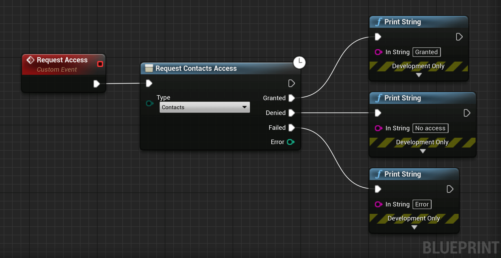

- Ultimate iOS Toolkit
  - [Plugin details](/)
- Get Started
  - [C++](/getstartedcpp)
  - [Rebuild the Plugin](/rebuildplugin)
- Biometry
  - [Get Started](/biometry/getstarted)
  - [Authenticate](/biometry/authenticate)
- CloudKit
  - [Coming Soon]()
- Contacts
  - [Get Started](/contacts/getstarted)  
  - [Request Access](/contacts/requestaccess)
  - [Editing Contacts](/contacts/edit)
  - [Fetching Contacts](/contacts/fetch)
- Core Location
  - [Get Started](/location/getstarted)
  - [iOS 15 Button](/location/button)
  - [Location Manager](/location/manager)
- Device
  - [Use Flashlight](/device/flashlight)
  - [Get Device Info](/device/info)
  - [Get Battery Info](/device/battery)
- GameKit
  - [Coming Soon]()
- Haptic
  - [Impact](/haptic/impact)
  - [Notification](/haptic/notification)
  - [Selection](/haptic/selection)
- Motion
  - [Get Started](/motion/getstarted)
- Notification
  - [Coming Soon]()
- Sign-In
  - [Get Started](/signinwithapple/getstarted)
  - [Signing In](/signinwithapple/signin)
  - [Get Credential State](/signinwithapple/credentialstate)
- StoreKit
  - [Coming Soon]()
- UI
  - [Modals](/ui/alertmodal)
  - [Safari View](/ui/safariview)
  - [Color Picker](/ui/colorpicker)
  - [Definition](/ui/definition)
  - [Image Picker](/ui/imagepicker)
  - [Send Message](/ui/sendmessage)
  - [Send Email](/ui/sendemail)
  - [Request Review](/ui/review)
  - [Date Picker](/ui/datepicker) 
  - [Share](/ui/share)
- Misc
  - [Take Screenshots](/misc/screenshot)
  - [Open Other Apps](/misc/openapps)
  - [Get Device Theme](/misc/theme)
- Support
  - [Frequently Asked Questions](/frequentlyaskedquestions)
  - [Troubleshooting](/troubleshooting)
  - [Common Issues](/commonissues)
  - [Contact](/contact)

<!--
<div class="code-switcher show-cpp-true">
<div class="switcher" >
<span class="sw-bp" onclick="switchBp()">Blueprints</span><span class="sw-cpp" onclick="switchCpp()">C++</span>
</div>
<div class="cpp">

```cpp
```

</div>
<div class="bp">
<div class="bpcode">
<textarea readonly>
</textarea>

<button onclick="copyBlueprintCode(this)">Copy Code</button>
</div>
</div>
</div>
-->

