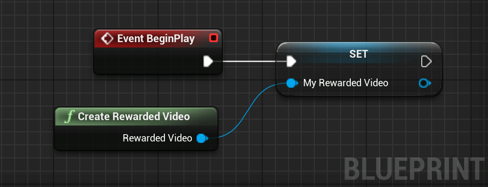
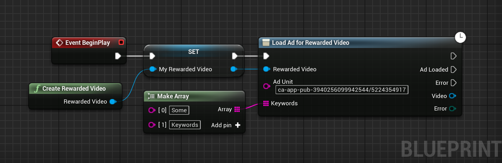
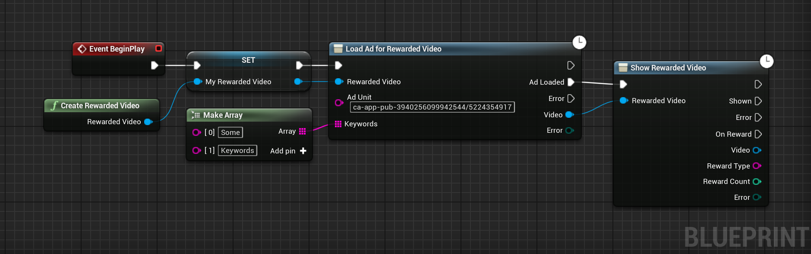

# Rewarded Video - Blueprint Examples
This section contains examples on how to use Rewarded Videos with Blueprints.
## Creating a Rewarded Video
To use an Rewarded Video, we first have to create one. You can create an Rewarded Video with the `Create Rewarded Video` Blueprint node.

<textarea readonly>
Begin Object Class=/Script/BlueprintGraph.K2Node_Event Name="K2Node_Event_4"
   EventReference=(MemberParent=Class'"/Script/Engine.Actor"',MemberName="ReceiveBeginPlay")
   bOverrideFunction=True
   NodePosX=-1232
   NodePosY=-3264
   NodeGuid=A66CDC5B47996965610A4999D14A8817
   CustomProperties Pin (PinId=6148E00247D433F976646085B91B91C2,PinName="OutputDelegate",Direction="EGPD_Output",PinType.PinCategory="delegate",PinType.PinSubCategory="",PinType.PinSubCategoryObject=None,PinType.PinSubCategoryMemberReference=(MemberParent=Class'"/Script/Engine.Actor"',MemberName="ReceiveBeginPlay"),PinType.PinValueType=(),PinType.ContainerType=None,PinType.bIsReference=False,PinType.bIsConst=False,PinType.bIsWeakPointer=False,PinType.bIsUObjectWrapper=False,PersistentGuid=00000000000000000000000000000000,bHidden=False,bNotConnectable=False,bDefaultValueIsReadOnly=False,bDefaultValueIsIgnored=False,bAdvancedView=False,bOrphanedPin=False,)
   CustomProperties Pin (PinId=118586BB4EA9470F8087FD820D560415,PinName="then",Direction="EGPD_Output",PinType.PinCategory="exec",PinType.PinSubCategory="",PinType.PinSubCategoryObject=None,PinType.PinSubCategoryMemberReference=(),PinType.PinValueType=(),PinType.ContainerType=None,PinType.bIsReference=False,PinType.bIsConst=False,PinType.bIsWeakPointer=False,PinType.bIsUObjectWrapper=False,LinkedTo=(K2Node_VariableSet_0 E250A8BB49F89AD16A7D4980079121BA,),PersistentGuid=00000000000000000000000000000000,bHidden=False,bNotConnectable=False,bDefaultValueIsReadOnly=False,bDefaultValueIsIgnored=False,bAdvancedView=False,bOrphanedPin=False,)
End Object
Begin Object Class=/Script/BlueprintGraph.K2Node_CallFunction Name="K2Node_CallFunction_5"
   bIsPureFunc=True
   FunctionReference=(MemberParent=Class'"/Script/AdsPro.AdMobBlueprintLibrary"',MemberName="CreateAdMobRewardedVideo")
   NodePosX=-1280
   NodePosY=-3168
   NodeGuid=C8E63C03494A3EECEBB349A010D3B3D9
   CustomProperties Pin (PinId=EDEB0FA94FAB4C83D8257A89306E5BDC,PinName="self",PinFriendlyName=NSLOCTEXT("K2Node", "Target", "Target"),PinToolTip="Target\nAd Mob Blueprint Library Object Reference",PinType.PinCategory="object",PinType.PinSubCategory="",PinType.PinSubCategoryObject=Class'"/Script/AdsPro.AdMobBlueprintLibrary"',PinType.PinSubCategoryMemberReference=(),PinType.PinValueType=(),PinType.ContainerType=None,PinType.bIsReference=False,PinType.bIsConst=False,PinType.bIsWeakPointer=False,PinType.bIsUObjectWrapper=False,DefaultObject="/Script/AdsPro.Default__AdMobBlueprintLibrary",PersistentGuid=00000000000000000000000000000000,bHidden=True,bNotConnectable=False,bDefaultValueIsReadOnly=False,bDefaultValueIsIgnored=False,bAdvancedView=False,bOrphanedPin=False,)
   CustomProperties Pin (PinId=1DF363734A5642546494DE9EF4AFBB1A,PinName="ReturnValue",PinFriendlyName="Rewarded Video",PinToolTip="Rewarded Video\nAd Mob Rewarded Video Object Reference\n\nA new AdMob Rewarded Video.",Direction="EGPD_Output",PinType.PinCategory="object",PinType.PinSubCategory="",PinType.PinSubCategoryObject=Class'"/Script/AdsPro.AdMobRewardedVideo"',PinType.PinSubCategoryMemberReference=(),PinType.PinValueType=(),PinType.ContainerType=None,PinType.bIsReference=False,PinType.bIsConst=False,PinType.bIsWeakPointer=False,PinType.bIsUObjectWrapper=False,LinkedTo=(K2Node_VariableSet_0 A02EB99340488DDE8C9DAEB1F7AF046C,),PersistentGuid=00000000000000000000000000000000,bHidden=False,bNotConnectable=False,bDefaultValueIsReadOnly=False,bDefaultValueIsIgnored=False,bAdvancedView=False,bOrphanedPin=False,)
End Object
Begin Object Class=/Script/BlueprintGraph.K2Node_VariableSet Name="K2Node_VariableSet_0"
   VariableReference=(MemberName="MyRewardedVideo",MemberGuid=3F67B07D4E1DF5D962FD869ECFA0BD23,bSelfContext=True)
   NodePosX=-1008
   NodePosY=-3248
   NodeGuid=0C68B1784CEF359CC6998B8730003DDC
   CustomProperties Pin (PinId=E250A8BB49F89AD16A7D4980079121BA,PinName="execute",PinType.PinCategory="exec",PinType.PinSubCategory="",PinType.PinSubCategoryObject=None,PinType.PinSubCategoryMemberReference=(),PinType.PinValueType=(),PinType.ContainerType=None,PinType.bIsReference=False,PinType.bIsConst=False,PinType.bIsWeakPointer=False,PinType.bIsUObjectWrapper=True,LinkedTo=(K2Node_Event_4 118586BB4EA9470F8087FD820D560415,),PersistentGuid=00000000000000000000000000000000,bHidden=False,bNotConnectable=False,bDefaultValueIsReadOnly=False,bDefaultValueIsIgnored=False,bAdvancedView=False,bOrphanedPin=False,)
   CustomProperties Pin (PinId=2CDD1B4B4B4D225D59ABCDAED7CFA9CD,PinName="then",Direction="EGPD_Output",PinType.PinCategory="exec",PinType.PinSubCategory="",PinType.PinSubCategoryObject=None,PinType.PinSubCategoryMemberReference=(),PinType.PinValueType=(),PinType.ContainerType=None,PinType.bIsReference=False,PinType.bIsConst=False,PinType.bIsWeakPointer=False,PinType.bIsUObjectWrapper=True,PersistentGuid=00000000000000000000000000000000,bHidden=False,bNotConnectable=False,bDefaultValueIsReadOnly=False,bDefaultValueIsIgnored=False,bAdvancedView=False,bOrphanedPin=False,)
   CustomProperties Pin (PinId=A02EB99340488DDE8C9DAEB1F7AF046C,PinName="MyRewardedVideo",PinType.PinCategory="object",PinType.PinSubCategory="",PinType.PinSubCategoryObject=Class'"/Script/AdsPro.AdMobRewardedVideo"',PinType.PinSubCategoryMemberReference=(),PinType.PinValueType=(),PinType.ContainerType=None,PinType.bIsReference=False,PinType.bIsConst=False,PinType.bIsWeakPointer=False,PinType.bIsUObjectWrapper=False,LinkedTo=(K2Node_CallFunction_5 1DF363734A5642546494DE9EF4AFBB1A,),PersistentGuid=00000000000000000000000000000000,bHidden=False,bNotConnectable=False,bDefaultValueIsReadOnly=False,bDefaultValueIsIgnored=False,bAdvancedView=False,bOrphanedPin=False,)
   CustomProperties Pin (PinId=CBAE02FB4267F636DF0909867AEB7E90,PinName="self",PinFriendlyName=NSLOCTEXT("K2Node", "Target", "Target"),PinType.PinCategory="object",PinType.PinSubCategory="",PinType.PinSubCategoryObject=BlueprintGeneratedClass'"/Game/DemoActor.DemoActor_C"',PinType.PinSubCategoryMemberReference=(),PinType.PinValueType=(),PinType.ContainerType=None,PinType.bIsReference=False,PinType.bIsConst=False,PinType.bIsWeakPointer=False,PinType.bIsUObjectWrapper=False,PersistentGuid=00000000000000000000000000000000,bHidden=True,bNotConnectable=False,bDefaultValueIsReadOnly=False,bDefaultValueIsIgnored=False,bAdvancedView=False,bOrphanedPin=False,)
   CustomProperties Pin (PinId=50E143D44364B5941CBBD2BDB6E2DA07,PinName="Output_Get",PinToolTip="Retrieves the value of the variable, can use instead of a separate Get node",Direction="EGPD_Output",PinType.PinCategory="object",PinType.PinSubCategory="",PinType.PinSubCategoryObject=Class'"/Script/AdsPro.AdMobRewardedVideo"',PinType.PinSubCategoryMemberReference=(),PinType.PinValueType=(),PinType.ContainerType=None,PinType.bIsReference=False,PinType.bIsConst=False,PinType.bIsWeakPointer=False,PinType.bIsUObjectWrapper=False,PersistentGuid=00000000000000000000000000000000,bHidden=False,bNotConnectable=False,bDefaultValueIsReadOnly=False,bDefaultValueIsIgnored=False,bAdvancedView=False,bOrphanedPin=False,)
End Object
</textarea>

<button onclick="copyBlueprintCode(this)">Copy Code</button>

!> It's important to store the Rewarded Video in a variable to prevent it from being garbage collected.

## Loading an Ad
Now that the Rewarded Video is initialized, it's time to load an ad that will be then shown to the user.  
To load an ad, call the `Load Ad for Rewarded Video` node.

<textarea readonly>
Begin Object Class=/Script/BlueprintGraph.K2Node_Event Name="K2Node_Event_4"
   EventReference=(MemberParent=Class'"/Script/Engine.Actor"',MemberName="ReceiveBeginPlay")
   bOverrideFunction=True
   NodePosX=-1424
   NodePosY=-3472
   NodeGuid=CEDBE62B4192228AA3647395262E0C88
   CustomProperties Pin (PinId=6148E00247D433F976646085B91B91C2,PinName="OutputDelegate",Direction="EGPD_Output",PinType.PinCategory="delegate",PinType.PinSubCategory="",PinType.PinSubCategoryObject=None,PinType.PinSubCategoryMemberReference=(MemberParent=Class'"/Script/Engine.Actor"',MemberName="ReceiveBeginPlay"),PinType.PinValueType=(),PinType.ContainerType=None,PinType.bIsReference=False,PinType.bIsConst=False,PinType.bIsWeakPointer=False,PinType.bIsUObjectWrapper=False,PersistentGuid=00000000000000000000000000000000,bHidden=False,bNotConnectable=False,bDefaultValueIsReadOnly=False,bDefaultValueIsIgnored=False,bAdvancedView=False,bOrphanedPin=False,)
   CustomProperties Pin (PinId=118586BB4EA9470F8087FD820D560415,PinName="then",Direction="EGPD_Output",PinType.PinCategory="exec",PinType.PinSubCategory="",PinType.PinSubCategoryObject=None,PinType.PinSubCategoryMemberReference=(),PinType.PinValueType=(),PinType.ContainerType=None,PinType.bIsReference=False,PinType.bIsConst=False,PinType.bIsWeakPointer=False,PinType.bIsUObjectWrapper=False,LinkedTo=(K2Node_VariableSet_0 E250A8BB49F89AD16A7D4980079121BA,),PersistentGuid=00000000000000000000000000000000,bHidden=False,bNotConnectable=False,bDefaultValueIsReadOnly=False,bDefaultValueIsIgnored=False,bAdvancedView=False,bOrphanedPin=False,)
End Object
Begin Object Class=/Script/BlueprintGraph.K2Node_CallFunction Name="K2Node_CallFunction_5"
   bIsPureFunc=True
   FunctionReference=(MemberParent=Class'"/Script/AdsPro.AdMobBlueprintLibrary"',MemberName="CreateAdMobRewardedVideo")
   NodePosX=-1472
   NodePosY=-3376
   NodeGuid=90F0A68041E5691E7D49B79591FDCABC
   CustomProperties Pin (PinId=EDEB0FA94FAB4C83D8257A89306E5BDC,PinName="self",PinFriendlyName=NSLOCTEXT("K2Node", "Target", "Target"),PinType.PinCategory="object",PinType.PinSubCategory="",PinType.PinSubCategoryObject=Class'"/Script/AdsPro.AdMobBlueprintLibrary"',PinType.PinSubCategoryMemberReference=(),PinType.PinValueType=(),PinType.ContainerType=None,PinType.bIsReference=False,PinType.bIsConst=False,PinType.bIsWeakPointer=False,PinType.bIsUObjectWrapper=False,DefaultObject="/Script/AdsPro.Default__AdMobBlueprintLibrary",PersistentGuid=00000000000000000000000000000000,bHidden=True,bNotConnectable=False,bDefaultValueIsReadOnly=False,bDefaultValueIsIgnored=False,bAdvancedView=False,bOrphanedPin=False,)
   CustomProperties Pin (PinId=1DF363734A5642546494DE9EF4AFBB1A,PinName="ReturnValue",PinFriendlyName=NSLOCTEXT("", "14D9492F4E93C5F6CF57498B67465550", "Rewarded Video"),Direction="EGPD_Output",PinType.PinCategory="object",PinType.PinSubCategory="",PinType.PinSubCategoryObject=Class'"/Script/AdsPro.AdMobRewardedVideo"',PinType.PinSubCategoryMemberReference=(),PinType.PinValueType=(),PinType.ContainerType=None,PinType.bIsReference=False,PinType.bIsConst=False,PinType.bIsWeakPointer=False,PinType.bIsUObjectWrapper=False,LinkedTo=(K2Node_VariableSet_0 A02EB99340488DDE8C9DAEB1F7AF046C,),PersistentGuid=00000000000000000000000000000000,bHidden=False,bNotConnectable=False,bDefaultValueIsReadOnly=False,bDefaultValueIsIgnored=False,bAdvancedView=False,bOrphanedPin=False,)
End Object
Begin Object Class=/Script/BlueprintGraph.K2Node_VariableSet Name="K2Node_VariableSet_0"
   VariableReference=(MemberName="MyRewardedVideo",MemberGuid=3F67B07D4E1DF5D962FD869ECFA0BD23,bSelfContext=True)
   NodePosX=-1232
   NodePosY=-3456
   NodeGuid=715D9DE34EB1DB08F062FA802F751781
   CustomProperties Pin (PinId=E250A8BB49F89AD16A7D4980079121BA,PinName="execute",PinType.PinCategory="exec",PinType.PinSubCategory="",PinType.PinSubCategoryObject=None,PinType.PinSubCategoryMemberReference=(),PinType.PinValueType=(),PinType.ContainerType=None,PinType.bIsReference=False,PinType.bIsConst=False,PinType.bIsWeakPointer=False,PinType.bIsUObjectWrapper=False,LinkedTo=(K2Node_Event_4 118586BB4EA9470F8087FD820D560415,),PersistentGuid=00000000000000000000000000000000,bHidden=False,bNotConnectable=False,bDefaultValueIsReadOnly=False,bDefaultValueIsIgnored=False,bAdvancedView=False,bOrphanedPin=False,)
   CustomProperties Pin (PinId=2CDD1B4B4B4D225D59ABCDAED7CFA9CD,PinName="then",Direction="EGPD_Output",PinType.PinCategory="exec",PinType.PinSubCategory="",PinType.PinSubCategoryObject=None,PinType.PinSubCategoryMemberReference=(),PinType.PinValueType=(),PinType.ContainerType=None,PinType.bIsReference=False,PinType.bIsConst=False,PinType.bIsWeakPointer=False,PinType.bIsUObjectWrapper=False,LinkedTo=(K2Node_AsyncAction_7 1138438C453B5912341D319AB79D6049,),PersistentGuid=00000000000000000000000000000000,bHidden=False,bNotConnectable=False,bDefaultValueIsReadOnly=False,bDefaultValueIsIgnored=False,bAdvancedView=False,bOrphanedPin=False,)
   CustomProperties Pin (PinId=A02EB99340488DDE8C9DAEB1F7AF046C,PinName="MyRewardedVideo",PinType.PinCategory="object",PinType.PinSubCategory="",PinType.PinSubCategoryObject=Class'"/Script/AdsPro.AdMobRewardedVideo"',PinType.PinSubCategoryMemberReference=(),PinType.PinValueType=(),PinType.ContainerType=None,PinType.bIsReference=False,PinType.bIsConst=False,PinType.bIsWeakPointer=False,PinType.bIsUObjectWrapper=False,LinkedTo=(K2Node_CallFunction_5 1DF363734A5642546494DE9EF4AFBB1A,),PersistentGuid=00000000000000000000000000000000,bHidden=False,bNotConnectable=False,bDefaultValueIsReadOnly=False,bDefaultValueIsIgnored=False,bAdvancedView=False,bOrphanedPin=False,)
   CustomProperties Pin (PinId=50E143D44364B5941CBBD2BDB6E2DA07,PinName="Output_Get",PinToolTip="Retrieves the value of the variable, can use instead of a separate Get node",Direction="EGPD_Output",PinType.PinCategory="object",PinType.PinSubCategory="",PinType.PinSubCategoryObject=Class'"/Script/AdsPro.AdMobRewardedVideo"',PinType.PinSubCategoryMemberReference=(),PinType.PinValueType=(),PinType.ContainerType=None,PinType.bIsReference=False,PinType.bIsConst=False,PinType.bIsWeakPointer=False,PinType.bIsUObjectWrapper=False,LinkedTo=(K2Node_AsyncAction_7 780477734FF9E2738AE1279E6D3D255E,),PersistentGuid=00000000000000000000000000000000,bHidden=False,bNotConnectable=False,bDefaultValueIsReadOnly=False,bDefaultValueIsIgnored=False,bAdvancedView=False,bOrphanedPin=False,)
   CustomProperties Pin (PinId=CBAE02FB4267F636DF0909867AEB7E90,PinName="self",PinFriendlyName=NSLOCTEXT("K2Node", "Target", "Target"),PinType.PinCategory="object",PinType.PinSubCategory="",PinType.PinSubCategoryObject=BlueprintGeneratedClass'"/Game/DemoActor.DemoActor_C"',PinType.PinSubCategoryMemberReference=(),PinType.PinValueType=(),PinType.ContainerType=None,PinType.bIsReference=False,PinType.bIsConst=False,PinType.bIsWeakPointer=False,PinType.bIsUObjectWrapper=False,PersistentGuid=00000000000000000000000000000000,bHidden=True,bNotConnectable=False,bDefaultValueIsReadOnly=False,bDefaultValueIsIgnored=False,bAdvancedView=False,bOrphanedPin=False,)
End Object
Begin Object Class=/Script/BlueprintGraph.K2Node_AsyncAction Name="K2Node_AsyncAction_7"
   ProxyFactoryFunctionName="LoadAdRewardedVideo"
   ProxyFactoryClass=Class'"/Script/AdsPro.AdMobLoadAdRewardedVideo"'
   ProxyClass=Class'"/Script/AdsPro.AdMobLoadAdRewardedVideo"'
   NodePosX=-992
   NodePosY=-3472
   NodeGuid=FE6582E24E099DBFB5BD1BA2453EC61E
   CustomProperties Pin (PinId=1138438C453B5912341D319AB79D6049,PinName="execute",PinToolTip="\nExec",PinType.PinCategory="exec",PinType.PinSubCategory="",PinType.PinSubCategoryObject=None,PinType.PinSubCategoryMemberReference=(),PinType.PinValueType=(),PinType.ContainerType=None,PinType.bIsReference=False,PinType.bIsConst=False,PinType.bIsWeakPointer=False,PinType.bIsUObjectWrapper=True,LinkedTo=(K2Node_VariableSet_0 2CDD1B4B4B4D225D59ABCDAED7CFA9CD,),PersistentGuid=00000000000000000000000000000000,bHidden=False,bNotConnectable=False,bDefaultValueIsReadOnly=False,bDefaultValueIsIgnored=False,bAdvancedView=False,bOrphanedPin=False,)
   CustomProperties Pin (PinId=C34F0DFC418CAE93D6B9C4A75B9A2333,PinName="then",Direction="EGPD_Output",PinType.PinCategory="exec",PinType.PinSubCategory="",PinType.PinSubCategoryObject=None,PinType.PinSubCategoryMemberReference=(),PinType.PinValueType=(),PinType.ContainerType=None,PinType.bIsReference=False,PinType.bIsConst=False,PinType.bIsWeakPointer=False,PinType.bIsUObjectWrapper=True,PersistentGuid=00000000000000000000000000000000,bHidden=False,bNotConnectable=False,bDefaultValueIsReadOnly=False,bDefaultValueIsIgnored=False,bAdvancedView=False,bOrphanedPin=False,)
   CustomProperties Pin (PinId=2727E2B44C560559F4E557BA1EE40047,PinName="AdLoaded",PinFriendlyName=NSLOCTEXT("", "3ECE46B1427F057D843FE9812C6569C9", "Ad Loaded"),PinToolTip="The ad has been loaded.",Direction="EGPD_Output",PinType.PinCategory="exec",PinType.PinSubCategory="",PinType.PinSubCategoryObject=None,PinType.PinSubCategoryMemberReference=(),PinType.PinValueType=(),PinType.ContainerType=None,PinType.bIsReference=False,PinType.bIsConst=False,PinType.bIsWeakPointer=False,PinType.bIsUObjectWrapper=True,PersistentGuid=00000000000000000000000000000000,bHidden=False,bNotConnectable=False,bDefaultValueIsReadOnly=False,bDefaultValueIsIgnored=False,bAdvancedView=False,bOrphanedPin=False,)
   CustomProperties Pin (PinId=B9537CDE4F39EA3E17E35281E4B62310,PinName="Error",PinFriendlyName=NSLOCTEXT("", "F947BA9D4949715AFB95A09E94822714", "Error"),PinToolTip="An error occured during the ad loading.",Direction="EGPD_Output",PinType.PinCategory="exec",PinType.PinSubCategory="",PinType.PinSubCategoryObject=None,PinType.PinSubCategoryMemberReference=(),PinType.PinValueType=(),PinType.ContainerType=None,PinType.bIsReference=False,PinType.bIsConst=False,PinType.bIsWeakPointer=False,PinType.bIsUObjectWrapper=True,PersistentGuid=00000000000000000000000000000000,bHidden=False,bNotConnectable=False,bDefaultValueIsReadOnly=False,bDefaultValueIsIgnored=False,bAdvancedView=False,bOrphanedPin=False,)
   CustomProperties Pin (PinId=DC331BB24FE4BE11BF521A97032852F1,PinName="Video",PinToolTip="Video",Direction="EGPD_Output",PinType.PinCategory="object",PinType.PinSubCategory="",PinType.PinSubCategoryObject=Class'"/Script/AdsPro.AdMobRewardedVideo"',PinType.PinSubCategoryMemberReference=(),PinType.PinValueType=(),PinType.ContainerType=None,PinType.bIsReference=False,PinType.bIsConst=False,PinType.bIsWeakPointer=False,PinType.bIsUObjectWrapper=False,PersistentGuid=00000000000000000000000000000000,bHidden=False,bNotConnectable=False,bDefaultValueIsReadOnly=False,bDefaultValueIsIgnored=False,bAdvancedView=False,bOrphanedPin=False,)
   CustomProperties Pin (PinId=985FD5D94114BC18B64A8C879D4542A1,PinName="Error",PinToolTip="Error",Direction="EGPD_Output",PinType.PinCategory="byte",PinType.PinSubCategory="",PinType.PinSubCategoryObject=Enum'"/Script/AdsPro.EAdMobError"',PinType.PinSubCategoryMemberReference=(),PinType.PinValueType=(),PinType.ContainerType=None,PinType.bIsReference=False,PinType.bIsConst=False,PinType.bIsWeakPointer=False,PinType.bIsUObjectWrapper=False,PersistentGuid=00000000000000000000000000000000,bHidden=False,bNotConnectable=False,bDefaultValueIsReadOnly=False,bDefaultValueIsIgnored=False,bAdvancedView=False,bOrphanedPin=False,)
   CustomProperties Pin (PinId=780477734FF9E2738AE1279E6D3D255E,PinName="RewardedVideo",PinToolTip="Rewarded Video\nAd Mob Rewarded Video Object Reference",PinType.PinCategory="object",PinType.PinSubCategory="",PinType.PinSubCategoryObject=Class'"/Script/AdsPro.AdMobRewardedVideo"',PinType.PinSubCategoryMemberReference=(),PinType.PinValueType=(),PinType.ContainerType=None,PinType.bIsReference=False,PinType.bIsConst=False,PinType.bIsWeakPointer=False,PinType.bIsUObjectWrapper=False,LinkedTo=(K2Node_VariableSet_0 50E143D44364B5941CBBD2BDB6E2DA07,),PersistentGuid=00000000000000000000000000000000,bHidden=False,bNotConnectable=False,bDefaultValueIsReadOnly=False,bDefaultValueIsIgnored=False,bAdvancedView=False,bOrphanedPin=False,)
   CustomProperties Pin (PinId=F45C254F4B704A9FC080DFA7E0087769,PinName="AdUnit",PinToolTip="Ad Unit\nString\n\nThe ad unit to use.",PinType.PinCategory="string",PinType.PinSubCategory="",PinType.PinSubCategoryObject=None,PinType.PinSubCategoryMemberReference=(),PinType.PinValueType=(),PinType.ContainerType=None,PinType.bIsReference=False,PinType.bIsConst=False,PinType.bIsWeakPointer=False,PinType.bIsUObjectWrapper=False,DefaultValue="ca-app-pub-3940256099942544/5224354917",PersistentGuid=00000000000000000000000000000000,bHidden=False,bNotConnectable=False,bDefaultValueIsReadOnly=False,bDefaultValueIsIgnored=False,bAdvancedView=False,bOrphanedPin=False,)
   CustomProperties Pin (PinId=9A6322384261DAD98238418B7246C950,PinName="Keywords",PinToolTip="Keywords\nArray of Strings\n\nThe keywords for the ad request.",PinType.PinCategory="string",PinType.PinSubCategory="",PinType.PinSubCategoryObject=None,PinType.PinSubCategoryMemberReference=(),PinType.PinValueType=(),PinType.ContainerType=Array,PinType.bIsReference=True,PinType.bIsConst=True,PinType.bIsWeakPointer=False,PinType.bIsUObjectWrapper=False,LinkedTo=(K2Node_MakeArray_1 33B7B4A440DCF7BD9AB9B0BD7EBB89F6,),PersistentGuid=00000000000000000000000000000000,bHidden=False,bNotConnectable=False,bDefaultValueIsReadOnly=False,bDefaultValueIsIgnored=True,bAdvancedView=False,bOrphanedPin=False,)
End Object
Begin Object Class=/Script/BlueprintGraph.K2Node_MakeArray Name="K2Node_MakeArray_1"
   NumInputs=2
   NodePosX=-1232
   NodePosY=-3360
   NodeGuid=541BD349429737F8A8D276BABED0DBD3
   CustomProperties Pin (PinId=33B7B4A440DCF7BD9AB9B0BD7EBB89F6,PinName="Array",Direction="EGPD_Output",PinType.PinCategory="string",PinType.PinSubCategory="",PinType.PinSubCategoryObject=None,PinType.PinSubCategoryMemberReference=(),PinType.PinValueType=(),PinType.ContainerType=Array,PinType.bIsReference=True,PinType.bIsConst=True,PinType.bIsWeakPointer=False,PinType.bIsUObjectWrapper=False,LinkedTo=(K2Node_AsyncAction_7 9A6322384261DAD98238418B7246C950,),PersistentGuid=00000000000000000000000000000000,bHidden=False,bNotConnectable=False,bDefaultValueIsReadOnly=False,bDefaultValueIsIgnored=False,bAdvancedView=False,bOrphanedPin=False,)
   CustomProperties Pin (PinId=46791D2B453FF3A0FA7FAAB1F19FCB9A,PinName="[0]",PinType.PinCategory="string",PinType.PinSubCategory="",PinType.PinSubCategoryObject=None,PinType.PinSubCategoryMemberReference=(),PinType.PinValueType=(),PinType.ContainerType=None,PinType.bIsReference=False,PinType.bIsConst=False,PinType.bIsWeakPointer=False,PinType.bIsUObjectWrapper=False,DefaultValue="Some",PersistentGuid=00000000000000000000000000000000,bHidden=False,bNotConnectable=False,bDefaultValueIsReadOnly=False,bDefaultValueIsIgnored=False,bAdvancedView=False,bOrphanedPin=False,)
   CustomProperties Pin (PinId=6DB03FBE40C054414411AB9C884643C1,PinName="[1]",PinType.PinCategory="string",PinType.PinSubCategory="",PinType.PinSubCategoryObject=None,PinType.PinSubCategoryMemberReference=(),PinType.PinValueType=(),PinType.ContainerType=None,PinType.bIsReference=False,PinType.bIsConst=False,PinType.bIsWeakPointer=False,PinType.bIsUObjectWrapper=False,DefaultValue="Keywords",PersistentGuid=00000000000000000000000000000000,bHidden=False,bNotConnectable=False,bDefaultValueIsReadOnly=False,bDefaultValueIsIgnored=False,bAdvancedView=False,bOrphanedPin=False,)
End Object
</textarea>

<button onclick="copyBlueprintCode(this)">Copy Code</button>

!> If you plan to show a Rewarded Video during a precise time as for level transition, you should load the ad *before* so the ad
is ready when you want to show it.

## Showing the Rewarded Video
To show the Rewarded Video, simply use the `Show Rewarded Video` node.

<textarea readonly>
Begin Object Class=/Script/BlueprintGraph.K2Node_Event Name="K2Node_Event_2"
   EventReference=(MemberParent=Class'"/Script/Engine.Actor"',MemberName="ReceiveBeginPlay")
   bOverrideFunction=True
   NodePosX=-1424
   NodePosY=-3472
   NodeGuid=CEDBE62B4192228AA3647395262E0C88
   CustomProperties Pin (PinId=6148E00247D433F976646085B91B91C2,PinName="OutputDelegate",Direction="EGPD_Output",PinType.PinCategory="delegate",PinType.PinSubCategory="",PinType.PinSubCategoryObject=None,PinType.PinSubCategoryMemberReference=(MemberParent=Class'"/Script/Engine.Actor"',MemberName="ReceiveBeginPlay"),PinType.PinValueType=(),PinType.ContainerType=None,PinType.bIsReference=False,PinType.bIsConst=False,PinType.bIsWeakPointer=False,PinType.bIsUObjectWrapper=False,PersistentGuid=00000000000000000000000000000000,bHidden=False,bNotConnectable=False,bDefaultValueIsReadOnly=False,bDefaultValueIsIgnored=False,bAdvancedView=False,bOrphanedPin=False,)
   CustomProperties Pin (PinId=118586BB4EA9470F8087FD820D560415,PinName="then",Direction="EGPD_Output",PinType.PinCategory="exec",PinType.PinSubCategory="",PinType.PinSubCategoryObject=None,PinType.PinSubCategoryMemberReference=(),PinType.PinValueType=(),PinType.ContainerType=None,PinType.bIsReference=False,PinType.bIsConst=False,PinType.bIsWeakPointer=False,PinType.bIsUObjectWrapper=False,LinkedTo=(K2Node_VariableSet_2 E250A8BB49F89AD16A7D4980079121BA,),PersistentGuid=00000000000000000000000000000000,bHidden=False,bNotConnectable=False,bDefaultValueIsReadOnly=False,bDefaultValueIsIgnored=False,bAdvancedView=False,bOrphanedPin=False,)
End Object
Begin Object Class=/Script/BlueprintGraph.K2Node_CallFunction Name="K2Node_CallFunction_7"
   bIsPureFunc=True
   FunctionReference=(MemberParent=Class'"/Script/AdsPro.AdMobBlueprintLibrary"',MemberName="CreateAdMobRewardedVideo")
   NodePosX=-1472
   NodePosY=-3376
   NodeGuid=90F0A68041E5691E7D49B79591FDCABC
   CustomProperties Pin (PinId=EDEB0FA94FAB4C83D8257A89306E5BDC,PinName="self",PinFriendlyName=NSLOCTEXT("K2Node", "Target", "Target"),PinType.PinCategory="object",PinType.PinSubCategory="",PinType.PinSubCategoryObject=Class'"/Script/AdsPro.AdMobBlueprintLibrary"',PinType.PinSubCategoryMemberReference=(),PinType.PinValueType=(),PinType.ContainerType=None,PinType.bIsReference=False,PinType.bIsConst=False,PinType.bIsWeakPointer=False,PinType.bIsUObjectWrapper=False,DefaultObject="/Script/AdsPro.Default__AdMobBlueprintLibrary",PersistentGuid=00000000000000000000000000000000,bHidden=True,bNotConnectable=False,bDefaultValueIsReadOnly=False,bDefaultValueIsIgnored=False,bAdvancedView=False,bOrphanedPin=False,)
   CustomProperties Pin (PinId=1DF363734A5642546494DE9EF4AFBB1A,PinName="ReturnValue",PinFriendlyName=NSLOCTEXT("", "14D9492F4E93C5F6CF57498B67465550", "Rewarded Video"),Direction="EGPD_Output",PinType.PinCategory="object",PinType.PinSubCategory="",PinType.PinSubCategoryObject=Class'"/Script/AdsPro.AdMobRewardedVideo"',PinType.PinSubCategoryMemberReference=(),PinType.PinValueType=(),PinType.ContainerType=None,PinType.bIsReference=False,PinType.bIsConst=False,PinType.bIsWeakPointer=False,PinType.bIsUObjectWrapper=False,LinkedTo=(K2Node_VariableSet_2 A02EB99340488DDE8C9DAEB1F7AF046C,),PersistentGuid=00000000000000000000000000000000,bHidden=False,bNotConnectable=False,bDefaultValueIsReadOnly=False,bDefaultValueIsIgnored=False,bAdvancedView=False,bOrphanedPin=False,)
End Object
Begin Object Class=/Script/BlueprintGraph.K2Node_VariableSet Name="K2Node_VariableSet_2"
   VariableReference=(MemberName="MyRewardedVideo",MemberGuid=3F67B07D4E1DF5D962FD869ECFA0BD23,bSelfContext=True)
   NodePosX=-1232
   NodePosY=-3456
   NodeGuid=715D9DE34EB1DB08F062FA802F751781
   CustomProperties Pin (PinId=E250A8BB49F89AD16A7D4980079121BA,PinName="execute",PinType.PinCategory="exec",PinType.PinSubCategory="",PinType.PinSubCategoryObject=None,PinType.PinSubCategoryMemberReference=(),PinType.PinValueType=(),PinType.ContainerType=None,PinType.bIsReference=False,PinType.bIsConst=False,PinType.bIsWeakPointer=False,PinType.bIsUObjectWrapper=False,LinkedTo=(K2Node_Event_2 118586BB4EA9470F8087FD820D560415,),PersistentGuid=00000000000000000000000000000000,bHidden=False,bNotConnectable=False,bDefaultValueIsReadOnly=False,bDefaultValueIsIgnored=False,bAdvancedView=False,bOrphanedPin=False,)
   CustomProperties Pin (PinId=2CDD1B4B4B4D225D59ABCDAED7CFA9CD,PinName="then",Direction="EGPD_Output",PinType.PinCategory="exec",PinType.PinSubCategory="",PinType.PinSubCategoryObject=None,PinType.PinSubCategoryMemberReference=(),PinType.PinValueType=(),PinType.ContainerType=None,PinType.bIsReference=False,PinType.bIsConst=False,PinType.bIsWeakPointer=False,PinType.bIsUObjectWrapper=False,LinkedTo=(K2Node_AsyncAction_8 1138438C453B5912341D319AB79D6049,),PersistentGuid=00000000000000000000000000000000,bHidden=False,bNotConnectable=False,bDefaultValueIsReadOnly=False,bDefaultValueIsIgnored=False,bAdvancedView=False,bOrphanedPin=False,)
   CustomProperties Pin (PinId=A02EB99340488DDE8C9DAEB1F7AF046C,PinName="MyRewardedVideo",PinType.PinCategory="object",PinType.PinSubCategory="",PinType.PinSubCategoryObject=Class'"/Script/AdsPro.AdMobRewardedVideo"',PinType.PinSubCategoryMemberReference=(),PinType.PinValueType=(),PinType.ContainerType=None,PinType.bIsReference=False,PinType.bIsConst=False,PinType.bIsWeakPointer=False,PinType.bIsUObjectWrapper=False,LinkedTo=(K2Node_CallFunction_7 1DF363734A5642546494DE9EF4AFBB1A,),PersistentGuid=00000000000000000000000000000000,bHidden=False,bNotConnectable=False,bDefaultValueIsReadOnly=False,bDefaultValueIsIgnored=False,bAdvancedView=False,bOrphanedPin=False,)
   CustomProperties Pin (PinId=50E143D44364B5941CBBD2BDB6E2DA07,PinName="Output_Get",PinToolTip="Retrieves the value of the variable, can use instead of a separate Get node",Direction="EGPD_Output",PinType.PinCategory="object",PinType.PinSubCategory="",PinType.PinSubCategoryObject=Class'"/Script/AdsPro.AdMobRewardedVideo"',PinType.PinSubCategoryMemberReference=(),PinType.PinValueType=(),PinType.ContainerType=None,PinType.bIsReference=False,PinType.bIsConst=False,PinType.bIsWeakPointer=False,PinType.bIsUObjectWrapper=False,LinkedTo=(K2Node_AsyncAction_8 780477734FF9E2738AE1279E6D3D255E,),PersistentGuid=00000000000000000000000000000000,bHidden=False,bNotConnectable=False,bDefaultValueIsReadOnly=False,bDefaultValueIsIgnored=False,bAdvancedView=False,bOrphanedPin=False,)
   CustomProperties Pin (PinId=CBAE02FB4267F636DF0909867AEB7E90,PinName="self",PinFriendlyName=NSLOCTEXT("K2Node", "Target", "Target"),PinType.PinCategory="object",PinType.PinSubCategory="",PinType.PinSubCategoryObject=BlueprintGeneratedClass'"/Game/DemoActor.DemoActor_C"',PinType.PinSubCategoryMemberReference=(),PinType.PinValueType=(),PinType.ContainerType=None,PinType.bIsReference=False,PinType.bIsConst=False,PinType.bIsWeakPointer=False,PinType.bIsUObjectWrapper=False,PersistentGuid=00000000000000000000000000000000,bHidden=True,bNotConnectable=False,bDefaultValueIsReadOnly=False,bDefaultValueIsIgnored=False,bAdvancedView=False,bOrphanedPin=False,)
End Object
Begin Object Class=/Script/BlueprintGraph.K2Node_AsyncAction Name="K2Node_AsyncAction_8"
   ProxyFactoryFunctionName="LoadAdRewardedVideo"
   ProxyFactoryClass=Class'"/Script/AdsPro.AdMobLoadAdRewardedVideo"'
   ProxyClass=Class'"/Script/AdsPro.AdMobLoadAdRewardedVideo"'
   NodePosX=-992
   NodePosY=-3472
   NodeGuid=FE6582E24E099DBFB5BD1BA2453EC61E
   CustomProperties Pin (PinId=1138438C453B5912341D319AB79D6049,PinName="execute",PinToolTip="\nExec",PinType.PinCategory="exec",PinType.PinSubCategory="",PinType.PinSubCategoryObject=None,PinType.PinSubCategoryMemberReference=(),PinType.PinValueType=(),PinType.ContainerType=None,PinType.bIsReference=False,PinType.bIsConst=False,PinType.bIsWeakPointer=False,PinType.bIsUObjectWrapper=True,LinkedTo=(K2Node_VariableSet_2 2CDD1B4B4B4D225D59ABCDAED7CFA9CD,),PersistentGuid=00000000000000000000000000000000,bHidden=False,bNotConnectable=False,bDefaultValueIsReadOnly=False,bDefaultValueIsIgnored=False,bAdvancedView=False,bOrphanedPin=False,)
   CustomProperties Pin (PinId=C34F0DFC418CAE93D6B9C4A75B9A2333,PinName="then",Direction="EGPD_Output",PinType.PinCategory="exec",PinType.PinSubCategory="",PinType.PinSubCategoryObject=None,PinType.PinSubCategoryMemberReference=(),PinType.PinValueType=(),PinType.ContainerType=None,PinType.bIsReference=False,PinType.bIsConst=False,PinType.bIsWeakPointer=False,PinType.bIsUObjectWrapper=True,PersistentGuid=00000000000000000000000000000000,bHidden=False,bNotConnectable=False,bDefaultValueIsReadOnly=False,bDefaultValueIsIgnored=False,bAdvancedView=False,bOrphanedPin=False,)
   CustomProperties Pin (PinId=2727E2B44C560559F4E557BA1EE40047,PinName="AdLoaded",PinFriendlyName=NSLOCTEXT("", "3ECE46B1427F057D843FE9812C6569C9", "Ad Loaded"),PinToolTip="The ad has been loaded.",Direction="EGPD_Output",PinType.PinCategory="exec",PinType.PinSubCategory="",PinType.PinSubCategoryObject=None,PinType.PinSubCategoryMemberReference=(),PinType.PinValueType=(),PinType.ContainerType=None,PinType.bIsReference=False,PinType.bIsConst=False,PinType.bIsWeakPointer=False,PinType.bIsUObjectWrapper=True,LinkedTo=(K2Node_AsyncAction_9 B8A782784937D0DB8CF0F09A9553C366,),PersistentGuid=00000000000000000000000000000000,bHidden=False,bNotConnectable=False,bDefaultValueIsReadOnly=False,bDefaultValueIsIgnored=False,bAdvancedView=False,bOrphanedPin=False,)
   CustomProperties Pin (PinId=B9537CDE4F39EA3E17E35281E4B62310,PinName="Error",PinFriendlyName=NSLOCTEXT("", "F947BA9D4949715AFB95A09E94822714", "Error"),PinToolTip="An error occured during the ad loading.",Direction="EGPD_Output",PinType.PinCategory="exec",PinType.PinSubCategory="",PinType.PinSubCategoryObject=None,PinType.PinSubCategoryMemberReference=(),PinType.PinValueType=(),PinType.ContainerType=None,PinType.bIsReference=False,PinType.bIsConst=False,PinType.bIsWeakPointer=False,PinType.bIsUObjectWrapper=True,PersistentGuid=00000000000000000000000000000000,bHidden=False,bNotConnectable=False,bDefaultValueIsReadOnly=False,bDefaultValueIsIgnored=False,bAdvancedView=False,bOrphanedPin=False,)
   CustomProperties Pin (PinId=DC331BB24FE4BE11BF521A97032852F1,PinName="Video",PinToolTip="Video",Direction="EGPD_Output",PinType.PinCategory="object",PinType.PinSubCategory="",PinType.PinSubCategoryObject=Class'"/Script/AdsPro.AdMobRewardedVideo"',PinType.PinSubCategoryMemberReference=(),PinType.PinValueType=(),PinType.ContainerType=None,PinType.bIsReference=False,PinType.bIsConst=False,PinType.bIsWeakPointer=False,PinType.bIsUObjectWrapper=False,LinkedTo=(K2Node_AsyncAction_9 6A91867C4F35FEE0D7BD36B47E18CCC0,),PersistentGuid=00000000000000000000000000000000,bHidden=False,bNotConnectable=False,bDefaultValueIsReadOnly=False,bDefaultValueIsIgnored=False,bAdvancedView=False,bOrphanedPin=False,)
   CustomProperties Pin (PinId=985FD5D94114BC18B64A8C879D4542A1,PinName="Error",PinToolTip="Error",Direction="EGPD_Output",PinType.PinCategory="byte",PinType.PinSubCategory="",PinType.PinSubCategoryObject=Enum'"/Script/AdsPro.EAdMobError"',PinType.PinSubCategoryMemberReference=(),PinType.PinValueType=(),PinType.ContainerType=None,PinType.bIsReference=False,PinType.bIsConst=False,PinType.bIsWeakPointer=False,PinType.bIsUObjectWrapper=False,PersistentGuid=00000000000000000000000000000000,bHidden=False,bNotConnectable=False,bDefaultValueIsReadOnly=False,bDefaultValueIsIgnored=False,bAdvancedView=False,bOrphanedPin=False,)
   CustomProperties Pin (PinId=780477734FF9E2738AE1279E6D3D255E,PinName="RewardedVideo",PinToolTip="Rewarded Video\nAd Mob Rewarded Video Object Reference",PinType.PinCategory="object",PinType.PinSubCategory="",PinType.PinSubCategoryObject=Class'"/Script/AdsPro.AdMobRewardedVideo"',PinType.PinSubCategoryMemberReference=(),PinType.PinValueType=(),PinType.ContainerType=None,PinType.bIsReference=False,PinType.bIsConst=False,PinType.bIsWeakPointer=False,PinType.bIsUObjectWrapper=False,LinkedTo=(K2Node_VariableSet_2 50E143D44364B5941CBBD2BDB6E2DA07,),PersistentGuid=00000000000000000000000000000000,bHidden=False,bNotConnectable=False,bDefaultValueIsReadOnly=False,bDefaultValueIsIgnored=False,bAdvancedView=False,bOrphanedPin=False,)
   CustomProperties Pin (PinId=F45C254F4B704A9FC080DFA7E0087769,PinName="AdUnit",PinToolTip="Ad Unit\nString\n\nThe ad unit to use.",PinType.PinCategory="string",PinType.PinSubCategory="",PinType.PinSubCategoryObject=None,PinType.PinSubCategoryMemberReference=(),PinType.PinValueType=(),PinType.ContainerType=None,PinType.bIsReference=False,PinType.bIsConst=False,PinType.bIsWeakPointer=False,PinType.bIsUObjectWrapper=False,DefaultValue="ca-app-pub-3940256099942544/5224354917",PersistentGuid=00000000000000000000000000000000,bHidden=False,bNotConnectable=False,bDefaultValueIsReadOnly=False,bDefaultValueIsIgnored=False,bAdvancedView=False,bOrphanedPin=False,)
   CustomProperties Pin (PinId=9A6322384261DAD98238418B7246C950,PinName="Keywords",PinToolTip="Keywords\nArray of Strings\n\nThe keywords for the ad request.",PinType.PinCategory="string",PinType.PinSubCategory="",PinType.PinSubCategoryObject=None,PinType.PinSubCategoryMemberReference=(),PinType.PinValueType=(),PinType.ContainerType=Array,PinType.bIsReference=True,PinType.bIsConst=True,PinType.bIsWeakPointer=False,PinType.bIsUObjectWrapper=False,LinkedTo=(K2Node_MakeArray_2 33B7B4A440DCF7BD9AB9B0BD7EBB89F6,),PersistentGuid=00000000000000000000000000000000,bHidden=False,bNotConnectable=False,bDefaultValueIsReadOnly=False,bDefaultValueIsIgnored=True,bAdvancedView=False,bOrphanedPin=False,)
End Object
Begin Object Class=/Script/BlueprintGraph.K2Node_MakeArray Name="K2Node_MakeArray_2"
   NumInputs=2
   NodePosX=-1232
   NodePosY=-3360
   NodeGuid=541BD349429737F8A8D276BABED0DBD3
   CustomProperties Pin (PinId=33B7B4A440DCF7BD9AB9B0BD7EBB89F6,PinName="Array",Direction="EGPD_Output",PinType.PinCategory="string",PinType.PinSubCategory="",PinType.PinSubCategoryObject=None,PinType.PinSubCategoryMemberReference=(),PinType.PinValueType=(),PinType.ContainerType=Array,PinType.bIsReference=True,PinType.bIsConst=True,PinType.bIsWeakPointer=False,PinType.bIsUObjectWrapper=False,LinkedTo=(K2Node_AsyncAction_8 9A6322384261DAD98238418B7246C950,),PersistentGuid=00000000000000000000000000000000,bHidden=False,bNotConnectable=False,bDefaultValueIsReadOnly=False,bDefaultValueIsIgnored=False,bAdvancedView=False,bOrphanedPin=False,)
   CustomProperties Pin (PinId=46791D2B453FF3A0FA7FAAB1F19FCB9A,PinName="[0]",PinType.PinCategory="string",PinType.PinSubCategory="",PinType.PinSubCategoryObject=None,PinType.PinSubCategoryMemberReference=(),PinType.PinValueType=(),PinType.ContainerType=None,PinType.bIsReference=False,PinType.bIsConst=False,PinType.bIsWeakPointer=False,PinType.bIsUObjectWrapper=False,DefaultValue="Some",PersistentGuid=00000000000000000000000000000000,bHidden=False,bNotConnectable=False,bDefaultValueIsReadOnly=False,bDefaultValueIsIgnored=False,bAdvancedView=False,bOrphanedPin=False,)
   CustomProperties Pin (PinId=6DB03FBE40C054414411AB9C884643C1,PinName="[1]",PinType.PinCategory="string",PinType.PinSubCategory="",PinType.PinSubCategoryObject=None,PinType.PinSubCategoryMemberReference=(),PinType.PinValueType=(),PinType.ContainerType=None,PinType.bIsReference=False,PinType.bIsConst=False,PinType.bIsWeakPointer=False,PinType.bIsUObjectWrapper=False,DefaultValue="Keywords",PersistentGuid=00000000000000000000000000000000,bHidden=False,bNotConnectable=False,bDefaultValueIsReadOnly=False,bDefaultValueIsIgnored=False,bAdvancedView=False,bOrphanedPin=False,)
End Object
Begin Object Class=/Script/BlueprintGraph.K2Node_AsyncAction Name="K2Node_AsyncAction_9"
   ProxyFactoryFunctionName="ShowRewardedVideo"
   ProxyFactoryClass=Class'"/Script/AdsPro.AdMobShowRewardedVideo"'
   ProxyClass=Class'"/Script/AdsPro.AdMobShowRewardedVideo"'
   NodePosX=-512
   NodePosY=-3440
   NodeGuid=08C85D9C4C1EC5E4F84A91A742DDB7DE
   CustomProperties Pin (PinId=B8A782784937D0DB8CF0F09A9553C366,PinName="execute",PinToolTip="\nExec",PinType.PinCategory="exec",PinType.PinSubCategory="",PinType.PinSubCategoryObject=None,PinType.PinSubCategoryMemberReference=(),PinType.PinValueType=(),PinType.ContainerType=None,PinType.bIsReference=False,PinType.bIsConst=False,PinType.bIsWeakPointer=False,PinType.bIsUObjectWrapper=True,LinkedTo=(K2Node_AsyncAction_8 2727E2B44C560559F4E557BA1EE40047,),PersistentGuid=00000000000000000000000000000000,bHidden=False,bNotConnectable=False,bDefaultValueIsReadOnly=False,bDefaultValueIsIgnored=False,bAdvancedView=False,bOrphanedPin=False,)
   CustomProperties Pin (PinId=F8FEE8E64863FD067441D0BFCE3C6BD8,PinName="then",Direction="EGPD_Output",PinType.PinCategory="exec",PinType.PinSubCategory="",PinType.PinSubCategoryObject=None,PinType.PinSubCategoryMemberReference=(),PinType.PinValueType=(),PinType.ContainerType=None,PinType.bIsReference=False,PinType.bIsConst=False,PinType.bIsWeakPointer=False,PinType.bIsUObjectWrapper=True,PersistentGuid=00000000000000000000000000000000,bHidden=False,bNotConnectable=False,bDefaultValueIsReadOnly=False,bDefaultValueIsIgnored=False,bAdvancedView=False,bOrphanedPin=False,)
   CustomProperties Pin (PinId=A4BCE3D141958032049057BA9DD7A0A1,PinName="Shown",PinFriendlyName=NSLOCTEXT("", "B981C7DF4C61119EFE501EB200AFCB93", "Shown"),PinToolTip="The ad has been shown.",Direction="EGPD_Output",PinType.PinCategory="exec",PinType.PinSubCategory="",PinType.PinSubCategoryObject=None,PinType.PinSubCategoryMemberReference=(),PinType.PinValueType=(),PinType.ContainerType=None,PinType.bIsReference=False,PinType.bIsConst=False,PinType.bIsWeakPointer=False,PinType.bIsUObjectWrapper=True,PersistentGuid=00000000000000000000000000000000,bHidden=False,bNotConnectable=False,bDefaultValueIsReadOnly=False,bDefaultValueIsIgnored=False,bAdvancedView=False,bOrphanedPin=False,)
   CustomProperties Pin (PinId=946AFBBB45773A46BB160EA9DEBB5BBE,PinName="Error",PinFriendlyName=NSLOCTEXT("", "6623A9284E4846F3BB218189649D6D11", "Error"),PinToolTip="An error occured.",Direction="EGPD_Output",PinType.PinCategory="exec",PinType.PinSubCategory="",PinType.PinSubCategoryObject=None,PinType.PinSubCategoryMemberReference=(),PinType.PinValueType=(),PinType.ContainerType=None,PinType.bIsReference=False,PinType.bIsConst=False,PinType.bIsWeakPointer=False,PinType.bIsUObjectWrapper=True,PersistentGuid=00000000000000000000000000000000,bHidden=False,bNotConnectable=False,bDefaultValueIsReadOnly=False,bDefaultValueIsIgnored=False,bAdvancedView=False,bOrphanedPin=False,)
   CustomProperties Pin (PinId=7BA6CC16481322C74695858FEFFBE08D,PinName="OnReward",PinFriendlyName=NSLOCTEXT("", "FA6B96B944031DA1669D05A98A5C2D35", "On Reward"),PinToolTip="The user watched the ad and deserve a reward for it.",Direction="EGPD_Output",PinType.PinCategory="exec",PinType.PinSubCategory="",PinType.PinSubCategoryObject=None,PinType.PinSubCategoryMemberReference=(),PinType.PinValueType=(),PinType.ContainerType=None,PinType.bIsReference=False,PinType.bIsConst=False,PinType.bIsWeakPointer=False,PinType.bIsUObjectWrapper=True,PersistentGuid=00000000000000000000000000000000,bHidden=False,bNotConnectable=False,bDefaultValueIsReadOnly=False,bDefaultValueIsIgnored=False,bAdvancedView=False,bOrphanedPin=False,)
   CustomProperties Pin (PinId=CA8D906F423A1666E3E4F78C80EC5325,PinName="Video",PinToolTip="Video",Direction="EGPD_Output",PinType.PinCategory="object",PinType.PinSubCategory="",PinType.PinSubCategoryObject=Class'"/Script/AdsPro.AdMobRewardedVideo"',PinType.PinSubCategoryMemberReference=(),PinType.PinValueType=(),PinType.ContainerType=None,PinType.bIsReference=False,PinType.bIsConst=False,PinType.bIsWeakPointer=False,PinType.bIsUObjectWrapper=False,PersistentGuid=00000000000000000000000000000000,bHidden=False,bNotConnectable=False,bDefaultValueIsReadOnly=False,bDefaultValueIsIgnored=False,bAdvancedView=False,bOrphanedPin=False,)
   CustomProperties Pin (PinId=C638EE3F427CBB4931BA20983555B520,PinName="RewardType",PinToolTip="Reward Type",Direction="EGPD_Output",PinType.PinCategory="string",PinType.PinSubCategory="",PinType.PinSubCategoryObject=None,PinType.PinSubCategoryMemberReference=(),PinType.PinValueType=(),PinType.ContainerType=None,PinType.bIsReference=False,PinType.bIsConst=False,PinType.bIsWeakPointer=False,PinType.bIsUObjectWrapper=False,PersistentGuid=00000000000000000000000000000000,bHidden=False,bNotConnectable=False,bDefaultValueIsReadOnly=False,bDefaultValueIsIgnored=False,bAdvancedView=False,bOrphanedPin=False,)
   CustomProperties Pin (PinId=3AAEA91E4AF94052E702A29A5A400324,PinName="RewardCount",PinToolTip="Reward Count",Direction="EGPD_Output",PinType.PinCategory="int",PinType.PinSubCategory="",PinType.PinSubCategoryObject=None,PinType.PinSubCategoryMemberReference=(),PinType.PinValueType=(),PinType.ContainerType=None,PinType.bIsReference=False,PinType.bIsConst=False,PinType.bIsWeakPointer=False,PinType.bIsUObjectWrapper=False,PersistentGuid=00000000000000000000000000000000,bHidden=False,bNotConnectable=False,bDefaultValueIsReadOnly=False,bDefaultValueIsIgnored=False,bAdvancedView=False,bOrphanedPin=False,)
   CustomProperties Pin (PinId=12EAB9BC41B46F272B9AB9A8BE1A512A,PinName="Error",PinToolTip="Error",Direction="EGPD_Output",PinType.PinCategory="byte",PinType.PinSubCategory="",PinType.PinSubCategoryObject=Enum'"/Script/AdsPro.EAdMobError"',PinType.PinSubCategoryMemberReference=(),PinType.PinValueType=(),PinType.ContainerType=None,PinType.bIsReference=False,PinType.bIsConst=False,PinType.bIsWeakPointer=False,PinType.bIsUObjectWrapper=False,PersistentGuid=00000000000000000000000000000000,bHidden=False,bNotConnectable=False,bDefaultValueIsReadOnly=False,bDefaultValueIsIgnored=False,bAdvancedView=False,bOrphanedPin=False,)
   CustomProperties Pin (PinId=6A91867C4F35FEE0D7BD36B47E18CCC0,PinName="RewardedVideo",PinToolTip="Rewarded Video\nAd Mob Rewarded Video Object Reference",PinType.PinCategory="object",PinType.PinSubCategory="",PinType.PinSubCategoryObject=Class'"/Script/AdsPro.AdMobRewardedVideo"',PinType.PinSubCategoryMemberReference=(),PinType.PinValueType=(),PinType.ContainerType=None,PinType.bIsReference=False,PinType.bIsConst=False,PinType.bIsWeakPointer=False,PinType.bIsUObjectWrapper=False,LinkedTo=(K2Node_AsyncAction_8 DC331BB24FE4BE11BF521A97032852F1,),PersistentGuid=00000000000000000000000000000000,bHidden=False,bNotConnectable=False,bDefaultValueIsReadOnly=False,bDefaultValueIsIgnored=False,bAdvancedView=False,bOrphanedPin=False,)
End Object
</textarea>

<button onclick="copyBlueprintCode(this)">Copy Code</button>

