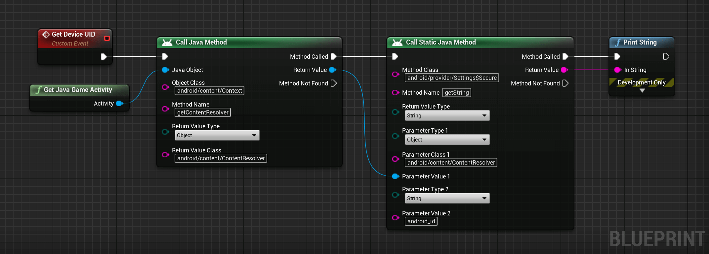

# Get the Device ID - Blueprint Examples
This section contains an example showing how to get the device ID using the plugin.

## Before Starting
Before diving directly into the Blueprint code, let's see what Java code we want to call.  
The following Java code will return the device ID:
```java
ContentResolver contentResolver = activity.getContentResolver();
Secure.getString(contentResolver, Secure.ANDROID_ID);
```
We break down this code to 2 Java calls:
1. The call to `getContentResolver` on the activity object.
2. The static call `getString` with the content resolver as parameter.

By reading the documentation of [`Context`](https://developer.android.com/reference/android/content/Context) and 
[`Settings.Secure`](https://developer.android.com/reference/android/provider/Settings.Secure)
we get the following signatures for the calls:
1. `public abstract ContentResolver getContentResolver()`
2. `public static String getString(ContentResolver resolver, String name)`

We also note the following information:
1. The `Context` class is in the package `android.content`. Converting it to classpath, we get `android/content/Context`.
2. The `getString` method is in the static inner class `Secure` of the `Settings` class in the package `android.provider`. 
Converting it to classpath, we get `android/provider/Secure$Settings`.
3. The `ContentResolver` class is in the package `android.content`. Converting it to classpath, we get `android/content/ContentResolver`.
4. `Secure.ANDROID_ID` is a constant with a String value of `"android_id"`.

## Implementation

Now that we have all the information required, we can easily implement the method.  
Make sure to chose the right return values and add the corresponding parameters by right-clicking on the node and selecting `Add parameter`.

<div class="bpcode">
<textarea readonly>
Begin Object Class=/Script/BlueprintGraph.K2Node_CustomEvent Name="K2Node_CustomEvent_6"
   CustomFunctionName="Get Device UID"
   NodePosX=-1312
   NodePosY=-3632
   NodeGuid=ADD7336F4BDC3A82072BCFA68DB6BAD6
   CustomProperties Pin (PinId=ADE2A047479DB0531FB333B7F58410D6,PinName="OutputDelegate",Direction="EGPD_Output",PinType.PinCategory="delegate",PinType.PinSubCategory="",PinType.PinSubCategoryObject=None,PinType.PinSubCategoryMemberReference=(MemberParent=BlueprintGeneratedClass'"/Game/Demo.Demo_C"',MemberName="Get Device UID",MemberGuid=ADD7336F4BDC3A82072BCFA68DB6BAD6),PinType.PinValueType=(),PinType.ContainerType=None,PinType.bIsReference=False,PinType.bIsConst=False,PinType.bIsWeakPointer=False,PinType.bIsUObjectWrapper=True,PersistentGuid=00000000000000000000000000000000,bHidden=False,bNotConnectable=False,bDefaultValueIsReadOnly=False,bDefaultValueIsIgnored=False,bAdvancedView=False,bOrphanedPin=False,)
   CustomProperties Pin (PinId=DDCDF5504B6C11F6432703978119B11F,PinName="then",Direction="EGPD_Output",PinType.PinCategory="exec",PinType.PinSubCategory="",PinType.PinSubCategoryObject=None,PinType.PinSubCategoryMemberReference=(),PinType.PinValueType=(),PinType.ContainerType=None,PinType.bIsReference=False,PinType.bIsConst=False,PinType.bIsWeakPointer=False,PinType.bIsUObjectWrapper=True,LinkedTo=(K2_CallJavaFunction_2 376AC0F84D1DF041731112BF7EF1127A,),PersistentGuid=00000000000000000000000000000000,bHidden=False,bNotConnectable=False,bDefaultValueIsReadOnly=False,bDefaultValueIsIgnored=False,bAdvancedView=False,bOrphanedPin=False,)
End Object
Begin Object Class=/Script/BlueprintJNIEditor.K2_CallJavaFunction Name="K2_CallJavaFunction_2"
   NodePosX=-1072
   NodePosY=-3616
   NodeGuid=4E2DE4B949266F32AED475AFE568732C
   CustomProperties Pin (PinId=376AC0F84D1DF041731112BF7EF1127A,PinName="execute",PinType.PinCategory="exec",PinType.PinSubCategory="",PinType.PinSubCategoryObject=None,PinType.PinSubCategoryMemberReference=(),PinType.PinValueType=(),PinType.ContainerType=None,PinType.bIsReference=False,PinType.bIsConst=False,PinType.bIsWeakPointer=False,PinType.bIsUObjectWrapper=True,LinkedTo=(K2Node_CustomEvent_6 DDCDF5504B6C11F6432703978119B11F,),PersistentGuid=00000000000000000000000000000000,bHidden=False,bNotConnectable=False,bDefaultValueIsReadOnly=False,bDefaultValueIsIgnored=False,bAdvancedView=False,bOrphanedPin=False,)
   CustomProperties Pin (PinId=FB61B5F642FA4E93C04FF4963AB4A57B,PinName="Method Called",Direction="EGPD_Output",PinType.PinCategory="exec",PinType.PinSubCategory="",PinType.PinSubCategoryObject=None,PinType.PinSubCategoryMemberReference=(),PinType.PinValueType=(),PinType.ContainerType=None,PinType.bIsReference=False,PinType.bIsConst=False,PinType.bIsWeakPointer=False,PinType.bIsUObjectWrapper=True,LinkedTo=(K2_CallStaticJavaFunction_4 237BC11449D42CE1E09AB694A6F674B1,),PersistentGuid=00000000000000000000000000000000,bHidden=False,bNotConnectable=False,bDefaultValueIsReadOnly=False,bDefaultValueIsIgnored=False,bAdvancedView=False,bOrphanedPin=False,)
   CustomProperties Pin (PinId=590E1A364664C28C3262EB89D3DE2B12,PinName="Return Value",Direction="EGPD_Output",PinType.PinCategory="object",PinType.PinSubCategory="",PinType.PinSubCategoryObject=Class'"/Script/BlueprintJNI.JavaObject"',PinType.PinSubCategoryMemberReference=(),PinType.PinValueType=(),PinType.ContainerType=None,PinType.bIsReference=False,PinType.bIsConst=False,PinType.bIsWeakPointer=False,PinType.bIsUObjectWrapper=False,LinkedTo=(K2_CallStaticJavaFunction_4 3CE7C36E41AB77EE1308A781AB234B2E,),PersistentGuid=00000000000000000000000000000000,bHidden=False,bNotConnectable=False,bDefaultValueIsReadOnly=False,bDefaultValueIsIgnored=False,bAdvancedView=False,bOrphanedPin=False,)
   CustomProperties Pin (PinId=4E78E4C649B392EE4AEB6EAAFD9052D8,PinName="Method not Found",Direction="EGPD_Output",PinType.PinCategory="exec",PinType.PinSubCategory="",PinType.PinSubCategoryObject=None,PinType.PinSubCategoryMemberReference=(),PinType.PinValueType=(),PinType.ContainerType=None,PinType.bIsReference=False,PinType.bIsConst=False,PinType.bIsWeakPointer=False,PinType.bIsUObjectWrapper=True,PersistentGuid=00000000000000000000000000000000,bHidden=False,bNotConnectable=False,bDefaultValueIsReadOnly=False,bDefaultValueIsIgnored=False,bAdvancedView=False,bOrphanedPin=False,)
   CustomProperties Pin (PinId=435AC2BB41B9CC2CA4450FB068CE5DA9,PinName="Java Object",PinType.PinCategory="object",PinType.PinSubCategory="",PinType.PinSubCategoryObject=Class'"/Script/BlueprintJNI.JavaObject"',PinType.PinSubCategoryMemberReference=(),PinType.PinValueType=(),PinType.ContainerType=None,PinType.bIsReference=False,PinType.bIsConst=False,PinType.bIsWeakPointer=False,PinType.bIsUObjectWrapper=False,LinkedTo=(K2Node_CallFunction_28 3F2A32F7417CFE720E8727A95D5F7F56,),PersistentGuid=00000000000000000000000000000000,bHidden=False,bNotConnectable=False,bDefaultValueIsReadOnly=False,bDefaultValueIsIgnored=False,bAdvancedView=False,bOrphanedPin=False,)
   CustomProperties Pin (PinId=273F411944046C3AA4DDA09FC7A7D5B3,PinName="Object Class",PinType.PinCategory="string",PinType.PinSubCategory="",PinType.PinSubCategoryObject=None,PinType.PinSubCategoryMemberReference=(),PinType.PinValueType=(),PinType.ContainerType=None,PinType.bIsReference=False,PinType.bIsConst=False,PinType.bIsWeakPointer=False,PinType.bIsUObjectWrapper=True,DefaultValue="android/content/Context",PersistentGuid=00000000000000000000000000000000,bHidden=False,bNotConnectable=False,bDefaultValueIsReadOnly=False,bDefaultValueIsIgnored=False,bAdvancedView=False,bOrphanedPin=False,)
   CustomProperties Pin (PinId=659DE1354DCBA502EB6703A2779DF03F,PinName="Method Name",PinType.PinCategory="string",PinType.PinSubCategory="",PinType.PinSubCategoryObject=None,PinType.PinSubCategoryMemberReference=(),PinType.PinValueType=(),PinType.ContainerType=None,PinType.bIsReference=False,PinType.bIsConst=False,PinType.bIsWeakPointer=False,PinType.bIsUObjectWrapper=True,DefaultValue="getContentResolver",PersistentGuid=00000000000000000000000000000000,bHidden=False,bNotConnectable=False,bDefaultValueIsReadOnly=False,bDefaultValueIsIgnored=False,bAdvancedView=False,bOrphanedPin=False,)
   CustomProperties Pin (PinId=8A8FAAC448FB8F242F682EBE7DE36DFF,PinName="Return Value Type",PinType.PinCategory="byte",PinType.PinSubCategory="EJavaType",PinType.PinSubCategoryObject=Enum'"/Script/BlueprintJNI.EJavaType"',PinType.PinSubCategoryMemberReference=(),PinType.PinValueType=(),PinType.ContainerType=None,PinType.bIsReference=False,PinType.bIsConst=False,PinType.bIsWeakPointer=False,PinType.bIsUObjectWrapper=False,DefaultValue="Object",PersistentGuid=00000000000000000000000000000000,bHidden=False,bNotConnectable=False,bDefaultValueIsReadOnly=False,bDefaultValueIsIgnored=False,bAdvancedView=False,bOrphanedPin=False,)
   CustomProperties Pin (PinId=666E08F44F3359AF08504AB3D4A63B27,PinName="Return Value Class",PinType.PinCategory="string",PinType.PinSubCategory="",PinType.PinSubCategoryObject=None,PinType.PinSubCategoryMemberReference=(),PinType.PinValueType=(),PinType.ContainerType=None,PinType.bIsReference=False,PinType.bIsConst=False,PinType.bIsWeakPointer=False,PinType.bIsUObjectWrapper=True,DefaultValue="android/content/ContentResolver",PersistentGuid=00000000000000000000000000000000,bHidden=False,bNotConnectable=False,bDefaultValueIsReadOnly=False,bDefaultValueIsIgnored=False,bAdvancedView=False,bOrphanedPin=False,)
End Object
Begin Object Class=/Script/BlueprintGraph.K2Node_CallFunction Name="K2Node_CallFunction_28"
   bIsPureFunc=True
   FunctionReference=(MemberParent=Class'"/Script/BlueprintJNI.JavaLibrary"',MemberName="GetJavaGameActivity")
   NodePosX=-1328
   NodePosY=-3520
   NodeGuid=0E91DB634C0C30F8C64E26A30A4E173A
   CustomProperties Pin (PinId=5B1AD60244FB43EC140CE790292B5565,PinName="self",PinFriendlyName=NSLOCTEXT("K2Node", "Target", "Target"),PinToolTip="Target\nJava Library Object Reference",PinType.PinCategory="object",PinType.PinSubCategory="",PinType.PinSubCategoryObject=Class'"/Script/BlueprintJNI.JavaLibrary"',PinType.PinSubCategoryMemberReference=(),PinType.PinValueType=(),PinType.ContainerType=None,PinType.bIsReference=False,PinType.bIsConst=False,PinType.bIsWeakPointer=False,PinType.bIsUObjectWrapper=False,DefaultObject="/Script/BlueprintJNI.Default__JavaLibrary",PersistentGuid=00000000000000000000000000000000,bHidden=True,bNotConnectable=False,bDefaultValueIsReadOnly=False,bDefaultValueIsIgnored=False,bAdvancedView=False,bOrphanedPin=False,)
   CustomProperties Pin (PinId=3F2A32F7417CFE720E8727A95D5F7F56,PinName="ReturnValue",PinFriendlyName=NSLOCTEXT("", "029E0893462A2701EAF6E0B61CCC1543", "Activity"),PinToolTip="Activity\nJava Object Object Reference\n\nThe Java Game Activity of the application.",Direction="EGPD_Output",PinType.PinCategory="object",PinType.PinSubCategory="",PinType.PinSubCategoryObject=Class'"/Script/BlueprintJNI.JavaObject"',PinType.PinSubCategoryMemberReference=(),PinType.PinValueType=(),PinType.ContainerType=None,PinType.bIsReference=False,PinType.bIsConst=False,PinType.bIsWeakPointer=False,PinType.bIsUObjectWrapper=False,LinkedTo=(K2_CallJavaFunction_2 435AC2BB41B9CC2CA4450FB068CE5DA9,),PersistentGuid=00000000000000000000000000000000,bHidden=False,bNotConnectable=False,bDefaultValueIsReadOnly=False,bDefaultValueIsIgnored=False,bAdvancedView=False,bOrphanedPin=False,)
End Object
Begin Object Class=/Script/BlueprintJNIEditor.K2_CallStaticJavaFunction Name="K2_CallStaticJavaFunction_4"
   NumParams=2
   NodePosX=-608
   NodePosY=-3616
   NodeGuid=B6B057D541C694BF74E9C896B107AAC8
   CustomProperties Pin (PinId=237BC11449D42CE1E09AB694A6F674B1,PinName="execute",PinType.PinCategory="exec",PinType.PinSubCategory="",PinType.PinSubCategoryObject=None,PinType.PinSubCategoryMemberReference=(),PinType.PinValueType=(),PinType.ContainerType=None,PinType.bIsReference=False,PinType.bIsConst=False,PinType.bIsWeakPointer=False,PinType.bIsUObjectWrapper=True,LinkedTo=(K2_CallJavaFunction_2 FB61B5F642FA4E93C04FF4963AB4A57B,),PersistentGuid=00000000000000000000000000000000,bHidden=False,bNotConnectable=False,bDefaultValueIsReadOnly=False,bDefaultValueIsIgnored=False,bAdvancedView=False,bOrphanedPin=False,)
   CustomProperties Pin (PinId=2761FCE44961CA3533FC59B5E8446D0D,PinName="Method Called",Direction="EGPD_Output",PinType.PinCategory="exec",PinType.PinSubCategory="",PinType.PinSubCategoryObject=None,PinType.PinSubCategoryMemberReference=(),PinType.PinValueType=(),PinType.ContainerType=None,PinType.bIsReference=False,PinType.bIsConst=False,PinType.bIsWeakPointer=False,PinType.bIsUObjectWrapper=True,LinkedTo=(K2Node_CallFunction_29 32DCAEFB4CA3420072BF02A0E28524DC,),PersistentGuid=00000000000000000000000000000000,bHidden=False,bNotConnectable=False,bDefaultValueIsReadOnly=False,bDefaultValueIsIgnored=False,bAdvancedView=False,bOrphanedPin=False,)
   CustomProperties Pin (PinId=48D9D3CD48ED66F881258B942A45D7A6,PinName="Return Value",Direction="EGPD_Output",PinType.PinCategory="string",PinType.PinSubCategory="",PinType.PinSubCategoryObject=None,PinType.PinSubCategoryMemberReference=(),PinType.PinValueType=(),PinType.ContainerType=None,PinType.bIsReference=False,PinType.bIsConst=False,PinType.bIsWeakPointer=False,PinType.bIsUObjectWrapper=False,LinkedTo=(K2Node_CallFunction_29 CD6B936F4ADD7B268BB60AA9ECE832EE,),PersistentGuid=00000000000000000000000000000000,bHidden=False,bNotConnectable=False,bDefaultValueIsReadOnly=False,bDefaultValueIsIgnored=False,bAdvancedView=False,bOrphanedPin=False,)
   CustomProperties Pin (PinId=86E447A3484C55CE596CA6A794C93F70,PinName="Method not Found",Direction="EGPD_Output",PinType.PinCategory="exec",PinType.PinSubCategory="",PinType.PinSubCategoryObject=None,PinType.PinSubCategoryMemberReference=(),PinType.PinValueType=(),PinType.ContainerType=None,PinType.bIsReference=False,PinType.bIsConst=False,PinType.bIsWeakPointer=False,PinType.bIsUObjectWrapper=True,PersistentGuid=00000000000000000000000000000000,bHidden=False,bNotConnectable=False,bDefaultValueIsReadOnly=False,bDefaultValueIsIgnored=False,bAdvancedView=False,bOrphanedPin=False,)
   CustomProperties Pin (PinId=341ECD9F4EA59DCEDC4B0D92066B0C00,PinName="Method Class",PinType.PinCategory="string",PinType.PinSubCategory="",PinType.PinSubCategoryObject=None,PinType.PinSubCategoryMemberReference=(),PinType.PinValueType=(),PinType.ContainerType=None,PinType.bIsReference=False,PinType.bIsConst=False,PinType.bIsWeakPointer=False,PinType.bIsUObjectWrapper=True,DefaultValue="android/provider/Settings$Secure",PersistentGuid=00000000000000000000000000000000,bHidden=False,bNotConnectable=False,bDefaultValueIsReadOnly=False,bDefaultValueIsIgnored=False,bAdvancedView=False,bOrphanedPin=False,)
   CustomProperties Pin (PinId=B7F1B4534C2C04592C2625B0F3898C1C,PinName="Method Name",PinType.PinCategory="string",PinType.PinSubCategory="",PinType.PinSubCategoryObject=None,PinType.PinSubCategoryMemberReference=(),PinType.PinValueType=(),PinType.ContainerType=None,PinType.bIsReference=False,PinType.bIsConst=False,PinType.bIsWeakPointer=False,PinType.bIsUObjectWrapper=True,DefaultValue="getString",PersistentGuid=00000000000000000000000000000000,bHidden=False,bNotConnectable=False,bDefaultValueIsReadOnly=False,bDefaultValueIsIgnored=False,bAdvancedView=False,bOrphanedPin=False,)
   CustomProperties Pin (PinId=C66B69A94905D7A75B6F7D8A7797078D,PinName="Return Value Type",PinType.PinCategory="byte",PinType.PinSubCategory="EJavaType",PinType.PinSubCategoryObject=Enum'"/Script/BlueprintJNI.EJavaType"',PinType.PinSubCategoryMemberReference=(),PinType.PinValueType=(),PinType.ContainerType=None,PinType.bIsReference=False,PinType.bIsConst=False,PinType.bIsWeakPointer=False,PinType.bIsUObjectWrapper=False,DefaultValue="String",PersistentGuid=00000000000000000000000000000000,bHidden=False,bNotConnectable=False,bDefaultValueIsReadOnly=False,bDefaultValueIsIgnored=False,bAdvancedView=False,bOrphanedPin=False,)
   CustomProperties Pin (PinId=B0D8354F4E3E2B472E3E178EF77D306E,PinName="Return Value Class",PinType.PinCategory="string",PinType.PinSubCategory="",PinType.PinSubCategoryObject=None,PinType.PinSubCategoryMemberReference=(),PinType.PinValueType=(),PinType.ContainerType=None,PinType.bIsReference=False,PinType.bIsConst=False,PinType.bIsWeakPointer=False,PinType.bIsUObjectWrapper=True,PersistentGuid=00000000000000000000000000000000,bHidden=True,bNotConnectable=False,bDefaultValueIsReadOnly=False,bDefaultValueIsIgnored=False,bAdvancedView=False,bOrphanedPin=False,)
   CustomProperties Pin (PinId=3D5B7DBA4F8A607698F47C92E824373C,PinName="ParamType_1",PinFriendlyName=LOCGEN_FORMAT_ORDERED(NSLOCTEXT("UK2_JavaParametersNode", "ParameterTypePinName", "Parameter Type {0}"), 1),PinType.PinCategory="byte",PinType.PinSubCategory="EJavaType",PinType.PinSubCategoryObject=Enum'"/Script/BlueprintJNI.EJavaType"',PinType.PinSubCategoryMemberReference=(),PinType.PinValueType=(),PinType.ContainerType=None,PinType.bIsReference=False,PinType.bIsConst=False,PinType.bIsWeakPointer=False,PinType.bIsUObjectWrapper=False,DefaultValue="Object",PersistentGuid=00000000000000000000000000000000,bHidden=False,bNotConnectable=False,bDefaultValueIsReadOnly=False,bDefaultValueIsIgnored=False,bAdvancedView=False,bOrphanedPin=False,)
   CustomProperties Pin (PinId=37C452DD4857C49750B96EA36BB2121E,PinName="ParamClass_1",PinFriendlyName=LOCGEN_FORMAT_ORDERED(NSLOCTEXT("UK2_JavaParametersNode", "ParameterClassPinName", "Parameter Class {0}"), 1),PinType.PinCategory="string",PinType.PinSubCategory="",PinType.PinSubCategoryObject=None,PinType.PinSubCategoryMemberReference=(),PinType.PinValueType=(),PinType.ContainerType=None,PinType.bIsReference=False,PinType.bIsConst=False,PinType.bIsWeakPointer=False,PinType.bIsUObjectWrapper=False,DefaultValue="android/content/ContentResolver",PersistentGuid=00000000000000000000000000000000,bHidden=False,bNotConnectable=False,bDefaultValueIsReadOnly=False,bDefaultValueIsIgnored=False,bAdvancedView=False,bOrphanedPin=False,)
   CustomProperties Pin (PinId=3CE7C36E41AB77EE1308A781AB234B2E,PinName="ParamVal_1",PinFriendlyName=LOCGEN_FORMAT_ORDERED(NSLOCTEXT("UK2_JavaParametersNode", "ParameterValuePinName", "Parameter Value {0}"), 1),PinType.PinCategory="object",PinType.PinSubCategory="",PinType.PinSubCategoryObject=Class'"/Script/BlueprintJNI.JavaObject"',PinType.PinSubCategoryMemberReference=(),PinType.PinValueType=(),PinType.ContainerType=None,PinType.bIsReference=False,PinType.bIsConst=False,PinType.bIsWeakPointer=False,PinType.bIsUObjectWrapper=False,LinkedTo=(K2_CallJavaFunction_2 590E1A364664C28C3262EB89D3DE2B12,),PersistentGuid=00000000000000000000000000000000,bHidden=False,bNotConnectable=False,bDefaultValueIsReadOnly=False,bDefaultValueIsIgnored=False,bAdvancedView=False,bOrphanedPin=False,)
   CustomProperties Pin (PinId=E1EAFED14AB5476EEEB26695C0803D2D,PinName="ParamType_2",PinFriendlyName=LOCGEN_FORMAT_ORDERED(NSLOCTEXT("UK2_JavaParametersNode", "ParameterTypePinName", "Parameter Type {0}"), 2),PinType.PinCategory="byte",PinType.PinSubCategory="EJavaType",PinType.PinSubCategoryObject=Enum'"/Script/BlueprintJNI.EJavaType"',PinType.PinSubCategoryMemberReference=(),PinType.PinValueType=(),PinType.ContainerType=None,PinType.bIsReference=False,PinType.bIsConst=False,PinType.bIsWeakPointer=False,PinType.bIsUObjectWrapper=False,DefaultValue="String",PersistentGuid=00000000000000000000000000000000,bHidden=False,bNotConnectable=False,bDefaultValueIsReadOnly=False,bDefaultValueIsIgnored=False,bAdvancedView=False,bOrphanedPin=False,)
   CustomProperties Pin (PinId=6B2225594DA69E1ACFC4A68E319B35D4,PinName="ParamClass_2",PinFriendlyName=LOCGEN_FORMAT_ORDERED(NSLOCTEXT("UK2_JavaParametersNode", "ParameterClassPinName", "Parameter Class {0}"), 2),PinType.PinCategory="string",PinType.PinSubCategory="",PinType.PinSubCategoryObject=None,PinType.PinSubCategoryMemberReference=(),PinType.PinValueType=(),PinType.ContainerType=None,PinType.bIsReference=False,PinType.bIsConst=False,PinType.bIsWeakPointer=False,PinType.bIsUObjectWrapper=False,DefaultValue="java/lang/Object",PersistentGuid=00000000000000000000000000000000,bHidden=True,bNotConnectable=False,bDefaultValueIsReadOnly=False,bDefaultValueIsIgnored=False,bAdvancedView=False,bOrphanedPin=False,)
   CustomProperties Pin (PinId=3CDB2BD948C74700AAF69F880C9C705C,PinName="ParamVal_2",PinFriendlyName=LOCGEN_FORMAT_ORDERED(NSLOCTEXT("UK2_JavaParametersNode", "ParameterValuePinName", "Parameter Value {0}"), 2),PinType.PinCategory="string",PinType.PinSubCategory="",PinType.PinSubCategoryObject=None,PinType.PinSubCategoryMemberReference=(),PinType.PinValueType=(),PinType.ContainerType=None,PinType.bIsReference=False,PinType.bIsConst=False,PinType.bIsWeakPointer=False,PinType.bIsUObjectWrapper=False,DefaultValue="android_id",PersistentGuid=00000000000000000000000000000000,bHidden=False,bNotConnectable=False,bDefaultValueIsReadOnly=False,bDefaultValueIsIgnored=False,bAdvancedView=False,bOrphanedPin=False,)
End Object
Begin Object Class=/Script/BlueprintGraph.K2Node_CallFunction Name="K2Node_CallFunction_29"
   FunctionReference=(MemberParent=Class'"/Script/Engine.KismetSystemLibrary"',MemberName="PrintString")
   NodePosX=-160
   NodePosY=-3616
   AdvancedPinDisplay=Hidden
   EnabledState=DevelopmentOnly
   NodeGuid=0FE0907046850A81C6AE61915F1CFABA
   CustomProperties Pin (PinId=32DCAEFB4CA3420072BF02A0E28524DC,PinName="execute",PinToolTip="\nExec",PinType.PinCategory="exec",PinType.PinSubCategory="",PinType.PinSubCategoryObject=None,PinType.PinSubCategoryMemberReference=(),PinType.PinValueType=(),PinType.ContainerType=None,PinType.bIsReference=False,PinType.bIsConst=False,PinType.bIsWeakPointer=False,PinType.bIsUObjectWrapper=True,LinkedTo=(K2_CallStaticJavaFunction_4 2761FCE44961CA3533FC59B5E8446D0D,),PersistentGuid=00000000000000000000000000000000,bHidden=False,bNotConnectable=False,bDefaultValueIsReadOnly=False,bDefaultValueIsIgnored=False,bAdvancedView=False,bOrphanedPin=False,)
   CustomProperties Pin (PinId=CC5CFCE540AFC405CAE6EE9104A54212,PinName="then",PinToolTip="\nExec",Direction="EGPD_Output",PinType.PinCategory="exec",PinType.PinSubCategory="",PinType.PinSubCategoryObject=None,PinType.PinSubCategoryMemberReference=(),PinType.PinValueType=(),PinType.ContainerType=None,PinType.bIsReference=False,PinType.bIsConst=False,PinType.bIsWeakPointer=False,PinType.bIsUObjectWrapper=True,PersistentGuid=00000000000000000000000000000000,bHidden=False,bNotConnectable=False,bDefaultValueIsReadOnly=False,bDefaultValueIsIgnored=False,bAdvancedView=False,bOrphanedPin=False,)
   CustomProperties Pin (PinId=46EB7D1F4871F81F8541D79BBC158679,PinName="self",PinFriendlyName=NSLOCTEXT("K2Node", "Target", "Target"),PinToolTip="Target\nKismet System Library Object Reference",PinType.PinCategory="object",PinType.PinSubCategory="",PinType.PinSubCategoryObject=Class'"/Script/Engine.KismetSystemLibrary"',PinType.PinSubCategoryMemberReference=(),PinType.PinValueType=(),PinType.ContainerType=None,PinType.bIsReference=False,PinType.bIsConst=False,PinType.bIsWeakPointer=False,PinType.bIsUObjectWrapper=False,DefaultObject="/Script/Engine.Default__KismetSystemLibrary",PersistentGuid=00000000000000000000000000000000,bHidden=True,bNotConnectable=False,bDefaultValueIsReadOnly=False,bDefaultValueIsIgnored=False,bAdvancedView=False,bOrphanedPin=False,)
   CustomProperties Pin (PinId=ED50036E4F6DF815B21C2FA43C5ECD29,PinName="WorldContextObject",PinToolTip="World Context Object\nObject Reference",PinType.PinCategory="object",PinType.PinSubCategory="",PinType.PinSubCategoryObject=Class'"/Script/CoreUObject.Object"',PinType.PinSubCategoryMemberReference=(),PinType.PinValueType=(),PinType.ContainerType=None,PinType.bIsReference=False,PinType.bIsConst=True,PinType.bIsWeakPointer=False,PinType.bIsUObjectWrapper=False,PersistentGuid=00000000000000000000000000000000,bHidden=True,bNotConnectable=False,bDefaultValueIsReadOnly=False,bDefaultValueIsIgnored=False,bAdvancedView=False,bOrphanedPin=False,)
   CustomProperties Pin (PinId=CD6B936F4ADD7B268BB60AA9ECE832EE,PinName="InString",PinToolTip="In String\nString\n\nThe string to log out",PinType.PinCategory="string",PinType.PinSubCategory="",PinType.PinSubCategoryObject=None,PinType.PinSubCategoryMemberReference=(),PinType.PinValueType=(),PinType.ContainerType=None,PinType.bIsReference=False,PinType.bIsConst=False,PinType.bIsWeakPointer=False,PinType.bIsUObjectWrapper=False,DefaultValue="Hello",AutogeneratedDefaultValue="Hello",LinkedTo=(K2_CallStaticJavaFunction_4 48D9D3CD48ED66F881258B942A45D7A6,),PersistentGuid=00000000000000000000000000000000,bHidden=False,bNotConnectable=False,bDefaultValueIsReadOnly=False,bDefaultValueIsIgnored=False,bAdvancedView=False,bOrphanedPin=False,)
   CustomProperties Pin (PinId=2B9566204A10E0DBF40512A3654C1163,PinName="bPrintToScreen",PinToolTip="Print to Screen\nBoolean\n\nWhether or not to print the output to the screen",PinType.PinCategory="bool",PinType.PinSubCategory="",PinType.PinSubCategoryObject=None,PinType.PinSubCategoryMemberReference=(),PinType.PinValueType=(),PinType.ContainerType=None,PinType.bIsReference=False,PinType.bIsConst=False,PinType.bIsWeakPointer=False,PinType.bIsUObjectWrapper=False,DefaultValue="true",AutogeneratedDefaultValue="true",PersistentGuid=00000000000000000000000000000000,bHidden=False,bNotConnectable=False,bDefaultValueIsReadOnly=False,bDefaultValueIsIgnored=False,bAdvancedView=True,bOrphanedPin=False,)
   CustomProperties Pin (PinId=9081353449AB432F8C72D291273FFAEE,PinName="bPrintToLog",PinToolTip="Print to Log\nBoolean\n\nWhether or not to print the output to the log",PinType.PinCategory="bool",PinType.PinSubCategory="",PinType.PinSubCategoryObject=None,PinType.PinSubCategoryMemberReference=(),PinType.PinValueType=(),PinType.ContainerType=None,PinType.bIsReference=False,PinType.bIsConst=False,PinType.bIsWeakPointer=False,PinType.bIsUObjectWrapper=False,DefaultValue="true",AutogeneratedDefaultValue="true",PersistentGuid=00000000000000000000000000000000,bHidden=False,bNotConnectable=False,bDefaultValueIsReadOnly=False,bDefaultValueIsIgnored=False,bAdvancedView=True,bOrphanedPin=False,)
   CustomProperties Pin (PinId=D338D07B4F0A8F8F5E0627816F48A838,PinName="TextColor",PinToolTip="Text Color\nLinear Color Structure\n\nWhether or not to print the output to the console",PinType.PinCategory="struct",PinType.PinSubCategory="",PinType.PinSubCategoryObject=ScriptStruct'"/Script/CoreUObject.LinearColor"',PinType.PinSubCategoryMemberReference=(),PinType.PinValueType=(),PinType.ContainerType=None,PinType.bIsReference=False,PinType.bIsConst=False,PinType.bIsWeakPointer=False,PinType.bIsUObjectWrapper=False,DefaultValue="(R=0.000000,G=0.660000,B=1.000000,A=1.000000)",AutogeneratedDefaultValue="(R=0.000000,G=0.660000,B=1.000000,A=1.000000)",PersistentGuid=00000000000000000000000000000000,bHidden=False,bNotConnectable=False,bDefaultValueIsReadOnly=False,bDefaultValueIsIgnored=False,bAdvancedView=True,bOrphanedPin=False,)
   CustomProperties Pin (PinId=B3D59F6E4EBBDCDA8F180F95FA40B06D,PinName="Duration",PinToolTip="Duration\nFloat\n\nThe display duration (if Print to Screen is True). Using negative number will result in loading the duration time from the config.",PinType.PinCategory="float",PinType.PinSubCategory="",PinType.PinSubCategoryObject=None,PinType.PinSubCategoryMemberReference=(),PinType.PinValueType=(),PinType.ContainerType=None,PinType.bIsReference=False,PinType.bIsConst=False,PinType.bIsWeakPointer=False,PinType.bIsUObjectWrapper=False,DefaultValue="2.000000",AutogeneratedDefaultValue="2.000000",PersistentGuid=00000000000000000000000000000000,bHidden=False,bNotConnectable=False,bDefaultValueIsReadOnly=False,bDefaultValueIsIgnored=False,bAdvancedView=True,bOrphanedPin=False,)
End Object
</textarea>

<button onclick="copyBlueprintCode(this)">Copy Code</button>
</div>
