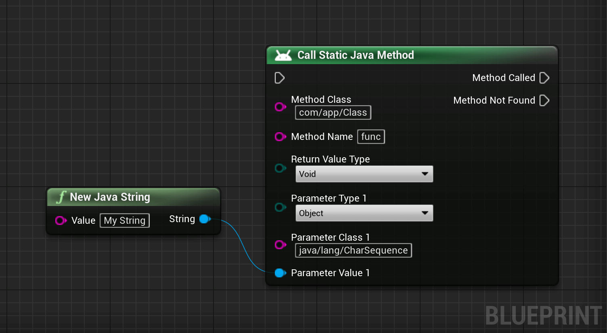

# Frequently Asked Questions

This section contains frequently asked questions. If you don't find your question here, don't hesitate to [contact us](/contact).

## Is the plugin shipped with its source code?
Yes, the entirety of the plugin C++ and Java source code is available and shipped with the plugin.  
You can see it by navigating to `<EngineRoot>/Plugins/Marketplace/JavaBlueprintInterface/Source/` after downloading the plugin from the Epic Games Launcher.

## A Java method expects a `CharSequence` how to pass it a `String`?
You can create a Java `String` as a `UJavaObject` with the `New Java String` method. With that, you can use the `Object` type to pass the `String` for
a `CharSequence`.

 
