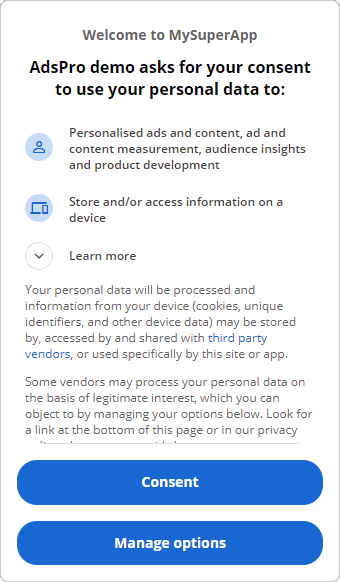
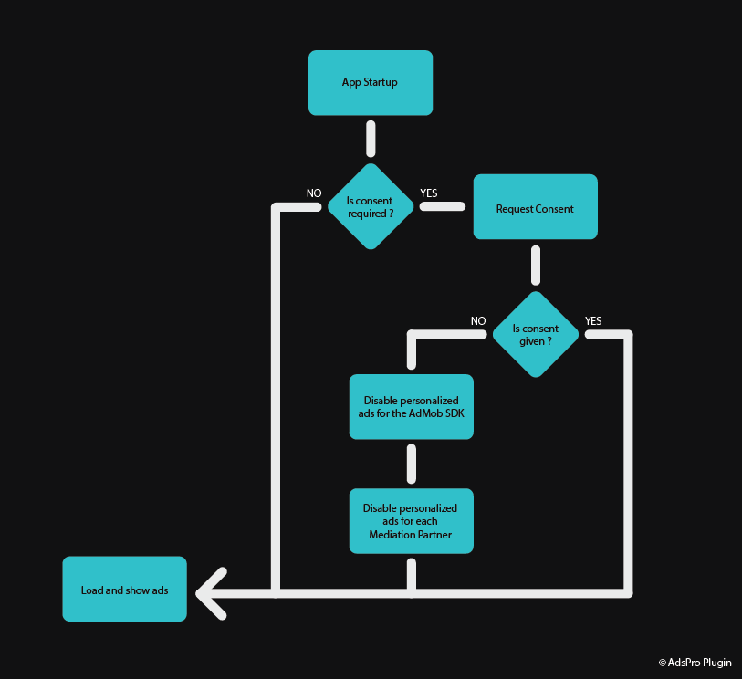

# GDPR
This section contains information on how to make your application GDPR-compliant. For actual code examples, head to [the Blueprint GDPR examples](/blueprintgdpr) page or the [C++ GDPR examples](/cppgdpr) page.

## What is GDPR
The General Data Protection Regulation (GDPR) is a privacy and security law applicated by the European Union.  
It imposes obligations onto organizations anywhere, as long as they target or collect data related to people in the EU.

Among other obligations, the data subject has to give you specific, unambiguous consent to process the data.

AdMob uses users' data to show personalized ads through your application so you must comply to it if you target EEA countries or disable
personalized ads. The same applies for any Mediation Partner used by your application.

!> Please, keep in mind that this documentation is not law related. For any real concern, a contact with a specialized lawyer is probably the best thing to do.

## Delay Mobile Ads SDK Initialization
By default, the Google Mobile Ads SDK initializes app measurement and begins sending user-level event 
data to Google immediately when the app starts. This initialization behavior ensures you can enable AdMob 
user metrics without making additional code changes.

However, if your app requires user consent before these events can be sent, you can delay app measurement 
until you explicitly initialize the Mobile Ads SDK or load an ad.

To delay app measurement, add the following in `<Project>/Config/DefaultEngine.ini`:
```ini
[AdsPro]
DelayGoogleMeasurementsData=true
```

!> It is important to not load any ads before obtaining consent as the Google Mobile Ads gets automatically initialized when an ad request is done.

> You can initialize the Mobile Ads SDK at any time by calling `UAdMobLibrary::InitializeMobileAdsSDK()` or the equivalent Blueprint node `Initialize the MobileAds SDK`.

## Check if User Consent is required
After making sure the SDK initialization is delayed, we need to know if the consent is required.  
The plugin offers the method `UConsentLibrary::IsConsentRequired()` and its equivalent Blueprint node `Is Consent Required` to know if the consent is required. These methods 
return `true` if the user is in the EEA or we weren't able to get the information.

## Requesting Consent
It's now time to request consent.
### Using the User Messaging Platform
The UMP can be used to display Google's default consent form.

A consent form can be created with the following steps.
1. Go to the [Privacy & Messaging](https://apps.admob.com/v2/privacymessaging) section.
2. Click on .
3. Select the app you want to use.
4. Click on the create button to create a new message.
5. Select `EU Consent` as message type.
6. Fill the required fields for your message.
7. Once the language of the message selected, click continue.
8. In the editor, click `Save` in the upper right corner of the screen.
9. Click on the three dots at the right of your newly created message and click on `Publish`.
10. Make sure the status of your message is `Active`. It can take up to 10 minutes to update.

You can now show the consent form with the C++ method `void UConsentLibrary::RequestConsent()` or the equivalent Blueprint node `Request Consent`.

<div style="text-align:center">
	<div></div>
	<div>The default UMP consent form.</div>
</div>

> If you request the user consent when it is not required (the user is not in the EEA), the consent form is not shown.

### Rolling your own
If you don't want to use the Google's default consent form, you can create your own with UMG or Slate so it blends better in your application.

A few things must be taken care of to get a proper consent. The [Official Website of the European Commission](https://ec.europa.eu/info/law/law-topic/data-protection/reform/rights-citizens/how-my-personal-data-protected/how-should-my-consent-be-requested_en) 
contains useful information about it.

> If you use Mediation, you must notify the user that you are sharing their data with those providers.

## Consent Refused
If the user refuses to give consent, you need to disable personalized ads for the Google Mobile Ads SDK _**and**_ the mediation partners.

To do so, call the C++ method `UAdMobLibrary::SetPersonalizedAdsEnabled(false)` or the equivalent Blueprint node `Set Personalized Ads Enabled`. 
Each mediation partner supporting GDPR also has a method to disable personalized ads. How to do so is described in the Mediation part of the documentation.

## Summary
The following diagram shows a summary to how your application should behave.
<div style="text-align:center">
	
</div>

> Some Mediation Partners require to explicitly update the GDPR status when an user falls under GDPR regardless of user consent.

?> Don't forget to setup [App Tracking Transparency](/apptrackingtransparency).


