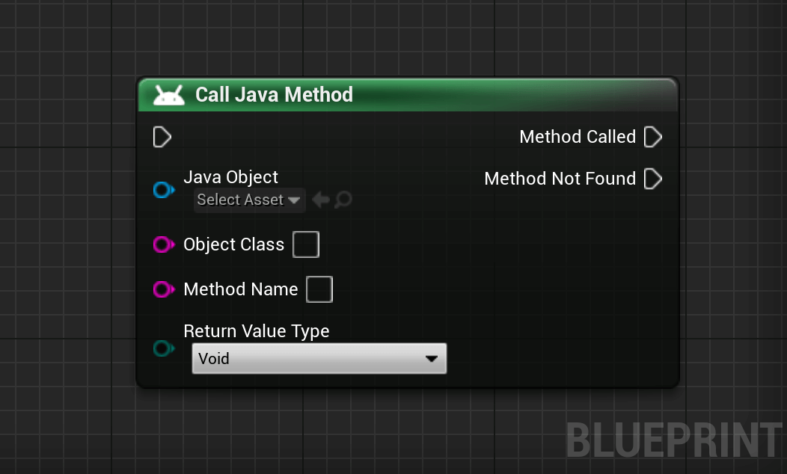
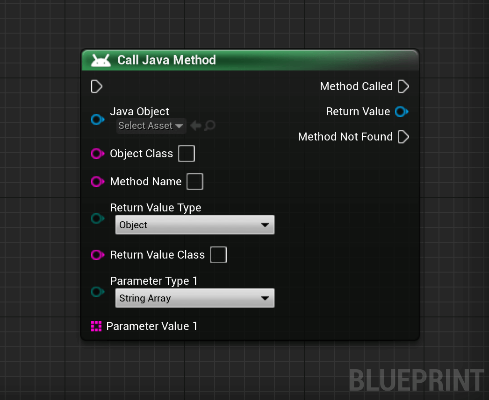
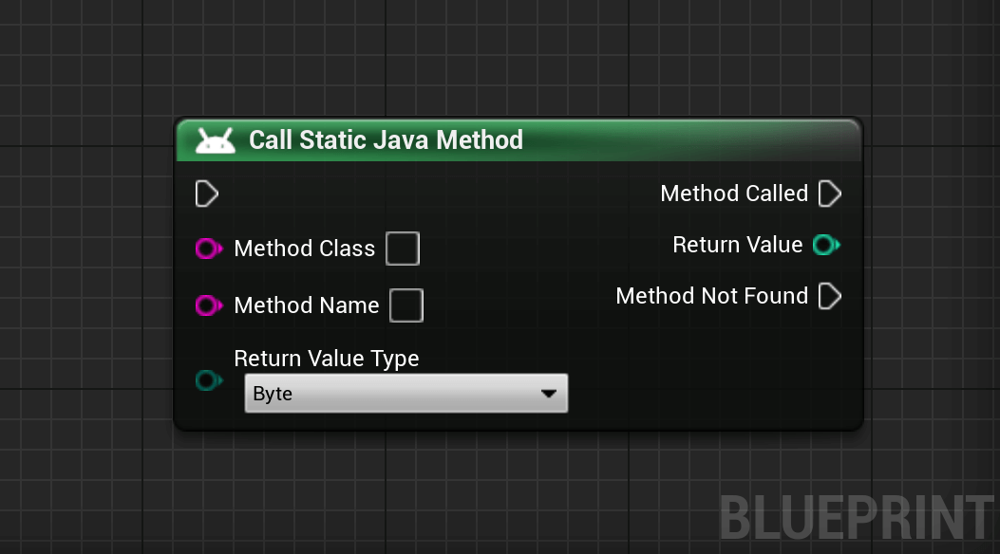
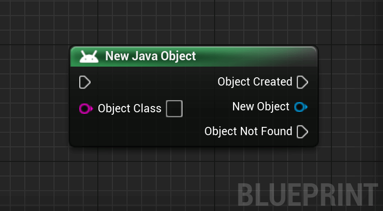
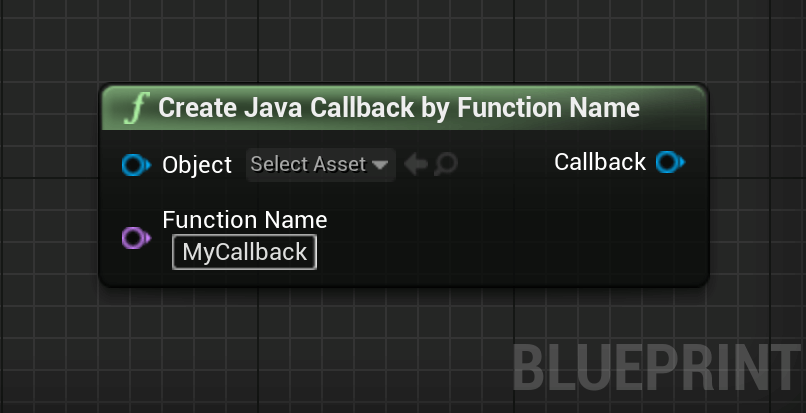
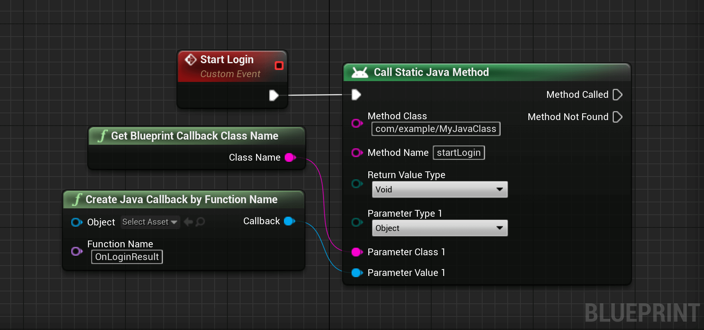

# Get Started

This section contains the steps required to use the plugin. 

## Setting up required Files
After enabling the plugin in your project just restart the Editor to create the required files automatically.

The following structure will appear in your project folder:
```
ProjectRoot/
    ├── JBI/
    │     ├── Java/
    │     └── Android.UPL.xml
    └── ...
```

## Adding Java Code
To add custom Java code in the project simply add it in `<ProjectRoot>/JBI/Java`.   
For example, to add a Java class called `MyJavaClass` in the package `com.mycompany.mygame`, we have to create the following structure:
```
ProjectRoot/
    ├── JBI/
    │     ├── Java/
	│     │     └── com/
	│     │           └── mycompany/
	│     │                 └── mygame/
	│     │                        └── MyJavaClass.java
    │     └── ...
    └── ...
```
!> All Java files in the directory `<ProjectRoot>/JBI/Java/` are automatically included in the build by the plugin.

## Calling a Java Method

To call a Java method, we have to use the `Call Java Method` node.  
For each object passed to the method, the class name of the parameter is expected.

<div class="bpcode">
<textarea readonly>
Begin Object Class=/Script/BlueprintJNIEditor.K2_CallJavaFunction Name="K2_CallJavaFunction_4"
   NodePosX=-880
   NodePosY=-4144
   NodeGuid=5E36DE4D4FF42EE49D2BA4943BD2928C
   CustomProperties Pin (PinId=F7D47DAA40AEE7C6D6F863B2BA9F2F2B,PinName="execute",PinType.PinCategory="exec",PinType.PinSubCategory="",PinType.PinSubCategoryObject=None,PinType.PinSubCategoryMemberReference=(),PinType.PinValueType=(),PinType.ContainerType=None,PinType.bIsReference=False,PinType.bIsConst=False,PinType.bIsWeakPointer=False,PinType.bIsUObjectWrapper=True,PersistentGuid=00000000000000000000000000000000,bHidden=False,bNotConnectable=False,bDefaultValueIsReadOnly=False,bDefaultValueIsIgnored=False,bAdvancedView=False,bOrphanedPin=False,)
   CustomProperties Pin (PinId=C7CE217B48E72E4467A6DC92F6CF8D6D,PinName="Method Called",Direction="EGPD_Output",PinType.PinCategory="exec",PinType.PinSubCategory="",PinType.PinSubCategoryObject=None,PinType.PinSubCategoryMemberReference=(),PinType.PinValueType=(),PinType.ContainerType=None,PinType.bIsReference=False,PinType.bIsConst=False,PinType.bIsWeakPointer=False,PinType.bIsUObjectWrapper=True,PersistentGuid=00000000000000000000000000000000,bHidden=False,bNotConnectable=False,bDefaultValueIsReadOnly=False,bDefaultValueIsIgnored=False,bAdvancedView=False,bOrphanedPin=False,)
   CustomProperties Pin (PinId=6F436E4744EFBDFF29AD16AAF50E78C2,PinName="Return Value",Direction="EGPD_Output",PinType.PinCategory="object",PinType.PinSubCategory="",PinType.PinSubCategoryObject=Class'"/Script/BlueprintJNI.JavaObject"',PinType.PinSubCategoryMemberReference=(),PinType.PinValueType=(),PinType.ContainerType=None,PinType.bIsReference=False,PinType.bIsConst=False,PinType.bIsWeakPointer=False,PinType.bIsUObjectWrapper=False,PersistentGuid=00000000000000000000000000000000,bHidden=True,bNotConnectable=False,bDefaultValueIsReadOnly=False,bDefaultValueIsIgnored=False,bAdvancedView=False,bOrphanedPin=False,)
   CustomProperties Pin (PinId=79DF8F614A3E981DF842A09A95DDCC1F,PinName="Method not Found",Direction="EGPD_Output",PinType.PinCategory="exec",PinType.PinSubCategory="",PinType.PinSubCategoryObject=None,PinType.PinSubCategoryMemberReference=(),PinType.PinValueType=(),PinType.ContainerType=None,PinType.bIsReference=False,PinType.bIsConst=False,PinType.bIsWeakPointer=False,PinType.bIsUObjectWrapper=True,PersistentGuid=00000000000000000000000000000000,bHidden=False,bNotConnectable=False,bDefaultValueIsReadOnly=False,bDefaultValueIsIgnored=False,bAdvancedView=False,bOrphanedPin=False,)
   CustomProperties Pin (PinId=B7720B5943E6F16436D47C92F540F791,PinName="Java Object",PinType.PinCategory="object",PinType.PinSubCategory="",PinType.PinSubCategoryObject=Class'"/Script/BlueprintJNI.JavaObject"',PinType.PinSubCategoryMemberReference=(),PinType.PinValueType=(),PinType.ContainerType=None,PinType.bIsReference=False,PinType.bIsConst=False,PinType.bIsWeakPointer=False,PinType.bIsUObjectWrapper=False,PersistentGuid=00000000000000000000000000000000,bHidden=False,bNotConnectable=False,bDefaultValueIsReadOnly=False,bDefaultValueIsIgnored=False,bAdvancedView=False,bOrphanedPin=False,)
   CustomProperties Pin (PinId=9A7FCE8946E944F7DB0BD9861A270033,PinName="Object Class",PinType.PinCategory="string",PinType.PinSubCategory="",PinType.PinSubCategoryObject=None,PinType.PinSubCategoryMemberReference=(),PinType.PinValueType=(),PinType.ContainerType=None,PinType.bIsReference=False,PinType.bIsConst=False,PinType.bIsWeakPointer=False,PinType.bIsUObjectWrapper=True,PersistentGuid=00000000000000000000000000000000,bHidden=False,bNotConnectable=False,bDefaultValueIsReadOnly=False,bDefaultValueIsIgnored=False,bAdvancedView=False,bOrphanedPin=False,)
   CustomProperties Pin (PinId=93CD8AA740013E459938D694B4AE8D47,PinName="Method Name",PinType.PinCategory="string",PinType.PinSubCategory="",PinType.PinSubCategoryObject=None,PinType.PinSubCategoryMemberReference=(),PinType.PinValueType=(),PinType.ContainerType=None,PinType.bIsReference=False,PinType.bIsConst=False,PinType.bIsWeakPointer=False,PinType.bIsUObjectWrapper=True,PersistentGuid=00000000000000000000000000000000,bHidden=False,bNotConnectable=False,bDefaultValueIsReadOnly=False,bDefaultValueIsIgnored=False,bAdvancedView=False,bOrphanedPin=False,)
   CustomProperties Pin (PinId=EEFA86EE4D4FA9DD8BF5D18E936487E6,PinName="Return Value Type",PinType.PinCategory="byte",PinType.PinSubCategory="EJavaType",PinType.PinSubCategoryObject=Enum'"/Script/BlueprintJNI.EJavaType"',PinType.PinSubCategoryMemberReference=(),PinType.PinValueType=(),PinType.ContainerType=None,PinType.bIsReference=False,PinType.bIsConst=False,PinType.bIsWeakPointer=False,PinType.bIsUObjectWrapper=False,DefaultValue="Void",PersistentGuid=00000000000000000000000000000000,bHidden=False,bNotConnectable=False,bDefaultValueIsReadOnly=False,bDefaultValueIsIgnored=False,bAdvancedView=False,bOrphanedPin=False,)
   CustomProperties Pin (PinId=3C6B321544D5E9214F53E5A570A681F5,PinName="Return Value Class",PinType.PinCategory="string",PinType.PinSubCategory="",PinType.PinSubCategoryObject=None,PinType.PinSubCategoryMemberReference=(),PinType.PinValueType=(),PinType.ContainerType=None,PinType.bIsReference=False,PinType.bIsConst=False,PinType.bIsWeakPointer=False,PinType.bIsUObjectWrapper=True,PersistentGuid=00000000000000000000000000000000,bHidden=True,bNotConnectable=False,bDefaultValueIsReadOnly=False,bDefaultValueIsIgnored=False,bAdvancedView=False,bOrphanedPin=False,)
End Object
</textarea>

<button onclick="copyBlueprintCode(this)">Copy Code</button>
</div>

?> All classes are expected in the fully qualified classpath format.   	
i.e. `com.mycompany.myapp.MyClass` becomes `com/mycompany/myapp/MyClass` and 
`com.mycompany.myapp.MyClass.MyInnerClass` becomes `com/mycompany/myapp/MyClass$MyInnerClass`.

!> It is important to use the classpath of the parameter type matching the signature and not the potential subclass of the object passed as parameter.

Parameters can be added to the node by right clicking on it and selecting `Add Parameter`.
<div class="bpcode">
<textarea readonly>
Begin Object Class=/Script/BlueprintJNIEditor.K2_CallJavaFunction Name="K2_CallJavaFunction_4"
   NumParams=1
   NodePosX=-880
   NodePosY=-4256
   NodeGuid=5E36DE4D4FF42EE49D2BA4943BD2928C
   CustomProperties Pin (PinId=F7D47DAA40AEE7C6D6F863B2BA9F2F2B,PinName="execute",PinType.PinCategory="exec",PinType.PinSubCategory="",PinType.PinSubCategoryObject=None,PinType.PinSubCategoryMemberReference=(),PinType.PinValueType=(),PinType.ContainerType=None,PinType.bIsReference=False,PinType.bIsConst=False,PinType.bIsWeakPointer=False,PinType.bIsUObjectWrapper=True,PersistentGuid=00000000000000000000000000000000,bHidden=False,bNotConnectable=False,bDefaultValueIsReadOnly=False,bDefaultValueIsIgnored=False,bAdvancedView=False,bOrphanedPin=False,)
   CustomProperties Pin (PinId=C7CE217B48E72E4467A6DC92F6CF8D6D,PinName="Method Called",Direction="EGPD_Output",PinType.PinCategory="exec",PinType.PinSubCategory="",PinType.PinSubCategoryObject=None,PinType.PinSubCategoryMemberReference=(),PinType.PinValueType=(),PinType.ContainerType=None,PinType.bIsReference=False,PinType.bIsConst=False,PinType.bIsWeakPointer=False,PinType.bIsUObjectWrapper=True,PersistentGuid=00000000000000000000000000000000,bHidden=False,bNotConnectable=False,bDefaultValueIsReadOnly=False,bDefaultValueIsIgnored=False,bAdvancedView=False,bOrphanedPin=False,)
   CustomProperties Pin (PinId=6F436E4744EFBDFF29AD16AAF50E78C2,PinName="Return Value",Direction="EGPD_Output",PinType.PinCategory="object",PinType.PinSubCategory="",PinType.PinSubCategoryObject=Class'"/Script/BlueprintJNI.JavaObject"',PinType.PinSubCategoryMemberReference=(),PinType.PinValueType=(),PinType.ContainerType=None,PinType.bIsReference=False,PinType.bIsConst=False,PinType.bIsWeakPointer=False,PinType.bIsUObjectWrapper=False,PersistentGuid=00000000000000000000000000000000,bHidden=False,bNotConnectable=False,bDefaultValueIsReadOnly=False,bDefaultValueIsIgnored=False,bAdvancedView=False,bOrphanedPin=False,)
   CustomProperties Pin (PinId=79DF8F614A3E981DF842A09A95DDCC1F,PinName="Method not Found",Direction="EGPD_Output",PinType.PinCategory="exec",PinType.PinSubCategory="",PinType.PinSubCategoryObject=None,PinType.PinSubCategoryMemberReference=(),PinType.PinValueType=(),PinType.ContainerType=None,PinType.bIsReference=False,PinType.bIsConst=False,PinType.bIsWeakPointer=False,PinType.bIsUObjectWrapper=True,PersistentGuid=00000000000000000000000000000000,bHidden=False,bNotConnectable=False,bDefaultValueIsReadOnly=False,bDefaultValueIsIgnored=False,bAdvancedView=False,bOrphanedPin=False,)
   CustomProperties Pin (PinId=B7720B5943E6F16436D47C92F540F791,PinName="Java Object",PinType.PinCategory="object",PinType.PinSubCategory="",PinType.PinSubCategoryObject=Class'"/Script/BlueprintJNI.JavaObject"',PinType.PinSubCategoryMemberReference=(),PinType.PinValueType=(),PinType.ContainerType=None,PinType.bIsReference=False,PinType.bIsConst=False,PinType.bIsWeakPointer=False,PinType.bIsUObjectWrapper=False,PersistentGuid=00000000000000000000000000000000,bHidden=False,bNotConnectable=False,bDefaultValueIsReadOnly=False,bDefaultValueIsIgnored=False,bAdvancedView=False,bOrphanedPin=False,)
   CustomProperties Pin (PinId=9A7FCE8946E944F7DB0BD9861A270033,PinName="Object Class",PinType.PinCategory="string",PinType.PinSubCategory="",PinType.PinSubCategoryObject=None,PinType.PinSubCategoryMemberReference=(),PinType.PinValueType=(),PinType.ContainerType=None,PinType.bIsReference=False,PinType.bIsConst=False,PinType.bIsWeakPointer=False,PinType.bIsUObjectWrapper=True,PersistentGuid=00000000000000000000000000000000,bHidden=False,bNotConnectable=False,bDefaultValueIsReadOnly=False,bDefaultValueIsIgnored=False,bAdvancedView=False,bOrphanedPin=False,)
   CustomProperties Pin (PinId=93CD8AA740013E459938D694B4AE8D47,PinName="Method Name",PinType.PinCategory="string",PinType.PinSubCategory="",PinType.PinSubCategoryObject=None,PinType.PinSubCategoryMemberReference=(),PinType.PinValueType=(),PinType.ContainerType=None,PinType.bIsReference=False,PinType.bIsConst=False,PinType.bIsWeakPointer=False,PinType.bIsUObjectWrapper=True,PersistentGuid=00000000000000000000000000000000,bHidden=False,bNotConnectable=False,bDefaultValueIsReadOnly=False,bDefaultValueIsIgnored=False,bAdvancedView=False,bOrphanedPin=False,)
   CustomProperties Pin (PinId=EEFA86EE4D4FA9DD8BF5D18E936487E6,PinName="Return Value Type",PinType.PinCategory="byte",PinType.PinSubCategory="EJavaType",PinType.PinSubCategoryObject=Enum'"/Script/BlueprintJNI.EJavaType"',PinType.PinSubCategoryMemberReference=(),PinType.PinValueType=(),PinType.ContainerType=None,PinType.bIsReference=False,PinType.bIsConst=False,PinType.bIsWeakPointer=False,PinType.bIsUObjectWrapper=False,DefaultValue="Object",PersistentGuid=00000000000000000000000000000000,bHidden=False,bNotConnectable=False,bDefaultValueIsReadOnly=False,bDefaultValueIsIgnored=False,bAdvancedView=False,bOrphanedPin=False,)
   CustomProperties Pin (PinId=3C6B321544D5E9214F53E5A570A681F5,PinName="Return Value Class",PinType.PinCategory="string",PinType.PinSubCategory="",PinType.PinSubCategoryObject=None,PinType.PinSubCategoryMemberReference=(),PinType.PinValueType=(),PinType.ContainerType=None,PinType.bIsReference=False,PinType.bIsConst=False,PinType.bIsWeakPointer=False,PinType.bIsUObjectWrapper=True,PersistentGuid=00000000000000000000000000000000,bHidden=False,bNotConnectable=False,bDefaultValueIsReadOnly=False,bDefaultValueIsIgnored=False,bAdvancedView=False,bOrphanedPin=False,)
   CustomProperties Pin (PinId=4E5968554474A6A0A3FB5295F71F7FFB,PinName="ParamType_1",PinFriendlyName=LOCGEN_FORMAT_ORDERED(NSLOCTEXT("UK2_JavaParametersNode", "ParameterTypePinName", "Parameter Type {0}"), 1),PinType.PinCategory="byte",PinType.PinSubCategory="EJavaType",PinType.PinSubCategoryObject=Enum'"/Script/BlueprintJNI.EJavaType"',PinType.PinSubCategoryMemberReference=(),PinType.PinValueType=(),PinType.ContainerType=None,PinType.bIsReference=False,PinType.bIsConst=False,PinType.bIsWeakPointer=False,PinType.bIsUObjectWrapper=False,DefaultValue="StringArray",PersistentGuid=00000000000000000000000000000000,bHidden=False,bNotConnectable=False,bDefaultValueIsReadOnly=False,bDefaultValueIsIgnored=False,bAdvancedView=False,bOrphanedPin=False,)
   CustomProperties Pin (PinId=D9E5A81D40831A520ADD21B4849791D2,PinName="ParamClass_1",PinFriendlyName=LOCGEN_FORMAT_ORDERED(NSLOCTEXT("UK2_JavaParametersNode", "ParameterClassPinName", "Parameter Class {0}"), 1),PinType.PinCategory="string",PinType.PinSubCategory="",PinType.PinSubCategoryObject=None,PinType.PinSubCategoryMemberReference=(),PinType.PinValueType=(),PinType.ContainerType=None,PinType.bIsReference=False,PinType.bIsConst=False,PinType.bIsWeakPointer=False,PinType.bIsUObjectWrapper=False,DefaultValue="java/lang/Object",PersistentGuid=00000000000000000000000000000000,bHidden=True,bNotConnectable=False,bDefaultValueIsReadOnly=False,bDefaultValueIsIgnored=False,bAdvancedView=False,bOrphanedPin=False,)
   CustomProperties Pin (PinId=E6284C4C47948B97797BB19BD540C151,PinName="ParamVal_1",PinFriendlyName=LOCGEN_FORMAT_ORDERED(NSLOCTEXT("UK2_JavaParametersNode", "ParameterValuePinName", "Parameter Value {0}"), 1),PinType.PinCategory="string",PinType.PinSubCategory="",PinType.PinSubCategoryObject=None,PinType.PinSubCategoryMemberReference=(),PinType.PinValueType=(),PinType.ContainerType=Array,PinType.bIsReference=False,PinType.bIsConst=False,PinType.bIsWeakPointer=False,PinType.bIsUObjectWrapper=False,PersistentGuid=00000000000000000000000000000000,bHidden=False,bNotConnectable=False,bDefaultValueIsReadOnly=False,bDefaultValueIsIgnored=False,bAdvancedView=False,bOrphanedPin=False,)
End Object
</textarea>

<button onclick="copyBlueprintCode(this)">Copy Code</button>
</div>

> To remove a parameter, click on it and select `Remove Parameter`.

## Calling a Static Java Method
Calling a static Java method is similar to calling a non-static one.  
Parameters can be added by right-clicking the node and selecting `Add parameter`.

<div class="bpcode">
<textarea readonly>
Begin Object Class=/Script/BlueprintJNIEditor.K2_CallStaticJavaFunction Name="K2_CallStaticJavaFunction_5"
   NodePosX=-880
   NodePosY=-4112
   NodeGuid=54ACBF4F4608C1C840AC969CE639B3B2
   CustomProperties Pin (PinId=0E7B3B1242DF78A44928BC8620DAA790,PinName="execute",PinType.PinCategory="exec",PinType.PinSubCategory="",PinType.PinSubCategoryObject=None,PinType.PinSubCategoryMemberReference=(),PinType.PinValueType=(),PinType.ContainerType=None,PinType.bIsReference=False,PinType.bIsConst=False,PinType.bIsWeakPointer=False,PinType.bIsUObjectWrapper=True,PersistentGuid=00000000000000000000000000000000,bHidden=False,bNotConnectable=False,bDefaultValueIsReadOnly=False,bDefaultValueIsIgnored=False,bAdvancedView=False,bOrphanedPin=False,)
   CustomProperties Pin (PinId=9A0D98204CBC634A0ABB22991B4159B6,PinName="Method Called",Direction="EGPD_Output",PinType.PinCategory="exec",PinType.PinSubCategory="",PinType.PinSubCategoryObject=None,PinType.PinSubCategoryMemberReference=(),PinType.PinValueType=(),PinType.ContainerType=None,PinType.bIsReference=False,PinType.bIsConst=False,PinType.bIsWeakPointer=False,PinType.bIsUObjectWrapper=True,PersistentGuid=00000000000000000000000000000000,bHidden=False,bNotConnectable=False,bDefaultValueIsReadOnly=False,bDefaultValueIsIgnored=False,bAdvancedView=False,bOrphanedPin=False,)
   CustomProperties Pin (PinId=6CDC2DCC47DE9529E4ADFCB9F3AF4DA0,PinName="Return Value",Direction="EGPD_Output",PinType.PinCategory="int",PinType.PinSubCategory="",PinType.PinSubCategoryObject=None,PinType.PinSubCategoryMemberReference=(),PinType.PinValueType=(),PinType.ContainerType=None,PinType.bIsReference=False,PinType.bIsConst=False,PinType.bIsWeakPointer=False,PinType.bIsUObjectWrapper=False,PersistentGuid=00000000000000000000000000000000,bHidden=False,bNotConnectable=False,bDefaultValueIsReadOnly=False,bDefaultValueIsIgnored=False,bAdvancedView=False,bOrphanedPin=False,)
   CustomProperties Pin (PinId=457BF70444311362905C6D857BCA36C8,PinName="Method not Found",Direction="EGPD_Output",PinType.PinCategory="exec",PinType.PinSubCategory="",PinType.PinSubCategoryObject=None,PinType.PinSubCategoryMemberReference=(),PinType.PinValueType=(),PinType.ContainerType=None,PinType.bIsReference=False,PinType.bIsConst=False,PinType.bIsWeakPointer=False,PinType.bIsUObjectWrapper=True,PersistentGuid=00000000000000000000000000000000,bHidden=False,bNotConnectable=False,bDefaultValueIsReadOnly=False,bDefaultValueIsIgnored=False,bAdvancedView=False,bOrphanedPin=False,)
   CustomProperties Pin (PinId=3299D92E4D9BC33A58E3EA8A2969E8A2,PinName="Method Class",PinType.PinCategory="string",PinType.PinSubCategory="",PinType.PinSubCategoryObject=None,PinType.PinSubCategoryMemberReference=(),PinType.PinValueType=(),PinType.ContainerType=None,PinType.bIsReference=False,PinType.bIsConst=False,PinType.bIsWeakPointer=False,PinType.bIsUObjectWrapper=True,PersistentGuid=00000000000000000000000000000000,bHidden=False,bNotConnectable=False,bDefaultValueIsReadOnly=False,bDefaultValueIsIgnored=False,bAdvancedView=False,bOrphanedPin=False,)
   CustomProperties Pin (PinId=8CDCE3664A513D9DD30DB9823E9BECFF,PinName="Method Name",PinType.PinCategory="string",PinType.PinSubCategory="",PinType.PinSubCategoryObject=None,PinType.PinSubCategoryMemberReference=(),PinType.PinValueType=(),PinType.ContainerType=None,PinType.bIsReference=False,PinType.bIsConst=False,PinType.bIsWeakPointer=False,PinType.bIsUObjectWrapper=True,PersistentGuid=00000000000000000000000000000000,bHidden=False,bNotConnectable=False,bDefaultValueIsReadOnly=False,bDefaultValueIsIgnored=False,bAdvancedView=False,bOrphanedPin=False,)
   CustomProperties Pin (PinId=A2C73D8440A7B36979F3D2BB8DC64ECB,PinName="Return Value Type",PinType.PinCategory="byte",PinType.PinSubCategory="EJavaType",PinType.PinSubCategoryObject=Enum'"/Script/BlueprintJNI.EJavaType"',PinType.PinSubCategoryMemberReference=(),PinType.PinValueType=(),PinType.ContainerType=None,PinType.bIsReference=False,PinType.bIsConst=False,PinType.bIsWeakPointer=False,PinType.bIsUObjectWrapper=False,DefaultValue="Byte",PersistentGuid=00000000000000000000000000000000,bHidden=False,bNotConnectable=False,bDefaultValueIsReadOnly=False,bDefaultValueIsIgnored=False,bAdvancedView=False,bOrphanedPin=False,)
   CustomProperties Pin (PinId=3C4356574F62D012D37567A2073B2A62,PinName="Return Value Class",PinType.PinCategory="string",PinType.PinSubCategory="",PinType.PinSubCategoryObject=None,PinType.PinSubCategoryMemberReference=(),PinType.PinValueType=(),PinType.ContainerType=None,PinType.bIsReference=False,PinType.bIsConst=False,PinType.bIsWeakPointer=False,PinType.bIsUObjectWrapper=True,PersistentGuid=00000000000000000000000000000000,bHidden=True,bNotConnectable=False,bDefaultValueIsReadOnly=False,bDefaultValueIsIgnored=False,bAdvancedView=False,bOrphanedPin=False,)
End Object
</textarea>

<button onclick="copyBlueprintCode(this)">Copy Code</button>
</div>

## Creating a new Java Object
New Java objects can be created with the `New Java Object` node.  
Parameters can be added for the constructor call by right-clicking on the node and selecting `Add Parameter`.
<div class="bpcode">
<textarea readonly>
Begin Object Class=/Script/BlueprintJNIEditor.K2_NewJavaObject Name="K2_NewJavaObject_2"
   NodePosX=-1440
   NodePosY=-1664
   NodeGuid=ED1A07EE43073019A76D888AFE59D6A0
   CustomProperties Pin (PinId=AAA2277F414491562EA3E9BE6B6BAAFD,PinName="execute",PinType.PinCategory="exec",PinType.PinSubCategory="",PinType.PinSubCategoryObject=None,PinType.PinSubCategoryMemberReference=(),PinType.PinValueType=(),PinType.ContainerType=None,PinType.bIsReference=False,PinType.bIsConst=False,PinType.bIsWeakPointer=False,PinType.bIsUObjectWrapper=False,PersistentGuid=00000000000000000000000000000000,bHidden=False,bNotConnectable=False,bDefaultValueIsReadOnly=False,bDefaultValueIsIgnored=False,bAdvancedView=False,bOrphanedPin=False,)
   CustomProperties Pin (PinId=3CCA7E5546E18C627950F78C575866FB,PinName="Object Created",Direction="EGPD_Output",PinType.PinCategory="exec",PinType.PinSubCategory="",PinType.PinSubCategoryObject=None,PinType.PinSubCategoryMemberReference=(),PinType.PinValueType=(),PinType.ContainerType=None,PinType.bIsReference=False,PinType.bIsConst=False,PinType.bIsWeakPointer=False,PinType.bIsUObjectWrapper=False,PersistentGuid=00000000000000000000000000000000,bHidden=False,bNotConnectable=False,bDefaultValueIsReadOnly=False,bDefaultValueIsIgnored=False,bAdvancedView=False,bOrphanedPin=False,)
   CustomProperties Pin (PinId=5288591948EE801746A688A5B4E66C2C,PinName="New Object",Direction="EGPD_Output",PinType.PinCategory="object",PinType.PinSubCategory="",PinType.PinSubCategoryObject=Class'"/Script/BlueprintJNI.JavaObject"',PinType.PinSubCategoryMemberReference=(),PinType.PinValueType=(),PinType.ContainerType=None,PinType.bIsReference=False,PinType.bIsConst=False,PinType.bIsWeakPointer=False,PinType.bIsUObjectWrapper=False,PersistentGuid=00000000000000000000000000000000,bHidden=False,bNotConnectable=False,bDefaultValueIsReadOnly=False,bDefaultValueIsIgnored=False,bAdvancedView=False,bOrphanedPin=False,)
   CustomProperties Pin (PinId=E5B58C894A05D341C4CB3FB9097B6B09,PinName="Object not Found",Direction="EGPD_Output",PinType.PinCategory="exec",PinType.PinSubCategory="",PinType.PinSubCategoryObject=None,PinType.PinSubCategoryMemberReference=(),PinType.PinValueType=(),PinType.ContainerType=None,PinType.bIsReference=False,PinType.bIsConst=False,PinType.bIsWeakPointer=False,PinType.bIsUObjectWrapper=False,PersistentGuid=00000000000000000000000000000000,bHidden=False,bNotConnectable=False,bDefaultValueIsReadOnly=False,bDefaultValueIsIgnored=False,bAdvancedView=False,bOrphanedPin=False,)
   CustomProperties Pin (PinId=EBE80E7E4F88DADE49DC8DB4A178CEB7,PinName="Object Class",PinType.PinCategory="string",PinType.PinSubCategory="",PinType.PinSubCategoryObject=None,PinType.PinSubCategoryMemberReference=(),PinType.PinValueType=(),PinType.ContainerType=None,PinType.bIsReference=False,PinType.bIsConst=False,PinType.bIsWeakPointer=False,PinType.bIsUObjectWrapper=False,PersistentGuid=00000000000000000000000000000000,bHidden=False,bNotConnectable=False,bDefaultValueIsReadOnly=False,bDefaultValueIsIgnored=False,bAdvancedView=False,bOrphanedPin=False,)
End Object
</textarea>

<button onclick="copyBlueprintCode(this)">Copy Code</button>
</div>

## Calling a Blueprint Function from Java
The plugin offers a way to call Blueprints functions with the help of Unreal Engine reflection system.

It can be done with the help of the Java class `BlueprintCallback` in the package `com.pandora.jbi`. It is meant to be created in Blueprints
and to pass it to a Java call as parameter.

The Java class `BlueprintCallback` can easily be created with the `Create Java Callback by Function Name` node:
<div class="bpcode">
<textarea readonly>
Begin Object Class=/Script/BlueprintGraph.K2Node_CallFunction Name="K2Node_CallFunction_2"
   bIsPureFunc=True
   FunctionReference=(MemberParent=Class'"/Script/BlueprintJNI.JavaLibrary"',MemberName="CreateBlueprintCallback")
   NodePosX=-1872
   NodePosY=-2096
   NodeGuid=F9E6EF6346349FC7D35AEA99BFF53B50
   CustomProperties Pin (PinId=67E98CC14EA3956C8FDE2FB370F7D7EA,PinName="self",PinFriendlyName=NSLOCTEXT("K2Node", "Target", "Target"),PinToolTip="Target\nJava Library Object Reference",PinType.PinCategory="object",PinType.PinSubCategory="",PinType.PinSubCategoryObject=Class'"/Script/BlueprintJNI.JavaLibrary"',PinType.PinSubCategoryMemberReference=(),PinType.PinValueType=(),PinType.ContainerType=None,PinType.bIsReference=False,PinType.bIsConst=False,PinType.bIsWeakPointer=False,PinType.bIsUObjectWrapper=True,DefaultObject="/Script/BlueprintJNI.Default__JavaLibrary",PersistentGuid=00000000000000000000000000000000,bHidden=True,bNotConnectable=False,bDefaultValueIsReadOnly=False,bDefaultValueIsIgnored=False,bAdvancedView=False,bOrphanedPin=False,)
   CustomProperties Pin (PinId=247B7CC74CA747036A0F04B1DF4D54EC,PinName="Object",PinToolTip="Object\nObject Reference\n\nThe object associated with the function.",PinType.PinCategory="object",PinType.PinSubCategory="",PinType.PinSubCategoryObject=Class'"/Script/CoreUObject.Object"',PinType.PinSubCategoryMemberReference=(),PinType.PinValueType=(),PinType.ContainerType=None,PinType.bIsReference=False,PinType.bIsConst=False,PinType.bIsWeakPointer=False,PinType.bIsUObjectWrapper=False,PersistentGuid=00000000000000000000000000000000,bHidden=False,bNotConnectable=False,bDefaultValueIsReadOnly=False,bDefaultValueIsIgnored=False,bAdvancedView=False,bOrphanedPin=False,)
   CustomProperties Pin (PinId=4B7B56F3495446DB3C11038F94CA76F2,PinName="FunctionName",PinToolTip="Function Name\nName\n\nThe name of the function or the event.",PinType.PinCategory="name",PinType.PinSubCategory="",PinType.PinSubCategoryObject=None,PinType.PinSubCategoryMemberReference=(),PinType.PinValueType=(),PinType.ContainerType=None,PinType.bIsReference=False,PinType.bIsConst=False,PinType.bIsWeakPointer=False,PinType.bIsUObjectWrapper=False,DefaultValue="MyCallback",AutogeneratedDefaultValue="None",PersistentGuid=00000000000000000000000000000000,bHidden=False,bNotConnectable=False,bDefaultValueIsReadOnly=False,bDefaultValueIsIgnored=False,bAdvancedView=False,bOrphanedPin=False,)
   CustomProperties Pin (PinId=0EB0EEB440AB5512437B33ACF1CAD744,PinName="ReturnValue",PinFriendlyName=NSLOCTEXT("", "0591EE9143222DA2131DE988FB8F3BB2", "Callback"),PinToolTip="Callback\nJava Object Object Reference\n\nA new BlueprintCallback Java object.",Direction="EGPD_Output",PinType.PinCategory="object",PinType.PinSubCategory="",PinType.PinSubCategoryObject=Class'"/Script/BlueprintJNI.JavaObject"',PinType.PinSubCategoryMemberReference=(),PinType.PinValueType=(),PinType.ContainerType=None,PinType.bIsReference=False,PinType.bIsConst=False,PinType.bIsWeakPointer=False,PinType.bIsUObjectWrapper=False,PersistentGuid=00000000000000000000000000000000,bHidden=False,bNotConnectable=False,bDefaultValueIsReadOnly=False,bDefaultValueIsIgnored=False,bAdvancedView=False,bOrphanedPin=False,)
End Object
</textarea>

<button onclick="copyBlueprintCode(this)">Copy Code</button>
</div>

This class, when received as parameter in a Java function, can fire the associated Blueprint event on demand with any parameter we want.
The parameter will be automatically converted if it matches the type of the Blueprint event.
```java
void someFunction(BlueprintCallback callback)
{
	// Executes the callback with parameters.
	// In this specific case, the parameters will be converted automatically only if 
	// their order and type match the following signature:
	// FString, int32, UJavaObject, FString.
	callback.execute("Some", 123, new Object(), "parameters");
	
	// Here, the Blueprint callback should have the following signature:
	// int32, int32, int32, TArray<int32>.
	// Also valid: uint8, int64, int32, TArray<int64>.
	callback.execute(1, 2, 3, new int[]{ 4, 5, 6 });
}
```

!> It is safe to call `execute(...)` from any thread. The callback will take care to switch to the Game thread if needed.

> The `BlueprintCallback` class keeps a weak reference that won't prevent your object from being garbage-collected.

> You can keep the callback for as long as you want, but calling `execute(...)` when the referenced `UObject` has been garbage-collected
won't do anything.


## Complete Fictional Example
For this example, let's imagine we want to make a call to a login system waiting the user input before returning. This method will be called when the user presses
on the login button created within Unreal Engine with UMG.
We want to achieve the following sequence of events:


Let's start by creating our Java function. For that, create a new Java class in the file `<Project>/JBI/Java/com/example/MyJavaClass.java`.  
This class will contain an unique static method called `startLogin`.
This method will take a Blueprint callback to pass the result of the login sequence back to Blueprints.

```java
// Your copyright notice.

package com.example;

// Import the BlueprintCallback included with the plugin.
import com.pandora.jbi.BlueprintCallback;

// Our Java class.
public class MyJavaClass
{
	/**
	 * A Java method taking time to complete.
	 * We pass a callback so we can be notified in Blueprints when the method is over.
	*/
	public static void startLogin(final BlueprintCallback onLoginOver)
	{
		// A hypothetical method used by whatever library to login.
		// It accepts a listener fired when the login is over. 
		SomeLoginSystem.login(new SomeLoginListener()
		{
			/**
			 * This method is called when the user logged in or refused to login.
			 * It has some parameters to show how to pass back data to Blueprints.
			*/
			@Override
			public void onLoginResult(boolean bLoggedIn, String username, int gold, long experience)
			{
				// We notify Blueprints the login is over.
				// We don't add any logic here as we want to do it in Blueprints.
				// The listener might be executed on another thread but we don't care, 
				// the callback takes care to switch back to the Game Thread if neeeded.
				onLoginOver.execute(bLoggedIn, username, gold, experience);
			}
		});
	}
}
```

We can now pass to the Blueprint part.  
The beginning of our login function is pretty simple, we have a simple call to a static Java function. We pass to it our only parameter, the
Blueprint callback referencing a function called `OnLoginResult`.

<div class="bpcode">
<textarea readonly>
Begin Object Class=/Script/BlueprintGraph.K2Node_CustomEvent Name="K2Node_CustomEvent_8"
   CustomFunctionName="Start Login"
   NodePosX=-192
   NodePosY=-4704
   ErrorType=1
   NodeGuid=250264874BB0A1D3BE18838EB737EE66
   CustomProperties Pin (PinId=99124BCE47C1CF9701BD7BA011FFB045,PinName="OutputDelegate",Direction="EGPD_Output",PinType.PinCategory="delegate",PinType.PinSubCategory="",PinType.PinSubCategoryObject=None,PinType.PinSubCategoryMemberReference=(MemberParent=BlueprintGeneratedClass'"/Game/Demo.Demo_C"',MemberName="Start Login",MemberGuid=250264874BB0A1D3BE18838EB737EE66),PinType.PinValueType=(),PinType.ContainerType=None,PinType.bIsReference=False,PinType.bIsConst=False,PinType.bIsWeakPointer=False,PinType.bIsUObjectWrapper=True,PersistentGuid=00000000000000000000000000000000,bHidden=False,bNotConnectable=False,bDefaultValueIsReadOnly=False,bDefaultValueIsIgnored=False,bAdvancedView=False,bOrphanedPin=False,)
   CustomProperties Pin (PinId=103EBE37457D199944ACAD98F0B01D5F,PinName="then",Direction="EGPD_Output",PinType.PinCategory="exec",PinType.PinSubCategory="",PinType.PinSubCategoryObject=None,PinType.PinSubCategoryMemberReference=(),PinType.PinValueType=(),PinType.ContainerType=None,PinType.bIsReference=False,PinType.bIsConst=False,PinType.bIsWeakPointer=False,PinType.bIsUObjectWrapper=True,LinkedTo=(K2_CallStaticJavaFunction_8 9DA32697415E59D987AEE99BA4E0BA8F,),PersistentGuid=00000000000000000000000000000000,bHidden=False,bNotConnectable=False,bDefaultValueIsReadOnly=False,bDefaultValueIsIgnored=False,bAdvancedView=False,bOrphanedPin=False,)
End Object
Begin Object Class=/Script/BlueprintJNIEditor.K2_CallStaticJavaFunction Name="K2_CallStaticJavaFunction_8"
   NumParams=1
   NodePosX=16
   NodePosY=-4688
   NodeGuid=C116178643A61B253E9505AC302524AC
   CustomProperties Pin (PinId=9DA32697415E59D987AEE99BA4E0BA8F,PinName="execute",PinType.PinCategory="exec",PinType.PinSubCategory="",PinType.PinSubCategoryObject=None,PinType.PinSubCategoryMemberReference=(),PinType.PinValueType=(),PinType.ContainerType=None,PinType.bIsReference=False,PinType.bIsConst=False,PinType.bIsWeakPointer=False,PinType.bIsUObjectWrapper=True,LinkedTo=(K2Node_CustomEvent_8 103EBE37457D199944ACAD98F0B01D5F,),PersistentGuid=00000000000000000000000000000000,bHidden=False,bNotConnectable=False,bDefaultValueIsReadOnly=False,bDefaultValueIsIgnored=False,bAdvancedView=False,bOrphanedPin=False,)
   CustomProperties Pin (PinId=CD031A9F4A186ED0BEB3328EF0F9B73D,PinName="Method Called",Direction="EGPD_Output",PinType.PinCategory="exec",PinType.PinSubCategory="",PinType.PinSubCategoryObject=None,PinType.PinSubCategoryMemberReference=(),PinType.PinValueType=(),PinType.ContainerType=None,PinType.bIsReference=False,PinType.bIsConst=False,PinType.bIsWeakPointer=False,PinType.bIsUObjectWrapper=True,PersistentGuid=00000000000000000000000000000000,bHidden=False,bNotConnectable=False,bDefaultValueIsReadOnly=False,bDefaultValueIsIgnored=False,bAdvancedView=False,bOrphanedPin=False,)
   CustomProperties Pin (PinId=5F52F3C0490D4955D1867392E6D8D4F6,PinName="Return Value",Direction="EGPD_Output",PinType.PinCategory="object",PinType.PinSubCategory="",PinType.PinSubCategoryObject=Class'"/Script/BlueprintJNI.JavaObject"',PinType.PinSubCategoryMemberReference=(),PinType.PinValueType=(),PinType.ContainerType=None,PinType.bIsReference=False,PinType.bIsConst=False,PinType.bIsWeakPointer=False,PinType.bIsUObjectWrapper=False,PersistentGuid=00000000000000000000000000000000,bHidden=True,bNotConnectable=False,bDefaultValueIsReadOnly=False,bDefaultValueIsIgnored=False,bAdvancedView=False,bOrphanedPin=False,)
   CustomProperties Pin (PinId=27A055B2494312C8EEA3E48CF94D72F3,PinName="Method not Found",Direction="EGPD_Output",PinType.PinCategory="exec",PinType.PinSubCategory="",PinType.PinSubCategoryObject=None,PinType.PinSubCategoryMemberReference=(),PinType.PinValueType=(),PinType.ContainerType=None,PinType.bIsReference=False,PinType.bIsConst=False,PinType.bIsWeakPointer=False,PinType.bIsUObjectWrapper=True,PersistentGuid=00000000000000000000000000000000,bHidden=False,bNotConnectable=False,bDefaultValueIsReadOnly=False,bDefaultValueIsIgnored=False,bAdvancedView=False,bOrphanedPin=False,)
   CustomProperties Pin (PinId=3FDCA2814DDF5774453A8A8134D0D8B3,PinName="Method Class",PinType.PinCategory="string",PinType.PinSubCategory="",PinType.PinSubCategoryObject=None,PinType.PinSubCategoryMemberReference=(),PinType.PinValueType=(),PinType.ContainerType=None,PinType.bIsReference=False,PinType.bIsConst=False,PinType.bIsWeakPointer=False,PinType.bIsUObjectWrapper=True,DefaultValue="com/example/MyJavaClass",PersistentGuid=00000000000000000000000000000000,bHidden=False,bNotConnectable=False,bDefaultValueIsReadOnly=False,bDefaultValueIsIgnored=False,bAdvancedView=False,bOrphanedPin=False,)
   CustomProperties Pin (PinId=999893BF464793EB3EFAFAA99611BBB0,PinName="Method Name",PinType.PinCategory="string",PinType.PinSubCategory="",PinType.PinSubCategoryObject=None,PinType.PinSubCategoryMemberReference=(),PinType.PinValueType=(),PinType.ContainerType=None,PinType.bIsReference=False,PinType.bIsConst=False,PinType.bIsWeakPointer=False,PinType.bIsUObjectWrapper=True,DefaultValue="startLogin",PersistentGuid=00000000000000000000000000000000,bHidden=False,bNotConnectable=False,bDefaultValueIsReadOnly=False,bDefaultValueIsIgnored=False,bAdvancedView=False,bOrphanedPin=False,)
   CustomProperties Pin (PinId=B88BDED6455EF31976E55F8E27F4DE29,PinName="Return Value Type",PinType.PinCategory="byte",PinType.PinSubCategory="EJavaType",PinType.PinSubCategoryObject=Enum'"/Script/BlueprintJNI.EJavaType"',PinType.PinSubCategoryMemberReference=(),PinType.PinValueType=(),PinType.ContainerType=None,PinType.bIsReference=False,PinType.bIsConst=False,PinType.bIsWeakPointer=False,PinType.bIsUObjectWrapper=False,DefaultValue="Void",PersistentGuid=00000000000000000000000000000000,bHidden=False,bNotConnectable=False,bDefaultValueIsReadOnly=False,bDefaultValueIsIgnored=False,bAdvancedView=False,bOrphanedPin=False,)
   CustomProperties Pin (PinId=3E9BCD964B3DE9914AEE43B5AF19E988,PinName="Return Value Class",PinType.PinCategory="string",PinType.PinSubCategory="",PinType.PinSubCategoryObject=None,PinType.PinSubCategoryMemberReference=(),PinType.PinValueType=(),PinType.ContainerType=None,PinType.bIsReference=False,PinType.bIsConst=False,PinType.bIsWeakPointer=False,PinType.bIsUObjectWrapper=True,PersistentGuid=00000000000000000000000000000000,bHidden=True,bNotConnectable=False,bDefaultValueIsReadOnly=False,bDefaultValueIsIgnored=False,bAdvancedView=False,bOrphanedPin=False,)
   CustomProperties Pin (PinId=B2AD78034E9FD59DBD659AA97441D20A,PinName="ParamType_1",PinFriendlyName=LOCGEN_FORMAT_ORDERED(NSLOCTEXT("UK2_JavaParametersNode", "ParameterTypePinName", "Parameter Type {0}"), 1),PinType.PinCategory="byte",PinType.PinSubCategory="EJavaType",PinType.PinSubCategoryObject=Enum'"/Script/BlueprintJNI.EJavaType"',PinType.PinSubCategoryMemberReference=(),PinType.PinValueType=(),PinType.ContainerType=None,PinType.bIsReference=False,PinType.bIsConst=False,PinType.bIsWeakPointer=False,PinType.bIsUObjectWrapper=False,DefaultValue="Object",PersistentGuid=00000000000000000000000000000000,bHidden=False,bNotConnectable=False,bDefaultValueIsReadOnly=False,bDefaultValueIsIgnored=False,bAdvancedView=False,bOrphanedPin=False,)
   CustomProperties Pin (PinId=5FBC6C294B5509CC32BE3391AAEE51F1,PinName="ParamClass_1",PinFriendlyName=LOCGEN_FORMAT_ORDERED(NSLOCTEXT("UK2_JavaParametersNode", "ParameterClassPinName", "Parameter Class {0}"), 1),PinType.PinCategory="string",PinType.PinSubCategory="",PinType.PinSubCategoryObject=None,PinType.PinSubCategoryMemberReference=(),PinType.PinValueType=(),PinType.ContainerType=None,PinType.bIsReference=False,PinType.bIsConst=False,PinType.bIsWeakPointer=False,PinType.bIsUObjectWrapper=False,LinkedTo=(K2Node_CallFunction_37 E071EE4E4EFDECC4AD2730B03D91CDD6,),PersistentGuid=00000000000000000000000000000000,bHidden=False,bNotConnectable=False,bDefaultValueIsReadOnly=False,bDefaultValueIsIgnored=False,bAdvancedView=False,bOrphanedPin=False,)
   CustomProperties Pin (PinId=8E19CC5542481EEDCA3686B1AFC8B8C9,PinName="ParamVal_1",PinFriendlyName=LOCGEN_FORMAT_ORDERED(NSLOCTEXT("UK2_JavaParametersNode", "ParameterValuePinName", "Parameter Value {0}"), 1),PinType.PinCategory="object",PinType.PinSubCategory="",PinType.PinSubCategoryObject=Class'"/Script/BlueprintJNI.JavaObject"',PinType.PinSubCategoryMemberReference=(),PinType.PinValueType=(),PinType.ContainerType=None,PinType.bIsReference=False,PinType.bIsConst=False,PinType.bIsWeakPointer=False,PinType.bIsUObjectWrapper=False,LinkedTo=(K2Node_CallFunction_38 F565C8D1400AD30760B3649D1E738966,),PersistentGuid=00000000000000000000000000000000,bHidden=False,bNotConnectable=False,bDefaultValueIsReadOnly=False,bDefaultValueIsIgnored=False,bAdvancedView=False,bOrphanedPin=False,)
End Object
Begin Object Class=/Script/BlueprintGraph.K2Node_CallFunction Name="K2Node_CallFunction_37"
   bIsPureFunc=True
   FunctionReference=(MemberParent=Class'"/Script/BlueprintJNI.JavaLibrary"',MemberName="GetBlueprintCallbackClassName")
   NodePosX=-304
   NodePosY=-4608
   NodeGuid=D887C24C4B95B4A64DC130A694EF1D61
   CustomProperties Pin (PinId=7687D8B143BB1106A525BD8392664C03,PinName="self",PinFriendlyName=NSLOCTEXT("K2Node", "Target", "Target"),PinType.PinCategory="object",PinType.PinSubCategory="",PinType.PinSubCategoryObject=Class'"/Script/BlueprintJNI.JavaLibrary"',PinType.PinSubCategoryMemberReference=(),PinType.PinValueType=(),PinType.ContainerType=None,PinType.bIsReference=False,PinType.bIsConst=False,PinType.bIsWeakPointer=False,PinType.bIsUObjectWrapper=False,DefaultObject="/Script/BlueprintJNI.Default__JavaLibrary",PersistentGuid=00000000000000000000000000000000,bHidden=True,bNotConnectable=False,bDefaultValueIsReadOnly=False,bDefaultValueIsIgnored=False,bAdvancedView=False,bOrphanedPin=False,)
   CustomProperties Pin (PinId=E071EE4E4EFDECC4AD2730B03D91CDD6,PinName="ReturnValue",PinFriendlyName=NSLOCTEXT("", "093FD62C4493605504167B89814FC264", "Class Name"),Direction="EGPD_Output",PinType.PinCategory="string",PinType.PinSubCategory="",PinType.PinSubCategoryObject=None,PinType.PinSubCategoryMemberReference=(),PinType.PinValueType=(),PinType.ContainerType=None,PinType.bIsReference=False,PinType.bIsConst=False,PinType.bIsWeakPointer=False,PinType.bIsUObjectWrapper=False,LinkedTo=(K2_CallStaticJavaFunction_8 5FBC6C294B5509CC32BE3391AAEE51F1,),PersistentGuid=00000000000000000000000000000000,bHidden=False,bNotConnectable=False,bDefaultValueIsReadOnly=False,bDefaultValueIsIgnored=False,bAdvancedView=False,bOrphanedPin=False,)
End Object
Begin Object Class=/Script/BlueprintGraph.K2Node_CallFunction Name="K2Node_CallFunction_38"
   bIsPureFunc=True
   FunctionReference=(MemberParent=Class'"/Script/BlueprintJNI.JavaLibrary"',MemberName="CreateBlueprintCallback")
   NodePosX=-336
   NodePosY=-4528
   NodeGuid=8FC67D264268CF712C3D6BBF100A6675
   CustomProperties Pin (PinId=94B1035E4C5228E12A2E83966DBB6893,PinName="self",PinFriendlyName=NSLOCTEXT("K2Node", "Target", "Target"),PinToolTip="Target\nJava Library Object Reference",PinType.PinCategory="object",PinType.PinSubCategory="",PinType.PinSubCategoryObject=Class'"/Script/BlueprintJNI.JavaLibrary"',PinType.PinSubCategoryMemberReference=(),PinType.PinValueType=(),PinType.ContainerType=None,PinType.bIsReference=False,PinType.bIsConst=False,PinType.bIsWeakPointer=False,PinType.bIsUObjectWrapper=False,DefaultObject="/Script/BlueprintJNI.Default__JavaLibrary",PersistentGuid=00000000000000000000000000000000,bHidden=True,bNotConnectable=False,bDefaultValueIsReadOnly=False,bDefaultValueIsIgnored=False,bAdvancedView=False,bOrphanedPin=False,)
   CustomProperties Pin (PinId=6AF14C6746A5C1F1A1F9B7B7B0996DBF,PinName="Object",PinToolTip="Object\nObject Reference\n\nThe object associated with the function.",PinType.PinCategory="object",PinType.PinSubCategory="",PinType.PinSubCategoryObject=Class'"/Script/CoreUObject.Object"',PinType.PinSubCategoryMemberReference=(),PinType.PinValueType=(),PinType.ContainerType=None,PinType.bIsReference=False,PinType.bIsConst=False,PinType.bIsWeakPointer=False,PinType.bIsUObjectWrapper=False,PersistentGuid=00000000000000000000000000000000,bHidden=False,bNotConnectable=False,bDefaultValueIsReadOnly=False,bDefaultValueIsIgnored=False,bAdvancedView=False,bOrphanedPin=False,)
   CustomProperties Pin (PinId=AE61A69B44DB02C032F04B96466CA544,PinName="FunctionName",PinToolTip="Function Name\nName\n\nThe name of the function or the event.",PinType.PinCategory="name",PinType.PinSubCategory="",PinType.PinSubCategoryObject=None,PinType.PinSubCategoryMemberReference=(),PinType.PinValueType=(),PinType.ContainerType=None,PinType.bIsReference=False,PinType.bIsConst=False,PinType.bIsWeakPointer=False,PinType.bIsUObjectWrapper=False,DefaultValue="OnLoginResult",AutogeneratedDefaultValue="None",PersistentGuid=00000000000000000000000000000000,bHidden=False,bNotConnectable=False,bDefaultValueIsReadOnly=False,bDefaultValueIsIgnored=False,bAdvancedView=False,bOrphanedPin=False,)
   CustomProperties Pin (PinId=F565C8D1400AD30760B3649D1E738966,PinName="ReturnValue",PinFriendlyName=NSLOCTEXT("", "D02A569C4183C921DBA79B803584A7E0", "Callback"),PinToolTip="Callback\nJava Object Object Reference\n\nA new BlueprintCallback Java object.",Direction="EGPD_Output",PinType.PinCategory="object",PinType.PinSubCategory="",PinType.PinSubCategoryObject=Class'"/Script/BlueprintJNI.JavaObject"',PinType.PinSubCategoryMemberReference=(),PinType.PinValueType=(),PinType.ContainerType=None,PinType.bIsReference=False,PinType.bIsConst=False,PinType.bIsWeakPointer=False,PinType.bIsUObjectWrapper=False,LinkedTo=(K2_CallStaticJavaFunction_8 8E19CC5542481EEDCA3686B1AFC8B8C9,),PersistentGuid=00000000000000000000000000000000,bHidden=False,bNotConnectable=False,bDefaultValueIsReadOnly=False,bDefaultValueIsIgnored=False,bAdvancedView=False,bOrphanedPin=False,)
End Object
</textarea>

<button onclick="copyBlueprintCode(this)">Copy Code</button>
</div>

Finally, we just have to add the previously referenced method with the parameters we want.  


<div class="bpcode">
<textarea readonly>
Begin Object Class=/Script/BlueprintGraph.K2Node_CustomEvent Name="K2Node_CustomEvent_9"
   CustomFunctionName="OnLoginResult"
   NodePosX=-160
   NodePosY=-4320
   NodeGuid=DBD667FB4A4A628030C05EB7D5ED9D78
   CustomProperties Pin (PinId=840D9FEB4022C048E0A75B8F47E84285,PinName="OutputDelegate",Direction="EGPD_Output",PinType.PinCategory="delegate",PinType.PinSubCategory="",PinType.PinSubCategoryObject=None,PinType.PinSubCategoryMemberReference=(MemberParent=BlueprintGeneratedClass'"/Game/Demo.Demo_C"',MemberName="OnLoginResult",MemberGuid=DBD667FB4A4A628030C05EB7D5ED9D78),PinType.PinValueType=(),PinType.ContainerType=None,PinType.bIsReference=False,PinType.bIsConst=False,PinType.bIsWeakPointer=False,PinType.bIsUObjectWrapper=False,PersistentGuid=00000000000000000000000000000000,bHidden=False,bNotConnectable=False,bDefaultValueIsReadOnly=False,bDefaultValueIsIgnored=False,bAdvancedView=False,bOrphanedPin=False,)
   CustomProperties Pin (PinId=120C97654DB1935E6ABD2F848D05A549,PinName="then",Direction="EGPD_Output",PinType.PinCategory="exec",PinType.PinSubCategory="",PinType.PinSubCategoryObject=None,PinType.PinSubCategoryMemberReference=(),PinType.PinValueType=(),PinType.ContainerType=None,PinType.bIsReference=False,PinType.bIsConst=False,PinType.bIsWeakPointer=False,PinType.bIsUObjectWrapper=False,LinkedTo=(K2Node_IfThenElse_0 B49D33684CBF2CE50FF040954453E766,),PersistentGuid=00000000000000000000000000000000,bHidden=False,bNotConnectable=False,bDefaultValueIsReadOnly=False,bDefaultValueIsIgnored=False,bAdvancedView=False,bOrphanedPin=False,)
   CustomProperties Pin (PinId=3C7F4D12424325D6820DE39F8153E0DE,PinName="bLoggedIn",Direction="EGPD_Output",PinType.PinCategory="bool",PinType.PinSubCategory="",PinType.PinSubCategoryObject=None,PinType.PinSubCategoryMemberReference=(),PinType.PinValueType=(),PinType.ContainerType=None,PinType.bIsReference=False,PinType.bIsConst=False,PinType.bIsWeakPointer=False,PinType.bIsUObjectWrapper=False,LinkedTo=(K2Node_IfThenElse_0 306013F94E000EC6CDC2D6A75EA13405,),PersistentGuid=00000000000000000000000000000000,bHidden=False,bNotConnectable=False,bDefaultValueIsReadOnly=False,bDefaultValueIsIgnored=False,bAdvancedView=False,bOrphanedPin=False,)
   CustomProperties Pin (PinId=865D399942F4F640F9A378AD1DD30064,PinName="Username",Direction="EGPD_Output",PinType.PinCategory="string",PinType.PinSubCategory="",PinType.PinSubCategoryObject=None,PinType.PinSubCategoryMemberReference=(),PinType.PinValueType=(),PinType.ContainerType=None,PinType.bIsReference=False,PinType.bIsConst=False,PinType.bIsWeakPointer=False,PinType.bIsUObjectWrapper=False,PersistentGuid=00000000000000000000000000000000,bHidden=False,bNotConnectable=False,bDefaultValueIsReadOnly=False,bDefaultValueIsIgnored=False,bAdvancedView=False,bOrphanedPin=False,)
   CustomProperties Pin (PinId=8CBC19954C00C36F76DDBFACBEC4E002,PinName="Gold",Direction="EGPD_Output",PinType.PinCategory="int",PinType.PinSubCategory="",PinType.PinSubCategoryObject=None,PinType.PinSubCategoryMemberReference=(),PinType.PinValueType=(),PinType.ContainerType=None,PinType.bIsReference=False,PinType.bIsConst=False,PinType.bIsWeakPointer=False,PinType.bIsUObjectWrapper=False,PersistentGuid=00000000000000000000000000000000,bHidden=False,bNotConnectable=False,bDefaultValueIsReadOnly=False,bDefaultValueIsIgnored=False,bAdvancedView=False,bOrphanedPin=False,)
   CustomProperties Pin (PinId=45B885464B0D5267175DB89A4F7B0234,PinName="Exp",Direction="EGPD_Output",PinType.PinCategory="int64",PinType.PinSubCategory="",PinType.PinSubCategoryObject=None,PinType.PinSubCategoryMemberReference=(),PinType.PinValueType=(),PinType.ContainerType=None,PinType.bIsReference=False,PinType.bIsConst=False,PinType.bIsWeakPointer=False,PinType.bIsUObjectWrapper=False,PersistentGuid=00000000000000000000000000000000,bHidden=False,bNotConnectable=False,bDefaultValueIsReadOnly=False,bDefaultValueIsIgnored=False,bAdvancedView=False,bOrphanedPin=False,)
   CustomProperties UserDefinedPin (PinName="bLoggedIn",PinType=(PinCategory="bool"),DesiredPinDirection=EGPD_Output)
   CustomProperties UserDefinedPin (PinName="Username",PinType=(PinCategory="string"),DesiredPinDirection=EGPD_Output)
   CustomProperties UserDefinedPin (PinName="Gold",PinType=(PinCategory="int"),DesiredPinDirection=EGPD_Output)
   CustomProperties UserDefinedPin (PinName="Exp",PinType=(PinCategory="int64"),DesiredPinDirection=EGPD_Output)
End Object
Begin Object Class=/Script/BlueprintGraph.K2Node_IfThenElse Name="K2Node_IfThenElse_0"
   NodePosX=16
   NodePosY=-4304
   NodeGuid=093C9A5F4F5EFD0D60B843B9A0669E8C
   CustomProperties Pin (PinId=B49D33684CBF2CE50FF040954453E766,PinName="execute",PinType.PinCategory="exec",PinType.PinSubCategory="",PinType.PinSubCategoryObject=None,PinType.PinSubCategoryMemberReference=(),PinType.PinValueType=(),PinType.ContainerType=None,PinType.bIsReference=False,PinType.bIsConst=False,PinType.bIsWeakPointer=False,PinType.bIsUObjectWrapper=False,LinkedTo=(K2Node_CustomEvent_9 120C97654DB1935E6ABD2F848D05A549,),PersistentGuid=00000000000000000000000000000000,bHidden=False,bNotConnectable=False,bDefaultValueIsReadOnly=False,bDefaultValueIsIgnored=False,bAdvancedView=False,bOrphanedPin=False,)
   CustomProperties Pin (PinId=306013F94E000EC6CDC2D6A75EA13405,PinName="Condition",PinType.PinCategory="bool",PinType.PinSubCategory="",PinType.PinSubCategoryObject=None,PinType.PinSubCategoryMemberReference=(),PinType.PinValueType=(),PinType.ContainerType=None,PinType.bIsReference=False,PinType.bIsConst=False,PinType.bIsWeakPointer=False,PinType.bIsUObjectWrapper=False,DefaultValue="true",AutogeneratedDefaultValue="true",LinkedTo=(K2Node_CustomEvent_9 3C7F4D12424325D6820DE39F8153E0DE,),PersistentGuid=00000000000000000000000000000000,bHidden=False,bNotConnectable=False,bDefaultValueIsReadOnly=False,bDefaultValueIsIgnored=False,bAdvancedView=False,bOrphanedPin=False,)
   CustomProperties Pin (PinId=E9A1DE704663579387AA1485F45FECBA,PinName="then",PinFriendlyName=NSLOCTEXT("K2Node", "true", "true"),Direction="EGPD_Output",PinType.PinCategory="exec",PinType.PinSubCategory="",PinType.PinSubCategoryObject=None,PinType.PinSubCategoryMemberReference=(),PinType.PinValueType=(),PinType.ContainerType=None,PinType.bIsReference=False,PinType.bIsConst=False,PinType.bIsWeakPointer=False,PinType.bIsUObjectWrapper=False,LinkedTo=(K2Node_Knot_4 3F99BD504B719A352B6B1882BB6571BE,),PersistentGuid=00000000000000000000000000000000,bHidden=False,bNotConnectable=False,bDefaultValueIsReadOnly=False,bDefaultValueIsIgnored=False,bAdvancedView=False,bOrphanedPin=False,)
   CustomProperties Pin (PinId=9D5A0D6E4DA2ACFADB2F38BB2F41E7B0,PinName="else",PinFriendlyName=NSLOCTEXT("K2Node", "false", "false"),Direction="EGPD_Output",PinType.PinCategory="exec",PinType.PinSubCategory="",PinType.PinSubCategoryObject=None,PinType.PinSubCategoryMemberReference=(),PinType.PinValueType=(),PinType.ContainerType=None,PinType.bIsReference=False,PinType.bIsConst=False,PinType.bIsWeakPointer=False,PinType.bIsUObjectWrapper=False,LinkedTo=(K2Node_Knot_5 049080474F67C139E0E05C8D6C49687D,),PersistentGuid=00000000000000000000000000000000,bHidden=False,bNotConnectable=False,bDefaultValueIsReadOnly=False,bDefaultValueIsIgnored=False,bAdvancedView=False,bOrphanedPin=False,)
End Object
Begin Object Class=/Script/UnrealEd.EdGraphNode_Comment Name="EdGraphNode_Comment_1"
   CommentColor=(R=0.248122,G=1.000000,B=0.464233,A=1.000000)
   NodePosX=208
   NodePosY=-4336
   NodeWidth=272
   NodeHeight=80
   NodeComment="User logged in"
   NodeGuid=9BE326D74AF9133AE19943AD32AA4C10
End Object
Begin Object Class=/Script/BlueprintGraph.K2Node_Knot Name="K2Node_Knot_4"
   NodePosX=320
   NodePosY=-4288
   NodeGuid=B17218CD410A1F0C4F5023BF1E5A6288
   CustomProperties Pin (PinId=3F99BD504B719A352B6B1882BB6571BE,PinName="InputPin",PinType.PinCategory="exec",PinType.PinSubCategory="",PinType.PinSubCategoryObject=None,PinType.PinSubCategoryMemberReference=(),PinType.PinValueType=(),PinType.ContainerType=None,PinType.bIsReference=False,PinType.bIsConst=False,PinType.bIsWeakPointer=False,PinType.bIsUObjectWrapper=False,LinkedTo=(K2Node_IfThenElse_0 E9A1DE704663579387AA1485F45FECBA,),PersistentGuid=00000000000000000000000000000000,bHidden=False,bNotConnectable=False,bDefaultValueIsReadOnly=False,bDefaultValueIsIgnored=True,bAdvancedView=False,bOrphanedPin=False,)
   CustomProperties Pin (PinId=3C327D5847F8A434DB6F6090FD78D704,PinName="OutputPin",Direction="EGPD_Output",PinType.PinCategory="exec",PinType.PinSubCategory="",PinType.PinSubCategoryObject=None,PinType.PinSubCategoryMemberReference=(),PinType.PinValueType=(),PinType.ContainerType=None,PinType.bIsReference=False,PinType.bIsConst=False,PinType.bIsWeakPointer=False,PinType.bIsUObjectWrapper=False,PersistentGuid=00000000000000000000000000000000,bHidden=False,bNotConnectable=False,bDefaultValueIsReadOnly=False,bDefaultValueIsIgnored=False,bAdvancedView=False,bOrphanedPin=False,)
End Object
Begin Object Class=/Script/UnrealEd.EdGraphNode_Comment Name="EdGraphNode_Comment_0"
   CommentColor=(R=1.000000,G=0.307292,B=0.307292,A=1.000000)
   NodePosX=208
   NodePosY=-4240
   NodeWidth=272
   NodeHeight=80
   NodeComment="Failed to login"
   NodeGuid=3AABCE0B459F9F82DC2ACDA7F5BB5E22
End Object
Begin Object Class=/Script/BlueprintGraph.K2Node_Knot Name="K2Node_Knot_5"
   NodePosX=320
   NodePosY=-4192
   NodeGuid=81770E0E4BA8F6143D41E8AF2999D942
   CustomProperties Pin (PinId=049080474F67C139E0E05C8D6C49687D,PinName="InputPin",PinType.PinCategory="exec",PinType.PinSubCategory="",PinType.PinSubCategoryObject=None,PinType.PinSubCategoryMemberReference=(),PinType.PinValueType=(),PinType.ContainerType=None,PinType.bIsReference=False,PinType.bIsConst=False,PinType.bIsWeakPointer=False,PinType.bIsUObjectWrapper=False,LinkedTo=(K2Node_IfThenElse_0 9D5A0D6E4DA2ACFADB2F38BB2F41E7B0,),PersistentGuid=00000000000000000000000000000000,bHidden=False,bNotConnectable=False,bDefaultValueIsReadOnly=False,bDefaultValueIsIgnored=True,bAdvancedView=False,bOrphanedPin=False,)
   CustomProperties Pin (PinId=8A28A1E9426F377EBD7AC69657718210,PinName="OutputPin",Direction="EGPD_Output",PinType.PinCategory="exec",PinType.PinSubCategory="",PinType.PinSubCategoryObject=None,PinType.PinSubCategoryMemberReference=(),PinType.PinValueType=(),PinType.ContainerType=None,PinType.bIsReference=False,PinType.bIsConst=False,PinType.bIsWeakPointer=False,PinType.bIsUObjectWrapper=False,PersistentGuid=00000000000000000000000000000000,bHidden=False,bNotConnectable=False,bDefaultValueIsReadOnly=False,bDefaultValueIsIgnored=False,bAdvancedView=False,bOrphanedPin=False,)
End Object
</textarea>

<button onclick="copyBlueprintCode(this)">Copy Code</button>
</div>

And that's it, a call to the `Start Login` Blueprint Event will start our login procedure.


