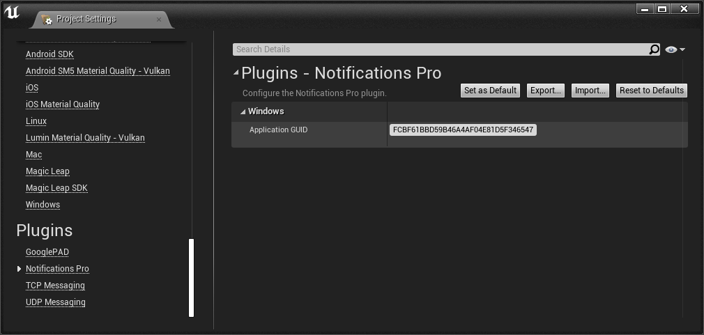
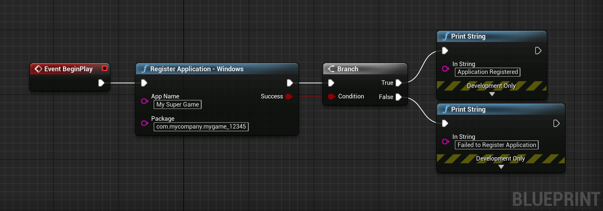
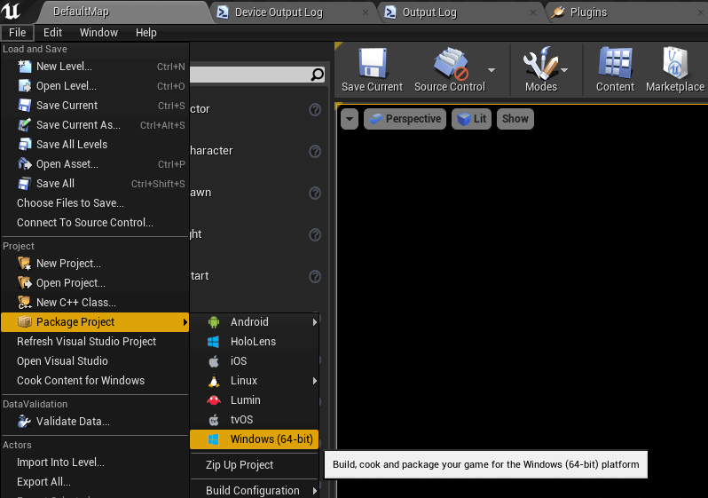
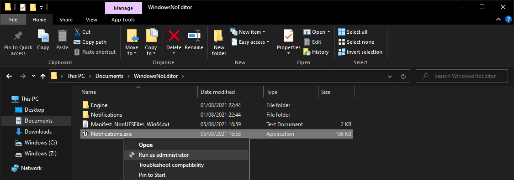

<style>
#ruuid,
#uuid {
	margin: 0 10px;
	padding: 5px;
	border-radius:5px;
	width: 290px;
	text-align:center;
	font-family: Consolas, monaco, monospace;
	font-style: normal; 
	font-variant: normal;
	background:#222;
	border: 1px solid #333;
	color: #aaa;
}
#ruuid {
	width: 310px;
}
#gen-uuid {
	padding: 5px;
	border-radius:5px;
	background: #121212;
	color: #aaa;
	border: 1px solid #888;
	cursor:pointer;
	margin-right: 10px;
	transition: background 0.2s ease-in-out;
}
#gen-uuid:hover {
	background: #222;
}
</style>

# Windows - Get Started

This section will help you to get started using the plugin on the Windows platform.

## Prerequisites
To be able to show Toast notifications, receive events from them and have them persist in the notification center, 
your application has to:

1. Have a shortcut with a unique Application User Model ID in `C:\ProgramData\Microsoft\Windows\Start Menu\Programs\`.
2. Be registered in the register with a unique GUID.

!> These steps should be done by the installer installing your game.

If this is not yet the case, the next section shows you how to do it directly within your game.


## Installing and Registering your Application

#### 1. Getting a GUID
Your application needs a GUID. If you don't have one, you can generate one by clicking on the button below:

<div style="text-align:center">
<button id="gen-uuid" onclick="generateGuidClicked()">Generate GUID</button> Use
<input readonly id="uuid"/> for
<input readonly id="ruuid"/>
</div>

#### 2. Set your GUID in the Plugin Settings  
Open the Editor and go to `Edit` > `Project Settings...` > `Plugins` > `Notifications Pro`.  
Set the Application GUID to your GUID.

<div class="centered">

</div>

#### 3. Installing and Registering your Application (for development only)

?> The following steps are meant to be done for development only. Your installer should take care of them when you
release your game to the clients.

Add the following code in your application in a place where it will be executed at your app startup.  
A good place for it is your Game Instance's or your Game Mode's `BeginPlay` method.

<div class="code-switcher show-cpp-true">
<div class="switcher" >
<span class="sw-bp" onclick="switchBp()">Blueprints</span><span class="sw-cpp" onclick="switchCpp()">C++</span>
</div>
<div class="cpp">

```cpp
#include "Notifications/Windows.h"

// ...

void USomeClass::BeginPlay()
{
	Super::BeginPlay();
	
	// ...
	
	const bool bSuccess = UWindowsNotificationsLibrary::RegisterApplication
	(
		TEXT("My Super Game"), 
		TEXT("com.mycompany.mygame_12345")
	);
	
	check(bSuccess);
}
```

</div>

<div class="bp">

<div class="bpcode">
<textarea readonly>
Begin Object Class=/Script/BlueprintGraph.K2Node_Event Name="K2Node_Event_3"
   EventReference=(MemberParent=Class'"/Script/Engine.Actor"',MemberName="ReceiveBeginPlay")
   bOverrideFunction=True
   NodePosX=-304
   NodePosY=-1472
   NodeGuid=D43DC5E0417B9D8FC56F5F81B8677B50
   CustomProperties Pin (PinId=8017EED343CB378911AE978B651F4B53,PinName="OutputDelegate",Direction="EGPD_Output",PinType.PinCategory="delegate",PinType.PinSubCategory="",PinType.PinSubCategoryObject=None,PinType.PinSubCategoryMemberReference=(MemberParent=Class'"/Script/Engine.Actor"',MemberName="ReceiveBeginPlay"),PinType.PinValueType=(),PinType.ContainerType=None,PinType.bIsReference=False,PinType.bIsConst=False,PinType.bIsWeakPointer=False,PinType.bIsUObjectWrapper=True,PersistentGuid=00000000000000000000000000000000,bHidden=False,bNotConnectable=False,bDefaultValueIsReadOnly=False,bDefaultValueIsIgnored=False,bAdvancedView=False,bOrphanedPin=False,)
   CustomProperties Pin (PinId=FC7DB78746456F6C42049AB9CE390B2F,PinName="then",Direction="EGPD_Output",PinType.PinCategory="exec",PinType.PinSubCategory="",PinType.PinSubCategoryObject=None,PinType.PinSubCategoryMemberReference=(),PinType.PinValueType=(),PinType.ContainerType=None,PinType.bIsReference=False,PinType.bIsConst=False,PinType.bIsWeakPointer=False,PinType.bIsUObjectWrapper=True,LinkedTo=(K2Node_CallFunction_8 7DF511004B8031B6A3AF37A14CEAAB31,),PersistentGuid=00000000000000000000000000000000,bHidden=False,bNotConnectable=False,bDefaultValueIsReadOnly=False,bDefaultValueIsIgnored=False,bAdvancedView=False,bOrphanedPin=False,)
End Object
Begin Object Class=/Script/BlueprintGraph.K2Node_CallFunction Name="K2Node_CallFunction_8"
   FunctionReference=(MemberParent=Class'"/Script/NotificationsPro.WindowsNotificationsLibrary"',MemberName="RegisterApplication")
   NodePosX=-96
   NodePosY=-1472
   NodeGuid=53F3FD8A42EE26D12CFC3AAC6F6A586D
   CustomProperties Pin (PinId=7DF511004B8031B6A3AF37A14CEAAB31,PinName="execute",PinToolTip="\nExec",PinType.PinCategory="exec",PinType.PinSubCategory="",PinType.PinSubCategoryObject=None,PinType.PinSubCategoryMemberReference=(),PinType.PinValueType=(),PinType.ContainerType=None,PinType.bIsReference=False,PinType.bIsConst=False,PinType.bIsWeakPointer=False,PinType.bIsUObjectWrapper=True,LinkedTo=(K2Node_Event_3 FC7DB78746456F6C42049AB9CE390B2F,),PersistentGuid=00000000000000000000000000000000,bHidden=False,bNotConnectable=False,bDefaultValueIsReadOnly=False,bDefaultValueIsIgnored=False,bAdvancedView=False,bOrphanedPin=False,)
   CustomProperties Pin (PinId=F290BB2C416A43A4BE16DDB543985D74,PinName="then",PinToolTip="\nExec",Direction="EGPD_Output",PinType.PinCategory="exec",PinType.PinSubCategory="",PinType.PinSubCategoryObject=None,PinType.PinSubCategoryMemberReference=(),PinType.PinValueType=(),PinType.ContainerType=None,PinType.bIsReference=False,PinType.bIsConst=False,PinType.bIsWeakPointer=False,PinType.bIsUObjectWrapper=True,LinkedTo=(K2Node_IfThenElse_0 8C23E23E48D8778579B0BE904DC78B35,),PersistentGuid=00000000000000000000000000000000,bHidden=False,bNotConnectable=False,bDefaultValueIsReadOnly=False,bDefaultValueIsIgnored=False,bAdvancedView=False,bOrphanedPin=False,)
   CustomProperties Pin (PinId=5B879EAB40FBC350BF1B9DA8AFA7B45E,PinName="self",PinFriendlyName=NSLOCTEXT("K2Node", "Target", "Target"),PinToolTip="Target\nWindows Notifications Library Object Reference",PinType.PinCategory="object",PinType.PinSubCategory="",PinType.PinSubCategoryObject=Class'"/Script/NotificationsPro.WindowsNotificationsLibrary"',PinType.PinSubCategoryMemberReference=(),PinType.PinValueType=(),PinType.ContainerType=None,PinType.bIsReference=False,PinType.bIsConst=False,PinType.bIsWeakPointer=False,PinType.bIsUObjectWrapper=False,DefaultObject="/Script/NotificationsPro.Default__WindowsNotificationsLibrary",PersistentGuid=00000000000000000000000000000000,bHidden=True,bNotConnectable=False,bDefaultValueIsReadOnly=False,bDefaultValueIsIgnored=False,bAdvancedView=False,bOrphanedPin=False,)
   CustomProperties Pin (PinId=6D2D76214728EA9E81A3859AE684F98A,PinName="AppName",PinToolTip="App Name\nString\n\nThe name of the application. Displayed in the search.",PinType.PinCategory="string",PinType.PinSubCategory="",PinType.PinSubCategoryObject=None,PinType.PinSubCategoryMemberReference=(),PinType.PinValueType=(),PinType.ContainerType=None,PinType.bIsReference=False,PinType.bIsConst=False,PinType.bIsWeakPointer=False,PinType.bIsUObjectWrapper=False,DefaultValue="My Super Game",PersistentGuid=00000000000000000000000000000000,bHidden=False,bNotConnectable=False,bDefaultValueIsReadOnly=False,bDefaultValueIsIgnored=False,bAdvancedView=False,bOrphanedPin=False,)
   CustomProperties Pin (PinId=091F32714E2BDD1188A7AAB48CB49C4D,PinName="Package",PinToolTip="Package\nString\n\nThe globally unique identifier for your application. Recommended form: [TopDomain].[Company].[Application][OptionalRandomChars]",PinType.PinCategory="string",PinType.PinSubCategory="",PinType.PinSubCategoryObject=None,PinType.PinSubCategoryMemberReference=(),PinType.PinValueType=(),PinType.ContainerType=None,PinType.bIsReference=False,PinType.bIsConst=False,PinType.bIsWeakPointer=False,PinType.bIsUObjectWrapper=False,DefaultValue="com.mycompany.mygame_12345",PersistentGuid=00000000000000000000000000000000,bHidden=False,bNotConnectable=False,bDefaultValueIsReadOnly=False,bDefaultValueIsIgnored=False,bAdvancedView=False,bOrphanedPin=False,)
   CustomProperties Pin (PinId=CCF0564645D36F8F3BC7859E7121B579,PinName="ReturnValue",PinFriendlyName="Success",PinToolTip="Success\nBoolean\n\nTrue if the application has been registered.",Direction="EGPD_Output",PinType.PinCategory="bool",PinType.PinSubCategory="",PinType.PinSubCategoryObject=None,PinType.PinSubCategoryMemberReference=(),PinType.PinValueType=(),PinType.ContainerType=None,PinType.bIsReference=False,PinType.bIsConst=False,PinType.bIsWeakPointer=False,PinType.bIsUObjectWrapper=False,DefaultValue="false",AutogeneratedDefaultValue="false",LinkedTo=(K2Node_IfThenElse_0 AFDD5D094A80EEBD81E96791F3D798A6,),PersistentGuid=00000000000000000000000000000000,bHidden=False,bNotConnectable=False,bDefaultValueIsReadOnly=False,bDefaultValueIsIgnored=False,bAdvancedView=False,bOrphanedPin=False,)
End Object
Begin Object Class=/Script/BlueprintGraph.K2Node_IfThenElse Name="K2Node_IfThenElse_0"
   NodePosX=272
   NodePosY=-1472
   NodeGuid=407ABD63483EED710AF3F2A122C08011
   CustomProperties Pin (PinId=8C23E23E48D8778579B0BE904DC78B35,PinName="execute",PinType.PinCategory="exec",PinType.PinSubCategory="",PinType.PinSubCategoryObject=None,PinType.PinSubCategoryMemberReference=(),PinType.PinValueType=(),PinType.ContainerType=None,PinType.bIsReference=False,PinType.bIsConst=False,PinType.bIsWeakPointer=False,PinType.bIsUObjectWrapper=True,LinkedTo=(K2Node_CallFunction_8 F290BB2C416A43A4BE16DDB543985D74,),PersistentGuid=00000000000000000000000000000000,bHidden=False,bNotConnectable=False,bDefaultValueIsReadOnly=False,bDefaultValueIsIgnored=False,bAdvancedView=False,bOrphanedPin=False,)
   CustomProperties Pin (PinId=AFDD5D094A80EEBD81E96791F3D798A6,PinName="Condition",PinType.PinCategory="bool",PinType.PinSubCategory="",PinType.PinSubCategoryObject=None,PinType.PinSubCategoryMemberReference=(),PinType.PinValueType=(),PinType.ContainerType=None,PinType.bIsReference=False,PinType.bIsConst=False,PinType.bIsWeakPointer=False,PinType.bIsUObjectWrapper=True,DefaultValue="true",AutogeneratedDefaultValue="true",LinkedTo=(K2Node_CallFunction_8 CCF0564645D36F8F3BC7859E7121B579,),PersistentGuid=00000000000000000000000000000000,bHidden=False,bNotConnectable=False,bDefaultValueIsReadOnly=False,bDefaultValueIsIgnored=False,bAdvancedView=False,bOrphanedPin=False,)
   CustomProperties Pin (PinId=0D1263F04A42AC5F528C378A298FE021,PinName="then",PinFriendlyName=NSLOCTEXT("K2Node", "true", "true"),Direction="EGPD_Output",PinType.PinCategory="exec",PinType.PinSubCategory="",PinType.PinSubCategoryObject=None,PinType.PinSubCategoryMemberReference=(),PinType.PinValueType=(),PinType.ContainerType=None,PinType.bIsReference=False,PinType.bIsConst=False,PinType.bIsWeakPointer=False,PinType.bIsUObjectWrapper=False,LinkedTo=(K2Node_CallFunction_6 60D85BB8440DAD43E7CBDFA80C6C1D67,),PersistentGuid=00000000000000000000000000000000,bHidden=False,bNotConnectable=False,bDefaultValueIsReadOnly=False,bDefaultValueIsIgnored=False,bAdvancedView=False,bOrphanedPin=False,)
   CustomProperties Pin (PinId=6C6AD5BE4D2A24F13E048DA35359DB88,PinName="else",PinFriendlyName=NSLOCTEXT("K2Node", "false", "false"),Direction="EGPD_Output",PinType.PinCategory="exec",PinType.PinSubCategory="",PinType.PinSubCategoryObject=None,PinType.PinSubCategoryMemberReference=(),PinType.PinValueType=(),PinType.ContainerType=None,PinType.bIsReference=False,PinType.bIsConst=False,PinType.bIsWeakPointer=False,PinType.bIsUObjectWrapper=False,LinkedTo=(K2Node_CallFunction_9 548527914966AE18D05208AC1A4CE5CA,),PersistentGuid=00000000000000000000000000000000,bHidden=False,bNotConnectable=False,bDefaultValueIsReadOnly=False,bDefaultValueIsIgnored=False,bAdvancedView=False,bOrphanedPin=False,)
End Object
Begin Object Class=/Script/BlueprintGraph.K2Node_CallFunction Name="K2Node_CallFunction_6"
   FunctionReference=(MemberParent=Class'"/Script/Engine.KismetSystemLibrary"',MemberName="PrintString")
   NodePosX=496
   NodePosY=-1536
   AdvancedPinDisplay=Hidden
   EnabledState=DevelopmentOnly
   NodeGuid=404BD87A4C91D2BD7302939FE5B4F2A5
   CustomProperties Pin (PinId=60D85BB8440DAD43E7CBDFA80C6C1D67,PinName="execute",PinToolTip="\nExec",PinType.PinCategory="exec",PinType.PinSubCategory="",PinType.PinSubCategoryObject=None,PinType.PinSubCategoryMemberReference=(),PinType.PinValueType=(),PinType.ContainerType=None,PinType.bIsReference=False,PinType.bIsConst=False,PinType.bIsWeakPointer=False,PinType.bIsUObjectWrapper=False,LinkedTo=(K2Node_IfThenElse_0 0D1263F04A42AC5F528C378A298FE021,),PersistentGuid=00000000000000000000000000000000,bHidden=False,bNotConnectable=False,bDefaultValueIsReadOnly=False,bDefaultValueIsIgnored=False,bAdvancedView=False,bOrphanedPin=False,)
   CustomProperties Pin (PinId=7A655E0B42B19D17F9F310A92330A68A,PinName="then",PinToolTip="\nExec",Direction="EGPD_Output",PinType.PinCategory="exec",PinType.PinSubCategory="",PinType.PinSubCategoryObject=None,PinType.PinSubCategoryMemberReference=(),PinType.PinValueType=(),PinType.ContainerType=None,PinType.bIsReference=False,PinType.bIsConst=False,PinType.bIsWeakPointer=False,PinType.bIsUObjectWrapper=False,PersistentGuid=00000000000000000000000000000000,bHidden=False,bNotConnectable=False,bDefaultValueIsReadOnly=False,bDefaultValueIsIgnored=False,bAdvancedView=False,bOrphanedPin=False,)
   CustomProperties Pin (PinId=2FF0D9F948F31369F1D468BF0DADFDAE,PinName="self",PinFriendlyName=NSLOCTEXT("K2Node", "Target", "Target"),PinToolTip="Target\nKismet System Library Object Reference",PinType.PinCategory="object",PinType.PinSubCategory="",PinType.PinSubCategoryObject=Class'"/Script/Engine.KismetSystemLibrary"',PinType.PinSubCategoryMemberReference=(),PinType.PinValueType=(),PinType.ContainerType=None,PinType.bIsReference=False,PinType.bIsConst=False,PinType.bIsWeakPointer=False,PinType.bIsUObjectWrapper=False,DefaultObject="/Script/Engine.Default__KismetSystemLibrary",PersistentGuid=00000000000000000000000000000000,bHidden=True,bNotConnectable=False,bDefaultValueIsReadOnly=False,bDefaultValueIsIgnored=False,bAdvancedView=False,bOrphanedPin=False,)
   CustomProperties Pin (PinId=1DC1FC124985DB02C37334BB87125148,PinName="WorldContextObject",PinToolTip="World Context Object\nObject Reference",PinType.PinCategory="object",PinType.PinSubCategory="",PinType.PinSubCategoryObject=Class'"/Script/CoreUObject.Object"',PinType.PinSubCategoryMemberReference=(),PinType.PinValueType=(),PinType.ContainerType=None,PinType.bIsReference=False,PinType.bIsConst=True,PinType.bIsWeakPointer=False,PinType.bIsUObjectWrapper=False,PersistentGuid=00000000000000000000000000000000,bHidden=True,bNotConnectable=False,bDefaultValueIsReadOnly=False,bDefaultValueIsIgnored=False,bAdvancedView=False,bOrphanedPin=False,)
   CustomProperties Pin (PinId=98F3460D4829041F38490693CEFA065F,PinName="InString",PinToolTip="In String\nString\n\nThe string to log out",PinType.PinCategory="string",PinType.PinSubCategory="",PinType.PinSubCategoryObject=None,PinType.PinSubCategoryMemberReference=(),PinType.PinValueType=(),PinType.ContainerType=None,PinType.bIsReference=False,PinType.bIsConst=False,PinType.bIsWeakPointer=False,PinType.bIsUObjectWrapper=False,DefaultValue="Application Registered",AutogeneratedDefaultValue="Hello",PersistentGuid=00000000000000000000000000000000,bHidden=False,bNotConnectable=False,bDefaultValueIsReadOnly=False,bDefaultValueIsIgnored=False,bAdvancedView=False,bOrphanedPin=False,)
   CustomProperties Pin (PinId=CBE84FAF433C3E4724162087C7913540,PinName="bPrintToScreen",PinToolTip="Print to Screen\nBoolean\n\nWhether or not to print the output to the screen",PinType.PinCategory="bool",PinType.PinSubCategory="",PinType.PinSubCategoryObject=None,PinType.PinSubCategoryMemberReference=(),PinType.PinValueType=(),PinType.ContainerType=None,PinType.bIsReference=False,PinType.bIsConst=False,PinType.bIsWeakPointer=False,PinType.bIsUObjectWrapper=False,DefaultValue="true",AutogeneratedDefaultValue="true",PersistentGuid=00000000000000000000000000000000,bHidden=False,bNotConnectable=False,bDefaultValueIsReadOnly=False,bDefaultValueIsIgnored=False,bAdvancedView=True,bOrphanedPin=False,)
   CustomProperties Pin (PinId=D72AEDEF49C474E632C786B15DE7016D,PinName="bPrintToLog",PinToolTip="Print to Log\nBoolean\n\nWhether or not to print the output to the log",PinType.PinCategory="bool",PinType.PinSubCategory="",PinType.PinSubCategoryObject=None,PinType.PinSubCategoryMemberReference=(),PinType.PinValueType=(),PinType.ContainerType=None,PinType.bIsReference=False,PinType.bIsConst=False,PinType.bIsWeakPointer=False,PinType.bIsUObjectWrapper=False,DefaultValue="true",AutogeneratedDefaultValue="true",PersistentGuid=00000000000000000000000000000000,bHidden=False,bNotConnectable=False,bDefaultValueIsReadOnly=False,bDefaultValueIsIgnored=False,bAdvancedView=True,bOrphanedPin=False,)
   CustomProperties Pin (PinId=8D7FF2FE470401B696A144A6993C667C,PinName="TextColor",PinToolTip="Text Color\nLinear Color Structure\n\nWhether or not to print the output to the console",PinType.PinCategory="struct",PinType.PinSubCategory="",PinType.PinSubCategoryObject=ScriptStruct'"/Script/CoreUObject.LinearColor"',PinType.PinSubCategoryMemberReference=(),PinType.PinValueType=(),PinType.ContainerType=None,PinType.bIsReference=False,PinType.bIsConst=False,PinType.bIsWeakPointer=False,PinType.bIsUObjectWrapper=False,DefaultValue="(R=0.014051,G=1.000000,B=0.000000,A=1.000000)",AutogeneratedDefaultValue="(R=0.000000,G=0.660000,B=1.000000,A=1.000000)",PersistentGuid=00000000000000000000000000000000,bHidden=False,bNotConnectable=False,bDefaultValueIsReadOnly=False,bDefaultValueIsIgnored=False,bAdvancedView=True,bOrphanedPin=False,)
   CustomProperties Pin (PinId=50C52E714D319EC7DD22BBBE1C323614,PinName="Duration",PinToolTip="Duration\nFloat\n\nThe display duration (if Print to Screen is True). Using negative number will result in loading the duration time from the config.",PinType.PinCategory="float",PinType.PinSubCategory="",PinType.PinSubCategoryObject=None,PinType.PinSubCategoryMemberReference=(),PinType.PinValueType=(),PinType.ContainerType=None,PinType.bIsReference=False,PinType.bIsConst=False,PinType.bIsWeakPointer=False,PinType.bIsUObjectWrapper=False,DefaultValue="100.000000",AutogeneratedDefaultValue="2.000000",PersistentGuid=00000000000000000000000000000000,bHidden=False,bNotConnectable=False,bDefaultValueIsReadOnly=False,bDefaultValueIsIgnored=False,bAdvancedView=True,bOrphanedPin=False,)
End Object
Begin Object Class=/Script/BlueprintGraph.K2Node_CallFunction Name="K2Node_CallFunction_9"
   FunctionReference=(MemberParent=Class'"/Script/Engine.KismetSystemLibrary"',MemberName="PrintString")
   NodePosX=496
   NodePosY=-1392
   AdvancedPinDisplay=Hidden
   EnabledState=DevelopmentOnly
   NodeGuid=23720DC642B406966E1DC79C5A6BBAD7
   CustomProperties Pin (PinId=548527914966AE18D05208AC1A4CE5CA,PinName="execute",PinToolTip="\nExec",PinType.PinCategory="exec",PinType.PinSubCategory="",PinType.PinSubCategoryObject=None,PinType.PinSubCategoryMemberReference=(),PinType.PinValueType=(),PinType.ContainerType=None,PinType.bIsReference=False,PinType.bIsConst=False,PinType.bIsWeakPointer=False,PinType.bIsUObjectWrapper=False,LinkedTo=(K2Node_IfThenElse_0 6C6AD5BE4D2A24F13E048DA35359DB88,),PersistentGuid=00000000000000000000000000000000,bHidden=False,bNotConnectable=False,bDefaultValueIsReadOnly=False,bDefaultValueIsIgnored=False,bAdvancedView=False,bOrphanedPin=False,)
   CustomProperties Pin (PinId=2187FB75443A2B891540EE8001C2EBFD,PinName="then",PinToolTip="\nExec",Direction="EGPD_Output",PinType.PinCategory="exec",PinType.PinSubCategory="",PinType.PinSubCategoryObject=None,PinType.PinSubCategoryMemberReference=(),PinType.PinValueType=(),PinType.ContainerType=None,PinType.bIsReference=False,PinType.bIsConst=False,PinType.bIsWeakPointer=False,PinType.bIsUObjectWrapper=False,PersistentGuid=00000000000000000000000000000000,bHidden=False,bNotConnectable=False,bDefaultValueIsReadOnly=False,bDefaultValueIsIgnored=False,bAdvancedView=False,bOrphanedPin=False,)
   CustomProperties Pin (PinId=478DBA8A470EAE81CE5A5AB5678E0CBC,PinName="self",PinFriendlyName=NSLOCTEXT("K2Node", "Target", "Target"),PinToolTip="Target\nKismet System Library Object Reference",PinType.PinCategory="object",PinType.PinSubCategory="",PinType.PinSubCategoryObject=Class'"/Script/Engine.KismetSystemLibrary"',PinType.PinSubCategoryMemberReference=(),PinType.PinValueType=(),PinType.ContainerType=None,PinType.bIsReference=False,PinType.bIsConst=False,PinType.bIsWeakPointer=False,PinType.bIsUObjectWrapper=False,DefaultObject="/Script/Engine.Default__KismetSystemLibrary",PersistentGuid=00000000000000000000000000000000,bHidden=True,bNotConnectable=False,bDefaultValueIsReadOnly=False,bDefaultValueIsIgnored=False,bAdvancedView=False,bOrphanedPin=False,)
   CustomProperties Pin (PinId=44EB98EB4ABBB0883C75359217A649B9,PinName="WorldContextObject",PinToolTip="World Context Object\nObject Reference",PinType.PinCategory="object",PinType.PinSubCategory="",PinType.PinSubCategoryObject=Class'"/Script/CoreUObject.Object"',PinType.PinSubCategoryMemberReference=(),PinType.PinValueType=(),PinType.ContainerType=None,PinType.bIsReference=False,PinType.bIsConst=True,PinType.bIsWeakPointer=False,PinType.bIsUObjectWrapper=False,PersistentGuid=00000000000000000000000000000000,bHidden=True,bNotConnectable=False,bDefaultValueIsReadOnly=False,bDefaultValueIsIgnored=False,bAdvancedView=False,bOrphanedPin=False,)
   CustomProperties Pin (PinId=1FB456034A1F79351457D3B5AF9AB5A1,PinName="InString",PinToolTip="In String\nString\n\nThe string to log out",PinType.PinCategory="string",PinType.PinSubCategory="",PinType.PinSubCategoryObject=None,PinType.PinSubCategoryMemberReference=(),PinType.PinValueType=(),PinType.ContainerType=None,PinType.bIsReference=False,PinType.bIsConst=False,PinType.bIsWeakPointer=False,PinType.bIsUObjectWrapper=False,DefaultValue="Failed to Register Application",AutogeneratedDefaultValue="Hello",PersistentGuid=00000000000000000000000000000000,bHidden=False,bNotConnectable=False,bDefaultValueIsReadOnly=False,bDefaultValueIsIgnored=False,bAdvancedView=False,bOrphanedPin=False,)
   CustomProperties Pin (PinId=541501F44B4766492D00BDBACE13FD6E,PinName="bPrintToScreen",PinToolTip="Print to Screen\nBoolean\n\nWhether or not to print the output to the screen",PinType.PinCategory="bool",PinType.PinSubCategory="",PinType.PinSubCategoryObject=None,PinType.PinSubCategoryMemberReference=(),PinType.PinValueType=(),PinType.ContainerType=None,PinType.bIsReference=False,PinType.bIsConst=False,PinType.bIsWeakPointer=False,PinType.bIsUObjectWrapper=False,DefaultValue="true",AutogeneratedDefaultValue="true",PersistentGuid=00000000000000000000000000000000,bHidden=False,bNotConnectable=False,bDefaultValueIsReadOnly=False,bDefaultValueIsIgnored=False,bAdvancedView=True,bOrphanedPin=False,)
   CustomProperties Pin (PinId=FBAECE0F4554E36717035F9749FB7126,PinName="bPrintToLog",PinToolTip="Print to Log\nBoolean\n\nWhether or not to print the output to the log",PinType.PinCategory="bool",PinType.PinSubCategory="",PinType.PinSubCategoryObject=None,PinType.PinSubCategoryMemberReference=(),PinType.PinValueType=(),PinType.ContainerType=None,PinType.bIsReference=False,PinType.bIsConst=False,PinType.bIsWeakPointer=False,PinType.bIsUObjectWrapper=False,DefaultValue="true",AutogeneratedDefaultValue="true",PersistentGuid=00000000000000000000000000000000,bHidden=False,bNotConnectable=False,bDefaultValueIsReadOnly=False,bDefaultValueIsIgnored=False,bAdvancedView=True,bOrphanedPin=False,)
   CustomProperties Pin (PinId=7591E9514C3DD247217C83AEF945C717,PinName="TextColor",PinToolTip="Text Color\nLinear Color Structure\n\nWhether or not to print the output to the console",PinType.PinCategory="struct",PinType.PinSubCategory="",PinType.PinSubCategoryObject=ScriptStruct'"/Script/CoreUObject.LinearColor"',PinType.PinSubCategoryMemberReference=(),PinType.PinValueType=(),PinType.ContainerType=None,PinType.bIsReference=False,PinType.bIsConst=False,PinType.bIsWeakPointer=False,PinType.bIsUObjectWrapper=False,DefaultValue="(R=1.000000,G=0.000000,B=0.122801,A=1.000000)",AutogeneratedDefaultValue="(R=0.000000,G=0.660000,B=1.000000,A=1.000000)",PersistentGuid=00000000000000000000000000000000,bHidden=False,bNotConnectable=False,bDefaultValueIsReadOnly=False,bDefaultValueIsIgnored=False,bAdvancedView=True,bOrphanedPin=False,)
   CustomProperties Pin (PinId=B9BAFC044D4EBBDC2C4C448DA0D4B9BF,PinName="Duration",PinToolTip="Duration\nFloat\n\nThe display duration (if Print to Screen is True). Using negative number will result in loading the duration time from the config.",PinType.PinCategory="float",PinType.PinSubCategory="",PinType.PinSubCategoryObject=None,PinType.PinSubCategoryMemberReference=(),PinType.PinValueType=(),PinType.ContainerType=None,PinType.bIsReference=False,PinType.bIsConst=False,PinType.bIsWeakPointer=False,PinType.bIsUObjectWrapper=False,DefaultValue="100.000000",AutogeneratedDefaultValue="2.000000",PersistentGuid=00000000000000000000000000000000,bHidden=False,bNotConnectable=False,bDefaultValueIsReadOnly=False,bDefaultValueIsIgnored=False,bAdvancedView=True,bOrphanedPin=False,)
End Object
</textarea>

<button onclick="copyBlueprintCode(this)">Copy Code</button>
</div>
</div>
</div>


This method will do two things:
1. Create a shortcut in the application folder with the name `App Name` associated with the package `Package`.
2. Register the application and its COM server in the registry for handling toast events with the GUID specified before.


As these operations require admistrator rights, we need to launch the application as administrator:

1. Select `File` > `Package Project` > `Windows (64-bit)` to package the game.


<div class="centered">

</div>

2. Right click on your packaged game's executable and select `Run as administrator`.

<div class="centered">

</div>

!> If you try clicking on a notification when your game is launched as administrator, a new non-administrator instance of your game 
will be launched. For testing, make sure you are not running as administrator.

3. Wait until you are sure the method has completed and close your game.

4. To check that your game is correctly registered, open a powershell prompt (`WIN + R` then type `powershell`) and run the following command
with the name of your game.
```powershell
Get-StartApps | ? { $_.Name -eq "My Super Game" }
```
```
Name            AppID
————            —————
My Super Game   com.mycompany.mygame_12345
```

5. And that's all. Clicking on a Toast notification while your application is closed should start your game.


<script>
setTimeout(() => {
	bShowCPP = !JSON.parse(getCookie('bShowCPP'));
	switchCode();
}, 0);
</script>


