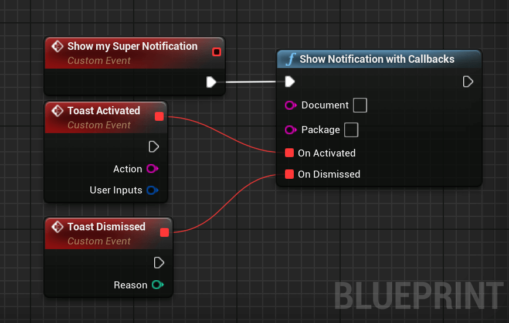
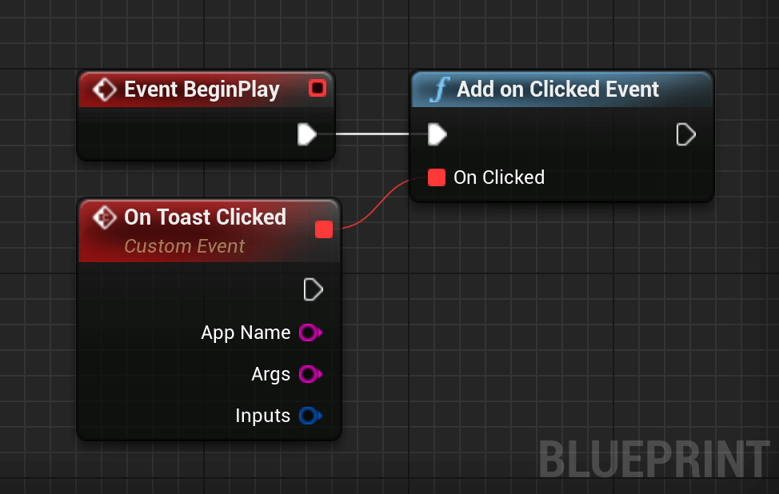
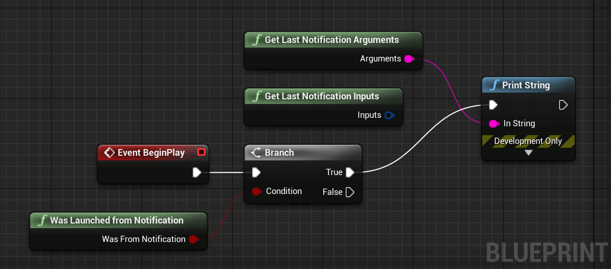

# Handling Notification's Actions
This section covers how to handle the notification's actions in your game.

## Application Lived Actions

Events bound to an instance of a Toast are application-lived. It means that restarting your application will remove the event.

<div class="code-switcher show-cpp-true">
<div class="switcher" >
<span class="sw-bp" onclick="switchBp()">Blueprints</span><span class="sw-cpp" onclick="switchCpp()">C++</span>
</div>
<div class="cpp">

```cpp
void ShowMySuperNotification()
{
	UWindowsNotificationLibrary::ShowNotification
	(
		TEXT("..."), /* Toast XML */
		TEXT("..."), /* Application package */
		
		// Short-lived callback when the Toast is clicked.
		FOnToastClicked::CreateLambda([](
			const FString& Args,
			const FWindowsNotificationInputs& Inputs) -> void
		{
			// Toast activated.
		}),
		
		// Callback called when the Toast is dismissed.
		FOnToastDismissed::CreateLambda([](EWindowsToastDismissalReason Reason) -> void
		{
			// Toast dismissed.
		})
	);
}
```

</div>
<div class="bp">
<div class="bpcode">
<textarea readonly>
Begin Object Class=/Script/BlueprintGraph.K2Node_CustomEvent Name="K2Node_CustomEvent_4"
   CustomFunctionName="Show My Super Notification"
   NodePosX=64
   NodePosY=-1584
   NodeGuid=584513F247B884D5D2A91F9ED05EB1F0
   CustomProperties Pin (PinId=78BA05484EB9C8372FCBFD93D38B4D5E,PinName="OutputDelegate",Direction="EGPD_Output",PinType.PinCategory="delegate",PinType.PinSubCategory="",PinType.PinSubCategoryObject=None,PinType.PinSubCategoryMemberReference=(),PinType.PinValueType=(),PinType.ContainerType=None,PinType.bIsReference=False,PinType.bIsConst=False,PinType.bIsWeakPointer=False,PinType.bIsUObjectWrapper=False,PersistentGuid=00000000000000000000000000000000,bHidden=False,bNotConnectable=False,bDefaultValueIsReadOnly=False,bDefaultValueIsIgnored=False,bAdvancedView=False,bOrphanedPin=False,)
   CustomProperties Pin (PinId=137A66DF4F380582DD153BA3EAB1E221,PinName="then",Direction="EGPD_Output",PinType.PinCategory="exec",PinType.PinSubCategory="",PinType.PinSubCategoryObject=None,PinType.PinSubCategoryMemberReference=(),PinType.PinValueType=(),PinType.ContainerType=None,PinType.bIsReference=False,PinType.bIsConst=False,PinType.bIsWeakPointer=False,PinType.bIsUObjectWrapper=False,LinkedTo=(K2Node_CallFunction_5 433E13AA421DA16E474374AE96D400D6,),PersistentGuid=00000000000000000000000000000000,bHidden=False,bNotConnectable=False,bDefaultValueIsReadOnly=False,bDefaultValueIsIgnored=False,bAdvancedView=False,bOrphanedPin=False,)
End Object
Begin Object Class=/Script/BlueprintGraph.K2Node_CallFunction Name="K2Node_CallFunction_5"
   FunctionReference=(MemberParent=Class'"/Script/WindowsNotification.WindowsNotificationLibrary"',MemberName="Blueprints_ShowNotificationWithCallbacks")
   NodePosX=368
   NodePosY=-1568
   NodeGuid=77D359054FCA5AB5CB82B7821443F63A
   CustomProperties Pin (PinId=433E13AA421DA16E474374AE96D400D6,PinName="execute",PinToolTip="\nExec",PinType.PinCategory="exec",PinType.PinSubCategory="",PinType.PinSubCategoryObject=None,PinType.PinSubCategoryMemberReference=(),PinType.PinValueType=(),PinType.ContainerType=None,PinType.bIsReference=False,PinType.bIsConst=False,PinType.bIsWeakPointer=False,PinType.bIsUObjectWrapper=False,LinkedTo=(K2Node_CustomEvent_4 137A66DF4F380582DD153BA3EAB1E221,),PersistentGuid=00000000000000000000000000000000,bHidden=False,bNotConnectable=False,bDefaultValueIsReadOnly=False,bDefaultValueIsIgnored=False,bAdvancedView=False,bOrphanedPin=False,)
   CustomProperties Pin (PinId=0242C8614F7EB4905B1057ADE1456B2B,PinName="then",PinToolTip="\nExec",Direction="EGPD_Output",PinType.PinCategory="exec",PinType.PinSubCategory="",PinType.PinSubCategoryObject=None,PinType.PinSubCategoryMemberReference=(),PinType.PinValueType=(),PinType.ContainerType=None,PinType.bIsReference=False,PinType.bIsConst=False,PinType.bIsWeakPointer=False,PinType.bIsUObjectWrapper=False,PersistentGuid=00000000000000000000000000000000,bHidden=False,bNotConnectable=False,bDefaultValueIsReadOnly=False,bDefaultValueIsIgnored=False,bAdvancedView=False,bOrphanedPin=False,)
   CustomProperties Pin (PinId=79C7CFD544430520C9537088CF192DB7,PinName="self",PinFriendlyName=NSLOCTEXT("K2Node", "Target", "Target"),PinToolTip="Target\nWindows Notification Library Object Reference",PinType.PinCategory="object",PinType.PinSubCategory="",PinType.PinSubCategoryObject=Class'"/Script/WindowsNotification.WindowsNotificationLibrary"',PinType.PinSubCategoryMemberReference=(),PinType.PinValueType=(),PinType.ContainerType=None,PinType.bIsReference=False,PinType.bIsConst=False,PinType.bIsWeakPointer=False,PinType.bIsUObjectWrapper=False,DefaultObject="/Script/WindowsNotification.Default__WindowsNotificationLibrary",PersistentGuid=00000000000000000000000000000000,bHidden=True,bNotConnectable=False,bDefaultValueIsReadOnly=False,bDefaultValueIsIgnored=False,bAdvancedView=False,bOrphanedPin=False,)
   CustomProperties Pin (PinId=597D49ED45ACD093A358BDA366AFFD5A,PinName="Document",PinToolTip="Document\nString\n\nThe XML document representing the notification.",PinType.PinCategory="string",PinType.PinSubCategory="",PinType.PinSubCategoryObject=None,PinType.PinSubCategoryMemberReference=(),PinType.PinValueType=(),PinType.ContainerType=None,PinType.bIsReference=False,PinType.bIsConst=False,PinType.bIsWeakPointer=False,PinType.bIsUObjectWrapper=False,PersistentGuid=00000000000000000000000000000000,bHidden=False,bNotConnectable=False,bDefaultValueIsReadOnly=False,bDefaultValueIsIgnored=False,bAdvancedView=False,bOrphanedPin=False,)
   CustomProperties Pin (PinId=35F3EC534ED0A1EA4A98C9A1F9796D9A,PinName="Package",PinToolTip="Package\nString\n\nThe package name of the application linked to the notification.",PinType.PinCategory="string",PinType.PinSubCategory="",PinType.PinSubCategoryObject=None,PinType.PinSubCategoryMemberReference=(),PinType.PinValueType=(),PinType.ContainerType=None,PinType.bIsReference=False,PinType.bIsConst=False,PinType.bIsWeakPointer=False,PinType.bIsUObjectWrapper=False,PersistentGuid=00000000000000000000000000000000,bHidden=False,bNotConnectable=False,bDefaultValueIsReadOnly=False,bDefaultValueIsIgnored=False,bAdvancedView=False,bOrphanedPin=False,)
   CustomProperties Pin (PinId=A66F7F3343089D3C8FE67C8C479117C3,PinName="OnActivated",PinToolTip="On Activated\nDelegate",PinType.PinCategory="delegate",PinType.PinSubCategory="",PinType.PinSubCategoryObject=None,PinType.PinSubCategoryMemberReference=(MemberParent=Package'"/Script/WindowsNotification"',MemberName="OnToastActivatedDelegate__DelegateSignature"),PinType.PinValueType=(),PinType.ContainerType=None,PinType.bIsReference=False,PinType.bIsConst=False,PinType.bIsWeakPointer=False,PinType.bIsUObjectWrapper=False,LinkedTo=(K2Node_CustomEvent_5 511085D245DE8158E81A8293930FE799,),PersistentGuid=00000000000000000000000000000000,bHidden=False,bNotConnectable=False,bDefaultValueIsReadOnly=False,bDefaultValueIsIgnored=False,bAdvancedView=False,bOrphanedPin=False,)
   CustomProperties Pin (PinId=E4423083469FE8473948FBA7D3F24E7E,PinName="OnDismissed",PinToolTip="On Dismissed\nDelegate",PinType.PinCategory="delegate",PinType.PinSubCategory="",PinType.PinSubCategoryObject=None,PinType.PinSubCategoryMemberReference=(MemberParent=Package'"/Script/WindowsNotification"',MemberName="OnToastDismissedDelegate__DelegateSignature"),PinType.PinValueType=(),PinType.ContainerType=None,PinType.bIsReference=False,PinType.bIsConst=False,PinType.bIsWeakPointer=False,PinType.bIsUObjectWrapper=False,LinkedTo=(K2Node_CustomEvent_6 75B5DF6D4BBF8025C103BC829C52BFB9,),PersistentGuid=00000000000000000000000000000000,bHidden=False,bNotConnectable=False,bDefaultValueIsReadOnly=False,bDefaultValueIsIgnored=False,bAdvancedView=False,bOrphanedPin=False,)
End Object
Begin Object Class=/Script/BlueprintGraph.K2Node_CustomEvent Name="K2Node_CustomEvent_5"
   CustomFunctionName="Activated"
   NodePosX=64
   NodePosY=-1504
   ErrorType=1
   NodeGuid=3BEEF73D47C71AD128ADEBA99B91A97A
   CustomProperties Pin (PinId=511085D245DE8158E81A8293930FE799,PinName="OutputDelegate",Direction="EGPD_Output",PinType.PinCategory="delegate",PinType.PinSubCategory="",PinType.PinSubCategoryObject=None,PinType.PinSubCategoryMemberReference=(),PinType.PinValueType=(),PinType.ContainerType=None,PinType.bIsReference=False,PinType.bIsConst=False,PinType.bIsWeakPointer=False,PinType.bIsUObjectWrapper=False,LinkedTo=(K2Node_CallFunction_5 A66F7F3343089D3C8FE67C8C479117C3,),PersistentGuid=00000000000000000000000000000000,bHidden=False,bNotConnectable=False,bDefaultValueIsReadOnly=False,bDefaultValueIsIgnored=False,bAdvancedView=False,bOrphanedPin=False,)
   CustomProperties Pin (PinId=352F29CF4A31989BC43A429BAC6326E2,PinName="then",Direction="EGPD_Output",PinType.PinCategory="exec",PinType.PinSubCategory="",PinType.PinSubCategoryObject=None,PinType.PinSubCategoryMemberReference=(),PinType.PinValueType=(),PinType.ContainerType=None,PinType.bIsReference=False,PinType.bIsConst=False,PinType.bIsWeakPointer=False,PinType.bIsUObjectWrapper=False,PersistentGuid=00000000000000000000000000000000,bHidden=False,bNotConnectable=False,bDefaultValueIsReadOnly=False,bDefaultValueIsIgnored=False,bAdvancedView=False,bOrphanedPin=False,)
   CustomProperties Pin (PinId=ACE89C5C4EA15CAF051A87A9B11EDD5B,PinName="Action",Direction="EGPD_Output",PinType.PinCategory="string",PinType.PinSubCategory="",PinType.PinSubCategoryObject=None,PinType.PinSubCategoryMemberReference=(),PinType.PinValueType=(),PinType.ContainerType=None,PinType.bIsReference=False,PinType.bIsConst=False,PinType.bIsWeakPointer=False,PinType.bIsUObjectWrapper=False,PersistentGuid=00000000000000000000000000000000,bHidden=False,bNotConnectable=False,bDefaultValueIsReadOnly=False,bDefaultValueIsIgnored=False,bAdvancedView=False,bOrphanedPin=False,)
   CustomProperties Pin (PinId=EFAE127C44EB7C66A3EE33BDBEA952E4,PinName="UserInputs",Direction="EGPD_Output",PinType.PinCategory="struct",PinType.PinSubCategory="",PinType.PinSubCategoryObject=ScriptStruct'"/Script/WindowsNotification.WindowsNotificationInputs"',PinType.PinSubCategoryMemberReference=(),PinType.PinValueType=(),PinType.ContainerType=None,PinType.bIsReference=True,PinType.bIsConst=True,PinType.bIsWeakPointer=False,PinType.bIsUObjectWrapper=False,PersistentGuid=00000000000000000000000000000000,bHidden=False,bNotConnectable=False,bDefaultValueIsReadOnly=False,bDefaultValueIsIgnored=False,bAdvancedView=False,bOrphanedPin=False,)
   CustomProperties UserDefinedPin (PinName="Action",PinType=(PinCategory="string"),DesiredPinDirection=EGPD_Output)
   CustomProperties UserDefinedPin (PinName="UserInputs",PinType=(PinCategory="struct",PinSubCategoryObject=ScriptStruct'"/Script/WindowsNotification.WindowsNotificationInputs"',bIsReference=True,bIsConst=True),DesiredPinDirection=EGPD_Output)
End Object
Begin Object Class=/Script/BlueprintGraph.K2Node_CustomEvent Name="K2Node_CustomEvent_6"
   CustomFunctionName="Dismissed"
   NodePosX=64
   NodePosY=-1360
   NodeGuid=E2546DD9403259F3286F2EB0725A530E
   CustomProperties Pin (PinId=75B5DF6D4BBF8025C103BC829C52BFB9,PinName="OutputDelegate",Direction="EGPD_Output",PinType.PinCategory="delegate",PinType.PinSubCategory="",PinType.PinSubCategoryObject=None,PinType.PinSubCategoryMemberReference=(),PinType.PinValueType=(),PinType.ContainerType=None,PinType.bIsReference=False,PinType.bIsConst=False,PinType.bIsWeakPointer=False,PinType.bIsUObjectWrapper=False,LinkedTo=(K2Node_CallFunction_5 E4423083469FE8473948FBA7D3F24E7E,),PersistentGuid=00000000000000000000000000000000,bHidden=False,bNotConnectable=False,bDefaultValueIsReadOnly=False,bDefaultValueIsIgnored=False,bAdvancedView=False,bOrphanedPin=False,)
   CustomProperties Pin (PinId=C366914D422D423185725297C53DBC6F,PinName="then",Direction="EGPD_Output",PinType.PinCategory="exec",PinType.PinSubCategory="",PinType.PinSubCategoryObject=None,PinType.PinSubCategoryMemberReference=(),PinType.PinValueType=(),PinType.ContainerType=None,PinType.bIsReference=False,PinType.bIsConst=False,PinType.bIsWeakPointer=False,PinType.bIsUObjectWrapper=False,PersistentGuid=00000000000000000000000000000000,bHidden=False,bNotConnectable=False,bDefaultValueIsReadOnly=False,bDefaultValueIsIgnored=False,bAdvancedView=False,bOrphanedPin=False,)
   CustomProperties Pin (PinId=FF42C2CF420603063256118EE3863305,PinName="Reason",Direction="EGPD_Output",PinType.PinCategory="int",PinType.PinSubCategory="",PinType.PinSubCategoryObject=None,PinType.PinSubCategoryMemberReference=(),PinType.PinValueType=(),PinType.ContainerType=None,PinType.bIsReference=False,PinType.bIsConst=False,PinType.bIsWeakPointer=False,PinType.bIsUObjectWrapper=False,PersistentGuid=00000000000000000000000000000000,bHidden=False,bNotConnectable=False,bDefaultValueIsReadOnly=False,bDefaultValueIsIgnored=False,bAdvancedView=False,bOrphanedPin=False,)
   CustomProperties UserDefinedPin (PinName="Reason",PinType=(PinCategory="int"),DesiredPinDirection=EGPD_Output)
End Object
</textarea>

<button onclick="copyBlueprintCode(this)">Copy Code</button>
</div>
</div>
</div>
</div>

## Long Lived Actions
Long-lived toast events can be handled through a global event. This event is fired everytime a Toast Notification action is fired, even if your 
application restarted in the meantime.  
It is recommended to listen to this event early when you launch your game, as in your Game Instance's Begin Play method.

<div class="code-switcher show-cpp-true">
<div class="switcher" >
<span class="sw-bp" onclick="switchBp()">Blueprints</span><span class="sw-cpp" onclick="switchCpp()">C++</span>
</div>
<div class="cpp">

```cpp
void UMyGameInstance::BeginPlay()
{
	Super::BeginPlay();

	// Adds the callback.
	UWindowsNotificationLibrary::AddOnClickedEvent(FOnToastClicked::CreateLambda([](
		const FString& Args,
		const FWindowsNotificationInputs& Inputs) -> void
	{
		// The toast was activated.
	}));
}
```

</div>
<div class="bp">
<div class="bpcode">
<textarea readonly>
Begin Object Class=/Script/BlueprintGraph.K2Node_CallFunction Name="K2Node_CallFunction_2"
   FunctionReference=(MemberParent=Class'"/Script/WindowsNotification.WindowsNotificationLibrary"',MemberName="AddOnClickedEvent")
   NodePosX=-384
   NodePosY=-1664
   NodeGuid=5493B7C340223B9CBD318789301B0E3E
   CustomProperties Pin (PinId=4CFBE3D74F615A5CD5C31CBA1ABF7AE9,PinName="execute",PinToolTip="\nExec",PinType.PinCategory="exec",PinType.PinSubCategory="",PinType.PinSubCategoryObject=None,PinType.PinSubCategoryMemberReference=(),PinType.PinValueType=(),PinType.ContainerType=None,PinType.bIsReference=False,PinType.bIsConst=False,PinType.bIsWeakPointer=False,PinType.bIsUObjectWrapper=False,LinkedTo=(K2Node_Event_0 519DE9E64D23113194CEC896DE4C602C,),PersistentGuid=00000000000000000000000000000000,bHidden=False,bNotConnectable=False,bDefaultValueIsReadOnly=False,bDefaultValueIsIgnored=False,bAdvancedView=False,bOrphanedPin=False,)
   CustomProperties Pin (PinId=60AF2E6A47D6F5C8EBDBB69717E4EF21,PinName="then",PinToolTip="\nExec",Direction="EGPD_Output",PinType.PinCategory="exec",PinType.PinSubCategory="",PinType.PinSubCategoryObject=None,PinType.PinSubCategoryMemberReference=(),PinType.PinValueType=(),PinType.ContainerType=None,PinType.bIsReference=False,PinType.bIsConst=False,PinType.bIsWeakPointer=False,PinType.bIsUObjectWrapper=False,PersistentGuid=00000000000000000000000000000000,bHidden=False,bNotConnectable=False,bDefaultValueIsReadOnly=False,bDefaultValueIsIgnored=False,bAdvancedView=False,bOrphanedPin=False,)
   CustomProperties Pin (PinId=6299805B422E65CA0C1F65A63D6D0CB7,PinName="self",PinFriendlyName=NSLOCTEXT("K2Node", "Target", "Target"),PinToolTip="Target\nWindows Notification Library Object Reference",PinType.PinCategory="object",PinType.PinSubCategory="",PinType.PinSubCategoryObject=Class'"/Script/WindowsNotification.WindowsNotificationLibrary"',PinType.PinSubCategoryMemberReference=(),PinType.PinValueType=(),PinType.ContainerType=None,PinType.bIsReference=False,PinType.bIsConst=False,PinType.bIsWeakPointer=False,PinType.bIsUObjectWrapper=False,DefaultObject="/Script/WindowsNotification.Default__WindowsNotificationLibrary",PersistentGuid=00000000000000000000000000000000,bHidden=True,bNotConnectable=False,bDefaultValueIsReadOnly=False,bDefaultValueIsIgnored=False,bAdvancedView=False,bOrphanedPin=False,)
   CustomProperties Pin (PinId=CB9DC07A48CC54B81BA245934F45C753,PinName="OnClicked",PinToolTip="On Clicked\nDelegate",PinType.PinCategory="delegate",PinType.PinSubCategory="",PinType.PinSubCategoryObject=None,PinType.PinSubCategoryMemberReference=(MemberParent=Package'"/Script/WindowsNotification"',MemberName="OnWToastClicked__DelegateSignature"),PinType.PinValueType=(),PinType.ContainerType=None,PinType.bIsReference=False,PinType.bIsConst=False,PinType.bIsWeakPointer=False,PinType.bIsUObjectWrapper=False,LinkedTo=(K2Node_CustomEvent_1 BD4375C3483A5C6539267890B15AF2FC,),PersistentGuid=00000000000000000000000000000000,bHidden=False,bNotConnectable=False,bDefaultValueIsReadOnly=False,bDefaultValueIsIgnored=False,bAdvancedView=False,bOrphanedPin=False,)
End Object
Begin Object Class=/Script/BlueprintGraph.K2Node_Event Name="K2Node_Event_0"
   EventReference=(MemberParent=Class'"/Script/Engine.Actor"',MemberName="ReceiveBeginPlay")
   bOverrideFunction=True
   NodePosX=-592
   NodePosY=-1664
   NodeGuid=B8742EAA4A6F1AD8213B22A3E44079DF
   CustomProperties Pin (PinId=8A56EA254D3CB5614647A3AB0BF0109C,PinName="OutputDelegate",Direction="EGPD_Output",PinType.PinCategory="delegate",PinType.PinSubCategory="",PinType.PinSubCategoryObject=None,PinType.PinSubCategoryMemberReference=(MemberParent=Class'"/Script/Engine.Actor"',MemberName="ReceiveBeginPlay"),PinType.PinValueType=(),PinType.ContainerType=None,PinType.bIsReference=False,PinType.bIsConst=False,PinType.bIsWeakPointer=False,PinType.bIsUObjectWrapper=False,PersistentGuid=00000000000000000000000000000000,bHidden=False,bNotConnectable=False,bDefaultValueIsReadOnly=False,bDefaultValueIsIgnored=False,bAdvancedView=False,bOrphanedPin=False,)
   CustomProperties Pin (PinId=519DE9E64D23113194CEC896DE4C602C,PinName="then",Direction="EGPD_Output",PinType.PinCategory="exec",PinType.PinSubCategory="",PinType.PinSubCategoryObject=None,PinType.PinSubCategoryMemberReference=(),PinType.PinValueType=(),PinType.ContainerType=None,PinType.bIsReference=False,PinType.bIsConst=False,PinType.bIsWeakPointer=False,PinType.bIsUObjectWrapper=False,LinkedTo=(K2Node_CallFunction_2 4CFBE3D74F615A5CD5C31CBA1ABF7AE9,),PersistentGuid=00000000000000000000000000000000,bHidden=False,bNotConnectable=False,bDefaultValueIsReadOnly=False,bDefaultValueIsIgnored=False,bAdvancedView=False,bOrphanedPin=False,)
End Object
Begin Object Class=/Script/BlueprintGraph.K2Node_CustomEvent Name="K2Node_CustomEvent_1"
   CustomFunctionName="On Toast Clicked"
   NodePosX=-592
   NodePosY=-1584
   NodeGuid=1D64A99A4A27EFC8E3F195BF360BAFA8
   CustomProperties Pin (PinId=BD4375C3483A5C6539267890B15AF2FC,PinName="OutputDelegate",Direction="EGPD_Output",PinType.PinCategory="delegate",PinType.PinSubCategory="",PinType.PinSubCategoryObject=None,PinType.PinSubCategoryMemberReference=(),PinType.PinValueType=(),PinType.ContainerType=None,PinType.bIsReference=False,PinType.bIsConst=False,PinType.bIsWeakPointer=False,PinType.bIsUObjectWrapper=False,LinkedTo=(K2Node_CallFunction_2 CB9DC07A48CC54B81BA245934F45C753,),PersistentGuid=00000000000000000000000000000000,bHidden=False,bNotConnectable=False,bDefaultValueIsReadOnly=False,bDefaultValueIsIgnored=False,bAdvancedView=False,bOrphanedPin=False,)
   CustomProperties Pin (PinId=2C14604A45ED78341AEB0FB78D0BEBAE,PinName="then",Direction="EGPD_Output",PinType.PinCategory="exec",PinType.PinSubCategory="",PinType.PinSubCategoryObject=None,PinType.PinSubCategoryMemberReference=(),PinType.PinValueType=(),PinType.ContainerType=None,PinType.bIsReference=False,PinType.bIsConst=False,PinType.bIsWeakPointer=False,PinType.bIsUObjectWrapper=False,PersistentGuid=00000000000000000000000000000000,bHidden=False,bNotConnectable=False,bDefaultValueIsReadOnly=False,bDefaultValueIsIgnored=False,bAdvancedView=False,bOrphanedPin=False,)
   CustomProperties Pin (PinId=EA19CD4349D59D3940DBB5BC8F95E3F3,PinName="AppName",Direction="EGPD_Output",PinType.PinCategory="string",PinType.PinSubCategory="",PinType.PinSubCategoryObject=None,PinType.PinSubCategoryMemberReference=(),PinType.PinValueType=(),PinType.ContainerType=None,PinType.bIsReference=False,PinType.bIsConst=False,PinType.bIsWeakPointer=False,PinType.bIsUObjectWrapper=False,PersistentGuid=00000000000000000000000000000000,bHidden=False,bNotConnectable=False,bDefaultValueIsReadOnly=False,bDefaultValueIsIgnored=False,bAdvancedView=False,bOrphanedPin=False,)
   CustomProperties Pin (PinId=3B44A7E34DC3655E175F9CB516FA0967,PinName="Args",Direction="EGPD_Output",PinType.PinCategory="string",PinType.PinSubCategory="",PinType.PinSubCategoryObject=None,PinType.PinSubCategoryMemberReference=(),PinType.PinValueType=(),PinType.ContainerType=None,PinType.bIsReference=False,PinType.bIsConst=False,PinType.bIsWeakPointer=False,PinType.bIsUObjectWrapper=False,PersistentGuid=00000000000000000000000000000000,bHidden=False,bNotConnectable=False,bDefaultValueIsReadOnly=False,bDefaultValueIsIgnored=False,bAdvancedView=False,bOrphanedPin=False,)
   CustomProperties Pin (PinId=0F105E094AA04D14AA61BA8B027AC4CD,PinName="Inputs",Direction="EGPD_Output",PinType.PinCategory="struct",PinType.PinSubCategory="",PinType.PinSubCategoryObject=ScriptStruct'"/Script/WindowsNotification.WindowsNotificationInputs"',PinType.PinSubCategoryMemberReference=(),PinType.PinValueType=(),PinType.ContainerType=None,PinType.bIsReference=True,PinType.bIsConst=True,PinType.bIsWeakPointer=False,PinType.bIsUObjectWrapper=False,PersistentGuid=00000000000000000000000000000000,bHidden=False,bNotConnectable=False,bDefaultValueIsReadOnly=False,bDefaultValueIsIgnored=False,bAdvancedView=False,bOrphanedPin=False,)
   CustomProperties UserDefinedPin (PinName="AppName",PinType=(PinCategory="string"),DesiredPinDirection=EGPD_Output)
   CustomProperties UserDefinedPin (PinName="Args",PinType=(PinCategory="string"),DesiredPinDirection=EGPD_Output)
   CustomProperties UserDefinedPin (PinName="Inputs",PinType=(PinCategory="struct",PinSubCategoryObject=ScriptStruct'"/Script/WindowsNotification.WindowsNotificationInputs"',bIsReference=True,bIsConst=True),DesiredPinDirection=EGPD_Output)
End Object
</textarea>

<button onclick="copyBlueprintCode(this)">Copy Code</button>
</div>
</div>
</div>
</div>

## Toast Events when the Game is closed
When a user clicks on a notification while the game is closed, your game is launched and the callbacks passed to `UWindowsNotificationLibrary::AddOnClickedEvent` are fired.  
However, the event is fired extremely early (before the Blueprints VM even starts). Due to this fact, we have to manually check if an event was fired, for example in the Game Instance's 
Begin Play function:

<div class="code-switcher show-cpp-true">
<div class="switcher" >
<span class="sw-bp" onclick="switchBp()">Blueprints</span><span class="sw-cpp" onclick="switchCpp()">C++</span>
</div>
<div class="cpp">

```cpp
void UMyGameInstance::BeginPlay()
{
	Super::BeginPlay();
	
	// If the instance of the game was launched by a click on a notification.
	if (UWindowsNotificationLibrary::WasLaunchedFromNotification())
	{
		// We get the notification's parameters.
		const FString&                    Args   = UWindowsNotificationLibrary::GetLastNotificationArguments();
		const FWindowsNotificationInputs& Inputs = UWindowsNotificationLibrary::GetLastNotificationInputs();
		
		// Handle notification logic here...
	}
}
```

</div>
<div class="bp">
<div class="bpcode">
<textarea readonly>
Begin Object Class=/Script/BlueprintGraph.K2Node_Event Name="K2Node_Event_2"
   EventReference=(MemberParent=Class'"/Script/Engine.Actor"',MemberName="ReceiveBeginPlay")
   bOverrideFunction=True
   NodePosX=-704
   NodePosY=-2368
   NodeGuid=EB71C9F44CA35C4FB647E99544C3B80F
   CustomProperties Pin (PinId=8A56EA254D3CB5614647A3AB0BF0109C,PinName="OutputDelegate",Direction="EGPD_Output",PinType.PinCategory="delegate",PinType.PinSubCategory="",PinType.PinSubCategoryObject=None,PinType.PinSubCategoryMemberReference=(MemberParent=Class'"/Script/Engine.Actor"',MemberName="ReceiveBeginPlay"),PinType.PinValueType=(),PinType.ContainerType=None,PinType.bIsReference=False,PinType.bIsConst=False,PinType.bIsWeakPointer=False,PinType.bIsUObjectWrapper=False,PersistentGuid=00000000000000000000000000000000,bHidden=False,bNotConnectable=False,bDefaultValueIsReadOnly=False,bDefaultValueIsIgnored=False,bAdvancedView=False,bOrphanedPin=False,)
   CustomProperties Pin (PinId=519DE9E64D23113194CEC896DE4C602C,PinName="then",Direction="EGPD_Output",PinType.PinCategory="exec",PinType.PinSubCategory="",PinType.PinSubCategoryObject=None,PinType.PinSubCategoryMemberReference=(),PinType.PinValueType=(),PinType.ContainerType=None,PinType.bIsReference=False,PinType.bIsConst=False,PinType.bIsWeakPointer=False,PinType.bIsUObjectWrapper=False,LinkedTo=(K2Node_IfThenElse_0 567220C147951A693D7973843646339C,),PersistentGuid=00000000000000000000000000000000,bHidden=False,bNotConnectable=False,bDefaultValueIsReadOnly=False,bDefaultValueIsIgnored=False,bAdvancedView=False,bOrphanedPin=False,)
End Object
Begin Object Class=/Script/BlueprintGraph.K2Node_CallFunction Name="K2Node_CallFunction_2"
   bIsPureFunc=True
   FunctionReference=(MemberParent=Class'"/Script/WindowsNotification.WindowsNotificationLibrary"',MemberName="WasLaunchedFromNotification")
   NodePosX=-800
   NodePosY=-2272
   NodeGuid=35C934F54A8C3B4B78F3D79A04FA5484
   CustomProperties Pin (PinId=78E8C6DD4001D70FEFDC3CA6903AA75B,PinName="self",PinFriendlyName=NSLOCTEXT("K2Node", "Target", "Target"),PinType.PinCategory="object",PinType.PinSubCategory="",PinType.PinSubCategoryObject=Class'"/Script/WindowsNotification.WindowsNotificationLibrary"',PinType.PinSubCategoryMemberReference=(),PinType.PinValueType=(),PinType.ContainerType=None,PinType.bIsReference=False,PinType.bIsConst=False,PinType.bIsWeakPointer=False,PinType.bIsUObjectWrapper=False,DefaultObject="/Script/WindowsNotification.Default__WindowsNotificationLibrary",PersistentGuid=00000000000000000000000000000000,bHidden=True,bNotConnectable=False,bDefaultValueIsReadOnly=False,bDefaultValueIsIgnored=False,bAdvancedView=False,bOrphanedPin=False,)
   CustomProperties Pin (PinId=17D15F924985EA19438EA285E3F74AD8,PinName="ReturnValue",PinFriendlyName="Was from Notification",Direction="EGPD_Output",PinType.PinCategory="bool",PinType.PinSubCategory="",PinType.PinSubCategoryObject=None,PinType.PinSubCategoryMemberReference=(),PinType.PinValueType=(),PinType.ContainerType=None,PinType.bIsReference=False,PinType.bIsConst=False,PinType.bIsWeakPointer=False,PinType.bIsUObjectWrapper=False,DefaultValue="false",AutogeneratedDefaultValue="false",LinkedTo=(K2Node_IfThenElse_0 C012E972496009263BA3619D42667392,),PersistentGuid=00000000000000000000000000000000,bHidden=False,bNotConnectable=False,bDefaultValueIsReadOnly=False,bDefaultValueIsIgnored=False,bAdvancedView=False,bOrphanedPin=False,)
End Object
Begin Object Class=/Script/BlueprintGraph.K2Node_IfThenElse Name="K2Node_IfThenElse_0"
   NodePosX=-496
   NodePosY=-2368
   NodeGuid=A68F0C2846F032429F7EE79DB0136AB7
   CustomProperties Pin (PinId=567220C147951A693D7973843646339C,PinName="execute",PinType.PinCategory="exec",PinType.PinSubCategory="",PinType.PinSubCategoryObject=None,PinType.PinSubCategoryMemberReference=(),PinType.PinValueType=(),PinType.ContainerType=None,PinType.bIsReference=False,PinType.bIsConst=False,PinType.bIsWeakPointer=False,PinType.bIsUObjectWrapper=False,LinkedTo=(K2Node_Event_2 519DE9E64D23113194CEC896DE4C602C,),PersistentGuid=00000000000000000000000000000000,bHidden=False,bNotConnectable=False,bDefaultValueIsReadOnly=False,bDefaultValueIsIgnored=False,bAdvancedView=False,bOrphanedPin=False,)
   CustomProperties Pin (PinId=C012E972496009263BA3619D42667392,PinName="Condition",PinType.PinCategory="bool",PinType.PinSubCategory="",PinType.PinSubCategoryObject=None,PinType.PinSubCategoryMemberReference=(),PinType.PinValueType=(),PinType.ContainerType=None,PinType.bIsReference=False,PinType.bIsConst=False,PinType.bIsWeakPointer=False,PinType.bIsUObjectWrapper=False,DefaultValue="true",AutogeneratedDefaultValue="true",LinkedTo=(K2Node_CallFunction_2 17D15F924985EA19438EA285E3F74AD8,),PersistentGuid=00000000000000000000000000000000,bHidden=False,bNotConnectable=False,bDefaultValueIsReadOnly=False,bDefaultValueIsIgnored=False,bAdvancedView=False,bOrphanedPin=False,)
   CustomProperties Pin (PinId=E70A50984364264F7E4F0C8EFF0A9608,PinName="then",PinFriendlyName=NSLOCTEXT("K2Node", "true", "true"),Direction="EGPD_Output",PinType.PinCategory="exec",PinType.PinSubCategory="",PinType.PinSubCategoryObject=None,PinType.PinSubCategoryMemberReference=(),PinType.PinValueType=(),PinType.ContainerType=None,PinType.bIsReference=False,PinType.bIsConst=False,PinType.bIsWeakPointer=False,PinType.bIsUObjectWrapper=False,LinkedTo=(K2Node_CallFunction_12 87224C5F4ECE8F2E3CD64A95F7AA7126,),PersistentGuid=00000000000000000000000000000000,bHidden=False,bNotConnectable=False,bDefaultValueIsReadOnly=False,bDefaultValueIsIgnored=False,bAdvancedView=False,bOrphanedPin=False,)
   CustomProperties Pin (PinId=105EB81443321265FBD20EA4D1ED7CA8,PinName="else",PinFriendlyName=NSLOCTEXT("K2Node", "false", "false"),Direction="EGPD_Output",PinType.PinCategory="exec",PinType.PinSubCategory="",PinType.PinSubCategoryObject=None,PinType.PinSubCategoryMemberReference=(),PinType.PinValueType=(),PinType.ContainerType=None,PinType.bIsReference=False,PinType.bIsConst=False,PinType.bIsWeakPointer=False,PinType.bIsUObjectWrapper=False,PersistentGuid=00000000000000000000000000000000,bHidden=False,bNotConnectable=False,bDefaultValueIsReadOnly=False,bDefaultValueIsIgnored=False,bAdvancedView=False,bOrphanedPin=False,)
End Object
Begin Object Class=/Script/BlueprintGraph.K2Node_CallFunction Name="K2Node_CallFunction_10"
   bIsPureFunc=True
   FunctionReference=(MemberParent=Class'"/Script/WindowsNotification.WindowsNotificationLibrary"',MemberName="GetLastNotificationArguments")
   NodePosX=-496
   NodePosY=-2528
   NodeGuid=A0068CD34D0C2E7339451693A114B1F6
   CustomProperties Pin (PinId=75ACC4A54F7E27A5D977819AFAEF4FF2,PinName="self",PinFriendlyName=NSLOCTEXT("K2Node", "Target", "Target"),PinToolTip="Target\nWindows Notification Library Object Reference",PinType.PinCategory="object",PinType.PinSubCategory="",PinType.PinSubCategoryObject=Class'"/Script/WindowsNotification.WindowsNotificationLibrary"',PinType.PinSubCategoryMemberReference=(),PinType.PinValueType=(),PinType.ContainerType=None,PinType.bIsReference=False,PinType.bIsConst=False,PinType.bIsWeakPointer=False,PinType.bIsUObjectWrapper=False,DefaultObject="/Script/WindowsNotification.Default__WindowsNotificationLibrary",PersistentGuid=00000000000000000000000000000000,bHidden=True,bNotConnectable=False,bDefaultValueIsReadOnly=False,bDefaultValueIsIgnored=False,bAdvancedView=False,bOrphanedPin=False,)
   CustomProperties Pin (PinId=510E957B4218FF557E453EAD94F8370F,PinName="ReturnValue",PinFriendlyName="Arguments",PinToolTip="Arguments\nString\n\nThe arguments passed with the last toast.",Direction="EGPD_Output",PinType.PinCategory="string",PinType.PinSubCategory="",PinType.PinSubCategoryObject=None,PinType.PinSubCategoryMemberReference=(),PinType.PinValueType=(),PinType.ContainerType=None,PinType.bIsReference=False,PinType.bIsConst=False,PinType.bIsWeakPointer=False,PinType.bIsUObjectWrapper=False,LinkedTo=(K2Node_CallFunction_12 A49D8E76469C61AA06695BBFF35A6BA2,),PersistentGuid=00000000000000000000000000000000,bHidden=False,bNotConnectable=False,bDefaultValueIsReadOnly=False,bDefaultValueIsIgnored=False,bAdvancedView=False,bOrphanedPin=False,)
End Object
Begin Object Class=/Script/BlueprintGraph.K2Node_CallFunction Name="K2Node_CallFunction_11"
   bIsPureFunc=True
   FunctionReference=(MemberParent=Class'"/Script/WindowsNotification.WindowsNotificationLibrary"',MemberName="GetLastNotificationInputs")
   NodePosX=-496
   NodePosY=-2448
   NodeGuid=58E39CA6404B18067779BFB6ECA8C467
   CustomProperties Pin (PinId=BAB81DA4476F5FC08F1AC8830AC7AD83,PinName="self",PinFriendlyName=NSLOCTEXT("K2Node", "Target", "Target"),PinToolTip="Target\nWindows Notification Library Object Reference",PinType.PinCategory="object",PinType.PinSubCategory="",PinType.PinSubCategoryObject=Class'"/Script/WindowsNotification.WindowsNotificationLibrary"',PinType.PinSubCategoryMemberReference=(),PinType.PinValueType=(),PinType.ContainerType=None,PinType.bIsReference=False,PinType.bIsConst=False,PinType.bIsWeakPointer=False,PinType.bIsUObjectWrapper=False,DefaultObject="/Script/WindowsNotification.Default__WindowsNotificationLibrary",PersistentGuid=00000000000000000000000000000000,bHidden=True,bNotConnectable=False,bDefaultValueIsReadOnly=False,bDefaultValueIsIgnored=False,bAdvancedView=False,bOrphanedPin=False,)
   CustomProperties Pin (PinId=B9053E32474A9156D7360DB57C394650,PinName="ReturnValue",PinFriendlyName="Inputs",PinToolTip="Inputs\nWindows Notification Inputs Structure (by ref)\n\nThe inputs passed with the last toast.",Direction="EGPD_Output",PinType.PinCategory="struct",PinType.PinSubCategory="",PinType.PinSubCategoryObject=ScriptStruct'"/Script/WindowsNotification.WindowsNotificationInputs"',PinType.PinSubCategoryMemberReference=(),PinType.PinValueType=(),PinType.ContainerType=None,PinType.bIsReference=True,PinType.bIsConst=True,PinType.bIsWeakPointer=False,PinType.bIsUObjectWrapper=False,PersistentGuid=00000000000000000000000000000000,bHidden=False,bNotConnectable=False,bDefaultValueIsReadOnly=False,bDefaultValueIsIgnored=True,bAdvancedView=False,bOrphanedPin=False,)
End Object
Begin Object Class=/Script/BlueprintGraph.K2Node_CallFunction Name="K2Node_CallFunction_12"
   FunctionReference=(MemberParent=Class'"/Script/Engine.KismetSystemLibrary"',MemberName="PrintString")
   NodePosX=-160
   NodePosY=-2464
   AdvancedPinDisplay=Hidden
   EnabledState=DevelopmentOnly
   NodeGuid=F7B6DFFE41BC0B09A4E682AE1D42CE20
   CustomProperties Pin (PinId=87224C5F4ECE8F2E3CD64A95F7AA7126,PinName="execute",PinToolTip="\nExec",PinType.PinCategory="exec",PinType.PinSubCategory="",PinType.PinSubCategoryObject=None,PinType.PinSubCategoryMemberReference=(),PinType.PinValueType=(),PinType.ContainerType=None,PinType.bIsReference=False,PinType.bIsConst=False,PinType.bIsWeakPointer=False,PinType.bIsUObjectWrapper=False,LinkedTo=(K2Node_IfThenElse_0 E70A50984364264F7E4F0C8EFF0A9608,),PersistentGuid=00000000000000000000000000000000,bHidden=False,bNotConnectable=False,bDefaultValueIsReadOnly=False,bDefaultValueIsIgnored=False,bAdvancedView=False,bOrphanedPin=False,)
   CustomProperties Pin (PinId=F2E811C0405AECFC2EAAEA94EE67F36C,PinName="then",PinToolTip="\nExec",Direction="EGPD_Output",PinType.PinCategory="exec",PinType.PinSubCategory="",PinType.PinSubCategoryObject=None,PinType.PinSubCategoryMemberReference=(),PinType.PinValueType=(),PinType.ContainerType=None,PinType.bIsReference=False,PinType.bIsConst=False,PinType.bIsWeakPointer=False,PinType.bIsUObjectWrapper=False,PersistentGuid=00000000000000000000000000000000,bHidden=False,bNotConnectable=False,bDefaultValueIsReadOnly=False,bDefaultValueIsIgnored=False,bAdvancedView=False,bOrphanedPin=False,)
   CustomProperties Pin (PinId=32DBB95645126A87D6AC9CAE0971A246,PinName="self",PinFriendlyName=NSLOCTEXT("K2Node", "Target", "Target"),PinToolTip="Target\nKismet System Library Object Reference",PinType.PinCategory="object",PinType.PinSubCategory="",PinType.PinSubCategoryObject=Class'"/Script/Engine.KismetSystemLibrary"',PinType.PinSubCategoryMemberReference=(),PinType.PinValueType=(),PinType.ContainerType=None,PinType.bIsReference=False,PinType.bIsConst=False,PinType.bIsWeakPointer=False,PinType.bIsUObjectWrapper=False,DefaultObject="/Script/Engine.Default__KismetSystemLibrary",PersistentGuid=00000000000000000000000000000000,bHidden=True,bNotConnectable=False,bDefaultValueIsReadOnly=False,bDefaultValueIsIgnored=False,bAdvancedView=False,bOrphanedPin=False,)
   CustomProperties Pin (PinId=B23AAA70458E8167D8BD9990585C682C,PinName="WorldContextObject",PinToolTip="World Context Object\nObject Reference",PinType.PinCategory="object",PinType.PinSubCategory="",PinType.PinSubCategoryObject=Class'"/Script/CoreUObject.Object"',PinType.PinSubCategoryMemberReference=(),PinType.PinValueType=(),PinType.ContainerType=None,PinType.bIsReference=False,PinType.bIsConst=True,PinType.bIsWeakPointer=False,PinType.bIsUObjectWrapper=False,PersistentGuid=00000000000000000000000000000000,bHidden=True,bNotConnectable=False,bDefaultValueIsReadOnly=False,bDefaultValueIsIgnored=False,bAdvancedView=False,bOrphanedPin=False,)
   CustomProperties Pin (PinId=A49D8E76469C61AA06695BBFF35A6BA2,PinName="InString",PinToolTip="In String\nString\n\nThe string to log out",PinType.PinCategory="string",PinType.PinSubCategory="",PinType.PinSubCategoryObject=None,PinType.PinSubCategoryMemberReference=(),PinType.PinValueType=(),PinType.ContainerType=None,PinType.bIsReference=False,PinType.bIsConst=False,PinType.bIsWeakPointer=False,PinType.bIsUObjectWrapper=False,DefaultValue="Hello",AutogeneratedDefaultValue="Hello",LinkedTo=(K2Node_CallFunction_10 510E957B4218FF557E453EAD94F8370F,),PersistentGuid=00000000000000000000000000000000,bHidden=False,bNotConnectable=False,bDefaultValueIsReadOnly=False,bDefaultValueIsIgnored=False,bAdvancedView=False,bOrphanedPin=False,)
   CustomProperties Pin (PinId=6231AB264A854DAA509673B188591700,PinName="bPrintToScreen",PinToolTip="Print to Screen\nBoolean\n\nWhether or not to print the output to the screen",PinType.PinCategory="bool",PinType.PinSubCategory="",PinType.PinSubCategoryObject=None,PinType.PinSubCategoryMemberReference=(),PinType.PinValueType=(),PinType.ContainerType=None,PinType.bIsReference=False,PinType.bIsConst=False,PinType.bIsWeakPointer=False,PinType.bIsUObjectWrapper=False,DefaultValue="true",AutogeneratedDefaultValue="true",PersistentGuid=00000000000000000000000000000000,bHidden=False,bNotConnectable=False,bDefaultValueIsReadOnly=False,bDefaultValueIsIgnored=False,bAdvancedView=True,bOrphanedPin=False,)
   CustomProperties Pin (PinId=64A63796413D2A20D45EA1AECE4CDE57,PinName="bPrintToLog",PinToolTip="Print to Log\nBoolean\n\nWhether or not to print the output to the log",PinType.PinCategory="bool",PinType.PinSubCategory="",PinType.PinSubCategoryObject=None,PinType.PinSubCategoryMemberReference=(),PinType.PinValueType=(),PinType.ContainerType=None,PinType.bIsReference=False,PinType.bIsConst=False,PinType.bIsWeakPointer=False,PinType.bIsUObjectWrapper=False,DefaultValue="true",AutogeneratedDefaultValue="true",PersistentGuid=00000000000000000000000000000000,bHidden=False,bNotConnectable=False,bDefaultValueIsReadOnly=False,bDefaultValueIsIgnored=False,bAdvancedView=True,bOrphanedPin=False,)
   CustomProperties Pin (PinId=120F5F174EC0EE51DCF021BBBE5FFC6F,PinName="TextColor",PinToolTip="Text Color\nLinear Color Structure\n\nWhether or not to print the output to the console",PinType.PinCategory="struct",PinType.PinSubCategory="",PinType.PinSubCategoryObject=ScriptStruct'"/Script/CoreUObject.LinearColor"',PinType.PinSubCategoryMemberReference=(),PinType.PinValueType=(),PinType.ContainerType=None,PinType.bIsReference=False,PinType.bIsConst=False,PinType.bIsWeakPointer=False,PinType.bIsUObjectWrapper=False,DefaultValue="(R=0.000000,G=0.660000,B=1.000000,A=1.000000)",AutogeneratedDefaultValue="(R=0.000000,G=0.660000,B=1.000000,A=1.000000)",PersistentGuid=00000000000000000000000000000000,bHidden=False,bNotConnectable=False,bDefaultValueIsReadOnly=False,bDefaultValueIsIgnored=False,bAdvancedView=True,bOrphanedPin=False,)
   CustomProperties Pin (PinId=732603A6429D8468935DA4B73F94FEAE,PinName="Duration",PinToolTip="Duration\nFloat\n\nThe display duration (if Print to Screen is True). Using negative number will result in loading the duration time from the config.",PinType.PinCategory="float",PinType.PinSubCategory="",PinType.PinSubCategoryObject=None,PinType.PinSubCategoryMemberReference=(),PinType.PinValueType=(),PinType.ContainerType=None,PinType.bIsReference=False,PinType.bIsConst=False,PinType.bIsWeakPointer=False,PinType.bIsUObjectWrapper=False,DefaultValue="2.000000",AutogeneratedDefaultValue="2.000000",PersistentGuid=00000000000000000000000000000000,bHidden=False,bNotConnectable=False,bDefaultValueIsReadOnly=False,bDefaultValueIsIgnored=False,bAdvancedView=True,bOrphanedPin=False,)
End Object
</textarea>

<button onclick="copyBlueprintCode(this)">Copy Code</button>
</div>
</div>
</div>
</div>

<script>
setTimeout(() => {
	bShowCPP = !JSON.parse(getCookie('bShowCPP'));
	switchCode();
}, 0);
</script>

