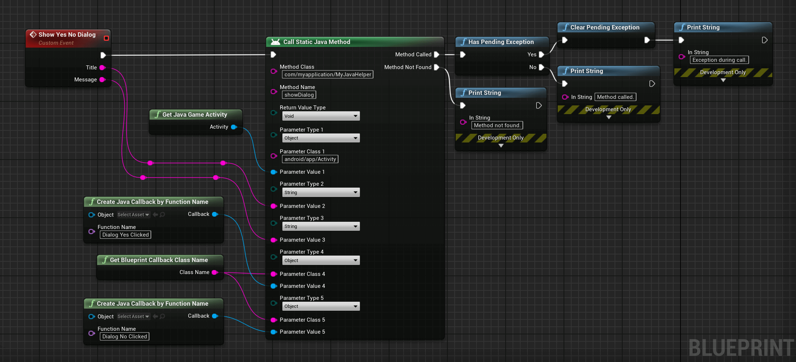
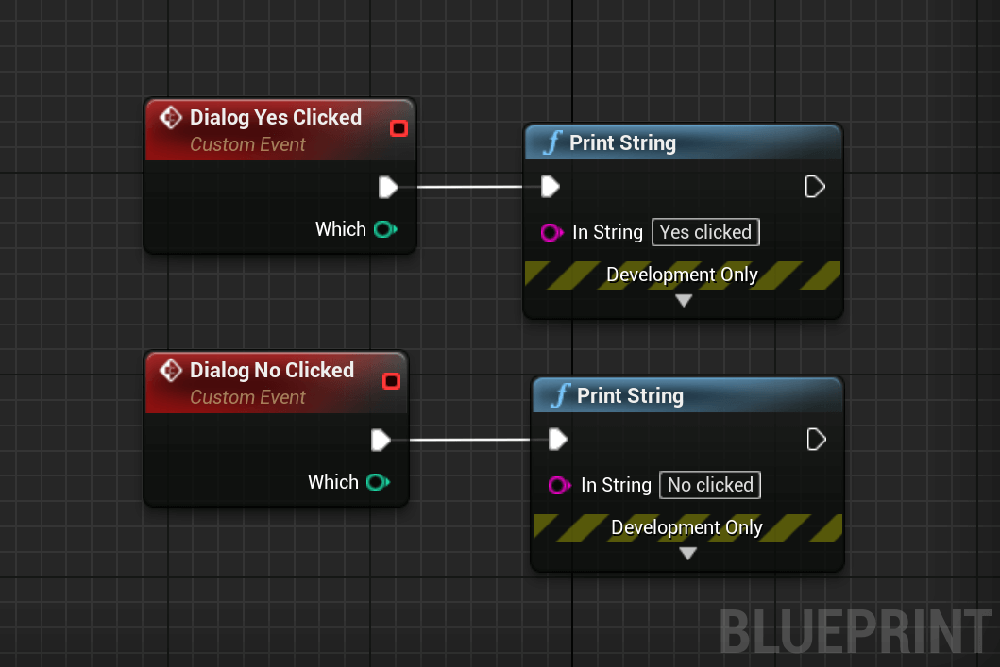

# Show a Dialog - Blueprint Examples
This section contains an example showing how to show a native Android Yes/No dialog using the plugin.

## Before Starting
Before diving directly into the Blueprint code, let's see what Java code we want to call.  
The following Java code will show a Yes/No dialog:
```java
new AlertDialog.Builder(activity)
	.setTitle(title)
	.setMessage(message)
	.setPositiveButton(android.R.string.yes, new DialogInterface.OnClickListener() 
	{
		@Override
		public void onClick(DialogInterface dialog, int which) 
		{					
			// Yes has been clicked.
		}
	})
	
	.setNegativeButton(android.R.string.no, new DialogInterface.OnClickListener() 
	{
		@Override
		public void onClick(DialogInterface dialog, int which) 
		{
			// No has been clicked.
		}
	})
	.setIcon(android.R.drawable.ic_dialog_alert)
	.show();
```

We could call the constructor as well as the chained methods directly from Blueprints with the plugin, but beside being laborious, `AlertDialog` is an UI element and any 
call to it must be done from the UI thread.
As Blueprints are run on the Game thread and aren't thread-safe, we have to write some Java code that will switch to the UI thread and show the Dialog for us.   

Create the file `MyJavaHelper.java` located in `<Project>/JBI/Java/com/myapplication/` and add the following Java code into it:

```java
// Your copyright notice.

package com.myapplication;

import android.app.Activity;
import android.app.AlertDialog;
import android.content.DialogInterface;

// Imports the BlueprintCallback class included with the plugin.
import com.pandora.jbi.BlueprintCallback;

// Our Java Helper.
public class MyJavaHelper
{
	/**
	 * Shows a dialog taking care of switching on the UI thread and executes the Blueprint callbacks.
	*/
	public static void showDialog(final Activity activity, final String title, final String message, 
		final BlueprintCallback positiveClicked, final BlueprintCallback negativeClicked)
	{
		// We switch to the UI thread.
		activity.runOnUiThread(new Runnable() 
		{
			@Override
			public void run()
			{
				// Constructs the AlertDialog.
				new AlertDialog.Builder(activity)
				
					// We set its title.
					.setTitle(title)
					
					// And its message.
					.setMessage(message)
					
					// We add an action when Yes is clicked.
					.setPositiveButton(android.R.string.yes, new DialogInterface.OnClickListener() 
					{
						@Override
						public void onClick(DialogInterface dialog, int which) 
						{
							// We call the Yes Blueprint callback.
							// The callback takes care to switch to Game thread if needed.
							positiveClicked.execute(which);
						}
					})
				
					// We add an action when No is clicked.
					.setNegativeButton(android.R.string.no, new DialogInterface.OnClickListener() 
					{
						@Override
						public void onClick(DialogInterface dialog, int which) 
						{
							// We call the No Blueprint callback.
							// The callback takes care to switch to Game thread if needed.
							negativeClicked.execute(which);
						}
					})
					
					// Sets the dialog's icon.
					.setIcon(android.R.drawable.ic_dialog_alert)
					
					// And finally shows the dialog.
					.show();
			}
		});
	}
}
```
> The plugin will take care to include the file in the build automatically.

We now just have to call this method from Blueprints to show a Yes/No dialog.

## Calling the Helper Function

We now can call this method from Blueprints. The main difference with the `Toast` example is the use of Java Callbacks. We use the `Create Java Callback by Function Name`
node to reference a Blueprint method or event to call.  
Optional error handling is also implemented.

<div class="bpcode">
<textarea readonly>
Begin Object Class=/Script/BlueprintGraph.K2Node_CustomEvent Name="K2Node_CustomEvent_1"
   CustomFunctionName="Show Yes No Dialog"
   NodePosX=-1440
   NodePosY=-2592
   NodeGuid=E0E716B944016DD023E61F9142ABA0F7
   CustomProperties Pin (PinId=5D43C7894691BD3B846404A36060BA12,PinName="OutputDelegate",Direction="EGPD_Output",PinType.PinCategory="delegate",PinType.PinSubCategory="",PinType.PinSubCategoryObject=None,PinType.PinSubCategoryMemberReference=(MemberParent=BlueprintGeneratedClass'"/Game/Demo.Demo_C"',MemberName="Show Yes No Dialog",MemberGuid=E0E716B944016DD023E61F9142ABA0F7),PinType.PinValueType=(),PinType.ContainerType=None,PinType.bIsReference=False,PinType.bIsConst=False,PinType.bIsWeakPointer=False,PinType.bIsUObjectWrapper=False,PersistentGuid=00000000000000000000000000000000,bHidden=False,bNotConnectable=False,bDefaultValueIsReadOnly=False,bDefaultValueIsIgnored=False,bAdvancedView=False,bOrphanedPin=False,)
   CustomProperties Pin (PinId=53EF305943401D3610F932B4887F48CD,PinName="then",Direction="EGPD_Output",PinType.PinCategory="exec",PinType.PinSubCategory="",PinType.PinSubCategoryObject=None,PinType.PinSubCategoryMemberReference=(),PinType.PinValueType=(),PinType.ContainerType=None,PinType.bIsReference=False,PinType.bIsConst=False,PinType.bIsWeakPointer=False,PinType.bIsUObjectWrapper=False,LinkedTo=(K2_CallStaticJavaFunction_1 F95A02D447F4FA7662F1898712BA73D9,),PersistentGuid=00000000000000000000000000000000,bHidden=False,bNotConnectable=False,bDefaultValueIsReadOnly=False,bDefaultValueIsIgnored=False,bAdvancedView=False,bOrphanedPin=False,)
   CustomProperties Pin (PinId=224EF03442006E2E857D34B1BBCA13F1,PinName="Title",Direction="EGPD_Output",PinType.PinCategory="string",PinType.PinSubCategory="",PinType.PinSubCategoryObject=None,PinType.PinSubCategoryMemberReference=(),PinType.PinValueType=(),PinType.ContainerType=None,PinType.bIsReference=False,PinType.bIsConst=False,PinType.bIsWeakPointer=False,PinType.bIsUObjectWrapper=False,LinkedTo=(K2Node_Knot_1 71C90A654016193AA2019F9858EACBBE,),PersistentGuid=00000000000000000000000000000000,bHidden=False,bNotConnectable=False,bDefaultValueIsReadOnly=False,bDefaultValueIsIgnored=False,bAdvancedView=False,bOrphanedPin=False,)
   CustomProperties Pin (PinId=932790A54D0668513352FF81CD5C82D7,PinName="Message",Direction="EGPD_Output",PinType.PinCategory="string",PinType.PinSubCategory="",PinType.PinSubCategoryObject=None,PinType.PinSubCategoryMemberReference=(),PinType.PinValueType=(),PinType.ContainerType=None,PinType.bIsReference=False,PinType.bIsConst=False,PinType.bIsWeakPointer=False,PinType.bIsUObjectWrapper=False,LinkedTo=(K2Node_Knot_3 33503A3F405A5A2CFE959F9386763BA5,),PersistentGuid=00000000000000000000000000000000,bHidden=False,bNotConnectable=False,bDefaultValueIsReadOnly=False,bDefaultValueIsIgnored=False,bAdvancedView=False,bOrphanedPin=False,)
   CustomProperties UserDefinedPin (PinName="Title",PinType=(PinCategory="string"),DesiredPinDirection=EGPD_Output)
   CustomProperties UserDefinedPin (PinName="Message",PinType=(PinCategory="string"),DesiredPinDirection=EGPD_Output)
End Object
Begin Object Class=/Script/BlueprintJNIEditor.K2_CallStaticJavaFunction Name="K2_CallStaticJavaFunction_1"
   NumParams=5
   NodePosX=-912
   NodePosY=-2576
   NodeGuid=7DD1F86B4FE9A1D9AFD1FD872F6BCF63
   CustomProperties Pin (PinId=F95A02D447F4FA7662F1898712BA73D9,PinName="execute",PinType.PinCategory="exec",PinType.PinSubCategory="",PinType.PinSubCategoryObject=None,PinType.PinSubCategoryMemberReference=(),PinType.PinValueType=(),PinType.ContainerType=None,PinType.bIsReference=False,PinType.bIsConst=False,PinType.bIsWeakPointer=False,PinType.bIsUObjectWrapper=True,LinkedTo=(K2Node_CustomEvent_1 53EF305943401D3610F932B4887F48CD,),PersistentGuid=00000000000000000000000000000000,bHidden=False,bNotConnectable=False,bDefaultValueIsReadOnly=False,bDefaultValueIsIgnored=False,bAdvancedView=False,bOrphanedPin=False,)
   CustomProperties Pin (PinId=71E3D0AA48AFF2AE6354DC98939144FD,PinName="Method Called",Direction="EGPD_Output",PinType.PinCategory="exec",PinType.PinSubCategory="",PinType.PinSubCategoryObject=None,PinType.PinSubCategoryMemberReference=(),PinType.PinValueType=(),PinType.ContainerType=None,PinType.bIsReference=False,PinType.bIsConst=False,PinType.bIsWeakPointer=False,PinType.bIsUObjectWrapper=True,LinkedTo=(K2Node_CallFunction_10 7034E9DC4629FEDB8AF33C88491F0F2E,),PersistentGuid=00000000000000000000000000000000,bHidden=False,bNotConnectable=False,bDefaultValueIsReadOnly=False,bDefaultValueIsIgnored=False,bAdvancedView=False,bOrphanedPin=False,)
   CustomProperties Pin (PinId=034D25F7413FB8F70FCDD78A8574B49A,PinName="Return Value",Direction="EGPD_Output",PinType.PinCategory="object",PinType.PinSubCategory="",PinType.PinSubCategoryObject=Class'"/Script/BlueprintJNI.JavaObject"',PinType.PinSubCategoryMemberReference=(),PinType.PinValueType=(),PinType.ContainerType=None,PinType.bIsReference=False,PinType.bIsConst=False,PinType.bIsWeakPointer=False,PinType.bIsUObjectWrapper=False,PersistentGuid=00000000000000000000000000000000,bHidden=True,bNotConnectable=False,bDefaultValueIsReadOnly=False,bDefaultValueIsIgnored=False,bAdvancedView=False,bOrphanedPin=False,)
   CustomProperties Pin (PinId=68DF532C4C9CFF1AB68A5580CA3F349D,PinName="Method not Found",Direction="EGPD_Output",PinType.PinCategory="exec",PinType.PinSubCategory="",PinType.PinSubCategoryObject=None,PinType.PinSubCategoryMemberReference=(),PinType.PinValueType=(),PinType.ContainerType=None,PinType.bIsReference=False,PinType.bIsConst=False,PinType.bIsWeakPointer=False,PinType.bIsUObjectWrapper=True,LinkedTo=(K2Node_CallFunction_19 70AC87B34E422713294B51AF5362C468,),PersistentGuid=00000000000000000000000000000000,bHidden=False,bNotConnectable=False,bDefaultValueIsReadOnly=False,bDefaultValueIsIgnored=False,bAdvancedView=False,bOrphanedPin=False,)
   CustomProperties Pin (PinId=1A3144FB4D5CE21F6EDC6B85452AA511,PinName="Method Class",PinType.PinCategory="string",PinType.PinSubCategory="",PinType.PinSubCategoryObject=None,PinType.PinSubCategoryMemberReference=(),PinType.PinValueType=(),PinType.ContainerType=None,PinType.bIsReference=False,PinType.bIsConst=False,PinType.bIsWeakPointer=False,PinType.bIsUObjectWrapper=True,DefaultValue="com/myapplication/MyJavaHelper",PersistentGuid=00000000000000000000000000000000,bHidden=False,bNotConnectable=False,bDefaultValueIsReadOnly=False,bDefaultValueIsIgnored=False,bAdvancedView=False,bOrphanedPin=False,)
   CustomProperties Pin (PinId=DD18E94543CF375A6C49638A1149DA3D,PinName="Method Name",PinType.PinCategory="string",PinType.PinSubCategory="",PinType.PinSubCategoryObject=None,PinType.PinSubCategoryMemberReference=(),PinType.PinValueType=(),PinType.ContainerType=None,PinType.bIsReference=False,PinType.bIsConst=False,PinType.bIsWeakPointer=False,PinType.bIsUObjectWrapper=True,DefaultValue="showDialog",PersistentGuid=00000000000000000000000000000000,bHidden=False,bNotConnectable=False,bDefaultValueIsReadOnly=False,bDefaultValueIsIgnored=False,bAdvancedView=False,bOrphanedPin=False,)
   CustomProperties Pin (PinId=F8C09D8C49106E090F34F4BBC6EE063A,PinName="Return Value Type",PinType.PinCategory="byte",PinType.PinSubCategory="EJavaType",PinType.PinSubCategoryObject=Enum'"/Script/BlueprintJNI.EJavaType"',PinType.PinSubCategoryMemberReference=(),PinType.PinValueType=(),PinType.ContainerType=None,PinType.bIsReference=False,PinType.bIsConst=False,PinType.bIsWeakPointer=False,PinType.bIsUObjectWrapper=False,DefaultValue="Void",PersistentGuid=00000000000000000000000000000000,bHidden=False,bNotConnectable=False,bDefaultValueIsReadOnly=False,bDefaultValueIsIgnored=False,bAdvancedView=False,bOrphanedPin=False,)
   CustomProperties Pin (PinId=53D047E543B4A7B33645BAAA3E320769,PinName="Return Value Class",PinType.PinCategory="string",PinType.PinSubCategory="",PinType.PinSubCategoryObject=None,PinType.PinSubCategoryMemberReference=(),PinType.PinValueType=(),PinType.ContainerType=None,PinType.bIsReference=False,PinType.bIsConst=False,PinType.bIsWeakPointer=False,PinType.bIsUObjectWrapper=True,PersistentGuid=00000000000000000000000000000000,bHidden=True,bNotConnectable=False,bDefaultValueIsReadOnly=False,bDefaultValueIsIgnored=False,bAdvancedView=False,bOrphanedPin=False,)
   CustomProperties Pin (PinId=01D6152C409709A064CD02AB4FDB1F7D,PinName="ParamType_1",PinFriendlyName=LOCGEN_FORMAT_ORDERED(NSLOCTEXT("UK2_JavaParametersNode", "ParameterTypePinName", "Parameter Type {0}"), 1),PinType.PinCategory="byte",PinType.PinSubCategory="EJavaType",PinType.PinSubCategoryObject=Enum'"/Script/BlueprintJNI.EJavaType"',PinType.PinSubCategoryMemberReference=(),PinType.PinValueType=(),PinType.ContainerType=None,PinType.bIsReference=False,PinType.bIsConst=False,PinType.bIsWeakPointer=False,PinType.bIsUObjectWrapper=False,DefaultValue="Object",PersistentGuid=00000000000000000000000000000000,bHidden=False,bNotConnectable=False,bDefaultValueIsReadOnly=False,bDefaultValueIsIgnored=False,bAdvancedView=False,bOrphanedPin=False,)
   CustomProperties Pin (PinId=3DC2D42D44CB09DC0E0463B2F10B96A9,PinName="ParamClass_1",PinFriendlyName=LOCGEN_FORMAT_ORDERED(NSLOCTEXT("UK2_JavaParametersNode", "ParameterClassPinName", "Parameter Class {0}"), 1),PinType.PinCategory="string",PinType.PinSubCategory="",PinType.PinSubCategoryObject=None,PinType.PinSubCategoryMemberReference=(),PinType.PinValueType=(),PinType.ContainerType=None,PinType.bIsReference=False,PinType.bIsConst=False,PinType.bIsWeakPointer=False,PinType.bIsUObjectWrapper=False,DefaultValue="android/app/Activity",PersistentGuid=00000000000000000000000000000000,bHidden=False,bNotConnectable=False,bDefaultValueIsReadOnly=False,bDefaultValueIsIgnored=False,bAdvancedView=False,bOrphanedPin=False,)
   CustomProperties Pin (PinId=AF45D44241658DBD4457D7B19703B747,PinName="ParamVal_1",PinFriendlyName=LOCGEN_FORMAT_ORDERED(NSLOCTEXT("UK2_JavaParametersNode", "ParameterValuePinName", "Parameter Value {0}"), 1),PinType.PinCategory="object",PinType.PinSubCategory="",PinType.PinSubCategoryObject=Class'"/Script/BlueprintJNI.JavaObject"',PinType.PinSubCategoryMemberReference=(),PinType.PinValueType=(),PinType.ContainerType=None,PinType.bIsReference=False,PinType.bIsConst=False,PinType.bIsWeakPointer=False,PinType.bIsUObjectWrapper=False,LinkedTo=(K2Node_CallFunction_4 762EF17B453DE09E1C339580D0F56856,),PersistentGuid=00000000000000000000000000000000,bHidden=False,bNotConnectable=False,bDefaultValueIsReadOnly=False,bDefaultValueIsIgnored=False,bAdvancedView=False,bOrphanedPin=False,)
   CustomProperties Pin (PinId=E6295CCD4DA12DB270B77B9060ADA8D8,PinName="ParamType_2",PinFriendlyName=LOCGEN_FORMAT_ORDERED(NSLOCTEXT("UK2_JavaParametersNode", "ParameterTypePinName", "Parameter Type {0}"), 2),PinType.PinCategory="byte",PinType.PinSubCategory="EJavaType",PinType.PinSubCategoryObject=Enum'"/Script/BlueprintJNI.EJavaType"',PinType.PinSubCategoryMemberReference=(),PinType.PinValueType=(),PinType.ContainerType=None,PinType.bIsReference=False,PinType.bIsConst=False,PinType.bIsWeakPointer=False,PinType.bIsUObjectWrapper=False,DefaultValue="String",PersistentGuid=00000000000000000000000000000000,bHidden=False,bNotConnectable=False,bDefaultValueIsReadOnly=False,bDefaultValueIsIgnored=False,bAdvancedView=False,bOrphanedPin=False,)
   CustomProperties Pin (PinId=EFE2C7C74B435F7EDF2D5F89B2565B3F,PinName="ParamClass_2",PinFriendlyName=LOCGEN_FORMAT_ORDERED(NSLOCTEXT("UK2_JavaParametersNode", "ParameterClassPinName", "Parameter Class {0}"), 2),PinType.PinCategory="string",PinType.PinSubCategory="",PinType.PinSubCategoryObject=None,PinType.PinSubCategoryMemberReference=(),PinType.PinValueType=(),PinType.ContainerType=None,PinType.bIsReference=False,PinType.bIsConst=False,PinType.bIsWeakPointer=False,PinType.bIsUObjectWrapper=False,DefaultValue="java/lang/Object",PersistentGuid=00000000000000000000000000000000,bHidden=True,bNotConnectable=False,bDefaultValueIsReadOnly=False,bDefaultValueIsIgnored=False,bAdvancedView=False,bOrphanedPin=False,)
   CustomProperties Pin (PinId=3309685442F56E940CF01D83BC33D0C8,PinName="ParamVal_2",PinFriendlyName=LOCGEN_FORMAT_ORDERED(NSLOCTEXT("UK2_JavaParametersNode", "ParameterValuePinName", "Parameter Value {0}"), 2),PinType.PinCategory="string",PinType.PinSubCategory="",PinType.PinSubCategoryObject=None,PinType.PinSubCategoryMemberReference=(),PinType.PinValueType=(),PinType.ContainerType=None,PinType.bIsReference=False,PinType.bIsConst=False,PinType.bIsWeakPointer=False,PinType.bIsUObjectWrapper=False,LinkedTo=(K2Node_Knot_2 34603C6A4FCE46416476228593BBDE8E,),PersistentGuid=00000000000000000000000000000000,bHidden=False,bNotConnectable=False,bDefaultValueIsReadOnly=False,bDefaultValueIsIgnored=False,bAdvancedView=False,bOrphanedPin=False,)
   CustomProperties Pin (PinId=3F8B1D504F110907D73A97BA5D4AAFA7,PinName="ParamType_3",PinFriendlyName=LOCGEN_FORMAT_ORDERED(NSLOCTEXT("UK2_JavaParametersNode", "ParameterTypePinName", "Parameter Type {0}"), 3),PinType.PinCategory="byte",PinType.PinSubCategory="EJavaType",PinType.PinSubCategoryObject=Enum'"/Script/BlueprintJNI.EJavaType"',PinType.PinSubCategoryMemberReference=(),PinType.PinValueType=(),PinType.ContainerType=None,PinType.bIsReference=False,PinType.bIsConst=False,PinType.bIsWeakPointer=False,PinType.bIsUObjectWrapper=False,DefaultValue="String",PersistentGuid=00000000000000000000000000000000,bHidden=False,bNotConnectable=False,bDefaultValueIsReadOnly=False,bDefaultValueIsIgnored=False,bAdvancedView=False,bOrphanedPin=False,)
   CustomProperties Pin (PinId=C09085644923D8A7E05B3D91FBC215C4,PinName="ParamClass_3",PinFriendlyName=LOCGEN_FORMAT_ORDERED(NSLOCTEXT("UK2_JavaParametersNode", "ParameterClassPinName", "Parameter Class {0}"), 3),PinType.PinCategory="string",PinType.PinSubCategory="",PinType.PinSubCategoryObject=None,PinType.PinSubCategoryMemberReference=(),PinType.PinValueType=(),PinType.ContainerType=None,PinType.bIsReference=False,PinType.bIsConst=False,PinType.bIsWeakPointer=False,PinType.bIsUObjectWrapper=False,DefaultValue="java/lang/Object",PersistentGuid=00000000000000000000000000000000,bHidden=True,bNotConnectable=False,bDefaultValueIsReadOnly=False,bDefaultValueIsIgnored=False,bAdvancedView=False,bOrphanedPin=False,)
   CustomProperties Pin (PinId=AFAA882B4B12FA98E49F3E95CB1B7D36,PinName="ParamVal_3",PinFriendlyName=LOCGEN_FORMAT_ORDERED(NSLOCTEXT("UK2_JavaParametersNode", "ParameterValuePinName", "Parameter Value {0}"), 3),PinType.PinCategory="string",PinType.PinSubCategory="",PinType.PinSubCategoryObject=None,PinType.PinSubCategoryMemberReference=(),PinType.PinValueType=(),PinType.ContainerType=None,PinType.bIsReference=False,PinType.bIsConst=False,PinType.bIsWeakPointer=False,PinType.bIsUObjectWrapper=False,LinkedTo=(K2Node_Knot_0 D923698A4696D061C145FF8EC51933B1,),PersistentGuid=00000000000000000000000000000000,bHidden=False,bNotConnectable=False,bDefaultValueIsReadOnly=False,bDefaultValueIsIgnored=False,bAdvancedView=False,bOrphanedPin=False,)
   CustomProperties Pin (PinId=CDE4979E4E86892ED7416F8E347D7E07,PinName="ParamType_4",PinFriendlyName=LOCGEN_FORMAT_ORDERED(NSLOCTEXT("UK2_JavaParametersNode", "ParameterTypePinName", "Parameter Type {0}"), 4),PinType.PinCategory="byte",PinType.PinSubCategory="EJavaType",PinType.PinSubCategoryObject=Enum'"/Script/BlueprintJNI.EJavaType"',PinType.PinSubCategoryMemberReference=(),PinType.PinValueType=(),PinType.ContainerType=None,PinType.bIsReference=False,PinType.bIsConst=False,PinType.bIsWeakPointer=False,PinType.bIsUObjectWrapper=False,DefaultValue="Object",PersistentGuid=00000000000000000000000000000000,bHidden=False,bNotConnectable=False,bDefaultValueIsReadOnly=False,bDefaultValueIsIgnored=False,bAdvancedView=False,bOrphanedPin=False,)
   CustomProperties Pin (PinId=F1D16C1241F7B7205ADC44BF4DFAC127,PinName="ParamClass_4",PinFriendlyName=LOCGEN_FORMAT_ORDERED(NSLOCTEXT("UK2_JavaParametersNode", "ParameterClassPinName", "Parameter Class {0}"), 4),PinType.PinCategory="string",PinType.PinSubCategory="",PinType.PinSubCategoryObject=None,PinType.PinSubCategoryMemberReference=(),PinType.PinValueType=(),PinType.ContainerType=None,PinType.bIsReference=False,PinType.bIsConst=False,PinType.bIsWeakPointer=False,PinType.bIsUObjectWrapper=False,LinkedTo=(K2Node_CallFunction_1 5CF8F0F744612682BCD0308D95748BA5,),PersistentGuid=00000000000000000000000000000000,bHidden=False,bNotConnectable=False,bDefaultValueIsReadOnly=False,bDefaultValueIsIgnored=False,bAdvancedView=False,bOrphanedPin=False,)
   CustomProperties Pin (PinId=C5851A6F4D28571C1187859ABB25DC93,PinName="ParamVal_4",PinFriendlyName=LOCGEN_FORMAT_ORDERED(NSLOCTEXT("UK2_JavaParametersNode", "ParameterValuePinName", "Parameter Value {0}"), 4),PinType.PinCategory="object",PinType.PinSubCategory="",PinType.PinSubCategoryObject=Class'"/Script/BlueprintJNI.JavaObject"',PinType.PinSubCategoryMemberReference=(),PinType.PinValueType=(),PinType.ContainerType=None,PinType.bIsReference=False,PinType.bIsConst=False,PinType.bIsWeakPointer=False,PinType.bIsUObjectWrapper=False,LinkedTo=(K2Node_CallFunction_3 0EB0EEB440AB5512437B33ACF1CAD744,),PersistentGuid=00000000000000000000000000000000,bHidden=False,bNotConnectable=False,bDefaultValueIsReadOnly=False,bDefaultValueIsIgnored=False,bAdvancedView=False,bOrphanedPin=False,)
   CustomProperties Pin (PinId=B549FA644FEDDF4D78ED9D92668A4B8E,PinName="ParamType_5",PinFriendlyName=LOCGEN_FORMAT_ORDERED(NSLOCTEXT("UK2_JavaParametersNode", "ParameterTypePinName", "Parameter Type {0}"), 5),PinType.PinCategory="byte",PinType.PinSubCategory="EJavaType",PinType.PinSubCategoryObject=Enum'"/Script/BlueprintJNI.EJavaType"',PinType.PinSubCategoryMemberReference=(),PinType.PinValueType=(),PinType.ContainerType=None,PinType.bIsReference=False,PinType.bIsConst=False,PinType.bIsWeakPointer=False,PinType.bIsUObjectWrapper=False,DefaultValue="Object",PersistentGuid=00000000000000000000000000000000,bHidden=False,bNotConnectable=False,bDefaultValueIsReadOnly=False,bDefaultValueIsIgnored=False,bAdvancedView=False,bOrphanedPin=False,)
   CustomProperties Pin (PinId=E58E70494CA1D1703C25AA840989807A,PinName="ParamClass_5",PinFriendlyName=LOCGEN_FORMAT_ORDERED(NSLOCTEXT("UK2_JavaParametersNode", "ParameterClassPinName", "Parameter Class {0}"), 5),PinType.PinCategory="string",PinType.PinSubCategory="",PinType.PinSubCategoryObject=None,PinType.PinSubCategoryMemberReference=(),PinType.PinValueType=(),PinType.ContainerType=None,PinType.bIsReference=False,PinType.bIsConst=False,PinType.bIsWeakPointer=False,PinType.bIsUObjectWrapper=False,LinkedTo=(K2Node_CallFunction_1 5CF8F0F744612682BCD0308D95748BA5,),PersistentGuid=00000000000000000000000000000000,bHidden=False,bNotConnectable=False,bDefaultValueIsReadOnly=False,bDefaultValueIsIgnored=False,bAdvancedView=False,bOrphanedPin=False,)
   CustomProperties Pin (PinId=AEE4F18C46F84AA163DB3B979034B5A6,PinName="ParamVal_5",PinFriendlyName=LOCGEN_FORMAT_ORDERED(NSLOCTEXT("UK2_JavaParametersNode", "ParameterValuePinName", "Parameter Value {0}"), 5),PinType.PinCategory="object",PinType.PinSubCategory="",PinType.PinSubCategoryObject=Class'"/Script/BlueprintJNI.JavaObject"',PinType.PinSubCategoryMemberReference=(),PinType.PinValueType=(),PinType.ContainerType=None,PinType.bIsReference=False,PinType.bIsConst=False,PinType.bIsWeakPointer=False,PinType.bIsUObjectWrapper=False,LinkedTo=(K2Node_CallFunction_2 0EB0EEB440AB5512437B33ACF1CAD744,),PersistentGuid=00000000000000000000000000000000,bHidden=False,bNotConnectable=False,bDefaultValueIsReadOnly=False,bDefaultValueIsIgnored=False,bAdvancedView=False,bOrphanedPin=False,)
End Object
Begin Object Class=/Script/BlueprintGraph.K2Node_CallFunction Name="K2Node_CallFunction_1"
   bIsPureFunc=True
   FunctionReference=(MemberParent=Class'"/Script/BlueprintJNI.JavaLibrary"',MemberName="GetBlueprintCallbackClassName")
   NodePosX=-1283
   NodePosY=-2096
   NodeGuid=E45A93AB4B63A0BEA9FEEEBFD3F42D23
   CustomProperties Pin (PinId=2BF9477F423E96D524B0178767321719,PinName="self",PinFriendlyName=NSLOCTEXT("K2Node", "Target", "Target"),PinToolTip="Target\nJava Library Object Reference",PinType.PinCategory="object",PinType.PinSubCategory="",PinType.PinSubCategoryObject=Class'"/Script/BlueprintJNI.JavaLibrary"',PinType.PinSubCategoryMemberReference=(),PinType.PinValueType=(),PinType.ContainerType=None,PinType.bIsReference=False,PinType.bIsConst=False,PinType.bIsWeakPointer=False,PinType.bIsUObjectWrapper=False,DefaultObject="/Script/BlueprintJNI.Default__JavaLibrary",PersistentGuid=00000000000000000000000000000000,bHidden=True,bNotConnectable=False,bDefaultValueIsReadOnly=False,bDefaultValueIsIgnored=False,bAdvancedView=False,bOrphanedPin=False,)
   CustomProperties Pin (PinId=5CF8F0F744612682BCD0308D95748BA5,PinName="ReturnValue",PinFriendlyName=NSLOCTEXT("", "EE532E7B440CD3C3A4B14E8783B4EC40", "Class Name"),PinToolTip="Class Name\nString\n\nThe class name of the BlueprintCallback class.",Direction="EGPD_Output",PinType.PinCategory="string",PinType.PinSubCategory="",PinType.PinSubCategoryObject=None,PinType.PinSubCategoryMemberReference=(),PinType.PinValueType=(),PinType.ContainerType=None,PinType.bIsReference=False,PinType.bIsConst=False,PinType.bIsWeakPointer=False,PinType.bIsUObjectWrapper=False,LinkedTo=(K2_CallStaticJavaFunction_1 F1D16C1241F7B7205ADC44BF4DFAC127,K2_CallStaticJavaFunction_1 E58E70494CA1D1703C25AA840989807A,),PersistentGuid=00000000000000000000000000000000,bHidden=False,bNotConnectable=False,bDefaultValueIsReadOnly=False,bDefaultValueIsIgnored=False,bAdvancedView=False,bOrphanedPin=False,)
End Object
Begin Object Class=/Script/BlueprintGraph.K2Node_CallFunction Name="K2Node_CallFunction_3"
   bIsPureFunc=True
   FunctionReference=(MemberParent=Class'"/Script/BlueprintJNI.JavaLibrary"',MemberName="CreateBlueprintCallback")
   NodePosX=-1312
   NodePosY=-2224
   NodeGuid=36C80E90406FC78AE7FC36A3C57D4F2B
   CustomProperties Pin (PinId=67E98CC14EA3956C8FDE2FB370F7D7EA,PinName="self",PinFriendlyName=NSLOCTEXT("K2Node", "Target", "Target"),PinToolTip="Target\nJava Library Object Reference",PinType.PinCategory="object",PinType.PinSubCategory="",PinType.PinSubCategoryObject=Class'"/Script/BlueprintJNI.JavaLibrary"',PinType.PinSubCategoryMemberReference=(),PinType.PinValueType=(),PinType.ContainerType=None,PinType.bIsReference=False,PinType.bIsConst=False,PinType.bIsWeakPointer=False,PinType.bIsUObjectWrapper=False,DefaultObject="/Script/BlueprintJNI.Default__JavaLibrary",PersistentGuid=00000000000000000000000000000000,bHidden=True,bNotConnectable=False,bDefaultValueIsReadOnly=False,bDefaultValueIsIgnored=False,bAdvancedView=False,bOrphanedPin=False,)
   CustomProperties Pin (PinId=247B7CC74CA747036A0F04B1DF4D54EC,PinName="Object",PinToolTip="Object\nObject Reference\n\nThe object associated with the function.",PinType.PinCategory="object",PinType.PinSubCategory="",PinType.PinSubCategoryObject=Class'"/Script/CoreUObject.Object"',PinType.PinSubCategoryMemberReference=(),PinType.PinValueType=(),PinType.ContainerType=None,PinType.bIsReference=False,PinType.bIsConst=False,PinType.bIsWeakPointer=False,PinType.bIsUObjectWrapper=False,PersistentGuid=00000000000000000000000000000000,bHidden=False,bNotConnectable=False,bDefaultValueIsReadOnly=False,bDefaultValueIsIgnored=False,bAdvancedView=False,bOrphanedPin=False,)
   CustomProperties Pin (PinId=4B7B56F3495446DB3C11038F94CA76F2,PinName="FunctionName",PinToolTip="Function Name\nName\n\nThe name of the function or the event.",PinType.PinCategory="name",PinType.PinSubCategory="",PinType.PinSubCategoryObject=None,PinType.PinSubCategoryMemberReference=(),PinType.PinValueType=(),PinType.ContainerType=None,PinType.bIsReference=False,PinType.bIsConst=False,PinType.bIsWeakPointer=False,PinType.bIsUObjectWrapper=False,DefaultValue="Dialog Yes Clicked",AutogeneratedDefaultValue="None",PersistentGuid=00000000000000000000000000000000,bHidden=False,bNotConnectable=False,bDefaultValueIsReadOnly=False,bDefaultValueIsIgnored=False,bAdvancedView=False,bOrphanedPin=False,)
   CustomProperties Pin (PinId=0EB0EEB440AB5512437B33ACF1CAD744,PinName="ReturnValue",PinFriendlyName=NSLOCTEXT("", "A85A66C84E63001216FABCA4F7CA239F", "Callback"),PinToolTip="Callback\nJava Object Object Reference\n\nA new BlueprintCallback Java object.",Direction="EGPD_Output",PinType.PinCategory="object",PinType.PinSubCategory="",PinType.PinSubCategoryObject=Class'"/Script/BlueprintJNI.JavaObject"',PinType.PinSubCategoryMemberReference=(),PinType.PinValueType=(),PinType.ContainerType=None,PinType.bIsReference=False,PinType.bIsConst=False,PinType.bIsWeakPointer=False,PinType.bIsUObjectWrapper=False,LinkedTo=(K2_CallStaticJavaFunction_1 C5851A6F4D28571C1187859ABB25DC93,),PersistentGuid=00000000000000000000000000000000,bHidden=False,bNotConnectable=False,bDefaultValueIsReadOnly=False,bDefaultValueIsIgnored=False,bAdvancedView=False,bOrphanedPin=False,)
End Object
Begin Object Class=/Script/BlueprintGraph.K2Node_CallFunction Name="K2Node_CallFunction_2"
   bIsPureFunc=True
   FunctionReference=(MemberParent=Class'"/Script/BlueprintJNI.JavaLibrary"',MemberName="CreateBlueprintCallback")
   NodePosX=-1312
   NodePosY=-2000
   NodeGuid=F227495B4A91D930713448BC1FA5FC6D
   CustomProperties Pin (PinId=67E98CC14EA3956C8FDE2FB370F7D7EA,PinName="self",PinFriendlyName=NSLOCTEXT("K2Node", "Target", "Target"),PinToolTip="Target\nJava Library Object Reference",PinType.PinCategory="object",PinType.PinSubCategory="",PinType.PinSubCategoryObject=Class'"/Script/BlueprintJNI.JavaLibrary"',PinType.PinSubCategoryMemberReference=(),PinType.PinValueType=(),PinType.ContainerType=None,PinType.bIsReference=False,PinType.bIsConst=False,PinType.bIsWeakPointer=False,PinType.bIsUObjectWrapper=True,DefaultObject="/Script/BlueprintJNI.Default__JavaLibrary",PersistentGuid=00000000000000000000000000000000,bHidden=True,bNotConnectable=False,bDefaultValueIsReadOnly=False,bDefaultValueIsIgnored=False,bAdvancedView=False,bOrphanedPin=False,)
   CustomProperties Pin (PinId=247B7CC74CA747036A0F04B1DF4D54EC,PinName="Object",PinToolTip="Object\nObject Reference\n\nThe object associated with the function.",PinType.PinCategory="object",PinType.PinSubCategory="",PinType.PinSubCategoryObject=Class'"/Script/CoreUObject.Object"',PinType.PinSubCategoryMemberReference=(),PinType.PinValueType=(),PinType.ContainerType=None,PinType.bIsReference=False,PinType.bIsConst=False,PinType.bIsWeakPointer=False,PinType.bIsUObjectWrapper=False,PersistentGuid=00000000000000000000000000000000,bHidden=False,bNotConnectable=False,bDefaultValueIsReadOnly=False,bDefaultValueIsIgnored=False,bAdvancedView=False,bOrphanedPin=False,)
   CustomProperties Pin (PinId=4B7B56F3495446DB3C11038F94CA76F2,PinName="FunctionName",PinToolTip="Function Name\nName\n\nThe name of the function or the event.",PinType.PinCategory="name",PinType.PinSubCategory="",PinType.PinSubCategoryObject=None,PinType.PinSubCategoryMemberReference=(),PinType.PinValueType=(),PinType.ContainerType=None,PinType.bIsReference=False,PinType.bIsConst=False,PinType.bIsWeakPointer=False,PinType.bIsUObjectWrapper=False,DefaultValue="Dialog No Clicked",AutogeneratedDefaultValue="None",PersistentGuid=00000000000000000000000000000000,bHidden=False,bNotConnectable=False,bDefaultValueIsReadOnly=False,bDefaultValueIsIgnored=False,bAdvancedView=False,bOrphanedPin=False,)
   CustomProperties Pin (PinId=0EB0EEB440AB5512437B33ACF1CAD744,PinName="ReturnValue",PinFriendlyName=NSLOCTEXT("", "AC40B0744CF894174FB09998D3B38986", "Callback"),PinToolTip="Callback\nJava Object Object Reference\n\nA new BlueprintCallback Java object.",Direction="EGPD_Output",PinType.PinCategory="object",PinType.PinSubCategory="",PinType.PinSubCategoryObject=Class'"/Script/BlueprintJNI.JavaObject"',PinType.PinSubCategoryMemberReference=(),PinType.PinValueType=(),PinType.ContainerType=None,PinType.bIsReference=False,PinType.bIsConst=False,PinType.bIsWeakPointer=False,PinType.bIsUObjectWrapper=False,LinkedTo=(K2_CallStaticJavaFunction_1 AEE4F18C46F84AA163DB3B979034B5A6,),PersistentGuid=00000000000000000000000000000000,bHidden=False,bNotConnectable=False,bDefaultValueIsReadOnly=False,bDefaultValueIsIgnored=False,bAdvancedView=False,bOrphanedPin=False,)
End Object
Begin Object Class=/Script/BlueprintGraph.K2Node_CallFunction Name="K2Node_CallFunction_4"
   bIsPureFunc=True
   FunctionReference=(MemberParent=Class'"/Script/BlueprintJNI.JavaLibrary"',MemberName="GetJavaGameActivity")
   NodePosX=-1168
   NodePosY=-2416
   NodeGuid=D09E0DA94A5DBBCC67632599EA1005E4
   CustomProperties Pin (PinId=0AB02E4A4D384173D18D51B8484841D3,PinName="self",PinFriendlyName=NSLOCTEXT("K2Node", "Target", "Target"),PinToolTip="Target\nJava Library Object Reference",PinType.PinCategory="object",PinType.PinSubCategory="",PinType.PinSubCategoryObject=Class'"/Script/BlueprintJNI.JavaLibrary"',PinType.PinSubCategoryMemberReference=(),PinType.PinValueType=(),PinType.ContainerType=None,PinType.bIsReference=False,PinType.bIsConst=False,PinType.bIsWeakPointer=False,PinType.bIsUObjectWrapper=False,DefaultObject="/Script/BlueprintJNI.Default__JavaLibrary",PersistentGuid=00000000000000000000000000000000,bHidden=True,bNotConnectable=False,bDefaultValueIsReadOnly=False,bDefaultValueIsIgnored=False,bAdvancedView=False,bOrphanedPin=False,)
   CustomProperties Pin (PinId=762EF17B453DE09E1C339580D0F56856,PinName="ReturnValue",PinFriendlyName=NSLOCTEXT("", "7864DF9C43CD8746EB0974A98B0F0890", "Activity"),PinToolTip="Activity\nJava Object Object Reference\n\nThe Java Game Activity of the application.",Direction="EGPD_Output",PinType.PinCategory="object",PinType.PinSubCategory="",PinType.PinSubCategoryObject=Class'"/Script/BlueprintJNI.JavaObject"',PinType.PinSubCategoryMemberReference=(),PinType.PinValueType=(),PinType.ContainerType=None,PinType.bIsReference=False,PinType.bIsConst=False,PinType.bIsWeakPointer=False,PinType.bIsUObjectWrapper=False,LinkedTo=(K2_CallStaticJavaFunction_1 AF45D44241658DBD4457D7B19703B747,),PersistentGuid=00000000000000000000000000000000,bHidden=False,bNotConnectable=False,bDefaultValueIsReadOnly=False,bDefaultValueIsIgnored=False,bAdvancedView=False,bOrphanedPin=False,)
End Object
Begin Object Class=/Script/BlueprintGraph.K2Node_Knot Name="K2Node_Knot_0"
   NodePosX=-1040
   NodePosY=-2272
   NodeGuid=19E5BA2743AEF5B611B50A8A308D5DE3
   CustomProperties Pin (PinId=9A1DC2954624358156537DB1232A1770,PinName="InputPin",PinType.PinCategory="string",PinType.PinSubCategory="",PinType.PinSubCategoryObject=None,PinType.PinSubCategoryMemberReference=(),PinType.PinValueType=(),PinType.ContainerType=None,PinType.bIsReference=False,PinType.bIsConst=False,PinType.bIsWeakPointer=False,PinType.bIsUObjectWrapper=False,LinkedTo=(K2Node_Knot_3 181691A54169442D5FF224A865064F3C,),PersistentGuid=00000000000000000000000000000000,bHidden=False,bNotConnectable=False,bDefaultValueIsReadOnly=False,bDefaultValueIsIgnored=True,bAdvancedView=False,bOrphanedPin=False,)
   CustomProperties Pin (PinId=D923698A4696D061C145FF8EC51933B1,PinName="OutputPin",Direction="EGPD_Output",PinType.PinCategory="string",PinType.PinSubCategory="",PinType.PinSubCategoryObject=None,PinType.PinSubCategoryMemberReference=(),PinType.PinValueType=(),PinType.ContainerType=None,PinType.bIsReference=False,PinType.bIsConst=False,PinType.bIsWeakPointer=False,PinType.bIsUObjectWrapper=False,LinkedTo=(K2_CallStaticJavaFunction_1 AFAA882B4B12FA98E49F3E95CB1B7D36,),PersistentGuid=00000000000000000000000000000000,bHidden=False,bNotConnectable=False,bDefaultValueIsReadOnly=False,bDefaultValueIsIgnored=False,bAdvancedView=False,bOrphanedPin=False,)
End Object
Begin Object Class=/Script/BlueprintGraph.K2Node_Knot Name="K2Node_Knot_1"
   NodePosX=-1184
   NodePosY=-2304
   NodeGuid=D2F2BD1B464160B3D29CB0910CB2EF71
   CustomProperties Pin (PinId=71C90A654016193AA2019F9858EACBBE,PinName="InputPin",PinType.PinCategory="string",PinType.PinSubCategory="",PinType.PinSubCategoryObject=None,PinType.PinSubCategoryMemberReference=(),PinType.PinValueType=(),PinType.ContainerType=None,PinType.bIsReference=False,PinType.bIsConst=False,PinType.bIsWeakPointer=False,PinType.bIsUObjectWrapper=False,LinkedTo=(K2Node_CustomEvent_1 224EF03442006E2E857D34B1BBCA13F1,),PersistentGuid=00000000000000000000000000000000,bHidden=False,bNotConnectable=False,bDefaultValueIsReadOnly=False,bDefaultValueIsIgnored=True,bAdvancedView=False,bOrphanedPin=False,)
   CustomProperties Pin (PinId=04806C0B4038E8002E0593A05804745A,PinName="OutputPin",Direction="EGPD_Output",PinType.PinCategory="string",PinType.PinSubCategory="",PinType.PinSubCategoryObject=None,PinType.PinSubCategoryMemberReference=(),PinType.PinValueType=(),PinType.ContainerType=None,PinType.bIsReference=False,PinType.bIsConst=False,PinType.bIsWeakPointer=False,PinType.bIsUObjectWrapper=False,LinkedTo=(K2Node_Knot_2 F06BD28B4C25E197A6151C827ED7C9B2,),PersistentGuid=00000000000000000000000000000000,bHidden=False,bNotConnectable=False,bDefaultValueIsReadOnly=False,bDefaultValueIsIgnored=False,bAdvancedView=False,bOrphanedPin=False,)
End Object
Begin Object Class=/Script/BlueprintGraph.K2Node_Knot Name="K2Node_Knot_2"
   NodePosX=-1024
   NodePosY=-2304
   NodeGuid=51A49DDC4E746683435DD984A9AAE650
   CustomProperties Pin (PinId=F06BD28B4C25E197A6151C827ED7C9B2,PinName="InputPin",PinType.PinCategory="string",PinType.PinSubCategory="",PinType.PinSubCategoryObject=None,PinType.PinSubCategoryMemberReference=(),PinType.PinValueType=(),PinType.ContainerType=None,PinType.bIsReference=False,PinType.bIsConst=False,PinType.bIsWeakPointer=False,PinType.bIsUObjectWrapper=False,LinkedTo=(K2Node_Knot_1 04806C0B4038E8002E0593A05804745A,),PersistentGuid=00000000000000000000000000000000,bHidden=False,bNotConnectable=False,bDefaultValueIsReadOnly=False,bDefaultValueIsIgnored=True,bAdvancedView=False,bOrphanedPin=False,)
   CustomProperties Pin (PinId=34603C6A4FCE46416476228593BBDE8E,PinName="OutputPin",Direction="EGPD_Output",PinType.PinCategory="string",PinType.PinSubCategory="",PinType.PinSubCategoryObject=None,PinType.PinSubCategoryMemberReference=(),PinType.PinValueType=(),PinType.ContainerType=None,PinType.bIsReference=False,PinType.bIsConst=False,PinType.bIsWeakPointer=False,PinType.bIsUObjectWrapper=False,LinkedTo=(K2_CallStaticJavaFunction_1 3309685442F56E940CF01D83BC33D0C8,),PersistentGuid=00000000000000000000000000000000,bHidden=False,bNotConnectable=False,bDefaultValueIsReadOnly=False,bDefaultValueIsIgnored=False,bAdvancedView=False,bOrphanedPin=False,)
End Object
Begin Object Class=/Script/BlueprintGraph.K2Node_Knot Name="K2Node_Knot_3"
   NodePosX=-1200
   NodePosY=-2272
   NodeGuid=E6A173F74F59DE63788203917286F1BB
   CustomProperties Pin (PinId=33503A3F405A5A2CFE959F9386763BA5,PinName="InputPin",PinType.PinCategory="string",PinType.PinSubCategory="",PinType.PinSubCategoryObject=None,PinType.PinSubCategoryMemberReference=(),PinType.PinValueType=(),PinType.ContainerType=None,PinType.bIsReference=False,PinType.bIsConst=False,PinType.bIsWeakPointer=False,PinType.bIsUObjectWrapper=False,LinkedTo=(K2Node_CustomEvent_1 932790A54D0668513352FF81CD5C82D7,),PersistentGuid=00000000000000000000000000000000,bHidden=False,bNotConnectable=False,bDefaultValueIsReadOnly=False,bDefaultValueIsIgnored=True,bAdvancedView=False,bOrphanedPin=False,)
   CustomProperties Pin (PinId=181691A54169442D5FF224A865064F3C,PinName="OutputPin",Direction="EGPD_Output",PinType.PinCategory="string",PinType.PinSubCategory="",PinType.PinSubCategoryObject=None,PinType.PinSubCategoryMemberReference=(),PinType.PinValueType=(),PinType.ContainerType=None,PinType.bIsReference=False,PinType.bIsConst=False,PinType.bIsWeakPointer=False,PinType.bIsUObjectWrapper=False,LinkedTo=(K2Node_Knot_0 9A1DC2954624358156537DB1232A1770,),PersistentGuid=00000000000000000000000000000000,bHidden=False,bNotConnectable=False,bDefaultValueIsReadOnly=False,bDefaultValueIsIgnored=False,bAdvancedView=False,bOrphanedPin=False,)
End Object
Begin Object Class=/Script/BlueprintGraph.K2Node_CallFunction Name="K2Node_CallFunction_10"
   bWantsEnumToExecExpansion=True
   FunctionReference=(MemberParent=Class'"/Script/BlueprintJNI.JavaLibrary"',MemberName="HasPendingException")
   NodePosX=-496
   NodePosY=-2576
   NodeGuid=BF287D4B439019A5CDA7AAB84493101B
   CustomProperties Pin (PinId=20BA37314B0882E79A207181CE559E13,PinName="Yes",PinToolTip="Yes\nExec",Direction="EGPD_Output",PinType.PinCategory="exec",PinType.PinSubCategory="",PinType.PinSubCategoryObject=None,PinType.PinSubCategoryMemberReference=(),PinType.PinValueType=(),PinType.ContainerType=None,PinType.bIsReference=False,PinType.bIsConst=False,PinType.bIsWeakPointer=False,PinType.bIsUObjectWrapper=True,LinkedTo=(K2Node_CallFunction_17 9E40A15840065C933EB7A780D0038AF0,),PersistentGuid=00000000000000000000000000000000,bHidden=False,bNotConnectable=False,bDefaultValueIsReadOnly=False,bDefaultValueIsIgnored=False,bAdvancedView=False,bOrphanedPin=False,)
   CustomProperties Pin (PinId=CE5F4A3047A44CF1623967A69ECD51B7,PinName="No",PinToolTip="No\nExec",Direction="EGPD_Output",PinType.PinCategory="exec",PinType.PinSubCategory="",PinType.PinSubCategoryObject=None,PinType.PinSubCategoryMemberReference=(),PinType.PinValueType=(),PinType.ContainerType=None,PinType.bIsReference=False,PinType.bIsConst=False,PinType.bIsWeakPointer=False,PinType.bIsUObjectWrapper=True,LinkedTo=(K2Node_CallFunction_27 70AC87B34E422713294B51AF5362C468,),PersistentGuid=00000000000000000000000000000000,bHidden=False,bNotConnectable=False,bDefaultValueIsReadOnly=False,bDefaultValueIsIgnored=False,bAdvancedView=False,bOrphanedPin=False,)
   CustomProperties Pin (PinId=7034E9DC4629FEDB8AF33C88491F0F2E,PinName="execute",PinToolTip="\nExec",PinType.PinCategory="exec",PinType.PinSubCategory="",PinType.PinSubCategoryObject=None,PinType.PinSubCategoryMemberReference=(),PinType.PinValueType=(),PinType.ContainerType=None,PinType.bIsReference=False,PinType.bIsConst=False,PinType.bIsWeakPointer=False,PinType.bIsUObjectWrapper=False,LinkedTo=(K2_CallStaticJavaFunction_1 71E3D0AA48AFF2AE6354DC98939144FD,),PersistentGuid=00000000000000000000000000000000,bHidden=False,bNotConnectable=False,bDefaultValueIsReadOnly=False,bDefaultValueIsIgnored=False,bAdvancedView=False,bOrphanedPin=False,)
   CustomProperties Pin (PinId=4F7BCD414137C719C32AEA8D1BE7441E,PinName="self",PinFriendlyName=NSLOCTEXT("K2Node", "Target", "Target"),PinToolTip="Target\nJava Library Object Reference",PinType.PinCategory="object",PinType.PinSubCategory="",PinType.PinSubCategoryObject=Class'"/Script/BlueprintJNI.JavaLibrary"',PinType.PinSubCategoryMemberReference=(),PinType.PinValueType=(),PinType.ContainerType=None,PinType.bIsReference=False,PinType.bIsConst=False,PinType.bIsWeakPointer=False,PinType.bIsUObjectWrapper=False,DefaultObject="/Script/BlueprintJNI.Default__JavaLibrary",PersistentGuid=00000000000000000000000000000000,bHidden=True,bNotConnectable=False,bDefaultValueIsReadOnly=False,bDefaultValueIsIgnored=False,bAdvancedView=False,bOrphanedPin=False,)
   CustomProperties Pin (PinId=7D9109FF473B5E41904D7CB020AA5E4A,PinName="Branches",PinToolTip="Branches\nEJavaExceptionBranching Enum",Direction="EGPD_Output",PinType.PinCategory="byte",PinType.PinSubCategory="",PinType.PinSubCategoryObject=Enum'"/Script/BlueprintJNI.EJavaExceptionBranching"',PinType.PinSubCategoryMemberReference=(),PinType.PinValueType=(),PinType.ContainerType=None,PinType.bIsReference=False,PinType.bIsConst=False,PinType.bIsWeakPointer=False,PinType.bIsUObjectWrapper=False,DefaultValue="Yes",PersistentGuid=00000000000000000000000000000000,bHidden=True,bNotConnectable=False,bDefaultValueIsReadOnly=False,bDefaultValueIsIgnored=False,bAdvancedView=False,bOrphanedPin=False,)
End Object
Begin Object Class=/Script/BlueprintGraph.K2Node_CallFunction Name="K2Node_CallFunction_17"
   FunctionReference=(MemberParent=Class'"/Script/BlueprintJNI.JavaLibrary"',MemberName="ClearPendingException")
   NodePosX=-272
   NodePosY=-2608
   NodeGuid=4BBDC96444EC9AAF96C65B9C93B6168F
   CustomProperties Pin (PinId=9E40A15840065C933EB7A780D0038AF0,PinName="execute",PinToolTip="\nExec",PinType.PinCategory="exec",PinType.PinSubCategory="",PinType.PinSubCategoryObject=None,PinType.PinSubCategoryMemberReference=(),PinType.PinValueType=(),PinType.ContainerType=None,PinType.bIsReference=False,PinType.bIsConst=False,PinType.bIsWeakPointer=False,PinType.bIsUObjectWrapper=True,LinkedTo=(K2Node_CallFunction_10 20BA37314B0882E79A207181CE559E13,),PersistentGuid=00000000000000000000000000000000,bHidden=False,bNotConnectable=False,bDefaultValueIsReadOnly=False,bDefaultValueIsIgnored=False,bAdvancedView=False,bOrphanedPin=False,)
   CustomProperties Pin (PinId=E94D9DDE444A3BC473F2D1BC013D0480,PinName="then",PinToolTip="\nExec",Direction="EGPD_Output",PinType.PinCategory="exec",PinType.PinSubCategory="",PinType.PinSubCategoryObject=None,PinType.PinSubCategoryMemberReference=(),PinType.PinValueType=(),PinType.ContainerType=None,PinType.bIsReference=False,PinType.bIsConst=False,PinType.bIsWeakPointer=False,PinType.bIsUObjectWrapper=True,LinkedTo=(K2Node_CallFunction_18 70AC87B34E422713294B51AF5362C468,),PersistentGuid=00000000000000000000000000000000,bHidden=False,bNotConnectable=False,bDefaultValueIsReadOnly=False,bDefaultValueIsIgnored=False,bAdvancedView=False,bOrphanedPin=False,)
   CustomProperties Pin (PinId=998154FF4E5BA0DD7198D6B5498546CF,PinName="self",PinFriendlyName=NSLOCTEXT("K2Node", "Target", "Target"),PinToolTip="Target\nJava Library Object Reference",PinType.PinCategory="object",PinType.PinSubCategory="",PinType.PinSubCategoryObject=Class'"/Script/BlueprintJNI.JavaLibrary"',PinType.PinSubCategoryMemberReference=(),PinType.PinValueType=(),PinType.ContainerType=None,PinType.bIsReference=False,PinType.bIsConst=False,PinType.bIsWeakPointer=False,PinType.bIsUObjectWrapper=False,DefaultObject="/Script/BlueprintJNI.Default__JavaLibrary",PersistentGuid=00000000000000000000000000000000,bHidden=True,bNotConnectable=False,bDefaultValueIsReadOnly=False,bDefaultValueIsIgnored=False,bAdvancedView=False,bOrphanedPin=False,)
End Object
Begin Object Class=/Script/BlueprintGraph.K2Node_CallFunction Name="K2Node_CallFunction_19"
   FunctionReference=(MemberParent=Class'"/Script/Engine.KismetSystemLibrary"',MemberName="PrintString")
   NodePosX=-496
   NodePosY=-2464
   AdvancedPinDisplay=Hidden
   EnabledState=DevelopmentOnly
   NodeGuid=44B55BB84EBDCD6718B80897296BA3B3
   CustomProperties Pin (PinId=70AC87B34E422713294B51AF5362C468,PinName="execute",PinToolTip="\nExec",PinType.PinCategory="exec",PinType.PinSubCategory="",PinType.PinSubCategoryObject=None,PinType.PinSubCategoryMemberReference=(),PinType.PinValueType=(),PinType.ContainerType=None,PinType.bIsReference=False,PinType.bIsConst=False,PinType.bIsWeakPointer=False,PinType.bIsUObjectWrapper=True,LinkedTo=(K2_CallStaticJavaFunction_1 68DF532C4C9CFF1AB68A5580CA3F349D,),PersistentGuid=00000000000000000000000000000000,bHidden=False,bNotConnectable=False,bDefaultValueIsReadOnly=False,bDefaultValueIsIgnored=False,bAdvancedView=False,bOrphanedPin=False,)
   CustomProperties Pin (PinId=FA2D90084FF68C748A3918A44F290CA3,PinName="then",PinToolTip="\nExec",Direction="EGPD_Output",PinType.PinCategory="exec",PinType.PinSubCategory="",PinType.PinSubCategoryObject=None,PinType.PinSubCategoryMemberReference=(),PinType.PinValueType=(),PinType.ContainerType=None,PinType.bIsReference=False,PinType.bIsConst=False,PinType.bIsWeakPointer=False,PinType.bIsUObjectWrapper=True,PersistentGuid=00000000000000000000000000000000,bHidden=False,bNotConnectable=False,bDefaultValueIsReadOnly=False,bDefaultValueIsIgnored=False,bAdvancedView=False,bOrphanedPin=False,)
   CustomProperties Pin (PinId=A5CCDF0E4C891B176AAB0A84EF785592,PinName="self",PinFriendlyName=NSLOCTEXT("K2Node", "Target", "Target"),PinToolTip="Target\nKismet System Library Object Reference",PinType.PinCategory="object",PinType.PinSubCategory="",PinType.PinSubCategoryObject=Class'"/Script/Engine.KismetSystemLibrary"',PinType.PinSubCategoryMemberReference=(),PinType.PinValueType=(),PinType.ContainerType=None,PinType.bIsReference=False,PinType.bIsConst=False,PinType.bIsWeakPointer=False,PinType.bIsUObjectWrapper=False,DefaultObject="/Script/Engine.Default__KismetSystemLibrary",PersistentGuid=00000000000000000000000000000000,bHidden=True,bNotConnectable=False,bDefaultValueIsReadOnly=False,bDefaultValueIsIgnored=False,bAdvancedView=False,bOrphanedPin=False,)
   CustomProperties Pin (PinId=30B23FBC4EE6E2FEC4B93183FD6F9255,PinName="WorldContextObject",PinToolTip="World Context Object\nObject Reference",PinType.PinCategory="object",PinType.PinSubCategory="",PinType.PinSubCategoryObject=Class'"/Script/CoreUObject.Object"',PinType.PinSubCategoryMemberReference=(),PinType.PinValueType=(),PinType.ContainerType=None,PinType.bIsReference=False,PinType.bIsConst=True,PinType.bIsWeakPointer=False,PinType.bIsUObjectWrapper=False,PersistentGuid=00000000000000000000000000000000,bHidden=True,bNotConnectable=False,bDefaultValueIsReadOnly=False,bDefaultValueIsIgnored=False,bAdvancedView=False,bOrphanedPin=False,)
   CustomProperties Pin (PinId=C849C6FE44AF85B2FB15F9AD9F031887,PinName="InString",PinToolTip="In String\nString\n\nThe string to log out",PinType.PinCategory="string",PinType.PinSubCategory="",PinType.PinSubCategoryObject=None,PinType.PinSubCategoryMemberReference=(),PinType.PinValueType=(),PinType.ContainerType=None,PinType.bIsReference=False,PinType.bIsConst=False,PinType.bIsWeakPointer=False,PinType.bIsUObjectWrapper=False,DefaultValue="Method not found.",AutogeneratedDefaultValue="Hello",PersistentGuid=00000000000000000000000000000000,bHidden=False,bNotConnectable=False,bDefaultValueIsReadOnly=False,bDefaultValueIsIgnored=False,bAdvancedView=False,bOrphanedPin=False,)
   CustomProperties Pin (PinId=D898B85A45067EE1945767B262322CAB,PinName="bPrintToScreen",PinToolTip="Print to Screen\nBoolean\n\nWhether or not to print the output to the screen",PinType.PinCategory="bool",PinType.PinSubCategory="",PinType.PinSubCategoryObject=None,PinType.PinSubCategoryMemberReference=(),PinType.PinValueType=(),PinType.ContainerType=None,PinType.bIsReference=False,PinType.bIsConst=False,PinType.bIsWeakPointer=False,PinType.bIsUObjectWrapper=False,DefaultValue="true",AutogeneratedDefaultValue="true",PersistentGuid=00000000000000000000000000000000,bHidden=False,bNotConnectable=False,bDefaultValueIsReadOnly=False,bDefaultValueIsIgnored=False,bAdvancedView=True,bOrphanedPin=False,)
   CustomProperties Pin (PinId=AF9A4366487671032493DCB45B9C0D9E,PinName="bPrintToLog",PinToolTip="Print to Log\nBoolean\n\nWhether or not to print the output to the log",PinType.PinCategory="bool",PinType.PinSubCategory="",PinType.PinSubCategoryObject=None,PinType.PinSubCategoryMemberReference=(),PinType.PinValueType=(),PinType.ContainerType=None,PinType.bIsReference=False,PinType.bIsConst=False,PinType.bIsWeakPointer=False,PinType.bIsUObjectWrapper=False,DefaultValue="true",AutogeneratedDefaultValue="true",PersistentGuid=00000000000000000000000000000000,bHidden=False,bNotConnectable=False,bDefaultValueIsReadOnly=False,bDefaultValueIsIgnored=False,bAdvancedView=True,bOrphanedPin=False,)
   CustomProperties Pin (PinId=3F7F796E4671C5E0C3CADFB243B54C63,PinName="TextColor",PinToolTip="Text Color\nLinear Color Structure\n\nWhether or not to print the output to the console",PinType.PinCategory="struct",PinType.PinSubCategory="",PinType.PinSubCategoryObject=ScriptStruct'"/Script/CoreUObject.LinearColor"',PinType.PinSubCategoryMemberReference=(),PinType.PinValueType=(),PinType.ContainerType=None,PinType.bIsReference=False,PinType.bIsConst=False,PinType.bIsWeakPointer=False,PinType.bIsUObjectWrapper=False,DefaultValue="(R=0.000000,G=0.660000,B=1.000000,A=1.000000)",AutogeneratedDefaultValue="(R=0.000000,G=0.660000,B=1.000000,A=1.000000)",PersistentGuid=00000000000000000000000000000000,bHidden=False,bNotConnectable=False,bDefaultValueIsReadOnly=False,bDefaultValueIsIgnored=False,bAdvancedView=True,bOrphanedPin=False,)
   CustomProperties Pin (PinId=EE78B2254B0794DB0B9101B08A9C1E4B,PinName="Duration",PinToolTip="Duration\nFloat\n\nThe display duration (if Print to Screen is True). Using negative number will result in loading the duration time from the config.",PinType.PinCategory="float",PinType.PinSubCategory="",PinType.PinSubCategoryObject=None,PinType.PinSubCategoryMemberReference=(),PinType.PinValueType=(),PinType.ContainerType=None,PinType.bIsReference=False,PinType.bIsConst=False,PinType.bIsWeakPointer=False,PinType.bIsUObjectWrapper=False,DefaultValue="2.000000",AutogeneratedDefaultValue="2.000000",PersistentGuid=00000000000000000000000000000000,bHidden=False,bNotConnectable=False,bDefaultValueIsReadOnly=False,bDefaultValueIsIgnored=False,bAdvancedView=True,bOrphanedPin=False,)
End Object
Begin Object Class=/Script/BlueprintGraph.K2Node_CallFunction Name="K2Node_CallFunction_27"
   FunctionReference=(MemberParent=Class'"/Script/Engine.KismetSystemLibrary"',MemberName="PrintString")
   NodePosX=-272
   NodePosY=-2512
   AdvancedPinDisplay=Hidden
   EnabledState=DevelopmentOnly
   NodeGuid=320A4A834DEE344CC5B8E8A3ADBB4988
   CustomProperties Pin (PinId=70AC87B34E422713294B51AF5362C468,PinName="execute",PinToolTip="\nExec",PinType.PinCategory="exec",PinType.PinSubCategory="",PinType.PinSubCategoryObject=None,PinType.PinSubCategoryMemberReference=(),PinType.PinValueType=(),PinType.ContainerType=None,PinType.bIsReference=False,PinType.bIsConst=False,PinType.bIsWeakPointer=False,PinType.bIsUObjectWrapper=False,LinkedTo=(K2Node_CallFunction_10 CE5F4A3047A44CF1623967A69ECD51B7,),PersistentGuid=00000000000000000000000000000000,bHidden=False,bNotConnectable=False,bDefaultValueIsReadOnly=False,bDefaultValueIsIgnored=False,bAdvancedView=False,bOrphanedPin=False,)
   CustomProperties Pin (PinId=FA2D90084FF68C748A3918A44F290CA3,PinName="then",PinToolTip="\nExec",Direction="EGPD_Output",PinType.PinCategory="exec",PinType.PinSubCategory="",PinType.PinSubCategoryObject=None,PinType.PinSubCategoryMemberReference=(),PinType.PinValueType=(),PinType.ContainerType=None,PinType.bIsReference=False,PinType.bIsConst=False,PinType.bIsWeakPointer=False,PinType.bIsUObjectWrapper=False,PersistentGuid=00000000000000000000000000000000,bHidden=False,bNotConnectable=False,bDefaultValueIsReadOnly=False,bDefaultValueIsIgnored=False,bAdvancedView=False,bOrphanedPin=False,)
   CustomProperties Pin (PinId=A5CCDF0E4C891B176AAB0A84EF785592,PinName="self",PinFriendlyName=NSLOCTEXT("K2Node", "Target", "Target"),PinToolTip="Target\nKismet System Library Object Reference",PinType.PinCategory="object",PinType.PinSubCategory="",PinType.PinSubCategoryObject=Class'"/Script/Engine.KismetSystemLibrary"',PinType.PinSubCategoryMemberReference=(),PinType.PinValueType=(),PinType.ContainerType=None,PinType.bIsReference=False,PinType.bIsConst=False,PinType.bIsWeakPointer=False,PinType.bIsUObjectWrapper=True,DefaultObject="/Script/Engine.Default__KismetSystemLibrary",PersistentGuid=00000000000000000000000000000000,bHidden=True,bNotConnectable=False,bDefaultValueIsReadOnly=False,bDefaultValueIsIgnored=False,bAdvancedView=False,bOrphanedPin=False,)
   CustomProperties Pin (PinId=30B23FBC4EE6E2FEC4B93183FD6F9255,PinName="WorldContextObject",PinToolTip="World Context Object\nObject Reference",PinType.PinCategory="object",PinType.PinSubCategory="",PinType.PinSubCategoryObject=Class'"/Script/CoreUObject.Object"',PinType.PinSubCategoryMemberReference=(),PinType.PinValueType=(),PinType.ContainerType=None,PinType.bIsReference=False,PinType.bIsConst=True,PinType.bIsWeakPointer=False,PinType.bIsUObjectWrapper=False,PersistentGuid=00000000000000000000000000000000,bHidden=True,bNotConnectable=False,bDefaultValueIsReadOnly=False,bDefaultValueIsIgnored=False,bAdvancedView=False,bOrphanedPin=False,)
   CustomProperties Pin (PinId=C849C6FE44AF85B2FB15F9AD9F031887,PinName="InString",PinToolTip="In String\nString\n\nThe string to log out",PinType.PinCategory="string",PinType.PinSubCategory="",PinType.PinSubCategoryObject=None,PinType.PinSubCategoryMemberReference=(),PinType.PinValueType=(),PinType.ContainerType=None,PinType.bIsReference=False,PinType.bIsConst=False,PinType.bIsWeakPointer=False,PinType.bIsUObjectWrapper=False,DefaultValue="Method called.",AutogeneratedDefaultValue="Hello",PersistentGuid=00000000000000000000000000000000,bHidden=False,bNotConnectable=False,bDefaultValueIsReadOnly=False,bDefaultValueIsIgnored=False,bAdvancedView=False,bOrphanedPin=False,)
   CustomProperties Pin (PinId=D898B85A45067EE1945767B262322CAB,PinName="bPrintToScreen",PinToolTip="Print to Screen\nBoolean\n\nWhether or not to print the output to the screen",PinType.PinCategory="bool",PinType.PinSubCategory="",PinType.PinSubCategoryObject=None,PinType.PinSubCategoryMemberReference=(),PinType.PinValueType=(),PinType.ContainerType=None,PinType.bIsReference=False,PinType.bIsConst=False,PinType.bIsWeakPointer=False,PinType.bIsUObjectWrapper=False,DefaultValue="true",AutogeneratedDefaultValue="true",PersistentGuid=00000000000000000000000000000000,bHidden=False,bNotConnectable=False,bDefaultValueIsReadOnly=False,bDefaultValueIsIgnored=False,bAdvancedView=True,bOrphanedPin=False,)
   CustomProperties Pin (PinId=AF9A4366487671032493DCB45B9C0D9E,PinName="bPrintToLog",PinToolTip="Print to Log\nBoolean\n\nWhether or not to print the output to the log",PinType.PinCategory="bool",PinType.PinSubCategory="",PinType.PinSubCategoryObject=None,PinType.PinSubCategoryMemberReference=(),PinType.PinValueType=(),PinType.ContainerType=None,PinType.bIsReference=False,PinType.bIsConst=False,PinType.bIsWeakPointer=False,PinType.bIsUObjectWrapper=False,DefaultValue="true",AutogeneratedDefaultValue="true",PersistentGuid=00000000000000000000000000000000,bHidden=False,bNotConnectable=False,bDefaultValueIsReadOnly=False,bDefaultValueIsIgnored=False,bAdvancedView=True,bOrphanedPin=False,)
   CustomProperties Pin (PinId=3F7F796E4671C5E0C3CADFB243B54C63,PinName="TextColor",PinToolTip="Text Color\nLinear Color Structure\n\nWhether or not to print the output to the console",PinType.PinCategory="struct",PinType.PinSubCategory="",PinType.PinSubCategoryObject=ScriptStruct'"/Script/CoreUObject.LinearColor"',PinType.PinSubCategoryMemberReference=(),PinType.PinValueType=(),PinType.ContainerType=None,PinType.bIsReference=False,PinType.bIsConst=False,PinType.bIsWeakPointer=False,PinType.bIsUObjectWrapper=False,DefaultValue="(R=0.000000,G=0.660000,B=1.000000,A=1.000000)",AutogeneratedDefaultValue="(R=0.000000,G=0.660000,B=1.000000,A=1.000000)",PersistentGuid=00000000000000000000000000000000,bHidden=False,bNotConnectable=False,bDefaultValueIsReadOnly=False,bDefaultValueIsIgnored=False,bAdvancedView=True,bOrphanedPin=False,)
   CustomProperties Pin (PinId=EE78B2254B0794DB0B9101B08A9C1E4B,PinName="Duration",PinToolTip="Duration\nFloat\n\nThe display duration (if Print to Screen is True). Using negative number will result in loading the duration time from the config.",PinType.PinCategory="float",PinType.PinSubCategory="",PinType.PinSubCategoryObject=None,PinType.PinSubCategoryMemberReference=(),PinType.PinValueType=(),PinType.ContainerType=None,PinType.bIsReference=False,PinType.bIsConst=False,PinType.bIsWeakPointer=False,PinType.bIsUObjectWrapper=False,DefaultValue="2.000000",AutogeneratedDefaultValue="2.000000",PersistentGuid=00000000000000000000000000000000,bHidden=False,bNotConnectable=False,bDefaultValueIsReadOnly=False,bDefaultValueIsIgnored=False,bAdvancedView=True,bOrphanedPin=False,)
End Object
Begin Object Class=/Script/BlueprintGraph.K2Node_CallFunction Name="K2Node_CallFunction_18"
   FunctionReference=(MemberParent=Class'"/Script/Engine.KismetSystemLibrary"',MemberName="PrintString")
   NodePosX=-16
   NodePosY=-2608
   AdvancedPinDisplay=Hidden
   EnabledState=DevelopmentOnly
   NodeGuid=4C05BC684B7083DFF6EA3292B8F4FE5E
   CustomProperties Pin (PinId=70AC87B34E422713294B51AF5362C468,PinName="execute",PinToolTip="\nExec",PinType.PinCategory="exec",PinType.PinSubCategory="",PinType.PinSubCategoryObject=None,PinType.PinSubCategoryMemberReference=(),PinType.PinValueType=(),PinType.ContainerType=None,PinType.bIsReference=False,PinType.bIsConst=False,PinType.bIsWeakPointer=False,PinType.bIsUObjectWrapper=False,LinkedTo=(K2Node_CallFunction_17 E94D9DDE444A3BC473F2D1BC013D0480,),PersistentGuid=00000000000000000000000000000000,bHidden=False,bNotConnectable=False,bDefaultValueIsReadOnly=False,bDefaultValueIsIgnored=False,bAdvancedView=False,bOrphanedPin=False,)
   CustomProperties Pin (PinId=FA2D90084FF68C748A3918A44F290CA3,PinName="then",PinToolTip="\nExec",Direction="EGPD_Output",PinType.PinCategory="exec",PinType.PinSubCategory="",PinType.PinSubCategoryObject=None,PinType.PinSubCategoryMemberReference=(),PinType.PinValueType=(),PinType.ContainerType=None,PinType.bIsReference=False,PinType.bIsConst=False,PinType.bIsWeakPointer=False,PinType.bIsUObjectWrapper=False,PersistentGuid=00000000000000000000000000000000,bHidden=False,bNotConnectable=False,bDefaultValueIsReadOnly=False,bDefaultValueIsIgnored=False,bAdvancedView=False,bOrphanedPin=False,)
   CustomProperties Pin (PinId=A5CCDF0E4C891B176AAB0A84EF785592,PinName="self",PinFriendlyName=NSLOCTEXT("K2Node", "Target", "Target"),PinToolTip="Target\nKismet System Library Object Reference",PinType.PinCategory="object",PinType.PinSubCategory="",PinType.PinSubCategoryObject=Class'"/Script/Engine.KismetSystemLibrary"',PinType.PinSubCategoryMemberReference=(),PinType.PinValueType=(),PinType.ContainerType=None,PinType.bIsReference=False,PinType.bIsConst=False,PinType.bIsWeakPointer=False,PinType.bIsUObjectWrapper=True,DefaultObject="/Script/Engine.Default__KismetSystemLibrary",PersistentGuid=00000000000000000000000000000000,bHidden=True,bNotConnectable=False,bDefaultValueIsReadOnly=False,bDefaultValueIsIgnored=False,bAdvancedView=False,bOrphanedPin=False,)
   CustomProperties Pin (PinId=30B23FBC4EE6E2FEC4B93183FD6F9255,PinName="WorldContextObject",PinToolTip="World Context Object\nObject Reference",PinType.PinCategory="object",PinType.PinSubCategory="",PinType.PinSubCategoryObject=Class'"/Script/CoreUObject.Object"',PinType.PinSubCategoryMemberReference=(),PinType.PinValueType=(),PinType.ContainerType=None,PinType.bIsReference=False,PinType.bIsConst=True,PinType.bIsWeakPointer=False,PinType.bIsUObjectWrapper=False,PersistentGuid=00000000000000000000000000000000,bHidden=True,bNotConnectable=False,bDefaultValueIsReadOnly=False,bDefaultValueIsIgnored=False,bAdvancedView=False,bOrphanedPin=False,)
   CustomProperties Pin (PinId=C849C6FE44AF85B2FB15F9AD9F031887,PinName="InString",PinToolTip="In String\nString\n\nThe string to log out",PinType.PinCategory="string",PinType.PinSubCategory="",PinType.PinSubCategoryObject=None,PinType.PinSubCategoryMemberReference=(),PinType.PinValueType=(),PinType.ContainerType=None,PinType.bIsReference=False,PinType.bIsConst=False,PinType.bIsWeakPointer=False,PinType.bIsUObjectWrapper=False,DefaultValue="Exception during call.",AutogeneratedDefaultValue="Hello",PersistentGuid=00000000000000000000000000000000,bHidden=False,bNotConnectable=False,bDefaultValueIsReadOnly=False,bDefaultValueIsIgnored=False,bAdvancedView=False,bOrphanedPin=False,)
   CustomProperties Pin (PinId=D898B85A45067EE1945767B262322CAB,PinName="bPrintToScreen",PinToolTip="Print to Screen\nBoolean\n\nWhether or not to print the output to the screen",PinType.PinCategory="bool",PinType.PinSubCategory="",PinType.PinSubCategoryObject=None,PinType.PinSubCategoryMemberReference=(),PinType.PinValueType=(),PinType.ContainerType=None,PinType.bIsReference=False,PinType.bIsConst=False,PinType.bIsWeakPointer=False,PinType.bIsUObjectWrapper=False,DefaultValue="true",AutogeneratedDefaultValue="true",PersistentGuid=00000000000000000000000000000000,bHidden=False,bNotConnectable=False,bDefaultValueIsReadOnly=False,bDefaultValueIsIgnored=False,bAdvancedView=True,bOrphanedPin=False,)
   CustomProperties Pin (PinId=AF9A4366487671032493DCB45B9C0D9E,PinName="bPrintToLog",PinToolTip="Print to Log\nBoolean\n\nWhether or not to print the output to the log",PinType.PinCategory="bool",PinType.PinSubCategory="",PinType.PinSubCategoryObject=None,PinType.PinSubCategoryMemberReference=(),PinType.PinValueType=(),PinType.ContainerType=None,PinType.bIsReference=False,PinType.bIsConst=False,PinType.bIsWeakPointer=False,PinType.bIsUObjectWrapper=False,DefaultValue="true",AutogeneratedDefaultValue="true",PersistentGuid=00000000000000000000000000000000,bHidden=False,bNotConnectable=False,bDefaultValueIsReadOnly=False,bDefaultValueIsIgnored=False,bAdvancedView=True,bOrphanedPin=False,)
   CustomProperties Pin (PinId=3F7F796E4671C5E0C3CADFB243B54C63,PinName="TextColor",PinToolTip="Text Color\nLinear Color Structure\n\nWhether or not to print the output to the console",PinType.PinCategory="struct",PinType.PinSubCategory="",PinType.PinSubCategoryObject=ScriptStruct'"/Script/CoreUObject.LinearColor"',PinType.PinSubCategoryMemberReference=(),PinType.PinValueType=(),PinType.ContainerType=None,PinType.bIsReference=False,PinType.bIsConst=False,PinType.bIsWeakPointer=False,PinType.bIsUObjectWrapper=False,DefaultValue="(R=0.000000,G=0.660000,B=1.000000,A=1.000000)",AutogeneratedDefaultValue="(R=0.000000,G=0.660000,B=1.000000,A=1.000000)",PersistentGuid=00000000000000000000000000000000,bHidden=False,bNotConnectable=False,bDefaultValueIsReadOnly=False,bDefaultValueIsIgnored=False,bAdvancedView=True,bOrphanedPin=False,)
   CustomProperties Pin (PinId=EE78B2254B0794DB0B9101B08A9C1E4B,PinName="Duration",PinToolTip="Duration\nFloat\n\nThe display duration (if Print to Screen is True). Using negative number will result in loading the duration time from the config.",PinType.PinCategory="float",PinType.PinSubCategory="",PinType.PinSubCategoryObject=None,PinType.PinSubCategoryMemberReference=(),PinType.PinValueType=(),PinType.ContainerType=None,PinType.bIsReference=False,PinType.bIsConst=False,PinType.bIsWeakPointer=False,PinType.bIsUObjectWrapper=False,DefaultValue="2.000000",AutogeneratedDefaultValue="2.000000",PersistentGuid=00000000000000000000000000000000,bHidden=False,bNotConnectable=False,bDefaultValueIsReadOnly=False,bDefaultValueIsIgnored=False,bAdvancedView=True,bOrphanedPin=False,)
End Object
</textarea>

<button onclick="copyBlueprintCode(this)">Copy Code</button>
</div>

The last thing to do is to create the events that will be called by our Java method. We can also add parameters to the events passed from Java.   
Their values will automatically be
converted if the order and the type match with the ones passed in Java.


<div class="bpcode">
<textarea readonly>
Begin Object Class=/Script/BlueprintGraph.K2Node_CustomEvent Name="K2Node_CustomEvent_3"
   CustomFunctionName="Dialog Yes Clicked"
   NodePosX=-272
   NodePosY=-2096
   NodeGuid=11FDF1384D384961AB6A0B8D8C69383B
   CustomProperties Pin (PinId=551F13584C4AA0BF9A65598D89FB3147,PinName="OutputDelegate",Direction="EGPD_Output",PinType.PinCategory="delegate",PinType.PinSubCategory="",PinType.PinSubCategoryObject=None,PinType.PinSubCategoryMemberReference=(MemberParent=BlueprintGeneratedClass'"/Game/Demo.Demo_C"',MemberName="Dialog Yes Clicked",MemberGuid=11FDF1384D384961AB6A0B8D8C69383B),PinType.PinValueType=(),PinType.ContainerType=None,PinType.bIsReference=False,PinType.bIsConst=False,PinType.bIsWeakPointer=False,PinType.bIsUObjectWrapper=True,PersistentGuid=00000000000000000000000000000000,bHidden=False,bNotConnectable=False,bDefaultValueIsReadOnly=False,bDefaultValueIsIgnored=False,bAdvancedView=False,bOrphanedPin=False,)
   CustomProperties Pin (PinId=A79F8FB54A46FFFE4791CE9F6A6E6B1C,PinName="then",Direction="EGPD_Output",PinType.PinCategory="exec",PinType.PinSubCategory="",PinType.PinSubCategoryObject=None,PinType.PinSubCategoryMemberReference=(),PinType.PinValueType=(),PinType.ContainerType=None,PinType.bIsReference=False,PinType.bIsConst=False,PinType.bIsWeakPointer=False,PinType.bIsUObjectWrapper=True,LinkedTo=(K2Node_CallFunction_7 1AC906E9428FF446C283B2B0E77C632C,),PersistentGuid=00000000000000000000000000000000,bHidden=False,bNotConnectable=False,bDefaultValueIsReadOnly=False,bDefaultValueIsIgnored=False,bAdvancedView=False,bOrphanedPin=False,)
End Object
Begin Object Class=/Script/BlueprintGraph.K2Node_CustomEvent Name="K2Node_CustomEvent_2"
   CustomFunctionName="Dialog No Clicked"
   NodePosX=-272
   NodePosY=-1936
   ErrorType=3
   NodeGuid=CCE0B47F40127E72F7B022B4B7BA0E6C
   CustomProperties Pin (PinId=551F13584C4AA0BF9A65598D89FB3147,PinName="OutputDelegate",Direction="EGPD_Output",PinType.PinCategory="delegate",PinType.PinSubCategory="",PinType.PinSubCategoryObject=None,PinType.PinSubCategoryMemberReference=(MemberParent=BlueprintGeneratedClass'"/Game/Demo.Demo_C"',MemberName="Dialog No Clicked",MemberGuid=CCE0B47F40127E72F7B022B4B7BA0E6C),PinType.PinValueType=(),PinType.ContainerType=None,PinType.bIsReference=False,PinType.bIsConst=False,PinType.bIsWeakPointer=False,PinType.bIsUObjectWrapper=False,PersistentGuid=00000000000000000000000000000000,bHidden=False,bNotConnectable=False,bDefaultValueIsReadOnly=False,bDefaultValueIsIgnored=False,bAdvancedView=False,bOrphanedPin=False,)
   CustomProperties Pin (PinId=A79F8FB54A46FFFE4791CE9F6A6E6B1C,PinName="then",Direction="EGPD_Output",PinType.PinCategory="exec",PinType.PinSubCategory="",PinType.PinSubCategoryObject=None,PinType.PinSubCategoryMemberReference=(),PinType.PinValueType=(),PinType.ContainerType=None,PinType.bIsReference=False,PinType.bIsConst=False,PinType.bIsWeakPointer=False,PinType.bIsUObjectWrapper=False,LinkedTo=(K2Node_CallFunction_5 1AC906E9428FF446C283B2B0E77C632C,),PersistentGuid=00000000000000000000000000000000,bHidden=False,bNotConnectable=False,bDefaultValueIsReadOnly=False,bDefaultValueIsIgnored=False,bAdvancedView=False,bOrphanedPin=False,)
End Object
Begin Object Class=/Script/BlueprintGraph.K2Node_CallFunction Name="K2Node_CallFunction_7"
   FunctionReference=(MemberParent=Class'"/Script/Engine.KismetSystemLibrary"',MemberName="PrintString")
   NodePosX=-32
   NodePosY=-2080
   AdvancedPinDisplay=Hidden
   EnabledState=DevelopmentOnly
   NodeGuid=29D6F9AD4E62E27CA80229A1910B3532
   CustomProperties Pin (PinId=1AC906E9428FF446C283B2B0E77C632C,PinName="execute",PinToolTip="\nExec",PinType.PinCategory="exec",PinType.PinSubCategory="",PinType.PinSubCategoryObject=None,PinType.PinSubCategoryMemberReference=(),PinType.PinValueType=(),PinType.ContainerType=None,PinType.bIsReference=False,PinType.bIsConst=False,PinType.bIsWeakPointer=False,PinType.bIsUObjectWrapper=True,LinkedTo=(K2Node_CustomEvent_3 A79F8FB54A46FFFE4791CE9F6A6E6B1C,),PersistentGuid=00000000000000000000000000000000,bHidden=False,bNotConnectable=False,bDefaultValueIsReadOnly=False,bDefaultValueIsIgnored=False,bAdvancedView=False,bOrphanedPin=False,)
   CustomProperties Pin (PinId=55FC19094F625FD1432F5FAA143C2CA1,PinName="then",PinToolTip="\nExec",Direction="EGPD_Output",PinType.PinCategory="exec",PinType.PinSubCategory="",PinType.PinSubCategoryObject=None,PinType.PinSubCategoryMemberReference=(),PinType.PinValueType=(),PinType.ContainerType=None,PinType.bIsReference=False,PinType.bIsConst=False,PinType.bIsWeakPointer=False,PinType.bIsUObjectWrapper=True,PersistentGuid=00000000000000000000000000000000,bHidden=False,bNotConnectable=False,bDefaultValueIsReadOnly=False,bDefaultValueIsIgnored=False,bAdvancedView=False,bOrphanedPin=False,)
   CustomProperties Pin (PinId=B4FA5CB8427A4980223EB2B6E91B96DD,PinName="self",PinFriendlyName=NSLOCTEXT("K2Node", "Target", "Target"),PinToolTip="Target\nKismet System Library Object Reference",PinType.PinCategory="object",PinType.PinSubCategory="",PinType.PinSubCategoryObject=Class'"/Script/Engine.KismetSystemLibrary"',PinType.PinSubCategoryMemberReference=(),PinType.PinValueType=(),PinType.ContainerType=None,PinType.bIsReference=False,PinType.bIsConst=False,PinType.bIsWeakPointer=False,PinType.bIsUObjectWrapper=False,DefaultObject="/Script/Engine.Default__KismetSystemLibrary",PersistentGuid=00000000000000000000000000000000,bHidden=True,bNotConnectable=False,bDefaultValueIsReadOnly=False,bDefaultValueIsIgnored=False,bAdvancedView=False,bOrphanedPin=False,)
   CustomProperties Pin (PinId=4E588CB2431D32026223389C36744FD6,PinName="WorldContextObject",PinToolTip="World Context Object\nObject Reference",PinType.PinCategory="object",PinType.PinSubCategory="",PinType.PinSubCategoryObject=Class'"/Script/CoreUObject.Object"',PinType.PinSubCategoryMemberReference=(),PinType.PinValueType=(),PinType.ContainerType=None,PinType.bIsReference=False,PinType.bIsConst=True,PinType.bIsWeakPointer=False,PinType.bIsUObjectWrapper=False,PersistentGuid=00000000000000000000000000000000,bHidden=True,bNotConnectable=False,bDefaultValueIsReadOnly=False,bDefaultValueIsIgnored=False,bAdvancedView=False,bOrphanedPin=False,)
   CustomProperties Pin (PinId=6A73E1EE4CA1314A7D1C068B42D9DBB7,PinName="InString",PinToolTip="In String\nString\n\nThe string to log out",PinType.PinCategory="string",PinType.PinSubCategory="",PinType.PinSubCategoryObject=None,PinType.PinSubCategoryMemberReference=(),PinType.PinValueType=(),PinType.ContainerType=None,PinType.bIsReference=False,PinType.bIsConst=False,PinType.bIsWeakPointer=False,PinType.bIsUObjectWrapper=False,DefaultValue="Yes clicked",AutogeneratedDefaultValue="Hello",PersistentGuid=00000000000000000000000000000000,bHidden=False,bNotConnectable=False,bDefaultValueIsReadOnly=False,bDefaultValueIsIgnored=False,bAdvancedView=False,bOrphanedPin=False,)
   CustomProperties Pin (PinId=275FCF654BEE57AC38961FA6FDF14A25,PinName="bPrintToScreen",PinToolTip="Print to Screen\nBoolean\n\nWhether or not to print the output to the screen",PinType.PinCategory="bool",PinType.PinSubCategory="",PinType.PinSubCategoryObject=None,PinType.PinSubCategoryMemberReference=(),PinType.PinValueType=(),PinType.ContainerType=None,PinType.bIsReference=False,PinType.bIsConst=False,PinType.bIsWeakPointer=False,PinType.bIsUObjectWrapper=False,DefaultValue="true",AutogeneratedDefaultValue="true",PersistentGuid=00000000000000000000000000000000,bHidden=False,bNotConnectable=False,bDefaultValueIsReadOnly=False,bDefaultValueIsIgnored=False,bAdvancedView=True,bOrphanedPin=False,)
   CustomProperties Pin (PinId=CF980AAC4D28E49691CC0C99E2E1FD50,PinName="bPrintToLog",PinToolTip="Print to Log\nBoolean\n\nWhether or not to print the output to the log",PinType.PinCategory="bool",PinType.PinSubCategory="",PinType.PinSubCategoryObject=None,PinType.PinSubCategoryMemberReference=(),PinType.PinValueType=(),PinType.ContainerType=None,PinType.bIsReference=False,PinType.bIsConst=False,PinType.bIsWeakPointer=False,PinType.bIsUObjectWrapper=False,DefaultValue="true",AutogeneratedDefaultValue="true",PersistentGuid=00000000000000000000000000000000,bHidden=False,bNotConnectable=False,bDefaultValueIsReadOnly=False,bDefaultValueIsIgnored=False,bAdvancedView=True,bOrphanedPin=False,)
   CustomProperties Pin (PinId=4F964FAE413A848A0ACF18A1521E8FE4,PinName="TextColor",PinToolTip="Text Color\nLinear Color Structure\n\nWhether or not to print the output to the console",PinType.PinCategory="struct",PinType.PinSubCategory="",PinType.PinSubCategoryObject=ScriptStruct'"/Script/CoreUObject.LinearColor"',PinType.PinSubCategoryMemberReference=(),PinType.PinValueType=(),PinType.ContainerType=None,PinType.bIsReference=False,PinType.bIsConst=False,PinType.bIsWeakPointer=False,PinType.bIsUObjectWrapper=False,DefaultValue="(R=0.000000,G=0.660000,B=1.000000,A=1.000000)",AutogeneratedDefaultValue="(R=0.000000,G=0.660000,B=1.000000,A=1.000000)",PersistentGuid=00000000000000000000000000000000,bHidden=False,bNotConnectable=False,bDefaultValueIsReadOnly=False,bDefaultValueIsIgnored=False,bAdvancedView=True,bOrphanedPin=False,)
   CustomProperties Pin (PinId=6FE104C0461B6A82BE565390CD62A0DE,PinName="Duration",PinToolTip="Duration\nFloat\n\nThe display duration (if Print to Screen is True). Using negative number will result in loading the duration time from the config.",PinType.PinCategory="float",PinType.PinSubCategory="",PinType.PinSubCategoryObject=None,PinType.PinSubCategoryMemberReference=(),PinType.PinValueType=(),PinType.ContainerType=None,PinType.bIsReference=False,PinType.bIsConst=False,PinType.bIsWeakPointer=False,PinType.bIsUObjectWrapper=False,DefaultValue="2.000000",AutogeneratedDefaultValue="2.000000",PersistentGuid=00000000000000000000000000000000,bHidden=False,bNotConnectable=False,bDefaultValueIsReadOnly=False,bDefaultValueIsIgnored=False,bAdvancedView=True,bOrphanedPin=False,)
End Object
Begin Object Class=/Script/BlueprintGraph.K2Node_CallFunction Name="K2Node_CallFunction_5"
   FunctionReference=(MemberParent=Class'"/Script/Engine.KismetSystemLibrary"',MemberName="PrintString")
   NodePosX=-27
   NodePosY=-1920
   AdvancedPinDisplay=Hidden
   EnabledState=DevelopmentOnly
   NodeGuid=FB25CE1E4F8EF1532A33979139E32591
   CustomProperties Pin (PinId=1AC906E9428FF446C283B2B0E77C632C,PinName="execute",PinToolTip="\nExec",PinType.PinCategory="exec",PinType.PinSubCategory="",PinType.PinSubCategoryObject=None,PinType.PinSubCategoryMemberReference=(),PinType.PinValueType=(),PinType.ContainerType=None,PinType.bIsReference=False,PinType.bIsConst=False,PinType.bIsWeakPointer=False,PinType.bIsUObjectWrapper=False,LinkedTo=(K2Node_CustomEvent_2 A79F8FB54A46FFFE4791CE9F6A6E6B1C,),PersistentGuid=00000000000000000000000000000000,bHidden=False,bNotConnectable=False,bDefaultValueIsReadOnly=False,bDefaultValueIsIgnored=False,bAdvancedView=False,bOrphanedPin=False,)
   CustomProperties Pin (PinId=55FC19094F625FD1432F5FAA143C2CA1,PinName="then",PinToolTip="\nExec",Direction="EGPD_Output",PinType.PinCategory="exec",PinType.PinSubCategory="",PinType.PinSubCategoryObject=None,PinType.PinSubCategoryMemberReference=(),PinType.PinValueType=(),PinType.ContainerType=None,PinType.bIsReference=False,PinType.bIsConst=False,PinType.bIsWeakPointer=False,PinType.bIsUObjectWrapper=False,PersistentGuid=00000000000000000000000000000000,bHidden=False,bNotConnectable=False,bDefaultValueIsReadOnly=False,bDefaultValueIsIgnored=False,bAdvancedView=False,bOrphanedPin=False,)
   CustomProperties Pin (PinId=B4FA5CB8427A4980223EB2B6E91B96DD,PinName="self",PinFriendlyName=NSLOCTEXT("K2Node", "Target", "Target"),PinToolTip="Target\nKismet System Library Object Reference",PinType.PinCategory="object",PinType.PinSubCategory="",PinType.PinSubCategoryObject=Class'"/Script/Engine.KismetSystemLibrary"',PinType.PinSubCategoryMemberReference=(),PinType.PinValueType=(),PinType.ContainerType=None,PinType.bIsReference=False,PinType.bIsConst=False,PinType.bIsWeakPointer=False,PinType.bIsUObjectWrapper=True,DefaultObject="/Script/Engine.Default__KismetSystemLibrary",PersistentGuid=00000000000000000000000000000000,bHidden=True,bNotConnectable=False,bDefaultValueIsReadOnly=False,bDefaultValueIsIgnored=False,bAdvancedView=False,bOrphanedPin=False,)
   CustomProperties Pin (PinId=4E588CB2431D32026223389C36744FD6,PinName="WorldContextObject",PinToolTip="World Context Object\nObject Reference",PinType.PinCategory="object",PinType.PinSubCategory="",PinType.PinSubCategoryObject=Class'"/Script/CoreUObject.Object"',PinType.PinSubCategoryMemberReference=(),PinType.PinValueType=(),PinType.ContainerType=None,PinType.bIsReference=False,PinType.bIsConst=True,PinType.bIsWeakPointer=False,PinType.bIsUObjectWrapper=False,PersistentGuid=00000000000000000000000000000000,bHidden=True,bNotConnectable=False,bDefaultValueIsReadOnly=False,bDefaultValueIsIgnored=False,bAdvancedView=False,bOrphanedPin=False,)
   CustomProperties Pin (PinId=6A73E1EE4CA1314A7D1C068B42D9DBB7,PinName="InString",PinToolTip="In String\nString\n\nThe string to log out",PinType.PinCategory="string",PinType.PinSubCategory="",PinType.PinSubCategoryObject=None,PinType.PinSubCategoryMemberReference=(),PinType.PinValueType=(),PinType.ContainerType=None,PinType.bIsReference=False,PinType.bIsConst=False,PinType.bIsWeakPointer=False,PinType.bIsUObjectWrapper=False,DefaultValue="No clicked",AutogeneratedDefaultValue="Hello",PersistentGuid=00000000000000000000000000000000,bHidden=False,bNotConnectable=False,bDefaultValueIsReadOnly=False,bDefaultValueIsIgnored=False,bAdvancedView=False,bOrphanedPin=False,)
   CustomProperties Pin (PinId=275FCF654BEE57AC38961FA6FDF14A25,PinName="bPrintToScreen",PinToolTip="Print to Screen\nBoolean\n\nWhether or not to print the output to the screen",PinType.PinCategory="bool",PinType.PinSubCategory="",PinType.PinSubCategoryObject=None,PinType.PinSubCategoryMemberReference=(),PinType.PinValueType=(),PinType.ContainerType=None,PinType.bIsReference=False,PinType.bIsConst=False,PinType.bIsWeakPointer=False,PinType.bIsUObjectWrapper=False,DefaultValue="true",AutogeneratedDefaultValue="true",PersistentGuid=00000000000000000000000000000000,bHidden=False,bNotConnectable=False,bDefaultValueIsReadOnly=False,bDefaultValueIsIgnored=False,bAdvancedView=True,bOrphanedPin=False,)
   CustomProperties Pin (PinId=CF980AAC4D28E49691CC0C99E2E1FD50,PinName="bPrintToLog",PinToolTip="Print to Log\nBoolean\n\nWhether or not to print the output to the log",PinType.PinCategory="bool",PinType.PinSubCategory="",PinType.PinSubCategoryObject=None,PinType.PinSubCategoryMemberReference=(),PinType.PinValueType=(),PinType.ContainerType=None,PinType.bIsReference=False,PinType.bIsConst=False,PinType.bIsWeakPointer=False,PinType.bIsUObjectWrapper=False,DefaultValue="true",AutogeneratedDefaultValue="true",PersistentGuid=00000000000000000000000000000000,bHidden=False,bNotConnectable=False,bDefaultValueIsReadOnly=False,bDefaultValueIsIgnored=False,bAdvancedView=True,bOrphanedPin=False,)
   CustomProperties Pin (PinId=4F964FAE413A848A0ACF18A1521E8FE4,PinName="TextColor",PinToolTip="Text Color\nLinear Color Structure\n\nWhether or not to print the output to the console",PinType.PinCategory="struct",PinType.PinSubCategory="",PinType.PinSubCategoryObject=ScriptStruct'"/Script/CoreUObject.LinearColor"',PinType.PinSubCategoryMemberReference=(),PinType.PinValueType=(),PinType.ContainerType=None,PinType.bIsReference=False,PinType.bIsConst=False,PinType.bIsWeakPointer=False,PinType.bIsUObjectWrapper=False,DefaultValue="(R=0.000000,G=0.660000,B=1.000000,A=1.000000)",AutogeneratedDefaultValue="(R=0.000000,G=0.660000,B=1.000000,A=1.000000)",PersistentGuid=00000000000000000000000000000000,bHidden=False,bNotConnectable=False,bDefaultValueIsReadOnly=False,bDefaultValueIsIgnored=False,bAdvancedView=True,bOrphanedPin=False,)
   CustomProperties Pin (PinId=6FE104C0461B6A82BE565390CD62A0DE,PinName="Duration",PinToolTip="Duration\nFloat\n\nThe display duration (if Print to Screen is True). Using negative number will result in loading the duration time from the config.",PinType.PinCategory="float",PinType.PinSubCategory="",PinType.PinSubCategoryObject=None,PinType.PinSubCategoryMemberReference=(),PinType.PinValueType=(),PinType.ContainerType=None,PinType.bIsReference=False,PinType.bIsConst=False,PinType.bIsWeakPointer=False,PinType.bIsUObjectWrapper=False,DefaultValue="2.000000",AutogeneratedDefaultValue="2.000000",PersistentGuid=00000000000000000000000000000000,bHidden=False,bNotConnectable=False,bDefaultValueIsReadOnly=False,bDefaultValueIsIgnored=False,bAdvancedView=True,bOrphanedPin=False,)
End Object
</textarea>

<button onclick="copyBlueprintCode(this)">Copy Code</button>
</div>

!> As for the Toasts, you might need to setup proguard rules.


