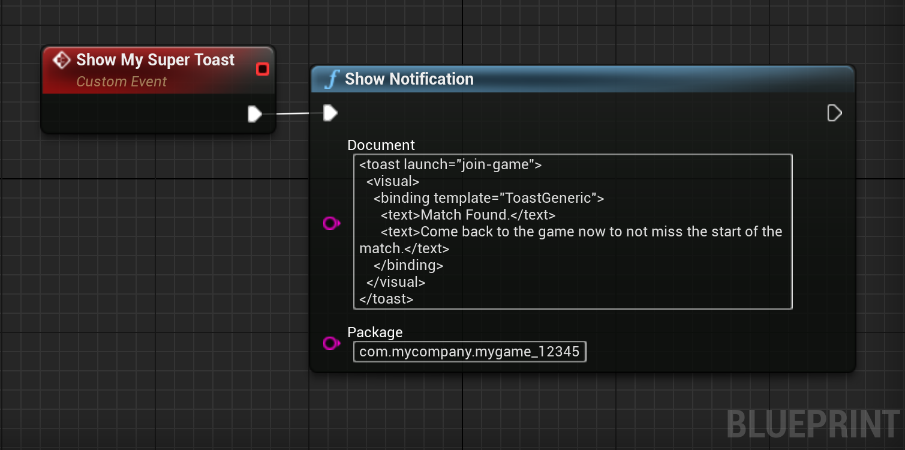

# Show a Toast Notification
This section shows how to show a simple Toast on Windows.

## What we want to do
This example shows how to create the following Toast on Windows:

<div style="text-align:center">

</div>

## Getting the Toast XML data
The XML data used to generate the skeleton of the Toast is the following:
```xml
<toast launch="join-game">
  <visual>
    <binding template="ToastGeneric">
      <text>Match Found.</text>
	  <text>Come back to the game now to not miss the start of the match</text>
	</binding>
  </visual>
</toast>
```

## Showing the Toast Notification
Showing the Toast is now extremely simple.  
We make sure to specify the package ID of our application so the clicks open our application.

<div class="code-switcher show-cpp-true">
<div class="switcher" >
<span class="sw-bp" onclick="switchBp()">Blueprints</span><span class="sw-cpp" onclick="switchCpp()">C++</span>
</div>
<div class="cpp">

```cpp
#include "WindowsNotification.h"

void ShowToast()
{
	// The package name of our application.
	const TCHAR* PackageName = TEXT("com.mycompany.mygame_12345");
	
	// The Toast XML data. Omitted for brievety.
	const TCHAR* ToastXml = TEXT("...");
	
	// And we just show the Toast.
	UWindowsNotificationLibrary::ShowToast(ToastXml, PackageName);
}
```

</div>
<div class="bp">
<div class="bpcode">
<textarea readonly>
Begin Object Class=/Script/BlueprintGraph.K2Node_CallFunction Name="K2Node_CallFunction_0"
   FunctionReference=(MemberParent=Class'"/Script/WindowsNotification.WindowsNotificationLibrary"',MemberName="ShowNotification")
   NodePosX=-128
   NodePosY=-96
   NodeGuid=A7AA7EA044C0C7BE0CE864ACF0421CD8
   CustomProperties Pin (PinId=0B0DDCC8404C931338F93288A66D3108,PinName="execute",PinToolTip="\nExec",PinType.PinCategory="exec",PinType.PinSubCategory="",PinType.PinSubCategoryObject=None,PinType.PinSubCategoryMemberReference=(),PinType.PinValueType=(),PinType.ContainerType=None,PinType.bIsReference=False,PinType.bIsConst=False,PinType.bIsWeakPointer=False,PinType.bIsUObjectWrapper=False,LinkedTo=(K2Node_CustomEvent_0 31A648594AF215B6894C50BB6BBDD3A2,),PersistentGuid=00000000000000000000000000000000,bHidden=False,bNotConnectable=False,bDefaultValueIsReadOnly=False,bDefaultValueIsIgnored=False,bAdvancedView=False,bOrphanedPin=False,)
   CustomProperties Pin (PinId=D0C498724E5D257CBDA8F5B0B46952BB,PinName="then",PinToolTip="\nExec",Direction="EGPD_Output",PinType.PinCategory="exec",PinType.PinSubCategory="",PinType.PinSubCategoryObject=None,PinType.PinSubCategoryMemberReference=(),PinType.PinValueType=(),PinType.ContainerType=None,PinType.bIsReference=False,PinType.bIsConst=False,PinType.bIsWeakPointer=False,PinType.bIsUObjectWrapper=False,PersistentGuid=00000000000000000000000000000000,bHidden=False,bNotConnectable=False,bDefaultValueIsReadOnly=False,bDefaultValueIsIgnored=False,bAdvancedView=False,bOrphanedPin=False,)
   CustomProperties Pin (PinId=D0B7E8834ABD989E8C1B26BBE80AA3E7,PinName="self",PinFriendlyName=NSLOCTEXT("K2Node", "Target", "Target"),PinToolTip="Target\nWindows Notification Library Object Reference",PinType.PinCategory="object",PinType.PinSubCategory="",PinType.PinSubCategoryObject=Class'"/Script/WindowsNotification.WindowsNotificationLibrary"',PinType.PinSubCategoryMemberReference=(),PinType.PinValueType=(),PinType.ContainerType=None,PinType.bIsReference=False,PinType.bIsConst=False,PinType.bIsWeakPointer=False,PinType.bIsUObjectWrapper=False,DefaultObject="/Script/WindowsNotification.Default__WindowsNotificationLibrary",PersistentGuid=00000000000000000000000000000000,bHidden=True,bNotConnectable=False,bDefaultValueIsReadOnly=False,bDefaultValueIsIgnored=False,bAdvancedView=False,bOrphanedPin=False,)
   CustomProperties Pin (PinId=A529C5FC47C433E552A63B91565DC420,PinName="Document",PinToolTip="Document\nString\n\nThe XML document representing the notification.",PinType.PinCategory="string",PinType.PinSubCategory="",PinType.PinSubCategoryObject=None,PinType.PinSubCategoryMemberReference=(),PinType.PinValueType=(),PinType.ContainerType=None,PinType.bIsReference=False,PinType.bIsConst=False,PinType.bIsWeakPointer=False,PinType.bIsUObjectWrapper=False,DefaultValue="<toast launch=\"join-game\">\r\n  <visual>\r\n    <binding template=\"ToastGeneric\">\r\n      <text>Match Found.</text>\r\n\t  <text>Come back to the game now to not miss the start of the match.</text>\r\n\t</binding>\r\n  </visual>\r\n</toast>",PersistentGuid=00000000000000000000000000000000,bHidden=False,bNotConnectable=False,bDefaultValueIsReadOnly=False,bDefaultValueIsIgnored=False,bAdvancedView=False,bOrphanedPin=False,)
   CustomProperties Pin (PinId=F9E3820E4D2B4B47E3DF10AC85FEBDE5,PinName="Package",PinToolTip="Package\nString\n\nThe package name of the application linked to the notification.",PinType.PinCategory="string",PinType.PinSubCategory="",PinType.PinSubCategoryObject=None,PinType.PinSubCategoryMemberReference=(),PinType.PinValueType=(),PinType.ContainerType=None,PinType.bIsReference=False,PinType.bIsConst=False,PinType.bIsWeakPointer=False,PinType.bIsUObjectWrapper=False,DefaultValue="com.mycompany.mygame_12345",PersistentGuid=00000000000000000000000000000000,bHidden=False,bNotConnectable=False,bDefaultValueIsReadOnly=False,bDefaultValueIsIgnored=False,bAdvancedView=False,bOrphanedPin=False,)
End Object
Begin Object Class=/Script/BlueprintGraph.K2Node_CustomEvent Name="K2Node_CustomEvent_0"
   CustomFunctionName="Show My Super Toast"
   NodePosX=-352
   NodePosY=-112
   NodeGuid=9BD9C8FE49E17DEDE17202847E2A29E4
   CustomProperties Pin (PinId=97817AFB49F19AE5FD7E2082DC8A128B,PinName="OutputDelegate",Direction="EGPD_Output",PinType.PinCategory="delegate",PinType.PinSubCategory="",PinType.PinSubCategoryObject=None,PinType.PinSubCategoryMemberReference=(MemberParent=BlueprintGeneratedClass'"/Game/DemoActor.DemoActor_C"',MemberName="Show My Super Toast",MemberGuid=9BD9C8FE49E17DEDE17202847E2A29E4),PinType.PinValueType=(),PinType.ContainerType=None,PinType.bIsReference=False,PinType.bIsConst=False,PinType.bIsWeakPointer=False,PinType.bIsUObjectWrapper=False,PersistentGuid=00000000000000000000000000000000,bHidden=False,bNotConnectable=False,bDefaultValueIsReadOnly=False,bDefaultValueIsIgnored=False,bAdvancedView=False,bOrphanedPin=False,)
   CustomProperties Pin (PinId=31A648594AF215B6894C50BB6BBDD3A2,PinName="then",Direction="EGPD_Output",PinType.PinCategory="exec",PinType.PinSubCategory="",PinType.PinSubCategoryObject=None,PinType.PinSubCategoryMemberReference=(),PinType.PinValueType=(),PinType.ContainerType=None,PinType.bIsReference=False,PinType.bIsConst=False,PinType.bIsWeakPointer=False,PinType.bIsUObjectWrapper=False,LinkedTo=(K2Node_CallFunction_0 0B0DDCC8404C931338F93288A66D3108,),PersistentGuid=00000000000000000000000000000000,bHidden=False,bNotConnectable=False,bDefaultValueIsReadOnly=False,bDefaultValueIsIgnored=False,bAdvancedView=False,bOrphanedPin=False,)
End Object
</textarea>

<button onclick="copyBlueprintCode(this)">Copy Code</button>
</div>
</div>
</div>
<script>
setTimeout(() => {
	bShowCPP = !JSON.parse(getCookie('bShowCPP'));
	switchCode();
}, 0);
</script>
