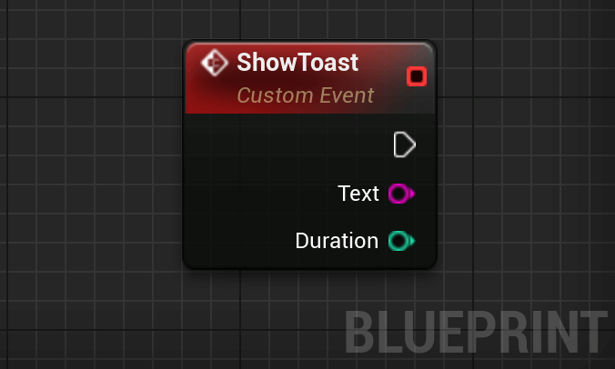
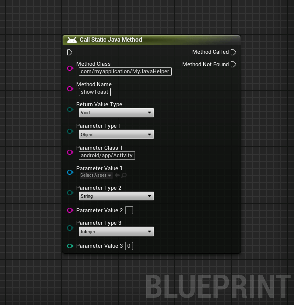
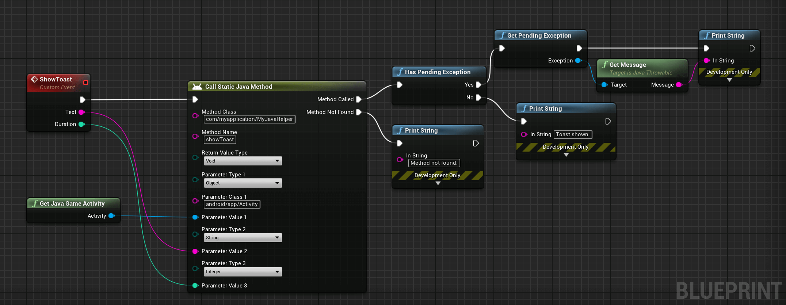
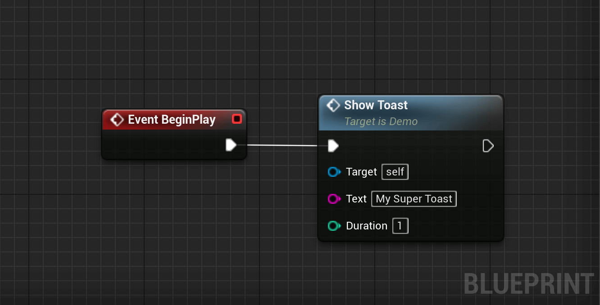

# Showing a Toast - Blueprint Examples
This section contains an example showing how to show a native Android Toast using the plugin.

## Before Starting
Before diving directly into the Blueprint code, let's see what Java code we want to call.  
The following Java code will show a Toast:
```java
Toast toast = Toast.makeText(GameActivity, "Hello toast!", Toast.LENGTH_SHORT);
toast.show();
```
We could call it directly from Blueprints with the plugin, but `Toast` is an UI element and any call to it must be done from the UI thread.
As Blueprints are run on the Game thread and aren't thread-safe, we have to write some Java code that will switch to the UI thread and show the Toast for us.   

Create the file `MyJavaHelper.java` located in `<Project>/JBI/Java/com/myapplication/` and add the following Java code into it:
```java
// Your copyright notice.

package com.myapplication;

import android.app.Activity;
import android.widget.Toast;

// Our Java Helper.
public class MyJavaHelper
{
	/**
	 * Shows a toast. Takes care to switch to the UI thread.
	*/
	public static void showToast(final Activity activity, final String text, final int duration)
	{
		// Adds our Runnable to be run on the UI thread.
		activity.runOnUiThread(new Runnable() 
		{
			@Override
			public void run()
			{
				// Creates the Toast.
				Toast toast = Toast.makeText(activity, text, duration);
				
				// Shows the Toast.
				toast.show();
			}
		});
	}
}
```
> The plugin will take care to include the file in the build automatically.

We now just have to call this method from Blueprints to show a Toast.

## Calling the Helper Function
Let's start by creating a new Blueprint event called `ShowToast` to make our code reusable. This event will have two parameters: `Text`, the text displayed in the Toast and `Duration`, the duration of the toast.

<div class="bpcode">
<textarea readonly>
Begin Object Class=/Script/BlueprintGraph.K2Node_CustomEvent Name="K2Node_CustomEvent_1"
   CustomFunctionName="ShowToast"
   NodePosX=-288
   NodePosY=-1184
   NodeGuid=D098422840C8F64CBC862F9A386BEE05
   CustomProperties Pin (PinId=E0F7B75C40D61026D5FE42AB00946403,PinName="OutputDelegate",Direction="EGPD_Output",PinType.PinCategory="delegate",PinType.PinSubCategory="",PinType.PinSubCategoryObject=None,PinType.PinSubCategoryMemberReference=(),PinType.PinValueType=(),PinType.ContainerType=None,PinType.bIsReference=False,PinType.bIsConst=False,PinType.bIsWeakPointer=False,PinType.bIsUObjectWrapper=False,PersistentGuid=00000000000000000000000000000000,bHidden=False,bNotConnectable=False,bDefaultValueIsReadOnly=False,bDefaultValueIsIgnored=False,bAdvancedView=False,bOrphanedPin=False,)
   CustomProperties Pin (PinId=171418884204D0183B275284BB60458E,PinName="then",Direction="EGPD_Output",PinType.PinCategory="exec",PinType.PinSubCategory="",PinType.PinSubCategoryObject=None,PinType.PinSubCategoryMemberReference=(),PinType.PinValueType=(),PinType.ContainerType=None,PinType.bIsReference=False,PinType.bIsConst=False,PinType.bIsWeakPointer=False,PinType.bIsUObjectWrapper=False,PersistentGuid=00000000000000000000000000000000,bHidden=False,bNotConnectable=False,bDefaultValueIsReadOnly=False,bDefaultValueIsIgnored=False,bAdvancedView=False,bOrphanedPin=False,)
   CustomProperties Pin (PinId=B165EE3843F3127C5D426CBB430A5D7F,PinName="Text",Direction="EGPD_Output",PinType.PinCategory="string",PinType.PinSubCategory="",PinType.PinSubCategoryObject=None,PinType.PinSubCategoryMemberReference=(),PinType.PinValueType=(),PinType.ContainerType=None,PinType.bIsReference=False,PinType.bIsConst=False,PinType.bIsWeakPointer=False,PinType.bIsUObjectWrapper=False,PersistentGuid=00000000000000000000000000000000,bHidden=False,bNotConnectable=False,bDefaultValueIsReadOnly=False,bDefaultValueIsIgnored=False,bAdvancedView=False,bOrphanedPin=False,)
   CustomProperties Pin (PinId=0ED008AF4D9624FCABD972B4B941E269,PinName="Duration",Direction="EGPD_Output",PinType.PinCategory="int",PinType.PinSubCategory="",PinType.PinSubCategoryObject=None,PinType.PinSubCategoryMemberReference=(),PinType.PinValueType=(),PinType.ContainerType=None,PinType.bIsReference=False,PinType.bIsConst=False,PinType.bIsWeakPointer=False,PinType.bIsUObjectWrapper=False,PersistentGuid=00000000000000000000000000000000,bHidden=False,bNotConnectable=False,bDefaultValueIsReadOnly=False,bDefaultValueIsIgnored=False,bAdvancedView=False,bOrphanedPin=False,)
   CustomProperties UserDefinedPin (PinName="Text",PinType=(PinCategory="string"),DesiredPinDirection=EGPD_Output)
   CustomProperties UserDefinedPin (PinName="Duration",PinType=(PinCategory="int"),DesiredPinDirection=EGPD_Output)
End Object
</textarea>

<button onclick="copyBlueprintCode(this)">Copy Code</button>
</div>

After that, we have to add the node to actually call our new Java method. Add the node `Call Static Java Method` in the graph. As our Java method takes 3 arguments, we have to
add additional arguments by right-clicking on the node and selecting `Add Parameter` three times.  
We also have to make sure that the return type as well as the order and the type of the parameters match exactly.

<div class="bpcode">
<textarea readonly>
Begin Object Class=/Script/BlueprintJNIEditor.K2_CallStaticJavaFunction Name="K2_CallStaticJavaFunction_1"
   NumParams=3
   NodePosX=-288
   NodePosY=-832
   NodeGuid=BFEA9D7F446B848F91B2398210965C27
   CustomProperties Pin (PinId=C61DDE794A374F33589BD2ACF5CDEB21,PinName="execute",PinType.PinCategory="exec",PinType.PinSubCategory="",PinType.PinSubCategoryObject=None,PinType.PinSubCategoryMemberReference=(),PinType.PinValueType=(),PinType.ContainerType=None,PinType.bIsReference=False,PinType.bIsConst=False,PinType.bIsWeakPointer=False,PinType.bIsUObjectWrapper=False,LinkedTo=(K2Node_CustomEvent_1 171418884204D0183B275284BB60458E,),PersistentGuid=00000000000000000000000000000000,bHidden=False,bNotConnectable=False,bDefaultValueIsReadOnly=False,bDefaultValueIsIgnored=False,bAdvancedView=False,bOrphanedPin=False,)
   CustomProperties Pin (PinId=8485AFD644B5BE8D7613808D035FD5DF,PinName="Method Called",Direction="EGPD_Output",PinType.PinCategory="exec",PinType.PinSubCategory="",PinType.PinSubCategoryObject=None,PinType.PinSubCategoryMemberReference=(),PinType.PinValueType=(),PinType.ContainerType=None,PinType.bIsReference=False,PinType.bIsConst=False,PinType.bIsWeakPointer=False,PinType.bIsUObjectWrapper=False,LinkedTo=(K2Node_CallFunction_1 5038A9E644E98B9ACB4D77B7B524AD9F,),PersistentGuid=00000000000000000000000000000000,bHidden=False,bNotConnectable=False,bDefaultValueIsReadOnly=False,bDefaultValueIsIgnored=False,bAdvancedView=False,bOrphanedPin=False,)
   CustomProperties Pin (PinId=8ADB5A954D4E3E063F726E85F8A87976,PinName="Return Value",Direction="EGPD_Output",PinType.PinCategory="object",PinType.PinSubCategory="",PinType.PinSubCategoryObject=None,PinType.PinSubCategoryMemberReference=(),PinType.PinValueType=(),PinType.ContainerType=None,PinType.bIsReference=False,PinType.bIsConst=False,PinType.bIsWeakPointer=False,PinType.bIsUObjectWrapper=False,PersistentGuid=00000000000000000000000000000000,bHidden=True,bNotConnectable=False,bDefaultValueIsReadOnly=False,bDefaultValueIsIgnored=False,bAdvancedView=False,bOrphanedPin=False,)
   CustomProperties Pin (PinId=A7C805BD4D2ACE3672BECB8EE60AE4C9,PinName="Method not Found",Direction="EGPD_Output",PinType.PinCategory="exec",PinType.PinSubCategory="",PinType.PinSubCategoryObject=None,PinType.PinSubCategoryMemberReference=(),PinType.PinValueType=(),PinType.ContainerType=None,PinType.bIsReference=False,PinType.bIsConst=False,PinType.bIsWeakPointer=False,PinType.bIsUObjectWrapper=False,LinkedTo=(K2Node_CallFunction_7 37E478D84751F5C616F1B89BB86B28A7,),PersistentGuid=00000000000000000000000000000000,bHidden=False,bNotConnectable=False,bDefaultValueIsReadOnly=False,bDefaultValueIsIgnored=False,bAdvancedView=False,bOrphanedPin=False,)
   CustomProperties Pin (PinId=005B4266416D1DA56D17F098FB626F6E,PinName="Method Class",PinType.PinCategory="string",PinType.PinSubCategory="",PinType.PinSubCategoryObject=None,PinType.PinSubCategoryMemberReference=(),PinType.PinValueType=(),PinType.ContainerType=None,PinType.bIsReference=False,PinType.bIsConst=False,PinType.bIsWeakPointer=False,PinType.bIsUObjectWrapper=False,DefaultValue="com/myapplication/MyJavaHelper",PersistentGuid=00000000000000000000000000000000,bHidden=False,bNotConnectable=False,bDefaultValueIsReadOnly=False,bDefaultValueIsIgnored=False,bAdvancedView=False,bOrphanedPin=False,)
   CustomProperties Pin (PinId=0BFB2CB54AAE052705B6078C78B1336C,PinName="Method Name",PinType.PinCategory="string",PinType.PinSubCategory="",PinType.PinSubCategoryObject=None,PinType.PinSubCategoryMemberReference=(),PinType.PinValueType=(),PinType.ContainerType=None,PinType.bIsReference=False,PinType.bIsConst=False,PinType.bIsWeakPointer=False,PinType.bIsUObjectWrapper=False,DefaultValue="showToast",PersistentGuid=00000000000000000000000000000000,bHidden=False,bNotConnectable=False,bDefaultValueIsReadOnly=False,bDefaultValueIsIgnored=False,bAdvancedView=False,bOrphanedPin=False,)
   CustomProperties Pin (PinId=1A4762494BB992A296C8BFB3CB27A58D,PinName="Return Value Type",PinType.PinCategory="byte",PinType.PinSubCategory="EJavaType",PinType.PinSubCategoryObject=Enum'"/Script/BlueprintJNI.EJavaType"',PinType.PinSubCategoryMemberReference=(),PinType.PinValueType=(),PinType.ContainerType=None,PinType.bIsReference=False,PinType.bIsConst=False,PinType.bIsWeakPointer=False,PinType.bIsUObjectWrapper=False,DefaultValue="Void",PersistentGuid=00000000000000000000000000000000,bHidden=False,bNotConnectable=False,bDefaultValueIsReadOnly=False,bDefaultValueIsIgnored=False,bAdvancedView=False,bOrphanedPin=False,)
   CustomProperties Pin (PinId=9CE699544736DC5911C59E96CEE08703,PinName="Return Value Class",PinType.PinCategory="string",PinType.PinSubCategory="",PinType.PinSubCategoryObject=None,PinType.PinSubCategoryMemberReference=(),PinType.PinValueType=(),PinType.ContainerType=None,PinType.bIsReference=False,PinType.bIsConst=False,PinType.bIsWeakPointer=False,PinType.bIsUObjectWrapper=False,DefaultValue="android/widget/Toast",PersistentGuid=00000000000000000000000000000000,bHidden=True,bNotConnectable=False,bDefaultValueIsReadOnly=False,bDefaultValueIsIgnored=False,bAdvancedView=False,bOrphanedPin=False,)
   CustomProperties Pin (PinId=BEC066294D9DF496644CAC84DF5369D7,PinName="ParamType_1",PinFriendlyName=LOCGEN_FORMAT_ORDERED(NSLOCTEXT("UK2_JavaParametersNode", "ParameterTypePinName", "Parameter Type {0}"), 1),PinType.PinCategory="byte",PinType.PinSubCategory="EJavaType",PinType.PinSubCategoryObject=Enum'"/Script/BlueprintJNI.EJavaType"',PinType.PinSubCategoryMemberReference=(),PinType.PinValueType=(),PinType.ContainerType=None,PinType.bIsReference=False,PinType.bIsConst=False,PinType.bIsWeakPointer=False,PinType.bIsUObjectWrapper=False,DefaultValue="Object",PersistentGuid=00000000000000000000000000000000,bHidden=False,bNotConnectable=False,bDefaultValueIsReadOnly=False,bDefaultValueIsIgnored=False,bAdvancedView=False,bOrphanedPin=False,)
   CustomProperties Pin (PinId=3636ECB440FE490AADAF81A1B17C7988,PinName="ParamClass_1",PinFriendlyName=LOCGEN_FORMAT_ORDERED(NSLOCTEXT("UK2_JavaParametersNode", "ParameterClassPinName", "Parameter Class {0}"), 1),PinType.PinCategory="string",PinType.PinSubCategory="",PinType.PinSubCategoryObject=None,PinType.PinSubCategoryMemberReference=(),PinType.PinValueType=(),PinType.ContainerType=None,PinType.bIsReference=False,PinType.bIsConst=False,PinType.bIsWeakPointer=False,PinType.bIsUObjectWrapper=False,DefaultValue="android/app/Activity",PersistentGuid=00000000000000000000000000000000,bHidden=False,bNotConnectable=False,bDefaultValueIsReadOnly=False,bDefaultValueIsIgnored=False,bAdvancedView=False,bOrphanedPin=False,)
   CustomProperties Pin (PinId=AF2AE49240C1952696ABF8A7710A46C7,PinName="ParamVal_1",PinFriendlyName=LOCGEN_FORMAT_ORDERED(NSLOCTEXT("UK2_JavaParametersNode", "ParameterValuePinName", "Parameter Value {0}"), 1),PinType.PinCategory="object",PinType.PinSubCategory="",PinType.PinSubCategoryObject=Class'"/Script/BlueprintJNI.JavaObject"',PinType.PinSubCategoryMemberReference=(),PinType.PinValueType=(),PinType.ContainerType=None,PinType.bIsReference=False,PinType.bIsConst=False,PinType.bIsWeakPointer=False,PinType.bIsUObjectWrapper=False,LinkedTo=(K2Node_CallFunction_5 44617753417386EC40ADF1B31EB6437C,),PersistentGuid=00000000000000000000000000000000,bHidden=False,bNotConnectable=False,bDefaultValueIsReadOnly=False,bDefaultValueIsIgnored=False,bAdvancedView=False,bOrphanedPin=False,)
   CustomProperties Pin (PinId=6C18C55D465B1DE07ACFEC8DB14A7F54,PinName="ParamType_2",PinFriendlyName=LOCGEN_FORMAT_ORDERED(NSLOCTEXT("UK2_JavaParametersNode", "ParameterTypePinName", "Parameter Type {0}"), 2),PinType.PinCategory="byte",PinType.PinSubCategory="EJavaType",PinType.PinSubCategoryObject=Enum'"/Script/BlueprintJNI.EJavaType"',PinType.PinSubCategoryMemberReference=(),PinType.PinValueType=(),PinType.ContainerType=None,PinType.bIsReference=False,PinType.bIsConst=False,PinType.bIsWeakPointer=False,PinType.bIsUObjectWrapper=False,DefaultValue="String",PersistentGuid=00000000000000000000000000000000,bHidden=False,bNotConnectable=False,bDefaultValueIsReadOnly=False,bDefaultValueIsIgnored=False,bAdvancedView=False,bOrphanedPin=False,)
   CustomProperties Pin (PinId=A77006064D881248D7A8FF89B2CBB927,PinName="ParamClass_2",PinFriendlyName=LOCGEN_FORMAT_ORDERED(NSLOCTEXT("UK2_JavaParametersNode", "ParameterClassPinName", "Parameter Class {0}"), 2),PinType.PinCategory="string",PinType.PinSubCategory="",PinType.PinSubCategoryObject=None,PinType.PinSubCategoryMemberReference=(),PinType.PinValueType=(),PinType.ContainerType=None,PinType.bIsReference=False,PinType.bIsConst=False,PinType.bIsWeakPointer=False,PinType.bIsUObjectWrapper=False,DefaultValue="java/lang/CharSequence",PersistentGuid=00000000000000000000000000000000,bHidden=True,bNotConnectable=False,bDefaultValueIsReadOnly=False,bDefaultValueIsIgnored=False,bAdvancedView=False,bOrphanedPin=False,)
   CustomProperties Pin (PinId=96E816994268A64CE3FE2C834D86C275,PinName="ParamVal_2",PinFriendlyName=LOCGEN_FORMAT_ORDERED(NSLOCTEXT("UK2_JavaParametersNode", "ParameterValuePinName", "Parameter Value {0}"), 2),PinType.PinCategory="string",PinType.PinSubCategory="",PinType.PinSubCategoryObject=None,PinType.PinSubCategoryMemberReference=(),PinType.PinValueType=(),PinType.ContainerType=None,PinType.bIsReference=False,PinType.bIsConst=False,PinType.bIsWeakPointer=False,PinType.bIsUObjectWrapper=False,LinkedTo=(K2Node_CustomEvent_1 B165EE3843F3127C5D426CBB430A5D7F,),PersistentGuid=00000000000000000000000000000000,bHidden=False,bNotConnectable=False,bDefaultValueIsReadOnly=False,bDefaultValueIsIgnored=False,bAdvancedView=False,bOrphanedPin=False,)
   CustomProperties Pin (PinId=972E873E48F56C12E801AD90D65B34F3,PinName="ParamType_3",PinFriendlyName=LOCGEN_FORMAT_ORDERED(NSLOCTEXT("UK2_JavaParametersNode", "ParameterTypePinName", "Parameter Type {0}"), 3),PinType.PinCategory="byte",PinType.PinSubCategory="EJavaType",PinType.PinSubCategoryObject=Enum'"/Script/BlueprintJNI.EJavaType"',PinType.PinSubCategoryMemberReference=(),PinType.PinValueType=(),PinType.ContainerType=None,PinType.bIsReference=False,PinType.bIsConst=False,PinType.bIsWeakPointer=False,PinType.bIsUObjectWrapper=False,DefaultValue="Integer",PersistentGuid=00000000000000000000000000000000,bHidden=False,bNotConnectable=False,bDefaultValueIsReadOnly=False,bDefaultValueIsIgnored=False,bAdvancedView=False,bOrphanedPin=False,)
   CustomProperties Pin (PinId=4F6A91C64ABF8855E2F866A869D388DA,PinName="ParamClass_3",PinFriendlyName=LOCGEN_FORMAT_ORDERED(NSLOCTEXT("UK2_JavaParametersNode", "ParameterClassPinName", "Parameter Class {0}"), 3),PinType.PinCategory="string",PinType.PinSubCategory="",PinType.PinSubCategoryObject=None,PinType.PinSubCategoryMemberReference=(),PinType.PinValueType=(),PinType.ContainerType=None,PinType.bIsReference=False,PinType.bIsConst=False,PinType.bIsWeakPointer=False,PinType.bIsUObjectWrapper=False,DefaultValue="java/lang/Object",PersistentGuid=00000000000000000000000000000000,bHidden=True,bNotConnectable=False,bDefaultValueIsReadOnly=False,bDefaultValueIsIgnored=False,bAdvancedView=False,bOrphanedPin=False,)
   CustomProperties Pin (PinId=8A43A36845A3CAB5264D27967CC3DA3A,PinName="ParamVal_3",PinFriendlyName=LOCGEN_FORMAT_ORDERED(NSLOCTEXT("UK2_JavaParametersNode", "ParameterValuePinName", "Parameter Value {0}"), 3),PinType.PinCategory="int",PinType.PinSubCategory="",PinType.PinSubCategoryObject=None,PinType.PinSubCategoryMemberReference=(),PinType.PinValueType=(),PinType.ContainerType=None,PinType.bIsReference=False,PinType.bIsConst=False,PinType.bIsWeakPointer=False,PinType.bIsUObjectWrapper=False,LinkedTo=(K2Node_CustomEvent_1 0ED008AF4D9624FCABD972B4B941E269,),PersistentGuid=00000000000000000000000000000000,bHidden=False,bNotConnectable=False,bDefaultValueIsReadOnly=False,bDefaultValueIsIgnored=False,bAdvancedView=False,bOrphanedPin=False,)
End Object
</textarea>

<button onclick="copyBlueprintCode(this)">Copy Code</button>
</div>

We can easily finish the event by connecting the two nodes together.

<div class="bpcode">
<textarea readonly>
Begin Object Class=/Script/BlueprintGraph.K2Node_CustomEvent Name="K2Node_CustomEvent_1"
   CustomFunctionName="ShowToast"
   NodePosX=512
   NodePosY=-1760
   NodeGuid=1F0EF32F47BEEA2EA7C129B1CFBC15C3
   CustomProperties Pin (PinId=E0F7B75C40D61026D5FE42AB00946403,PinName="OutputDelegate",Direction="EGPD_Output",PinType.PinCategory="delegate",PinType.PinSubCategory="",PinType.PinSubCategoryObject=None,PinType.PinSubCategoryMemberReference=(),PinType.PinValueType=(),PinType.ContainerType=None,PinType.bIsReference=False,PinType.bIsConst=False,PinType.bIsWeakPointer=False,PinType.bIsUObjectWrapper=False,PersistentGuid=00000000000000000000000000000000,bHidden=False,bNotConnectable=False,bDefaultValueIsReadOnly=False,bDefaultValueIsIgnored=False,bAdvancedView=False,bOrphanedPin=False,)
   CustomProperties Pin (PinId=171418884204D0183B275284BB60458E,PinName="then",Direction="EGPD_Output",PinType.PinCategory="exec",PinType.PinSubCategory="",PinType.PinSubCategoryObject=None,PinType.PinSubCategoryMemberReference=(),PinType.PinValueType=(),PinType.ContainerType=None,PinType.bIsReference=False,PinType.bIsConst=False,PinType.bIsWeakPointer=False,PinType.bIsUObjectWrapper=False,LinkedTo=(K2_CallStaticJavaFunction_1 C61DDE794A374F33589BD2ACF5CDEB21,),PersistentGuid=00000000000000000000000000000000,bHidden=False,bNotConnectable=False,bDefaultValueIsReadOnly=False,bDefaultValueIsIgnored=False,bAdvancedView=False,bOrphanedPin=False,)
   CustomProperties Pin (PinId=B165EE3843F3127C5D426CBB430A5D7F,PinName="Text",Direction="EGPD_Output",PinType.PinCategory="string",PinType.PinSubCategory="",PinType.PinSubCategoryObject=None,PinType.PinSubCategoryMemberReference=(),PinType.PinValueType=(),PinType.ContainerType=None,PinType.bIsReference=False,PinType.bIsConst=False,PinType.bIsWeakPointer=False,PinType.bIsUObjectWrapper=False,LinkedTo=(K2_CallStaticJavaFunction_1 96E816994268A64CE3FE2C834D86C275,),PersistentGuid=00000000000000000000000000000000,bHidden=False,bNotConnectable=False,bDefaultValueIsReadOnly=False,bDefaultValueIsIgnored=False,bAdvancedView=False,bOrphanedPin=False,)
   CustomProperties Pin (PinId=0ED008AF4D9624FCABD972B4B941E269,PinName="Duration",Direction="EGPD_Output",PinType.PinCategory="int",PinType.PinSubCategory="",PinType.PinSubCategoryObject=None,PinType.PinSubCategoryMemberReference=(),PinType.PinValueType=(),PinType.ContainerType=None,PinType.bIsReference=False,PinType.bIsConst=False,PinType.bIsWeakPointer=False,PinType.bIsUObjectWrapper=False,LinkedTo=(K2_CallStaticJavaFunction_1 8A43A36845A3CAB5264D27967CC3DA3A,),PersistentGuid=00000000000000000000000000000000,bHidden=False,bNotConnectable=False,bDefaultValueIsReadOnly=False,bDefaultValueIsIgnored=False,bAdvancedView=False,bOrphanedPin=False,)
   CustomProperties UserDefinedPin (PinName="Text",PinType=(PinCategory="string"),DesiredPinDirection=EGPD_Output)
   CustomProperties UserDefinedPin (PinName="Duration",PinType=(PinCategory="int"),DesiredPinDirection=EGPD_Output)
End Object
Begin Object Class=/Script/BlueprintJNIEditor.K2_CallStaticJavaFunction Name="K2_CallStaticJavaFunction_1"
   NumParams=3
   NodePosX=864
   NodePosY=-1744
   NodeGuid=6A122D1A4ECB8F8128AE24B1AFE811FC
   CustomProperties Pin (PinId=C61DDE794A374F33589BD2ACF5CDEB21,PinName="execute",PinType.PinCategory="exec",PinType.PinSubCategory="",PinType.PinSubCategoryObject=None,PinType.PinSubCategoryMemberReference=(),PinType.PinValueType=(),PinType.ContainerType=None,PinType.bIsReference=False,PinType.bIsConst=False,PinType.bIsWeakPointer=False,PinType.bIsUObjectWrapper=False,LinkedTo=(K2Node_CustomEvent_1 171418884204D0183B275284BB60458E,),PersistentGuid=00000000000000000000000000000000,bHidden=False,bNotConnectable=False,bDefaultValueIsReadOnly=False,bDefaultValueIsIgnored=False,bAdvancedView=False,bOrphanedPin=False,)
   CustomProperties Pin (PinId=8485AFD644B5BE8D7613808D035FD5DF,PinName="Method Called",Direction="EGPD_Output",PinType.PinCategory="exec",PinType.PinSubCategory="",PinType.PinSubCategoryObject=None,PinType.PinSubCategoryMemberReference=(),PinType.PinValueType=(),PinType.ContainerType=None,PinType.bIsReference=False,PinType.bIsConst=False,PinType.bIsWeakPointer=False,PinType.bIsUObjectWrapper=False,PersistentGuid=00000000000000000000000000000000,bHidden=False,bNotConnectable=False,bDefaultValueIsReadOnly=False,bDefaultValueIsIgnored=False,bAdvancedView=False,bOrphanedPin=False,)
   CustomProperties Pin (PinId=8ADB5A954D4E3E063F726E85F8A87976,PinName="Return Value",Direction="EGPD_Output",PinType.PinCategory="object",PinType.PinSubCategory="",PinType.PinSubCategoryObject=None,PinType.PinSubCategoryMemberReference=(),PinType.PinValueType=(),PinType.ContainerType=None,PinType.bIsReference=False,PinType.bIsConst=False,PinType.bIsWeakPointer=False,PinType.bIsUObjectWrapper=False,PersistentGuid=00000000000000000000000000000000,bHidden=True,bNotConnectable=False,bDefaultValueIsReadOnly=False,bDefaultValueIsIgnored=False,bAdvancedView=False,bOrphanedPin=False,)
   CustomProperties Pin (PinId=A7C805BD4D2ACE3672BECB8EE60AE4C9,PinName="Method not Found",Direction="EGPD_Output",PinType.PinCategory="exec",PinType.PinSubCategory="",PinType.PinSubCategoryObject=None,PinType.PinSubCategoryMemberReference=(),PinType.PinValueType=(),PinType.ContainerType=None,PinType.bIsReference=False,PinType.bIsConst=False,PinType.bIsWeakPointer=False,PinType.bIsUObjectWrapper=False,PersistentGuid=00000000000000000000000000000000,bHidden=False,bNotConnectable=False,bDefaultValueIsReadOnly=False,bDefaultValueIsIgnored=False,bAdvancedView=False,bOrphanedPin=False,)
   CustomProperties Pin (PinId=005B4266416D1DA56D17F098FB626F6E,PinName="Method Class",PinType.PinCategory="string",PinType.PinSubCategory="",PinType.PinSubCategoryObject=None,PinType.PinSubCategoryMemberReference=(),PinType.PinValueType=(),PinType.ContainerType=None,PinType.bIsReference=False,PinType.bIsConst=False,PinType.bIsWeakPointer=False,PinType.bIsUObjectWrapper=False,DefaultValue="com/myapplication/MyJavaHelper",PersistentGuid=00000000000000000000000000000000,bHidden=False,bNotConnectable=False,bDefaultValueIsReadOnly=False,bDefaultValueIsIgnored=False,bAdvancedView=False,bOrphanedPin=False,)
   CustomProperties Pin (PinId=0BFB2CB54AAE052705B6078C78B1336C,PinName="Method Name",PinType.PinCategory="string",PinType.PinSubCategory="",PinType.PinSubCategoryObject=None,PinType.PinSubCategoryMemberReference=(),PinType.PinValueType=(),PinType.ContainerType=None,PinType.bIsReference=False,PinType.bIsConst=False,PinType.bIsWeakPointer=False,PinType.bIsUObjectWrapper=False,DefaultValue="showToast",PersistentGuid=00000000000000000000000000000000,bHidden=False,bNotConnectable=False,bDefaultValueIsReadOnly=False,bDefaultValueIsIgnored=False,bAdvancedView=False,bOrphanedPin=False,)
   CustomProperties Pin (PinId=1A4762494BB992A296C8BFB3CB27A58D,PinName="Return Value Type",PinType.PinCategory="byte",PinType.PinSubCategory="EJavaType",PinType.PinSubCategoryObject=Enum'"/Script/BlueprintJNI.EJavaType"',PinType.PinSubCategoryMemberReference=(),PinType.PinValueType=(),PinType.ContainerType=None,PinType.bIsReference=False,PinType.bIsConst=False,PinType.bIsWeakPointer=False,PinType.bIsUObjectWrapper=False,DefaultValue="Void",PersistentGuid=00000000000000000000000000000000,bHidden=False,bNotConnectable=False,bDefaultValueIsReadOnly=False,bDefaultValueIsIgnored=False,bAdvancedView=False,bOrphanedPin=False,)
   CustomProperties Pin (PinId=9CE699544736DC5911C59E96CEE08703,PinName="Return Value Class",PinType.PinCategory="string",PinType.PinSubCategory="",PinType.PinSubCategoryObject=None,PinType.PinSubCategoryMemberReference=(),PinType.PinValueType=(),PinType.ContainerType=None,PinType.bIsReference=False,PinType.bIsConst=False,PinType.bIsWeakPointer=False,PinType.bIsUObjectWrapper=False,DefaultValue="android/widget/Toast",PersistentGuid=00000000000000000000000000000000,bHidden=True,bNotConnectable=False,bDefaultValueIsReadOnly=False,bDefaultValueIsIgnored=False,bAdvancedView=False,bOrphanedPin=False,)
   CustomProperties Pin (PinId=BEC066294D9DF496644CAC84DF5369D7,PinName="ParamType_1",PinFriendlyName=LOCGEN_FORMAT_ORDERED(NSLOCTEXT("UK2_JavaParametersNode", "ParameterTypePinName", "Parameter Type {0}"), 1),PinType.PinCategory="byte",PinType.PinSubCategory="EJavaType",PinType.PinSubCategoryObject=Enum'"/Script/BlueprintJNI.EJavaType"',PinType.PinSubCategoryMemberReference=(),PinType.PinValueType=(),PinType.ContainerType=None,PinType.bIsReference=False,PinType.bIsConst=False,PinType.bIsWeakPointer=False,PinType.bIsUObjectWrapper=False,DefaultValue="Object",PersistentGuid=00000000000000000000000000000000,bHidden=False,bNotConnectable=False,bDefaultValueIsReadOnly=False,bDefaultValueIsIgnored=False,bAdvancedView=False,bOrphanedPin=False,)
   CustomProperties Pin (PinId=3636ECB440FE490AADAF81A1B17C7988,PinName="ParamClass_1",PinFriendlyName=LOCGEN_FORMAT_ORDERED(NSLOCTEXT("UK2_JavaParametersNode", "ParameterClassPinName", "Parameter Class {0}"), 1),PinType.PinCategory="string",PinType.PinSubCategory="",PinType.PinSubCategoryObject=None,PinType.PinSubCategoryMemberReference=(),PinType.PinValueType=(),PinType.ContainerType=None,PinType.bIsReference=False,PinType.bIsConst=False,PinType.bIsWeakPointer=False,PinType.bIsUObjectWrapper=False,DefaultValue="android/app/Activity",PersistentGuid=00000000000000000000000000000000,bHidden=False,bNotConnectable=False,bDefaultValueIsReadOnly=False,bDefaultValueIsIgnored=False,bAdvancedView=False,bOrphanedPin=False,)
   CustomProperties Pin (PinId=AF2AE49240C1952696ABF8A7710A46C7,PinName="ParamVal_1",PinFriendlyName=LOCGEN_FORMAT_ORDERED(NSLOCTEXT("UK2_JavaParametersNode", "ParameterValuePinName", "Parameter Value {0}"), 1),PinType.PinCategory="object",PinType.PinSubCategory="",PinType.PinSubCategoryObject=Class'"/Script/BlueprintJNI.JavaObject"',PinType.PinSubCategoryMemberReference=(),PinType.PinValueType=(),PinType.ContainerType=None,PinType.bIsReference=False,PinType.bIsConst=False,PinType.bIsWeakPointer=False,PinType.bIsUObjectWrapper=False,LinkedTo=(K2Node_CallFunction_5 44617753417386EC40ADF1B31EB6437C,),PersistentGuid=00000000000000000000000000000000,bHidden=False,bNotConnectable=False,bDefaultValueIsReadOnly=False,bDefaultValueIsIgnored=False,bAdvancedView=False,bOrphanedPin=False,)
   CustomProperties Pin (PinId=6C18C55D465B1DE07ACFEC8DB14A7F54,PinName="ParamType_2",PinFriendlyName=LOCGEN_FORMAT_ORDERED(NSLOCTEXT("UK2_JavaParametersNode", "ParameterTypePinName", "Parameter Type {0}"), 2),PinType.PinCategory="byte",PinType.PinSubCategory="EJavaType",PinType.PinSubCategoryObject=Enum'"/Script/BlueprintJNI.EJavaType"',PinType.PinSubCategoryMemberReference=(),PinType.PinValueType=(),PinType.ContainerType=None,PinType.bIsReference=False,PinType.bIsConst=False,PinType.bIsWeakPointer=False,PinType.bIsUObjectWrapper=False,DefaultValue="String",PersistentGuid=00000000000000000000000000000000,bHidden=False,bNotConnectable=False,bDefaultValueIsReadOnly=False,bDefaultValueIsIgnored=False,bAdvancedView=False,bOrphanedPin=False,)
   CustomProperties Pin (PinId=A77006064D881248D7A8FF89B2CBB927,PinName="ParamClass_2",PinFriendlyName=LOCGEN_FORMAT_ORDERED(NSLOCTEXT("UK2_JavaParametersNode", "ParameterClassPinName", "Parameter Class {0}"), 2),PinType.PinCategory="string",PinType.PinSubCategory="",PinType.PinSubCategoryObject=None,PinType.PinSubCategoryMemberReference=(),PinType.PinValueType=(),PinType.ContainerType=None,PinType.bIsReference=False,PinType.bIsConst=False,PinType.bIsWeakPointer=False,PinType.bIsUObjectWrapper=False,DefaultValue="java/lang/CharSequence",PersistentGuid=00000000000000000000000000000000,bHidden=True,bNotConnectable=False,bDefaultValueIsReadOnly=False,bDefaultValueIsIgnored=False,bAdvancedView=False,bOrphanedPin=False,)
   CustomProperties Pin (PinId=96E816994268A64CE3FE2C834D86C275,PinName="ParamVal_2",PinFriendlyName=LOCGEN_FORMAT_ORDERED(NSLOCTEXT("UK2_JavaParametersNode", "ParameterValuePinName", "Parameter Value {0}"), 2),PinType.PinCategory="string",PinType.PinSubCategory="",PinType.PinSubCategoryObject=None,PinType.PinSubCategoryMemberReference=(),PinType.PinValueType=(),PinType.ContainerType=None,PinType.bIsReference=False,PinType.bIsConst=False,PinType.bIsWeakPointer=False,PinType.bIsUObjectWrapper=False,LinkedTo=(K2Node_CustomEvent_1 B165EE3843F3127C5D426CBB430A5D7F,),PersistentGuid=00000000000000000000000000000000,bHidden=False,bNotConnectable=False,bDefaultValueIsReadOnly=False,bDefaultValueIsIgnored=False,bAdvancedView=False,bOrphanedPin=False,)
   CustomProperties Pin (PinId=972E873E48F56C12E801AD90D65B34F3,PinName="ParamType_3",PinFriendlyName=LOCGEN_FORMAT_ORDERED(NSLOCTEXT("UK2_JavaParametersNode", "ParameterTypePinName", "Parameter Type {0}"), 3),PinType.PinCategory="byte",PinType.PinSubCategory="EJavaType",PinType.PinSubCategoryObject=Enum'"/Script/BlueprintJNI.EJavaType"',PinType.PinSubCategoryMemberReference=(),PinType.PinValueType=(),PinType.ContainerType=None,PinType.bIsReference=False,PinType.bIsConst=False,PinType.bIsWeakPointer=False,PinType.bIsUObjectWrapper=False,DefaultValue="Integer",PersistentGuid=00000000000000000000000000000000,bHidden=False,bNotConnectable=False,bDefaultValueIsReadOnly=False,bDefaultValueIsIgnored=False,bAdvancedView=False,bOrphanedPin=False,)
   CustomProperties Pin (PinId=4F6A91C64ABF8855E2F866A869D388DA,PinName="ParamClass_3",PinFriendlyName=LOCGEN_FORMAT_ORDERED(NSLOCTEXT("UK2_JavaParametersNode", "ParameterClassPinName", "Parameter Class {0}"), 3),PinType.PinCategory="string",PinType.PinSubCategory="",PinType.PinSubCategoryObject=None,PinType.PinSubCategoryMemberReference=(),PinType.PinValueType=(),PinType.ContainerType=None,PinType.bIsReference=False,PinType.bIsConst=False,PinType.bIsWeakPointer=False,PinType.bIsUObjectWrapper=False,DefaultValue="java/lang/Object",PersistentGuid=00000000000000000000000000000000,bHidden=True,bNotConnectable=False,bDefaultValueIsReadOnly=False,bDefaultValueIsIgnored=False,bAdvancedView=False,bOrphanedPin=False,)
   CustomProperties Pin (PinId=8A43A36845A3CAB5264D27967CC3DA3A,PinName="ParamVal_3",PinFriendlyName=LOCGEN_FORMAT_ORDERED(NSLOCTEXT("UK2_JavaParametersNode", "ParameterValuePinName", "Parameter Value {0}"), 3),PinType.PinCategory="int",PinType.PinSubCategory="",PinType.PinSubCategoryObject=None,PinType.PinSubCategoryMemberReference=(),PinType.PinValueType=(),PinType.ContainerType=None,PinType.bIsReference=False,PinType.bIsConst=False,PinType.bIsWeakPointer=False,PinType.bIsUObjectWrapper=False,LinkedTo=(K2Node_CustomEvent_1 0ED008AF4D9624FCABD972B4B941E269,),PersistentGuid=00000000000000000000000000000000,bHidden=False,bNotConnectable=False,bDefaultValueIsReadOnly=False,bDefaultValueIsIgnored=False,bAdvancedView=False,bOrphanedPin=False,)
End Object
Begin Object Class=/Script/BlueprintGraph.K2Node_CallFunction Name="K2Node_CallFunction_5"
   bIsPureFunc=True
   FunctionReference=(MemberParent=Class'"/Script/BlueprintJNI.JavaLibrary"',MemberName="GetJavaGameActivity")
   NodePosX=512
   NodePosY=-1488
   NodeGuid=C73FCDF14EDC9E1086F8759504B5793D
   CustomProperties Pin (PinId=D90CC5E9410227416D86A187F1B204A7,PinName="self",PinFriendlyName=NSLOCTEXT("K2Node", "Target", "Target"),PinType.PinCategory="object",PinType.PinSubCategory="",PinType.PinSubCategoryObject=Class'"/Script/BlueprintJNI.JavaLibrary"',PinType.PinSubCategoryMemberReference=(),PinType.PinValueType=(),PinType.ContainerType=None,PinType.bIsReference=False,PinType.bIsConst=False,PinType.bIsWeakPointer=False,PinType.bIsUObjectWrapper=False,DefaultObject="/Script/BlueprintJNI.Default__JavaLibrary",PersistentGuid=00000000000000000000000000000000,bHidden=True,bNotConnectable=False,bDefaultValueIsReadOnly=False,bDefaultValueIsIgnored=False,bAdvancedView=False,bOrphanedPin=False,)
   CustomProperties Pin (PinId=44617753417386EC40ADF1B31EB6437C,PinName="ReturnValue",PinFriendlyName=NSLOCTEXT("", "4C697B71421B10A209CD19A2AA949B67", "Activity"),Direction="EGPD_Output",PinType.PinCategory="object",PinType.PinSubCategory="",PinType.PinSubCategoryObject=Class'"/Script/BlueprintJNI.JavaObject"',PinType.PinSubCategoryMemberReference=(),PinType.PinValueType=(),PinType.ContainerType=None,PinType.bIsReference=False,PinType.bIsConst=False,PinType.bIsWeakPointer=False,PinType.bIsUObjectWrapper=False,LinkedTo=(K2_CallStaticJavaFunction_1 AF2AE49240C1952696ABF8A7710A46C7,),PersistentGuid=00000000000000000000000000000000,bHidden=False,bNotConnectable=False,bDefaultValueIsReadOnly=False,bDefaultValueIsIgnored=False,bAdvancedView=False,bOrphanedPin=False,)
End Object
</textarea>

<button onclick="copyBlueprintCode(this)">Copy Code</button>
</div>

## Java Error Handling
Error handling can also be added to handle exceptions thrown during the Java call.
<div class="bpcode">
<textarea readonly>
Begin Object Class=/Script/BlueprintGraph.K2Node_CustomEvent Name="K2Node_CustomEvent_1"
   CustomFunctionName="ShowToast"
   NodePosX=512
   NodePosY=-1760
   NodeGuid=1F0EF32F47BEEA2EA7C129B1CFBC15C3
   CustomProperties Pin (PinId=E0F7B75C40D61026D5FE42AB00946403,PinName="OutputDelegate",Direction="EGPD_Output",PinType.PinCategory="delegate",PinType.PinSubCategory="",PinType.PinSubCategoryObject=None,PinType.PinSubCategoryMemberReference=(),PinType.PinValueType=(),PinType.ContainerType=None,PinType.bIsReference=False,PinType.bIsConst=False,PinType.bIsWeakPointer=False,PinType.bIsUObjectWrapper=False,PersistentGuid=00000000000000000000000000000000,bHidden=False,bNotConnectable=False,bDefaultValueIsReadOnly=False,bDefaultValueIsIgnored=False,bAdvancedView=False,bOrphanedPin=False,)
   CustomProperties Pin (PinId=171418884204D0183B275284BB60458E,PinName="then",Direction="EGPD_Output",PinType.PinCategory="exec",PinType.PinSubCategory="",PinType.PinSubCategoryObject=None,PinType.PinSubCategoryMemberReference=(),PinType.PinValueType=(),PinType.ContainerType=None,PinType.bIsReference=False,PinType.bIsConst=False,PinType.bIsWeakPointer=False,PinType.bIsUObjectWrapper=False,LinkedTo=(K2_CallStaticJavaFunction_1 C61DDE794A374F33589BD2ACF5CDEB21,),PersistentGuid=00000000000000000000000000000000,bHidden=False,bNotConnectable=False,bDefaultValueIsReadOnly=False,bDefaultValueIsIgnored=False,bAdvancedView=False,bOrphanedPin=False,)
   CustomProperties Pin (PinId=B165EE3843F3127C5D426CBB430A5D7F,PinName="Text",Direction="EGPD_Output",PinType.PinCategory="string",PinType.PinSubCategory="",PinType.PinSubCategoryObject=None,PinType.PinSubCategoryMemberReference=(),PinType.PinValueType=(),PinType.ContainerType=None,PinType.bIsReference=False,PinType.bIsConst=False,PinType.bIsWeakPointer=False,PinType.bIsUObjectWrapper=False,LinkedTo=(K2_CallStaticJavaFunction_1 96E816994268A64CE3FE2C834D86C275,),PersistentGuid=00000000000000000000000000000000,bHidden=False,bNotConnectable=False,bDefaultValueIsReadOnly=False,bDefaultValueIsIgnored=False,bAdvancedView=False,bOrphanedPin=False,)
   CustomProperties Pin (PinId=0ED008AF4D9624FCABD972B4B941E269,PinName="Duration",Direction="EGPD_Output",PinType.PinCategory="int",PinType.PinSubCategory="",PinType.PinSubCategoryObject=None,PinType.PinSubCategoryMemberReference=(),PinType.PinValueType=(),PinType.ContainerType=None,PinType.bIsReference=False,PinType.bIsConst=False,PinType.bIsWeakPointer=False,PinType.bIsUObjectWrapper=False,LinkedTo=(K2_CallStaticJavaFunction_1 8A43A36845A3CAB5264D27967CC3DA3A,),PersistentGuid=00000000000000000000000000000000,bHidden=False,bNotConnectable=False,bDefaultValueIsReadOnly=False,bDefaultValueIsIgnored=False,bAdvancedView=False,bOrphanedPin=False,)
   CustomProperties UserDefinedPin (PinName="Text",PinType=(PinCategory="string"),DesiredPinDirection=EGPD_Output)
   CustomProperties UserDefinedPin (PinName="Duration",PinType=(PinCategory="int"),DesiredPinDirection=EGPD_Output)
End Object
Begin Object Class=/Script/BlueprintJNIEditor.K2_CallStaticJavaFunction Name="K2_CallStaticJavaFunction_1"
   NumParams=3
   NodePosX=864
   NodePosY=-1744
   NodeGuid=6A122D1A4ECB8F8128AE24B1AFE811FC
   CustomProperties Pin (PinId=C61DDE794A374F33589BD2ACF5CDEB21,PinName="execute",PinType.PinCategory="exec",PinType.PinSubCategory="",PinType.PinSubCategoryObject=None,PinType.PinSubCategoryMemberReference=(),PinType.PinValueType=(),PinType.ContainerType=None,PinType.bIsReference=False,PinType.bIsConst=False,PinType.bIsWeakPointer=False,PinType.bIsUObjectWrapper=False,LinkedTo=(K2Node_CustomEvent_1 171418884204D0183B275284BB60458E,),PersistentGuid=00000000000000000000000000000000,bHidden=False,bNotConnectable=False,bDefaultValueIsReadOnly=False,bDefaultValueIsIgnored=False,bAdvancedView=False,bOrphanedPin=False,)
   CustomProperties Pin (PinId=8485AFD644B5BE8D7613808D035FD5DF,PinName="Method Called",Direction="EGPD_Output",PinType.PinCategory="exec",PinType.PinSubCategory="",PinType.PinSubCategoryObject=None,PinType.PinSubCategoryMemberReference=(),PinType.PinValueType=(),PinType.ContainerType=None,PinType.bIsReference=False,PinType.bIsConst=False,PinType.bIsWeakPointer=False,PinType.bIsUObjectWrapper=False,LinkedTo=(K2Node_CallFunction_1 5038A9E644E98B9ACB4D77B7B524AD9F,),PersistentGuid=00000000000000000000000000000000,bHidden=False,bNotConnectable=False,bDefaultValueIsReadOnly=False,bDefaultValueIsIgnored=False,bAdvancedView=False,bOrphanedPin=False,)
   CustomProperties Pin (PinId=8ADB5A954D4E3E063F726E85F8A87976,PinName="Return Value",Direction="EGPD_Output",PinType.PinCategory="object",PinType.PinSubCategory="",PinType.PinSubCategoryObject=None,PinType.PinSubCategoryMemberReference=(),PinType.PinValueType=(),PinType.ContainerType=None,PinType.bIsReference=False,PinType.bIsConst=False,PinType.bIsWeakPointer=False,PinType.bIsUObjectWrapper=False,PersistentGuid=00000000000000000000000000000000,bHidden=True,bNotConnectable=False,bDefaultValueIsReadOnly=False,bDefaultValueIsIgnored=False,bAdvancedView=False,bOrphanedPin=False,)
   CustomProperties Pin (PinId=A7C805BD4D2ACE3672BECB8EE60AE4C9,PinName="Method not Found",Direction="EGPD_Output",PinType.PinCategory="exec",PinType.PinSubCategory="",PinType.PinSubCategoryObject=None,PinType.PinSubCategoryMemberReference=(),PinType.PinValueType=(),PinType.ContainerType=None,PinType.bIsReference=False,PinType.bIsConst=False,PinType.bIsWeakPointer=False,PinType.bIsUObjectWrapper=False,LinkedTo=(K2Node_CallFunction_7 37E478D84751F5C616F1B89BB86B28A7,),PersistentGuid=00000000000000000000000000000000,bHidden=False,bNotConnectable=False,bDefaultValueIsReadOnly=False,bDefaultValueIsIgnored=False,bAdvancedView=False,bOrphanedPin=False,)
   CustomProperties Pin (PinId=005B4266416D1DA56D17F098FB626F6E,PinName="Method Class",PinType.PinCategory="string",PinType.PinSubCategory="",PinType.PinSubCategoryObject=None,PinType.PinSubCategoryMemberReference=(),PinType.PinValueType=(),PinType.ContainerType=None,PinType.bIsReference=False,PinType.bIsConst=False,PinType.bIsWeakPointer=False,PinType.bIsUObjectWrapper=False,DefaultValue="com/myapplication/MyJavaHelper",PersistentGuid=00000000000000000000000000000000,bHidden=False,bNotConnectable=False,bDefaultValueIsReadOnly=False,bDefaultValueIsIgnored=False,bAdvancedView=False,bOrphanedPin=False,)
   CustomProperties Pin (PinId=0BFB2CB54AAE052705B6078C78B1336C,PinName="Method Name",PinType.PinCategory="string",PinType.PinSubCategory="",PinType.PinSubCategoryObject=None,PinType.PinSubCategoryMemberReference=(),PinType.PinValueType=(),PinType.ContainerType=None,PinType.bIsReference=False,PinType.bIsConst=False,PinType.bIsWeakPointer=False,PinType.bIsUObjectWrapper=False,DefaultValue="showToast",PersistentGuid=00000000000000000000000000000000,bHidden=False,bNotConnectable=False,bDefaultValueIsReadOnly=False,bDefaultValueIsIgnored=False,bAdvancedView=False,bOrphanedPin=False,)
   CustomProperties Pin (PinId=1A4762494BB992A296C8BFB3CB27A58D,PinName="Return Value Type",PinType.PinCategory="byte",PinType.PinSubCategory="EJavaType",PinType.PinSubCategoryObject=Enum'"/Script/BlueprintJNI.EJavaType"',PinType.PinSubCategoryMemberReference=(),PinType.PinValueType=(),PinType.ContainerType=None,PinType.bIsReference=False,PinType.bIsConst=False,PinType.bIsWeakPointer=False,PinType.bIsUObjectWrapper=False,DefaultValue="Void",PersistentGuid=00000000000000000000000000000000,bHidden=False,bNotConnectable=False,bDefaultValueIsReadOnly=False,bDefaultValueIsIgnored=False,bAdvancedView=False,bOrphanedPin=False,)
   CustomProperties Pin (PinId=9CE699544736DC5911C59E96CEE08703,PinName="Return Value Class",PinType.PinCategory="string",PinType.PinSubCategory="",PinType.PinSubCategoryObject=None,PinType.PinSubCategoryMemberReference=(),PinType.PinValueType=(),PinType.ContainerType=None,PinType.bIsReference=False,PinType.bIsConst=False,PinType.bIsWeakPointer=False,PinType.bIsUObjectWrapper=False,DefaultValue="android/widget/Toast",PersistentGuid=00000000000000000000000000000000,bHidden=True,bNotConnectable=False,bDefaultValueIsReadOnly=False,bDefaultValueIsIgnored=False,bAdvancedView=False,bOrphanedPin=False,)
   CustomProperties Pin (PinId=BEC066294D9DF496644CAC84DF5369D7,PinName="ParamType_1",PinFriendlyName=LOCGEN_FORMAT_ORDERED(NSLOCTEXT("UK2_JavaParametersNode", "ParameterTypePinName", "Parameter Type {0}"), 1),PinType.PinCategory="byte",PinType.PinSubCategory="EJavaType",PinType.PinSubCategoryObject=Enum'"/Script/BlueprintJNI.EJavaType"',PinType.PinSubCategoryMemberReference=(),PinType.PinValueType=(),PinType.ContainerType=None,PinType.bIsReference=False,PinType.bIsConst=False,PinType.bIsWeakPointer=False,PinType.bIsUObjectWrapper=False,DefaultValue="Object",PersistentGuid=00000000000000000000000000000000,bHidden=False,bNotConnectable=False,bDefaultValueIsReadOnly=False,bDefaultValueIsIgnored=False,bAdvancedView=False,bOrphanedPin=False,)
   CustomProperties Pin (PinId=3636ECB440FE490AADAF81A1B17C7988,PinName="ParamClass_1",PinFriendlyName=LOCGEN_FORMAT_ORDERED(NSLOCTEXT("UK2_JavaParametersNode", "ParameterClassPinName", "Parameter Class {0}"), 1),PinType.PinCategory="string",PinType.PinSubCategory="",PinType.PinSubCategoryObject=None,PinType.PinSubCategoryMemberReference=(),PinType.PinValueType=(),PinType.ContainerType=None,PinType.bIsReference=False,PinType.bIsConst=False,PinType.bIsWeakPointer=False,PinType.bIsUObjectWrapper=False,DefaultValue="android/app/Activity",PersistentGuid=00000000000000000000000000000000,bHidden=False,bNotConnectable=False,bDefaultValueIsReadOnly=False,bDefaultValueIsIgnored=False,bAdvancedView=False,bOrphanedPin=False,)
   CustomProperties Pin (PinId=AF2AE49240C1952696ABF8A7710A46C7,PinName="ParamVal_1",PinFriendlyName=LOCGEN_FORMAT_ORDERED(NSLOCTEXT("UK2_JavaParametersNode", "ParameterValuePinName", "Parameter Value {0}"), 1),PinType.PinCategory="object",PinType.PinSubCategory="",PinType.PinSubCategoryObject=Class'"/Script/BlueprintJNI.JavaObject"',PinType.PinSubCategoryMemberReference=(),PinType.PinValueType=(),PinType.ContainerType=None,PinType.bIsReference=False,PinType.bIsConst=False,PinType.bIsWeakPointer=False,PinType.bIsUObjectWrapper=False,LinkedTo=(K2Node_CallFunction_5 44617753417386EC40ADF1B31EB6437C,),PersistentGuid=00000000000000000000000000000000,bHidden=False,bNotConnectable=False,bDefaultValueIsReadOnly=False,bDefaultValueIsIgnored=False,bAdvancedView=False,bOrphanedPin=False,)
   CustomProperties Pin (PinId=6C18C55D465B1DE07ACFEC8DB14A7F54,PinName="ParamType_2",PinFriendlyName=LOCGEN_FORMAT_ORDERED(NSLOCTEXT("UK2_JavaParametersNode", "ParameterTypePinName", "Parameter Type {0}"), 2),PinType.PinCategory="byte",PinType.PinSubCategory="EJavaType",PinType.PinSubCategoryObject=Enum'"/Script/BlueprintJNI.EJavaType"',PinType.PinSubCategoryMemberReference=(),PinType.PinValueType=(),PinType.ContainerType=None,PinType.bIsReference=False,PinType.bIsConst=False,PinType.bIsWeakPointer=False,PinType.bIsUObjectWrapper=False,DefaultValue="String",PersistentGuid=00000000000000000000000000000000,bHidden=False,bNotConnectable=False,bDefaultValueIsReadOnly=False,bDefaultValueIsIgnored=False,bAdvancedView=False,bOrphanedPin=False,)
   CustomProperties Pin (PinId=A77006064D881248D7A8FF89B2CBB927,PinName="ParamClass_2",PinFriendlyName=LOCGEN_FORMAT_ORDERED(NSLOCTEXT("UK2_JavaParametersNode", "ParameterClassPinName", "Parameter Class {0}"), 2),PinType.PinCategory="string",PinType.PinSubCategory="",PinType.PinSubCategoryObject=None,PinType.PinSubCategoryMemberReference=(),PinType.PinValueType=(),PinType.ContainerType=None,PinType.bIsReference=False,PinType.bIsConst=False,PinType.bIsWeakPointer=False,PinType.bIsUObjectWrapper=False,DefaultValue="java/lang/CharSequence",PersistentGuid=00000000000000000000000000000000,bHidden=True,bNotConnectable=False,bDefaultValueIsReadOnly=False,bDefaultValueIsIgnored=False,bAdvancedView=False,bOrphanedPin=False,)
   CustomProperties Pin (PinId=96E816994268A64CE3FE2C834D86C275,PinName="ParamVal_2",PinFriendlyName=LOCGEN_FORMAT_ORDERED(NSLOCTEXT("UK2_JavaParametersNode", "ParameterValuePinName", "Parameter Value {0}"), 2),PinType.PinCategory="string",PinType.PinSubCategory="",PinType.PinSubCategoryObject=None,PinType.PinSubCategoryMemberReference=(),PinType.PinValueType=(),PinType.ContainerType=None,PinType.bIsReference=False,PinType.bIsConst=False,PinType.bIsWeakPointer=False,PinType.bIsUObjectWrapper=False,LinkedTo=(K2Node_CustomEvent_1 B165EE3843F3127C5D426CBB430A5D7F,),PersistentGuid=00000000000000000000000000000000,bHidden=False,bNotConnectable=False,bDefaultValueIsReadOnly=False,bDefaultValueIsIgnored=False,bAdvancedView=False,bOrphanedPin=False,)
   CustomProperties Pin (PinId=972E873E48F56C12E801AD90D65B34F3,PinName="ParamType_3",PinFriendlyName=LOCGEN_FORMAT_ORDERED(NSLOCTEXT("UK2_JavaParametersNode", "ParameterTypePinName", "Parameter Type {0}"), 3),PinType.PinCategory="byte",PinType.PinSubCategory="EJavaType",PinType.PinSubCategoryObject=Enum'"/Script/BlueprintJNI.EJavaType"',PinType.PinSubCategoryMemberReference=(),PinType.PinValueType=(),PinType.ContainerType=None,PinType.bIsReference=False,PinType.bIsConst=False,PinType.bIsWeakPointer=False,PinType.bIsUObjectWrapper=False,DefaultValue="Integer",PersistentGuid=00000000000000000000000000000000,bHidden=False,bNotConnectable=False,bDefaultValueIsReadOnly=False,bDefaultValueIsIgnored=False,bAdvancedView=False,bOrphanedPin=False,)
   CustomProperties Pin (PinId=4F6A91C64ABF8855E2F866A869D388DA,PinName="ParamClass_3",PinFriendlyName=LOCGEN_FORMAT_ORDERED(NSLOCTEXT("UK2_JavaParametersNode", "ParameterClassPinName", "Parameter Class {0}"), 3),PinType.PinCategory="string",PinType.PinSubCategory="",PinType.PinSubCategoryObject=None,PinType.PinSubCategoryMemberReference=(),PinType.PinValueType=(),PinType.ContainerType=None,PinType.bIsReference=False,PinType.bIsConst=False,PinType.bIsWeakPointer=False,PinType.bIsUObjectWrapper=False,DefaultValue="java/lang/Object",PersistentGuid=00000000000000000000000000000000,bHidden=True,bNotConnectable=False,bDefaultValueIsReadOnly=False,bDefaultValueIsIgnored=False,bAdvancedView=False,bOrphanedPin=False,)
   CustomProperties Pin (PinId=8A43A36845A3CAB5264D27967CC3DA3A,PinName="ParamVal_3",PinFriendlyName=LOCGEN_FORMAT_ORDERED(NSLOCTEXT("UK2_JavaParametersNode", "ParameterValuePinName", "Parameter Value {0}"), 3),PinType.PinCategory="int",PinType.PinSubCategory="",PinType.PinSubCategoryObject=None,PinType.PinSubCategoryMemberReference=(),PinType.PinValueType=(),PinType.ContainerType=None,PinType.bIsReference=False,PinType.bIsConst=False,PinType.bIsWeakPointer=False,PinType.bIsUObjectWrapper=False,LinkedTo=(K2Node_CustomEvent_1 0ED008AF4D9624FCABD972B4B941E269,),PersistentGuid=00000000000000000000000000000000,bHidden=False,bNotConnectable=False,bDefaultValueIsReadOnly=False,bDefaultValueIsIgnored=False,bAdvancedView=False,bOrphanedPin=False,)
End Object
Begin Object Class=/Script/BlueprintGraph.K2Node_CallFunction Name="K2Node_CallFunction_5"
   bIsPureFunc=True
   FunctionReference=(MemberParent=Class'"/Script/BlueprintJNI.JavaLibrary"',MemberName="GetJavaGameActivity")
   NodePosX=512
   NodePosY=-1488
   NodeGuid=C73FCDF14EDC9E1086F8759504B5793D
   CustomProperties Pin (PinId=D90CC5E9410227416D86A187F1B204A7,PinName="self",PinFriendlyName=NSLOCTEXT("K2Node", "Target", "Target"),PinType.PinCategory="object",PinType.PinSubCategory="",PinType.PinSubCategoryObject=Class'"/Script/BlueprintJNI.JavaLibrary"',PinType.PinSubCategoryMemberReference=(),PinType.PinValueType=(),PinType.ContainerType=None,PinType.bIsReference=False,PinType.bIsConst=False,PinType.bIsWeakPointer=False,PinType.bIsUObjectWrapper=False,DefaultObject="/Script/BlueprintJNI.Default__JavaLibrary",PersistentGuid=00000000000000000000000000000000,bHidden=True,bNotConnectable=False,bDefaultValueIsReadOnly=False,bDefaultValueIsIgnored=False,bAdvancedView=False,bOrphanedPin=False,)
   CustomProperties Pin (PinId=44617753417386EC40ADF1B31EB6437C,PinName="ReturnValue",PinFriendlyName=NSLOCTEXT("", "4C697B71421B10A209CD19A2AA949B67", "Activity"),Direction="EGPD_Output",PinType.PinCategory="object",PinType.PinSubCategory="",PinType.PinSubCategoryObject=Class'"/Script/BlueprintJNI.JavaObject"',PinType.PinSubCategoryMemberReference=(),PinType.PinValueType=(),PinType.ContainerType=None,PinType.bIsReference=False,PinType.bIsConst=False,PinType.bIsWeakPointer=False,PinType.bIsUObjectWrapper=False,LinkedTo=(K2_CallStaticJavaFunction_1 AF2AE49240C1952696ABF8A7710A46C7,),PersistentGuid=00000000000000000000000000000000,bHidden=False,bNotConnectable=False,bDefaultValueIsReadOnly=False,bDefaultValueIsIgnored=False,bAdvancedView=False,bOrphanedPin=False,)
End Object
Begin Object Class=/Script/BlueprintGraph.K2Node_CallFunction Name="K2Node_CallFunction_1"
   bWantsEnumToExecExpansion=True
   FunctionReference=(MemberParent=Class'"/Script/BlueprintJNI.JavaLibrary"',MemberName="HasPendingException")
   NodePosX=1312
   NodePosY=-1776
   NodeGuid=66778BDA4B946D345CF871A543793AEF
   CustomProperties Pin (PinId=07970ADE44D0A713298916B2F938D584,PinName="Yes",PinToolTip="Yes\nExec",Direction="EGPD_Output",PinType.PinCategory="exec",PinType.PinSubCategory="",PinType.PinSubCategoryObject=None,PinType.PinSubCategoryMemberReference=(),PinType.PinValueType=(),PinType.ContainerType=None,PinType.bIsReference=False,PinType.bIsConst=False,PinType.bIsWeakPointer=False,PinType.bIsUObjectWrapper=True,LinkedTo=(K2Node_CallFunction_2 8A5F6DC049AB25FC3BB020B99DB4F7D1,),PersistentGuid=00000000000000000000000000000000,bHidden=False,bNotConnectable=False,bDefaultValueIsReadOnly=False,bDefaultValueIsIgnored=False,bAdvancedView=False,bOrphanedPin=False,)
   CustomProperties Pin (PinId=09A0BD1A494613557EA712893B6E17F6,PinName="No",PinToolTip="No\nExec",Direction="EGPD_Output",PinType.PinCategory="exec",PinType.PinSubCategory="",PinType.PinSubCategoryObject=None,PinType.PinSubCategoryMemberReference=(),PinType.PinValueType=(),PinType.ContainerType=None,PinType.bIsReference=False,PinType.bIsConst=False,PinType.bIsWeakPointer=False,PinType.bIsUObjectWrapper=True,LinkedTo=(K2Node_CallFunction_9 68CCEDB2401A4CEF3223F891C164709E,),PersistentGuid=00000000000000000000000000000000,bHidden=False,bNotConnectable=False,bDefaultValueIsReadOnly=False,bDefaultValueIsIgnored=False,bAdvancedView=False,bOrphanedPin=False,)
   CustomProperties Pin (PinId=5038A9E644E98B9ACB4D77B7B524AD9F,PinName="execute",PinToolTip="\nExec",PinType.PinCategory="exec",PinType.PinSubCategory="",PinType.PinSubCategoryObject=None,PinType.PinSubCategoryMemberReference=(),PinType.PinValueType=(),PinType.ContainerType=None,PinType.bIsReference=False,PinType.bIsConst=False,PinType.bIsWeakPointer=False,PinType.bIsUObjectWrapper=False,LinkedTo=(K2_CallStaticJavaFunction_1 8485AFD644B5BE8D7613808D035FD5DF,),PersistentGuid=00000000000000000000000000000000,bHidden=False,bNotConnectable=False,bDefaultValueIsReadOnly=False,bDefaultValueIsIgnored=False,bAdvancedView=False,bOrphanedPin=False,)
   CustomProperties Pin (PinId=BDBD8E8B44C227873F6AB8839C5F9451,PinName="self",PinFriendlyName=NSLOCTEXT("K2Node", "Target", "Target"),PinToolTip="Target\nJava Library Object Reference",PinType.PinCategory="object",PinType.PinSubCategory="",PinType.PinSubCategoryObject=Class'"/Script/BlueprintJNI.JavaLibrary"',PinType.PinSubCategoryMemberReference=(),PinType.PinValueType=(),PinType.ContainerType=None,PinType.bIsReference=False,PinType.bIsConst=False,PinType.bIsWeakPointer=False,PinType.bIsUObjectWrapper=True,DefaultObject="/Script/BlueprintJNI.Default__JavaLibrary",PersistentGuid=00000000000000000000000000000000,bHidden=True,bNotConnectable=False,bDefaultValueIsReadOnly=False,bDefaultValueIsIgnored=False,bAdvancedView=False,bOrphanedPin=False,)
   CustomProperties Pin (PinId=0331EA5F43BAE8C93301648E3E88264A,PinName="Branches",PinToolTip="Branches\nEJavaExceptionBranching Enum",Direction="EGPD_Output",PinType.PinCategory="byte",PinType.PinSubCategory="",PinType.PinSubCategoryObject=Enum'"/Script/BlueprintJNI.EJavaExceptionBranching"',PinType.PinSubCategoryMemberReference=(),PinType.PinValueType=(),PinType.ContainerType=None,PinType.bIsReference=False,PinType.bIsConst=False,PinType.bIsWeakPointer=False,PinType.bIsUObjectWrapper=False,DefaultValue="Yes",PersistentGuid=00000000000000000000000000000000,bHidden=True,bNotConnectable=False,bDefaultValueIsReadOnly=False,bDefaultValueIsIgnored=False,bAdvancedView=False,bOrphanedPin=False,)
End Object
Begin Object Class=/Script/BlueprintGraph.K2Node_CallFunction Name="K2Node_CallFunction_3"
   bIsPureFunc=True
   bIsConstFunc=True
   FunctionReference=(MemberParent=Class'"/Script/BlueprintJNI.JavaThrowable"',MemberName="GetMessage")
   NodePosX=1760
   NodePosY=-1792
   ErrorType=1
   NodeGuid=2FCC8CF74CE952BADFFDA6B4D9D2E7A7
   CustomProperties Pin (PinId=05F8C0C64132920AA9BDD69F00BA6976,PinName="self",PinFriendlyName=NSLOCTEXT("K2Node", "Target", "Target"),PinToolTip="Target\nJava Throwable Object Reference",PinType.PinCategory="object",PinType.PinSubCategory="",PinType.PinSubCategoryObject=Class'"/Script/BlueprintJNI.JavaThrowable"',PinType.PinSubCategoryMemberReference=(),PinType.PinValueType=(),PinType.ContainerType=None,PinType.bIsReference=False,PinType.bIsConst=False,PinType.bIsWeakPointer=False,PinType.bIsUObjectWrapper=True,LinkedTo=(K2Node_CallFunction_2 FD26A9E74A26E9FF2AB2BF940CB9C0BD,),PersistentGuid=00000000000000000000000000000000,bHidden=False,bNotConnectable=False,bDefaultValueIsReadOnly=False,bDefaultValueIsIgnored=False,bAdvancedView=False,bOrphanedPin=False,)
   CustomProperties Pin (PinId=E42F5BA1411668B1B6226D87DB43DBB6,PinName="ReturnValue",PinFriendlyName="Message",PinToolTip="Message\nString\n\nThe detail message string of this throwable.",Direction="EGPD_Output",PinType.PinCategory="string",PinType.PinSubCategory="",PinType.PinSubCategoryObject=None,PinType.PinSubCategoryMemberReference=(),PinType.PinValueType=(),PinType.ContainerType=None,PinType.bIsReference=False,PinType.bIsConst=False,PinType.bIsWeakPointer=False,PinType.bIsUObjectWrapper=False,LinkedTo=(K2Node_CallFunction_4 BCED823F4779CFA5204C7B9E5E546A33,),PersistentGuid=00000000000000000000000000000000,bHidden=False,bNotConnectable=False,bDefaultValueIsReadOnly=False,bDefaultValueIsIgnored=False,bAdvancedView=False,bOrphanedPin=False,)
End Object
Begin Object Class=/Script/BlueprintGraph.K2Node_CallFunction Name="K2Node_CallFunction_4"
   FunctionReference=(MemberParent=Class'"/Script/Engine.KismetSystemLibrary"',MemberName="PrintString")
   NodePosX=1984
   NodePosY=-1856
   AdvancedPinDisplay=Hidden
   EnabledState=DevelopmentOnly
   NodeGuid=F5461B2144518B2A60BAB6AA3043FF53
   CustomProperties Pin (PinId=E1BA48474D55BD7198531AA65C4BB82F,PinName="execute",PinType.PinCategory="exec",PinType.PinSubCategory="",PinType.PinSubCategoryObject=None,PinType.PinSubCategoryMemberReference=(),PinType.PinValueType=(),PinType.ContainerType=None,PinType.bIsReference=False,PinType.bIsConst=False,PinType.bIsWeakPointer=False,PinType.bIsUObjectWrapper=False,LinkedTo=(K2Node_CallFunction_2 7B80526A42CABD91BC0AF2B1B4C890FE,),PersistentGuid=00000000000000000000000000000000,bHidden=False,bNotConnectable=False,bDefaultValueIsReadOnly=False,bDefaultValueIsIgnored=False,bAdvancedView=False,bOrphanedPin=False,)
   CustomProperties Pin (PinId=46B91344460D2AFDED8289BDE1589774,PinName="then",Direction="EGPD_Output",PinType.PinCategory="exec",PinType.PinSubCategory="",PinType.PinSubCategoryObject=None,PinType.PinSubCategoryMemberReference=(),PinType.PinValueType=(),PinType.ContainerType=None,PinType.bIsReference=False,PinType.bIsConst=False,PinType.bIsWeakPointer=False,PinType.bIsUObjectWrapper=False,PersistentGuid=00000000000000000000000000000000,bHidden=False,bNotConnectable=False,bDefaultValueIsReadOnly=False,bDefaultValueIsIgnored=False,bAdvancedView=False,bOrphanedPin=False,)
   CustomProperties Pin (PinId=F59CFAEF4A06E65E2835BFACAEBCD593,PinName="self",PinFriendlyName=NSLOCTEXT("K2Node", "Target", "Target"),PinType.PinCategory="object",PinType.PinSubCategory="",PinType.PinSubCategoryObject=Class'"/Script/Engine.KismetSystemLibrary"',PinType.PinSubCategoryMemberReference=(),PinType.PinValueType=(),PinType.ContainerType=None,PinType.bIsReference=False,PinType.bIsConst=False,PinType.bIsWeakPointer=False,PinType.bIsUObjectWrapper=False,DefaultObject="/Script/Engine.Default__KismetSystemLibrary",PersistentGuid=00000000000000000000000000000000,bHidden=True,bNotConnectable=False,bDefaultValueIsReadOnly=False,bDefaultValueIsIgnored=False,bAdvancedView=False,bOrphanedPin=False,)
   CustomProperties Pin (PinId=6968BBCB409FD14C1AA18DA8D89B1816,PinName="WorldContextObject",PinType.PinCategory="object",PinType.PinSubCategory="",PinType.PinSubCategoryObject=Class'"/Script/CoreUObject.Object"',PinType.PinSubCategoryMemberReference=(),PinType.PinValueType=(),PinType.ContainerType=None,PinType.bIsReference=False,PinType.bIsConst=True,PinType.bIsWeakPointer=False,PinType.bIsUObjectWrapper=False,PersistentGuid=00000000000000000000000000000000,bHidden=True,bNotConnectable=False,bDefaultValueIsReadOnly=False,bDefaultValueIsIgnored=False,bAdvancedView=False,bOrphanedPin=False,)
   CustomProperties Pin (PinId=BCED823F4779CFA5204C7B9E5E546A33,PinName="InString",PinType.PinCategory="string",PinType.PinSubCategory="",PinType.PinSubCategoryObject=None,PinType.PinSubCategoryMemberReference=(),PinType.PinValueType=(),PinType.ContainerType=None,PinType.bIsReference=False,PinType.bIsConst=False,PinType.bIsWeakPointer=False,PinType.bIsUObjectWrapper=False,DefaultValue="Hello",AutogeneratedDefaultValue="Hello",LinkedTo=(K2Node_CallFunction_3 E42F5BA1411668B1B6226D87DB43DBB6,),PersistentGuid=00000000000000000000000000000000,bHidden=False,bNotConnectable=False,bDefaultValueIsReadOnly=False,bDefaultValueIsIgnored=False,bAdvancedView=False,bOrphanedPin=False,)
   CustomProperties Pin (PinId=F85160B44D3173764E5A1B9DCECACE48,PinName="bPrintToScreen",PinType.PinCategory="bool",PinType.PinSubCategory="",PinType.PinSubCategoryObject=None,PinType.PinSubCategoryMemberReference=(),PinType.PinValueType=(),PinType.ContainerType=None,PinType.bIsReference=False,PinType.bIsConst=False,PinType.bIsWeakPointer=False,PinType.bIsUObjectWrapper=False,DefaultValue="true",AutogeneratedDefaultValue="true",PersistentGuid=00000000000000000000000000000000,bHidden=False,bNotConnectable=False,bDefaultValueIsReadOnly=False,bDefaultValueIsIgnored=False,bAdvancedView=True,bOrphanedPin=False,)
   CustomProperties Pin (PinId=2FB9C9244246D6ABC2B2DEB75950F297,PinName="bPrintToLog",PinType.PinCategory="bool",PinType.PinSubCategory="",PinType.PinSubCategoryObject=None,PinType.PinSubCategoryMemberReference=(),PinType.PinValueType=(),PinType.ContainerType=None,PinType.bIsReference=False,PinType.bIsConst=False,PinType.bIsWeakPointer=False,PinType.bIsUObjectWrapper=False,DefaultValue="true",AutogeneratedDefaultValue="true",PersistentGuid=00000000000000000000000000000000,bHidden=False,bNotConnectable=False,bDefaultValueIsReadOnly=False,bDefaultValueIsIgnored=False,bAdvancedView=True,bOrphanedPin=False,)
   CustomProperties Pin (PinId=F122D3C5461EB8168DB41FBC173394BB,PinName="TextColor",PinType.PinCategory="struct",PinType.PinSubCategory="",PinType.PinSubCategoryObject=ScriptStruct'"/Script/CoreUObject.LinearColor"',PinType.PinSubCategoryMemberReference=(),PinType.PinValueType=(),PinType.ContainerType=None,PinType.bIsReference=False,PinType.bIsConst=False,PinType.bIsWeakPointer=False,PinType.bIsUObjectWrapper=False,DefaultValue="(R=0.000000,G=0.660000,B=1.000000,A=1.000000)",AutogeneratedDefaultValue="(R=0.000000,G=0.660000,B=1.000000,A=1.000000)",PersistentGuid=00000000000000000000000000000000,bHidden=False,bNotConnectable=False,bDefaultValueIsReadOnly=False,bDefaultValueIsIgnored=False,bAdvancedView=True,bOrphanedPin=False,)
   CustomProperties Pin (PinId=FCD717064CB867573F3BAEB72A08B0F4,PinName="Duration",PinType.PinCategory="float",PinType.PinSubCategory="",PinType.PinSubCategoryObject=None,PinType.PinSubCategoryMemberReference=(),PinType.PinValueType=(),PinType.ContainerType=None,PinType.bIsReference=False,PinType.bIsConst=False,PinType.bIsWeakPointer=False,PinType.bIsUObjectWrapper=False,DefaultValue="2.000000",AutogeneratedDefaultValue="2.000000",PersistentGuid=00000000000000000000000000000000,bHidden=False,bNotConnectable=False,bDefaultValueIsReadOnly=False,bDefaultValueIsIgnored=False,bAdvancedView=True,bOrphanedPin=False,)
End Object
Begin Object Class=/Script/BlueprintGraph.K2Node_CallFunction Name="K2Node_CallFunction_7"
   FunctionReference=(MemberParent=Class'"/Script/Engine.KismetSystemLibrary"',MemberName="PrintString")
   NodePosX=1312
   NodePosY=-1648
   AdvancedPinDisplay=Hidden
   EnabledState=DevelopmentOnly
   NodeGuid=48298D7B49AAB2CB0BD419A63F1110A4
   CustomProperties Pin (PinId=37E478D84751F5C616F1B89BB86B28A7,PinName="execute",PinToolTip="\nExec",PinType.PinCategory="exec",PinType.PinSubCategory="",PinType.PinSubCategoryObject=None,PinType.PinSubCategoryMemberReference=(),PinType.PinValueType=(),PinType.ContainerType=None,PinType.bIsReference=False,PinType.bIsConst=False,PinType.bIsWeakPointer=False,PinType.bIsUObjectWrapper=False,LinkedTo=(K2_CallStaticJavaFunction_1 A7C805BD4D2ACE3672BECB8EE60AE4C9,),PersistentGuid=00000000000000000000000000000000,bHidden=False,bNotConnectable=False,bDefaultValueIsReadOnly=False,bDefaultValueIsIgnored=False,bAdvancedView=False,bOrphanedPin=False,)
   CustomProperties Pin (PinId=B4EFF004457796DE7EBAD3B2D57586E2,PinName="then",PinToolTip="\nExec",Direction="EGPD_Output",PinType.PinCategory="exec",PinType.PinSubCategory="",PinType.PinSubCategoryObject=None,PinType.PinSubCategoryMemberReference=(),PinType.PinValueType=(),PinType.ContainerType=None,PinType.bIsReference=False,PinType.bIsConst=False,PinType.bIsWeakPointer=False,PinType.bIsUObjectWrapper=False,PersistentGuid=00000000000000000000000000000000,bHidden=False,bNotConnectable=False,bDefaultValueIsReadOnly=False,bDefaultValueIsIgnored=False,bAdvancedView=False,bOrphanedPin=False,)
   CustomProperties Pin (PinId=2791929F469E5FEDE6D46AA391D7C2B9,PinName="self",PinFriendlyName=NSLOCTEXT("K2Node", "Target", "Target"),PinToolTip="Target\nKismet System Library Object Reference",PinType.PinCategory="object",PinType.PinSubCategory="",PinType.PinSubCategoryObject=Class'"/Script/Engine.KismetSystemLibrary"',PinType.PinSubCategoryMemberReference=(),PinType.PinValueType=(),PinType.ContainerType=None,PinType.bIsReference=False,PinType.bIsConst=False,PinType.bIsWeakPointer=False,PinType.bIsUObjectWrapper=False,DefaultObject="/Script/Engine.Default__KismetSystemLibrary",PersistentGuid=00000000000000000000000000000000,bHidden=True,bNotConnectable=False,bDefaultValueIsReadOnly=False,bDefaultValueIsIgnored=False,bAdvancedView=False,bOrphanedPin=False,)
   CustomProperties Pin (PinId=9DAE566B487DAD315A7D519B4A4CD2C9,PinName="WorldContextObject",PinToolTip="World Context Object\nObject Reference",PinType.PinCategory="object",PinType.PinSubCategory="",PinType.PinSubCategoryObject=Class'"/Script/CoreUObject.Object"',PinType.PinSubCategoryMemberReference=(),PinType.PinValueType=(),PinType.ContainerType=None,PinType.bIsReference=False,PinType.bIsConst=True,PinType.bIsWeakPointer=False,PinType.bIsUObjectWrapper=False,PersistentGuid=00000000000000000000000000000000,bHidden=True,bNotConnectable=False,bDefaultValueIsReadOnly=False,bDefaultValueIsIgnored=False,bAdvancedView=False,bOrphanedPin=False,)
   CustomProperties Pin (PinId=70FFB80142AD572B6CBB54B0AD291663,PinName="InString",PinToolTip="In String\nString\n\nThe string to log out",PinType.PinCategory="string",PinType.PinSubCategory="",PinType.PinSubCategoryObject=None,PinType.PinSubCategoryMemberReference=(),PinType.PinValueType=(),PinType.ContainerType=None,PinType.bIsReference=False,PinType.bIsConst=False,PinType.bIsWeakPointer=False,PinType.bIsUObjectWrapper=False,DefaultValue="Method not found.",AutogeneratedDefaultValue="Hello",PersistentGuid=00000000000000000000000000000000,bHidden=False,bNotConnectable=False,bDefaultValueIsReadOnly=False,bDefaultValueIsIgnored=False,bAdvancedView=False,bOrphanedPin=False,)
   CustomProperties Pin (PinId=E60A31A847C108BEABB8959E984CFC18,PinName="bPrintToScreen",PinToolTip="Print to Screen\nBoolean\n\nWhether or not to print the output to the screen",PinType.PinCategory="bool",PinType.PinSubCategory="",PinType.PinSubCategoryObject=None,PinType.PinSubCategoryMemberReference=(),PinType.PinValueType=(),PinType.ContainerType=None,PinType.bIsReference=False,PinType.bIsConst=False,PinType.bIsWeakPointer=False,PinType.bIsUObjectWrapper=False,DefaultValue="true",AutogeneratedDefaultValue="true",PersistentGuid=00000000000000000000000000000000,bHidden=False,bNotConnectable=False,bDefaultValueIsReadOnly=False,bDefaultValueIsIgnored=False,bAdvancedView=True,bOrphanedPin=False,)
   CustomProperties Pin (PinId=E8F8C6E54EC715880F44929653ED3716,PinName="bPrintToLog",PinToolTip="Print to Log\nBoolean\n\nWhether or not to print the output to the log",PinType.PinCategory="bool",PinType.PinSubCategory="",PinType.PinSubCategoryObject=None,PinType.PinSubCategoryMemberReference=(),PinType.PinValueType=(),PinType.ContainerType=None,PinType.bIsReference=False,PinType.bIsConst=False,PinType.bIsWeakPointer=False,PinType.bIsUObjectWrapper=False,DefaultValue="true",AutogeneratedDefaultValue="true",PersistentGuid=00000000000000000000000000000000,bHidden=False,bNotConnectable=False,bDefaultValueIsReadOnly=False,bDefaultValueIsIgnored=False,bAdvancedView=True,bOrphanedPin=False,)
   CustomProperties Pin (PinId=14AC1F6243D4F8CD08DCE3913FF964ED,PinName="TextColor",PinToolTip="Text Color\nLinear Color Structure\n\nWhether or not to print the output to the console",PinType.PinCategory="struct",PinType.PinSubCategory="",PinType.PinSubCategoryObject=ScriptStruct'"/Script/CoreUObject.LinearColor"',PinType.PinSubCategoryMemberReference=(),PinType.PinValueType=(),PinType.ContainerType=None,PinType.bIsReference=False,PinType.bIsConst=False,PinType.bIsWeakPointer=False,PinType.bIsUObjectWrapper=False,DefaultValue="(R=0.000000,G=0.660000,B=1.000000,A=1.000000)",AutogeneratedDefaultValue="(R=0.000000,G=0.660000,B=1.000000,A=1.000000)",PersistentGuid=00000000000000000000000000000000,bHidden=False,bNotConnectable=False,bDefaultValueIsReadOnly=False,bDefaultValueIsIgnored=False,bAdvancedView=True,bOrphanedPin=False,)
   CustomProperties Pin (PinId=348E0FD64D852B290723ECB7FD82050C,PinName="Duration",PinToolTip="Duration\nFloat\n\nThe display duration (if Print to Screen is True). Using negative number will result in loading the duration time from the config.",PinType.PinCategory="float",PinType.PinSubCategory="",PinType.PinSubCategoryObject=None,PinType.PinSubCategoryMemberReference=(),PinType.PinValueType=(),PinType.ContainerType=None,PinType.bIsReference=False,PinType.bIsConst=False,PinType.bIsWeakPointer=False,PinType.bIsUObjectWrapper=False,DefaultValue="2.000000",AutogeneratedDefaultValue="2.000000",PersistentGuid=00000000000000000000000000000000,bHidden=False,bNotConnectable=False,bDefaultValueIsReadOnly=False,bDefaultValueIsIgnored=False,bAdvancedView=True,bOrphanedPin=False,)
End Object
Begin Object Class=/Script/BlueprintGraph.K2Node_CallFunction Name="K2Node_CallFunction_9"
   FunctionReference=(MemberParent=Class'"/Script/Engine.KismetSystemLibrary"',MemberName="PrintString")
   NodePosX=1584
   NodePosY=-1696
   AdvancedPinDisplay=Hidden
   EnabledState=DevelopmentOnly
   NodeGuid=06437FF94A77B9AA1641AD81E2037F2D
   CustomProperties Pin (PinId=68CCEDB2401A4CEF3223F891C164709E,PinName="execute",PinType.PinCategory="exec",PinType.PinSubCategory="",PinType.PinSubCategoryObject=None,PinType.PinSubCategoryMemberReference=(),PinType.PinValueType=(),PinType.ContainerType=None,PinType.bIsReference=False,PinType.bIsConst=False,PinType.bIsWeakPointer=False,PinType.bIsUObjectWrapper=False,LinkedTo=(K2Node_CallFunction_1 09A0BD1A494613557EA712893B6E17F6,),PersistentGuid=00000000000000000000000000000000,bHidden=False,bNotConnectable=False,bDefaultValueIsReadOnly=False,bDefaultValueIsIgnored=False,bAdvancedView=False,bOrphanedPin=False,)
   CustomProperties Pin (PinId=71484910492ED461AB0949AD8FFA6FAF,PinName="then",Direction="EGPD_Output",PinType.PinCategory="exec",PinType.PinSubCategory="",PinType.PinSubCategoryObject=None,PinType.PinSubCategoryMemberReference=(),PinType.PinValueType=(),PinType.ContainerType=None,PinType.bIsReference=False,PinType.bIsConst=False,PinType.bIsWeakPointer=False,PinType.bIsUObjectWrapper=False,PersistentGuid=00000000000000000000000000000000,bHidden=False,bNotConnectable=False,bDefaultValueIsReadOnly=False,bDefaultValueIsIgnored=False,bAdvancedView=False,bOrphanedPin=False,)
   CustomProperties Pin (PinId=2A9CD3174D47721BE6AF8BAE438116D7,PinName="self",PinFriendlyName=NSLOCTEXT("K2Node", "Target", "Target"),PinType.PinCategory="object",PinType.PinSubCategory="",PinType.PinSubCategoryObject=Class'"/Script/Engine.KismetSystemLibrary"',PinType.PinSubCategoryMemberReference=(),PinType.PinValueType=(),PinType.ContainerType=None,PinType.bIsReference=False,PinType.bIsConst=False,PinType.bIsWeakPointer=False,PinType.bIsUObjectWrapper=False,DefaultObject="/Script/Engine.Default__KismetSystemLibrary",PersistentGuid=00000000000000000000000000000000,bHidden=True,bNotConnectable=False,bDefaultValueIsReadOnly=False,bDefaultValueIsIgnored=False,bAdvancedView=False,bOrphanedPin=False,)
   CustomProperties Pin (PinId=5E3CDD574B8CB29C144D50910B0D6001,PinName="WorldContextObject",PinType.PinCategory="object",PinType.PinSubCategory="",PinType.PinSubCategoryObject=Class'"/Script/CoreUObject.Object"',PinType.PinSubCategoryMemberReference=(),PinType.PinValueType=(),PinType.ContainerType=None,PinType.bIsReference=False,PinType.bIsConst=True,PinType.bIsWeakPointer=False,PinType.bIsUObjectWrapper=False,PersistentGuid=00000000000000000000000000000000,bHidden=True,bNotConnectable=False,bDefaultValueIsReadOnly=False,bDefaultValueIsIgnored=False,bAdvancedView=False,bOrphanedPin=False,)
   CustomProperties Pin (PinId=447BB14445D4976589EC208A6F2B639C,PinName="InString",PinType.PinCategory="string",PinType.PinSubCategory="",PinType.PinSubCategoryObject=None,PinType.PinSubCategoryMemberReference=(),PinType.PinValueType=(),PinType.ContainerType=None,PinType.bIsReference=False,PinType.bIsConst=False,PinType.bIsWeakPointer=False,PinType.bIsUObjectWrapper=False,DefaultValue="Toast shown.",AutogeneratedDefaultValue="Hello",PersistentGuid=00000000000000000000000000000000,bHidden=False,bNotConnectable=False,bDefaultValueIsReadOnly=False,bDefaultValueIsIgnored=False,bAdvancedView=False,bOrphanedPin=False,)
   CustomProperties Pin (PinId=35173AF44F099F1E69D9EB901BE96F37,PinName="bPrintToScreen",PinType.PinCategory="bool",PinType.PinSubCategory="",PinType.PinSubCategoryObject=None,PinType.PinSubCategoryMemberReference=(),PinType.PinValueType=(),PinType.ContainerType=None,PinType.bIsReference=False,PinType.bIsConst=False,PinType.bIsWeakPointer=False,PinType.bIsUObjectWrapper=False,DefaultValue="true",AutogeneratedDefaultValue="true",PersistentGuid=00000000000000000000000000000000,bHidden=False,bNotConnectable=False,bDefaultValueIsReadOnly=False,bDefaultValueIsIgnored=False,bAdvancedView=True,bOrphanedPin=False,)
   CustomProperties Pin (PinId=B7ADEBEF469F6BF7ACE7B78C84604411,PinName="bPrintToLog",PinType.PinCategory="bool",PinType.PinSubCategory="",PinType.PinSubCategoryObject=None,PinType.PinSubCategoryMemberReference=(),PinType.PinValueType=(),PinType.ContainerType=None,PinType.bIsReference=False,PinType.bIsConst=False,PinType.bIsWeakPointer=False,PinType.bIsUObjectWrapper=False,DefaultValue="true",AutogeneratedDefaultValue="true",PersistentGuid=00000000000000000000000000000000,bHidden=False,bNotConnectable=False,bDefaultValueIsReadOnly=False,bDefaultValueIsIgnored=False,bAdvancedView=True,bOrphanedPin=False,)
   CustomProperties Pin (PinId=7BB108444C966AF172C2A7A6ECFB0C4A,PinName="TextColor",PinType.PinCategory="struct",PinType.PinSubCategory="",PinType.PinSubCategoryObject=ScriptStruct'"/Script/CoreUObject.LinearColor"',PinType.PinSubCategoryMemberReference=(),PinType.PinValueType=(),PinType.ContainerType=None,PinType.bIsReference=False,PinType.bIsConst=False,PinType.bIsWeakPointer=False,PinType.bIsUObjectWrapper=False,DefaultValue="(R=0.000000,G=0.660000,B=1.000000,A=1.000000)",AutogeneratedDefaultValue="(R=0.000000,G=0.660000,B=1.000000,A=1.000000)",PersistentGuid=00000000000000000000000000000000,bHidden=False,bNotConnectable=False,bDefaultValueIsReadOnly=False,bDefaultValueIsIgnored=False,bAdvancedView=True,bOrphanedPin=False,)
   CustomProperties Pin (PinId=D03F8B61462094D2E96D35865862003D,PinName="Duration",PinType.PinCategory="float",PinType.PinSubCategory="",PinType.PinSubCategoryObject=None,PinType.PinSubCategoryMemberReference=(),PinType.PinValueType=(),PinType.ContainerType=None,PinType.bIsReference=False,PinType.bIsConst=False,PinType.bIsWeakPointer=False,PinType.bIsUObjectWrapper=False,DefaultValue="2.000000",AutogeneratedDefaultValue="2.000000",PersistentGuid=00000000000000000000000000000000,bHidden=False,bNotConnectable=False,bDefaultValueIsReadOnly=False,bDefaultValueIsIgnored=False,bAdvancedView=True,bOrphanedPin=False,)
End Object
Begin Object Class=/Script/BlueprintGraph.K2Node_CallFunction Name="K2Node_CallFunction_2"
   FunctionReference=(MemberParent=Class'"/Script/BlueprintJNI.JavaLibrary"',MemberName="GetPendingException")
   NodePosX=1536
   NodePosY=-1856
   ErrorType=3
   NodeGuid=53F22B8D4346011BF912388B15A2C422
   CustomProperties Pin (PinId=8A5F6DC049AB25FC3BB020B99DB4F7D1,PinName="execute",PinToolTip="\nExec",PinType.PinCategory="exec",PinType.PinSubCategory="",PinType.PinSubCategoryObject=None,PinType.PinSubCategoryMemberReference=(),PinType.PinValueType=(),PinType.ContainerType=None,PinType.bIsReference=False,PinType.bIsConst=False,PinType.bIsWeakPointer=False,PinType.bIsUObjectWrapper=False,LinkedTo=(K2Node_CallFunction_1 07970ADE44D0A713298916B2F938D584,),PersistentGuid=00000000000000000000000000000000,bHidden=False,bNotConnectable=False,bDefaultValueIsReadOnly=False,bDefaultValueIsIgnored=False,bAdvancedView=False,bOrphanedPin=False,)
   CustomProperties Pin (PinId=7B80526A42CABD91BC0AF2B1B4C890FE,PinName="then",PinToolTip="\nExec",Direction="EGPD_Output",PinType.PinCategory="exec",PinType.PinSubCategory="",PinType.PinSubCategoryObject=None,PinType.PinSubCategoryMemberReference=(),PinType.PinValueType=(),PinType.ContainerType=None,PinType.bIsReference=False,PinType.bIsConst=False,PinType.bIsWeakPointer=False,PinType.bIsUObjectWrapper=False,LinkedTo=(K2Node_CallFunction_4 E1BA48474D55BD7198531AA65C4BB82F,),PersistentGuid=00000000000000000000000000000000,bHidden=False,bNotConnectable=False,bDefaultValueIsReadOnly=False,bDefaultValueIsIgnored=False,bAdvancedView=False,bOrphanedPin=False,)
   CustomProperties Pin (PinId=9AA998864937907B6387598AB2D297A3,PinName="self",PinFriendlyName=NSLOCTEXT("K2Node", "Target", "Target"),PinToolTip="Target\nJava Library Object Reference",PinType.PinCategory="object",PinType.PinSubCategory="",PinType.PinSubCategoryObject=Class'"/Script/BlueprintJNI.JavaLibrary"',PinType.PinSubCategoryMemberReference=(),PinType.PinValueType=(),PinType.ContainerType=None,PinType.bIsReference=False,PinType.bIsConst=False,PinType.bIsWeakPointer=False,PinType.bIsUObjectWrapper=False,DefaultObject="/Script/BlueprintJNI.Default__JavaLibrary",PersistentGuid=00000000000000000000000000000000,bHidden=True,bNotConnectable=False,bDefaultValueIsReadOnly=False,bDefaultValueIsIgnored=False,bAdvancedView=False,bOrphanedPin=False,)
   CustomProperties Pin (PinId=FD26A9E74A26E9FF2AB2BF940CB9C0BD,PinName="ReturnValue",PinFriendlyName="Exception",PinToolTip="Exception\nJava Throwable Object Reference\n\nThe currently pending exception.",Direction="EGPD_Output",PinType.PinCategory="object",PinType.PinSubCategory="",PinType.PinSubCategoryObject=Class'"/Script/BlueprintJNI.JavaThrowable"',PinType.PinSubCategoryMemberReference=(),PinType.PinValueType=(),PinType.ContainerType=None,PinType.bIsReference=False,PinType.bIsConst=False,PinType.bIsWeakPointer=False,PinType.bIsUObjectWrapper=False,LinkedTo=(K2Node_CallFunction_3 05F8C0C64132920AA9BDD69F00BA6976,),PersistentGuid=00000000000000000000000000000000,bHidden=False,bNotConnectable=False,bDefaultValueIsReadOnly=False,bDefaultValueIsIgnored=False,bAdvancedView=False,bOrphanedPin=False,)
End Object
</textarea>

<button onclick="copyBlueprintCode(this)">Copy Code</button>
</div>


## Showing the Toast
Now that the event is implemented, we just have to call it.
<div class="bpcode">
<textarea readonly>
Begin Object Class=/Script/BlueprintGraph.K2Node_Event Name="K2Node_Event_3"
   EventReference=(MemberParent=Class'"/Script/Engine.Actor"',MemberName="ReceiveBeginPlay")
   bOverrideFunction=True
   NodePosX=-1072
   NodePosY=-864
   NodeGuid=434986994C6FD3AB255A14A008B2AE0F
   CustomProperties Pin (PinId=A960FD564B2224624A4F99AEE3ACBB6D,PinName="OutputDelegate",Direction="EGPD_Output",PinType.PinCategory="delegate",PinType.PinSubCategory="",PinType.PinSubCategoryObject=None,PinType.PinSubCategoryMemberReference=(MemberParent=Class'"/Script/Engine.Actor"',MemberName="ReceiveBeginPlay"),PinType.PinValueType=(),PinType.ContainerType=None,PinType.bIsReference=False,PinType.bIsConst=False,PinType.bIsWeakPointer=False,PinType.bIsUObjectWrapper=False,PersistentGuid=00000000000000000000000000000000,bHidden=False,bNotConnectable=False,bDefaultValueIsReadOnly=False,bDefaultValueIsIgnored=False,bAdvancedView=False,bOrphanedPin=False,)
   CustomProperties Pin (PinId=491FF7D8414DBEC5320028A6519DF331,PinName="then",Direction="EGPD_Output",PinType.PinCategory="exec",PinType.PinSubCategory="",PinType.PinSubCategoryObject=None,PinType.PinSubCategoryMemberReference=(),PinType.PinValueType=(),PinType.ContainerType=None,PinType.bIsReference=False,PinType.bIsConst=False,PinType.bIsWeakPointer=False,PinType.bIsUObjectWrapper=False,LinkedTo=(K2Node_CallFunction_17 F6AA60E047D173481BDB57BE4F22125B,),PersistentGuid=00000000000000000000000000000000,bHidden=False,bNotConnectable=False,bDefaultValueIsReadOnly=False,bDefaultValueIsIgnored=False,bAdvancedView=False,bOrphanedPin=False,)
End Object
Begin Object Class=/Script/BlueprintGraph.K2Node_CallFunction Name="K2Node_CallFunction_17"
   FunctionReference=(MemberName="ShowToast",MemberGuid=1F0EF32F47BEEA2EA7C129B1CFBC15C3,bSelfContext=True)
   NodePosX=-832
   NodePosY=-880
   NodeGuid=A24A19FD4B9F6D3D6A152284457956A6
   CustomProperties Pin (PinId=F6AA60E047D173481BDB57BE4F22125B,PinName="execute",PinToolTip="\nExec",PinType.PinCategory="exec",PinType.PinSubCategory="",PinType.PinSubCategoryObject=None,PinType.PinSubCategoryMemberReference=(),PinType.PinValueType=(),PinType.ContainerType=None,PinType.bIsReference=False,PinType.bIsConst=False,PinType.bIsWeakPointer=False,PinType.bIsUObjectWrapper=False,LinkedTo=(K2Node_Event_3 491FF7D8414DBEC5320028A6519DF331,),PersistentGuid=00000000000000000000000000000000,bHidden=False,bNotConnectable=False,bDefaultValueIsReadOnly=False,bDefaultValueIsIgnored=False,bAdvancedView=False,bOrphanedPin=False,)
   CustomProperties Pin (PinId=C0918B584CF286CC4BC0B3A4444006DE,PinName="then",PinToolTip="\nExec",Direction="EGPD_Output",PinType.PinCategory="exec",PinType.PinSubCategory="",PinType.PinSubCategoryObject=None,PinType.PinSubCategoryMemberReference=(),PinType.PinValueType=(),PinType.ContainerType=None,PinType.bIsReference=False,PinType.bIsConst=False,PinType.bIsWeakPointer=False,PinType.bIsUObjectWrapper=False,PersistentGuid=00000000000000000000000000000000,bHidden=False,bNotConnectable=False,bDefaultValueIsReadOnly=False,bDefaultValueIsIgnored=False,bAdvancedView=False,bOrphanedPin=False,)
   CustomProperties Pin (PinId=4E5E101E45AB79271DC06FACEBE34D92,PinName="self",PinFriendlyName=NSLOCTEXT("K2Node", "Target", "Target"),PinToolTip="Target\nSelf Object Reference",PinType.PinCategory="object",PinType.PinSubCategory="self",PinType.PinSubCategoryObject=None,PinType.PinSubCategoryMemberReference=(),PinType.PinValueType=(),PinType.ContainerType=None,PinType.bIsReference=False,PinType.bIsConst=False,PinType.bIsWeakPointer=False,PinType.bIsUObjectWrapper=False,PersistentGuid=00000000000000000000000000000000,bHidden=False,bNotConnectable=False,bDefaultValueIsReadOnly=False,bDefaultValueIsIgnored=False,bAdvancedView=False,bOrphanedPin=False,)
   CustomProperties Pin (PinId=E57BB54749BF212E34DE299A51917DAE,PinName="Text",PinToolTip="Text\nString",PinType.PinCategory="string",PinType.PinSubCategory="",PinType.PinSubCategoryObject=None,PinType.PinSubCategoryMemberReference=(),PinType.PinValueType=(),PinType.ContainerType=None,PinType.bIsReference=False,PinType.bIsConst=False,PinType.bIsWeakPointer=False,PinType.bIsUObjectWrapper=False,DefaultValue="My Super Toast",PersistentGuid=00000000000000000000000000000000,bHidden=False,bNotConnectable=False,bDefaultValueIsReadOnly=False,bDefaultValueIsIgnored=False,bAdvancedView=False,bOrphanedPin=False,)
   CustomProperties Pin (PinId=FBE7CF3F4A7D38DADABB4DA8E895262A,PinName="Duration",PinToolTip="Duration\nInteger",PinType.PinCategory="int",PinType.PinSubCategory="",PinType.PinSubCategoryObject=None,PinType.PinSubCategoryMemberReference=(),PinType.PinValueType=(),PinType.ContainerType=None,PinType.bIsReference=False,PinType.bIsConst=False,PinType.bIsWeakPointer=False,PinType.bIsUObjectWrapper=False,DefaultValue="1",AutogeneratedDefaultValue="0",PersistentGuid=00000000000000000000000000000000,bHidden=False,bNotConnectable=False,bDefaultValueIsReadOnly=False,bDefaultValueIsIgnored=False,bAdvancedView=False,bOrphanedPin=False,)
End Object
</textarea>

<button onclick="copyBlueprintCode(this)">Copy Code</button>
</div>

## Proguard Configuration
The code above will run just fine in development, but if you run it from a shipping build, our static method `showToast` won't be found.  
To prevent our code from being removed during shipping builds, we have to configure our proguard rules.  
Open the file `<Project>/JBI/Android.UPL.xml` and add the following proguard rule in the corresponding tag.
```xml
	<!-- Other entries ... -->

	<!-- 
		Optional proguard additions
	-->
	<proguardAdditions>
		<insert>
			-keep class com.myapplication.** { *; }
		</insert>
	</proguardAdditions>
	
	<!-- Other entries ... -->
```

