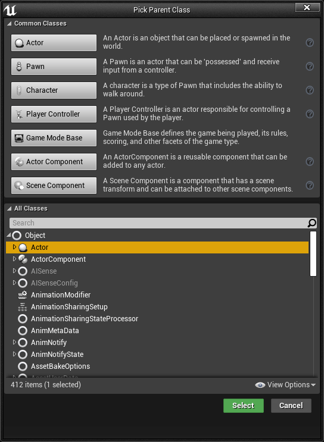
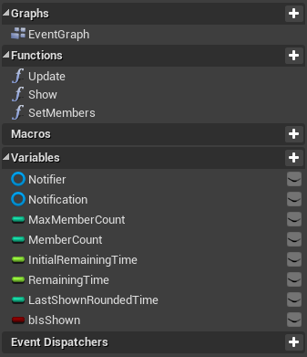
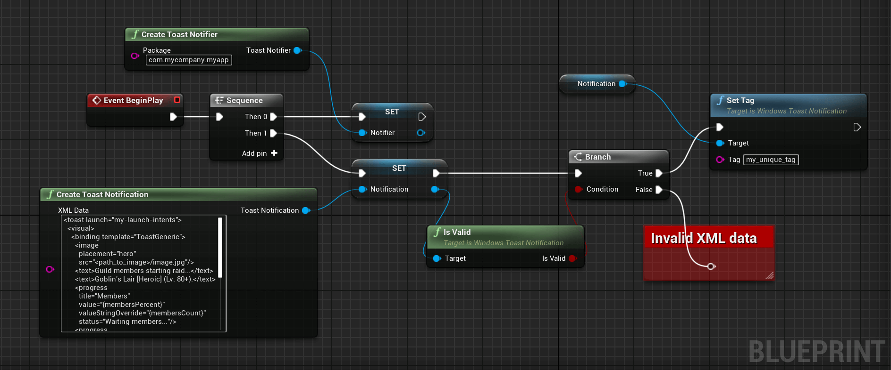
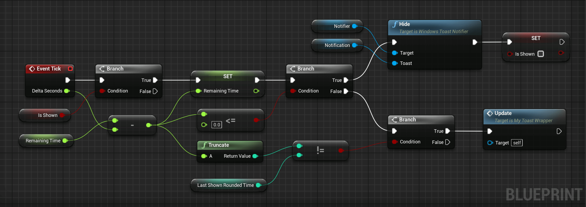
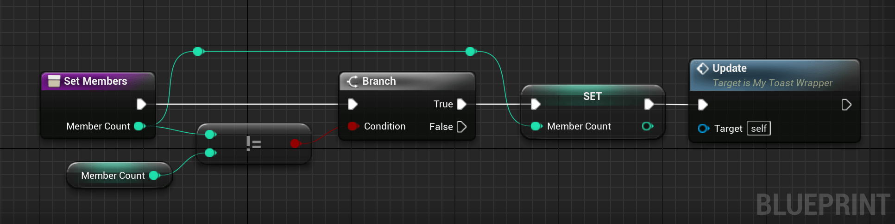
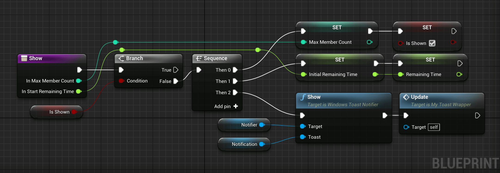
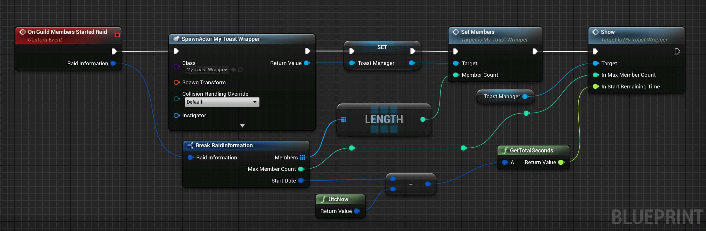
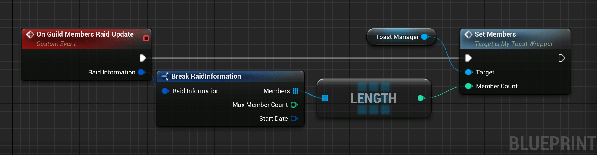

# Advanced Toast
This section shows how to create an advanced Toast on Windows.

## What we want to do
This example shows how to create the following Toast on Windows and update its values directly from your game:  

<div style="text-align:center">

</div>

This Toast, once delivered, will update its state periodically with data from our game.

## Getting the Toast XML data
The XML data used to generate the skeleton of the Toast is the following:
```xml
<toast launch="my-launch-intents">
  <visual>
    <binding template="ToastGeneric">
      <image 
		placement="hero" 
		src="<path_to_image>/image.jpg"/>  
      <text>Guild members starting raid...</text>
      <text>Goblin's Lair [Heroic] (Lv. 80+).</text>
      <progress
        title="Members"
        value="{membersPercent}"
        valueStringOverride="{membersCount}"
        status="Waiting members..."/>
      <progress
        title="Auto Start"
        value="{timePercent}"
        valueStringOverride="{timeCount}"
        status="Raid starting in..."/>
    </binding>
  </visual>
  <actions>
    <action
      activationType="background"
      arguments="action=join"
      content="Join Them"/>
    <action
      activationType="background"
      arguments="action=ignore"
      content="Ignore"/>
  </actions>
</toast>
```

> Don't forget the [reference page](https://docs.microsoft.com/en-us/windows/apps/design/shell/tiles-and-notifications/adaptive-interactive-toasts?tabs=xml) 
for the XML used by Windows Toasts.

## Creating the Toast Manager

To easily manage the Toast, we start by creating a wrapper class that will take care to provide an abstraction level to our Toast.
Our Toast Manager will have two public methods:
- `SetMembers()` that will set the current member count.
- `Show()` that will show the Toast notification.

<div class="code-switcher show-cpp-true">
<div class="switcher" >
<span class="sw-bp" onclick="switchBp()">Blueprints</span><span class="sw-cpp" onclick="switchCpp()">C++</span>
</div>
<div class="cpp">

#### MyToastManager.h
```cpp
// Your copyright notice

#pragma once

#include "CoreMinimal.h"
#include "Tickable.h"
#include "MyToastManager.generated.h"

/* Forward declaration of the classes we will use in this example. */
class UWindowsToastNotifier;
class UWindowsToastNotification;

/**
 * Our Toast manager used to display an advanced Toast notification.
 * We inherit from FTickableGameObject to have a Tick() method to do the countdown.
*/
UCLASS(BlueprintType)
class MYGAME_API UMyToastManager : public UObject, public FTickableGameObject
{
	GENERATED_BODY()
public:

	/**
	 * Our manager's constructor.
	*/
	UMyToastManager();

	/**
	 * Sets the member count.
	*/
	void SetMembers(const int32 InMemberCount);
	
	/**
	 * Shows the Toast notification.
	*/
	void Show(const int32 MaxMemberCount, const float StartRemainingTime);
	
public:
	// Begin FTickableObjectBase interface.
	virtual void Tick(float DeltaTime) override;
	virtual TStatId GetStatId() const override;
	// End FTickableObjectBase interface.
	
private:
	/**
	 * Updates the Toast shown in the notification center with updated data.
	*/
	void Update();
	
private:
	/**
	 * The Toast notifier used to update the notification.
	*/
	UPROPERTY()
	UWindowsToastNotifier* Notifier;
	
	/**
	 * The actual notification.
	*/
	UPROPERTY()
	UWindowsToastNotification* Notification;
	
	/* The maximum member count in the group. */
	int32 MaxMemberCount;
	
	/* The number of members currently in the group.  */
	int32 MemberCount;
	
	/* The initial remaining time used to show a progress bar. */
	float InitialRemainingTime;
	
	/* The remaining time before the raid starts. */
	float RemainingTime;
	
	/* The last rounded time to the second we have updated. */
	int32 LastShownRoundedTime;
	
	/* True when the toast is currently showing in the Control Center. */
	bool bIsShown;
}
```

#### MyToastManager.cpp
```cpp
// Your copyright notice

#include "MyToastManager.h"

// Includes the previously forward declared classes.
#include "Notifications/Windows/ToastNotifier.h"
#include "Notifications/Windows/ToastNotification.h"

// The Windows package name of your application.
// It would be better to have it as a global variable or from a
// config file.
// We just keep it here for simplicity of the example.
static const TCHAR* const PACKAGE_NAME = TEXT("com.myapp.mygame");

// A unique ID used to update the Toast.
static const TCHAR* const TOAST_ID_TAG = TEXT("my_toast_unique_id");

// The XML data used to show our Toast.
static const TCHAR* const TOAST_XML_DATA = 
	LR"(\
		<toast launch="my-launch-intents">\
			<visual>\
				<binding template="ToastGeneric">\
				<image\
					placement="hero"\
					src="<path_to_image>/image.jpg"/>\
				<text>Guild members starting raid...</text>\
				<text>Goblin's Lair [Heroic] (Lv. 80+).</text>\
				<progress\
					title="Members"\
					value="{membersPercent}"\
					valueStringOverride="{membersCount}"\
					status="Waiting members..."/>\
				<progress\
					title="Auto Start"\
					value="{timePercent}"\
					valueStringOverride="{timeCount}"\
					status="Raid starting in..."/>\
				</binding>\
			</visual>\
			<actions>\
				<action\
				activationType="background"\
				arguments="action=join"\
				content="Join Them"/>\
				<action\
				activationType="background"\
				arguments="action=ignore"\
				content="Ignore"/>\
			</actions>\
		</toast>\
	)";

// We will add methods' definitions here in the next steps.

```

</div>
<div class="bp">

Start by creating a new Blueprint class inheriting the `Actor` class.

<div class="centered">
	
</div>

Add to it 3 methods
- `Update`: A private method updating the Toast shown in the notification center with updated data.
- `Show`: A public method showing the Toast notification.
- `SetMembers`: A public method setting the member count.

And 8 variables
- `Notifier`: The Toast notifier used to update the notification.
- `Notification`: The actual notification.
- `MaxMemberCount`: The maximum member count in the group.
- `MemberCount`: The number of members currently in the group.
- `InitialRemainingTime`: The initial remaining time used to show a progress bar.
- `RemainingTime`: The remaining time before the raid starts.
- `LastShownRoundedTime`: The last rounded time to the second we have updated.
- `bIsShown`: True when the toast is currently showing in the Control Center.

<div class="centered">
	
</div>

</div>
</div>

## Creating the Notification and the Notifier

To manage the Toast, we need a Toast Notifier that will take care of showing and hiding the Toast and a Toast notification 
representing the actual Toast.

<div class="code-switcher show-cpp-true">
<div class="switcher" >
<span class="sw-bp" onclick="switchBp()">Blueprints</span><span class="sw-cpp" onclick="switchCpp()">C++</span>
</div>
<div class="cpp">

#### MyToastManager.cpp
```cpp
UMyToastManager::UMyToastManager()
	: Super()
	, MaxMemberCount(0)
	, MemberCount(0)
	, InitialRemainingTime(0.f)
	, RemainingTime(0.f)
	, bIsShown(false)
	, LastShownRoundedTime(0)
{
	// No need to create the notification if this is the default object
	// created by Unreal Engine.
	if (HasAnyFlags(EObjectFlags::RF_ClassDefaultObject))
	{
		return;
	}
	
	// Creates the notifier.
	Notifier = UWindowsToastNotifier::CreateToastNotifier(PACKAGE_NAME);
	
	// And creates the Toast notification.
	Notification = UWindowsToastNotification::CreateToastNotification(TOAST_XML_DATA);
	
	// Checks if the notification is valid.
	if (!Notification->IsValid())
	{
		// There is an error in our XML.
		return;
	}
	
	// We define the Toast's ID to be able to update it once shown.
	Notification->SetTag(TOAST_ID_TAG);	
}
```

</div>
<div class="bp">

We do the following steps:
1. We start by creating the Notifier that will help us to show and hide the Toast notification.
2. We create the Toast notification with the XML data provided above. 
3. We check that the Toast notification has been created successfully and is valid.
4. We set a unique tag to the Toast notification to be able to update it once it is in the notification center.

<div class="bpcode">
<textarea readonly>
Begin Object Class=/Script/BlueprintGraph.K2Node_Event Name="K2Node_Event_3"
   EventReference=(MemberParent=Class'"/Script/Engine.Actor"',MemberName="ReceiveBeginPlay")
   bOverrideFunction=True
   NodePosX=-800
   NodePosY=-208
   NodeGuid=1B9A05C24FFF249F9C1E4CBD79B6D94D
   CustomProperties Pin (PinId=B2C255A949D2DD99402B95B668DDBC03,PinName="OutputDelegate",Direction="EGPD_Output",PinType.PinCategory="delegate",PinType.PinSubCategory="",PinType.PinSubCategoryObject=None,PinType.PinSubCategoryMemberReference=(MemberParent=Class'"/Script/Engine.Actor"',MemberName="ReceiveBeginPlay"),PinType.PinValueType=(),PinType.ContainerType=None,PinType.bIsReference=False,PinType.bIsConst=False,PinType.bIsWeakPointer=False,PinType.bIsUObjectWrapper=True,PersistentGuid=00000000000000000000000000000000,bHidden=False,bNotConnectable=False,bDefaultValueIsReadOnly=False,bDefaultValueIsIgnored=False,bAdvancedView=False,bOrphanedPin=False,)
   CustomProperties Pin (PinId=C86A3F4B444824E779E616A2432E0EB6,PinName="then",Direction="EGPD_Output",PinType.PinCategory="exec",PinType.PinSubCategory="",PinType.PinSubCategoryObject=None,PinType.PinSubCategoryMemberReference=(),PinType.PinValueType=(),PinType.ContainerType=None,PinType.bIsReference=False,PinType.bIsConst=False,PinType.bIsWeakPointer=False,PinType.bIsUObjectWrapper=True,LinkedTo=(K2Node_ExecutionSequence_0 548C984348E028D860179F8815B99B7F,),PersistentGuid=00000000000000000000000000000000,bHidden=False,bNotConnectable=False,bDefaultValueIsReadOnly=False,bDefaultValueIsIgnored=False,bAdvancedView=False,bOrphanedPin=False,)
End Object
Begin Object Class=/Script/BlueprintGraph.K2Node_VariableSet Name="K2Node_VariableSet_0"
   VariableReference=(MemberName="Notification",MemberGuid=16ABDFD14883AEA2D87286B3A879B260,bSelfContext=True)
   NodePosX=-352
   NodePosY=-96
   NodeGuid=5764093F42259B353915A7B5B019B4BD
   CustomProperties Pin (PinId=8D7F43A04C3E24FC2595ADA435D2F19C,PinName="execute",PinType.PinCategory="exec",PinType.PinSubCategory="",PinType.PinSubCategoryObject=None,PinType.PinSubCategoryMemberReference=(),PinType.PinValueType=(),PinType.ContainerType=None,PinType.bIsReference=False,PinType.bIsConst=False,PinType.bIsWeakPointer=False,PinType.bIsUObjectWrapper=True,LinkedTo=(K2Node_ExecutionSequence_0 306EF6444E87B5EDCDF407A8EE7636F7,),PersistentGuid=00000000000000000000000000000000,bHidden=False,bNotConnectable=False,bDefaultValueIsReadOnly=False,bDefaultValueIsIgnored=False,bAdvancedView=False,bOrphanedPin=False,)
   CustomProperties Pin (PinId=48884E004CF3E735D8E46D9C7B3B5832,PinName="then",Direction="EGPD_Output",PinType.PinCategory="exec",PinType.PinSubCategory="",PinType.PinSubCategoryObject=None,PinType.PinSubCategoryMemberReference=(),PinType.PinValueType=(),PinType.ContainerType=None,PinType.bIsReference=False,PinType.bIsConst=False,PinType.bIsWeakPointer=False,PinType.bIsUObjectWrapper=True,LinkedTo=(K2Node_IfThenElse_0 C985152E4643F1112460E7B2AA7487C8,),PersistentGuid=00000000000000000000000000000000,bHidden=False,bNotConnectable=False,bDefaultValueIsReadOnly=False,bDefaultValueIsIgnored=False,bAdvancedView=False,bOrphanedPin=False,)
   CustomProperties Pin (PinId=E76AADB145BE3D811CCC7E8350E0D068,PinName="Notification",PinType.PinCategory="object",PinType.PinSubCategory="",PinType.PinSubCategoryObject=Class'"/Script/NotificationsPro.WindowsToastNotification"',PinType.PinSubCategoryMemberReference=(),PinType.PinValueType=(),PinType.ContainerType=None,PinType.bIsReference=False,PinType.bIsConst=False,PinType.bIsWeakPointer=False,PinType.bIsUObjectWrapper=False,LinkedTo=(K2Node_CallFunction_0 1D94CC834BB2D573AC7DD7AEE101813A,),PersistentGuid=00000000000000000000000000000000,bHidden=False,bNotConnectable=False,bDefaultValueIsReadOnly=False,bDefaultValueIsIgnored=False,bAdvancedView=False,bOrphanedPin=False,)
   CustomProperties Pin (PinId=01B1BBBF4DC73F8D748343A23F13F89C,PinName="self",PinFriendlyName=NSLOCTEXT("K2Node", "Target", "Target"),PinType.PinCategory="object",PinType.PinSubCategory="",PinType.PinSubCategoryObject=BlueprintGeneratedClass'"/Game/MyToastWrapper.MyToastWrapper_C"',PinType.PinSubCategoryMemberReference=(),PinType.PinValueType=(),PinType.ContainerType=None,PinType.bIsReference=False,PinType.bIsConst=False,PinType.bIsWeakPointer=False,PinType.bIsUObjectWrapper=False,PersistentGuid=00000000000000000000000000000000,bHidden=True,bNotConnectable=False,bDefaultValueIsReadOnly=False,bDefaultValueIsIgnored=False,bAdvancedView=False,bOrphanedPin=False,)
   CustomProperties Pin (PinId=2534661B4E8672C2D30AC285F8C1CAAB,PinName="Output_Get",PinToolTip="Retrieves the value of the variable, can use instead of a separate Get node",Direction="EGPD_Output",PinType.PinCategory="object",PinType.PinSubCategory="",PinType.PinSubCategoryObject=Class'"/Script/NotificationsPro.WindowsToastNotification"',PinType.PinSubCategoryMemberReference=(),PinType.PinValueType=(),PinType.ContainerType=None,PinType.bIsReference=False,PinType.bIsConst=False,PinType.bIsWeakPointer=False,PinType.bIsUObjectWrapper=False,LinkedTo=(K2Node_CallFunction_2 59FD125F4A79A7F27EC199A3268DDDE1,),PersistentGuid=00000000000000000000000000000000,bHidden=False,bNotConnectable=False,bDefaultValueIsReadOnly=False,bDefaultValueIsIgnored=False,bAdvancedView=False,bOrphanedPin=False,)
End Object
Begin Object Class=/Script/BlueprintGraph.K2Node_CallFunction Name="K2Node_CallFunction_0"
   bIsPureFunc=True
   FunctionReference=(MemberParent=Class'"/Script/NotificationsPro.WindowsToastNotification"',MemberName="CreateToastNotification")
   NodePosX=-880
   NodePosY=-48
   NodeGuid=79B1C41343B114BA7990C5A7DD5F27C2
   CustomProperties Pin (PinId=559505764B56721A464CA6A154FD8ED5,PinName="self",PinFriendlyName=NSLOCTEXT("K2Node", "Target", "Target"),PinToolTip="Target\nWindows Toast Notification Object Reference",PinType.PinCategory="object",PinType.PinSubCategory="",PinType.PinSubCategoryObject=Class'"/Script/NotificationsPro.WindowsToastNotification"',PinType.PinSubCategoryMemberReference=(),PinType.PinValueType=(),PinType.ContainerType=None,PinType.bIsReference=False,PinType.bIsConst=False,PinType.bIsWeakPointer=False,PinType.bIsUObjectWrapper=False,DefaultObject="/Script/NotificationsPro.Default__WindowsToastNotification",PersistentGuid=00000000000000000000000000000000,bHidden=True,bNotConnectable=False,bDefaultValueIsReadOnly=False,bDefaultValueIsIgnored=False,bAdvancedView=False,bOrphanedPin=False,)
   CustomProperties Pin (PinId=5709DA7843F9FBEA95571CBF79D5FC76,PinName="XmlData",PinFriendlyName=NSLOCTEXT("", "17E2633B4E4560824D3B73AD6DD018AF", "XML Data"),PinToolTip="XML Data\nString\n\nThe XML data used to build this toast notification.",PinType.PinCategory="string",PinType.PinSubCategory="",PinType.PinSubCategoryObject=None,PinType.PinSubCategoryMemberReference=(),PinType.PinValueType=(),PinType.ContainerType=None,PinType.bIsReference=False,PinType.bIsConst=False,PinType.bIsWeakPointer=False,PinType.bIsUObjectWrapper=False,DefaultValue="<toast launch=\"my-launch-intents\">\r\n  <visual>\r\n    <binding template=\"ToastGeneric\">\r\n      <image \r\n        placement=\"hero\" \r\n        src=\"<path_to_image>/image.jpg\"/>  \r\n      <text>Guild members starting raid...</text>\r\n      <text>Goblin\'s Lair [Heroic] (Lv. 80+).</text>\r\n      <progress\r\n        title=\"Members\"\r\n        value=\"{membersPercent}\"\r\n        valueStringOverride=\"{membersCount}\"\r\n        status=\"Waiting members...\"/>\r\n      <progress\r\n        title=\"Auto Start\"\r\n        value=\"{timePercent}\"\r\n        valueStringOverride=\"{timeCount}\"\r\n        status=\"Raid starting in...\"/>\r\n    </binding>\r\n  </visual>\r\n  <actions>\r\n    <action\r\n      activationType=\"background\"\r\n      arguments=\"action=join\"\r\n      content=\"Join Them\"/>\r\n    <action\r\n      activationType=\"background\"\r\n      arguments=\"action=ignore\"\r\n      content=\"Ignore\"/>\r\n  </actions>\r\n</toast>",PersistentGuid=00000000000000000000000000000000,bHidden=False,bNotConnectable=False,bDefaultValueIsReadOnly=False,bDefaultValueIsIgnored=False,bAdvancedView=False,bOrphanedPin=False,)
   CustomProperties Pin (PinId=1D94CC834BB2D573AC7DD7AEE101813A,PinName="ReturnValue",PinFriendlyName=NSLOCTEXT("", "53C35B9B487AD7A7A5DA2597224A040A", "Toast Notification"),PinToolTip="Toast Notification\nWindows Toast Notification Object Reference\n\nA new toast notification.",Direction="EGPD_Output",PinType.PinCategory="object",PinType.PinSubCategory="",PinType.PinSubCategoryObject=Class'"/Script/NotificationsPro.WindowsToastNotification"',PinType.PinSubCategoryMemberReference=(),PinType.PinValueType=(),PinType.ContainerType=None,PinType.bIsReference=False,PinType.bIsConst=False,PinType.bIsWeakPointer=False,PinType.bIsUObjectWrapper=False,LinkedTo=(K2Node_VariableSet_0 E76AADB145BE3D811CCC7E8350E0D068,),PersistentGuid=00000000000000000000000000000000,bHidden=False,bNotConnectable=False,bDefaultValueIsReadOnly=False,bDefaultValueIsIgnored=False,bAdvancedView=False,bOrphanedPin=False,)
End Object
Begin Object Class=/Script/BlueprintGraph.K2Node_CallFunction Name="K2Node_CallFunction_2"
   bIsPureFunc=True
   bIsConstFunc=True
   FunctionReference=(MemberParent=Class'"/Script/NotificationsPro.WindowsToastNotification"',MemberName="IsValid")
   NodePosX=-224
   NodePosY=16
   NodeGuid=7B8C17A44A5CE7D39559A881739A97AA
   CustomProperties Pin (PinId=59FD125F4A79A7F27EC199A3268DDDE1,PinName="self",PinFriendlyName=NSLOCTEXT("K2Node", "Target", "Target"),PinToolTip="Target\nWindows Toast Notification Object Reference",PinType.PinCategory="object",PinType.PinSubCategory="",PinType.PinSubCategoryObject=Class'"/Script/NotificationsPro.WindowsToastNotification"',PinType.PinSubCategoryMemberReference=(),PinType.PinValueType=(),PinType.ContainerType=None,PinType.bIsReference=False,PinType.bIsConst=False,PinType.bIsWeakPointer=False,PinType.bIsUObjectWrapper=False,LinkedTo=(K2Node_VariableSet_0 2534661B4E8672C2D30AC285F8C1CAAB,),PersistentGuid=00000000000000000000000000000000,bHidden=False,bNotConnectable=False,bDefaultValueIsReadOnly=False,bDefaultValueIsIgnored=False,bAdvancedView=False,bOrphanedPin=False,)
   CustomProperties Pin (PinId=4317DD6B4B024858CCF63CA3EFE8254C,PinName="ReturnValue",PinFriendlyName=NSLOCTEXT("", "B714B0944C8F33D8F06575A5B16DAEAD", "Is Valid"),PinToolTip="Is Valid\nBoolean\n\nChecks if this notification is a valid notification.",Direction="EGPD_Output",PinType.PinCategory="bool",PinType.PinSubCategory="",PinType.PinSubCategoryObject=None,PinType.PinSubCategoryMemberReference=(),PinType.PinValueType=(),PinType.ContainerType=None,PinType.bIsReference=False,PinType.bIsConst=False,PinType.bIsWeakPointer=False,PinType.bIsUObjectWrapper=False,DefaultValue="false",AutogeneratedDefaultValue="false",LinkedTo=(K2Node_IfThenElse_0 3BD308BC43111F9244AE928951EFAA4E,),PersistentGuid=00000000000000000000000000000000,bHidden=False,bNotConnectable=False,bDefaultValueIsReadOnly=False,bDefaultValueIsIgnored=False,bAdvancedView=False,bOrphanedPin=False,)
End Object
Begin Object Class=/Script/BlueprintGraph.K2Node_IfThenElse Name="K2Node_IfThenElse_0"
   NodePosX=16
   NodePosY=-112
   NodeGuid=B363C194462BB3024E51C4869E4EC961
   CustomProperties Pin (PinId=C985152E4643F1112460E7B2AA7487C8,PinName="execute",PinType.PinCategory="exec",PinType.PinSubCategory="",PinType.PinSubCategoryObject=None,PinType.PinSubCategoryMemberReference=(),PinType.PinValueType=(),PinType.ContainerType=None,PinType.bIsReference=False,PinType.bIsConst=False,PinType.bIsWeakPointer=False,PinType.bIsUObjectWrapper=False,LinkedTo=(K2Node_VariableSet_0 48884E004CF3E735D8E46D9C7B3B5832,),PersistentGuid=00000000000000000000000000000000,bHidden=False,bNotConnectable=False,bDefaultValueIsReadOnly=False,bDefaultValueIsIgnored=False,bAdvancedView=False,bOrphanedPin=False,)
   CustomProperties Pin (PinId=3BD308BC43111F9244AE928951EFAA4E,PinName="Condition",PinType.PinCategory="bool",PinType.PinSubCategory="",PinType.PinSubCategoryObject=None,PinType.PinSubCategoryMemberReference=(),PinType.PinValueType=(),PinType.ContainerType=None,PinType.bIsReference=False,PinType.bIsConst=False,PinType.bIsWeakPointer=False,PinType.bIsUObjectWrapper=False,DefaultValue="true",AutogeneratedDefaultValue="true",LinkedTo=(K2Node_CallFunction_2 4317DD6B4B024858CCF63CA3EFE8254C,),PersistentGuid=00000000000000000000000000000000,bHidden=False,bNotConnectable=False,bDefaultValueIsReadOnly=False,bDefaultValueIsIgnored=False,bAdvancedView=False,bOrphanedPin=False,)
   CustomProperties Pin (PinId=3EFB92C348FCC1DA9BA5C5A66C9D9604,PinName="then",PinFriendlyName=NSLOCTEXT("K2Node", "true", "true"),Direction="EGPD_Output",PinType.PinCategory="exec",PinType.PinSubCategory="",PinType.PinSubCategoryObject=None,PinType.PinSubCategoryMemberReference=(),PinType.PinValueType=(),PinType.ContainerType=None,PinType.bIsReference=False,PinType.bIsConst=False,PinType.bIsWeakPointer=False,PinType.bIsUObjectWrapper=False,LinkedTo=(K2Node_CallFunction_4 779E3B6E42232F822AA857B85B8949B6,),PersistentGuid=00000000000000000000000000000000,bHidden=False,bNotConnectable=False,bDefaultValueIsReadOnly=False,bDefaultValueIsIgnored=False,bAdvancedView=False,bOrphanedPin=False,)
   CustomProperties Pin (PinId=6979D07D4A6473B7C65C0FA7A85F228B,PinName="else",PinFriendlyName=NSLOCTEXT("K2Node", "false", "false"),Direction="EGPD_Output",PinType.PinCategory="exec",PinType.PinSubCategory="",PinType.PinSubCategoryObject=None,PinType.PinSubCategoryMemberReference=(),PinType.PinValueType=(),PinType.ContainerType=None,PinType.bIsReference=False,PinType.bIsConst=False,PinType.bIsWeakPointer=False,PinType.bIsUObjectWrapper=False,LinkedTo=(K2Node_Knot_0 AE147FD34BCB2FD95E702081F39D4208,),PersistentGuid=00000000000000000000000000000000,bHidden=False,bNotConnectable=False,bDefaultValueIsReadOnly=False,bDefaultValueIsIgnored=False,bAdvancedView=False,bOrphanedPin=False,)
End Object
Begin Object Class=/Script/BlueprintGraph.K2Node_ExecutionSequence Name="K2Node_ExecutionSequence_0"
   NodePosX=-592
   NodePosY=-208
   NodeGuid=38D4B3C84F197968E50D99AC07D4D96D
   CustomProperties Pin (PinId=548C984348E028D860179F8815B99B7F,PinName="execute",PinType.PinCategory="exec",PinType.PinSubCategory="",PinType.PinSubCategoryObject=None,PinType.PinSubCategoryMemberReference=(),PinType.PinValueType=(),PinType.ContainerType=None,PinType.bIsReference=False,PinType.bIsConst=False,PinType.bIsWeakPointer=False,PinType.bIsUObjectWrapper=False,LinkedTo=(K2Node_Event_3 C86A3F4B444824E779E616A2432E0EB6,),PersistentGuid=00000000000000000000000000000000,bHidden=False,bNotConnectable=False,bDefaultValueIsReadOnly=False,bDefaultValueIsIgnored=False,bAdvancedView=False,bOrphanedPin=False,)
   CustomProperties Pin (PinId=73341EB5410C5A14A84A25A4CC60E625,PinName="then_0",Direction="EGPD_Output",PinType.PinCategory="exec",PinType.PinSubCategory="",PinType.PinSubCategoryObject=None,PinType.PinSubCategoryMemberReference=(),PinType.PinValueType=(),PinType.ContainerType=None,PinType.bIsReference=False,PinType.bIsConst=False,PinType.bIsWeakPointer=False,PinType.bIsUObjectWrapper=True,LinkedTo=(K2Node_VariableSet_1 F44BA20C4A4A82771F65C4956E02E20A,),PersistentGuid=00000000000000000000000000000000,bHidden=False,bNotConnectable=False,bDefaultValueIsReadOnly=False,bDefaultValueIsIgnored=False,bAdvancedView=False,bOrphanedPin=False,)
   CustomProperties Pin (PinId=306EF6444E87B5EDCDF407A8EE7636F7,PinName="then_1",Direction="EGPD_Output",PinType.PinCategory="exec",PinType.PinSubCategory="",PinType.PinSubCategoryObject=None,PinType.PinSubCategoryMemberReference=(),PinType.PinValueType=(),PinType.ContainerType=None,PinType.bIsReference=False,PinType.bIsConst=False,PinType.bIsWeakPointer=False,PinType.bIsUObjectWrapper=True,LinkedTo=(K2Node_VariableSet_0 8D7F43A04C3E24FC2595ADA435D2F19C,),PersistentGuid=00000000000000000000000000000000,bHidden=False,bNotConnectable=False,bDefaultValueIsReadOnly=False,bDefaultValueIsIgnored=False,bAdvancedView=False,bOrphanedPin=False,)
End Object
Begin Object Class=/Script/BlueprintGraph.K2Node_VariableSet Name="K2Node_VariableSet_1"
   VariableReference=(MemberName="Notifier",MemberGuid=2F828AE543C2373C2DDCAA8D1AF9FF13,bSelfContext=True)
   NodePosX=-352
   NodePosY=-192
   NodeGuid=1EDD1C734F95BE3D0B36CF9A99B51FEE
   CustomProperties Pin (PinId=F44BA20C4A4A82771F65C4956E02E20A,PinName="execute",PinType.PinCategory="exec",PinType.PinSubCategory="",PinType.PinSubCategoryObject=None,PinType.PinSubCategoryMemberReference=(),PinType.PinValueType=(),PinType.ContainerType=None,PinType.bIsReference=False,PinType.bIsConst=False,PinType.bIsWeakPointer=False,PinType.bIsUObjectWrapper=False,LinkedTo=(K2Node_ExecutionSequence_0 73341EB5410C5A14A84A25A4CC60E625,),PersistentGuid=00000000000000000000000000000000,bHidden=False,bNotConnectable=False,bDefaultValueIsReadOnly=False,bDefaultValueIsIgnored=False,bAdvancedView=False,bOrphanedPin=False,)
   CustomProperties Pin (PinId=BE2D229C49ECCB255690A3A632F18293,PinName="then",Direction="EGPD_Output",PinType.PinCategory="exec",PinType.PinSubCategory="",PinType.PinSubCategoryObject=None,PinType.PinSubCategoryMemberReference=(),PinType.PinValueType=(),PinType.ContainerType=None,PinType.bIsReference=False,PinType.bIsConst=False,PinType.bIsWeakPointer=False,PinType.bIsUObjectWrapper=False,PersistentGuid=00000000000000000000000000000000,bHidden=False,bNotConnectable=False,bDefaultValueIsReadOnly=False,bDefaultValueIsIgnored=False,bAdvancedView=False,bOrphanedPin=False,)
   CustomProperties Pin (PinId=C8CA01A243F1495D03AA44BF19F4625B,PinName="Notifier",PinType.PinCategory="object",PinType.PinSubCategory="",PinType.PinSubCategoryObject=Class'"/Script/NotificationsPro.WindowsToastNotifier"',PinType.PinSubCategoryMemberReference=(),PinType.PinValueType=(),PinType.ContainerType=None,PinType.bIsReference=False,PinType.bIsConst=False,PinType.bIsWeakPointer=False,PinType.bIsUObjectWrapper=False,LinkedTo=(K2Node_CallFunction_3 28321F4147AA5F837B9244A8CB3227BE,),PersistentGuid=00000000000000000000000000000000,bHidden=False,bNotConnectable=False,bDefaultValueIsReadOnly=False,bDefaultValueIsIgnored=False,bAdvancedView=False,bOrphanedPin=False,)
   CustomProperties Pin (PinId=E03B8D6A4EA818C0E488CDA4A1846750,PinName="self",PinFriendlyName=NSLOCTEXT("K2Node", "Target", "Target"),PinType.PinCategory="object",PinType.PinSubCategory="",PinType.PinSubCategoryObject=BlueprintGeneratedClass'"/Game/MyToastWrapper.MyToastWrapper_C"',PinType.PinSubCategoryMemberReference=(),PinType.PinValueType=(),PinType.ContainerType=None,PinType.bIsReference=False,PinType.bIsConst=False,PinType.bIsWeakPointer=False,PinType.bIsUObjectWrapper=False,PersistentGuid=00000000000000000000000000000000,bHidden=True,bNotConnectable=False,bDefaultValueIsReadOnly=False,bDefaultValueIsIgnored=False,bAdvancedView=False,bOrphanedPin=False,)
   CustomProperties Pin (PinId=45F8C1834CA8FDE47C0ECE8FA5073FC4,PinName="Output_Get",PinToolTip="Retrieves the value of the variable, can use instead of a separate Get node",Direction="EGPD_Output",PinType.PinCategory="object",PinType.PinSubCategory="",PinType.PinSubCategoryObject=Class'"/Script/NotificationsPro.WindowsToastNotifier"',PinType.PinSubCategoryMemberReference=(),PinType.PinValueType=(),PinType.ContainerType=None,PinType.bIsReference=False,PinType.bIsConst=False,PinType.bIsWeakPointer=False,PinType.bIsUObjectWrapper=False,PersistentGuid=00000000000000000000000000000000,bHidden=False,bNotConnectable=False,bDefaultValueIsReadOnly=False,bDefaultValueIsIgnored=False,bAdvancedView=False,bOrphanedPin=False,)
End Object
Begin Object Class=/Script/BlueprintGraph.K2Node_CallFunction Name="K2Node_CallFunction_3"
   bIsPureFunc=True
   FunctionReference=(MemberParent=Class'"/Script/NotificationsPro.WindowsToastNotifier"',MemberName="CreateToastNotifier")
   NodePosX=-736
   NodePosY=-320
   NodeGuid=7CBE950B4ED71A17D5DE3D9AE4AE5493
   CustomProperties Pin (PinId=7638E01747E9AA1E83D14C975803292B,PinName="self",PinFriendlyName=NSLOCTEXT("K2Node", "Target", "Target"),PinToolTip="Target\nWindows Toast Notifier Object Reference",PinType.PinCategory="object",PinType.PinSubCategory="",PinType.PinSubCategoryObject=Class'"/Script/NotificationsPro.WindowsToastNotifier"',PinType.PinSubCategoryMemberReference=(),PinType.PinValueType=(),PinType.ContainerType=None,PinType.bIsReference=False,PinType.bIsConst=False,PinType.bIsWeakPointer=False,PinType.bIsUObjectWrapper=False,DefaultObject="/Script/NotificationsPro.Default__WindowsToastNotifier",PersistentGuid=00000000000000000000000000000000,bHidden=True,bNotConnectable=False,bDefaultValueIsReadOnly=False,bDefaultValueIsIgnored=False,bAdvancedView=False,bOrphanedPin=False,)
   CustomProperties Pin (PinId=733978434580753C9D3329BC6C9A40D5,PinName="Package",PinToolTip="Package\nString\n\nThe package for this toast notifier.",PinType.PinCategory="string",PinType.PinSubCategory="",PinType.PinSubCategoryObject=None,PinType.PinSubCategoryMemberReference=(),PinType.PinValueType=(),PinType.ContainerType=None,PinType.bIsReference=False,PinType.bIsConst=False,PinType.bIsWeakPointer=False,PinType.bIsUObjectWrapper=False,DefaultValue="com.mycompany.myapp",PersistentGuid=00000000000000000000000000000000,bHidden=False,bNotConnectable=False,bDefaultValueIsReadOnly=False,bDefaultValueIsIgnored=False,bAdvancedView=False,bOrphanedPin=False,)
   CustomProperties Pin (PinId=28321F4147AA5F837B9244A8CB3227BE,PinName="ReturnValue",PinFriendlyName=NSLOCTEXT("", "B9AFEC6E40A0166A87A212BAC2752083", "Toast Notifier"),PinToolTip="Toast Notifier\nWindows Toast Notifier Object Reference\n\nA new toast notifier for the package.",Direction="EGPD_Output",PinType.PinCategory="object",PinType.PinSubCategory="",PinType.PinSubCategoryObject=Class'"/Script/NotificationsPro.WindowsToastNotifier"',PinType.PinSubCategoryMemberReference=(),PinType.PinValueType=(),PinType.ContainerType=None,PinType.bIsReference=False,PinType.bIsConst=False,PinType.bIsWeakPointer=False,PinType.bIsUObjectWrapper=False,LinkedTo=(K2Node_VariableSet_1 C8CA01A243F1495D03AA44BF19F4625B,),PersistentGuid=00000000000000000000000000000000,bHidden=False,bNotConnectable=False,bDefaultValueIsReadOnly=False,bDefaultValueIsIgnored=False,bAdvancedView=False,bOrphanedPin=False,)
End Object
Begin Object Class=/Script/BlueprintGraph.K2Node_Knot Name="K2Node_Knot_0"
   NodePosX=240
   NodePosY=80
   NodeGuid=1A1F79C04A8C8C07C5E0BB99511EF2DD
   CustomProperties Pin (PinId=AE147FD34BCB2FD95E702081F39D4208,PinName="InputPin",PinType.PinCategory="exec",PinType.PinSubCategory="",PinType.PinSubCategoryObject=None,PinType.PinSubCategoryMemberReference=(),PinType.PinValueType=(),PinType.ContainerType=None,PinType.bIsReference=False,PinType.bIsConst=False,PinType.bIsWeakPointer=False,PinType.bIsUObjectWrapper=False,LinkedTo=(K2Node_IfThenElse_0 6979D07D4A6473B7C65C0FA7A85F228B,),PersistentGuid=00000000000000000000000000000000,bHidden=False,bNotConnectable=False,bDefaultValueIsReadOnly=False,bDefaultValueIsIgnored=True,bAdvancedView=False,bOrphanedPin=False,)
   CustomProperties Pin (PinId=396F2EF54CA66A0525D84E8C734E797D,PinName="OutputPin",Direction="EGPD_Output",PinType.PinCategory="exec",PinType.PinSubCategory="",PinType.PinSubCategoryObject=None,PinType.PinSubCategoryMemberReference=(),PinType.PinValueType=(),PinType.ContainerType=None,PinType.bIsReference=False,PinType.bIsConst=False,PinType.bIsWeakPointer=False,PinType.bIsUObjectWrapper=False,PersistentGuid=00000000000000000000000000000000,bHidden=False,bNotConnectable=False,bDefaultValueIsReadOnly=False,bDefaultValueIsIgnored=False,bAdvancedView=False,bOrphanedPin=False,)
End Object
Begin Object Class=/Script/UnrealEd.EdGraphNode_Comment Name="EdGraphNode_Comment_0"
   CommentColor=(R=1.000000,G=0.000000,B=0.000000,A=1.000000)
   bCommentBubbleVisible_InDetailsPanel=False
   NodePosX=144
   NodePosY=16
   NodeWidth=224
   NodeHeight=96
   bCommentBubblePinned=False
   bCommentBubbleVisible=False
   NodeComment="Invalid XML data"
   NodeGuid=9865DA5A40AB440DE9F9DEA803D13597
End Object
Begin Object Class=/Script/BlueprintGraph.K2Node_VariableGet Name="K2Node_VariableGet_0"
   VariableReference=(MemberName="Notification",MemberGuid=16ABDFD14883AEA2D87286B3A879B260,bSelfContext=True)
   NodePosY=-240
   NodeGuid=2D9DD2E949DA8D31E6B388AE4F4D192F
   CustomProperties Pin (PinId=135015D9415D0D23436A348EBD6DE2B3,PinName="Notification",Direction="EGPD_Output",PinType.PinCategory="object",PinType.PinSubCategory="",PinType.PinSubCategoryObject=Class'"/Script/NotificationsPro.WindowsToastNotification"',PinType.PinSubCategoryMemberReference=(),PinType.PinValueType=(),PinType.ContainerType=None,PinType.bIsReference=False,PinType.bIsConst=False,PinType.bIsWeakPointer=False,PinType.bIsUObjectWrapper=False,LinkedTo=(K2Node_CallFunction_4 DD0EAE8B4206934366050CA27CC6EFF0,),PersistentGuid=00000000000000000000000000000000,bHidden=False,bNotConnectable=False,bDefaultValueIsReadOnly=False,bDefaultValueIsIgnored=False,bAdvancedView=False,bOrphanedPin=False,)
   CustomProperties Pin (PinId=7FC7B5894C40ED5597B50591960C6E20,PinName="self",PinFriendlyName=NSLOCTEXT("K2Node", "Target", "Target"),PinType.PinCategory="object",PinType.PinSubCategory="",PinType.PinSubCategoryObject=BlueprintGeneratedClass'"/Game/MyToastWrapper.MyToastWrapper_C"',PinType.PinSubCategoryMemberReference=(),PinType.PinValueType=(),PinType.ContainerType=None,PinType.bIsReference=False,PinType.bIsConst=False,PinType.bIsWeakPointer=False,PinType.bIsUObjectWrapper=False,PersistentGuid=00000000000000000000000000000000,bHidden=True,bNotConnectable=False,bDefaultValueIsReadOnly=False,bDefaultValueIsIgnored=False,bAdvancedView=False,bOrphanedPin=False,)
End Object
Begin Object Class=/Script/BlueprintGraph.K2Node_CallFunction Name="K2Node_CallFunction_4"
   FunctionReference=(MemberParent=Class'"/Script/NotificationsPro.WindowsToastNotification"',MemberName="SetTag")
   NodePosX=256
   NodePosY=-208
   NodeGuid=37B0A2E1442E047C330CAA944F4D68CC
   CustomProperties Pin (PinId=779E3B6E42232F822AA857B85B8949B6,PinName="execute",PinToolTip="\nExec",PinType.PinCategory="exec",PinType.PinSubCategory="",PinType.PinSubCategoryObject=None,PinType.PinSubCategoryMemberReference=(),PinType.PinValueType=(),PinType.ContainerType=None,PinType.bIsReference=False,PinType.bIsConst=False,PinType.bIsWeakPointer=False,PinType.bIsUObjectWrapper=False,LinkedTo=(K2Node_IfThenElse_0 3EFB92C348FCC1DA9BA5C5A66C9D9604,),PersistentGuid=00000000000000000000000000000000,bHidden=False,bNotConnectable=False,bDefaultValueIsReadOnly=False,bDefaultValueIsIgnored=False,bAdvancedView=False,bOrphanedPin=False,)
   CustomProperties Pin (PinId=8B90A5C74630B63C381DCD948797DC15,PinName="then",PinToolTip="\nExec",Direction="EGPD_Output",PinType.PinCategory="exec",PinType.PinSubCategory="",PinType.PinSubCategoryObject=None,PinType.PinSubCategoryMemberReference=(),PinType.PinValueType=(),PinType.ContainerType=None,PinType.bIsReference=False,PinType.bIsConst=False,PinType.bIsWeakPointer=False,PinType.bIsUObjectWrapper=False,PersistentGuid=00000000000000000000000000000000,bHidden=False,bNotConnectable=False,bDefaultValueIsReadOnly=False,bDefaultValueIsIgnored=False,bAdvancedView=False,bOrphanedPin=False,)
   CustomProperties Pin (PinId=DD0EAE8B4206934366050CA27CC6EFF0,PinName="self",PinFriendlyName=NSLOCTEXT("K2Node", "Target", "Target"),PinToolTip="Target\nWindows Toast Notification Object Reference",PinType.PinCategory="object",PinType.PinSubCategory="",PinType.PinSubCategoryObject=Class'"/Script/NotificationsPro.WindowsToastNotification"',PinType.PinSubCategoryMemberReference=(),PinType.PinValueType=(),PinType.ContainerType=None,PinType.bIsReference=False,PinType.bIsConst=False,PinType.bIsWeakPointer=False,PinType.bIsUObjectWrapper=False,LinkedTo=(K2Node_VariableGet_0 135015D9415D0D23436A348EBD6DE2B3,),PersistentGuid=00000000000000000000000000000000,bHidden=False,bNotConnectable=False,bDefaultValueIsReadOnly=False,bDefaultValueIsIgnored=False,bAdvancedView=False,bOrphanedPin=False,)
   CustomProperties Pin (PinId=4C4C6F314CBC9051E1EB21A2B8671D0B,PinName="Tag",PinToolTip="Tag\nString\n\nThe new tag of this notification.",PinType.PinCategory="string",PinType.PinSubCategory="",PinType.PinSubCategoryObject=None,PinType.PinSubCategoryMemberReference=(),PinType.PinValueType=(),PinType.ContainerType=None,PinType.bIsReference=False,PinType.bIsConst=False,PinType.bIsWeakPointer=False,PinType.bIsUObjectWrapper=False,DefaultValue="my_unique_tag",PersistentGuid=00000000000000000000000000000000,bHidden=False,bNotConnectable=False,bDefaultValueIsReadOnly=False,bDefaultValueIsIgnored=False,bAdvancedView=False,bOrphanedPin=False,)
End Object
</textarea>

<button onclick="copyBlueprintCode(this)">Copy Code</button>
</div>
</div>
</div>


## Managing the Countdown

To implement the countdown on the notification, we use the tick to manually decrease a float value.
This float value is then truncated and shown in the Toast.

<div class="code-switcher show-cpp-true">
<div class="switcher" >
<span class="sw-bp" onclick="switchBp()">Blueprints</span><span class="sw-cpp" onclick="switchCpp()">C++</span>
</div>
<div class="cpp">

#### MyToastManager.cpp
```cpp
void UMyToastManager::Tick(float DeltaTime) 
{
	// Countdown starts only once shown. We could disable ticking
	// while bIsShown is false as well.
	if (bIsShown)
	{
		RemainingTime -= DeltaTime;
		
		// The timer reached 0.
		if (RemainingTime <= 0.f)
		{
			// We hide the notification.
			Notifier->Hide(Notification);
			
			bIsShown = false;
			
			return;
		}
		
		// Instead of updating the Toast at 60 FPS, we only update it when
		// the rounded second has changed.
		// You can remove it to have a smoother progress for the progress bar.
		const int32 RoundedRemainingTime = static_cast<int32>(RemainingTime);
		if (RoundedRemainingTime != LastShownRoundedTime)
		{
			Update();
		}		
	}
}

TStatId UMyToastManager::GetStatId() const
{
	// Optionally implement a Stat ID. We are not interested in it here.
	return TStatId();
}
```

</div>
<div class="bp">

The following steps are implemented:
1. We check that the Toast is currently showing. As a design choice, we decided to start the countdown when the Toast notification is shown.
2. We update the remaining time for this tick.
3. If the countdown is over, we hide the Toast notification.
4. If it is not and the number of truncated seconds changed, we update the Toast with the new value. This last step is
added to prevent updating the Toast at 60 FPS when the data only changes once per second.

<div class="bpcode">
<textarea readonly>
Begin Object Class=/Script/BlueprintGraph.K2Node_Event Name="K2Node_Event_5"
   EventReference=(MemberParent=Class'"/Script/Engine.Actor"',MemberName="ReceiveTick")
   bOverrideFunction=True
   NodePosX=288
   NodePosY=800
   NodeGuid=523A9A24404CB08CE9F83A895EEC9661
   CustomProperties Pin (PinId=FB655AF34CC630A91D7B3BA3C8CF4DDB,PinName="OutputDelegate",Direction="EGPD_Output",PinType.PinCategory="delegate",PinType.PinSubCategory="",PinType.PinSubCategoryObject=None,PinType.PinSubCategoryMemberReference=(MemberParent=Class'"/Script/Engine.Actor"',MemberName="ReceiveTick"),PinType.PinValueType=(),PinType.ContainerType=None,PinType.bIsReference=False,PinType.bIsConst=False,PinType.bIsWeakPointer=False,PinType.bIsUObjectWrapper=True,PersistentGuid=00000000000000000000000000000000,bHidden=False,bNotConnectable=False,bDefaultValueIsReadOnly=False,bDefaultValueIsIgnored=False,bAdvancedView=False,bOrphanedPin=False,)
   CustomProperties Pin (PinId=8A1186FC4F5ACA28E6941C827EE29368,PinName="then",Direction="EGPD_Output",PinType.PinCategory="exec",PinType.PinSubCategory="",PinType.PinSubCategoryObject=None,PinType.PinSubCategoryMemberReference=(),PinType.PinValueType=(),PinType.ContainerType=None,PinType.bIsReference=False,PinType.bIsConst=False,PinType.bIsWeakPointer=False,PinType.bIsUObjectWrapper=True,LinkedTo=(K2Node_IfThenElse_2 3DD6445240E6B1E596F9ABA7E6E93F84,),PersistentGuid=00000000000000000000000000000000,bHidden=False,bNotConnectable=False,bDefaultValueIsReadOnly=False,bDefaultValueIsIgnored=False,bAdvancedView=False,bOrphanedPin=False,)
   CustomProperties Pin (PinId=24E2F4D749ABBF336A8AF4B049C57248,PinName="DeltaSeconds",PinToolTip="Delta Seconds\nFloat",Direction="EGPD_Output",PinType.PinCategory="float",PinType.PinSubCategory="",PinType.PinSubCategoryObject=None,PinType.PinSubCategoryMemberReference=(),PinType.PinValueType=(),PinType.ContainerType=None,PinType.bIsReference=False,PinType.bIsConst=False,PinType.bIsWeakPointer=False,PinType.bIsUObjectWrapper=False,DefaultValue="0.0",AutogeneratedDefaultValue="0.0",LinkedTo=(K2Node_CallFunction_9 471B6E3E4C7047A93B19DE85B2D0D136,),PersistentGuid=00000000000000000000000000000000,bHidden=False,bNotConnectable=False,bDefaultValueIsReadOnly=False,bDefaultValueIsIgnored=False,bAdvancedView=False,bOrphanedPin=False,)
End Object
Begin Object Class=/Script/BlueprintGraph.K2Node_VariableGet Name="K2Node_VariableGet_2"
   VariableReference=(MemberName="bIsShown",MemberGuid=5AD1C8794ECEC82EE2BC258C0272B57E,bSelfContext=True)
   NodePosX=272
   NodePosY=912
   NodeGuid=C186B3C14D5FFC24CD8F03911D67C988
   CustomProperties Pin (PinId=A65D22364995A6B0DF20BBA088CEAE05,PinName="bIsShown",Direction="EGPD_Output",PinType.PinCategory="bool",PinType.PinSubCategory="",PinType.PinSubCategoryObject=None,PinType.PinSubCategoryMemberReference=(),PinType.PinValueType=(),PinType.ContainerType=None,PinType.bIsReference=False,PinType.bIsConst=False,PinType.bIsWeakPointer=False,PinType.bIsUObjectWrapper=False,DefaultValue="false",AutogeneratedDefaultValue="false",LinkedTo=(K2Node_IfThenElse_2 5053705F43A53CDF095C65BFE73470FF,),PersistentGuid=00000000000000000000000000000000,bHidden=False,bNotConnectable=False,bDefaultValueIsReadOnly=False,bDefaultValueIsIgnored=False,bAdvancedView=False,bOrphanedPin=False,)
   CustomProperties Pin (PinId=5BC29970444C063A3E4438AAD372A222,PinName="self",PinFriendlyName=NSLOCTEXT("K2Node", "Target", "Target"),PinType.PinCategory="object",PinType.PinSubCategory="",PinType.PinSubCategoryObject=BlueprintGeneratedClass'"/Game/MyToastWrapper.MyToastWrapper_C"',PinType.PinSubCategoryMemberReference=(),PinType.PinValueType=(),PinType.ContainerType=None,PinType.bIsReference=False,PinType.bIsConst=False,PinType.bIsWeakPointer=False,PinType.bIsUObjectWrapper=False,PersistentGuid=00000000000000000000000000000000,bHidden=True,bNotConnectable=False,bDefaultValueIsReadOnly=False,bDefaultValueIsIgnored=False,bAdvancedView=False,bOrphanedPin=False,)
End Object
Begin Object Class=/Script/BlueprintGraph.K2Node_IfThenElse Name="K2Node_IfThenElse_2"
   NodePosX=464
   NodePosY=800
   NodeGuid=10FAB8AA465602F4AC3843877592A41A
   CustomProperties Pin (PinId=3DD6445240E6B1E596F9ABA7E6E93F84,PinName="execute",PinType.PinCategory="exec",PinType.PinSubCategory="",PinType.PinSubCategoryObject=None,PinType.PinSubCategoryMemberReference=(),PinType.PinValueType=(),PinType.ContainerType=None,PinType.bIsReference=False,PinType.bIsConst=False,PinType.bIsWeakPointer=False,PinType.bIsUObjectWrapper=False,LinkedTo=(K2Node_Event_5 8A1186FC4F5ACA28E6941C827EE29368,),PersistentGuid=00000000000000000000000000000000,bHidden=False,bNotConnectable=False,bDefaultValueIsReadOnly=False,bDefaultValueIsIgnored=False,bAdvancedView=False,bOrphanedPin=False,)
   CustomProperties Pin (PinId=5053705F43A53CDF095C65BFE73470FF,PinName="Condition",PinType.PinCategory="bool",PinType.PinSubCategory="",PinType.PinSubCategoryObject=None,PinType.PinSubCategoryMemberReference=(),PinType.PinValueType=(),PinType.ContainerType=None,PinType.bIsReference=False,PinType.bIsConst=False,PinType.bIsWeakPointer=False,PinType.bIsUObjectWrapper=False,DefaultValue="true",AutogeneratedDefaultValue="true",LinkedTo=(K2Node_VariableGet_2 A65D22364995A6B0DF20BBA088CEAE05,),PersistentGuid=00000000000000000000000000000000,bHidden=False,bNotConnectable=False,bDefaultValueIsReadOnly=False,bDefaultValueIsIgnored=False,bAdvancedView=False,bOrphanedPin=False,)
   CustomProperties Pin (PinId=B2FF7A6041EF5930E801338686091D54,PinName="then",PinFriendlyName=NSLOCTEXT("K2Node", "true", "true"),Direction="EGPD_Output",PinType.PinCategory="exec",PinType.PinSubCategory="",PinType.PinSubCategoryObject=None,PinType.PinSubCategoryMemberReference=(),PinType.PinValueType=(),PinType.ContainerType=None,PinType.bIsReference=False,PinType.bIsConst=False,PinType.bIsWeakPointer=False,PinType.bIsUObjectWrapper=False,LinkedTo=(K2Node_VariableSet_5 5F9D748E486ABC17B8A73F9A1B2159D9,),PersistentGuid=00000000000000000000000000000000,bHidden=False,bNotConnectable=False,bDefaultValueIsReadOnly=False,bDefaultValueIsIgnored=False,bAdvancedView=False,bOrphanedPin=False,)
   CustomProperties Pin (PinId=DADFEF164CDF3D1EB81BC6ADEBE48621,PinName="else",PinFriendlyName=NSLOCTEXT("K2Node", "false", "false"),Direction="EGPD_Output",PinType.PinCategory="exec",PinType.PinSubCategory="",PinType.PinSubCategoryObject=None,PinType.PinSubCategoryMemberReference=(),PinType.PinValueType=(),PinType.ContainerType=None,PinType.bIsReference=False,PinType.bIsConst=False,PinType.bIsWeakPointer=False,PinType.bIsUObjectWrapper=False,PersistentGuid=00000000000000000000000000000000,bHidden=False,bNotConnectable=False,bDefaultValueIsReadOnly=False,bDefaultValueIsIgnored=False,bAdvancedView=False,bOrphanedPin=False,)
End Object
Begin Object Class=/Script/BlueprintGraph.K2Node_CallFunction Name="K2Node_CallFunction_9"
   bIsPureFunc=True
   FunctionReference=(MemberParent=Class'"/Script/Engine.KismetMathLibrary"',MemberName="Subtract_FloatFloat")
   NodePosX=496
   NodePosY=928
   NodeGuid=E52392724F79B1129BD0ED94B75BD805
   CustomProperties Pin (PinId=FB2B72514530FCDE2884BBBFFF73CD08,PinName="self",PinFriendlyName=NSLOCTEXT("K2Node", "Target", "Target"),PinToolTip="Target\nKismet Math Library Object Reference",PinType.PinCategory="object",PinType.PinSubCategory="",PinType.PinSubCategoryObject=Class'"/Script/Engine.KismetMathLibrary"',PinType.PinSubCategoryMemberReference=(),PinType.PinValueType=(),PinType.ContainerType=None,PinType.bIsReference=False,PinType.bIsConst=False,PinType.bIsWeakPointer=False,PinType.bIsUObjectWrapper=False,DefaultObject="/Script/Engine.Default__KismetMathLibrary",PersistentGuid=00000000000000000000000000000000,bHidden=True,bNotConnectable=False,bDefaultValueIsReadOnly=False,bDefaultValueIsIgnored=False,bAdvancedView=False,bOrphanedPin=False,)
   CustomProperties Pin (PinId=24B71F0E4C5A8FAF20117BA98DD17BEE,PinName="A",PinToolTip="A\nFloat",PinType.PinCategory="float",PinType.PinSubCategory="",PinType.PinSubCategoryObject=None,PinType.PinSubCategoryMemberReference=(),PinType.PinValueType=(),PinType.ContainerType=None,PinType.bIsReference=False,PinType.bIsConst=False,PinType.bIsWeakPointer=False,PinType.bIsUObjectWrapper=False,DefaultValue="0.0",AutogeneratedDefaultValue="0.0",LinkedTo=(K2Node_VariableGet_6 DF5129024F82C8B9A6193A9849CA89D2,),PersistentGuid=00000000000000000000000000000000,bHidden=False,bNotConnectable=False,bDefaultValueIsReadOnly=False,bDefaultValueIsIgnored=False,bAdvancedView=False,bOrphanedPin=False,)
   CustomProperties Pin (PinId=471B6E3E4C7047A93B19DE85B2D0D136,PinName="B",PinToolTip="B\nFloat",PinType.PinCategory="float",PinType.PinSubCategory="",PinType.PinSubCategoryObject=None,PinType.PinSubCategoryMemberReference=(),PinType.PinValueType=(),PinType.ContainerType=None,PinType.bIsReference=False,PinType.bIsConst=False,PinType.bIsWeakPointer=False,PinType.bIsUObjectWrapper=False,DefaultValue="1.000000",AutogeneratedDefaultValue="1.000000",LinkedTo=(K2Node_Event_5 24E2F4D749ABBF336A8AF4B049C57248,),PersistentGuid=00000000000000000000000000000000,bHidden=False,bNotConnectable=False,bDefaultValueIsReadOnly=False,bDefaultValueIsIgnored=False,bAdvancedView=False,bOrphanedPin=False,)
   CustomProperties Pin (PinId=8663EE4B43395739D95AC7B9AF565789,PinName="ReturnValue",PinToolTip="Return Value\nFloat\n\nSubtraction (A - B)",Direction="EGPD_Output",PinType.PinCategory="float",PinType.PinSubCategory="",PinType.PinSubCategoryObject=None,PinType.PinSubCategoryMemberReference=(),PinType.PinValueType=(),PinType.ContainerType=None,PinType.bIsReference=False,PinType.bIsConst=False,PinType.bIsWeakPointer=False,PinType.bIsUObjectWrapper=False,DefaultValue="0.0",AutogeneratedDefaultValue="0.0",LinkedTo=(K2Node_CallFunction_10 507895B54A5732E6A8E35AAB145EF1CF,K2Node_VariableSet_5 1FC26EB6417A727211E9DAAC12B3F2CB,K2Node_CallFunction_12 4DCDFBE849AA8AD6D2CB959CB28F2E23,),PersistentGuid=00000000000000000000000000000000,bHidden=False,bNotConnectable=False,bDefaultValueIsReadOnly=False,bDefaultValueIsIgnored=False,bAdvancedView=False,bOrphanedPin=False,)
End Object
Begin Object Class=/Script/BlueprintGraph.K2Node_VariableGet Name="K2Node_VariableGet_6"
   VariableReference=(MemberName="RemainingTime",MemberGuid=AB11D5E348CA74CAF7DFDA909CB57FC6,bSelfContext=True)
   NodePosX=272
   NodePosY=976
   NodeGuid=E778AB0346FC399571A370BFF020D15F
   CustomProperties Pin (PinId=DF5129024F82C8B9A6193A9849CA89D2,PinName="RemainingTime",Direction="EGPD_Output",PinType.PinCategory="float",PinType.PinSubCategory="",PinType.PinSubCategoryObject=None,PinType.PinSubCategoryMemberReference=(),PinType.PinValueType=(),PinType.ContainerType=None,PinType.bIsReference=False,PinType.bIsConst=False,PinType.bIsWeakPointer=False,PinType.bIsUObjectWrapper=False,DefaultValue="0.0",AutogeneratedDefaultValue="0.0",LinkedTo=(K2Node_CallFunction_9 24B71F0E4C5A8FAF20117BA98DD17BEE,),PersistentGuid=00000000000000000000000000000000,bHidden=False,bNotConnectable=False,bDefaultValueIsReadOnly=False,bDefaultValueIsIgnored=False,bAdvancedView=False,bOrphanedPin=False,)
   CustomProperties Pin (PinId=53BFFC4148D888B23B58BE88628A9B15,PinName="self",PinFriendlyName=NSLOCTEXT("K2Node", "Target", "Target"),PinType.PinCategory="object",PinType.PinSubCategory="",PinType.PinSubCategoryObject=BlueprintGeneratedClass'"/Game/MyToastWrapper.MyToastWrapper_C"',PinType.PinSubCategoryMemberReference=(),PinType.PinValueType=(),PinType.ContainerType=None,PinType.bIsReference=False,PinType.bIsConst=False,PinType.bIsWeakPointer=False,PinType.bIsUObjectWrapper=False,PersistentGuid=00000000000000000000000000000000,bHidden=True,bNotConnectable=False,bDefaultValueIsReadOnly=False,bDefaultValueIsIgnored=False,bAdvancedView=False,bOrphanedPin=False,)
End Object
Begin Object Class=/Script/BlueprintGraph.K2Node_CallFunction Name="K2Node_CallFunction_10"
   bIsPureFunc=True
   FunctionReference=(MemberParent=Class'"/Script/Engine.KismetMathLibrary"',MemberName="LessEqual_FloatFloat")
   NodePosX=720
   NodePosY=912
   NodeGuid=C4AD83F2464028D364593D88C3767881
   CustomProperties Pin (PinId=1991705D463FA4F2C0EED082064C1581,PinName="self",PinFriendlyName=NSLOCTEXT("K2Node", "Target", "Target"),PinToolTip="Target\nKismet Math Library Object Reference",PinType.PinCategory="object",PinType.PinSubCategory="",PinType.PinSubCategoryObject=Class'"/Script/Engine.KismetMathLibrary"',PinType.PinSubCategoryMemberReference=(),PinType.PinValueType=(),PinType.ContainerType=None,PinType.bIsReference=False,PinType.bIsConst=False,PinType.bIsWeakPointer=False,PinType.bIsUObjectWrapper=False,DefaultObject="/Script/Engine.Default__KismetMathLibrary",PersistentGuid=00000000000000000000000000000000,bHidden=True,bNotConnectable=False,bDefaultValueIsReadOnly=False,bDefaultValueIsIgnored=False,bAdvancedView=False,bOrphanedPin=False,)
   CustomProperties Pin (PinId=507895B54A5732E6A8E35AAB145EF1CF,PinName="A",PinToolTip="A\nFloat",PinType.PinCategory="float",PinType.PinSubCategory="",PinType.PinSubCategoryObject=None,PinType.PinSubCategoryMemberReference=(),PinType.PinValueType=(),PinType.ContainerType=None,PinType.bIsReference=False,PinType.bIsConst=False,PinType.bIsWeakPointer=False,PinType.bIsUObjectWrapper=False,DefaultValue="0.0",AutogeneratedDefaultValue="0.0",LinkedTo=(K2Node_CallFunction_9 8663EE4B43395739D95AC7B9AF565789,),PersistentGuid=00000000000000000000000000000000,bHidden=False,bNotConnectable=False,bDefaultValueIsReadOnly=False,bDefaultValueIsIgnored=False,bAdvancedView=False,bOrphanedPin=False,)
   CustomProperties Pin (PinId=E59A81FF433820301013C8A9C42CC204,PinName="B",PinToolTip="B\nFloat",PinType.PinCategory="float",PinType.PinSubCategory="",PinType.PinSubCategoryObject=None,PinType.PinSubCategoryMemberReference=(),PinType.PinValueType=(),PinType.ContainerType=None,PinType.bIsReference=False,PinType.bIsConst=False,PinType.bIsWeakPointer=False,PinType.bIsUObjectWrapper=False,DefaultValue="0.0",AutogeneratedDefaultValue="0.0",PersistentGuid=00000000000000000000000000000000,bHidden=False,bNotConnectable=False,bDefaultValueIsReadOnly=False,bDefaultValueIsIgnored=False,bAdvancedView=False,bOrphanedPin=False,)
   CustomProperties Pin (PinId=512EAAE948D6ACBD2DD1E681A315DFDA,PinName="ReturnValue",PinToolTip="Return Value\nBoolean\n\nReturns true if A is Less than or equal to B (A <= B)",Direction="EGPD_Output",PinType.PinCategory="bool",PinType.PinSubCategory="",PinType.PinSubCategoryObject=None,PinType.PinSubCategoryMemberReference=(),PinType.PinValueType=(),PinType.ContainerType=None,PinType.bIsReference=False,PinType.bIsConst=False,PinType.bIsWeakPointer=False,PinType.bIsUObjectWrapper=False,DefaultValue="false",AutogeneratedDefaultValue="false",LinkedTo=(K2Node_IfThenElse_3 F29BA26045EC1F2D89D34F8C1427F42A,),PersistentGuid=00000000000000000000000000000000,bHidden=False,bNotConnectable=False,bDefaultValueIsReadOnly=False,bDefaultValueIsIgnored=False,bAdvancedView=False,bOrphanedPin=False,)
End Object
Begin Object Class=/Script/BlueprintGraph.K2Node_IfThenElse Name="K2Node_IfThenElse_3"
   NodePosX=944
   NodePosY=800
   NodeGuid=2560640D40F38376F096479547BBCCBC
   CustomProperties Pin (PinId=A7ED3EEA4D971B6CCFBC569B09765D62,PinName="execute",PinType.PinCategory="exec",PinType.PinSubCategory="",PinType.PinSubCategoryObject=None,PinType.PinSubCategoryMemberReference=(),PinType.PinValueType=(),PinType.ContainerType=None,PinType.bIsReference=False,PinType.bIsConst=False,PinType.bIsWeakPointer=False,PinType.bIsUObjectWrapper=False,LinkedTo=(K2Node_VariableSet_5 360C51C64E6D3D3C8B5AE8B31D371C4E,),PersistentGuid=00000000000000000000000000000000,bHidden=False,bNotConnectable=False,bDefaultValueIsReadOnly=False,bDefaultValueIsIgnored=False,bAdvancedView=False,bOrphanedPin=False,)
   CustomProperties Pin (PinId=F29BA26045EC1F2D89D34F8C1427F42A,PinName="Condition",PinType.PinCategory="bool",PinType.PinSubCategory="",PinType.PinSubCategoryObject=None,PinType.PinSubCategoryMemberReference=(),PinType.PinValueType=(),PinType.ContainerType=None,PinType.bIsReference=False,PinType.bIsConst=False,PinType.bIsWeakPointer=False,PinType.bIsUObjectWrapper=False,DefaultValue="true",AutogeneratedDefaultValue="true",LinkedTo=(K2Node_CallFunction_10 512EAAE948D6ACBD2DD1E681A315DFDA,),PersistentGuid=00000000000000000000000000000000,bHidden=False,bNotConnectable=False,bDefaultValueIsReadOnly=False,bDefaultValueIsIgnored=False,bAdvancedView=False,bOrphanedPin=False,)
   CustomProperties Pin (PinId=1B3FD5084BDF4FF6DF79AABD84499C98,PinName="then",PinFriendlyName=NSLOCTEXT("K2Node", "true", "true"),Direction="EGPD_Output",PinType.PinCategory="exec",PinType.PinSubCategory="",PinType.PinSubCategoryObject=None,PinType.PinSubCategoryMemberReference=(),PinType.PinValueType=(),PinType.ContainerType=None,PinType.bIsReference=False,PinType.bIsConst=False,PinType.bIsWeakPointer=False,PinType.bIsUObjectWrapper=False,LinkedTo=(K2Node_CallFunction_11 734CB72242B48445075D1D8918130791,),PersistentGuid=00000000000000000000000000000000,bHidden=False,bNotConnectable=False,bDefaultValueIsReadOnly=False,bDefaultValueIsIgnored=False,bAdvancedView=False,bOrphanedPin=False,)
   CustomProperties Pin (PinId=7FBC73504C4B183ED19BA8A389AAF716,PinName="else",PinFriendlyName=NSLOCTEXT("K2Node", "false", "false"),Direction="EGPD_Output",PinType.PinCategory="exec",PinType.PinSubCategory="",PinType.PinSubCategoryObject=None,PinType.PinSubCategoryMemberReference=(),PinType.PinValueType=(),PinType.ContainerType=None,PinType.bIsReference=False,PinType.bIsConst=False,PinType.bIsWeakPointer=False,PinType.bIsUObjectWrapper=False,LinkedTo=(K2Node_IfThenElse_4 74DF6E1D40022299889BF7AD13D5A2AB,),PersistentGuid=00000000000000000000000000000000,bHidden=False,bNotConnectable=False,bDefaultValueIsReadOnly=False,bDefaultValueIsIgnored=False,bAdvancedView=False,bOrphanedPin=False,)
End Object
Begin Object Class=/Script/BlueprintGraph.K2Node_VariableGet Name="K2Node_VariableGet_4"
   VariableReference=(MemberName="Notifier",MemberGuid=2F828AE543C2373C2DDCAA8D1AF9FF13,bSelfContext=True)
   NodePosX=1008
   NodePosY=688
   NodeGuid=0C79E37349597C8BBE48A1A872D8E8D9
   CustomProperties Pin (PinId=8D4C145D48FCE879FF692BBF4CDBDD45,PinName="Notifier",Direction="EGPD_Output",PinType.PinCategory="object",PinType.PinSubCategory="",PinType.PinSubCategoryObject=Class'"/Script/NotificationsPro.WindowsToastNotifier"',PinType.PinSubCategoryMemberReference=(),PinType.PinValueType=(),PinType.ContainerType=None,PinType.bIsReference=False,PinType.bIsConst=False,PinType.bIsWeakPointer=False,PinType.bIsUObjectWrapper=False,LinkedTo=(K2Node_CallFunction_11 56E700BA48305E5A68E7F2995A2641CD,),PersistentGuid=00000000000000000000000000000000,bHidden=False,bNotConnectable=False,bDefaultValueIsReadOnly=False,bDefaultValueIsIgnored=False,bAdvancedView=False,bOrphanedPin=False,)
   CustomProperties Pin (PinId=E87C83A847E21E48DE1244B6A31CF352,PinName="self",PinFriendlyName=NSLOCTEXT("K2Node", "Target", "Target"),PinType.PinCategory="object",PinType.PinSubCategory="",PinType.PinSubCategoryObject=BlueprintGeneratedClass'"/Game/MyToastWrapper.MyToastWrapper_C"',PinType.PinSubCategoryMemberReference=(),PinType.PinValueType=(),PinType.ContainerType=None,PinType.bIsReference=False,PinType.bIsConst=False,PinType.bIsWeakPointer=False,PinType.bIsUObjectWrapper=False,PersistentGuid=00000000000000000000000000000000,bHidden=True,bNotConnectable=False,bDefaultValueIsReadOnly=False,bDefaultValueIsIgnored=False,bAdvancedView=False,bOrphanedPin=False,)
End Object
Begin Object Class=/Script/BlueprintGraph.K2Node_CallFunction Name="K2Node_CallFunction_11"
   FunctionReference=(MemberParent=Class'"/Script/NotificationsPro.WindowsToastNotifier"',MemberName="Hide")
   NodePosX=1200
   NodePosY=688
   NodeGuid=D8D08A744C59B75FA55ABD89EE804200
   CustomProperties Pin (PinId=734CB72242B48445075D1D8918130791,PinName="execute",PinToolTip="\nExec",PinType.PinCategory="exec",PinType.PinSubCategory="",PinType.PinSubCategoryObject=None,PinType.PinSubCategoryMemberReference=(),PinType.PinValueType=(),PinType.ContainerType=None,PinType.bIsReference=False,PinType.bIsConst=False,PinType.bIsWeakPointer=False,PinType.bIsUObjectWrapper=False,LinkedTo=(K2Node_IfThenElse_3 1B3FD5084BDF4FF6DF79AABD84499C98,),PersistentGuid=00000000000000000000000000000000,bHidden=False,bNotConnectable=False,bDefaultValueIsReadOnly=False,bDefaultValueIsIgnored=False,bAdvancedView=False,bOrphanedPin=False,)
   CustomProperties Pin (PinId=55952EA1421B0F4DD47E3986F88AB81A,PinName="then",PinToolTip="\nExec",Direction="EGPD_Output",PinType.PinCategory="exec",PinType.PinSubCategory="",PinType.PinSubCategoryObject=None,PinType.PinSubCategoryMemberReference=(),PinType.PinValueType=(),PinType.ContainerType=None,PinType.bIsReference=False,PinType.bIsConst=False,PinType.bIsWeakPointer=False,PinType.bIsUObjectWrapper=False,LinkedTo=(K2Node_VariableSet_4 20D1D4324FA63FCE0F364084A61FDB61,),PersistentGuid=00000000000000000000000000000000,bHidden=False,bNotConnectable=False,bDefaultValueIsReadOnly=False,bDefaultValueIsIgnored=False,bAdvancedView=False,bOrphanedPin=False,)
   CustomProperties Pin (PinId=56E700BA48305E5A68E7F2995A2641CD,PinName="self",PinFriendlyName=NSLOCTEXT("K2Node", "Target", "Target"),PinToolTip="Target\nWindows Toast Notifier Object Reference",PinType.PinCategory="object",PinType.PinSubCategory="",PinType.PinSubCategoryObject=Class'"/Script/NotificationsPro.WindowsToastNotifier"',PinType.PinSubCategoryMemberReference=(),PinType.PinValueType=(),PinType.ContainerType=None,PinType.bIsReference=False,PinType.bIsConst=False,PinType.bIsWeakPointer=False,PinType.bIsUObjectWrapper=False,LinkedTo=(K2Node_VariableGet_4 8D4C145D48FCE879FF692BBF4CDBDD45,),PersistentGuid=00000000000000000000000000000000,bHidden=False,bNotConnectable=False,bDefaultValueIsReadOnly=False,bDefaultValueIsIgnored=False,bAdvancedView=False,bOrphanedPin=False,)
   CustomProperties Pin (PinId=FDF3C32C42AF5A99333D05A66BD82723,PinName="Toast",PinToolTip="Toast\nWindows Toast Notification Object Reference\n\nThe toast to hide.",PinType.PinCategory="object",PinType.PinSubCategory="",PinType.PinSubCategoryObject=Class'"/Script/NotificationsPro.WindowsToastNotification"',PinType.PinSubCategoryMemberReference=(),PinType.PinValueType=(),PinType.ContainerType=None,PinType.bIsReference=False,PinType.bIsConst=False,PinType.bIsWeakPointer=False,PinType.bIsUObjectWrapper=False,LinkedTo=(K2Node_VariableGet_5 F4B9E4B244734ACAD91F67807B1FACA8,),PersistentGuid=00000000000000000000000000000000,bHidden=False,bNotConnectable=False,bDefaultValueIsReadOnly=False,bDefaultValueIsIgnored=False,bAdvancedView=False,bOrphanedPin=False,)
End Object
Begin Object Class=/Script/BlueprintGraph.K2Node_VariableGet Name="K2Node_VariableGet_5"
   VariableReference=(MemberName="Notification",MemberGuid=16ABDFD14883AEA2D87286B3A879B260,bSelfContext=True)
   NodePosX=1008
   NodePosY=736
   NodeGuid=0E18348E4ED16630D7CFC2ACE78CABF0
   CustomProperties Pin (PinId=F4B9E4B244734ACAD91F67807B1FACA8,PinName="Notification",Direction="EGPD_Output",PinType.PinCategory="object",PinType.PinSubCategory="",PinType.PinSubCategoryObject=Class'"/Script/NotificationsPro.WindowsToastNotification"',PinType.PinSubCategoryMemberReference=(),PinType.PinValueType=(),PinType.ContainerType=None,PinType.bIsReference=False,PinType.bIsConst=False,PinType.bIsWeakPointer=False,PinType.bIsUObjectWrapper=False,LinkedTo=(K2Node_CallFunction_11 FDF3C32C42AF5A99333D05A66BD82723,),PersistentGuid=00000000000000000000000000000000,bHidden=False,bNotConnectable=False,bDefaultValueIsReadOnly=False,bDefaultValueIsIgnored=False,bAdvancedView=False,bOrphanedPin=False,)
   CustomProperties Pin (PinId=0F1ADAC642CA05C1FA425FA37C5D6C67,PinName="self",PinFriendlyName=NSLOCTEXT("K2Node", "Target", "Target"),PinType.PinCategory="object",PinType.PinSubCategory="",PinType.PinSubCategoryObject=BlueprintGeneratedClass'"/Game/MyToastWrapper.MyToastWrapper_C"',PinType.PinSubCategoryMemberReference=(),PinType.PinValueType=(),PinType.ContainerType=None,PinType.bIsReference=False,PinType.bIsConst=False,PinType.bIsWeakPointer=False,PinType.bIsUObjectWrapper=False,PersistentGuid=00000000000000000000000000000000,bHidden=True,bNotConnectable=False,bDefaultValueIsReadOnly=False,bDefaultValueIsIgnored=False,bAdvancedView=False,bOrphanedPin=False,)
End Object
Begin Object Class=/Script/BlueprintGraph.K2Node_VariableSet Name="K2Node_VariableSet_4"
   VariableReference=(MemberName="bIsShown",MemberGuid=5AD1C8794ECEC82EE2BC258C0272B57E,bSelfContext=True)
   NodePosX=1488
   NodePosY=720
   NodeGuid=90752FF5419BF9C06A6B3EB6BCD35009
   CustomProperties Pin (PinId=20D1D4324FA63FCE0F364084A61FDB61,PinName="execute",PinType.PinCategory="exec",PinType.PinSubCategory="",PinType.PinSubCategoryObject=None,PinType.PinSubCategoryMemberReference=(),PinType.PinValueType=(),PinType.ContainerType=None,PinType.bIsReference=False,PinType.bIsConst=False,PinType.bIsWeakPointer=False,PinType.bIsUObjectWrapper=True,LinkedTo=(K2Node_CallFunction_11 55952EA1421B0F4DD47E3986F88AB81A,),PersistentGuid=00000000000000000000000000000000,bHidden=False,bNotConnectable=False,bDefaultValueIsReadOnly=False,bDefaultValueIsIgnored=False,bAdvancedView=False,bOrphanedPin=False,)
   CustomProperties Pin (PinId=CC7FE1994A3E08D1A369E28C7C4C1EA5,PinName="then",Direction="EGPD_Output",PinType.PinCategory="exec",PinType.PinSubCategory="",PinType.PinSubCategoryObject=None,PinType.PinSubCategoryMemberReference=(),PinType.PinValueType=(),PinType.ContainerType=None,PinType.bIsReference=False,PinType.bIsConst=False,PinType.bIsWeakPointer=False,PinType.bIsUObjectWrapper=True,PersistentGuid=00000000000000000000000000000000,bHidden=False,bNotConnectable=False,bDefaultValueIsReadOnly=False,bDefaultValueIsIgnored=False,bAdvancedView=False,bOrphanedPin=False,)
   CustomProperties Pin (PinId=5544DBDC439EBC151DC1DDAF982E989B,PinName="bIsShown",PinType.PinCategory="bool",PinType.PinSubCategory="",PinType.PinSubCategoryObject=None,PinType.PinSubCategoryMemberReference=(),PinType.PinValueType=(),PinType.ContainerType=None,PinType.bIsReference=False,PinType.bIsConst=False,PinType.bIsWeakPointer=False,PinType.bIsUObjectWrapper=False,DefaultValue="false",AutogeneratedDefaultValue="false",PersistentGuid=00000000000000000000000000000000,bHidden=False,bNotConnectable=False,bDefaultValueIsReadOnly=False,bDefaultValueIsIgnored=False,bAdvancedView=False,bOrphanedPin=False,)
   CustomProperties Pin (PinId=67B75833448A69494C38469C87B7CBCE,PinName="self",PinFriendlyName=NSLOCTEXT("K2Node", "Target", "Target"),PinType.PinCategory="object",PinType.PinSubCategory="",PinType.PinSubCategoryObject=BlueprintGeneratedClass'"/Game/MyToastWrapper.MyToastWrapper_C"',PinType.PinSubCategoryMemberReference=(),PinType.PinValueType=(),PinType.ContainerType=None,PinType.bIsReference=False,PinType.bIsConst=False,PinType.bIsWeakPointer=False,PinType.bIsUObjectWrapper=False,PersistentGuid=00000000000000000000000000000000,bHidden=True,bNotConnectable=False,bDefaultValueIsReadOnly=False,bDefaultValueIsIgnored=False,bAdvancedView=False,bOrphanedPin=False,)
   CustomProperties Pin (PinId=093F3A5D4A42D1AC750798BFA56142B1,PinName="Output_Get",PinToolTip="Retrieves the value of the variable, can use instead of a separate Get node",Direction="EGPD_Output",PinType.PinCategory="bool",PinType.PinSubCategory="",PinType.PinSubCategoryObject=None,PinType.PinSubCategoryMemberReference=(),PinType.PinValueType=(),PinType.ContainerType=None,PinType.bIsReference=False,PinType.bIsConst=False,PinType.bIsWeakPointer=False,PinType.bIsUObjectWrapper=False,DefaultValue="false",AutogeneratedDefaultValue="false",PersistentGuid=00000000000000000000000000000000,bHidden=False,bNotConnectable=False,bDefaultValueIsReadOnly=False,bDefaultValueIsIgnored=False,bAdvancedView=False,bOrphanedPin=False,)
End Object
Begin Object Class=/Script/BlueprintGraph.K2Node_VariableSet Name="K2Node_VariableSet_5"
   VariableReference=(MemberName="RemainingTime",MemberGuid=AB11D5E348CA74CAF7DFDA909CB57FC6,bSelfContext=True)
   NodePosX=704
   NodePosY=816
   NodeGuid=64A030C34666ABEC1CDD889C62B305F9
   CustomProperties Pin (PinId=5F9D748E486ABC17B8A73F9A1B2159D9,PinName="execute",PinType.PinCategory="exec",PinType.PinSubCategory="",PinType.PinSubCategoryObject=None,PinType.PinSubCategoryMemberReference=(),PinType.PinValueType=(),PinType.ContainerType=None,PinType.bIsReference=False,PinType.bIsConst=False,PinType.bIsWeakPointer=False,PinType.bIsUObjectWrapper=True,LinkedTo=(K2Node_IfThenElse_2 B2FF7A6041EF5930E801338686091D54,),PersistentGuid=00000000000000000000000000000000,bHidden=False,bNotConnectable=False,bDefaultValueIsReadOnly=False,bDefaultValueIsIgnored=False,bAdvancedView=False,bOrphanedPin=False,)
   CustomProperties Pin (PinId=360C51C64E6D3D3C8B5AE8B31D371C4E,PinName="then",Direction="EGPD_Output",PinType.PinCategory="exec",PinType.PinSubCategory="",PinType.PinSubCategoryObject=None,PinType.PinSubCategoryMemberReference=(),PinType.PinValueType=(),PinType.ContainerType=None,PinType.bIsReference=False,PinType.bIsConst=False,PinType.bIsWeakPointer=False,PinType.bIsUObjectWrapper=True,LinkedTo=(K2Node_IfThenElse_3 A7ED3EEA4D971B6CCFBC569B09765D62,),PersistentGuid=00000000000000000000000000000000,bHidden=False,bNotConnectable=False,bDefaultValueIsReadOnly=False,bDefaultValueIsIgnored=False,bAdvancedView=False,bOrphanedPin=False,)
   CustomProperties Pin (PinId=1FC26EB6417A727211E9DAAC12B3F2CB,PinName="RemainingTime",PinType.PinCategory="float",PinType.PinSubCategory="",PinType.PinSubCategoryObject=None,PinType.PinSubCategoryMemberReference=(),PinType.PinValueType=(),PinType.ContainerType=None,PinType.bIsReference=False,PinType.bIsConst=False,PinType.bIsWeakPointer=False,PinType.bIsUObjectWrapper=False,DefaultValue="0.0",AutogeneratedDefaultValue="0.0",LinkedTo=(K2Node_CallFunction_9 8663EE4B43395739D95AC7B9AF565789,),PersistentGuid=00000000000000000000000000000000,bHidden=False,bNotConnectable=False,bDefaultValueIsReadOnly=False,bDefaultValueIsIgnored=False,bAdvancedView=False,bOrphanedPin=False,)
   CustomProperties Pin (PinId=277EA66048490AFFB2F7119F8D6D50A0,PinName="self",PinFriendlyName=NSLOCTEXT("K2Node", "Target", "Target"),PinType.PinCategory="object",PinType.PinSubCategory="",PinType.PinSubCategoryObject=BlueprintGeneratedClass'"/Game/MyToastWrapper.MyToastWrapper_C"',PinType.PinSubCategoryMemberReference=(),PinType.PinValueType=(),PinType.ContainerType=None,PinType.bIsReference=False,PinType.bIsConst=False,PinType.bIsWeakPointer=False,PinType.bIsUObjectWrapper=False,PersistentGuid=00000000000000000000000000000000,bHidden=True,bNotConnectable=False,bDefaultValueIsReadOnly=False,bDefaultValueIsIgnored=False,bAdvancedView=False,bOrphanedPin=False,)
   CustomProperties Pin (PinId=219FCE304C69E7125DA21EAEA689285F,PinName="Output_Get",PinToolTip="Retrieves the value of the variable, can use instead of a separate Get node",Direction="EGPD_Output",PinType.PinCategory="float",PinType.PinSubCategory="",PinType.PinSubCategoryObject=None,PinType.PinSubCategoryMemberReference=(),PinType.PinValueType=(),PinType.ContainerType=None,PinType.bIsReference=False,PinType.bIsConst=False,PinType.bIsWeakPointer=False,PinType.bIsUObjectWrapper=False,DefaultValue="0.0",AutogeneratedDefaultValue="0.0",PersistentGuid=00000000000000000000000000000000,bHidden=False,bNotConnectable=False,bDefaultValueIsReadOnly=False,bDefaultValueIsIgnored=False,bAdvancedView=False,bOrphanedPin=False,)
End Object
Begin Object Class=/Script/BlueprintGraph.K2Node_CallFunction Name="K2Node_CallFunction_12"
   bIsPureFunc=True
   FunctionReference=(MemberParent=Class'"/Script/Engine.KismetMathLibrary"',MemberName="FTrunc")
   NodePosX=720
   NodePosY=992
   NodeGuid=A25E994C44F3D249EFE9D3A63C5E2F40
   CustomProperties Pin (PinId=57285A8B4D0FF24E4C8DAB8E4DB7E47C,PinName="self",PinFriendlyName=NSLOCTEXT("K2Node", "Target", "Target"),PinToolTip="Target\nKismet Math Library Object Reference",PinType.PinCategory="object",PinType.PinSubCategory="",PinType.PinSubCategoryObject=Class'"/Script/Engine.KismetMathLibrary"',PinType.PinSubCategoryMemberReference=(),PinType.PinValueType=(),PinType.ContainerType=None,PinType.bIsReference=False,PinType.bIsConst=False,PinType.bIsWeakPointer=False,PinType.bIsUObjectWrapper=False,DefaultObject="/Script/Engine.Default__KismetMathLibrary",PersistentGuid=00000000000000000000000000000000,bHidden=True,bNotConnectable=False,bDefaultValueIsReadOnly=False,bDefaultValueIsIgnored=False,bAdvancedView=False,bOrphanedPin=False,)
   CustomProperties Pin (PinId=4DCDFBE849AA8AD6D2CB959CB28F2E23,PinName="A",PinToolTip="A\nFloat",PinType.PinCategory="float",PinType.PinSubCategory="",PinType.PinSubCategoryObject=None,PinType.PinSubCategoryMemberReference=(),PinType.PinValueType=(),PinType.ContainerType=None,PinType.bIsReference=False,PinType.bIsConst=False,PinType.bIsWeakPointer=False,PinType.bIsUObjectWrapper=False,DefaultValue="0.0",AutogeneratedDefaultValue="0.0",LinkedTo=(K2Node_CallFunction_9 8663EE4B43395739D95AC7B9AF565789,),PersistentGuid=00000000000000000000000000000000,bHidden=False,bNotConnectable=False,bDefaultValueIsReadOnly=False,bDefaultValueIsIgnored=False,bAdvancedView=False,bOrphanedPin=False,)
   CustomProperties Pin (PinId=F43412D147F52E865AE70493D61E913B,PinName="ReturnValue",PinToolTip="Return Value\nInteger\n\nRounds A towards zero, truncating the fractional part (e.g., -1.6 becomes -1 and 1.6 becomes 1)",Direction="EGPD_Output",PinType.PinCategory="int",PinType.PinSubCategory="",PinType.PinSubCategoryObject=None,PinType.PinSubCategoryMemberReference=(),PinType.PinValueType=(),PinType.ContainerType=None,PinType.bIsReference=False,PinType.bIsConst=False,PinType.bIsWeakPointer=False,PinType.bIsUObjectWrapper=False,DefaultValue="0",AutogeneratedDefaultValue="0",LinkedTo=(K2Node_CallFunction_14 B78DCC894C0AC46E7FF1C48C35D1DA85,),PersistentGuid=00000000000000000000000000000000,bHidden=False,bNotConnectable=False,bDefaultValueIsReadOnly=False,bDefaultValueIsIgnored=False,bAdvancedView=False,bOrphanedPin=False,)
End Object
Begin Object Class=/Script/BlueprintGraph.K2Node_VariableGet Name="K2Node_VariableGet_7"
   VariableReference=(MemberName="LastShownRoundedTime",MemberGuid=3E3A894E48438950A08957AE89F4A847,bSelfContext=True)
   NodePosX=704
   NodePosY=1088
   NodeGuid=91C083C94960EA8629E58AA30E285476
   CustomProperties Pin (PinId=7708139446B792F188B1ED99F1194D35,PinName="LastShownRoundedTime",Direction="EGPD_Output",PinType.PinCategory="int",PinType.PinSubCategory="",PinType.PinSubCategoryObject=None,PinType.PinSubCategoryMemberReference=(),PinType.PinValueType=(),PinType.ContainerType=None,PinType.bIsReference=False,PinType.bIsConst=False,PinType.bIsWeakPointer=False,PinType.bIsUObjectWrapper=False,DefaultValue="0",AutogeneratedDefaultValue="0",LinkedTo=(K2Node_CallFunction_14 1C4C9C1D43A03F76D66FD4996E416937,),PersistentGuid=00000000000000000000000000000000,bHidden=False,bNotConnectable=False,bDefaultValueIsReadOnly=False,bDefaultValueIsIgnored=False,bAdvancedView=False,bOrphanedPin=False,)
   CustomProperties Pin (PinId=D5491F5B4AB6CD5D47E9C2AABD014F65,PinName="self",PinFriendlyName=NSLOCTEXT("K2Node", "Target", "Target"),PinType.PinCategory="object",PinType.PinSubCategory="",PinType.PinSubCategoryObject=BlueprintGeneratedClass'"/Game/MyToastWrapper.MyToastWrapper_C"',PinType.PinSubCategoryMemberReference=(),PinType.PinValueType=(),PinType.ContainerType=None,PinType.bIsReference=False,PinType.bIsConst=False,PinType.bIsWeakPointer=False,PinType.bIsUObjectWrapper=False,PersistentGuid=00000000000000000000000000000000,bHidden=True,bNotConnectable=False,bDefaultValueIsReadOnly=False,bDefaultValueIsIgnored=False,bAdvancedView=False,bOrphanedPin=False,)
End Object
Begin Object Class=/Script/BlueprintGraph.K2Node_IfThenElse Name="K2Node_IfThenElse_4"
   NodePosX=1200
   NodePosY=928
   NodeGuid=FB5BCFA14CA8AB906C7219914E752C1D
   CustomProperties Pin (PinId=74DF6E1D40022299889BF7AD13D5A2AB,PinName="execute",PinType.PinCategory="exec",PinType.PinSubCategory="",PinType.PinSubCategoryObject=None,PinType.PinSubCategoryMemberReference=(),PinType.PinValueType=(),PinType.ContainerType=None,PinType.bIsReference=False,PinType.bIsConst=False,PinType.bIsWeakPointer=False,PinType.bIsUObjectWrapper=False,LinkedTo=(K2Node_IfThenElse_3 7FBC73504C4B183ED19BA8A389AAF716,),PersistentGuid=00000000000000000000000000000000,bHidden=False,bNotConnectable=False,bDefaultValueIsReadOnly=False,bDefaultValueIsIgnored=False,bAdvancedView=False,bOrphanedPin=False,)
   CustomProperties Pin (PinId=6642FEAA494CCD3C0F802E9A49480001,PinName="Condition",PinType.PinCategory="bool",PinType.PinSubCategory="",PinType.PinSubCategoryObject=None,PinType.PinSubCategoryMemberReference=(),PinType.PinValueType=(),PinType.ContainerType=None,PinType.bIsReference=False,PinType.bIsConst=False,PinType.bIsWeakPointer=False,PinType.bIsUObjectWrapper=False,DefaultValue="true",AutogeneratedDefaultValue="true",LinkedTo=(K2Node_CallFunction_14 7830E08643B172E8EE4E249DB8BC7CD3,),PersistentGuid=00000000000000000000000000000000,bHidden=False,bNotConnectable=False,bDefaultValueIsReadOnly=False,bDefaultValueIsIgnored=False,bAdvancedView=False,bOrphanedPin=False,)
   CustomProperties Pin (PinId=AD175682422AF65016ADDEBDF96DC923,PinName="then",PinFriendlyName=NSLOCTEXT("K2Node", "true", "true"),Direction="EGPD_Output",PinType.PinCategory="exec",PinType.PinSubCategory="",PinType.PinSubCategoryObject=None,PinType.PinSubCategoryMemberReference=(),PinType.PinValueType=(),PinType.ContainerType=None,PinType.bIsReference=False,PinType.bIsConst=False,PinType.bIsWeakPointer=False,PinType.bIsUObjectWrapper=False,LinkedTo=(K2Node_CallFunction_15 651580CC48191BD1C273829AEA632188,),PersistentGuid=00000000000000000000000000000000,bHidden=False,bNotConnectable=False,bDefaultValueIsReadOnly=False,bDefaultValueIsIgnored=False,bAdvancedView=False,bOrphanedPin=False,)
   CustomProperties Pin (PinId=4511B04A457653240597929443B15DF8,PinName="else",PinFriendlyName=NSLOCTEXT("K2Node", "false", "false"),Direction="EGPD_Output",PinType.PinCategory="exec",PinType.PinSubCategory="",PinType.PinSubCategoryObject=None,PinType.PinSubCategoryMemberReference=(),PinType.PinValueType=(),PinType.ContainerType=None,PinType.bIsReference=False,PinType.bIsConst=False,PinType.bIsWeakPointer=False,PinType.bIsUObjectWrapper=False,PersistentGuid=00000000000000000000000000000000,bHidden=False,bNotConnectable=False,bDefaultValueIsReadOnly=False,bDefaultValueIsIgnored=False,bAdvancedView=False,bOrphanedPin=False,)
End Object
Begin Object Class=/Script/BlueprintGraph.K2Node_CallFunction Name="K2Node_CallFunction_14"
   bIsPureFunc=True
   FunctionReference=(MemberParent=Class'"/Script/Engine.KismetMathLibrary"',MemberName="NotEqual_IntInt")
   NodePosX=960
   NodePosY=992
   NodeGuid=5AB86C144E9E18BC782B93A960B76C36
   CustomProperties Pin (PinId=77F249EE4F7C37AE12607CABFEADC199,PinName="self",PinFriendlyName=NSLOCTEXT("K2Node", "Target", "Target"),PinToolTip="Target\nKismet Math Library Object Reference",PinType.PinCategory="object",PinType.PinSubCategory="",PinType.PinSubCategoryObject=Class'"/Script/Engine.KismetMathLibrary"',PinType.PinSubCategoryMemberReference=(),PinType.PinValueType=(),PinType.ContainerType=None,PinType.bIsReference=False,PinType.bIsConst=False,PinType.bIsWeakPointer=False,PinType.bIsUObjectWrapper=False,DefaultObject="/Script/Engine.Default__KismetMathLibrary",PersistentGuid=00000000000000000000000000000000,bHidden=True,bNotConnectable=False,bDefaultValueIsReadOnly=False,bDefaultValueIsIgnored=False,bAdvancedView=False,bOrphanedPin=False,)
   CustomProperties Pin (PinId=B78DCC894C0AC46E7FF1C48C35D1DA85,PinName="A",PinToolTip="A\nInteger",PinType.PinCategory="int",PinType.PinSubCategory="",PinType.PinSubCategoryObject=None,PinType.PinSubCategoryMemberReference=(),PinType.PinValueType=(),PinType.ContainerType=None,PinType.bIsReference=False,PinType.bIsConst=False,PinType.bIsWeakPointer=False,PinType.bIsUObjectWrapper=False,DefaultValue="0",AutogeneratedDefaultValue="0",LinkedTo=(K2Node_CallFunction_12 F43412D147F52E865AE70493D61E913B,),PersistentGuid=00000000000000000000000000000000,bHidden=False,bNotConnectable=False,bDefaultValueIsReadOnly=False,bDefaultValueIsIgnored=False,bAdvancedView=False,bOrphanedPin=False,)
   CustomProperties Pin (PinId=1C4C9C1D43A03F76D66FD4996E416937,PinName="B",PinToolTip="B\nInteger",PinType.PinCategory="int",PinType.PinSubCategory="",PinType.PinSubCategoryObject=None,PinType.PinSubCategoryMemberReference=(),PinType.PinValueType=(),PinType.ContainerType=None,PinType.bIsReference=False,PinType.bIsConst=False,PinType.bIsWeakPointer=False,PinType.bIsUObjectWrapper=False,DefaultValue="0",AutogeneratedDefaultValue="0",LinkedTo=(K2Node_VariableGet_7 7708139446B792F188B1ED99F1194D35,),PersistentGuid=00000000000000000000000000000000,bHidden=False,bNotConnectable=False,bDefaultValueIsReadOnly=False,bDefaultValueIsIgnored=False,bAdvancedView=False,bOrphanedPin=False,)
   CustomProperties Pin (PinId=7830E08643B172E8EE4E249DB8BC7CD3,PinName="ReturnValue",PinToolTip="Return Value\nBoolean\n\nReturns true if A is not equal to B (A != B)",Direction="EGPD_Output",PinType.PinCategory="bool",PinType.PinSubCategory="",PinType.PinSubCategoryObject=None,PinType.PinSubCategoryMemberReference=(),PinType.PinValueType=(),PinType.ContainerType=None,PinType.bIsReference=False,PinType.bIsConst=False,PinType.bIsWeakPointer=False,PinType.bIsUObjectWrapper=False,DefaultValue="false",AutogeneratedDefaultValue="false",LinkedTo=(K2Node_IfThenElse_4 6642FEAA494CCD3C0F802E9A49480001,),PersistentGuid=00000000000000000000000000000000,bHidden=False,bNotConnectable=False,bDefaultValueIsReadOnly=False,bDefaultValueIsIgnored=False,bAdvancedView=False,bOrphanedPin=False,)
End Object
Begin Object Class=/Script/BlueprintGraph.K2Node_CallFunction Name="K2Node_CallFunction_15"
   FunctionReference=(MemberName="Update",MemberGuid=FAAD65024BE2FD8198218C96796D46AA,bSelfContext=True)
   NodePosX=1440
   NodePosY=912
   NodeGuid=D3A4234445C3BEFB86D79ABD9225307D
   CustomProperties Pin (PinId=651580CC48191BD1C273829AEA632188,PinName="execute",PinToolTip="\nExec",PinType.PinCategory="exec",PinType.PinSubCategory="",PinType.PinSubCategoryObject=None,PinType.PinSubCategoryMemberReference=(),PinType.PinValueType=(),PinType.ContainerType=None,PinType.bIsReference=False,PinType.bIsConst=False,PinType.bIsWeakPointer=False,PinType.bIsUObjectWrapper=False,LinkedTo=(K2Node_IfThenElse_4 AD175682422AF65016ADDEBDF96DC923,),PersistentGuid=00000000000000000000000000000000,bHidden=False,bNotConnectable=False,bDefaultValueIsReadOnly=False,bDefaultValueIsIgnored=False,bAdvancedView=False,bOrphanedPin=False,)
   CustomProperties Pin (PinId=92D2DB874DA4C2C9E5E25F90E9916F86,PinName="then",PinToolTip="\nExec",Direction="EGPD_Output",PinType.PinCategory="exec",PinType.PinSubCategory="",PinType.PinSubCategoryObject=None,PinType.PinSubCategoryMemberReference=(),PinType.PinValueType=(),PinType.ContainerType=None,PinType.bIsReference=False,PinType.bIsConst=False,PinType.bIsWeakPointer=False,PinType.bIsUObjectWrapper=False,PersistentGuid=00000000000000000000000000000000,bHidden=False,bNotConnectable=False,bDefaultValueIsReadOnly=False,bDefaultValueIsIgnored=False,bAdvancedView=False,bOrphanedPin=False,)
   CustomProperties Pin (PinId=0C4E703C498E7CBEB201EFB46709CBD0,PinName="self",PinFriendlyName=NSLOCTEXT("K2Node", "Target", "Target"),PinToolTip="Target\nSelf Object Reference",PinType.PinCategory="object",PinType.PinSubCategory="self",PinType.PinSubCategoryObject=None,PinType.PinSubCategoryMemberReference=(),PinType.PinValueType=(),PinType.ContainerType=None,PinType.bIsReference=False,PinType.bIsConst=False,PinType.bIsWeakPointer=False,PinType.bIsUObjectWrapper=True,PersistentGuid=00000000000000000000000000000000,bHidden=False,bNotConnectable=False,bDefaultValueIsReadOnly=False,bDefaultValueIsIgnored=False,bAdvancedView=False,bOrphanedPin=False,)
End Object
</textarea>

<button onclick="copyBlueprintCode(this)">Copy Code</button>
</div>
</div>
</div>
</div>


## Managing the Number of Members

Our manager must offer a method to change the number of members displayed in the Toast from an external source, as for example a network event fired when a player
joined the group.

The public method `SetMembers` is created for this purpose.

<div class="code-switcher show-cpp-true">
<div class="switcher" >
<span class="sw-bp" onclick="switchBp()">Blueprints</span><span class="sw-cpp" onclick="switchCpp()">C++</span>
</div>
<div class="cpp">

#### MyToastManager.cpp
```cpp
void UMyToastManager::SetMembers(const int32 InMemberCount)
{
	check(InMemberCount >= 0);
	
	if (InMemberCount != MemberCount)
	{
		MemberCount = InMemberCount;
		
		Update();
	}
}
```

</div>
<div class="bp">

<div class="bpcode">
<textarea readonly>
Begin Object Class=/Script/BlueprintGraph.K2Node_FunctionEntry Name="K2Node_FunctionEntry_0"
   ExtraFlags=201457664
   FunctionReference=(MemberName="SetMembers")
   bIsEditable=True
   NodePosX=-256
   NodePosY=-96
   NodeGuid=3D52F9BD4A1BA736D4EABC8F3CB2B19A
   CustomProperties Pin (PinId=FAF888844A1F9A95D9B2219ADF27D503,PinName="then",Direction="EGPD_Output",PinType.PinCategory="exec",PinType.PinSubCategory="",PinType.PinSubCategoryObject=None,PinType.PinSubCategoryMemberReference=(),PinType.PinValueType=(),PinType.ContainerType=None,PinType.bIsReference=False,PinType.bIsConst=False,PinType.bIsWeakPointer=False,PinType.bIsUObjectWrapper=False,LinkedTo=(K2Node_IfThenElse_0 B17A985F4DD9E0379C966EBC54B1EAA6,),PersistentGuid=00000000000000000000000000000000,bHidden=False,bNotConnectable=False,bDefaultValueIsReadOnly=False,bDefaultValueIsIgnored=False,bAdvancedView=False,bOrphanedPin=False,)
   CustomProperties Pin (PinId=6FB5E31A49BE17476A2E6AA012E17E23,PinName="MemberCount",Direction="EGPD_Output",PinType.PinCategory="int",PinType.PinSubCategory="",PinType.PinSubCategoryObject=None,PinType.PinSubCategoryMemberReference=(),PinType.PinValueType=(),PinType.ContainerType=None,PinType.bIsReference=False,PinType.bIsConst=False,PinType.bIsWeakPointer=False,PinType.bIsUObjectWrapper=False,LinkedTo=(K2Node_CallFunction_1 AFC8F6EB4349A67768620CB4108ECA73,K2Node_Knot_1 081C680A443938E8411527847B91A042,),PersistentGuid=00000000000000000000000000000000,bHidden=False,bNotConnectable=False,bDefaultValueIsReadOnly=False,bDefaultValueIsIgnored=False,bAdvancedView=False,bOrphanedPin=False,)
   CustomProperties UserDefinedPin (PinName="MemberCount",PinType=(PinCategory="int"),DesiredPinDirection=EGPD_Output)
End Object
Begin Object Class=/Script/BlueprintGraph.K2Node_VariableGet Name="K2Node_VariableGet_1"
   VariableReference=(MemberName="MemberCount",MemberGuid=5858F26641EC4BC84E1268A65182DCB0,bSelfContext=True)
   NodePosX=-224
   NodePosY=16
   NodeGuid=DE1FE3574B06F7AAF925F08E948CFA8F
   CustomProperties Pin (PinId=2D4F9F1E450CA916861D8E936E613B61,PinName="MemberCount",Direction="EGPD_Output",PinType.PinCategory="int",PinType.PinSubCategory="",PinType.PinSubCategoryObject=None,PinType.PinSubCategoryMemberReference=(),PinType.PinValueType=(),PinType.ContainerType=None,PinType.bIsReference=False,PinType.bIsConst=False,PinType.bIsWeakPointer=False,PinType.bIsUObjectWrapper=False,DefaultValue="0",AutogeneratedDefaultValue="0",LinkedTo=(K2Node_CallFunction_1 782884924CBF50E3DE432392F40BEB39,),PersistentGuid=00000000000000000000000000000000,bHidden=False,bNotConnectable=False,bDefaultValueIsReadOnly=False,bDefaultValueIsIgnored=False,bAdvancedView=False,bOrphanedPin=False,)
   CustomProperties Pin (PinId=F21416C34279FDEE14B9FD98A006435E,PinName="self",PinFriendlyName=NSLOCTEXT("K2Node", "Target", "Target"),PinType.PinCategory="object",PinType.PinSubCategory="",PinType.PinSubCategoryObject=BlueprintGeneratedClass'"/Game/MyToastWrapper.MyToastWrapper_C"',PinType.PinSubCategoryMemberReference=(),PinType.PinValueType=(),PinType.ContainerType=None,PinType.bIsReference=False,PinType.bIsConst=False,PinType.bIsWeakPointer=False,PinType.bIsUObjectWrapper=False,PersistentGuid=00000000000000000000000000000000,bHidden=True,bNotConnectable=False,bDefaultValueIsReadOnly=False,bDefaultValueIsIgnored=False,bAdvancedView=False,bOrphanedPin=False,)
End Object
Begin Object Class=/Script/BlueprintGraph.K2Node_CallFunction Name="K2Node_CallFunction_1"
   bIsPureFunc=True
   FunctionReference=(MemberParent=Class'"/Script/Engine.KismetMathLibrary"',MemberName="NotEqual_IntInt")
   NodePosX=-64
   NodePosY=-32
   NodeGuid=B0DDA89544C546E4B5B0378A79C0005A
   CustomProperties Pin (PinId=9AC296B84A440963714FDEB2F2E4C58D,PinName="self",PinFriendlyName=NSLOCTEXT("K2Node", "Target", "Target"),PinToolTip="Target\nKismet Math Library Object Reference",PinType.PinCategory="object",PinType.PinSubCategory="",PinType.PinSubCategoryObject=Class'"/Script/Engine.KismetMathLibrary"',PinType.PinSubCategoryMemberReference=(),PinType.PinValueType=(),PinType.ContainerType=None,PinType.bIsReference=False,PinType.bIsConst=False,PinType.bIsWeakPointer=False,PinType.bIsUObjectWrapper=False,DefaultObject="/Script/Engine.Default__KismetMathLibrary",PersistentGuid=00000000000000000000000000000000,bHidden=True,bNotConnectable=False,bDefaultValueIsReadOnly=False,bDefaultValueIsIgnored=False,bAdvancedView=False,bOrphanedPin=False,)
   CustomProperties Pin (PinId=AFC8F6EB4349A67768620CB4108ECA73,PinName="A",PinToolTip="A\nInteger",PinType.PinCategory="int",PinType.PinSubCategory="",PinType.PinSubCategoryObject=None,PinType.PinSubCategoryMemberReference=(),PinType.PinValueType=(),PinType.ContainerType=None,PinType.bIsReference=False,PinType.bIsConst=False,PinType.bIsWeakPointer=False,PinType.bIsUObjectWrapper=False,DefaultValue="0",AutogeneratedDefaultValue="0",LinkedTo=(K2Node_FunctionEntry_0 6FB5E31A49BE17476A2E6AA012E17E23,),PersistentGuid=00000000000000000000000000000000,bHidden=False,bNotConnectable=False,bDefaultValueIsReadOnly=False,bDefaultValueIsIgnored=False,bAdvancedView=False,bOrphanedPin=False,)
   CustomProperties Pin (PinId=782884924CBF50E3DE432392F40BEB39,PinName="B",PinToolTip="B\nInteger",PinType.PinCategory="int",PinType.PinSubCategory="",PinType.PinSubCategoryObject=None,PinType.PinSubCategoryMemberReference=(),PinType.PinValueType=(),PinType.ContainerType=None,PinType.bIsReference=False,PinType.bIsConst=False,PinType.bIsWeakPointer=False,PinType.bIsUObjectWrapper=False,DefaultValue="0",AutogeneratedDefaultValue="0",LinkedTo=(K2Node_VariableGet_1 2D4F9F1E450CA916861D8E936E613B61,),PersistentGuid=00000000000000000000000000000000,bHidden=False,bNotConnectable=False,bDefaultValueIsReadOnly=False,bDefaultValueIsIgnored=False,bAdvancedView=False,bOrphanedPin=False,)
   CustomProperties Pin (PinId=B3F8D1E247A42CB6D4CFCBBD401CB488,PinName="ReturnValue",PinToolTip="Return Value\nBoolean\n\nReturns true if A is not equal to B (A != B)",Direction="EGPD_Output",PinType.PinCategory="bool",PinType.PinSubCategory="",PinType.PinSubCategoryObject=None,PinType.PinSubCategoryMemberReference=(),PinType.PinValueType=(),PinType.ContainerType=None,PinType.bIsReference=False,PinType.bIsConst=False,PinType.bIsWeakPointer=False,PinType.bIsUObjectWrapper=False,DefaultValue="false",AutogeneratedDefaultValue="false",LinkedTo=(K2Node_IfThenElse_0 A3E28A1E49D87476B53DA6AC6573E76F,),PersistentGuid=00000000000000000000000000000000,bHidden=False,bNotConnectable=False,bDefaultValueIsReadOnly=False,bDefaultValueIsIgnored=False,bAdvancedView=False,bOrphanedPin=False,)
End Object
Begin Object Class=/Script/BlueprintGraph.K2Node_IfThenElse Name="K2Node_IfThenElse_0"
   NodePosX=112
   NodePosY=-96
   NodeGuid=9AA8D11140AF5275CA7281ACB7C8B5AF
   CustomProperties Pin (PinId=B17A985F4DD9E0379C966EBC54B1EAA6,PinName="execute",PinType.PinCategory="exec",PinType.PinSubCategory="",PinType.PinSubCategoryObject=None,PinType.PinSubCategoryMemberReference=(),PinType.PinValueType=(),PinType.ContainerType=None,PinType.bIsReference=False,PinType.bIsConst=False,PinType.bIsWeakPointer=False,PinType.bIsUObjectWrapper=False,LinkedTo=(K2Node_FunctionEntry_0 FAF888844A1F9A95D9B2219ADF27D503,),PersistentGuid=00000000000000000000000000000000,bHidden=False,bNotConnectable=False,bDefaultValueIsReadOnly=False,bDefaultValueIsIgnored=False,bAdvancedView=False,bOrphanedPin=False,)
   CustomProperties Pin (PinId=A3E28A1E49D87476B53DA6AC6573E76F,PinName="Condition",PinType.PinCategory="bool",PinType.PinSubCategory="",PinType.PinSubCategoryObject=None,PinType.PinSubCategoryMemberReference=(),PinType.PinValueType=(),PinType.ContainerType=None,PinType.bIsReference=False,PinType.bIsConst=False,PinType.bIsWeakPointer=False,PinType.bIsUObjectWrapper=False,DefaultValue="true",AutogeneratedDefaultValue="true",LinkedTo=(K2Node_CallFunction_1 B3F8D1E247A42CB6D4CFCBBD401CB488,),PersistentGuid=00000000000000000000000000000000,bHidden=False,bNotConnectable=False,bDefaultValueIsReadOnly=False,bDefaultValueIsIgnored=False,bAdvancedView=False,bOrphanedPin=False,)
   CustomProperties Pin (PinId=CF8873EE4ACB6F3EA1F3F58693DEAF24,PinName="then",PinFriendlyName=NSLOCTEXT("K2Node", "true", "true"),Direction="EGPD_Output",PinType.PinCategory="exec",PinType.PinSubCategory="",PinType.PinSubCategoryObject=None,PinType.PinSubCategoryMemberReference=(),PinType.PinValueType=(),PinType.ContainerType=None,PinType.bIsReference=False,PinType.bIsConst=False,PinType.bIsWeakPointer=False,PinType.bIsUObjectWrapper=False,LinkedTo=(K2Node_VariableSet_0 BABD48904C4C733D7F53D1855BE07026,),PersistentGuid=00000000000000000000000000000000,bHidden=False,bNotConnectable=False,bDefaultValueIsReadOnly=False,bDefaultValueIsIgnored=False,bAdvancedView=False,bOrphanedPin=False,)
   CustomProperties Pin (PinId=BE3F031E436BA9517707408C524621C7,PinName="else",PinFriendlyName=NSLOCTEXT("K2Node", "false", "false"),Direction="EGPD_Output",PinType.PinCategory="exec",PinType.PinSubCategory="",PinType.PinSubCategoryObject=None,PinType.PinSubCategoryMemberReference=(),PinType.PinValueType=(),PinType.ContainerType=None,PinType.bIsReference=False,PinType.bIsConst=False,PinType.bIsWeakPointer=False,PinType.bIsUObjectWrapper=False,PersistentGuid=00000000000000000000000000000000,bHidden=False,bNotConnectable=False,bDefaultValueIsReadOnly=False,bDefaultValueIsIgnored=False,bAdvancedView=False,bOrphanedPin=False,)
End Object
Begin Object Class=/Script/BlueprintGraph.K2Node_VariableSet Name="K2Node_VariableSet_0"
   VariableReference=(MemberName="MemberCount",MemberGuid=5858F26641EC4BC84E1268A65182DCB0,bSelfContext=True)
   NodePosX=336
   NodePosY=-80
   NodeGuid=317DB5B84F6C303EC13D2AA5E42388AF
   CustomProperties Pin (PinId=BABD48904C4C733D7F53D1855BE07026,PinName="execute",PinType.PinCategory="exec",PinType.PinSubCategory="",PinType.PinSubCategoryObject=None,PinType.PinSubCategoryMemberReference=(),PinType.PinValueType=(),PinType.ContainerType=None,PinType.bIsReference=False,PinType.bIsConst=False,PinType.bIsWeakPointer=False,PinType.bIsUObjectWrapper=True,LinkedTo=(K2Node_IfThenElse_0 CF8873EE4ACB6F3EA1F3F58693DEAF24,),PersistentGuid=00000000000000000000000000000000,bHidden=False,bNotConnectable=False,bDefaultValueIsReadOnly=False,bDefaultValueIsIgnored=False,bAdvancedView=False,bOrphanedPin=False,)
   CustomProperties Pin (PinId=9A0B1FBF409C8F36BF9B089DD29E059C,PinName="then",Direction="EGPD_Output",PinType.PinCategory="exec",PinType.PinSubCategory="",PinType.PinSubCategoryObject=None,PinType.PinSubCategoryMemberReference=(),PinType.PinValueType=(),PinType.ContainerType=None,PinType.bIsReference=False,PinType.bIsConst=False,PinType.bIsWeakPointer=False,PinType.bIsUObjectWrapper=True,LinkedTo=(K2Node_CallFunction_3 C5B5DDB74132D61C5AF521A57CB69B07,),PersistentGuid=00000000000000000000000000000000,bHidden=False,bNotConnectable=False,bDefaultValueIsReadOnly=False,bDefaultValueIsIgnored=False,bAdvancedView=False,bOrphanedPin=False,)
   CustomProperties Pin (PinId=F1D0BAF7419963BECBC3C6BAD5013C48,PinName="MemberCount",PinType.PinCategory="int",PinType.PinSubCategory="",PinType.PinSubCategoryObject=None,PinType.PinSubCategoryMemberReference=(),PinType.PinValueType=(),PinType.ContainerType=None,PinType.bIsReference=False,PinType.bIsConst=False,PinType.bIsWeakPointer=False,PinType.bIsUObjectWrapper=False,DefaultValue="0",AutogeneratedDefaultValue="0",LinkedTo=(K2Node_Knot_0 8D16D3FC45C9FF05062E80A84B8663D0,),PersistentGuid=00000000000000000000000000000000,bHidden=False,bNotConnectable=False,bDefaultValueIsReadOnly=False,bDefaultValueIsIgnored=False,bAdvancedView=False,bOrphanedPin=False,)
   CustomProperties Pin (PinId=ED1A07244ECBD95B26BB5FBE02776982,PinName="self",PinFriendlyName=NSLOCTEXT("K2Node", "Target", "Target"),PinType.PinCategory="object",PinType.PinSubCategory="",PinType.PinSubCategoryObject=BlueprintGeneratedClass'"/Game/MyToastWrapper.MyToastWrapper_C"',PinType.PinSubCategoryMemberReference=(),PinType.PinValueType=(),PinType.ContainerType=None,PinType.bIsReference=False,PinType.bIsConst=False,PinType.bIsWeakPointer=False,PinType.bIsUObjectWrapper=False,PersistentGuid=00000000000000000000000000000000,bHidden=True,bNotConnectable=False,bDefaultValueIsReadOnly=False,bDefaultValueIsIgnored=False,bAdvancedView=False,bOrphanedPin=False,)
   CustomProperties Pin (PinId=F9D8F04E4AB11AA31804E481B768548C,PinName="Output_Get",PinToolTip="Retrieves the value of the variable, can use instead of a separate Get node",Direction="EGPD_Output",PinType.PinCategory="int",PinType.PinSubCategory="",PinType.PinSubCategoryObject=None,PinType.PinSubCategoryMemberReference=(),PinType.PinValueType=(),PinType.ContainerType=None,PinType.bIsReference=False,PinType.bIsConst=False,PinType.bIsWeakPointer=False,PinType.bIsUObjectWrapper=False,DefaultValue="0",AutogeneratedDefaultValue="0",PersistentGuid=00000000000000000000000000000000,bHidden=False,bNotConnectable=False,bDefaultValueIsReadOnly=False,bDefaultValueIsIgnored=False,bAdvancedView=False,bOrphanedPin=False,)
End Object
Begin Object Class=/Script/BlueprintGraph.K2Node_Knot Name="K2Node_Knot_0"
   NodePosX=256
   NodePosY=-128
   NodeGuid=26F678594FD8944121DCBA97DB3813C0
   CustomProperties Pin (PinId=EA6D1AA140668E2D82D8F694C70C379C,PinName="InputPin",PinType.PinCategory="int",PinType.PinSubCategory="",PinType.PinSubCategoryObject=None,PinType.PinSubCategoryMemberReference=(),PinType.PinValueType=(),PinType.ContainerType=None,PinType.bIsReference=False,PinType.bIsConst=False,PinType.bIsWeakPointer=False,PinType.bIsUObjectWrapper=False,LinkedTo=(K2Node_Knot_1 5D841C994AEE7D816DEFB6B914C671DA,),PersistentGuid=00000000000000000000000000000000,bHidden=False,bNotConnectable=False,bDefaultValueIsReadOnly=False,bDefaultValueIsIgnored=True,bAdvancedView=False,bOrphanedPin=False,)
   CustomProperties Pin (PinId=8D16D3FC45C9FF05062E80A84B8663D0,PinName="OutputPin",Direction="EGPD_Output",PinType.PinCategory="int",PinType.PinSubCategory="",PinType.PinSubCategoryObject=None,PinType.PinSubCategoryMemberReference=(),PinType.PinValueType=(),PinType.ContainerType=None,PinType.bIsReference=False,PinType.bIsConst=False,PinType.bIsWeakPointer=False,PinType.bIsUObjectWrapper=False,LinkedTo=(K2Node_VariableSet_0 F1D0BAF7419963BECBC3C6BAD5013C48,),PersistentGuid=00000000000000000000000000000000,bHidden=False,bNotConnectable=False,bDefaultValueIsReadOnly=False,bDefaultValueIsIgnored=False,bAdvancedView=False,bOrphanedPin=False,)
End Object
Begin Object Class=/Script/BlueprintGraph.K2Node_Knot Name="K2Node_Knot_1"
   NodePosX=-80
   NodePosY=-128
   NodeGuid=8D10907842DAB63527BFFEBFFF948CC7
   CustomProperties Pin (PinId=081C680A443938E8411527847B91A042,PinName="InputPin",PinType.PinCategory="int",PinType.PinSubCategory="",PinType.PinSubCategoryObject=None,PinType.PinSubCategoryMemberReference=(),PinType.PinValueType=(),PinType.ContainerType=None,PinType.bIsReference=False,PinType.bIsConst=False,PinType.bIsWeakPointer=False,PinType.bIsUObjectWrapper=False,LinkedTo=(K2Node_FunctionEntry_0 6FB5E31A49BE17476A2E6AA012E17E23,),PersistentGuid=00000000000000000000000000000000,bHidden=False,bNotConnectable=False,bDefaultValueIsReadOnly=False,bDefaultValueIsIgnored=True,bAdvancedView=False,bOrphanedPin=False,)
   CustomProperties Pin (PinId=5D841C994AEE7D816DEFB6B914C671DA,PinName="OutputPin",Direction="EGPD_Output",PinType.PinCategory="int",PinType.PinSubCategory="",PinType.PinSubCategoryObject=None,PinType.PinSubCategoryMemberReference=(),PinType.PinValueType=(),PinType.ContainerType=None,PinType.bIsReference=False,PinType.bIsConst=False,PinType.bIsWeakPointer=False,PinType.bIsUObjectWrapper=False,LinkedTo=(K2Node_Knot_0 EA6D1AA140668E2D82D8F694C70C379C,),PersistentGuid=00000000000000000000000000000000,bHidden=False,bNotConnectable=False,bDefaultValueIsReadOnly=False,bDefaultValueIsIgnored=False,bAdvancedView=False,bOrphanedPin=False,)
End Object
Begin Object Class=/Script/BlueprintGraph.K2Node_CallFunction Name="K2Node_CallFunction_3"
   FunctionReference=(MemberName="Update",MemberGuid=FAAD65024BE2FD8198218C96796D46AA,bSelfContext=True)
   NodePosX=544
   NodePosY=-112
   NodeGuid=F2C8438A4275971B80DAFC8912F8FA94
   CustomProperties Pin (PinId=C5B5DDB74132D61C5AF521A57CB69B07,PinName="execute",PinToolTip="\nExec",PinType.PinCategory="exec",PinType.PinSubCategory="",PinType.PinSubCategoryObject=None,PinType.PinSubCategoryMemberReference=(),PinType.PinValueType=(),PinType.ContainerType=None,PinType.bIsReference=False,PinType.bIsConst=False,PinType.bIsWeakPointer=False,PinType.bIsUObjectWrapper=False,LinkedTo=(K2Node_VariableSet_0 9A0B1FBF409C8F36BF9B089DD29E059C,),PersistentGuid=00000000000000000000000000000000,bHidden=False,bNotConnectable=False,bDefaultValueIsReadOnly=False,bDefaultValueIsIgnored=False,bAdvancedView=False,bOrphanedPin=False,)
   CustomProperties Pin (PinId=B4D97E5246AD1ABDE36096AF002A16E8,PinName="then",PinToolTip="\nExec",Direction="EGPD_Output",PinType.PinCategory="exec",PinType.PinSubCategory="",PinType.PinSubCategoryObject=None,PinType.PinSubCategoryMemberReference=(),PinType.PinValueType=(),PinType.ContainerType=None,PinType.bIsReference=False,PinType.bIsConst=False,PinType.bIsWeakPointer=False,PinType.bIsUObjectWrapper=False,PersistentGuid=00000000000000000000000000000000,bHidden=False,bNotConnectable=False,bDefaultValueIsReadOnly=False,bDefaultValueIsIgnored=False,bAdvancedView=False,bOrphanedPin=False,)
   CustomProperties Pin (PinId=295D8A4445F5B3C37F6FF09595391993,PinName="self",PinFriendlyName=NSLOCTEXT("K2Node", "Target", "Target"),PinToolTip="Target\nSelf Object Reference",PinType.PinCategory="object",PinType.PinSubCategory="self",PinType.PinSubCategoryObject=None,PinType.PinSubCategoryMemberReference=(),PinType.PinValueType=(),PinType.ContainerType=None,PinType.bIsReference=False,PinType.bIsConst=False,PinType.bIsWeakPointer=False,PinType.bIsUObjectWrapper=True,PersistentGuid=00000000000000000000000000000000,bHidden=False,bNotConnectable=False,bDefaultValueIsReadOnly=False,bDefaultValueIsIgnored=False,bAdvancedView=False,bOrphanedPin=False,)
End Object
</textarea>

<button onclick="copyBlueprintCode(this)">Copy Code</button>
</div>
</div>
</div>

## Updating the Toast

We update the Toast through the notifier. Most of the work goes into converting our values to their string representation.  
Once converted, a simple call to `Update` with the Toast's unique tag will take care to update the Toast in the notification center.

<div class="code-switcher show-cpp-true">
<div class="switcher" >
<span class="sw-bp" onclick="switchBp()">Blueprints</span><span class="sw-cpp" onclick="switchCpp()">C++</span>
</div>
<div class="cpp">

#### MyToastManager.cpp
```cpp
void UMyToastManager::Update()
{
	// No need to update the Toast if it isn't being shown.
	if (!bIsShown)
	{
		return;
	}
	
	// We Compute the percent for the progress bars.
	const float TimePercent    = MaxMemberCount == 0 ? 0.f : static_cast<float>(MemberCount) / MaxMemberCount;
	const float MembersPercent = FMath::IsNearlyZero(InitialRemainingTime) ? 0.f : RemainingTime / InitialRemainingTime;
	
	// We update the time.
	LastShownRoundedTime = static_cast<int32>(RemainingTime);
	
	// And create the data we will push to the Toast notification.
	const TMap<FString, FString> Data =
	{
		{ TEXT("membersCount"),   FString::Printf(TEXT("%d/%d"), MemberCount, MaxMemberCount) },
		{ TEXT("membersPercent"), FString::Printf(TEXT("%.2f"), MembersPercent) },
		{ TEXT("timeCount"),      FString::Printf(TEXT("%d seconds"), LastShownRoundedTime) },
		{ TEXT("timePercent"),    FString::Printf(TEXT("%.2f"), TimePercent) }
	};
	
	// And finally we push the updated data to the notification.
	Notifier->Update(TOAST_ID_TAG, Data);
}
```

</div>
<div class="bp">
<div class="bpcode">
<textarea readonly>
Begin Object Class=/Script/BlueprintGraph.K2Node_FunctionEntry Name="K2Node_FunctionEntry_0"
   ExtraFlags=201457664
   FunctionReference=(MemberName="Update")
   bIsEditable=True
   NodePosX=-128
   NodePosY=-48
   NodeGuid=74C24E3B447001EADF7A21AF4EA39480
   CustomProperties Pin (PinId=8546134C4D8CED3ADC71FA82572AC34A,PinName="then",Direction="EGPD_Output",PinType.PinCategory="exec",PinType.PinSubCategory="",PinType.PinSubCategoryObject=None,PinType.PinSubCategoryMemberReference=(),PinType.PinValueType=(),PinType.ContainerType=None,PinType.bIsReference=False,PinType.bIsConst=False,PinType.bIsWeakPointer=False,PinType.bIsUObjectWrapper=True,LinkedTo=(K2Node_IfThenElse_0 B3967D6B4005EC53D8029B8DF3F506D0,),PersistentGuid=00000000000000000000000000000000,bHidden=False,bNotConnectable=False,bDefaultValueIsReadOnly=False,bDefaultValueIsIgnored=False,bAdvancedView=False,bOrphanedPin=False,)
End Object
Begin Object Class=/Script/BlueprintGraph.K2Node_VariableGet Name="K2Node_VariableGet_0"
   VariableReference=(MemberName="bIsShown",MemberGuid=5AD1C8794ECEC82EE2BC258C0272B57E,bSelfContext=True)
   NodePosX=-160
   NodePosY=32
   NodeGuid=308AB0234C3CA6C349C44C8466D8A9E2
   CustomProperties Pin (PinId=8A7093A54CBE43E95ED41F8714A551A3,PinName="bIsShown",Direction="EGPD_Output",PinType.PinCategory="bool",PinType.PinSubCategory="",PinType.PinSubCategoryObject=None,PinType.PinSubCategoryMemberReference=(),PinType.PinValueType=(),PinType.ContainerType=None,PinType.bIsReference=False,PinType.bIsConst=False,PinType.bIsWeakPointer=False,PinType.bIsUObjectWrapper=False,DefaultValue="false",AutogeneratedDefaultValue="false",LinkedTo=(K2Node_IfThenElse_0 F92BEDF347EFB248A4BB93BE15235080,),PersistentGuid=00000000000000000000000000000000,bHidden=False,bNotConnectable=False,bDefaultValueIsReadOnly=False,bDefaultValueIsIgnored=False,bAdvancedView=False,bOrphanedPin=False,)
   CustomProperties Pin (PinId=8E7D04C84352018AB3C6658F7022FF4B,PinName="self",PinFriendlyName=NSLOCTEXT("K2Node", "Target", "Target"),PinType.PinCategory="object",PinType.PinSubCategory="",PinType.PinSubCategoryObject=BlueprintGeneratedClass'"/Game/MyToastWrapper.MyToastWrapper_C"',PinType.PinSubCategoryMemberReference=(),PinType.PinValueType=(),PinType.ContainerType=None,PinType.bIsReference=False,PinType.bIsConst=False,PinType.bIsWeakPointer=False,PinType.bIsUObjectWrapper=False,PersistentGuid=00000000000000000000000000000000,bHidden=True,bNotConnectable=False,bDefaultValueIsReadOnly=False,bDefaultValueIsIgnored=False,bAdvancedView=False,bOrphanedPin=False,)
End Object
Begin Object Class=/Script/BlueprintGraph.K2Node_IfThenElse Name="K2Node_IfThenElse_0"
   NodePosX=16
   NodePosY=-48
   NodeGuid=1CB4D8ED4FB45926C8B55C814A85D668
   CustomProperties Pin (PinId=B3967D6B4005EC53D8029B8DF3F506D0,PinName="execute",PinType.PinCategory="exec",PinType.PinSubCategory="",PinType.PinSubCategoryObject=None,PinType.PinSubCategoryMemberReference=(),PinType.PinValueType=(),PinType.ContainerType=None,PinType.bIsReference=False,PinType.bIsConst=False,PinType.bIsWeakPointer=False,PinType.bIsUObjectWrapper=False,LinkedTo=(K2Node_FunctionEntry_0 8546134C4D8CED3ADC71FA82572AC34A,),PersistentGuid=00000000000000000000000000000000,bHidden=False,bNotConnectable=False,bDefaultValueIsReadOnly=False,bDefaultValueIsIgnored=False,bAdvancedView=False,bOrphanedPin=False,)
   CustomProperties Pin (PinId=F92BEDF347EFB248A4BB93BE15235080,PinName="Condition",PinType.PinCategory="bool",PinType.PinSubCategory="",PinType.PinSubCategoryObject=None,PinType.PinSubCategoryMemberReference=(),PinType.PinValueType=(),PinType.ContainerType=None,PinType.bIsReference=False,PinType.bIsConst=False,PinType.bIsWeakPointer=False,PinType.bIsUObjectWrapper=False,DefaultValue="true",AutogeneratedDefaultValue="true",LinkedTo=(K2Node_VariableGet_0 8A7093A54CBE43E95ED41F8714A551A3,),PersistentGuid=00000000000000000000000000000000,bHidden=False,bNotConnectable=False,bDefaultValueIsReadOnly=False,bDefaultValueIsIgnored=False,bAdvancedView=False,bOrphanedPin=False,)
   CustomProperties Pin (PinId=04FD2481449E826A23A346BBAC3B2879,PinName="then",PinFriendlyName=NSLOCTEXT("K2Node", "true", "true"),Direction="EGPD_Output",PinType.PinCategory="exec",PinType.PinSubCategory="",PinType.PinSubCategoryObject=None,PinType.PinSubCategoryMemberReference=(),PinType.PinValueType=(),PinType.ContainerType=None,PinType.bIsReference=False,PinType.bIsConst=False,PinType.bIsWeakPointer=False,PinType.bIsUObjectWrapper=False,LinkedTo=(K2Node_VariableSet_0 12F96FE04B15F0A4A31835B8E76E85B6,),PersistentGuid=00000000000000000000000000000000,bHidden=False,bNotConnectable=False,bDefaultValueIsReadOnly=False,bDefaultValueIsIgnored=False,bAdvancedView=False,bOrphanedPin=False,)
   CustomProperties Pin (PinId=71618FC4457C76EB510E969DAD159052,PinName="else",PinFriendlyName=NSLOCTEXT("K2Node", "false", "false"),Direction="EGPD_Output",PinType.PinCategory="exec",PinType.PinSubCategory="",PinType.PinSubCategoryObject=None,PinType.PinSubCategoryMemberReference=(),PinType.PinValueType=(),PinType.ContainerType=None,PinType.bIsReference=False,PinType.bIsConst=False,PinType.bIsWeakPointer=False,PinType.bIsUObjectWrapper=False,PersistentGuid=00000000000000000000000000000000,bHidden=False,bNotConnectable=False,bDefaultValueIsReadOnly=False,bDefaultValueIsIgnored=False,bAdvancedView=False,bOrphanedPin=False,)
End Object
Begin Object Class=/Script/BlueprintGraph.K2Node_VariableGet Name="K2Node_VariableGet_8"
   VariableReference=(MemberName="MaxMemberCount",MemberGuid=4347369349FDB54E8BD525ADA70D0ED2,bSelfContext=True)
   NodePosX=-288
   NodePosY=498
   NodeGuid=64C9E4A343A51DD541901FA8D6C470A6
   CustomProperties Pin (PinId=1ED4E2F8438031639A7CD5B3D3B009A7,PinName="MaxMemberCount",Direction="EGPD_Output",PinType.PinCategory="int",PinType.PinSubCategory="",PinType.PinSubCategoryObject=None,PinType.PinSubCategoryMemberReference=(),PinType.PinValueType=(),PinType.ContainerType=None,PinType.bIsReference=False,PinType.bIsConst=False,PinType.bIsWeakPointer=False,PinType.bIsUObjectWrapper=False,DefaultValue="0",AutogeneratedDefaultValue="0",LinkedTo=(K2Node_CallFunction_1 3C175E074CE5EA3B1EBDC5942FE9C8D4,),PersistentGuid=00000000000000000000000000000000,bHidden=False,bNotConnectable=False,bDefaultValueIsReadOnly=False,bDefaultValueIsIgnored=False,bAdvancedView=False,bOrphanedPin=False,)
   CustomProperties Pin (PinId=2EAC97E64BC2C3051BD988B5F7744027,PinName="self",PinFriendlyName=NSLOCTEXT("K2Node", "Target", "Target"),PinType.PinCategory="object",PinType.PinSubCategory="",PinType.PinSubCategoryObject=BlueprintGeneratedClass'"/Game/MyToastWrapper.MyToastWrapper_C"',PinType.PinSubCategoryMemberReference=(),PinType.PinValueType=(),PinType.ContainerType=None,PinType.bIsReference=False,PinType.bIsConst=False,PinType.bIsWeakPointer=False,PinType.bIsUObjectWrapper=False,PersistentGuid=00000000000000000000000000000000,bHidden=True,bNotConnectable=False,bDefaultValueIsReadOnly=False,bDefaultValueIsIgnored=False,bAdvancedView=False,bOrphanedPin=False,)
End Object
Begin Object Class=/Script/BlueprintGraph.K2Node_VariableGet Name="K2Node_VariableGet_9"
   VariableReference=(MemberName="MemberCount",MemberGuid=5858F26641EC4BC84E1268A65182DCB0,bSelfContext=True)
   NodePosX=-272
   NodePosY=434
   NodeGuid=30A6967B4429994B12F1B69075B82697
   CustomProperties Pin (PinId=DA5D72FF46908031BB5B4CAED94EBA82,PinName="MemberCount",Direction="EGPD_Output",PinType.PinCategory="int",PinType.PinSubCategory="",PinType.PinSubCategoryObject=None,PinType.PinSubCategoryMemberReference=(),PinType.PinValueType=(),PinType.ContainerType=None,PinType.bIsReference=False,PinType.bIsConst=False,PinType.bIsWeakPointer=False,PinType.bIsUObjectWrapper=False,DefaultValue="0",AutogeneratedDefaultValue="0",LinkedTo=(K2Node_CallFunction_3 233383C24E2E2499853325803A919142,),PersistentGuid=00000000000000000000000000000000,bHidden=False,bNotConnectable=False,bDefaultValueIsReadOnly=False,bDefaultValueIsIgnored=False,bAdvancedView=False,bOrphanedPin=False,)
   CustomProperties Pin (PinId=B5F780444457E80F1E70389B9ACF5872,PinName="self",PinFriendlyName=NSLOCTEXT("K2Node", "Target", "Target"),PinType.PinCategory="object",PinType.PinSubCategory="",PinType.PinSubCategoryObject=BlueprintGeneratedClass'"/Game/MyToastWrapper.MyToastWrapper_C"',PinType.PinSubCategoryMemberReference=(),PinType.PinValueType=(),PinType.ContainerType=None,PinType.bIsReference=False,PinType.bIsConst=False,PinType.bIsWeakPointer=False,PinType.bIsUObjectWrapper=False,PersistentGuid=00000000000000000000000000000000,bHidden=True,bNotConnectable=False,bDefaultValueIsReadOnly=False,bDefaultValueIsIgnored=False,bAdvancedView=False,bOrphanedPin=False,)
End Object
Begin Object Class=/Script/BlueprintGraph.K2Node_VariableGet Name="K2Node_VariableGet_3"
   VariableReference=(MemberName="RemainingTime",MemberGuid=AB11D5E348CA74CAF7DFDA909CB57FC6,bSelfContext=True)
   NodePosX=-160
   NodePosY=87
   NodeGuid=06D974254091B2E6EDD0C4ABB98D6DD7
   CustomProperties Pin (PinId=47071D714260E992D925C4ACFBEE00AE,PinName="RemainingTime",Direction="EGPD_Output",PinType.PinCategory="float",PinType.PinSubCategory="",PinType.PinSubCategoryObject=None,PinType.PinSubCategoryMemberReference=(),PinType.PinValueType=(),PinType.ContainerType=None,PinType.bIsReference=False,PinType.bIsConst=False,PinType.bIsWeakPointer=False,PinType.bIsUObjectWrapper=False,DefaultValue="0.0",AutogeneratedDefaultValue="0.0",LinkedTo=(K2Node_CallFunction_0 2DB61E4544E65FE446D4D39560A6CA9A,K2Node_CallFunction_4 4E1F90164795373E917C1CA593A6B40A,),PersistentGuid=00000000000000000000000000000000,bHidden=False,bNotConnectable=False,bDefaultValueIsReadOnly=False,bDefaultValueIsIgnored=False,bAdvancedView=False,bOrphanedPin=False,)
   CustomProperties Pin (PinId=500C65A3472265034002BC83B52E6F75,PinName="self",PinFriendlyName=NSLOCTEXT("K2Node", "Target", "Target"),PinType.PinCategory="object",PinType.PinSubCategory="",PinType.PinSubCategoryObject=BlueprintGeneratedClass'"/Game/MyToastWrapper.MyToastWrapper_C"',PinType.PinSubCategoryMemberReference=(),PinType.PinValueType=(),PinType.ContainerType=None,PinType.bIsReference=False,PinType.bIsConst=False,PinType.bIsWeakPointer=False,PinType.bIsUObjectWrapper=False,PersistentGuid=00000000000000000000000000000000,bHidden=True,bNotConnectable=False,bDefaultValueIsReadOnly=False,bDefaultValueIsIgnored=False,bAdvancedView=False,bOrphanedPin=False,)
End Object
Begin Object Class=/Script/BlueprintGraph.K2Node_VariableGet Name="K2Node_VariableGet_4"
   VariableReference=(MemberName="InitialRemainingTime",MemberGuid=A12F933646E2830AD1E1A18C9B2CDFB5,bSelfContext=True)
   NodePosX=-176
   NodePosY=164
   NodeGuid=51F096F748FF43D32394C4A953C48B9A
   CustomProperties Pin (PinId=2937C54945CC39648A4E469A1076EE21,PinName="InitialRemainingTime",Direction="EGPD_Output",PinType.PinCategory="float",PinType.PinSubCategory="",PinType.PinSubCategoryObject=None,PinType.PinSubCategoryMemberReference=(),PinType.PinValueType=(),PinType.ContainerType=None,PinType.bIsReference=False,PinType.bIsConst=False,PinType.bIsWeakPointer=False,PinType.bIsUObjectWrapper=False,DefaultValue="0.0",AutogeneratedDefaultValue="0.0",LinkedTo=(K2Node_CallFunction_0 1514CCD74486C9BF39665FAFB659573C,),PersistentGuid=00000000000000000000000000000000,bHidden=False,bNotConnectable=False,bDefaultValueIsReadOnly=False,bDefaultValueIsIgnored=False,bAdvancedView=False,bOrphanedPin=False,)
   CustomProperties Pin (PinId=BF9B6A9241C51E7AAAD0CCBDB241297E,PinName="self",PinFriendlyName=NSLOCTEXT("K2Node", "Target", "Target"),PinType.PinCategory="object",PinType.PinSubCategory="",PinType.PinSubCategoryObject=BlueprintGeneratedClass'"/Game/MyToastWrapper.MyToastWrapper_C"',PinType.PinSubCategoryMemberReference=(),PinType.PinValueType=(),PinType.ContainerType=None,PinType.bIsReference=False,PinType.bIsConst=False,PinType.bIsWeakPointer=False,PinType.bIsUObjectWrapper=False,PersistentGuid=00000000000000000000000000000000,bHidden=True,bNotConnectable=False,bDefaultValueIsReadOnly=False,bDefaultValueIsIgnored=False,bAdvancedView=False,bOrphanedPin=False,)
End Object
Begin Object Class=/Script/BlueprintGraph.K2Node_CallFunction Name="K2Node_CallFunction_0"
   bIsPureFunc=True
   FunctionReference=(MemberParent=Class'"/Script/Engine.KismetMathLibrary"',MemberName="Divide_FloatFloat")
   NodePosX=32
   NodePosY=144
   NodeGuid=1380B8D94284CF5760534B9A6DC9FCE4
   CustomProperties Pin (PinId=28CCF845409C5CC0B63BDCA9C07567B5,PinName="self",PinFriendlyName=NSLOCTEXT("K2Node", "Target", "Target"),PinToolTip="Target\nKismet Math Library Object Reference",PinType.PinCategory="object",PinType.PinSubCategory="",PinType.PinSubCategoryObject=Class'"/Script/Engine.KismetMathLibrary"',PinType.PinSubCategoryMemberReference=(),PinType.PinValueType=(),PinType.ContainerType=None,PinType.bIsReference=False,PinType.bIsConst=False,PinType.bIsWeakPointer=False,PinType.bIsUObjectWrapper=False,DefaultObject="/Script/Engine.Default__KismetMathLibrary",PersistentGuid=00000000000000000000000000000000,bHidden=True,bNotConnectable=False,bDefaultValueIsReadOnly=False,bDefaultValueIsIgnored=False,bAdvancedView=False,bOrphanedPin=False,)
   CustomProperties Pin (PinId=2DB61E4544E65FE446D4D39560A6CA9A,PinName="A",PinToolTip="A\nFloat",PinType.PinCategory="float",PinType.PinSubCategory="",PinType.PinSubCategoryObject=None,PinType.PinSubCategoryMemberReference=(),PinType.PinValueType=(),PinType.ContainerType=None,PinType.bIsReference=False,PinType.bIsConst=False,PinType.bIsWeakPointer=False,PinType.bIsUObjectWrapper=False,DefaultValue="0.0",AutogeneratedDefaultValue="0.0",LinkedTo=(K2Node_VariableGet_3 47071D714260E992D925C4ACFBEE00AE,),PersistentGuid=00000000000000000000000000000000,bHidden=False,bNotConnectable=False,bDefaultValueIsReadOnly=False,bDefaultValueIsIgnored=False,bAdvancedView=False,bOrphanedPin=False,)
   CustomProperties Pin (PinId=1514CCD74486C9BF39665FAFB659573C,PinName="B",PinToolTip="B\nFloat",PinType.PinCategory="float",PinType.PinSubCategory="",PinType.PinSubCategoryObject=None,PinType.PinSubCategoryMemberReference=(),PinType.PinValueType=(),PinType.ContainerType=None,PinType.bIsReference=False,PinType.bIsConst=False,PinType.bIsWeakPointer=False,PinType.bIsUObjectWrapper=False,DefaultValue="1.000000",AutogeneratedDefaultValue="1.000000",LinkedTo=(K2Node_VariableGet_4 2937C54945CC39648A4E469A1076EE21,),PersistentGuid=00000000000000000000000000000000,bHidden=False,bNotConnectable=False,bDefaultValueIsReadOnly=False,bDefaultValueIsIgnored=False,bAdvancedView=False,bOrphanedPin=False,)
   CustomProperties Pin (PinId=C5101D0D437BBFFDDB1C3389E00DB173,PinName="ReturnValue",PinToolTip="Return Value\nFloat\n\nDivision (A / B)",Direction="EGPD_Output",PinType.PinCategory="float",PinType.PinSubCategory="",PinType.PinSubCategoryObject=None,PinType.PinSubCategoryMemberReference=(),PinType.PinValueType=(),PinType.ContainerType=None,PinType.bIsReference=False,PinType.bIsConst=False,PinType.bIsWeakPointer=False,PinType.bIsUObjectWrapper=False,DefaultValue="0.0",AutogeneratedDefaultValue="0.0",LinkedTo=(K2Node_CallFunction_8 E7E762FC45770F6DE7D68EB2CEAD3B3F,),PersistentGuid=00000000000000000000000000000000,bHidden=False,bNotConnectable=False,bDefaultValueIsReadOnly=False,bDefaultValueIsIgnored=False,bAdvancedView=False,bOrphanedPin=False,)
End Object
Begin Object Class=/Script/BlueprintGraph.K2Node_CallFunction Name="K2Node_CallFunction_1"
   bIsPureFunc=True
   FunctionReference=(MemberParent=Class'"/Script/Engine.KismetMathLibrary"',MemberName="Conv_IntToFloat")
   NodePosX=-112
   NodePosY=496
   NodeGuid=DBD2722C4C633A552AFFEE9731E4AFC0
   CustomProperties Pin (PinId=6275C26648F404E8F5FB209F9DC283E1,PinName="self",PinFriendlyName=NSLOCTEXT("K2Node", "Target", "Target"),PinToolTip="Target\nKismet Math Library Object Reference",PinType.PinCategory="object",PinType.PinSubCategory="",PinType.PinSubCategoryObject=Class'"/Script/Engine.KismetMathLibrary"',PinType.PinSubCategoryMemberReference=(),PinType.PinValueType=(),PinType.ContainerType=None,PinType.bIsReference=False,PinType.bIsConst=False,PinType.bIsWeakPointer=False,PinType.bIsUObjectWrapper=False,DefaultObject="/Script/Engine.Default__KismetMathLibrary",PersistentGuid=00000000000000000000000000000000,bHidden=True,bNotConnectable=False,bDefaultValueIsReadOnly=False,bDefaultValueIsIgnored=False,bAdvancedView=False,bOrphanedPin=False,)
   CustomProperties Pin (PinId=3C175E074CE5EA3B1EBDC5942FE9C8D4,PinName="InInt",PinToolTip="In Int\nInteger",PinType.PinCategory="int",PinType.PinSubCategory="",PinType.PinSubCategoryObject=None,PinType.PinSubCategoryMemberReference=(),PinType.PinValueType=(),PinType.ContainerType=None,PinType.bIsReference=False,PinType.bIsConst=False,PinType.bIsWeakPointer=False,PinType.bIsUObjectWrapper=False,DefaultValue="0",AutogeneratedDefaultValue="0",LinkedTo=(K2Node_VariableGet_8 1ED4E2F8438031639A7CD5B3D3B009A7,),PersistentGuid=00000000000000000000000000000000,bHidden=False,bNotConnectable=False,bDefaultValueIsReadOnly=False,bDefaultValueIsIgnored=False,bAdvancedView=False,bOrphanedPin=False,)
   CustomProperties Pin (PinId=8F65588B4DB84939688ACCB065CB88A3,PinName="ReturnValue",PinToolTip="Return Value\nFloat\n\nConverts an integer to a float",Direction="EGPD_Output",PinType.PinCategory="float",PinType.PinSubCategory="",PinType.PinSubCategoryObject=None,PinType.PinSubCategoryMemberReference=(),PinType.PinValueType=(),PinType.ContainerType=None,PinType.bIsReference=False,PinType.bIsConst=False,PinType.bIsWeakPointer=False,PinType.bIsUObjectWrapper=False,DefaultValue="0.0",AutogeneratedDefaultValue="0.0",LinkedTo=(K2Node_CallFunction_2 E0A9C72B4DAF03A8EAD605919D766EA5,),PersistentGuid=00000000000000000000000000000000,bHidden=False,bNotConnectable=False,bDefaultValueIsReadOnly=False,bDefaultValueIsIgnored=False,bAdvancedView=False,bOrphanedPin=False,)
End Object
Begin Object Class=/Script/BlueprintGraph.K2Node_CallFunction Name="K2Node_CallFunction_2"
   bIsPureFunc=True
   FunctionReference=(MemberParent=Class'"/Script/Engine.KismetMathLibrary"',MemberName="Divide_FloatFloat")
   NodePosX=48
   NodePosY=436
   NodeGuid=0CD8D4574156D2B889AD41A4C04CC330
   CustomProperties Pin (PinId=FD6BFEA741F098CDEB5403AD7B5F68F0,PinName="self",PinFriendlyName=NSLOCTEXT("K2Node", "Target", "Target"),PinToolTip="Target\nKismet Math Library Object Reference",PinType.PinCategory="object",PinType.PinSubCategory="",PinType.PinSubCategoryObject=Class'"/Script/Engine.KismetMathLibrary"',PinType.PinSubCategoryMemberReference=(),PinType.PinValueType=(),PinType.ContainerType=None,PinType.bIsReference=False,PinType.bIsConst=False,PinType.bIsWeakPointer=False,PinType.bIsUObjectWrapper=False,DefaultObject="/Script/Engine.Default__KismetMathLibrary",PersistentGuid=00000000000000000000000000000000,bHidden=True,bNotConnectable=False,bDefaultValueIsReadOnly=False,bDefaultValueIsIgnored=False,bAdvancedView=False,bOrphanedPin=False,)
   CustomProperties Pin (PinId=BFA7D16F459E6435C1047D9C022A8514,PinName="A",PinToolTip="A\nFloat",PinType.PinCategory="float",PinType.PinSubCategory="",PinType.PinSubCategoryObject=None,PinType.PinSubCategoryMemberReference=(),PinType.PinValueType=(),PinType.ContainerType=None,PinType.bIsReference=False,PinType.bIsConst=False,PinType.bIsWeakPointer=False,PinType.bIsUObjectWrapper=False,DefaultValue="0.0",AutogeneratedDefaultValue="0.0",LinkedTo=(K2Node_CallFunction_3 62C9325240B90D674A599991C1DDDDF7,),PersistentGuid=00000000000000000000000000000000,bHidden=False,bNotConnectable=False,bDefaultValueIsReadOnly=False,bDefaultValueIsIgnored=False,bAdvancedView=False,bOrphanedPin=False,)
   CustomProperties Pin (PinId=E0A9C72B4DAF03A8EAD605919D766EA5,PinName="B",PinToolTip="B\nFloat",PinType.PinCategory="float",PinType.PinSubCategory="",PinType.PinSubCategoryObject=None,PinType.PinSubCategoryMemberReference=(),PinType.PinValueType=(),PinType.ContainerType=None,PinType.bIsReference=False,PinType.bIsConst=False,PinType.bIsWeakPointer=False,PinType.bIsUObjectWrapper=False,DefaultValue="1.000000",AutogeneratedDefaultValue="1.000000",LinkedTo=(K2Node_CallFunction_1 8F65588B4DB84939688ACCB065CB88A3,),PersistentGuid=00000000000000000000000000000000,bHidden=False,bNotConnectable=False,bDefaultValueIsReadOnly=False,bDefaultValueIsIgnored=False,bAdvancedView=False,bOrphanedPin=False,)
   CustomProperties Pin (PinId=ADC86A32409C90F98F738D8D3E7D9377,PinName="ReturnValue",PinToolTip="Return Value\nFloat\n\nDivision (A / B)",Direction="EGPD_Output",PinType.PinCategory="float",PinType.PinSubCategory="",PinType.PinSubCategoryObject=None,PinType.PinSubCategoryMemberReference=(),PinType.PinValueType=(),PinType.ContainerType=None,PinType.bIsReference=False,PinType.bIsConst=False,PinType.bIsWeakPointer=False,PinType.bIsUObjectWrapper=False,DefaultValue="0.0",AutogeneratedDefaultValue="0.0",LinkedTo=(K2Node_CallFunction_6 990A32BF42F12ADE67949EB67DD047D6,),PersistentGuid=00000000000000000000000000000000,bHidden=False,bNotConnectable=False,bDefaultValueIsReadOnly=False,bDefaultValueIsIgnored=False,bAdvancedView=False,bOrphanedPin=False,)
End Object
Begin Object Class=/Script/BlueprintGraph.K2Node_CallFunction Name="K2Node_CallFunction_3"
   bIsPureFunc=True
   FunctionReference=(MemberParent=Class'"/Script/Engine.KismetMathLibrary"',MemberName="Conv_IntToFloat")
   NodePosX=-112
   NodePosY=432
   NodeGuid=FD614152459FAD0A8AA871B9721FCBAC
   CustomProperties Pin (PinId=157AB37E4B87737828626FA099708B40,PinName="self",PinFriendlyName=NSLOCTEXT("K2Node", "Target", "Target"),PinToolTip="Target\nKismet Math Library Object Reference",PinType.PinCategory="object",PinType.PinSubCategory="",PinType.PinSubCategoryObject=Class'"/Script/Engine.KismetMathLibrary"',PinType.PinSubCategoryMemberReference=(),PinType.PinValueType=(),PinType.ContainerType=None,PinType.bIsReference=False,PinType.bIsConst=False,PinType.bIsWeakPointer=False,PinType.bIsUObjectWrapper=True,DefaultObject="/Script/Engine.Default__KismetMathLibrary",PersistentGuid=00000000000000000000000000000000,bHidden=True,bNotConnectable=False,bDefaultValueIsReadOnly=False,bDefaultValueIsIgnored=False,bAdvancedView=False,bOrphanedPin=False,)
   CustomProperties Pin (PinId=233383C24E2E2499853325803A919142,PinName="InInt",PinToolTip="In Int\nInteger",PinType.PinCategory="int",PinType.PinSubCategory="",PinType.PinSubCategoryObject=None,PinType.PinSubCategoryMemberReference=(),PinType.PinValueType=(),PinType.ContainerType=None,PinType.bIsReference=False,PinType.bIsConst=False,PinType.bIsWeakPointer=False,PinType.bIsUObjectWrapper=False,DefaultValue="0",AutogeneratedDefaultValue="0",LinkedTo=(K2Node_VariableGet_9 DA5D72FF46908031BB5B4CAED94EBA82,),PersistentGuid=00000000000000000000000000000000,bHidden=False,bNotConnectable=False,bDefaultValueIsReadOnly=False,bDefaultValueIsIgnored=False,bAdvancedView=False,bOrphanedPin=False,)
   CustomProperties Pin (PinId=62C9325240B90D674A599991C1DDDDF7,PinName="ReturnValue",PinToolTip="Return Value\nFloat\n\nConverts an integer to a float",Direction="EGPD_Output",PinType.PinCategory="float",PinType.PinSubCategory="",PinType.PinSubCategoryObject=None,PinType.PinSubCategoryMemberReference=(),PinType.PinValueType=(),PinType.ContainerType=None,PinType.bIsReference=False,PinType.bIsConst=False,PinType.bIsWeakPointer=False,PinType.bIsUObjectWrapper=False,DefaultValue="0.0",AutogeneratedDefaultValue="0.0",LinkedTo=(K2Node_CallFunction_2 BFA7D16F459E6435C1047D9C022A8514,),PersistentGuid=00000000000000000000000000000000,bHidden=False,bNotConnectable=False,bDefaultValueIsReadOnly=False,bDefaultValueIsIgnored=False,bAdvancedView=False,bOrphanedPin=False,)
End Object
Begin Object Class=/Script/BlueprintGraph.K2Node_VariableSet Name="K2Node_VariableSet_0"
   VariableReference=(MemberName="LastShownRoundedTime",MemberGuid=3E3A894E48438950A08957AE89F4A847,bSelfContext=True)
   NodePosX=288
   NodePosY=-32
   NodeGuid=BB52AC534299DF949F199BA55E11F64B
   CustomProperties Pin (PinId=12F96FE04B15F0A4A31835B8E76E85B6,PinName="execute",PinType.PinCategory="exec",PinType.PinSubCategory="",PinType.PinSubCategoryObject=None,PinType.PinSubCategoryMemberReference=(),PinType.PinValueType=(),PinType.ContainerType=None,PinType.bIsReference=False,PinType.bIsConst=False,PinType.bIsWeakPointer=False,PinType.bIsUObjectWrapper=True,LinkedTo=(K2Node_IfThenElse_0 04FD2481449E826A23A346BBAC3B2879,),PersistentGuid=00000000000000000000000000000000,bHidden=False,bNotConnectable=False,bDefaultValueIsReadOnly=False,bDefaultValueIsIgnored=False,bAdvancedView=False,bOrphanedPin=False,)
   CustomProperties Pin (PinId=8D19AEC34FEC651404B1E39244AB85E9,PinName="then",Direction="EGPD_Output",PinType.PinCategory="exec",PinType.PinSubCategory="",PinType.PinSubCategoryObject=None,PinType.PinSubCategoryMemberReference=(),PinType.PinValueType=(),PinType.ContainerType=None,PinType.bIsReference=False,PinType.bIsConst=False,PinType.bIsWeakPointer=False,PinType.bIsUObjectWrapper=True,LinkedTo=(K2Node_CallFunction_5 66A7A8764206E64FA566E29CE8B1EAB7,),PersistentGuid=00000000000000000000000000000000,bHidden=False,bNotConnectable=False,bDefaultValueIsReadOnly=False,bDefaultValueIsIgnored=False,bAdvancedView=False,bOrphanedPin=False,)
   CustomProperties Pin (PinId=D25539A24359F4A1DBBC2187C0A692E2,PinName="LastShownRoundedTime",PinType.PinCategory="int",PinType.PinSubCategory="",PinType.PinSubCategoryObject=None,PinType.PinSubCategoryMemberReference=(),PinType.PinValueType=(),PinType.ContainerType=None,PinType.bIsReference=False,PinType.bIsConst=False,PinType.bIsWeakPointer=False,PinType.bIsUObjectWrapper=False,DefaultValue="0",AutogeneratedDefaultValue="0",LinkedTo=(K2Node_CallFunction_4 A94E8D46490785C3DC0295A51D425D81,),PersistentGuid=00000000000000000000000000000000,bHidden=False,bNotConnectable=False,bDefaultValueIsReadOnly=False,bDefaultValueIsIgnored=False,bAdvancedView=False,bOrphanedPin=False,)
   CustomProperties Pin (PinId=2D6AB38E4348C7AB2AC0439B879A3B25,PinName="self",PinFriendlyName=NSLOCTEXT("K2Node", "Target", "Target"),PinType.PinCategory="object",PinType.PinSubCategory="",PinType.PinSubCategoryObject=BlueprintGeneratedClass'"/Game/MyToastWrapper.MyToastWrapper_C"',PinType.PinSubCategoryMemberReference=(),PinType.PinValueType=(),PinType.ContainerType=None,PinType.bIsReference=False,PinType.bIsConst=False,PinType.bIsWeakPointer=False,PinType.bIsUObjectWrapper=False,PersistentGuid=00000000000000000000000000000000,bHidden=True,bNotConnectable=False,bDefaultValueIsReadOnly=False,bDefaultValueIsIgnored=False,bAdvancedView=False,bOrphanedPin=False,)
   CustomProperties Pin (PinId=2C2014534D6F8244CFA2D4BEE768FE94,PinName="Output_Get",PinToolTip="Retrieves the value of the variable, can use instead of a separate Get node",Direction="EGPD_Output",PinType.PinCategory="int",PinType.PinSubCategory="",PinType.PinSubCategoryObject=None,PinType.PinSubCategoryMemberReference=(),PinType.PinValueType=(),PinType.ContainerType=None,PinType.bIsReference=False,PinType.bIsConst=False,PinType.bIsWeakPointer=False,PinType.bIsUObjectWrapper=False,DefaultValue="0",AutogeneratedDefaultValue="0",PersistentGuid=00000000000000000000000000000000,bHidden=False,bNotConnectable=False,bDefaultValueIsReadOnly=False,bDefaultValueIsIgnored=False,bAdvancedView=False,bOrphanedPin=False,)
End Object
Begin Object Class=/Script/BlueprintGraph.K2Node_CallFunction Name="K2Node_CallFunction_4"
   bIsPureFunc=True
   FunctionReference=(MemberParent=Class'"/Script/Engine.KismetMathLibrary"',MemberName="FTrunc")
   NodePosX=16
   NodePosY=64
   NodeGuid=5B64805C48602169E29282B67F7F2A58
   CustomProperties Pin (PinId=AE810C6A4CD6600D7310AFACB5C5E6E9,PinName="self",PinFriendlyName=NSLOCTEXT("K2Node", "Target", "Target"),PinToolTip="Target\nKismet Math Library Object Reference",PinType.PinCategory="object",PinType.PinSubCategory="",PinType.PinSubCategoryObject=Class'"/Script/Engine.KismetMathLibrary"',PinType.PinSubCategoryMemberReference=(),PinType.PinValueType=(),PinType.ContainerType=None,PinType.bIsReference=False,PinType.bIsConst=False,PinType.bIsWeakPointer=False,PinType.bIsUObjectWrapper=True,DefaultObject="/Script/Engine.Default__KismetMathLibrary",PersistentGuid=00000000000000000000000000000000,bHidden=True,bNotConnectable=False,bDefaultValueIsReadOnly=False,bDefaultValueIsIgnored=False,bAdvancedView=False,bOrphanedPin=False,)
   CustomProperties Pin (PinId=4E1F90164795373E917C1CA593A6B40A,PinName="A",PinToolTip="A\nFloat",PinType.PinCategory="float",PinType.PinSubCategory="",PinType.PinSubCategoryObject=None,PinType.PinSubCategoryMemberReference=(),PinType.PinValueType=(),PinType.ContainerType=None,PinType.bIsReference=False,PinType.bIsConst=False,PinType.bIsWeakPointer=False,PinType.bIsUObjectWrapper=False,DefaultValue="0.0",AutogeneratedDefaultValue="0.0",LinkedTo=(K2Node_VariableGet_3 47071D714260E992D925C4ACFBEE00AE,),PersistentGuid=00000000000000000000000000000000,bHidden=False,bNotConnectable=False,bDefaultValueIsReadOnly=False,bDefaultValueIsIgnored=False,bAdvancedView=False,bOrphanedPin=False,)
   CustomProperties Pin (PinId=A94E8D46490785C3DC0295A51D425D81,PinName="ReturnValue",PinToolTip="Return Value\nInteger\n\nRounds A towards zero, truncating the fractional part (e.g., -1.6 becomes -1 and 1.6 becomes 1)",Direction="EGPD_Output",PinType.PinCategory="int",PinType.PinSubCategory="",PinType.PinSubCategoryObject=None,PinType.PinSubCategoryMemberReference=(),PinType.PinValueType=(),PinType.ContainerType=None,PinType.bIsReference=False,PinType.bIsConst=False,PinType.bIsWeakPointer=False,PinType.bIsUObjectWrapper=False,DefaultValue="0",AutogeneratedDefaultValue="0",LinkedTo=(K2Node_VariableSet_0 D25539A24359F4A1DBBC2187C0A692E2,),PersistentGuid=00000000000000000000000000000000,bHidden=False,bNotConnectable=False,bDefaultValueIsReadOnly=False,bDefaultValueIsIgnored=False,bAdvancedView=False,bOrphanedPin=False,)
End Object
Begin Object Class=/Script/BlueprintGraph.K2Node_VariableGet Name="K2Node_VariableGet_6"
   VariableReference=(MemberName="Notifier",MemberGuid=2F828AE543C2373C2DDCAA8D1AF9FF13,bSelfContext=True)
   NodePosX=448
   NodePosY=64
   NodeGuid=4677E1604F5AFE5FE39E5EB7903E51F1
   CustomProperties Pin (PinId=1B11CD5A467313AFD6A58DAF00AFE0A4,PinName="Notifier",Direction="EGPD_Output",PinType.PinCategory="object",PinType.PinSubCategory="",PinType.PinSubCategoryObject=Class'"/Script/NotificationsPro.WindowsToastNotifier"',PinType.PinSubCategoryMemberReference=(),PinType.PinValueType=(),PinType.ContainerType=None,PinType.bIsReference=False,PinType.bIsConst=False,PinType.bIsWeakPointer=False,PinType.bIsUObjectWrapper=False,LinkedTo=(K2Node_CallFunction_5 13979266495DC5C0E4A0FCB15A158D59,),PersistentGuid=00000000000000000000000000000000,bHidden=False,bNotConnectable=False,bDefaultValueIsReadOnly=False,bDefaultValueIsIgnored=False,bAdvancedView=False,bOrphanedPin=False,)
   CustomProperties Pin (PinId=F3C5431C45B00FBC79AB3FB5C6CCF820,PinName="self",PinFriendlyName=NSLOCTEXT("K2Node", "Target", "Target"),PinType.PinCategory="object",PinType.PinSubCategory="",PinType.PinSubCategoryObject=BlueprintGeneratedClass'"/Game/MyToastWrapper.MyToastWrapper_C"',PinType.PinSubCategoryMemberReference=(),PinType.PinValueType=(),PinType.ContainerType=None,PinType.bIsReference=False,PinType.bIsConst=False,PinType.bIsWeakPointer=False,PinType.bIsUObjectWrapper=False,PersistentGuid=00000000000000000000000000000000,bHidden=True,bNotConnectable=False,bDefaultValueIsReadOnly=False,bDefaultValueIsIgnored=False,bAdvancedView=False,bOrphanedPin=False,)
End Object
Begin Object Class=/Script/BlueprintGraph.K2Node_CallFunction Name="K2Node_CallFunction_5"
   FunctionReference=(MemberParent=Class'"/Script/NotificationsPro.WindowsToastNotifier"',MemberName="Update")
   NodePosX=656
   NodePosY=-64
   NodeGuid=4E7E130543C7AF76387FA384AD006153
   CustomProperties Pin (PinId=66A7A8764206E64FA566E29CE8B1EAB7,PinName="execute",PinToolTip="\nExec",PinType.PinCategory="exec",PinType.PinSubCategory="",PinType.PinSubCategoryObject=None,PinType.PinSubCategoryMemberReference=(),PinType.PinValueType=(),PinType.ContainerType=None,PinType.bIsReference=False,PinType.bIsConst=False,PinType.bIsWeakPointer=False,PinType.bIsUObjectWrapper=False,LinkedTo=(K2Node_VariableSet_0 8D19AEC34FEC651404B1E39244AB85E9,),PersistentGuid=00000000000000000000000000000000,bHidden=False,bNotConnectable=False,bDefaultValueIsReadOnly=False,bDefaultValueIsIgnored=False,bAdvancedView=False,bOrphanedPin=False,)
   CustomProperties Pin (PinId=AC2D231241FC424FC03E298479EF6DFC,PinName="then",PinToolTip="\nExec",Direction="EGPD_Output",PinType.PinCategory="exec",PinType.PinSubCategory="",PinType.PinSubCategoryObject=None,PinType.PinSubCategoryMemberReference=(),PinType.PinValueType=(),PinType.ContainerType=None,PinType.bIsReference=False,PinType.bIsConst=False,PinType.bIsWeakPointer=False,PinType.bIsUObjectWrapper=False,PersistentGuid=00000000000000000000000000000000,bHidden=False,bNotConnectable=False,bDefaultValueIsReadOnly=False,bDefaultValueIsIgnored=False,bAdvancedView=False,bOrphanedPin=False,)
   CustomProperties Pin (PinId=13979266495DC5C0E4A0FCB15A158D59,PinName="self",PinFriendlyName=NSLOCTEXT("K2Node", "Target", "Target"),PinToolTip="Target\nWindows Toast Notifier Object Reference",PinType.PinCategory="object",PinType.PinSubCategory="",PinType.PinSubCategoryObject=Class'"/Script/NotificationsPro.WindowsToastNotifier"',PinType.PinSubCategoryMemberReference=(),PinType.PinValueType=(),PinType.ContainerType=None,PinType.bIsReference=False,PinType.bIsConst=False,PinType.bIsWeakPointer=False,PinType.bIsUObjectWrapper=False,LinkedTo=(K2Node_VariableGet_6 1B11CD5A467313AFD6A58DAF00AFE0A4,),PersistentGuid=00000000000000000000000000000000,bHidden=False,bNotConnectable=False,bDefaultValueIsReadOnly=False,bDefaultValueIsIgnored=False,bAdvancedView=False,bOrphanedPin=False,)
   CustomProperties Pin (PinId=6E12EE0F4C839615D90C418D0426487A,PinName="Tag",PinToolTip="Tag\nString\n\nThe tag to identify the toast.",PinType.PinCategory="string",PinType.PinSubCategory="",PinType.PinSubCategoryObject=None,PinType.PinSubCategoryMemberReference=(),PinType.PinValueType=(),PinType.ContainerType=None,PinType.bIsReference=False,PinType.bIsConst=False,PinType.bIsWeakPointer=False,PinType.bIsUObjectWrapper=False,DefaultValue="my_unique_tag",PersistentGuid=00000000000000000000000000000000,bHidden=False,bNotConnectable=False,bDefaultValueIsReadOnly=False,bDefaultValueIsIgnored=False,bAdvancedView=False,bOrphanedPin=False,)
   CustomProperties Pin (PinId=FF041D834F434E2E0294AA8FF12AE2DE,PinName="Values",PinToolTip="Values\nMap of Strings to Strings\n\nThe updated values.",PinType.PinCategory="string",PinType.PinSubCategory="",PinType.PinSubCategoryObject=None,PinType.PinSubCategoryMemberReference=(),PinType.PinValueType=(TerminalCategory="string"),PinType.ContainerType=Map,PinType.bIsReference=True,PinType.bIsConst=True,PinType.bIsWeakPointer=False,PinType.bIsUObjectWrapper=False,LinkedTo=(K2Node_MakeMap_0 C34FD9C14705F17E8A2BDEACA5AD1811,),PersistentGuid=00000000000000000000000000000000,bHidden=False,bNotConnectable=False,bDefaultValueIsReadOnly=False,bDefaultValueIsIgnored=True,bAdvancedView=False,bOrphanedPin=False,)
End Object
Begin Object Class=/Script/BlueprintGraph.K2Node_MakeMap Name="K2Node_MakeMap_0"
   NumInputs=4
   NodePosX=352
   NodePosY=122
   NodeGuid=3EE8071249340436E0B2928EBA3DAAFA
   CustomProperties Pin (PinId=C34FD9C14705F17E8A2BDEACA5AD1811,PinName="Map",Direction="EGPD_Output",PinType.PinCategory="string",PinType.PinSubCategory="",PinType.PinSubCategoryObject=None,PinType.PinSubCategoryMemberReference=(),PinType.PinValueType=(TerminalCategory="string"),PinType.ContainerType=Map,PinType.bIsReference=True,PinType.bIsConst=True,PinType.bIsWeakPointer=False,PinType.bIsUObjectWrapper=False,LinkedTo=(K2Node_CallFunction_5 FF041D834F434E2E0294AA8FF12AE2DE,),PersistentGuid=00000000000000000000000000000000,bHidden=False,bNotConnectable=False,bDefaultValueIsReadOnly=False,bDefaultValueIsIgnored=False,bAdvancedView=False,bOrphanedPin=False,)
   CustomProperties Pin (PinId=AD753451448B292887F5B5AC783D588D,PinName="Key 0",PinType.PinCategory="string",PinType.PinSubCategory="",PinType.PinSubCategoryObject=None,PinType.PinSubCategoryMemberReference=(),PinType.PinValueType=(),PinType.ContainerType=None,PinType.bIsReference=False,PinType.bIsConst=False,PinType.bIsWeakPointer=False,PinType.bIsUObjectWrapper=True,DefaultValue="timePercent",PersistentGuid=00000000000000000000000000000000,bHidden=False,bNotConnectable=False,bDefaultValueIsReadOnly=False,bDefaultValueIsIgnored=False,bAdvancedView=False,bOrphanedPin=False,)
   CustomProperties Pin (PinId=06E9326D4EA66A280A5E8EA5D8DB5260,PinName="Value 0",PinType.PinCategory="string",PinType.PinSubCategory="",PinType.PinSubCategoryObject=None,PinType.PinSubCategoryMemberReference=(),PinType.PinValueType=(),PinType.ContainerType=None,PinType.bIsReference=False,PinType.bIsConst=False,PinType.bIsWeakPointer=False,PinType.bIsUObjectWrapper=True,LinkedTo=(K2Node_CallFunction_8 A63B9C394922DE058BD58BAB18CEA2A0,),PersistentGuid=00000000000000000000000000000000,bHidden=False,bNotConnectable=False,bDefaultValueIsReadOnly=False,bDefaultValueIsIgnored=False,bAdvancedView=False,bOrphanedPin=False,)
   CustomProperties Pin (PinId=C256C3804F013D8BE8760189041D1744,PinName="Key 1",PinType.PinCategory="string",PinType.PinSubCategory="",PinType.PinSubCategoryObject=None,PinType.PinSubCategoryMemberReference=(),PinType.PinValueType=(),PinType.ContainerType=None,PinType.bIsReference=False,PinType.bIsConst=False,PinType.bIsWeakPointer=False,PinType.bIsUObjectWrapper=False,DefaultValue="timeCount",PersistentGuid=00000000000000000000000000000000,bHidden=False,bNotConnectable=False,bDefaultValueIsReadOnly=False,bDefaultValueIsIgnored=False,bAdvancedView=False,bOrphanedPin=False,)
   CustomProperties Pin (PinId=E63936E04CE1B8A3DC75EA9D39A82818,PinName="Value 1",PinType.PinCategory="string",PinType.PinSubCategory="",PinType.PinSubCategoryObject=None,PinType.PinSubCategoryMemberReference=(),PinType.PinValueType=(),PinType.ContainerType=None,PinType.bIsReference=False,PinType.bIsConst=False,PinType.bIsWeakPointer=False,PinType.bIsUObjectWrapper=False,LinkedTo=(K2Node_CommutativeAssociativeBinaryOperator_0 41FD532B4822166DE39EB0B3592A40A9,),PersistentGuid=00000000000000000000000000000000,bHidden=False,bNotConnectable=False,bDefaultValueIsReadOnly=False,bDefaultValueIsIgnored=False,bAdvancedView=False,bOrphanedPin=False,)
   CustomProperties Pin (PinId=C91EF312435488E56074C5B59C031F7E,PinName="Key 2",PinType.PinCategory="string",PinType.PinSubCategory="",PinType.PinSubCategoryObject=None,PinType.PinSubCategoryMemberReference=(),PinType.PinValueType=(),PinType.ContainerType=None,PinType.bIsReference=False,PinType.bIsConst=False,PinType.bIsWeakPointer=False,PinType.bIsUObjectWrapper=False,DefaultValue="membersCount",PersistentGuid=00000000000000000000000000000000,bHidden=False,bNotConnectable=False,bDefaultValueIsReadOnly=False,bDefaultValueIsIgnored=False,bAdvancedView=False,bOrphanedPin=False,)
   CustomProperties Pin (PinId=3870C04B4FD33509DF74B1B9263513D6,PinName="Value 2",PinType.PinCategory="string",PinType.PinSubCategory="",PinType.PinSubCategoryObject=None,PinType.PinSubCategoryMemberReference=(),PinType.PinValueType=(),PinType.ContainerType=None,PinType.bIsReference=False,PinType.bIsConst=False,PinType.bIsWeakPointer=False,PinType.bIsUObjectWrapper=False,LinkedTo=(K2Node_CommutativeAssociativeBinaryOperator_1 F3F6C9164E4996E211F88B900EA49238,),PersistentGuid=00000000000000000000000000000000,bHidden=False,bNotConnectable=False,bDefaultValueIsReadOnly=False,bDefaultValueIsIgnored=False,bAdvancedView=False,bOrphanedPin=False,)
   CustomProperties Pin (PinId=EE8F02E0429FEB071255B4A48BC641EE,PinName="Key 3",PinType.PinCategory="string",PinType.PinSubCategory="",PinType.PinSubCategoryObject=None,PinType.PinSubCategoryMemberReference=(),PinType.PinValueType=(),PinType.ContainerType=None,PinType.bIsReference=False,PinType.bIsConst=False,PinType.bIsWeakPointer=False,PinType.bIsUObjectWrapper=False,DefaultValue="membersPercent",PersistentGuid=00000000000000000000000000000000,bHidden=False,bNotConnectable=False,bDefaultValueIsReadOnly=False,bDefaultValueIsIgnored=False,bAdvancedView=False,bOrphanedPin=False,)
   CustomProperties Pin (PinId=C8FB700D447E394C15714DA7319AA10F,PinName="Value 3",PinType.PinCategory="string",PinType.PinSubCategory="",PinType.PinSubCategoryObject=None,PinType.PinSubCategoryMemberReference=(),PinType.PinValueType=(),PinType.ContainerType=None,PinType.bIsReference=False,PinType.bIsConst=False,PinType.bIsWeakPointer=False,PinType.bIsUObjectWrapper=False,LinkedTo=(K2Node_CallFunction_6 D0EEFB9D46551080C3634C956D086C89,),PersistentGuid=00000000000000000000000000000000,bHidden=False,bNotConnectable=False,bDefaultValueIsReadOnly=False,bDefaultValueIsIgnored=False,bAdvancedView=False,bOrphanedPin=False,)
End Object
Begin Object Class=/Script/BlueprintGraph.K2Node_CallFunction Name="K2Node_CallFunction_6"
   bIsPureFunc=True
   FunctionReference=(MemberParent=Class'"/Script/Engine.KismetStringLibrary"',MemberName="Conv_FloatToString")
   NodePosX=192
   NodePosY=443
   NodeGuid=C7CE49084B1214EFDD5359B29E1399D9
   CustomProperties Pin (PinId=0B0B704E44943EFFDF012A86A4A11DFD,PinName="self",PinFriendlyName=NSLOCTEXT("K2Node", "Target", "Target"),PinToolTip="Target\nKismet String Library Object Reference",PinType.PinCategory="object",PinType.PinSubCategory="",PinType.PinSubCategoryObject=Class'"/Script/Engine.KismetStringLibrary"',PinType.PinSubCategoryMemberReference=(),PinType.PinValueType=(),PinType.ContainerType=None,PinType.bIsReference=False,PinType.bIsConst=False,PinType.bIsWeakPointer=False,PinType.bIsUObjectWrapper=False,DefaultObject="/Script/Engine.Default__KismetStringLibrary",PersistentGuid=00000000000000000000000000000000,bHidden=True,bNotConnectable=False,bDefaultValueIsReadOnly=False,bDefaultValueIsIgnored=False,bAdvancedView=False,bOrphanedPin=False,)
   CustomProperties Pin (PinId=990A32BF42F12ADE67949EB67DD047D6,PinName="InFloat",PinToolTip="In Float\nFloat",PinType.PinCategory="float",PinType.PinSubCategory="",PinType.PinSubCategoryObject=None,PinType.PinSubCategoryMemberReference=(),PinType.PinValueType=(),PinType.ContainerType=None,PinType.bIsReference=False,PinType.bIsConst=False,PinType.bIsWeakPointer=False,PinType.bIsUObjectWrapper=False,DefaultValue="0.0",AutogeneratedDefaultValue="0.0",LinkedTo=(K2Node_CallFunction_2 ADC86A32409C90F98F738D8D3E7D9377,),PersistentGuid=00000000000000000000000000000000,bHidden=False,bNotConnectable=False,bDefaultValueIsReadOnly=False,bDefaultValueIsIgnored=False,bAdvancedView=False,bOrphanedPin=False,)
   CustomProperties Pin (PinId=D0EEFB9D46551080C3634C956D086C89,PinName="ReturnValue",PinToolTip="Return Value\nString\n\nConverts a float value to a string",Direction="EGPD_Output",PinType.PinCategory="string",PinType.PinSubCategory="",PinType.PinSubCategoryObject=None,PinType.PinSubCategoryMemberReference=(),PinType.PinValueType=(),PinType.ContainerType=None,PinType.bIsReference=False,PinType.bIsConst=False,PinType.bIsWeakPointer=False,PinType.bIsUObjectWrapper=False,LinkedTo=(K2Node_MakeMap_0 C8FB700D447E394C15714DA7319AA10F,),PersistentGuid=00000000000000000000000000000000,bHidden=False,bNotConnectable=False,bDefaultValueIsReadOnly=False,bDefaultValueIsIgnored=False,bAdvancedView=False,bOrphanedPin=False,)
End Object
Begin Object Class=/Script/BlueprintGraph.K2Node_CommutativeAssociativeBinaryOperator Name="K2Node_CommutativeAssociativeBinaryOperator_0"
   bIsPureFunc=True
   FunctionReference=(MemberParent=Class'"/Script/Engine.KismetStringLibrary"',MemberName="Concat_StrStr")
   NodePosX=64
   NodePosY=208
   NodeGuid=A26CD8C94AB2C66F6673229158E329E3
   CustomProperties Pin (PinId=9AFAFFBD4E478FA016CB73A603CB6D99,PinName="self",PinFriendlyName=NSLOCTEXT("K2Node", "Target", "Target"),PinToolTip="Target\nKismet String Library Object Reference",PinType.PinCategory="object",PinType.PinSubCategory="",PinType.PinSubCategoryObject=Class'"/Script/Engine.KismetStringLibrary"',PinType.PinSubCategoryMemberReference=(),PinType.PinValueType=(),PinType.ContainerType=None,PinType.bIsReference=False,PinType.bIsConst=False,PinType.bIsWeakPointer=False,PinType.bIsUObjectWrapper=False,DefaultObject="/Script/Engine.Default__KismetStringLibrary",PersistentGuid=00000000000000000000000000000000,bHidden=True,bNotConnectable=False,bDefaultValueIsReadOnly=False,bDefaultValueIsIgnored=False,bAdvancedView=False,bOrphanedPin=False,)
   CustomProperties Pin (PinId=CA0A15354BDE09A5E215BF88DFDCD85D,PinName="A",PinToolTip="A\nString\n\nThe original string",PinType.PinCategory="string",PinType.PinSubCategory="",PinType.PinSubCategoryObject=None,PinType.PinSubCategoryMemberReference=(),PinType.PinValueType=(),PinType.ContainerType=None,PinType.bIsReference=False,PinType.bIsConst=False,PinType.bIsWeakPointer=False,PinType.bIsUObjectWrapper=False,LinkedTo=(K2Node_CallFunction_7 CA5B749E4166664CBC2C3485C19AAE5D,),PersistentGuid=00000000000000000000000000000000,bHidden=False,bNotConnectable=False,bDefaultValueIsReadOnly=False,bDefaultValueIsIgnored=False,bAdvancedView=False,bOrphanedPin=False,)
   CustomProperties Pin (PinId=BB3EC7484EEEA7260BD57FB4BC15F019,PinName="B",PinToolTip="B\nString\n\nThe string to append to A",PinType.PinCategory="string",PinType.PinSubCategory="",PinType.PinSubCategoryObject=None,PinType.PinSubCategoryMemberReference=(),PinType.PinValueType=(),PinType.ContainerType=None,PinType.bIsReference=False,PinType.bIsConst=False,PinType.bIsWeakPointer=False,PinType.bIsUObjectWrapper=False,DefaultValue=" seconds",PersistentGuid=00000000000000000000000000000000,bHidden=False,bNotConnectable=False,bDefaultValueIsReadOnly=False,bDefaultValueIsIgnored=False,bAdvancedView=False,bOrphanedPin=False,)
   CustomProperties Pin (PinId=41FD532B4822166DE39EB0B3592A40A9,PinName="ReturnValue",PinToolTip="Return Value\nString\n\nA new string which is the concatenation of A+B",Direction="EGPD_Output",PinType.PinCategory="string",PinType.PinSubCategory="",PinType.PinSubCategoryObject=None,PinType.PinSubCategoryMemberReference=(),PinType.PinValueType=(),PinType.ContainerType=None,PinType.bIsReference=False,PinType.bIsConst=False,PinType.bIsWeakPointer=False,PinType.bIsUObjectWrapper=False,LinkedTo=(K2Node_MakeMap_0 E63936E04CE1B8A3DC75EA9D39A82818,),PersistentGuid=00000000000000000000000000000000,bHidden=False,bNotConnectable=False,bDefaultValueIsReadOnly=False,bDefaultValueIsIgnored=False,bAdvancedView=False,bOrphanedPin=False,)
End Object
Begin Object Class=/Script/BlueprintGraph.K2Node_VariableGet Name="K2Node_VariableGet_7"
   VariableReference=(MemberName="LastShownRoundedTime",MemberGuid=3E3A894E48438950A08957AE89F4A847,bSelfContext=True)
   NodePosX=-320
   NodePosY=231
   NodeGuid=A64E9EE44B24AF175A5904B392D87870
   CustomProperties Pin (PinId=39CBD9D54871BC37FEE529AA4EC06826,PinName="LastShownRoundedTime",Direction="EGPD_Output",PinType.PinCategory="int",PinType.PinSubCategory="",PinType.PinSubCategoryObject=None,PinType.PinSubCategoryMemberReference=(),PinType.PinValueType=(),PinType.ContainerType=None,PinType.bIsReference=False,PinType.bIsConst=False,PinType.bIsWeakPointer=False,PinType.bIsUObjectWrapper=False,DefaultValue="0",AutogeneratedDefaultValue="0",LinkedTo=(K2Node_CallFunction_7 6620356C4A04C748F1606193CF1E5C1B,),PersistentGuid=00000000000000000000000000000000,bHidden=False,bNotConnectable=False,bDefaultValueIsReadOnly=False,bDefaultValueIsIgnored=False,bAdvancedView=False,bOrphanedPin=False,)
   CustomProperties Pin (PinId=04494D1C46CDF7760666BB8F9F6FAF7C,PinName="self",PinFriendlyName=NSLOCTEXT("K2Node", "Target", "Target"),PinType.PinCategory="object",PinType.PinSubCategory="",PinType.PinSubCategoryObject=BlueprintGeneratedClass'"/Game/MyToastWrapper.MyToastWrapper_C"',PinType.PinSubCategoryMemberReference=(),PinType.PinValueType=(),PinType.ContainerType=None,PinType.bIsReference=False,PinType.bIsConst=False,PinType.bIsWeakPointer=False,PinType.bIsUObjectWrapper=False,PersistentGuid=00000000000000000000000000000000,bHidden=True,bNotConnectable=False,bDefaultValueIsReadOnly=False,bDefaultValueIsIgnored=False,bAdvancedView=False,bOrphanedPin=False,)
End Object
Begin Object Class=/Script/BlueprintGraph.K2Node_CallFunction Name="K2Node_CallFunction_7"
   bIsPureFunc=True
   FunctionReference=(MemberParent=Class'"/Script/Engine.KismetStringLibrary"',MemberName="Conv_IntToString")
   NodePosX=-96
   NodePosY=229
   NodeGuid=F05047284F439A74FACE37AEF078B9CE
   CustomProperties Pin (PinId=CB005E354608F50DEF3C358083A229D5,PinName="self",PinFriendlyName=NSLOCTEXT("K2Node", "Target", "Target"),PinToolTip="Target\nKismet String Library Object Reference",PinType.PinCategory="object",PinType.PinSubCategory="",PinType.PinSubCategoryObject=Class'"/Script/Engine.KismetStringLibrary"',PinType.PinSubCategoryMemberReference=(),PinType.PinValueType=(),PinType.ContainerType=None,PinType.bIsReference=False,PinType.bIsConst=False,PinType.bIsWeakPointer=False,PinType.bIsUObjectWrapper=True,DefaultObject="/Script/Engine.Default__KismetStringLibrary",PersistentGuid=00000000000000000000000000000000,bHidden=True,bNotConnectable=False,bDefaultValueIsReadOnly=False,bDefaultValueIsIgnored=False,bAdvancedView=False,bOrphanedPin=False,)
   CustomProperties Pin (PinId=6620356C4A04C748F1606193CF1E5C1B,PinName="InInt",PinToolTip="In Int\nInteger",PinType.PinCategory="int",PinType.PinSubCategory="",PinType.PinSubCategoryObject=None,PinType.PinSubCategoryMemberReference=(),PinType.PinValueType=(),PinType.ContainerType=None,PinType.bIsReference=False,PinType.bIsConst=False,PinType.bIsWeakPointer=False,PinType.bIsUObjectWrapper=False,DefaultValue="0",AutogeneratedDefaultValue="0",LinkedTo=(K2Node_VariableGet_7 39CBD9D54871BC37FEE529AA4EC06826,),PersistentGuid=00000000000000000000000000000000,bHidden=False,bNotConnectable=False,bDefaultValueIsReadOnly=False,bDefaultValueIsIgnored=False,bAdvancedView=False,bOrphanedPin=False,)
   CustomProperties Pin (PinId=CA5B749E4166664CBC2C3485C19AAE5D,PinName="ReturnValue",PinToolTip="Return Value\nString\n\nConverts an integer value to a string",Direction="EGPD_Output",PinType.PinCategory="string",PinType.PinSubCategory="",PinType.PinSubCategoryObject=None,PinType.PinSubCategoryMemberReference=(),PinType.PinValueType=(),PinType.ContainerType=None,PinType.bIsReference=False,PinType.bIsConst=False,PinType.bIsWeakPointer=False,PinType.bIsUObjectWrapper=False,LinkedTo=(K2Node_CommutativeAssociativeBinaryOperator_0 CA0A15354BDE09A5E215BF88DFDCD85D,),PersistentGuid=00000000000000000000000000000000,bHidden=False,bNotConnectable=False,bDefaultValueIsReadOnly=False,bDefaultValueIsIgnored=False,bAdvancedView=False,bOrphanedPin=False,)
End Object
Begin Object Class=/Script/BlueprintGraph.K2Node_CallFunction Name="K2Node_CallFunction_8"
   bIsPureFunc=True
   FunctionReference=(MemberParent=Class'"/Script/Engine.KismetStringLibrary"',MemberName="Conv_FloatToString")
   NodePosX=176
   NodePosY=151
   NodeGuid=38BB86A34FFCBC2887028ABC0A2F427D
   CustomProperties Pin (PinId=4041920745838AEC69088D8D672AF5C8,PinName="self",PinFriendlyName=NSLOCTEXT("K2Node", "Target", "Target"),PinToolTip="Target\nKismet String Library Object Reference",PinType.PinCategory="object",PinType.PinSubCategory="",PinType.PinSubCategoryObject=Class'"/Script/Engine.KismetStringLibrary"',PinType.PinSubCategoryMemberReference=(),PinType.PinValueType=(),PinType.ContainerType=None,PinType.bIsReference=False,PinType.bIsConst=False,PinType.bIsWeakPointer=False,PinType.bIsUObjectWrapper=True,DefaultObject="/Script/Engine.Default__KismetStringLibrary",PersistentGuid=00000000000000000000000000000000,bHidden=True,bNotConnectable=False,bDefaultValueIsReadOnly=False,bDefaultValueIsIgnored=False,bAdvancedView=False,bOrphanedPin=False,)
   CustomProperties Pin (PinId=E7E762FC45770F6DE7D68EB2CEAD3B3F,PinName="InFloat",PinToolTip="In Float\nFloat",PinType.PinCategory="float",PinType.PinSubCategory="",PinType.PinSubCategoryObject=None,PinType.PinSubCategoryMemberReference=(),PinType.PinValueType=(),PinType.ContainerType=None,PinType.bIsReference=False,PinType.bIsConst=False,PinType.bIsWeakPointer=False,PinType.bIsUObjectWrapper=False,DefaultValue="0.0",AutogeneratedDefaultValue="0.0",LinkedTo=(K2Node_CallFunction_0 C5101D0D437BBFFDDB1C3389E00DB173,),PersistentGuid=00000000000000000000000000000000,bHidden=False,bNotConnectable=False,bDefaultValueIsReadOnly=False,bDefaultValueIsIgnored=False,bAdvancedView=False,bOrphanedPin=False,)
   CustomProperties Pin (PinId=A63B9C394922DE058BD58BAB18CEA2A0,PinName="ReturnValue",PinToolTip="Return Value\nString\n\nConverts a float value to a string",Direction="EGPD_Output",PinType.PinCategory="string",PinType.PinSubCategory="",PinType.PinSubCategoryObject=None,PinType.PinSubCategoryMemberReference=(),PinType.PinValueType=(),PinType.ContainerType=None,PinType.bIsReference=False,PinType.bIsConst=False,PinType.bIsWeakPointer=False,PinType.bIsUObjectWrapper=False,LinkedTo=(K2Node_MakeMap_0 06E9326D4EA66A280A5E8EA5D8DB5260,),PersistentGuid=00000000000000000000000000000000,bHidden=False,bNotConnectable=False,bDefaultValueIsReadOnly=False,bDefaultValueIsIgnored=False,bAdvancedView=False,bOrphanedPin=False,)
End Object
Begin Object Class=/Script/BlueprintGraph.K2Node_CommutativeAssociativeBinaryOperator Name="K2Node_CommutativeAssociativeBinaryOperator_1"
   NumAdditionalInputs=1
   bIsPureFunc=True
   FunctionReference=(MemberParent=Class'"/Script/Engine.KismetStringLibrary"',MemberName="Concat_StrStr")
   NodePosX=64
   NodePosY=299
   NodeGuid=12117A3648E3ADFE31391EA1CDAFE5EA
   CustomProperties Pin (PinId=C48702144A29AA1AD8AB01B4E93E1E8B,PinName="self",PinFriendlyName=NSLOCTEXT("K2Node", "Target", "Target"),PinToolTip="Target\nKismet String Library Object Reference",PinType.PinCategory="object",PinType.PinSubCategory="",PinType.PinSubCategoryObject=Class'"/Script/Engine.KismetStringLibrary"',PinType.PinSubCategoryMemberReference=(),PinType.PinValueType=(),PinType.ContainerType=None,PinType.bIsReference=False,PinType.bIsConst=False,PinType.bIsWeakPointer=False,PinType.bIsUObjectWrapper=False,DefaultObject="/Script/Engine.Default__KismetStringLibrary",PersistentGuid=00000000000000000000000000000000,bHidden=True,bNotConnectable=False,bDefaultValueIsReadOnly=False,bDefaultValueIsIgnored=False,bAdvancedView=False,bOrphanedPin=False,)
   CustomProperties Pin (PinId=7D31068043C28121F2545A94201017FC,PinName="A",PinToolTip="A\nString\n\nThe original string",PinType.PinCategory="string",PinType.PinSubCategory="",PinType.PinSubCategoryObject=None,PinType.PinSubCategoryMemberReference=(),PinType.PinValueType=(),PinType.ContainerType=None,PinType.bIsReference=False,PinType.bIsConst=False,PinType.bIsWeakPointer=False,PinType.bIsUObjectWrapper=False,LinkedTo=(K2Node_CallFunction_10 B87318104364BD361904769B72DECF08,),PersistentGuid=00000000000000000000000000000000,bHidden=False,bNotConnectable=False,bDefaultValueIsReadOnly=False,bDefaultValueIsIgnored=False,bAdvancedView=False,bOrphanedPin=False,)
   CustomProperties Pin (PinId=CA4B83E24AD6C1D5F281069A6935D482,PinName="B",PinToolTip="B\nString\n\nThe string to append to A",PinType.PinCategory="string",PinType.PinSubCategory="",PinType.PinSubCategoryObject=None,PinType.PinSubCategoryMemberReference=(),PinType.PinValueType=(),PinType.ContainerType=None,PinType.bIsReference=False,PinType.bIsConst=False,PinType.bIsWeakPointer=False,PinType.bIsUObjectWrapper=False,DefaultValue="/",PersistentGuid=00000000000000000000000000000000,bHidden=False,bNotConnectable=False,bDefaultValueIsReadOnly=False,bDefaultValueIsIgnored=False,bAdvancedView=False,bOrphanedPin=False,)
   CustomProperties Pin (PinId=F3F6C9164E4996E211F88B900EA49238,PinName="ReturnValue",PinToolTip="Return Value\nString\n\nA new string which is the concatenation of A+B",Direction="EGPD_Output",PinType.PinCategory="string",PinType.PinSubCategory="",PinType.PinSubCategoryObject=None,PinType.PinSubCategoryMemberReference=(),PinType.PinValueType=(),PinType.ContainerType=None,PinType.bIsReference=False,PinType.bIsConst=False,PinType.bIsWeakPointer=False,PinType.bIsUObjectWrapper=False,LinkedTo=(K2Node_MakeMap_0 3870C04B4FD33509DF74B1B9263513D6,),PersistentGuid=00000000000000000000000000000000,bHidden=False,bNotConnectable=False,bDefaultValueIsReadOnly=False,bDefaultValueIsIgnored=False,bAdvancedView=False,bOrphanedPin=False,)
   CustomProperties Pin (PinId=36D8CA754AFE49E118F4AB9DD787A616,PinName="C",PinToolTip="C\nString",PinType.PinCategory="string",PinType.PinSubCategory="",PinType.PinSubCategoryObject=None,PinType.PinSubCategoryMemberReference=(),PinType.PinValueType=(),PinType.ContainerType=None,PinType.bIsReference=False,PinType.bIsConst=False,PinType.bIsWeakPointer=False,PinType.bIsUObjectWrapper=False,LinkedTo=(K2Node_CallFunction_9 46E5BFDE4FE932B0261E07BB32E872D4,),PersistentGuid=00000000000000000000000000000000,bHidden=False,bNotConnectable=False,bDefaultValueIsReadOnly=False,bDefaultValueIsIgnored=False,bAdvancedView=False,bOrphanedPin=False,)
End Object
Begin Object Class=/Script/BlueprintGraph.K2Node_VariableGet Name="K2Node_VariableGet_1"
   VariableReference=(MemberName="MaxMemberCount",MemberGuid=4347369349FDB54E8BD525ADA70D0ED2,bSelfContext=True)
   NodePosX=-272
   NodePosY=378
   NodeGuid=6E13FD9B43103D40AA4E35A25D25F1E4
   CustomProperties Pin (PinId=1ED4E2F8438031639A7CD5B3D3B009A7,PinName="MaxMemberCount",Direction="EGPD_Output",PinType.PinCategory="int",PinType.PinSubCategory="",PinType.PinSubCategoryObject=None,PinType.PinSubCategoryMemberReference=(),PinType.PinValueType=(),PinType.ContainerType=None,PinType.bIsReference=False,PinType.bIsConst=False,PinType.bIsWeakPointer=False,PinType.bIsUObjectWrapper=False,DefaultValue="0",AutogeneratedDefaultValue="0",LinkedTo=(K2Node_CallFunction_9 1C9F68BC4559A42D5E96B2AF44B9BF21,),PersistentGuid=00000000000000000000000000000000,bHidden=False,bNotConnectable=False,bDefaultValueIsReadOnly=False,bDefaultValueIsIgnored=False,bAdvancedView=False,bOrphanedPin=False,)
   CustomProperties Pin (PinId=2EAC97E64BC2C3051BD988B5F7744027,PinName="self",PinFriendlyName=NSLOCTEXT("K2Node", "Target", "Target"),PinType.PinCategory="object",PinType.PinSubCategory="",PinType.PinSubCategoryObject=BlueprintGeneratedClass'"/Game/MyToastWrapper.MyToastWrapper_C"',PinType.PinSubCategoryMemberReference=(),PinType.PinValueType=(),PinType.ContainerType=None,PinType.bIsReference=False,PinType.bIsConst=False,PinType.bIsWeakPointer=False,PinType.bIsUObjectWrapper=False,PersistentGuid=00000000000000000000000000000000,bHidden=True,bNotConnectable=False,bDefaultValueIsReadOnly=False,bDefaultValueIsIgnored=False,bAdvancedView=False,bOrphanedPin=False,)
End Object
Begin Object Class=/Script/BlueprintGraph.K2Node_VariableGet Name="K2Node_VariableGet_2"
   VariableReference=(MemberName="MemberCount",MemberGuid=5858F26641EC4BC84E1268A65182DCB0,bSelfContext=True)
   NodePosX=-256
   NodePosY=322
   NodeGuid=F2865E6A4ACAEAF1FBD6D0A430B8F8E3
   CustomProperties Pin (PinId=DA5D72FF46908031BB5B4CAED94EBA82,PinName="MemberCount",Direction="EGPD_Output",PinType.PinCategory="int",PinType.PinSubCategory="",PinType.PinSubCategoryObject=None,PinType.PinSubCategoryMemberReference=(),PinType.PinValueType=(),PinType.ContainerType=None,PinType.bIsReference=False,PinType.bIsConst=False,PinType.bIsWeakPointer=False,PinType.bIsUObjectWrapper=False,DefaultValue="0",AutogeneratedDefaultValue="0",LinkedTo=(K2Node_CallFunction_10 9617AF184A2822CC385E17A3FBC3B2A3,),PersistentGuid=00000000000000000000000000000000,bHidden=False,bNotConnectable=False,bDefaultValueIsReadOnly=False,bDefaultValueIsIgnored=False,bAdvancedView=False,bOrphanedPin=False,)
   CustomProperties Pin (PinId=B5F780444457E80F1E70389B9ACF5872,PinName="self",PinFriendlyName=NSLOCTEXT("K2Node", "Target", "Target"),PinType.PinCategory="object",PinType.PinSubCategory="",PinType.PinSubCategoryObject=BlueprintGeneratedClass'"/Game/MyToastWrapper.MyToastWrapper_C"',PinType.PinSubCategoryMemberReference=(),PinType.PinValueType=(),PinType.ContainerType=None,PinType.bIsReference=False,PinType.bIsConst=False,PinType.bIsWeakPointer=False,PinType.bIsUObjectWrapper=False,PersistentGuid=00000000000000000000000000000000,bHidden=True,bNotConnectable=False,bDefaultValueIsReadOnly=False,bDefaultValueIsIgnored=False,bAdvancedView=False,bOrphanedPin=False,)
End Object
Begin Object Class=/Script/BlueprintGraph.K2Node_CallFunction Name="K2Node_CallFunction_9"
   bIsPureFunc=True
   FunctionReference=(MemberParent=Class'"/Script/Engine.KismetStringLibrary"',MemberName="Conv_IntToString")
   NodePosX=-80
   NodePosY=376
   NodeGuid=33536D474E6DF67760AEA59EEA93AAE4
   CustomProperties Pin (PinId=AD3E9A5F457052D9E0F54DB7A2758DC8,PinName="self",PinFriendlyName=NSLOCTEXT("K2Node", "Target", "Target"),PinToolTip="Target\nKismet String Library Object Reference",PinType.PinCategory="object",PinType.PinSubCategory="",PinType.PinSubCategoryObject=Class'"/Script/Engine.KismetStringLibrary"',PinType.PinSubCategoryMemberReference=(),PinType.PinValueType=(),PinType.ContainerType=None,PinType.bIsReference=False,PinType.bIsConst=False,PinType.bIsWeakPointer=False,PinType.bIsUObjectWrapper=True,DefaultObject="/Script/Engine.Default__KismetStringLibrary",PersistentGuid=00000000000000000000000000000000,bHidden=True,bNotConnectable=False,bDefaultValueIsReadOnly=False,bDefaultValueIsIgnored=False,bAdvancedView=False,bOrphanedPin=False,)
   CustomProperties Pin (PinId=1C9F68BC4559A42D5E96B2AF44B9BF21,PinName="InInt",PinToolTip="In Int\nInteger",PinType.PinCategory="int",PinType.PinSubCategory="",PinType.PinSubCategoryObject=None,PinType.PinSubCategoryMemberReference=(),PinType.PinValueType=(),PinType.ContainerType=None,PinType.bIsReference=False,PinType.bIsConst=False,PinType.bIsWeakPointer=False,PinType.bIsUObjectWrapper=False,DefaultValue="0",AutogeneratedDefaultValue="0",LinkedTo=(K2Node_VariableGet_1 1ED4E2F8438031639A7CD5B3D3B009A7,),PersistentGuid=00000000000000000000000000000000,bHidden=False,bNotConnectable=False,bDefaultValueIsReadOnly=False,bDefaultValueIsIgnored=False,bAdvancedView=False,bOrphanedPin=False,)
   CustomProperties Pin (PinId=46E5BFDE4FE932B0261E07BB32E872D4,PinName="ReturnValue",PinToolTip="Return Value\nString\n\nConverts an integer value to a string",Direction="EGPD_Output",PinType.PinCategory="string",PinType.PinSubCategory="",PinType.PinSubCategoryObject=None,PinType.PinSubCategoryMemberReference=(),PinType.PinValueType=(),PinType.ContainerType=None,PinType.bIsReference=False,PinType.bIsConst=False,PinType.bIsWeakPointer=False,PinType.bIsUObjectWrapper=False,LinkedTo=(K2Node_CommutativeAssociativeBinaryOperator_1 36D8CA754AFE49E118F4AB9DD787A616,),PersistentGuid=00000000000000000000000000000000,bHidden=False,bNotConnectable=False,bDefaultValueIsReadOnly=False,bDefaultValueIsIgnored=False,bAdvancedView=False,bOrphanedPin=False,)
End Object
Begin Object Class=/Script/BlueprintGraph.K2Node_CallFunction Name="K2Node_CallFunction_10"
   bIsPureFunc=True
   FunctionReference=(MemberParent=Class'"/Script/Engine.KismetStringLibrary"',MemberName="Conv_IntToString")
   NodePosX=-80
   NodePosY=320
   NodeGuid=D5273E7D428FFFEEF529AEB5CB3B60F7
   CustomProperties Pin (PinId=8EEF4A3E4554AF7C04755287BC5CA4C7,PinName="self",PinFriendlyName=NSLOCTEXT("K2Node", "Target", "Target"),PinToolTip="Target\nKismet String Library Object Reference",PinType.PinCategory="object",PinType.PinSubCategory="",PinType.PinSubCategoryObject=Class'"/Script/Engine.KismetStringLibrary"',PinType.PinSubCategoryMemberReference=(),PinType.PinValueType=(),PinType.ContainerType=None,PinType.bIsReference=False,PinType.bIsConst=False,PinType.bIsWeakPointer=False,PinType.bIsUObjectWrapper=False,DefaultObject="/Script/Engine.Default__KismetStringLibrary",PersistentGuid=00000000000000000000000000000000,bHidden=True,bNotConnectable=False,bDefaultValueIsReadOnly=False,bDefaultValueIsIgnored=False,bAdvancedView=False,bOrphanedPin=False,)
   CustomProperties Pin (PinId=9617AF184A2822CC385E17A3FBC3B2A3,PinName="InInt",PinToolTip="In Int\nInteger",PinType.PinCategory="int",PinType.PinSubCategory="",PinType.PinSubCategoryObject=None,PinType.PinSubCategoryMemberReference=(),PinType.PinValueType=(),PinType.ContainerType=None,PinType.bIsReference=False,PinType.bIsConst=False,PinType.bIsWeakPointer=False,PinType.bIsUObjectWrapper=False,DefaultValue="0",AutogeneratedDefaultValue="0",LinkedTo=(K2Node_VariableGet_2 DA5D72FF46908031BB5B4CAED94EBA82,),PersistentGuid=00000000000000000000000000000000,bHidden=False,bNotConnectable=False,bDefaultValueIsReadOnly=False,bDefaultValueIsIgnored=False,bAdvancedView=False,bOrphanedPin=False,)
   CustomProperties Pin (PinId=B87318104364BD361904769B72DECF08,PinName="ReturnValue",PinToolTip="Return Value\nString\n\nConverts an integer value to a string",Direction="EGPD_Output",PinType.PinCategory="string",PinType.PinSubCategory="",PinType.PinSubCategoryObject=None,PinType.PinSubCategoryMemberReference=(),PinType.PinValueType=(),PinType.ContainerType=None,PinType.bIsReference=False,PinType.bIsConst=False,PinType.bIsWeakPointer=False,PinType.bIsUObjectWrapper=False,LinkedTo=(K2Node_CommutativeAssociativeBinaryOperator_1 7D31068043C28121F2545A94201017FC,),PersistentGuid=00000000000000000000000000000000,bHidden=False,bNotConnectable=False,bDefaultValueIsReadOnly=False,bDefaultValueIsIgnored=False,bAdvancedView=False,bOrphanedPin=False,)
End Object
</textarea>

<button onclick="copyBlueprintCode(this)">Copy Code</button>
</div>
</div>
</div>

## Showing the Toast

With the help of the notifier, we show the Toast notification by a simple call to the `Show()` method.  
We also directly update the Toast with the data gathered.

<div class="code-switcher show-cpp-true">
<div class="switcher" >
<span class="sw-bp" onclick="switchBp()">Blueprints</span><span class="sw-cpp" onclick="switchCpp()">C++</span>
</div>
<div class="cpp">

#### MyToastManager.cpp
```cpp
void UMyToastManager::Show(const int32 InMaxMemberCount, const float StartRemainingTime)
{
	// We don't do anything if the notification is already shown.
	if (bIsShown)
	{
		return;
	}
	
	check(Notifier && Notification);
	
	// We update the data according to the parameters.
	MaxMemberCount = InMaxMemberCount;
	InitialRemainingTime = RemainingTime = StartRemainingTime;
	
	// We show the notification.
	Notifier->Show(Notification);
	
	bIsShown = true;
	
	// And update its content directly.
	Update();
}
```

</div>
<div class="bp">
<div class="bpcode">
<textarea readonly>
Begin Object Class=/Script/BlueprintGraph.K2Node_FunctionEntry Name="K2Node_FunctionEntry_0"
   ExtraFlags=201457664
   FunctionReference=(MemberName="Show")
   bIsEditable=True
   NodePosX=-464
   NodePosY=-160
   NodeGuid=1C2B978B41CAE5DF158B84A66CA1FC40
   CustomProperties Pin (PinId=899AB8164DED566ECC174AB1942DACE4,PinName="then",Direction="EGPD_Output",PinType.PinCategory="exec",PinType.PinSubCategory="",PinType.PinSubCategoryObject=None,PinType.PinSubCategoryMemberReference=(),PinType.PinValueType=(),PinType.ContainerType=None,PinType.bIsReference=False,PinType.bIsConst=False,PinType.bIsWeakPointer=False,PinType.bIsUObjectWrapper=False,LinkedTo=(K2Node_IfThenElse_0 EA17D5344144DDA807B983884462CC05,),PersistentGuid=00000000000000000000000000000000,bHidden=False,bNotConnectable=False,bDefaultValueIsReadOnly=False,bDefaultValueIsIgnored=False,bAdvancedView=False,bOrphanedPin=False,)
   CustomProperties Pin (PinId=7E69DB1F4480BCC324D262814D90618E,PinName="InMaxMemberCount",Direction="EGPD_Output",PinType.PinCategory="int",PinType.PinSubCategory="",PinType.PinSubCategoryObject=None,PinType.PinSubCategoryMemberReference=(),PinType.PinValueType=(),PinType.ContainerType=None,PinType.bIsReference=False,PinType.bIsConst=False,PinType.bIsWeakPointer=False,PinType.bIsUObjectWrapper=False,LinkedTo=(K2Node_Knot_0 C7D5BB9040F67A5D49AC0694D249CCB3,),PersistentGuid=00000000000000000000000000000000,bHidden=False,bNotConnectable=False,bDefaultValueIsReadOnly=False,bDefaultValueIsIgnored=False,bAdvancedView=False,bOrphanedPin=False,)
   CustomProperties Pin (PinId=ABC8708748795B24A3737ABAECF18791,PinName="InStartRemainingTime",Direction="EGPD_Output",PinType.PinCategory="float",PinType.PinSubCategory="",PinType.PinSubCategoryObject=None,PinType.PinSubCategoryMemberReference=(),PinType.PinValueType=(),PinType.ContainerType=None,PinType.bIsReference=False,PinType.bIsConst=False,PinType.bIsWeakPointer=False,PinType.bIsUObjectWrapper=False,LinkedTo=(K2Node_Knot_1 F51B447F40586EC9B9B66A8CE171D9A5,),PersistentGuid=00000000000000000000000000000000,bHidden=False,bNotConnectable=False,bDefaultValueIsReadOnly=False,bDefaultValueIsIgnored=False,bAdvancedView=False,bOrphanedPin=False,)
   CustomProperties UserDefinedPin (PinName="InMaxMemberCount",PinType=(PinCategory="int"),DesiredPinDirection=EGPD_Output)
   CustomProperties UserDefinedPin (PinName="InStartRemainingTime",PinType=(PinCategory="float"),DesiredPinDirection=EGPD_Output)
End Object
Begin Object Class=/Script/BlueprintGraph.K2Node_VariableGet Name="K2Node_VariableGet_0"
   VariableReference=(MemberName="bIsShown",MemberGuid=5AD1C8794ECEC82EE2BC258C0272B57E,bSelfContext=True)
   NodePosX=-432
   NodePosY=-32
   NodeGuid=847791A140D91459D9B759B1765299E0
   CustomProperties Pin (PinId=5D16C9244A2255315BC4AE9B2EF929FF,PinName="bIsShown",Direction="EGPD_Output",PinType.PinCategory="bool",PinType.PinSubCategory="",PinType.PinSubCategoryObject=None,PinType.PinSubCategoryMemberReference=(),PinType.PinValueType=(),PinType.ContainerType=None,PinType.bIsReference=False,PinType.bIsConst=False,PinType.bIsWeakPointer=False,PinType.bIsUObjectWrapper=False,DefaultValue="false",AutogeneratedDefaultValue="false",LinkedTo=(K2Node_IfThenElse_0 D2261EA547EEF4B3FC373C88DD87876C,),PersistentGuid=00000000000000000000000000000000,bHidden=False,bNotConnectable=False,bDefaultValueIsReadOnly=False,bDefaultValueIsIgnored=False,bAdvancedView=False,bOrphanedPin=False,)
   CustomProperties Pin (PinId=25457B22433434408A09679AD6C4C17C,PinName="self",PinFriendlyName=NSLOCTEXT("K2Node", "Target", "Target"),PinType.PinCategory="object",PinType.PinSubCategory="",PinType.PinSubCategoryObject=BlueprintGeneratedClass'"/Game/MyToastWrapper.MyToastWrapper_C"',PinType.PinSubCategoryMemberReference=(),PinType.PinValueType=(),PinType.ContainerType=None,PinType.bIsReference=False,PinType.bIsConst=False,PinType.bIsWeakPointer=False,PinType.bIsUObjectWrapper=False,PersistentGuid=00000000000000000000000000000000,bHidden=True,bNotConnectable=False,bDefaultValueIsReadOnly=False,bDefaultValueIsIgnored=False,bAdvancedView=False,bOrphanedPin=False,)
End Object
Begin Object Class=/Script/BlueprintGraph.K2Node_IfThenElse Name="K2Node_IfThenElse_0"
   NodePosX=-224
   NodePosY=-160
   NodeGuid=E985EADC448358AD8ED2039512422BFA
   CustomProperties Pin (PinId=EA17D5344144DDA807B983884462CC05,PinName="execute",PinType.PinCategory="exec",PinType.PinSubCategory="",PinType.PinSubCategoryObject=None,PinType.PinSubCategoryMemberReference=(),PinType.PinValueType=(),PinType.ContainerType=None,PinType.bIsReference=False,PinType.bIsConst=False,PinType.bIsWeakPointer=False,PinType.bIsUObjectWrapper=False,LinkedTo=(K2Node_FunctionEntry_0 899AB8164DED566ECC174AB1942DACE4,),PersistentGuid=00000000000000000000000000000000,bHidden=False,bNotConnectable=False,bDefaultValueIsReadOnly=False,bDefaultValueIsIgnored=False,bAdvancedView=False,bOrphanedPin=False,)
   CustomProperties Pin (PinId=D2261EA547EEF4B3FC373C88DD87876C,PinName="Condition",PinType.PinCategory="bool",PinType.PinSubCategory="",PinType.PinSubCategoryObject=None,PinType.PinSubCategoryMemberReference=(),PinType.PinValueType=(),PinType.ContainerType=None,PinType.bIsReference=False,PinType.bIsConst=False,PinType.bIsWeakPointer=False,PinType.bIsUObjectWrapper=False,DefaultValue="true",AutogeneratedDefaultValue="true",LinkedTo=(K2Node_VariableGet_0 5D16C9244A2255315BC4AE9B2EF929FF,),PersistentGuid=00000000000000000000000000000000,bHidden=False,bNotConnectable=False,bDefaultValueIsReadOnly=False,bDefaultValueIsIgnored=False,bAdvancedView=False,bOrphanedPin=False,)
   CustomProperties Pin (PinId=8AB107AC4F51BAC36E00E9B997910A14,PinName="then",PinFriendlyName=NSLOCTEXT("K2Node", "true", "true"),Direction="EGPD_Output",PinType.PinCategory="exec",PinType.PinSubCategory="",PinType.PinSubCategoryObject=None,PinType.PinSubCategoryMemberReference=(),PinType.PinValueType=(),PinType.ContainerType=None,PinType.bIsReference=False,PinType.bIsConst=False,PinType.bIsWeakPointer=False,PinType.bIsUObjectWrapper=False,PersistentGuid=00000000000000000000000000000000,bHidden=False,bNotConnectable=False,bDefaultValueIsReadOnly=False,bDefaultValueIsIgnored=False,bAdvancedView=False,bOrphanedPin=False,)
   CustomProperties Pin (PinId=D4B8C8F2466F27D71BD3449A5171546A,PinName="else",PinFriendlyName=NSLOCTEXT("K2Node", "false", "false"),Direction="EGPD_Output",PinType.PinCategory="exec",PinType.PinSubCategory="",PinType.PinSubCategoryObject=None,PinType.PinSubCategoryMemberReference=(),PinType.PinValueType=(),PinType.ContainerType=None,PinType.bIsReference=False,PinType.bIsConst=False,PinType.bIsWeakPointer=False,PinType.bIsUObjectWrapper=False,LinkedTo=(K2Node_ExecutionSequence_0 492E8ABF4F9DD8EA296755B42C5A2BD0,),PersistentGuid=00000000000000000000000000000000,bHidden=False,bNotConnectable=False,bDefaultValueIsReadOnly=False,bDefaultValueIsIgnored=False,bAdvancedView=False,bOrphanedPin=False,)
End Object
Begin Object Class=/Script/BlueprintGraph.K2Node_VariableSet Name="K2Node_VariableSet_0"
   VariableReference=(MemberName="MaxMemberCount",MemberGuid=4347369349FDB54E8BD525ADA70D0ED2,bSelfContext=True)
   NodePosX=224
   NodePosY=-240
   NodeGuid=FD9EC96F4B5D937824135B99D2A337B5
   CustomProperties Pin (PinId=2D1F2BC644F5D9F21B3C8BB351C60268,PinName="execute",PinType.PinCategory="exec",PinType.PinSubCategory="",PinType.PinSubCategoryObject=None,PinType.PinSubCategoryMemberReference=(),PinType.PinValueType=(),PinType.ContainerType=None,PinType.bIsReference=False,PinType.bIsConst=False,PinType.bIsWeakPointer=False,PinType.bIsUObjectWrapper=True,LinkedTo=(K2Node_ExecutionSequence_0 7878A92C4401CA6F824EA8A01CF635EA,),PersistentGuid=00000000000000000000000000000000,bHidden=False,bNotConnectable=False,bDefaultValueIsReadOnly=False,bDefaultValueIsIgnored=False,bAdvancedView=False,bOrphanedPin=False,)
   CustomProperties Pin (PinId=788786BC4C38D281B1A99D824BD36269,PinName="then",Direction="EGPD_Output",PinType.PinCategory="exec",PinType.PinSubCategory="",PinType.PinSubCategoryObject=None,PinType.PinSubCategoryMemberReference=(),PinType.PinValueType=(),PinType.ContainerType=None,PinType.bIsReference=False,PinType.bIsConst=False,PinType.bIsWeakPointer=False,PinType.bIsUObjectWrapper=True,LinkedTo=(K2Node_VariableSet_3 CF6E99E9428AB3E5A5E580906EB468A4,),PersistentGuid=00000000000000000000000000000000,bHidden=False,bNotConnectable=False,bDefaultValueIsReadOnly=False,bDefaultValueIsIgnored=False,bAdvancedView=False,bOrphanedPin=False,)
   CustomProperties Pin (PinId=24674D72436AC4548E1FA28AA4BCF86C,PinName="MaxMemberCount",PinType.PinCategory="int",PinType.PinSubCategory="",PinType.PinSubCategoryObject=None,PinType.PinSubCategoryMemberReference=(),PinType.PinValueType=(),PinType.ContainerType=None,PinType.bIsReference=False,PinType.bIsConst=False,PinType.bIsWeakPointer=False,PinType.bIsUObjectWrapper=False,DefaultValue="0",AutogeneratedDefaultValue="0",LinkedTo=(K2Node_Knot_0 F4E141DA4C32B48F73C2C9B05298B05B,),PersistentGuid=00000000000000000000000000000000,bHidden=False,bNotConnectable=False,bDefaultValueIsReadOnly=False,bDefaultValueIsIgnored=False,bAdvancedView=False,bOrphanedPin=False,)
   CustomProperties Pin (PinId=78E3D07B4D6F1C8D1640E8A63A7868FE,PinName="self",PinFriendlyName=NSLOCTEXT("K2Node", "Target", "Target"),PinType.PinCategory="object",PinType.PinSubCategory="",PinType.PinSubCategoryObject=BlueprintGeneratedClass'"/Game/MyToastWrapper.MyToastWrapper_C"',PinType.PinSubCategoryMemberReference=(),PinType.PinValueType=(),PinType.ContainerType=None,PinType.bIsReference=False,PinType.bIsConst=False,PinType.bIsWeakPointer=False,PinType.bIsUObjectWrapper=False,PersistentGuid=00000000000000000000000000000000,bHidden=True,bNotConnectable=False,bDefaultValueIsReadOnly=False,bDefaultValueIsIgnored=False,bAdvancedView=False,bOrphanedPin=False,)
   CustomProperties Pin (PinId=B66F5B2440AAB94E950421BD18F3CF56,PinName="Output_Get",PinToolTip="Retrieves the value of the variable, can use instead of a separate Get node",Direction="EGPD_Output",PinType.PinCategory="int",PinType.PinSubCategory="",PinType.PinSubCategoryObject=None,PinType.PinSubCategoryMemberReference=(),PinType.PinValueType=(),PinType.ContainerType=None,PinType.bIsReference=False,PinType.bIsConst=False,PinType.bIsWeakPointer=False,PinType.bIsUObjectWrapper=False,DefaultValue="0",AutogeneratedDefaultValue="0",PersistentGuid=00000000000000000000000000000000,bHidden=False,bNotConnectable=False,bDefaultValueIsReadOnly=False,bDefaultValueIsIgnored=False,bAdvancedView=False,bOrphanedPin=False,)
End Object
Begin Object Class=/Script/BlueprintGraph.K2Node_VariableSet Name="K2Node_VariableSet_1"
   VariableReference=(MemberName="InitialRemainingTime",MemberGuid=A12F933646E2830AD1E1A18C9B2CDFB5,bSelfContext=True)
   NodePosX=224
   NodePosY=-160
   NodeGuid=D248F2D24729D7CC4DFCE6B214ADE8CA
   CustomProperties Pin (PinId=4F5ABA3443DAC3856F7DD7B0A842F728,PinName="execute",PinType.PinCategory="exec",PinType.PinSubCategory="",PinType.PinSubCategoryObject=None,PinType.PinSubCategoryMemberReference=(),PinType.PinValueType=(),PinType.ContainerType=None,PinType.bIsReference=False,PinType.bIsConst=False,PinType.bIsWeakPointer=False,PinType.bIsUObjectWrapper=True,LinkedTo=(K2Node_ExecutionSequence_0 292D91AA4B3D568477940A8AACBC4CDE,),PersistentGuid=00000000000000000000000000000000,bHidden=False,bNotConnectable=False,bDefaultValueIsReadOnly=False,bDefaultValueIsIgnored=False,bAdvancedView=False,bOrphanedPin=False,)
   CustomProperties Pin (PinId=0F781AAB4AED080AB8EF74AC7A228EE1,PinName="then",Direction="EGPD_Output",PinType.PinCategory="exec",PinType.PinSubCategory="",PinType.PinSubCategoryObject=None,PinType.PinSubCategoryMemberReference=(),PinType.PinValueType=(),PinType.ContainerType=None,PinType.bIsReference=False,PinType.bIsConst=False,PinType.bIsWeakPointer=False,PinType.bIsUObjectWrapper=True,LinkedTo=(K2Node_VariableSet_2 D0B3D9924F56B0C6D85BD680A4974AB2,),PersistentGuid=00000000000000000000000000000000,bHidden=False,bNotConnectable=False,bDefaultValueIsReadOnly=False,bDefaultValueIsIgnored=False,bAdvancedView=False,bOrphanedPin=False,)
   CustomProperties Pin (PinId=638F6E3D4A36786E9CE03E81B325B932,PinName="InitialRemainingTime",PinType.PinCategory="float",PinType.PinSubCategory="",PinType.PinSubCategoryObject=None,PinType.PinSubCategoryMemberReference=(),PinType.PinValueType=(),PinType.ContainerType=None,PinType.bIsReference=False,PinType.bIsConst=False,PinType.bIsWeakPointer=False,PinType.bIsUObjectWrapper=False,DefaultValue="0.0",AutogeneratedDefaultValue="0.0",LinkedTo=(K2Node_Knot_2 2A11928D480306A97287D89314B2AFFA,),PersistentGuid=00000000000000000000000000000000,bHidden=False,bNotConnectable=False,bDefaultValueIsReadOnly=False,bDefaultValueIsIgnored=False,bAdvancedView=False,bOrphanedPin=False,)
   CustomProperties Pin (PinId=74C0B5444628C5FD3AD71997A4D5EDAA,PinName="self",PinFriendlyName=NSLOCTEXT("K2Node", "Target", "Target"),PinType.PinCategory="object",PinType.PinSubCategory="",PinType.PinSubCategoryObject=BlueprintGeneratedClass'"/Game/MyToastWrapper.MyToastWrapper_C"',PinType.PinSubCategoryMemberReference=(),PinType.PinValueType=(),PinType.ContainerType=None,PinType.bIsReference=False,PinType.bIsConst=False,PinType.bIsWeakPointer=False,PinType.bIsUObjectWrapper=False,PersistentGuid=00000000000000000000000000000000,bHidden=True,bNotConnectable=False,bDefaultValueIsReadOnly=False,bDefaultValueIsIgnored=False,bAdvancedView=False,bOrphanedPin=False,)
   CustomProperties Pin (PinId=B421ACF14B0ED70BF0F6F1AAF8D357AC,PinName="Output_Get",PinToolTip="Retrieves the value of the variable, can use instead of a separate Get node",Direction="EGPD_Output",PinType.PinCategory="float",PinType.PinSubCategory="",PinType.PinSubCategoryObject=None,PinType.PinSubCategoryMemberReference=(),PinType.PinValueType=(),PinType.ContainerType=None,PinType.bIsReference=False,PinType.bIsConst=False,PinType.bIsWeakPointer=False,PinType.bIsUObjectWrapper=False,DefaultValue="0.0",AutogeneratedDefaultValue="0.0",LinkedTo=(K2Node_VariableSet_2 760ADE30479D0706F0A1C7A604224D1D,),PersistentGuid=00000000000000000000000000000000,bHidden=False,bNotConnectable=False,bDefaultValueIsReadOnly=False,bDefaultValueIsIgnored=False,bAdvancedView=False,bOrphanedPin=False,)
End Object
Begin Object Class=/Script/BlueprintGraph.K2Node_ExecutionSequence Name="K2Node_ExecutionSequence_0"
   NodePosX=-32
   NodePosY=-160
   NodeGuid=E20BEBCF4E348DCB7783389A4C7D2A0C
   CustomProperties Pin (PinId=492E8ABF4F9DD8EA296755B42C5A2BD0,PinName="execute",PinType.PinCategory="exec",PinType.PinSubCategory="",PinType.PinSubCategoryObject=None,PinType.PinSubCategoryMemberReference=(),PinType.PinValueType=(),PinType.ContainerType=None,PinType.bIsReference=False,PinType.bIsConst=False,PinType.bIsWeakPointer=False,PinType.bIsUObjectWrapper=False,LinkedTo=(K2Node_IfThenElse_0 D4B8C8F2466F27D71BD3449A5171546A,),PersistentGuid=00000000000000000000000000000000,bHidden=False,bNotConnectable=False,bDefaultValueIsReadOnly=False,bDefaultValueIsIgnored=False,bAdvancedView=False,bOrphanedPin=False,)
   CustomProperties Pin (PinId=7878A92C4401CA6F824EA8A01CF635EA,PinName="then_0",Direction="EGPD_Output",PinType.PinCategory="exec",PinType.PinSubCategory="",PinType.PinSubCategoryObject=None,PinType.PinSubCategoryMemberReference=(),PinType.PinValueType=(),PinType.ContainerType=None,PinType.bIsReference=False,PinType.bIsConst=False,PinType.bIsWeakPointer=False,PinType.bIsUObjectWrapper=True,LinkedTo=(K2Node_VariableSet_0 2D1F2BC644F5D9F21B3C8BB351C60268,),PersistentGuid=00000000000000000000000000000000,bHidden=False,bNotConnectable=False,bDefaultValueIsReadOnly=False,bDefaultValueIsIgnored=False,bAdvancedView=False,bOrphanedPin=False,)
   CustomProperties Pin (PinId=292D91AA4B3D568477940A8AACBC4CDE,PinName="then_1",Direction="EGPD_Output",PinType.PinCategory="exec",PinType.PinSubCategory="",PinType.PinSubCategoryObject=None,PinType.PinSubCategoryMemberReference=(),PinType.PinValueType=(),PinType.ContainerType=None,PinType.bIsReference=False,PinType.bIsConst=False,PinType.bIsWeakPointer=False,PinType.bIsUObjectWrapper=True,LinkedTo=(K2Node_VariableSet_1 4F5ABA3443DAC3856F7DD7B0A842F728,),PersistentGuid=00000000000000000000000000000000,bHidden=False,bNotConnectable=False,bDefaultValueIsReadOnly=False,bDefaultValueIsIgnored=False,bAdvancedView=False,bOrphanedPin=False,)
   CustomProperties Pin (PinId=A68CED324F178F7594C249B6C337CC8E,PinName="then_2",Direction="EGPD_Output",PinType.PinCategory="exec",PinType.PinSubCategory="",PinType.PinSubCategoryObject=None,PinType.PinSubCategoryMemberReference=(),PinType.PinValueType=(),PinType.ContainerType=None,PinType.bIsReference=False,PinType.bIsConst=False,PinType.bIsWeakPointer=False,PinType.bIsUObjectWrapper=True,LinkedTo=(K2Node_CallFunction_0 6E68531E4EC021F9AD4B2B883274A850,),PersistentGuid=00000000000000000000000000000000,bHidden=False,bNotConnectable=False,bDefaultValueIsReadOnly=False,bDefaultValueIsIgnored=False,bAdvancedView=False,bOrphanedPin=False,)
End Object
Begin Object Class=/Script/BlueprintGraph.K2Node_Knot Name="K2Node_Knot_0"
   NodePosX=-240
   NodePosY=-195
   NodeGuid=6ED90D8441E77422D77E5987B51079E3
   CustomProperties Pin (PinId=C7D5BB9040F67A5D49AC0694D249CCB3,PinName="InputPin",PinType.PinCategory="int",PinType.PinSubCategory="",PinType.PinSubCategoryObject=None,PinType.PinSubCategoryMemberReference=(),PinType.PinValueType=(),PinType.ContainerType=None,PinType.bIsReference=False,PinType.bIsConst=False,PinType.bIsWeakPointer=False,PinType.bIsUObjectWrapper=False,LinkedTo=(K2Node_FunctionEntry_0 7E69DB1F4480BCC324D262814D90618E,),PersistentGuid=00000000000000000000000000000000,bHidden=False,bNotConnectable=False,bDefaultValueIsReadOnly=False,bDefaultValueIsIgnored=True,bAdvancedView=False,bOrphanedPin=False,)
   CustomProperties Pin (PinId=F4E141DA4C32B48F73C2C9B05298B05B,PinName="OutputPin",Direction="EGPD_Output",PinType.PinCategory="int",PinType.PinSubCategory="",PinType.PinSubCategoryObject=None,PinType.PinSubCategoryMemberReference=(),PinType.PinValueType=(),PinType.ContainerType=None,PinType.bIsReference=False,PinType.bIsConst=False,PinType.bIsWeakPointer=False,PinType.bIsUObjectWrapper=False,LinkedTo=(K2Node_VariableSet_0 24674D72436AC4548E1FA28AA4BCF86C,),PersistentGuid=00000000000000000000000000000000,bHidden=False,bNotConnectable=False,bDefaultValueIsReadOnly=False,bDefaultValueIsIgnored=False,bAdvancedView=False,bOrphanedPin=False,)
End Object
Begin Object Class=/Script/BlueprintGraph.K2Node_Knot Name="K2Node_Knot_1"
   NodePosX=-224
   NodePosY=-176
   NodeGuid=EEC8231D459530DDEDCEF285130B8E62
   CustomProperties Pin (PinId=F51B447F40586EC9B9B66A8CE171D9A5,PinName="InputPin",PinType.PinCategory="float",PinType.PinSubCategory="",PinType.PinSubCategoryObject=None,PinType.PinSubCategoryMemberReference=(),PinType.PinValueType=(),PinType.ContainerType=None,PinType.bIsReference=False,PinType.bIsConst=False,PinType.bIsWeakPointer=False,PinType.bIsUObjectWrapper=False,LinkedTo=(K2Node_FunctionEntry_0 ABC8708748795B24A3737ABAECF18791,),PersistentGuid=00000000000000000000000000000000,bHidden=False,bNotConnectable=False,bDefaultValueIsReadOnly=False,bDefaultValueIsIgnored=True,bAdvancedView=False,bOrphanedPin=False,)
   CustomProperties Pin (PinId=17D9D2004CD35CAD012CC68707F21496,PinName="OutputPin",Direction="EGPD_Output",PinType.PinCategory="float",PinType.PinSubCategory="",PinType.PinSubCategoryObject=None,PinType.PinSubCategoryMemberReference=(),PinType.PinValueType=(),PinType.ContainerType=None,PinType.bIsReference=False,PinType.bIsConst=False,PinType.bIsWeakPointer=False,PinType.bIsUObjectWrapper=False,LinkedTo=(K2Node_Knot_2 48F79D50451AC4A2D0FBB3A43EC7A99D,),PersistentGuid=00000000000000000000000000000000,bHidden=False,bNotConnectable=False,bDefaultValueIsReadOnly=False,bDefaultValueIsIgnored=False,bAdvancedView=False,bOrphanedPin=False,)
End Object
Begin Object Class=/Script/BlueprintGraph.K2Node_Knot Name="K2Node_Knot_2"
   NodePosX=112
   NodePosY=-176
   NodeGuid=1EF28AFD4B097DE0831034A8AE5A7FE0
   CustomProperties Pin (PinId=48F79D50451AC4A2D0FBB3A43EC7A99D,PinName="InputPin",PinType.PinCategory="float",PinType.PinSubCategory="",PinType.PinSubCategoryObject=None,PinType.PinSubCategoryMemberReference=(),PinType.PinValueType=(),PinType.ContainerType=None,PinType.bIsReference=False,PinType.bIsConst=False,PinType.bIsWeakPointer=False,PinType.bIsUObjectWrapper=False,LinkedTo=(K2Node_Knot_1 17D9D2004CD35CAD012CC68707F21496,),PersistentGuid=00000000000000000000000000000000,bHidden=False,bNotConnectable=False,bDefaultValueIsReadOnly=False,bDefaultValueIsIgnored=True,bAdvancedView=False,bOrphanedPin=False,)
   CustomProperties Pin (PinId=2A11928D480306A97287D89314B2AFFA,PinName="OutputPin",Direction="EGPD_Output",PinType.PinCategory="float",PinType.PinSubCategory="",PinType.PinSubCategoryObject=None,PinType.PinSubCategoryMemberReference=(),PinType.PinValueType=(),PinType.ContainerType=None,PinType.bIsReference=False,PinType.bIsConst=False,PinType.bIsWeakPointer=False,PinType.bIsUObjectWrapper=False,LinkedTo=(K2Node_VariableSet_1 638F6E3D4A36786E9CE03E81B325B932,),PersistentGuid=00000000000000000000000000000000,bHidden=False,bNotConnectable=False,bDefaultValueIsReadOnly=False,bDefaultValueIsIgnored=False,bAdvancedView=False,bOrphanedPin=False,)
End Object
Begin Object Class=/Script/BlueprintGraph.K2Node_VariableSet Name="K2Node_VariableSet_2"
   VariableReference=(MemberName="RemainingTime",MemberGuid=AB11D5E348CA74CAF7DFDA909CB57FC6,bSelfContext=True)
   NodePosX=464
   NodePosY=-160
   NodeGuid=5D9817D04B9A840BFF7395975DFA123F
   CustomProperties Pin (PinId=D0B3D9924F56B0C6D85BD680A4974AB2,PinName="execute",PinType.PinCategory="exec",PinType.PinSubCategory="",PinType.PinSubCategoryObject=None,PinType.PinSubCategoryMemberReference=(),PinType.PinValueType=(),PinType.ContainerType=None,PinType.bIsReference=False,PinType.bIsConst=False,PinType.bIsWeakPointer=False,PinType.bIsUObjectWrapper=True,LinkedTo=(K2Node_VariableSet_1 0F781AAB4AED080AB8EF74AC7A228EE1,),PersistentGuid=00000000000000000000000000000000,bHidden=False,bNotConnectable=False,bDefaultValueIsReadOnly=False,bDefaultValueIsIgnored=False,bAdvancedView=False,bOrphanedPin=False,)
   CustomProperties Pin (PinId=65FECB0042DEEFE7F11DBA802C083BE7,PinName="then",Direction="EGPD_Output",PinType.PinCategory="exec",PinType.PinSubCategory="",PinType.PinSubCategoryObject=None,PinType.PinSubCategoryMemberReference=(),PinType.PinValueType=(),PinType.ContainerType=None,PinType.bIsReference=False,PinType.bIsConst=False,PinType.bIsWeakPointer=False,PinType.bIsUObjectWrapper=True,PersistentGuid=00000000000000000000000000000000,bHidden=False,bNotConnectable=False,bDefaultValueIsReadOnly=False,bDefaultValueIsIgnored=False,bAdvancedView=False,bOrphanedPin=False,)
   CustomProperties Pin (PinId=760ADE30479D0706F0A1C7A604224D1D,PinName="RemainingTime",PinType.PinCategory="float",PinType.PinSubCategory="",PinType.PinSubCategoryObject=None,PinType.PinSubCategoryMemberReference=(),PinType.PinValueType=(),PinType.ContainerType=None,PinType.bIsReference=False,PinType.bIsConst=False,PinType.bIsWeakPointer=False,PinType.bIsUObjectWrapper=False,DefaultValue="0.0",AutogeneratedDefaultValue="0.0",LinkedTo=(K2Node_VariableSet_1 B421ACF14B0ED70BF0F6F1AAF8D357AC,),PersistentGuid=00000000000000000000000000000000,bHidden=False,bNotConnectable=False,bDefaultValueIsReadOnly=False,bDefaultValueIsIgnored=False,bAdvancedView=False,bOrphanedPin=False,)
   CustomProperties Pin (PinId=4089A8984B23D598EB411D90D9CB8B9F,PinName="self",PinFriendlyName=NSLOCTEXT("K2Node", "Target", "Target"),PinType.PinCategory="object",PinType.PinSubCategory="",PinType.PinSubCategoryObject=BlueprintGeneratedClass'"/Game/MyToastWrapper.MyToastWrapper_C"',PinType.PinSubCategoryMemberReference=(),PinType.PinValueType=(),PinType.ContainerType=None,PinType.bIsReference=False,PinType.bIsConst=False,PinType.bIsWeakPointer=False,PinType.bIsUObjectWrapper=False,PersistentGuid=00000000000000000000000000000000,bHidden=True,bNotConnectable=False,bDefaultValueIsReadOnly=False,bDefaultValueIsIgnored=False,bAdvancedView=False,bOrphanedPin=False,)
   CustomProperties Pin (PinId=6E620F044C91CA506A0F7AB1698819E3,PinName="Output_Get",PinToolTip="Retrieves the value of the variable, can use instead of a separate Get node",Direction="EGPD_Output",PinType.PinCategory="float",PinType.PinSubCategory="",PinType.PinSubCategoryObject=None,PinType.PinSubCategoryMemberReference=(),PinType.PinValueType=(),PinType.ContainerType=None,PinType.bIsReference=False,PinType.bIsConst=False,PinType.bIsWeakPointer=False,PinType.bIsUObjectWrapper=False,DefaultValue="0.0",AutogeneratedDefaultValue="0.0",PersistentGuid=00000000000000000000000000000000,bHidden=False,bNotConnectable=False,bDefaultValueIsReadOnly=False,bDefaultValueIsIgnored=False,bAdvancedView=False,bOrphanedPin=False,)
End Object
Begin Object Class=/Script/BlueprintGraph.K2Node_VariableGet Name="K2Node_VariableGet_1"
   VariableReference=(MemberName="Notifier",MemberGuid=2F828AE543C2373C2DDCAA8D1AF9FF13,bSelfContext=True)
   NodePosX=32
   NodeGuid=339EDCD3426B9748F21A2FBB717B74FA
   CustomProperties Pin (PinId=BCE91C754091C64DA93B0F8078A9EAF9,PinName="Notifier",Direction="EGPD_Output",PinType.PinCategory="object",PinType.PinSubCategory="",PinType.PinSubCategoryObject=Class'"/Script/NotificationsPro.WindowsToastNotifier"',PinType.PinSubCategoryMemberReference=(),PinType.PinValueType=(),PinType.ContainerType=None,PinType.bIsReference=False,PinType.bIsConst=False,PinType.bIsWeakPointer=False,PinType.bIsUObjectWrapper=False,LinkedTo=(K2Node_CallFunction_0 7A68B6644E140A5E325D0FBBDB971F98,),PersistentGuid=00000000000000000000000000000000,bHidden=False,bNotConnectable=False,bDefaultValueIsReadOnly=False,bDefaultValueIsIgnored=False,bAdvancedView=False,bOrphanedPin=False,)
   CustomProperties Pin (PinId=612C1E8C4022D994ED7CC0BF3DC40459,PinName="self",PinFriendlyName=NSLOCTEXT("K2Node", "Target", "Target"),PinType.PinCategory="object",PinType.PinSubCategory="",PinType.PinSubCategoryObject=BlueprintGeneratedClass'"/Game/MyToastWrapper.MyToastWrapper_C"',PinType.PinSubCategoryMemberReference=(),PinType.PinValueType=(),PinType.ContainerType=None,PinType.bIsReference=False,PinType.bIsConst=False,PinType.bIsWeakPointer=False,PinType.bIsUObjectWrapper=False,PersistentGuid=00000000000000000000000000000000,bHidden=True,bNotConnectable=False,bDefaultValueIsReadOnly=False,bDefaultValueIsIgnored=False,bAdvancedView=False,bOrphanedPin=False,)
End Object
Begin Object Class=/Script/BlueprintGraph.K2Node_CallFunction Name="K2Node_CallFunction_0"
   FunctionReference=(MemberParent=Class'"/Script/NotificationsPro.WindowsToastNotifier"',MemberName="Show")
   NodePosX=224
   NodePosY=-64
   NodeGuid=7A7C9A8A4BBBF5390DCE2B86F4C6769C
   CustomProperties Pin (PinId=6E68531E4EC021F9AD4B2B883274A850,PinName="execute",PinToolTip="\nExec",PinType.PinCategory="exec",PinType.PinSubCategory="",PinType.PinSubCategoryObject=None,PinType.PinSubCategoryMemberReference=(),PinType.PinValueType=(),PinType.ContainerType=None,PinType.bIsReference=False,PinType.bIsConst=False,PinType.bIsWeakPointer=False,PinType.bIsUObjectWrapper=False,LinkedTo=(K2Node_ExecutionSequence_0 A68CED324F178F7594C249B6C337CC8E,),PersistentGuid=00000000000000000000000000000000,bHidden=False,bNotConnectable=False,bDefaultValueIsReadOnly=False,bDefaultValueIsIgnored=False,bAdvancedView=False,bOrphanedPin=False,)
   CustomProperties Pin (PinId=D5836B7C46269CA73D78E99DB14C8842,PinName="then",PinToolTip="\nExec",Direction="EGPD_Output",PinType.PinCategory="exec",PinType.PinSubCategory="",PinType.PinSubCategoryObject=None,PinType.PinSubCategoryMemberReference=(),PinType.PinValueType=(),PinType.ContainerType=None,PinType.bIsReference=False,PinType.bIsConst=False,PinType.bIsWeakPointer=False,PinType.bIsUObjectWrapper=False,LinkedTo=(K2Node_CallFunction_1 97F127CE402FC0E4C42F9BAF0C3F7A5C,),PersistentGuid=00000000000000000000000000000000,bHidden=False,bNotConnectable=False,bDefaultValueIsReadOnly=False,bDefaultValueIsIgnored=False,bAdvancedView=False,bOrphanedPin=False,)
   CustomProperties Pin (PinId=7A68B6644E140A5E325D0FBBDB971F98,PinName="self",PinFriendlyName=NSLOCTEXT("K2Node", "Target", "Target"),PinToolTip="Target\nWindows Toast Notifier Object Reference",PinType.PinCategory="object",PinType.PinSubCategory="",PinType.PinSubCategoryObject=Class'"/Script/NotificationsPro.WindowsToastNotifier"',PinType.PinSubCategoryMemberReference=(),PinType.PinValueType=(),PinType.ContainerType=None,PinType.bIsReference=False,PinType.bIsConst=False,PinType.bIsWeakPointer=False,PinType.bIsUObjectWrapper=False,LinkedTo=(K2Node_VariableGet_1 BCE91C754091C64DA93B0F8078A9EAF9,),PersistentGuid=00000000000000000000000000000000,bHidden=False,bNotConnectable=False,bDefaultValueIsReadOnly=False,bDefaultValueIsIgnored=False,bAdvancedView=False,bOrphanedPin=False,)
   CustomProperties Pin (PinId=7EF7DC1D4A6489D9F534E8880E39B276,PinName="Toast",PinToolTip="Toast\nWindows Toast Notification Object Reference\n\nThe toast to show.",PinType.PinCategory="object",PinType.PinSubCategory="",PinType.PinSubCategoryObject=Class'"/Script/NotificationsPro.WindowsToastNotification"',PinType.PinSubCategoryMemberReference=(),PinType.PinValueType=(),PinType.ContainerType=None,PinType.bIsReference=False,PinType.bIsConst=False,PinType.bIsWeakPointer=False,PinType.bIsUObjectWrapper=False,LinkedTo=(K2Node_VariableGet_2 8F44A61B4515ECDE0FAAA0ACC4ADF3DE,),PersistentGuid=00000000000000000000000000000000,bHidden=False,bNotConnectable=False,bDefaultValueIsReadOnly=False,bDefaultValueIsIgnored=False,bAdvancedView=False,bOrphanedPin=False,)
End Object
Begin Object Class=/Script/BlueprintGraph.K2Node_VariableSet Name="K2Node_VariableSet_3"
   VariableReference=(MemberName="bIsShown",MemberGuid=5AD1C8794ECEC82EE2BC258C0272B57E,bSelfContext=True)
   NodePosX=464
   NodePosY=-240
   NodeGuid=388A57834F7DC1BEA8B791936842E8A5
   CustomProperties Pin (PinId=CF6E99E9428AB3E5A5E580906EB468A4,PinName="execute",PinType.PinCategory="exec",PinType.PinSubCategory="",PinType.PinSubCategoryObject=None,PinType.PinSubCategoryMemberReference=(),PinType.PinValueType=(),PinType.ContainerType=None,PinType.bIsReference=False,PinType.bIsConst=False,PinType.bIsWeakPointer=False,PinType.bIsUObjectWrapper=False,LinkedTo=(K2Node_VariableSet_0 788786BC4C38D281B1A99D824BD36269,),PersistentGuid=00000000000000000000000000000000,bHidden=False,bNotConnectable=False,bDefaultValueIsReadOnly=False,bDefaultValueIsIgnored=False,bAdvancedView=False,bOrphanedPin=False,)
   CustomProperties Pin (PinId=71A7239A47780F7164ECDC997C53E871,PinName="then",Direction="EGPD_Output",PinType.PinCategory="exec",PinType.PinSubCategory="",PinType.PinSubCategoryObject=None,PinType.PinSubCategoryMemberReference=(),PinType.PinValueType=(),PinType.ContainerType=None,PinType.bIsReference=False,PinType.bIsConst=False,PinType.bIsWeakPointer=False,PinType.bIsUObjectWrapper=False,PersistentGuid=00000000000000000000000000000000,bHidden=False,bNotConnectable=False,bDefaultValueIsReadOnly=False,bDefaultValueIsIgnored=False,bAdvancedView=False,bOrphanedPin=False,)
   CustomProperties Pin (PinId=4E88D47546F34822C598FAA44D34E80D,PinName="bIsShown",PinType.PinCategory="bool",PinType.PinSubCategory="",PinType.PinSubCategoryObject=None,PinType.PinSubCategoryMemberReference=(),PinType.PinValueType=(),PinType.ContainerType=None,PinType.bIsReference=False,PinType.bIsConst=False,PinType.bIsWeakPointer=False,PinType.bIsUObjectWrapper=False,DefaultValue="true",AutogeneratedDefaultValue="false",PersistentGuid=00000000000000000000000000000000,bHidden=False,bNotConnectable=False,bDefaultValueIsReadOnly=False,bDefaultValueIsIgnored=False,bAdvancedView=False,bOrphanedPin=False,)
   CustomProperties Pin (PinId=EA1020B949AD859D2DB8A4B8D8852594,PinName="Output_Get",PinToolTip="Retrieves the value of the variable, can use instead of a separate Get node",Direction="EGPD_Output",PinType.PinCategory="bool",PinType.PinSubCategory="",PinType.PinSubCategoryObject=None,PinType.PinSubCategoryMemberReference=(),PinType.PinValueType=(),PinType.ContainerType=None,PinType.bIsReference=False,PinType.bIsConst=False,PinType.bIsWeakPointer=False,PinType.bIsUObjectWrapper=False,DefaultValue="false",AutogeneratedDefaultValue="false",PersistentGuid=00000000000000000000000000000000,bHidden=False,bNotConnectable=False,bDefaultValueIsReadOnly=False,bDefaultValueIsIgnored=False,bAdvancedView=False,bOrphanedPin=False,)
   CustomProperties Pin (PinId=603AAA2F43FB315CFC746794D6F1DCFA,PinName="self",PinFriendlyName=NSLOCTEXT("K2Node", "Target", "Target"),PinType.PinCategory="object",PinType.PinSubCategory="",PinType.PinSubCategoryObject=BlueprintGeneratedClass'"/Game/MyToastWrapper.MyToastWrapper_C"',PinType.PinSubCategoryMemberReference=(),PinType.PinValueType=(),PinType.ContainerType=None,PinType.bIsReference=False,PinType.bIsConst=False,PinType.bIsWeakPointer=False,PinType.bIsUObjectWrapper=False,PersistentGuid=00000000000000000000000000000000,bHidden=True,bNotConnectable=False,bDefaultValueIsReadOnly=False,bDefaultValueIsIgnored=False,bAdvancedView=False,bOrphanedPin=False,)
End Object
Begin Object Class=/Script/BlueprintGraph.K2Node_CallFunction Name="K2Node_CallFunction_1"
   FunctionReference=(MemberName="Update",MemberGuid=FAAD65024BE2FD8198218C96796D46AA,bSelfContext=True)
   NodePosX=480
   NodePosY=-64
   NodeGuid=A5B8227D489783F5A7194DB65D05B2EB
   CustomProperties Pin (PinId=97F127CE402FC0E4C42F9BAF0C3F7A5C,PinName="execute",PinToolTip="\nExec",PinType.PinCategory="exec",PinType.PinSubCategory="",PinType.PinSubCategoryObject=None,PinType.PinSubCategoryMemberReference=(),PinType.PinValueType=(),PinType.ContainerType=None,PinType.bIsReference=False,PinType.bIsConst=False,PinType.bIsWeakPointer=False,PinType.bIsUObjectWrapper=False,LinkedTo=(K2Node_CallFunction_0 D5836B7C46269CA73D78E99DB14C8842,),PersistentGuid=00000000000000000000000000000000,bHidden=False,bNotConnectable=False,bDefaultValueIsReadOnly=False,bDefaultValueIsIgnored=False,bAdvancedView=False,bOrphanedPin=False,)
   CustomProperties Pin (PinId=C095E702429F4284A3EB7D8866AA2CA5,PinName="then",PinToolTip="\nExec",Direction="EGPD_Output",PinType.PinCategory="exec",PinType.PinSubCategory="",PinType.PinSubCategoryObject=None,PinType.PinSubCategoryMemberReference=(),PinType.PinValueType=(),PinType.ContainerType=None,PinType.bIsReference=False,PinType.bIsConst=False,PinType.bIsWeakPointer=False,PinType.bIsUObjectWrapper=False,PersistentGuid=00000000000000000000000000000000,bHidden=False,bNotConnectable=False,bDefaultValueIsReadOnly=False,bDefaultValueIsIgnored=False,bAdvancedView=False,bOrphanedPin=False,)
   CustomProperties Pin (PinId=5529A5464ED6D0FFFDAA56AE9E02F04D,PinName="self",PinFriendlyName=NSLOCTEXT("K2Node", "Target", "Target"),PinToolTip="Target\nSelf Object Reference",PinType.PinCategory="object",PinType.PinSubCategory="self",PinType.PinSubCategoryObject=None,PinType.PinSubCategoryMemberReference=(),PinType.PinValueType=(),PinType.ContainerType=None,PinType.bIsReference=False,PinType.bIsConst=False,PinType.bIsWeakPointer=False,PinType.bIsUObjectWrapper=True,PersistentGuid=00000000000000000000000000000000,bHidden=False,bNotConnectable=False,bDefaultValueIsReadOnly=False,bDefaultValueIsIgnored=False,bAdvancedView=False,bOrphanedPin=False,)
End Object
Begin Object Class=/Script/BlueprintGraph.K2Node_VariableGet Name="K2Node_VariableGet_2"
   VariableReference=(MemberName="Notification",MemberGuid=16ABDFD14883AEA2D87286B3A879B260,bSelfContext=True)
   NodePosX=32
   NodePosY=48
   NodeGuid=2E740EF44D8567827701F0AC9EF60811
   CustomProperties Pin (PinId=8F44A61B4515ECDE0FAAA0ACC4ADF3DE,PinName="Notification",Direction="EGPD_Output",PinType.PinCategory="object",PinType.PinSubCategory="",PinType.PinSubCategoryObject=Class'"/Script/NotificationsPro.WindowsToastNotification"',PinType.PinSubCategoryMemberReference=(),PinType.PinValueType=(),PinType.ContainerType=None,PinType.bIsReference=False,PinType.bIsConst=False,PinType.bIsWeakPointer=False,PinType.bIsUObjectWrapper=False,LinkedTo=(K2Node_CallFunction_0 7EF7DC1D4A6489D9F534E8880E39B276,),PersistentGuid=00000000000000000000000000000000,bHidden=False,bNotConnectable=False,bDefaultValueIsReadOnly=False,bDefaultValueIsIgnored=False,bAdvancedView=False,bOrphanedPin=False,)
   CustomProperties Pin (PinId=A29444D242361D436736F9ACB38F2AD5,PinName="self",PinFriendlyName=NSLOCTEXT("K2Node", "Target", "Target"),PinType.PinCategory="object",PinType.PinSubCategory="",PinType.PinSubCategoryObject=BlueprintGeneratedClass'"/Game/MyToastWrapper.MyToastWrapper_C"',PinType.PinSubCategoryMemberReference=(),PinType.PinValueType=(),PinType.ContainerType=None,PinType.bIsReference=False,PinType.bIsConst=False,PinType.bIsWeakPointer=False,PinType.bIsUObjectWrapper=False,PersistentGuid=00000000000000000000000000000000,bHidden=True,bNotConnectable=False,bDefaultValueIsReadOnly=False,bDefaultValueIsIgnored=False,bAdvancedView=False,bOrphanedPin=False,)
End Object
</textarea>

<button onclick="copyBlueprintCode(this)">Copy Code</button>
</div>
</div>
</div>

## Using the Manager
Now that we have a class wrapping the native Toast, we can easily use it in any game system.  
The following code shows how to use it:


<div class="code-switcher show-cpp-true">
<div class="switcher" >
<span class="sw-bp" onclick="switchBp()">Blueprints</span><span class="sw-cpp" onclick="switchCpp()">C++</span>
</div>
<div class="cpp">

```cpp
void UMyClass::OnGuildMembersStartedRaid(const FRaidInformation& Info)
{
	GuildRaidNotification = NewObject<UMyToastManager>();
	
	GuildRaidNotification->SetMembers(Info.Members.Num());
	
	GuildRaidNotification->Show(Info.MaxMemberCount, Info.StartDate.SecondsFromNow());
}

void UMyClass::OnGuildRaidMembersChanged(const FRaidInformation& Info)
{
	GuildRaidNotification->SetMembers(Info.Members.Num());
}
```

</div>
<div class="bp">

The Manager can be created when we received the event of a starting raid

<div class="bpcode">
<textarea readonly>
Begin Object Class=/Script/BlueprintGraph.K2Node_CustomEvent Name="K2Node_CustomEvent_0"
   CustomFunctionName="On Guild Members Started Raid"
   NodePosX=-512
   NodePosY=-192
   NodeGuid=A0242AC845DDB9E38B05C1A6B4A4938A
   CustomProperties Pin (PinId=C6A50D1147253E10718B16854969903E,PinName="OutputDelegate",Direction="EGPD_Output",PinType.PinCategory="delegate",PinType.PinSubCategory="",PinType.PinSubCategoryObject=None,PinType.PinSubCategoryMemberReference=(MemberParent=BlueprintGeneratedClass'"/Game/GameManager.GameManager_C"',MemberName="On Guild Members Started Raid",MemberGuid=A0242AC845DDB9E38B05C1A6B4A4938A),PinType.PinValueType=(),PinType.ContainerType=None,PinType.bIsReference=False,PinType.bIsConst=False,PinType.bIsWeakPointer=False,PinType.bIsUObjectWrapper=False,PersistentGuid=00000000000000000000000000000000,bHidden=False,bNotConnectable=False,bDefaultValueIsReadOnly=False,bDefaultValueIsIgnored=False,bAdvancedView=False,bOrphanedPin=False,)
   CustomProperties Pin (PinId=AAF3AF3D4C6FD12EC12AD1BDCC6CE5C4,PinName="then",Direction="EGPD_Output",PinType.PinCategory="exec",PinType.PinSubCategory="",PinType.PinSubCategoryObject=None,PinType.PinSubCategoryMemberReference=(),PinType.PinValueType=(),PinType.ContainerType=None,PinType.bIsReference=False,PinType.bIsConst=False,PinType.bIsWeakPointer=False,PinType.bIsUObjectWrapper=False,LinkedTo=(K2Node_SpawnActorFromClass_0 2FCF8AF7420909DCF0D5D9AEB9509B0C,),PersistentGuid=00000000000000000000000000000000,bHidden=False,bNotConnectable=False,bDefaultValueIsReadOnly=False,bDefaultValueIsIgnored=False,bAdvancedView=False,bOrphanedPin=False,)
   CustomProperties Pin (PinId=0990DA9E48E4AD2441948694D5B2BED4,PinName="Raid Information",Direction="EGPD_Output",PinType.PinCategory="struct",PinType.PinSubCategory="",PinType.PinSubCategoryObject=UserDefinedStruct'"/Game/RaidInformation.RaidInformation"',PinType.PinSubCategoryMemberReference=(),PinType.PinValueType=(),PinType.ContainerType=None,PinType.bIsReference=False,PinType.bIsConst=False,PinType.bIsWeakPointer=False,PinType.bIsUObjectWrapper=False,LinkedTo=(K2Node_BreakStruct_0 26A7F5A6443FC62D04E78CA5FCF05262,),PersistentGuid=00000000000000000000000000000000,bHidden=False,bNotConnectable=False,bDefaultValueIsReadOnly=False,bDefaultValueIsIgnored=False,bAdvancedView=False,bOrphanedPin=False,)
   CustomProperties UserDefinedPin (PinName="Raid Information",PinType=(PinCategory="struct",PinSubCategoryObject=UserDefinedStruct'"/Game/RaidInformation.RaidInformation"'),DesiredPinDirection=EGPD_Output)
End Object
Begin Object Class=/Script/BlueprintGraph.K2Node_BreakStruct Name="K2Node_BreakStruct_0"
   bMadeAfterOverridePinRemoval=True
   ShowPinForProperties(0)=(PropertyName="Members_3_2D89BFC249275FEB2D429B9BC2C271FE",PropertyFriendlyName="Members",PropertyTooltip=NSLOCTEXT("", "0D9C053246A1EB253A0FC9B6E41A0CF8", "Members"),bShowPin=True,bCanToggleVisibility=True)
   ShowPinForProperties(1)=(PropertyName="MaxMemberCount_7_BAA3ABCF49469448D7DD75A16921A6E3",PropertyFriendlyName="MaxMemberCount",PropertyTooltip=NSLOCTEXT("", "DB9066704C671AF5F54728B377AD7D73", "Max Member Count"),bShowPin=True,bCanToggleVisibility=True)
   ShowPinForProperties(2)=(PropertyName="StartDate_10_2FDC9223404ED64213DDA187B0B425D5",PropertyFriendlyName="StartDate",PropertyTooltip=NSLOCTEXT("", "5B9D4EF3465A45739E743EB00548BD10", "Start Date"),bShowPin=True,bCanToggleVisibility=True)
   StructType=UserDefinedStruct'"/Game/RaidInformation.RaidInformation"'
   NodePosX=-128
   NodePosY=69
   NodeGuid=C92BB47543C6B88D081E109DC3C41685
   CustomProperties Pin (PinId=26A7F5A6443FC62D04E78CA5FCF05262,PinName="RaidInformation",PinType.PinCategory="struct",PinType.PinSubCategory="",PinType.PinSubCategoryObject=UserDefinedStruct'"/Game/RaidInformation.RaidInformation"',PinType.PinSubCategoryMemberReference=(),PinType.PinValueType=(),PinType.ContainerType=None,PinType.bIsReference=True,PinType.bIsConst=True,PinType.bIsWeakPointer=False,PinType.bIsUObjectWrapper=False,LinkedTo=(K2Node_CustomEvent_0 0990DA9E48E4AD2441948694D5B2BED4,),PersistentGuid=00000000000000000000000000000000,bHidden=False,bNotConnectable=False,bDefaultValueIsReadOnly=False,bDefaultValueIsIgnored=False,bAdvancedView=False,bOrphanedPin=False,)
   CustomProperties Pin (PinId=BB2EEBC2477BC3A4CB88A9BF80E4F0A9,PinName="Members_3_2D89BFC249275FEB2D429B9BC2C271FE",PinFriendlyName=NSLOCTEXT("", "2A8375A54F32781E54E9AEAB6AE0E08B", "Members"),PinToolTip="Members\nArray of Object References\n\nMembers",Direction="EGPD_Output",PinType.PinCategory="object",PinType.PinSubCategory="",PinType.PinSubCategoryObject=Class'"/Script/CoreUObject.Object"',PinType.PinSubCategoryMemberReference=(),PinType.PinValueType=(),PinType.ContainerType=Array,PinType.bIsReference=False,PinType.bIsConst=False,PinType.bIsWeakPointer=False,PinType.bIsUObjectWrapper=False,LinkedTo=(K2Node_CallArrayFunction_0 81B3A42940098E86F5AA65919678304A,),PersistentGuid=2D89BFC249275FEB2D429B9BC2C271FE,bHidden=False,bNotConnectable=False,bDefaultValueIsReadOnly=False,bDefaultValueIsIgnored=False,bAdvancedView=False,bOrphanedPin=False,)
   CustomProperties Pin (PinId=974FFE0043FD7EE0690B84BAB4C52227,PinName="MaxMemberCount_7_BAA3ABCF49469448D7DD75A16921A6E3",PinFriendlyName=NSLOCTEXT("", "9AD7AC28429CD94E086BE88D308386E5", "MaxMemberCount"),PinToolTip="Max Member Count\nInteger\n\nMax Member Count",Direction="EGPD_Output",PinType.PinCategory="int",PinType.PinSubCategory="",PinType.PinSubCategoryObject=None,PinType.PinSubCategoryMemberReference=(),PinType.PinValueType=(),PinType.ContainerType=None,PinType.bIsReference=False,PinType.bIsConst=False,PinType.bIsWeakPointer=False,PinType.bIsUObjectWrapper=False,LinkedTo=(K2Node_Knot_0 E19DF8604E1A35C2B106F89308A3A28F,),PersistentGuid=BAA3ABCF49469448D7DD75A16921A6E3,bHidden=False,bNotConnectable=False,bDefaultValueIsReadOnly=False,bDefaultValueIsIgnored=False,bAdvancedView=False,bOrphanedPin=False,)
   CustomProperties Pin (PinId=4E5605E34FAB82D1F3C39C9B504C4D64,PinName="StartDate_10_2FDC9223404ED64213DDA187B0B425D5",PinFriendlyName=NSLOCTEXT("", "613001B7435260EF1F50B2A202536D0F", "StartDate"),PinToolTip="Start Date\nDate Time Structure\n\nStart Date",Direction="EGPD_Output",PinType.PinCategory="struct",PinType.PinSubCategory="",PinType.PinSubCategoryObject=ScriptStruct'"/Script/CoreUObject.DateTime"',PinType.PinSubCategoryMemberReference=(),PinType.PinValueType=(),PinType.ContainerType=None,PinType.bIsReference=False,PinType.bIsConst=False,PinType.bIsWeakPointer=False,PinType.bIsUObjectWrapper=False,LinkedTo=(K2Node_CallFunction_3 3B18A2574AFF219494A7CE98A083C7F4,),PersistentGuid=2FDC9223404ED64213DDA187B0B425D5,bHidden=False,bNotConnectable=False,bDefaultValueIsReadOnly=False,bDefaultValueIsIgnored=False,bAdvancedView=False,bOrphanedPin=False,)
End Object
Begin Object Class=/Script/BlueprintGraph.K2Node_SpawnActorFromClass Name="K2Node_SpawnActorFromClass_0"
   NodePosX=-160
   NodePosY=-176
   AdvancedPinDisplay=Hidden
   ErrorType=1
   NodeGuid=41152E73421DB0E7BB5D35B8D48219EA
   CustomProperties Pin (PinId=2FCF8AF7420909DCF0D5D9AEB9509B0C,PinName="execute",PinType.PinCategory="exec",PinType.PinSubCategory="",PinType.PinSubCategoryObject=None,PinType.PinSubCategoryMemberReference=(),PinType.PinValueType=(),PinType.ContainerType=None,PinType.bIsReference=False,PinType.bIsConst=False,PinType.bIsWeakPointer=False,PinType.bIsUObjectWrapper=False,LinkedTo=(K2Node_CustomEvent_0 AAF3AF3D4C6FD12EC12AD1BDCC6CE5C4,),PersistentGuid=00000000000000000000000000000000,bHidden=False,bNotConnectable=False,bDefaultValueIsReadOnly=False,bDefaultValueIsIgnored=False,bAdvancedView=False,bOrphanedPin=False,)
   CustomProperties Pin (PinId=5E62FF2E489CAB296FDBE4B236588464,PinName="then",Direction="EGPD_Output",PinType.PinCategory="exec",PinType.PinSubCategory="",PinType.PinSubCategoryObject=None,PinType.PinSubCategoryMemberReference=(),PinType.PinValueType=(),PinType.ContainerType=None,PinType.bIsReference=False,PinType.bIsConst=False,PinType.bIsWeakPointer=False,PinType.bIsUObjectWrapper=False,LinkedTo=(K2Node_VariableSet_0 9AB36E98416084CFCFF72C96A56AF202,),PersistentGuid=00000000000000000000000000000000,bHidden=False,bNotConnectable=False,bDefaultValueIsReadOnly=False,bDefaultValueIsIgnored=False,bAdvancedView=False,bOrphanedPin=False,)
   CustomProperties Pin (PinId=5F0056134662E57CB12622A56A879152,PinName="Class",PinToolTip="Actor Class Reference Class\nThe object class you want to construct",PinType.PinCategory="class",PinType.PinSubCategory="",PinType.PinSubCategoryObject=Class'"/Script/Engine.Actor"',PinType.PinSubCategoryMemberReference=(),PinType.PinValueType=(),PinType.ContainerType=None,PinType.bIsReference=False,PinType.bIsConst=False,PinType.bIsWeakPointer=False,PinType.bIsUObjectWrapper=False,DefaultObject="/Game/MyToastWrapper.MyToastWrapper_C",PersistentGuid=00000000000000000000000000000000,bHidden=False,bNotConnectable=False,bDefaultValueIsReadOnly=False,bDefaultValueIsIgnored=False,bAdvancedView=False,bOrphanedPin=False,)
   CustomProperties Pin (PinId=8A9FF6724DC1D3D3824886AA68DAE9DD,PinName="ReturnValue",PinToolTip="My Toast Wrapper Object Reference Return Value\nThe constructed object",Direction="EGPD_Output",PinType.PinCategory="object",PinType.PinSubCategory="",PinType.PinSubCategoryObject=BlueprintGeneratedClass'"/Game/MyToastWrapper.MyToastWrapper_C"',PinType.PinSubCategoryMemberReference=(),PinType.PinValueType=(),PinType.ContainerType=None,PinType.bIsReference=False,PinType.bIsConst=False,PinType.bIsWeakPointer=False,PinType.bIsUObjectWrapper=False,LinkedTo=(K2Node_VariableSet_0 4FC03510438E0ED68E33FDAF3774660C,),PersistentGuid=00000000000000000000000000000000,bHidden=False,bNotConnectable=False,bDefaultValueIsReadOnly=False,bDefaultValueIsIgnored=False,bAdvancedView=False,bOrphanedPin=False,)
   CustomProperties Pin (PinId=F97DD3E242D37ECA23097D8702C958BC,PinName="SpawnTransform",PinToolTip="Spawn Transform\nTransform\n\nThe transform to spawn the Actor with",PinType.PinCategory="struct",PinType.PinSubCategory="",PinType.PinSubCategoryObject=ScriptStruct'"/Script/CoreUObject.Transform"',PinType.PinSubCategoryMemberReference=(),PinType.PinValueType=(),PinType.ContainerType=None,PinType.bIsReference=False,PinType.bIsConst=False,PinType.bIsWeakPointer=False,PinType.bIsUObjectWrapper=True,LinkedTo=(K2Node_CallFunction_7 FBF7D23D4067E01F734A57A3630E3E75,),PersistentGuid=00000000000000000000000000000000,bHidden=False,bNotConnectable=False,bDefaultValueIsReadOnly=False,bDefaultValueIsIgnored=False,bAdvancedView=False,bOrphanedPin=False,)
   CustomProperties Pin (PinId=07280D754C4791A7C187FA9E81429057,PinName="CollisionHandlingOverride",PinToolTip="Collision Handling Override\nESpawnActorCollisionHandlingMethod Enum\n\nSpecifies how to handle collisions at the spawn point. If undefined, uses actor class settings.",PinType.PinCategory="byte",PinType.PinSubCategory="",PinType.PinSubCategoryObject=Enum'"/Script/Engine.ESpawnActorCollisionHandlingMethod"',PinType.PinSubCategoryMemberReference=(),PinType.PinValueType=(),PinType.ContainerType=None,PinType.bIsReference=False,PinType.bIsConst=False,PinType.bIsWeakPointer=False,PinType.bIsUObjectWrapper=False,DefaultValue="Undefined",PersistentGuid=00000000000000000000000000000000,bHidden=False,bNotConnectable=False,bDefaultValueIsReadOnly=False,bDefaultValueIsIgnored=False,bAdvancedView=False,bOrphanedPin=False,)
   CustomProperties Pin (PinId=CC8CC71F48D4E876B3FCC896714F8A4E,PinName="Owner",PinToolTip="Owner\nActor Object Reference\n\nCan be left empty; primarily used for replication (bNetUseOwnerRelevancy and bOnlyRelevantToOwner), or visibility (PrimitiveComponent\'s bOwnerNoSee/bOnlyOwnerSee)",PinType.PinCategory="object",PinType.PinSubCategory="",PinType.PinSubCategoryObject=Class'"/Script/Engine.Actor"',PinType.PinSubCategoryMemberReference=(),PinType.PinValueType=(),PinType.ContainerType=None,PinType.bIsReference=False,PinType.bIsConst=False,PinType.bIsWeakPointer=False,PinType.bIsUObjectWrapper=False,PersistentGuid=00000000000000000000000000000000,bHidden=False,bNotConnectable=False,bDefaultValueIsReadOnly=False,bDefaultValueIsIgnored=False,bAdvancedView=True,bOrphanedPin=False,)
   CustomProperties Pin (PinId=60C21DFE4E3C3C17AD7AED8C82F63452,PinName="Instigator",PinToolTip="Instigator\nPawn Object Reference\n\nPawn responsible for damage and other gameplay events caused by this actor.",PinType.PinCategory="object",PinType.PinSubCategory="",PinType.PinSubCategoryObject=Class'"/Script/Engine.Pawn"',PinType.PinSubCategoryMemberReference=(),PinType.PinValueType=(),PinType.ContainerType=None,PinType.bIsReference=False,PinType.bIsConst=False,PinType.bIsWeakPointer=False,PinType.bIsUObjectWrapper=False,AutogeneratedDefaultValue="None",PersistentGuid=00000000000000000000000000000000,bHidden=False,bNotConnectable=False,bDefaultValueIsReadOnly=False,bDefaultValueIsIgnored=False,bAdvancedView=False,bOrphanedPin=False,)
End Object
Begin Object Class=/Script/BlueprintGraph.K2Node_CallFunction Name="K2Node_CallFunction_0"
   FunctionReference=(MemberParent=BlueprintGeneratedClass'"/Game/MyToastWrapper.MyToastWrapper_C"',MemberName="SetMembers",MemberGuid=AD5AEE794F6D7445DBEFC4B1AE032506)
   NodePosX=480
   NodePosY=-192
   NodeGuid=2F44768D42D0101F6DD68AAE6695346F
   CustomProperties Pin (PinId=96A7B0B24C62342F9CC0569A131A84DB,PinName="execute",PinType.PinCategory="exec",PinType.PinSubCategory="",PinType.PinSubCategoryObject=None,PinType.PinSubCategoryMemberReference=(),PinType.PinValueType=(),PinType.ContainerType=None,PinType.bIsReference=False,PinType.bIsConst=False,PinType.bIsWeakPointer=False,PinType.bIsUObjectWrapper=True,LinkedTo=(K2Node_VariableSet_0 0A4FB4F741441E8466B3F29DC9654EF2,),PersistentGuid=00000000000000000000000000000000,bHidden=False,bNotConnectable=False,bDefaultValueIsReadOnly=False,bDefaultValueIsIgnored=False,bAdvancedView=False,bOrphanedPin=False,)
   CustomProperties Pin (PinId=6AAA85CE4D88DCB5E22325B0FBCCD775,PinName="then",Direction="EGPD_Output",PinType.PinCategory="exec",PinType.PinSubCategory="",PinType.PinSubCategoryObject=None,PinType.PinSubCategoryMemberReference=(),PinType.PinValueType=(),PinType.ContainerType=None,PinType.bIsReference=False,PinType.bIsConst=False,PinType.bIsWeakPointer=False,PinType.bIsUObjectWrapper=True,LinkedTo=(K2Node_CallFunction_1 02C9782D4734A3B2D36DB6923684BDB6,),PersistentGuid=00000000000000000000000000000000,bHidden=False,bNotConnectable=False,bDefaultValueIsReadOnly=False,bDefaultValueIsIgnored=False,bAdvancedView=False,bOrphanedPin=False,)
   CustomProperties Pin (PinId=8B9B5A9A47F9F1AF3EA416A888B19B54,PinName="self",PinFriendlyName=NSLOCTEXT("K2Node", "Target", "Target"),PinType.PinCategory="object",PinType.PinSubCategory="",PinType.PinSubCategoryObject=BlueprintGeneratedClass'"/Game/MyToastWrapper.MyToastWrapper_C"',PinType.PinSubCategoryMemberReference=(),PinType.PinValueType=(),PinType.ContainerType=None,PinType.bIsReference=False,PinType.bIsConst=False,PinType.bIsWeakPointer=False,PinType.bIsUObjectWrapper=True,LinkedTo=(K2Node_VariableSet_0 B86FF79F48A4CEA9EB0EB49A16B32C03,),PersistentGuid=00000000000000000000000000000000,bHidden=False,bNotConnectable=False,bDefaultValueIsReadOnly=False,bDefaultValueIsIgnored=False,bAdvancedView=False,bOrphanedPin=False,)
   CustomProperties Pin (PinId=103BCD53440D6DB455058790449626DB,PinName="MemberCount",PinType.PinCategory="int",PinType.PinSubCategory="",PinType.PinSubCategoryObject=None,PinType.PinSubCategoryMemberReference=(),PinType.PinValueType=(),PinType.ContainerType=None,PinType.bIsReference=False,PinType.bIsConst=False,PinType.bIsWeakPointer=False,PinType.bIsUObjectWrapper=False,DefaultValue="0",AutogeneratedDefaultValue="0",LinkedTo=(K2Node_CallArrayFunction_0 69EB17B14946619E501991BC3E06BD30,),PersistentGuid=00000000000000000000000000000000,bHidden=False,bNotConnectable=False,bDefaultValueIsReadOnly=False,bDefaultValueIsIgnored=False,bAdvancedView=False,bOrphanedPin=False,)
End Object
Begin Object Class=/Script/BlueprintGraph.K2Node_VariableSet Name="K2Node_VariableSet_0"
   VariableReference=(MemberName="ToastManager",MemberGuid=C0CF31D24B2157D4465754BAC817F309,bSelfContext=True)
   NodePosX=240
   NodePosY=-160
   NodeGuid=AF298587436BDD3B3B283B8D5602DF82
   CustomProperties Pin (PinId=9AB36E98416084CFCFF72C96A56AF202,PinName="execute",PinType.PinCategory="exec",PinType.PinSubCategory="",PinType.PinSubCategoryObject=None,PinType.PinSubCategoryMemberReference=(),PinType.PinValueType=(),PinType.ContainerType=None,PinType.bIsReference=False,PinType.bIsConst=False,PinType.bIsWeakPointer=False,PinType.bIsUObjectWrapper=True,LinkedTo=(K2Node_SpawnActorFromClass_0 5E62FF2E489CAB296FDBE4B236588464,),PersistentGuid=00000000000000000000000000000000,bHidden=False,bNotConnectable=False,bDefaultValueIsReadOnly=False,bDefaultValueIsIgnored=False,bAdvancedView=False,bOrphanedPin=False,)
   CustomProperties Pin (PinId=0A4FB4F741441E8466B3F29DC9654EF2,PinName="then",Direction="EGPD_Output",PinType.PinCategory="exec",PinType.PinSubCategory="",PinType.PinSubCategoryObject=None,PinType.PinSubCategoryMemberReference=(),PinType.PinValueType=(),PinType.ContainerType=None,PinType.bIsReference=False,PinType.bIsConst=False,PinType.bIsWeakPointer=False,PinType.bIsUObjectWrapper=True,LinkedTo=(K2Node_CallFunction_0 96A7B0B24C62342F9CC0569A131A84DB,),PersistentGuid=00000000000000000000000000000000,bHidden=False,bNotConnectable=False,bDefaultValueIsReadOnly=False,bDefaultValueIsIgnored=False,bAdvancedView=False,bOrphanedPin=False,)
   CustomProperties Pin (PinId=4FC03510438E0ED68E33FDAF3774660C,PinName="ToastManager",PinType.PinCategory="object",PinType.PinSubCategory="",PinType.PinSubCategoryObject=BlueprintGeneratedClass'"/Game/MyToastWrapper.MyToastWrapper_C"',PinType.PinSubCategoryMemberReference=(),PinType.PinValueType=(),PinType.ContainerType=None,PinType.bIsReference=False,PinType.bIsConst=False,PinType.bIsWeakPointer=False,PinType.bIsUObjectWrapper=False,LinkedTo=(K2Node_SpawnActorFromClass_0 8A9FF6724DC1D3D3824886AA68DAE9DD,),PersistentGuid=00000000000000000000000000000000,bHidden=False,bNotConnectable=False,bDefaultValueIsReadOnly=False,bDefaultValueIsIgnored=False,bAdvancedView=False,bOrphanedPin=False,)
   CustomProperties Pin (PinId=76AB6CC148488BE5A1FD448A503B208D,PinName="self",PinFriendlyName=NSLOCTEXT("K2Node", "Target", "Target"),PinType.PinCategory="object",PinType.PinSubCategory="",PinType.PinSubCategoryObject=BlueprintGeneratedClass'"/Game/GameManager.GameManager_C"',PinType.PinSubCategoryMemberReference=(),PinType.PinValueType=(),PinType.ContainerType=None,PinType.bIsReference=False,PinType.bIsConst=False,PinType.bIsWeakPointer=False,PinType.bIsUObjectWrapper=False,PersistentGuid=00000000000000000000000000000000,bHidden=True,bNotConnectable=False,bDefaultValueIsReadOnly=False,bDefaultValueIsIgnored=False,bAdvancedView=False,bOrphanedPin=False,)
   CustomProperties Pin (PinId=B86FF79F48A4CEA9EB0EB49A16B32C03,PinName="Output_Get",PinToolTip="Retrieves the value of the variable, can use instead of a separate Get node",Direction="EGPD_Output",PinType.PinCategory="object",PinType.PinSubCategory="",PinType.PinSubCategoryObject=BlueprintGeneratedClass'"/Game/MyToastWrapper.MyToastWrapper_C"',PinType.PinSubCategoryMemberReference=(),PinType.PinValueType=(),PinType.ContainerType=None,PinType.bIsReference=False,PinType.bIsConst=False,PinType.bIsWeakPointer=False,PinType.bIsUObjectWrapper=False,LinkedTo=(K2Node_CallFunction_0 8B9B5A9A47F9F1AF3EA416A888B19B54,),PersistentGuid=00000000000000000000000000000000,bHidden=False,bNotConnectable=False,bDefaultValueIsReadOnly=False,bDefaultValueIsIgnored=False,bAdvancedView=False,bOrphanedPin=False,)
End Object
Begin Object Class=/Script/BlueprintGraph.K2Node_CallArrayFunction Name="K2Node_CallArrayFunction_0"
   bIsPureFunc=True
   FunctionReference=(MemberParent=Class'"/Script/Engine.KismetArrayLibrary"',MemberName="Array_Length")
   NodePosX=224
   NodePosY=-16
   NodeGuid=0CC04B0D44B5BD97C9FA7BB7DA3BA2DF
   CustomProperties Pin (PinId=3EC0DC8C47B23AB222F1D4B07710973F,PinName="self",PinFriendlyName=NSLOCTEXT("K2Node", "Target", "Target"),PinToolTip="Target\nKismet Array Library Object Reference",PinType.PinCategory="object",PinType.PinSubCategory="",PinType.PinSubCategoryObject=Class'"/Script/Engine.KismetArrayLibrary"',PinType.PinSubCategoryMemberReference=(),PinType.PinValueType=(),PinType.ContainerType=None,PinType.bIsReference=False,PinType.bIsConst=False,PinType.bIsWeakPointer=False,PinType.bIsUObjectWrapper=False,DefaultObject="/Script/Engine.Default__KismetArrayLibrary",PersistentGuid=00000000000000000000000000000000,bHidden=True,bNotConnectable=False,bDefaultValueIsReadOnly=False,bDefaultValueIsIgnored=False,bAdvancedView=False,bOrphanedPin=False,)
   CustomProperties Pin (PinId=81B3A42940098E86F5AA65919678304A,PinName="TargetArray",PinToolTip="Target Array\nArray of Object References\n\nThe array to get the length of *",PinType.PinCategory="object",PinType.PinSubCategory="",PinType.PinSubCategoryObject=Class'"/Script/CoreUObject.Object"',PinType.PinSubCategoryMemberReference=(),PinType.PinValueType=(),PinType.ContainerType=Array,PinType.bIsReference=True,PinType.bIsConst=True,PinType.bIsWeakPointer=False,PinType.bIsUObjectWrapper=False,LinkedTo=(K2Node_BreakStruct_0 BB2EEBC2477BC3A4CB88A9BF80E4F0A9,),PersistentGuid=00000000000000000000000000000000,bHidden=False,bNotConnectable=False,bDefaultValueIsReadOnly=False,bDefaultValueIsIgnored=True,bAdvancedView=False,bOrphanedPin=False,)
   CustomProperties Pin (PinId=69EB17B14946619E501991BC3E06BD30,PinName="ReturnValue",PinToolTip="Return Value\nInteger\n\nThe length of the array",Direction="EGPD_Output",PinType.PinCategory="int",PinType.PinSubCategory="",PinType.PinSubCategoryObject=None,PinType.PinSubCategoryMemberReference=(),PinType.PinValueType=(),PinType.ContainerType=None,PinType.bIsReference=False,PinType.bIsConst=False,PinType.bIsWeakPointer=False,PinType.bIsUObjectWrapper=False,DefaultValue="0",AutogeneratedDefaultValue="0",LinkedTo=(K2Node_CallFunction_0 103BCD53440D6DB455058790449626DB,),PersistentGuid=00000000000000000000000000000000,bHidden=False,bNotConnectable=False,bDefaultValueIsReadOnly=False,bDefaultValueIsIgnored=False,bAdvancedView=False,bOrphanedPin=False,)
End Object
Begin Object Class=/Script/BlueprintGraph.K2Node_VariableGet Name="K2Node_VariableGet_1"
   VariableReference=(MemberName="ToastManager",MemberGuid=C0CF31D24B2157D4465754BAC817F309,bSelfContext=True)
   NodePosX=544
   NodePosY=-48
   NodeGuid=67A7006249A950FAEC3EB5BBF51AAB2E
   CustomProperties Pin (PinId=D4F6D2D94C53C73AEFEFCBBB0D33D983,PinName="ToastManager",Direction="EGPD_Output",PinType.PinCategory="object",PinType.PinSubCategory="",PinType.PinSubCategoryObject=BlueprintGeneratedClass'"/Game/MyToastWrapper.MyToastWrapper_C"',PinType.PinSubCategoryMemberReference=(),PinType.PinValueType=(),PinType.ContainerType=None,PinType.bIsReference=False,PinType.bIsConst=False,PinType.bIsWeakPointer=False,PinType.bIsUObjectWrapper=False,LinkedTo=(K2Node_CallFunction_1 96391B05455D7B93C5482EA178C57A84,),PersistentGuid=00000000000000000000000000000000,bHidden=False,bNotConnectable=False,bDefaultValueIsReadOnly=False,bDefaultValueIsIgnored=False,bAdvancedView=False,bOrphanedPin=False,)
   CustomProperties Pin (PinId=301D3E7E4656468FE8649E8417FAE980,PinName="self",PinFriendlyName=NSLOCTEXT("K2Node", "Target", "Target"),PinType.PinCategory="object",PinType.PinSubCategory="",PinType.PinSubCategoryObject=BlueprintGeneratedClass'"/Game/GameManager.GameManager_C"',PinType.PinSubCategoryMemberReference=(),PinType.PinValueType=(),PinType.ContainerType=None,PinType.bIsReference=False,PinType.bIsConst=False,PinType.bIsWeakPointer=False,PinType.bIsUObjectWrapper=False,PersistentGuid=00000000000000000000000000000000,bHidden=True,bNotConnectable=False,bDefaultValueIsReadOnly=False,bDefaultValueIsIgnored=False,bAdvancedView=False,bOrphanedPin=False,)
End Object
Begin Object Class=/Script/BlueprintGraph.K2Node_CallFunction Name="K2Node_CallFunction_1"
   FunctionReference=(MemberParent=BlueprintGeneratedClass'"/Game/MyToastWrapper.MyToastWrapper_C"',MemberName="Show",MemberGuid=B19C4FF14A597F5DFEA5898335267189)
   NodePosX=800
   NodePosY=-192
   ErrorType=3
   NodeGuid=F432669442FF655C0A64A989BDFCC89D
   CustomProperties Pin (PinId=02C9782D4734A3B2D36DB6923684BDB6,PinName="execute",PinType.PinCategory="exec",PinType.PinSubCategory="",PinType.PinSubCategoryObject=None,PinType.PinSubCategoryMemberReference=(),PinType.PinValueType=(),PinType.ContainerType=None,PinType.bIsReference=False,PinType.bIsConst=False,PinType.bIsWeakPointer=False,PinType.bIsUObjectWrapper=True,LinkedTo=(K2Node_CallFunction_0 6AAA85CE4D88DCB5E22325B0FBCCD775,),PersistentGuid=00000000000000000000000000000000,bHidden=False,bNotConnectable=False,bDefaultValueIsReadOnly=False,bDefaultValueIsIgnored=False,bAdvancedView=False,bOrphanedPin=False,)
   CustomProperties Pin (PinId=DB2BAD3447FEC91B755ED1A65EC498EC,PinName="then",Direction="EGPD_Output",PinType.PinCategory="exec",PinType.PinSubCategory="",PinType.PinSubCategoryObject=None,PinType.PinSubCategoryMemberReference=(),PinType.PinValueType=(),PinType.ContainerType=None,PinType.bIsReference=False,PinType.bIsConst=False,PinType.bIsWeakPointer=False,PinType.bIsUObjectWrapper=True,PersistentGuid=00000000000000000000000000000000,bHidden=False,bNotConnectable=False,bDefaultValueIsReadOnly=False,bDefaultValueIsIgnored=False,bAdvancedView=False,bOrphanedPin=False,)
   CustomProperties Pin (PinId=96391B05455D7B93C5482EA178C57A84,PinName="self",PinFriendlyName=NSLOCTEXT("K2Node", "Target", "Target"),PinType.PinCategory="object",PinType.PinSubCategory="",PinType.PinSubCategoryObject=BlueprintGeneratedClass'"/Game/MyToastWrapper.MyToastWrapper_C"',PinType.PinSubCategoryMemberReference=(),PinType.PinValueType=(),PinType.ContainerType=None,PinType.bIsReference=False,PinType.bIsConst=False,PinType.bIsWeakPointer=False,PinType.bIsUObjectWrapper=False,LinkedTo=(K2Node_VariableGet_1 D4F6D2D94C53C73AEFEFCBBB0D33D983,),PersistentGuid=00000000000000000000000000000000,bHidden=False,bNotConnectable=False,bDefaultValueIsReadOnly=False,bDefaultValueIsIgnored=False,bAdvancedView=False,bOrphanedPin=False,)
   CustomProperties Pin (PinId=2FFA4C964593E473288DE782FA011337,PinName="InMaxMemberCount",PinType.PinCategory="int",PinType.PinSubCategory="",PinType.PinSubCategoryObject=None,PinType.PinSubCategoryMemberReference=(),PinType.PinValueType=(),PinType.ContainerType=None,PinType.bIsReference=False,PinType.bIsConst=False,PinType.bIsWeakPointer=False,PinType.bIsUObjectWrapper=False,DefaultValue="0",AutogeneratedDefaultValue="0",LinkedTo=(K2Node_Knot_1 51D69A194713F4BED0587BA334A71FB3,),PersistentGuid=00000000000000000000000000000000,bHidden=False,bNotConnectable=False,bDefaultValueIsReadOnly=False,bDefaultValueIsIgnored=False,bAdvancedView=False,bOrphanedPin=False,)
   CustomProperties Pin (PinId=356AA8C04FB90C3612AA89A0345ECD74,PinName="InStartRemainingTime",PinType.PinCategory="float",PinType.PinSubCategory="",PinType.PinSubCategoryObject=None,PinType.PinSubCategoryMemberReference=(),PinType.PinValueType=(),PinType.ContainerType=None,PinType.bIsReference=False,PinType.bIsConst=False,PinType.bIsWeakPointer=False,PinType.bIsUObjectWrapper=False,DefaultValue="0.0",AutogeneratedDefaultValue="0.0",LinkedTo=(K2Node_CallFunction_4 02F8026540898B3F9C710C9C1078ACE1,),PersistentGuid=00000000000000000000000000000000,bHidden=False,bNotConnectable=False,bDefaultValueIsReadOnly=False,bDefaultValueIsIgnored=False,bAdvancedView=False,bOrphanedPin=False,)
End Object
Begin Object Class=/Script/BlueprintGraph.K2Node_Knot Name="K2Node_Knot_0"
   NodePosX=240
   NodePosY=80
   NodeGuid=81DDC0844BDC2ED74E2E07979B59C5AD
   CustomProperties Pin (PinId=E19DF8604E1A35C2B106F89308A3A28F,PinName="InputPin",PinType.PinCategory="int",PinType.PinSubCategory="",PinType.PinSubCategoryObject=None,PinType.PinSubCategoryMemberReference=(),PinType.PinValueType=(),PinType.ContainerType=None,PinType.bIsReference=False,PinType.bIsConst=False,PinType.bIsWeakPointer=False,PinType.bIsUObjectWrapper=False,LinkedTo=(K2Node_BreakStruct_0 974FFE0043FD7EE0690B84BAB4C52227,),PersistentGuid=00000000000000000000000000000000,bHidden=False,bNotConnectable=False,bDefaultValueIsReadOnly=False,bDefaultValueIsIgnored=True,bAdvancedView=False,bOrphanedPin=False,)
   CustomProperties Pin (PinId=7B677D184A5CA8857A61949B457F7061,PinName="OutputPin",Direction="EGPD_Output",PinType.PinCategory="int",PinType.PinSubCategory="",PinType.PinSubCategoryObject=None,PinType.PinSubCategoryMemberReference=(),PinType.PinValueType=(),PinType.ContainerType=None,PinType.bIsReference=False,PinType.bIsConst=False,PinType.bIsWeakPointer=False,PinType.bIsUObjectWrapper=False,LinkedTo=(K2Node_Knot_2 450F850B448E35C5F350879C893AC024,),PersistentGuid=00000000000000000000000000000000,bHidden=False,bNotConnectable=False,bDefaultValueIsReadOnly=False,bDefaultValueIsIgnored=False,bAdvancedView=False,bOrphanedPin=False,)
End Object
Begin Object Class=/Script/BlueprintGraph.K2Node_CallFunction Name="K2Node_CallFunction_2"
   bIsPureFunc=True
   FunctionReference=(MemberParent=Class'"/Script/Engine.KismetMathLibrary"',MemberName="UtcNow")
   NodePosX=176
   NodePosY=192
   NodeGuid=78E44F6B4596CB73FB070893556899D4
   CustomProperties Pin (PinId=929FDDF64D56D431D14E2EBFA44A4F97,PinName="self",PinFriendlyName=NSLOCTEXT("K2Node", "Target", "Target"),PinToolTip="Target\nKismet Math Library Object Reference",PinType.PinCategory="object",PinType.PinSubCategory="",PinType.PinSubCategoryObject=Class'"/Script/Engine.KismetMathLibrary"',PinType.PinSubCategoryMemberReference=(),PinType.PinValueType=(),PinType.ContainerType=None,PinType.bIsReference=False,PinType.bIsConst=False,PinType.bIsWeakPointer=False,PinType.bIsUObjectWrapper=False,DefaultObject="/Script/Engine.Default__KismetMathLibrary",PersistentGuid=00000000000000000000000000000000,bHidden=True,bNotConnectable=False,bDefaultValueIsReadOnly=False,bDefaultValueIsIgnored=False,bAdvancedView=False,bOrphanedPin=False,)
   CustomProperties Pin (PinId=4D4FDC864074F594BEBEE78E0298EA9C,PinName="ReturnValue",PinToolTip="Return Value\nDate Time Structure\n\nReturns the UTC date and time on this computer",Direction="EGPD_Output",PinType.PinCategory="struct",PinType.PinSubCategory="",PinType.PinSubCategoryObject=ScriptStruct'"/Script/CoreUObject.DateTime"',PinType.PinSubCategoryMemberReference=(),PinType.PinValueType=(),PinType.ContainerType=None,PinType.bIsReference=False,PinType.bIsConst=False,PinType.bIsWeakPointer=False,PinType.bIsUObjectWrapper=False,LinkedTo=(K2Node_CallFunction_3 DEDB7827440777D513C71D9322C86390,),PersistentGuid=00000000000000000000000000000000,bHidden=False,bNotConnectable=False,bDefaultValueIsReadOnly=False,bDefaultValueIsIgnored=False,bAdvancedView=False,bOrphanedPin=False,)
End Object
Begin Object Class=/Script/BlueprintGraph.K2Node_CallFunction Name="K2Node_CallFunction_3"
   bIsPureFunc=True
   FunctionReference=(MemberParent=Class'"/Script/Engine.KismetMathLibrary"',MemberName="Subtract_DateTimeDateTime")
   NodePosX=336
   NodePosY=144
   NodeGuid=BB32B0AF4377E7E6536B4598335186D6
   CustomProperties Pin (PinId=A370D5C741E93B77D20CDDA9B416672F,PinName="self",PinFriendlyName=NSLOCTEXT("K2Node", "Target", "Target"),PinToolTip="Target\nKismet Math Library Object Reference",PinType.PinCategory="object",PinType.PinSubCategory="",PinType.PinSubCategoryObject=Class'"/Script/Engine.KismetMathLibrary"',PinType.PinSubCategoryMemberReference=(),PinType.PinValueType=(),PinType.ContainerType=None,PinType.bIsReference=False,PinType.bIsConst=False,PinType.bIsWeakPointer=False,PinType.bIsUObjectWrapper=False,DefaultObject="/Script/Engine.Default__KismetMathLibrary",PersistentGuid=00000000000000000000000000000000,bHidden=True,bNotConnectable=False,bDefaultValueIsReadOnly=False,bDefaultValueIsIgnored=False,bAdvancedView=False,bOrphanedPin=False,)
   CustomProperties Pin (PinId=3B18A2574AFF219494A7CE98A083C7F4,PinName="A",PinToolTip="A\nDate Time Structure",PinType.PinCategory="struct",PinType.PinSubCategory="",PinType.PinSubCategoryObject=ScriptStruct'"/Script/CoreUObject.DateTime"',PinType.PinSubCategoryMemberReference=(),PinType.PinValueType=(),PinType.ContainerType=None,PinType.bIsReference=False,PinType.bIsConst=False,PinType.bIsWeakPointer=False,PinType.bIsUObjectWrapper=False,LinkedTo=(K2Node_BreakStruct_0 4E5605E34FAB82D1F3C39C9B504C4D64,),PersistentGuid=00000000000000000000000000000000,bHidden=False,bNotConnectable=False,bDefaultValueIsReadOnly=False,bDefaultValueIsIgnored=False,bAdvancedView=False,bOrphanedPin=False,)
   CustomProperties Pin (PinId=DEDB7827440777D513C71D9322C86390,PinName="B",PinToolTip="B\nDate Time Structure",PinType.PinCategory="struct",PinType.PinSubCategory="",PinType.PinSubCategoryObject=ScriptStruct'"/Script/CoreUObject.DateTime"',PinType.PinSubCategoryMemberReference=(),PinType.PinValueType=(),PinType.ContainerType=None,PinType.bIsReference=False,PinType.bIsConst=False,PinType.bIsWeakPointer=False,PinType.bIsUObjectWrapper=False,LinkedTo=(K2Node_CallFunction_2 4D4FDC864074F594BEBEE78E0298EA9C,),PersistentGuid=00000000000000000000000000000000,bHidden=False,bNotConnectable=False,bDefaultValueIsReadOnly=False,bDefaultValueIsIgnored=False,bAdvancedView=False,bOrphanedPin=False,)
   CustomProperties Pin (PinId=95CBACA34B1CCA547E7EC9A3A2FEF11E,PinName="ReturnValue",PinToolTip="Return Value\nTimespan Structure\n\nSubtraction (A - B)",Direction="EGPD_Output",PinType.PinCategory="struct",PinType.PinSubCategory="",PinType.PinSubCategoryObject=ScriptStruct'"/Script/CoreUObject.Timespan"',PinType.PinSubCategoryMemberReference=(),PinType.PinValueType=(),PinType.ContainerType=None,PinType.bIsReference=False,PinType.bIsConst=False,PinType.bIsWeakPointer=False,PinType.bIsUObjectWrapper=False,LinkedTo=(K2Node_CallFunction_4 86452D0E450033228C6E9B95B9971CE5,),PersistentGuid=00000000000000000000000000000000,bHidden=False,bNotConnectable=False,bDefaultValueIsReadOnly=False,bDefaultValueIsIgnored=False,bAdvancedView=False,bOrphanedPin=False,)
End Object
Begin Object Class=/Script/BlueprintGraph.K2Node_CallFunction Name="K2Node_CallFunction_4"
   bIsPureFunc=True
   FunctionReference=(MemberParent=Class'"/Script/Engine.KismetMathLibrary"',MemberName="GetTotalSeconds")
   NodePosX=592
   NodePosY=80
   NodeGuid=1C71E95B47053540E5B2CCBD754F5CA9
   CustomProperties Pin (PinId=845F91E94C34341833BE9AB06254DC73,PinName="self",PinFriendlyName=NSLOCTEXT("K2Node", "Target", "Target"),PinToolTip="Target\nKismet Math Library Object Reference",PinType.PinCategory="object",PinType.PinSubCategory="",PinType.PinSubCategoryObject=Class'"/Script/Engine.KismetMathLibrary"',PinType.PinSubCategoryMemberReference=(),PinType.PinValueType=(),PinType.ContainerType=None,PinType.bIsReference=False,PinType.bIsConst=False,PinType.bIsWeakPointer=False,PinType.bIsUObjectWrapper=False,DefaultObject="/Script/Engine.Default__KismetMathLibrary",PersistentGuid=00000000000000000000000000000000,bHidden=True,bNotConnectable=False,bDefaultValueIsReadOnly=False,bDefaultValueIsIgnored=False,bAdvancedView=False,bOrphanedPin=False,)
   CustomProperties Pin (PinId=86452D0E450033228C6E9B95B9971CE5,PinName="A",PinToolTip="A\nTimespan Structure",PinType.PinCategory="struct",PinType.PinSubCategory="",PinType.PinSubCategoryObject=ScriptStruct'"/Script/CoreUObject.Timespan"',PinType.PinSubCategoryMemberReference=(),PinType.PinValueType=(),PinType.ContainerType=None,PinType.bIsReference=False,PinType.bIsConst=False,PinType.bIsWeakPointer=False,PinType.bIsUObjectWrapper=False,LinkedTo=(K2Node_CallFunction_3 95CBACA34B1CCA547E7EC9A3A2FEF11E,),PersistentGuid=00000000000000000000000000000000,bHidden=False,bNotConnectable=False,bDefaultValueIsReadOnly=False,bDefaultValueIsIgnored=False,bAdvancedView=False,bOrphanedPin=False,)
   CustomProperties Pin (PinId=02F8026540898B3F9C710C9C1078ACE1,PinName="ReturnValue",PinToolTip="Return Value\nFloat\n\nReturns the total number of seconds in A",Direction="EGPD_Output",PinType.PinCategory="float",PinType.PinSubCategory="",PinType.PinSubCategoryObject=None,PinType.PinSubCategoryMemberReference=(),PinType.PinValueType=(),PinType.ContainerType=None,PinType.bIsReference=False,PinType.bIsConst=False,PinType.bIsWeakPointer=False,PinType.bIsUObjectWrapper=False,DefaultValue="0.0",AutogeneratedDefaultValue="0.0",LinkedTo=(K2Node_CallFunction_1 356AA8C04FB90C3612AA89A0345ECD74,),PersistentGuid=00000000000000000000000000000000,bHidden=False,bNotConnectable=False,bDefaultValueIsReadOnly=False,bDefaultValueIsIgnored=False,bAdvancedView=False,bOrphanedPin=False,)
End Object
Begin Object Class=/Script/BlueprintGraph.K2Node_Knot Name="K2Node_Knot_1"
   NodePosX=640
   NodeGuid=CE2FCCDE4C2F062D55BA84B2758F66D7
   CustomProperties Pin (PinId=A10AD07B49E7330561B12E996719B3A6,PinName="InputPin",PinType.PinCategory="int",PinType.PinSubCategory="",PinType.PinSubCategoryObject=None,PinType.PinSubCategoryMemberReference=(),PinType.PinValueType=(),PinType.ContainerType=None,PinType.bIsReference=False,PinType.bIsConst=False,PinType.bIsWeakPointer=False,PinType.bIsUObjectWrapper=False,LinkedTo=(K2Node_Knot_2 D576C7BB484442470602ABA2747CFA70,),PersistentGuid=00000000000000000000000000000000,bHidden=False,bNotConnectable=False,bDefaultValueIsReadOnly=False,bDefaultValueIsIgnored=True,bAdvancedView=False,bOrphanedPin=False,)
   CustomProperties Pin (PinId=51D69A194713F4BED0587BA334A71FB3,PinName="OutputPin",Direction="EGPD_Output",PinType.PinCategory="int",PinType.PinSubCategory="",PinType.PinSubCategoryObject=None,PinType.PinSubCategoryMemberReference=(),PinType.PinValueType=(),PinType.ContainerType=None,PinType.bIsReference=False,PinType.bIsConst=False,PinType.bIsWeakPointer=False,PinType.bIsUObjectWrapper=False,LinkedTo=(K2Node_CallFunction_1 2FFA4C964593E473288DE782FA011337,),PersistentGuid=00000000000000000000000000000000,bHidden=False,bNotConnectable=False,bDefaultValueIsReadOnly=False,bDefaultValueIsIgnored=False,bAdvancedView=False,bOrphanedPin=False,)
End Object
Begin Object Class=/Script/BlueprintGraph.K2Node_Knot Name="K2Node_Knot_2"
   NodePosX=496
   NodePosY=80
   NodeGuid=003C423B4D086B99C666A784E3F79C40
   CustomProperties Pin (PinId=450F850B448E35C5F350879C893AC024,PinName="InputPin",PinType.PinCategory="int",PinType.PinSubCategory="",PinType.PinSubCategoryObject=None,PinType.PinSubCategoryMemberReference=(),PinType.PinValueType=(),PinType.ContainerType=None,PinType.bIsReference=False,PinType.bIsConst=False,PinType.bIsWeakPointer=False,PinType.bIsUObjectWrapper=False,LinkedTo=(K2Node_Knot_0 7B677D184A5CA8857A61949B457F7061,),PersistentGuid=00000000000000000000000000000000,bHidden=False,bNotConnectable=False,bDefaultValueIsReadOnly=False,bDefaultValueIsIgnored=True,bAdvancedView=False,bOrphanedPin=False,)
   CustomProperties Pin (PinId=D576C7BB484442470602ABA2747CFA70,PinName="OutputPin",Direction="EGPD_Output",PinType.PinCategory="int",PinType.PinSubCategory="",PinType.PinSubCategoryObject=None,PinType.PinSubCategoryMemberReference=(),PinType.PinValueType=(),PinType.ContainerType=None,PinType.bIsReference=False,PinType.bIsConst=False,PinType.bIsWeakPointer=False,PinType.bIsUObjectWrapper=False,LinkedTo=(K2Node_Knot_1 A10AD07B49E7330561B12E996719B3A6,),PersistentGuid=00000000000000000000000000000000,bHidden=False,bNotConnectable=False,bDefaultValueIsReadOnly=False,bDefaultValueIsIgnored=False,bAdvancedView=False,bOrphanedPin=False,)
End Object
Begin Object Class=/Script/BlueprintGraph.K2Node_CallFunction Name="K2Node_CallFunction_7"
   bIsPureFunc=True
   FunctionReference=(MemberParent=Class'"/Script/Engine.KismetMathLibrary"',MemberName="MakeTransform")
   NodePosX=-544
   NodePosY=-48
   NodeGuid=62B839FF46D1D1EC18167399B57FEF1D
   CustomProperties Pin (PinId=FA539EA44F8541E7210750A9C4B28A1E,PinName="self",PinFriendlyName=NSLOCTEXT("K2Node", "Target", "Target"),PinType.PinCategory="object",PinType.PinSubCategory="",PinType.PinSubCategoryObject=Class'"/Script/Engine.KismetMathLibrary"',PinType.PinSubCategoryMemberReference=(),PinType.PinValueType=(),PinType.ContainerType=None,PinType.bIsReference=False,PinType.bIsConst=False,PinType.bIsWeakPointer=False,PinType.bIsUObjectWrapper=False,DefaultObject="/Script/Engine.Default__KismetMathLibrary",PersistentGuid=00000000000000000000000000000000,bHidden=True,bNotConnectable=False,bDefaultValueIsReadOnly=False,bDefaultValueIsIgnored=False,bAdvancedView=False,bOrphanedPin=False,)
   CustomProperties Pin (PinId=F672039C4415C638852F62801E9F4F9D,PinName="Location",PinType.PinCategory="struct",PinType.PinSubCategory="",PinType.PinSubCategoryObject=ScriptStruct'"/Script/CoreUObject.Vector"',PinType.PinSubCategoryMemberReference=(),PinType.PinValueType=(),PinType.ContainerType=None,PinType.bIsReference=False,PinType.bIsConst=False,PinType.bIsWeakPointer=False,PinType.bIsUObjectWrapper=False,DefaultValue="0, 0, 0",AutogeneratedDefaultValue="0, 0, 0",PersistentGuid=00000000000000000000000000000000,bHidden=False,bNotConnectable=False,bDefaultValueIsReadOnly=False,bDefaultValueIsIgnored=False,bAdvancedView=False,bOrphanedPin=False,)
   CustomProperties Pin (PinId=AF6284AB477A4FC1A619348A8D1C9895,PinName="Rotation",PinType.PinCategory="struct",PinType.PinSubCategory="",PinType.PinSubCategoryObject=ScriptStruct'"/Script/CoreUObject.Rotator"',PinType.PinSubCategoryMemberReference=(),PinType.PinValueType=(),PinType.ContainerType=None,PinType.bIsReference=False,PinType.bIsConst=False,PinType.bIsWeakPointer=False,PinType.bIsUObjectWrapper=False,DefaultValue="0, 0, 0",AutogeneratedDefaultValue="0, 0, 0",PersistentGuid=00000000000000000000000000000000,bHidden=False,bNotConnectable=False,bDefaultValueIsReadOnly=False,bDefaultValueIsIgnored=False,bAdvancedView=False,bOrphanedPin=False,)
   CustomProperties Pin (PinId=6666BB9841E246451F747CB3CE631CDB,PinName="Scale",PinType.PinCategory="struct",PinType.PinSubCategory="",PinType.PinSubCategoryObject=ScriptStruct'"/Script/CoreUObject.Vector"',PinType.PinSubCategoryMemberReference=(),PinType.PinValueType=(),PinType.ContainerType=None,PinType.bIsReference=False,PinType.bIsConst=False,PinType.bIsWeakPointer=False,PinType.bIsUObjectWrapper=False,DefaultValue="1,1,1",AutogeneratedDefaultValue="1,1,1",PersistentGuid=00000000000000000000000000000000,bHidden=False,bNotConnectable=False,bDefaultValueIsReadOnly=False,bDefaultValueIsIgnored=False,bAdvancedView=False,bOrphanedPin=False,)
   CustomProperties Pin (PinId=FBF7D23D4067E01F734A57A3630E3E75,PinName="ReturnValue",Direction="EGPD_Output",PinType.PinCategory="struct",PinType.PinSubCategory="",PinType.PinSubCategoryObject=ScriptStruct'"/Script/CoreUObject.Transform"',PinType.PinSubCategoryMemberReference=(),PinType.PinValueType=(),PinType.ContainerType=None,PinType.bIsReference=False,PinType.bIsConst=False,PinType.bIsWeakPointer=False,PinType.bIsUObjectWrapper=False,LinkedTo=(K2Node_SpawnActorFromClass_0 F97DD3E242D37ECA23097D8702C958BC,),PersistentGuid=00000000000000000000000000000000,bHidden=False,bNotConnectable=False,bDefaultValueIsReadOnly=False,bDefaultValueIsIgnored=False,bAdvancedView=False,bOrphanedPin=False,)
End Object
</textarea>

<button onclick="copyBlueprintCode(this)">Copy Code</button>
</div>

And when we receive a change about the specific raid, we just call the `SetMembers` method.

<div class="bpcode">
<textarea readonly>
Begin Object Class=/Script/BlueprintGraph.K2Node_CustomEvent Name="K2Node_CustomEvent_1"
   CustomFunctionName="On Guild Members Raid Update"
   NodePosX=16
   NodePosY=-784
   NodeGuid=899E7F3A4C754ABCB0DF499C072232A3
   CustomProperties Pin (PinId=F558FB644CD4F00A40296AA7A7172C9E,PinName="OutputDelegate",Direction="EGPD_Output",PinType.PinCategory="delegate",PinType.PinSubCategory="",PinType.PinSubCategoryObject=None,PinType.PinSubCategoryMemberReference=(MemberParent=BlueprintGeneratedClass'"/Game/GameManager.GameManager_C"',MemberName="On Guild Members Raid Update",MemberGuid=899E7F3A4C754ABCB0DF499C072232A3),PinType.PinValueType=(),PinType.ContainerType=None,PinType.bIsReference=False,PinType.bIsConst=False,PinType.bIsWeakPointer=False,PinType.bIsUObjectWrapper=False,PersistentGuid=00000000000000000000000000000000,bHidden=False,bNotConnectable=False,bDefaultValueIsReadOnly=False,bDefaultValueIsIgnored=False,bAdvancedView=False,bOrphanedPin=False,)
   CustomProperties Pin (PinId=C0FA872845CB13281639F6B0F42CEF1A,PinName="then",Direction="EGPD_Output",PinType.PinCategory="exec",PinType.PinSubCategory="",PinType.PinSubCategoryObject=None,PinType.PinSubCategoryMemberReference=(),PinType.PinValueType=(),PinType.ContainerType=None,PinType.bIsReference=False,PinType.bIsConst=False,PinType.bIsWeakPointer=False,PinType.bIsUObjectWrapper=False,LinkedTo=(K2Node_CallFunction_5 E7072EC64EA717927BBA16A81CBE995A,),PersistentGuid=00000000000000000000000000000000,bHidden=False,bNotConnectable=False,bDefaultValueIsReadOnly=False,bDefaultValueIsIgnored=False,bAdvancedView=False,bOrphanedPin=False,)
   CustomProperties Pin (PinId=233F31524E8D93B13608749141AA1415,PinName="Raid Information",Direction="EGPD_Output",PinType.PinCategory="struct",PinType.PinSubCategory="",PinType.PinSubCategoryObject=UserDefinedStruct'"/Game/RaidInformation.RaidInformation"',PinType.PinSubCategoryMemberReference=(),PinType.PinValueType=(),PinType.ContainerType=None,PinType.bIsReference=False,PinType.bIsConst=False,PinType.bIsWeakPointer=False,PinType.bIsUObjectWrapper=False,LinkedTo=(K2Node_BreakStruct_1 E01DF0254CB04D3079915EA9DF0927DB,),PersistentGuid=00000000000000000000000000000000,bHidden=False,bNotConnectable=False,bDefaultValueIsReadOnly=False,bDefaultValueIsIgnored=False,bAdvancedView=False,bOrphanedPin=False,)
   CustomProperties UserDefinedPin (PinName="Raid Information",PinType=(PinCategory="struct",PinSubCategoryObject=UserDefinedStruct'"/Game/RaidInformation.RaidInformation"'),DesiredPinDirection=EGPD_Output)
End Object
Begin Object Class=/Script/BlueprintGraph.K2Node_BreakStruct Name="K2Node_BreakStruct_1"
   bMadeAfterOverridePinRemoval=True
   ShowPinForProperties(0)=(PropertyName="Members_3_2D89BFC249275FEB2D429B9BC2C271FE",PropertyFriendlyName="Members",PropertyTooltip=NSLOCTEXT("", "5136626C45EB091B74F83980C1A4FCB0", "Members"),bShowPin=True,bCanToggleVisibility=True)
   ShowPinForProperties(1)=(PropertyName="MaxMemberCount_7_BAA3ABCF49469448D7DD75A16921A6E3",PropertyFriendlyName="MaxMemberCount",PropertyTooltip=NSLOCTEXT("", "5C084F85486F0D3D1EDB3A952E850A3B", "Max Member Count"),bShowPin=True,bCanToggleVisibility=True)
   ShowPinForProperties(2)=(PropertyName="StartDate_10_2FDC9223404ED64213DDA187B0B425D5",PropertyFriendlyName="StartDate",PropertyTooltip=NSLOCTEXT("", "A86ED0F945F482AFCFBC479476FC0555", "Start Date"),bShowPin=True,bCanToggleVisibility=True)
   StructType=UserDefinedStruct'"/Game/RaidInformation.RaidInformation"'
   NodePosX=272
   NodePosY=-704
   NodeGuid=059327854EC8752F72AD74BBCED85AED
   CustomProperties Pin (PinId=E01DF0254CB04D3079915EA9DF0927DB,PinName="RaidInformation",PinType.PinCategory="struct",PinType.PinSubCategory="",PinType.PinSubCategoryObject=UserDefinedStruct'"/Game/RaidInformation.RaidInformation"',PinType.PinSubCategoryMemberReference=(),PinType.PinValueType=(),PinType.ContainerType=None,PinType.bIsReference=True,PinType.bIsConst=True,PinType.bIsWeakPointer=False,PinType.bIsUObjectWrapper=False,LinkedTo=(K2Node_CustomEvent_1 233F31524E8D93B13608749141AA1415,),PersistentGuid=00000000000000000000000000000000,bHidden=False,bNotConnectable=False,bDefaultValueIsReadOnly=False,bDefaultValueIsIgnored=False,bAdvancedView=False,bOrphanedPin=False,)
   CustomProperties Pin (PinId=2E84CB3A408FFA1559917BBC054EAB85,PinName="Members_3_2D89BFC249275FEB2D429B9BC2C271FE",PinFriendlyName=NSLOCTEXT("", "A778E5004F1C52C6B100CE80E1FF8ED5", "Members"),PinToolTip="Members\nArray of Object References\n\nMembers",Direction="EGPD_Output",PinType.PinCategory="object",PinType.PinSubCategory="",PinType.PinSubCategoryObject=Class'"/Script/CoreUObject.Object"',PinType.PinSubCategoryMemberReference=(),PinType.PinValueType=(),PinType.ContainerType=Array,PinType.bIsReference=False,PinType.bIsConst=False,PinType.bIsWeakPointer=False,PinType.bIsUObjectWrapper=False,LinkedTo=(K2Node_CallArrayFunction_1 D01DD11C4A2FDD3DC155F4B6C028D304,),PersistentGuid=2D89BFC249275FEB2D429B9BC2C271FE,bHidden=False,bNotConnectable=False,bDefaultValueIsReadOnly=False,bDefaultValueIsIgnored=False,bAdvancedView=False,bOrphanedPin=False,)
   CustomProperties Pin (PinId=7270D61F400B978C421EFEB5CA778E7F,PinName="MaxMemberCount_7_BAA3ABCF49469448D7DD75A16921A6E3",PinFriendlyName=NSLOCTEXT("", "76F84CB14343E270C13036AE558EB2F1", "MaxMemberCount"),PinToolTip="Max Member Count\nInteger\n\nMax Member Count",Direction="EGPD_Output",PinType.PinCategory="int",PinType.PinSubCategory="",PinType.PinSubCategoryObject=None,PinType.PinSubCategoryMemberReference=(),PinType.PinValueType=(),PinType.ContainerType=None,PinType.bIsReference=False,PinType.bIsConst=False,PinType.bIsWeakPointer=False,PinType.bIsUObjectWrapper=False,PersistentGuid=BAA3ABCF49469448D7DD75A16921A6E3,bHidden=False,bNotConnectable=False,bDefaultValueIsReadOnly=False,bDefaultValueIsIgnored=False,bAdvancedView=False,bOrphanedPin=False,)
   CustomProperties Pin (PinId=95078BCE42543A87538AFAA2B2F06A90,PinName="StartDate_10_2FDC9223404ED64213DDA187B0B425D5",PinFriendlyName=NSLOCTEXT("", "DA0DE644402B70FDA3CED1B9DD9527FE", "StartDate"),PinToolTip="Start Date\nDate Time Structure\n\nStart Date",Direction="EGPD_Output",PinType.PinCategory="struct",PinType.PinSubCategory="",PinType.PinSubCategoryObject=ScriptStruct'"/Script/CoreUObject.DateTime"',PinType.PinSubCategoryMemberReference=(),PinType.PinValueType=(),PinType.ContainerType=None,PinType.bIsReference=False,PinType.bIsConst=False,PinType.bIsWeakPointer=False,PinType.bIsUObjectWrapper=False,PersistentGuid=2FDC9223404ED64213DDA187B0B425D5,bHidden=False,bNotConnectable=False,bDefaultValueIsReadOnly=False,bDefaultValueIsIgnored=False,bAdvancedView=False,bOrphanedPin=False,)
End Object
Begin Object Class=/Script/BlueprintGraph.K2Node_VariableGet Name="K2Node_VariableGet_0"
   VariableReference=(MemberName="ToastManager",MemberGuid=C0CF31D24B2157D4465754BAC817F309,bSelfContext=True)
   NodePosX=672
   NodePosY=-784
   NodeGuid=7896B4EF4A7777831FCDE0AD31DCF418
   CustomProperties Pin (PinId=D4F6D2D94C53C73AEFEFCBBB0D33D983,PinName="ToastManager",Direction="EGPD_Output",PinType.PinCategory="object",PinType.PinSubCategory="",PinType.PinSubCategoryObject=BlueprintGeneratedClass'"/Game/MyToastWrapper.MyToastWrapper_C"',PinType.PinSubCategoryMemberReference=(),PinType.PinValueType=(),PinType.ContainerType=None,PinType.bIsReference=False,PinType.bIsConst=False,PinType.bIsWeakPointer=False,PinType.bIsUObjectWrapper=False,LinkedTo=(K2Node_CallFunction_5 7F1E73D04460C7636AC8F1A531C421EC,),PersistentGuid=00000000000000000000000000000000,bHidden=False,bNotConnectable=False,bDefaultValueIsReadOnly=False,bDefaultValueIsIgnored=False,bAdvancedView=False,bOrphanedPin=False,)
   CustomProperties Pin (PinId=301D3E7E4656468FE8649E8417FAE980,PinName="self",PinFriendlyName=NSLOCTEXT("K2Node", "Target", "Target"),PinType.PinCategory="object",PinType.PinSubCategory="",PinType.PinSubCategoryObject=BlueprintGeneratedClass'"/Game/GameManager.GameManager_C"',PinType.PinSubCategoryMemberReference=(),PinType.PinValueType=(),PinType.ContainerType=None,PinType.bIsReference=False,PinType.bIsConst=False,PinType.bIsWeakPointer=False,PinType.bIsUObjectWrapper=False,PersistentGuid=00000000000000000000000000000000,bHidden=True,bNotConnectable=False,bDefaultValueIsReadOnly=False,bDefaultValueIsIgnored=False,bAdvancedView=False,bOrphanedPin=False,)
End Object
Begin Object Class=/Script/BlueprintGraph.K2Node_CallFunction Name="K2Node_CallFunction_5"
   FunctionReference=(MemberParent=BlueprintGeneratedClass'"/Game/MyToastWrapper.MyToastWrapper_C"',MemberName="SetMembers",MemberGuid=AD5AEE794F6D7445DBEFC4B1AE032506)
   NodePosX=848
   NodePosY=-784
   NodeGuid=97A44D0C4EB5316998EF338F7AA8BBBB
   CustomProperties Pin (PinId=E7072EC64EA717927BBA16A81CBE995A,PinName="execute",PinType.PinCategory="exec",PinType.PinSubCategory="",PinType.PinSubCategoryObject=None,PinType.PinSubCategoryMemberReference=(),PinType.PinValueType=(),PinType.ContainerType=None,PinType.bIsReference=False,PinType.bIsConst=False,PinType.bIsWeakPointer=False,PinType.bIsUObjectWrapper=True,LinkedTo=(K2Node_CustomEvent_1 C0FA872845CB13281639F6B0F42CEF1A,),PersistentGuid=00000000000000000000000000000000,bHidden=False,bNotConnectable=False,bDefaultValueIsReadOnly=False,bDefaultValueIsIgnored=False,bAdvancedView=False,bOrphanedPin=False,)
   CustomProperties Pin (PinId=90B3C73343434CDE1261F081AC4F2FB2,PinName="then",Direction="EGPD_Output",PinType.PinCategory="exec",PinType.PinSubCategory="",PinType.PinSubCategoryObject=None,PinType.PinSubCategoryMemberReference=(),PinType.PinValueType=(),PinType.ContainerType=None,PinType.bIsReference=False,PinType.bIsConst=False,PinType.bIsWeakPointer=False,PinType.bIsUObjectWrapper=True,PersistentGuid=00000000000000000000000000000000,bHidden=False,bNotConnectable=False,bDefaultValueIsReadOnly=False,bDefaultValueIsIgnored=False,bAdvancedView=False,bOrphanedPin=False,)
   CustomProperties Pin (PinId=7F1E73D04460C7636AC8F1A531C421EC,PinName="self",PinFriendlyName=NSLOCTEXT("K2Node", "Target", "Target"),PinType.PinCategory="object",PinType.PinSubCategory="",PinType.PinSubCategoryObject=BlueprintGeneratedClass'"/Game/MyToastWrapper.MyToastWrapper_C"',PinType.PinSubCategoryMemberReference=(),PinType.PinValueType=(),PinType.ContainerType=None,PinType.bIsReference=False,PinType.bIsConst=False,PinType.bIsWeakPointer=False,PinType.bIsUObjectWrapper=False,LinkedTo=(K2Node_VariableGet_0 D4F6D2D94C53C73AEFEFCBBB0D33D983,),PersistentGuid=00000000000000000000000000000000,bHidden=False,bNotConnectable=False,bDefaultValueIsReadOnly=False,bDefaultValueIsIgnored=False,bAdvancedView=False,bOrphanedPin=False,)
   CustomProperties Pin (PinId=1C1AE72747C49DD6817EE18DB553A305,PinName="MemberCount",PinType.PinCategory="int",PinType.PinSubCategory="",PinType.PinSubCategoryObject=None,PinType.PinSubCategoryMemberReference=(),PinType.PinValueType=(),PinType.ContainerType=None,PinType.bIsReference=False,PinType.bIsConst=False,PinType.bIsWeakPointer=False,PinType.bIsUObjectWrapper=False,DefaultValue="0",AutogeneratedDefaultValue="0",LinkedTo=(K2Node_CallArrayFunction_1 20BD04B0447878E388EFD79A7A30EF5B,),PersistentGuid=00000000000000000000000000000000,bHidden=False,bNotConnectable=False,bDefaultValueIsReadOnly=False,bDefaultValueIsIgnored=False,bAdvancedView=False,bOrphanedPin=False,)
End Object
Begin Object Class=/Script/BlueprintGraph.K2Node_CallArrayFunction Name="K2Node_CallArrayFunction_1"
   bIsPureFunc=True
   FunctionReference=(MemberParent=Class'"/Script/Engine.KismetArrayLibrary"',MemberName="Array_Length")
   NodePosX=576
   NodePosY=-688
   NodeGuid=94212E774FC4E308CA915DB6A1B16B45
   CustomProperties Pin (PinId=FE46B7F949AF3C7AB14C1B9A3724E0A2,PinName="self",PinFriendlyName=NSLOCTEXT("K2Node", "Target", "Target"),PinType.PinCategory="object",PinType.PinSubCategory="",PinType.PinSubCategoryObject=Class'"/Script/Engine.KismetArrayLibrary"',PinType.PinSubCategoryMemberReference=(),PinType.PinValueType=(),PinType.ContainerType=None,PinType.bIsReference=False,PinType.bIsConst=False,PinType.bIsWeakPointer=False,PinType.bIsUObjectWrapper=True,DefaultObject="/Script/Engine.Default__KismetArrayLibrary",PersistentGuid=00000000000000000000000000000000,bHidden=True,bNotConnectable=False,bDefaultValueIsReadOnly=False,bDefaultValueIsIgnored=False,bAdvancedView=False,bOrphanedPin=False,)
   CustomProperties Pin (PinId=D01DD11C4A2FDD3DC155F4B6C028D304,PinName="TargetArray",PinType.PinCategory="object",PinType.PinSubCategory="",PinType.PinSubCategoryObject=Class'"/Script/CoreUObject.Object"',PinType.PinSubCategoryMemberReference=(),PinType.PinValueType=(),PinType.ContainerType=Array,PinType.bIsReference=True,PinType.bIsConst=True,PinType.bIsWeakPointer=False,PinType.bIsUObjectWrapper=False,LinkedTo=(K2Node_BreakStruct_1 2E84CB3A408FFA1559917BBC054EAB85,),PersistentGuid=00000000000000000000000000000000,bHidden=False,bNotConnectable=False,bDefaultValueIsReadOnly=False,bDefaultValueIsIgnored=True,bAdvancedView=False,bOrphanedPin=False,)
   CustomProperties Pin (PinId=20BD04B0447878E388EFD79A7A30EF5B,PinName="ReturnValue",Direction="EGPD_Output",PinType.PinCategory="int",PinType.PinSubCategory="",PinType.PinSubCategoryObject=None,PinType.PinSubCategoryMemberReference=(),PinType.PinValueType=(),PinType.ContainerType=None,PinType.bIsReference=False,PinType.bIsConst=False,PinType.bIsWeakPointer=False,PinType.bIsUObjectWrapper=False,DefaultValue="0",AutogeneratedDefaultValue="0",LinkedTo=(K2Node_CallFunction_5 1C1AE72747C49DD6817EE18DB553A305,),PersistentGuid=00000000000000000000000000000000,bHidden=False,bNotConnectable=False,bDefaultValueIsReadOnly=False,bDefaultValueIsIgnored=False,bAdvancedView=False,bOrphanedPin=False,)
End Object
</textarea>

<button onclick="copyBlueprintCode(this)">Copy Code</button>
</div>
</div>
</div>

<script>
setTimeout(() => {
	bShowCPP = !JSON.parse(getCookie('bShowCPP'));
	switchCode();
}, 0);
</script>


